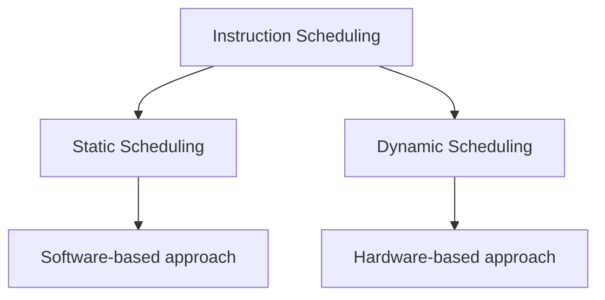
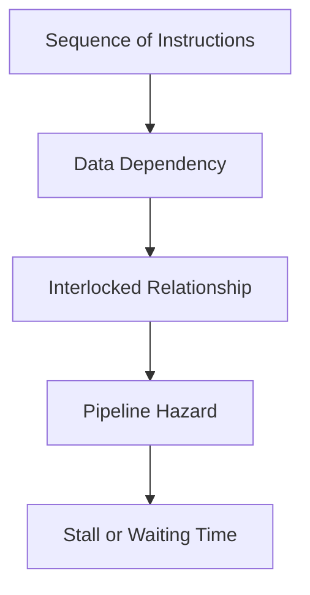
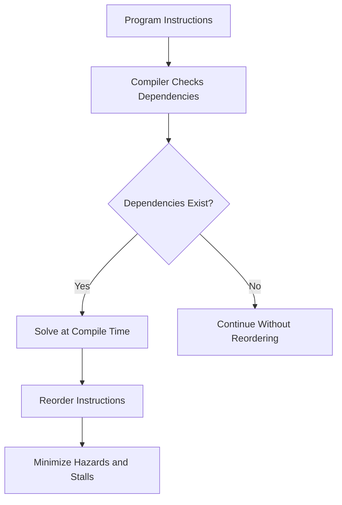

# Static Scheduling

## Lesson Context

Instruction execution phases and the mechanisms used in an instruction pipeline help to improve the performance of a pipeline processor. After discussing those two areas, the lesson introduces instruction scheduling as another method for improving pipeline-processor performance.

The lesson explains:

- What scheduling means
- Why instruction scheduling is required
- Static scheduling
- Dynamic scheduling
- Why the processor may need to move from static scheduling to dynamic scheduling
- How static scheduling rearranges instructions
- A complete example of static instruction scheduling


## Scheduling

Scheduling means arranging items, concepts, or tasks in a proper manner. When a task is properly scheduled, it can be completed successfully.

For example, meetings are scheduled in companies so that the work of employees handling different tasks does not overlap. In the same way, scheduling is important when a processor has to execute instructions. Without scheduling, the processor may not execute properly or may take a long time to execute.

Scheduling is therefore used to overcome unnecessary waiting time.

## Instruction Scheduling

Instruction scheduling means arranging instructions in a proper manner so that hazards can be minimized.

In the lesson, hazards are described as:

- A gap between instructions
- Waiting time
- Errors

Instruction scheduling is used to minimize these hazards.

### Types of Instruction Scheduling

Instruction scheduling is of two types:

1. **Static Scheduling**
2. **Dynamic Scheduling**

| Scheduling Type | Approach |
|---|---|
| Static Scheduling | Software-based approach |
| Dynamic Scheduling | Hardware-based approach |

In a software-based approach, modifications are made through programming. In a hardware-based approach, hardware parts and their arrangement are considered so that instructions can be executed without hazards, or with minimized hazards.




## Data Dependency, Interlocked Relationship, and Pipeline Stall

Data dependencies in a sequence of instructions create an **interlocked relationship**. This relationship creates stalls in the pipeline.

A **stall** is a gap or waiting time in instruction execution. One clock cycle may remain as a gap before the next required operation can be performed.

Consider a sequence of instructions in which one register value is moved and then used by another instruction. The later instruction cannot execute until the earlier instruction has completed. Therefore, a dependency relationship exists between the instructions.



Static instruction scheduling is used to overcome or minimize this problem.

## Static Scheduling

Static scheduling is a **software-based approach**.

The word *static* means that the instruction is always scheduled by the compiler. A program is first written and then processed by the compiler. When the compiler schedules the instructions, the technique is called **static scheduling**.

The compiler is software. Therefore, static scheduling is called a software-based approach.

### Work of the Compiler

The compiler:

1. Checks whether any dependencies exist among the instructions.
2. Identifies whether one instruction depends on another instruction.
3. If dependencies exist, solves them at compile time.
4. Performs this work before program execution.
5. Reorders the data or instructions.



After writing a program, the program is compiled before it is run. During compilation, the compiler rearranges the instructions. This rearrangement helps to minimize hazards and avoid stalls during execution.


## Compiler Techniques for Static Scheduling

Compiler techniques are used for scheduling or rearranging instructions.

The compiler can:

- Separate dependent instructions.
- Increase the separation between dependent instructions.
- Keep dependent and independent instructions apart.
- Execute an independent instruction between two dependent instructions.

Suppose one instruction depends on another and cannot execute immediately. Instead of placing the dependent instruction directly after the first instruction, the compiler may place a third, independent instruction between them. This creates the separation required for the earlier instruction to complete.

The rearrangement of instructions must not affect the final output.

By separating dependent instructions or increasing the distance between dependencies, the number of hazard stalls is reduced.

## Example of Static Scheduling

Consider:

\[
A = B + C
\]

\[
D = E \times F
\]

The values \(A, B, C, D, E,\) and \(F\) are stored in memory.

The lesson first states that a load has a latency, or takes one cycle to execute. During the explanation of the instruction sequence, it then describes each load as taking two cycles and explains that two pipelined load instructions require a total of three cycles, creating a one-clock-cycle wait before the dependent operation.

### Original Code

For \(A = B + C\):

```text
LOAD  R1, B
LOAD  R2, C
STALL
ADD   R3, R1, R2
STORE A, R3
```

- \(B\) is loaded into \(R1\).
- \(C\) is loaded into \(R2\).
- The `ADD` operation depends on both loaded values.
- The processor must wait until the loads are complete.
- This produces one stall.
- \(R1\) and \(R2\) are added, and the result is placed in \(R3\).
- The value of \(R3\) is stored in \(A\).

For \(D = E \times F\):

```text
LOAD  R4, E
LOAD  R5, F
STALL
MUL   R6, R4, R5
STORE D, R6
```

- \(E\) is loaded into \(R4\).
- \(F\) is loaded into \(R5\).
- The multiplication cannot be performed until both load instructions are complete.
- This produces another stall.
- \(R4\) and \(R5\) are multiplied, and the result is placed in \(R6\).
- The value of \(R6\) is stored in \(D\).

The original code contains **two stalls**.

| Order | Original Instruction | Purpose |
|---:|---|---|
| 1 | `LOAD R1, B` | Load \(B\) into \(R1\) |
| 2 | `LOAD R2, C` | Load \(C\) into \(R2\) |
| 3 | `STALL` | Wait for the dependent values |
| 4 | `ADD R3, R1, R2` | Calculate \(B+C\) |
| 5 | `STORE A, R3` | Store the result in \(A\) |
| 6 | `LOAD R4, E` | Load \(E\) into \(R4\) |
| 7 | `LOAD R5, F` | Load \(F\) into \(R5\) |
| 8 | `STALL` | Wait for the dependent values |
| 9 | `MUL R6, R4, R5` | Calculate \(E\times F\) |
| 10 | `STORE D, R6` | Store the result in \(D\) |

## Code After Applying Static Instruction Scheduling

The compiler rearranges the instructions to overcome or minimize the stalls. The rearrangement does not affect the final output.

```text
LOAD  R1, B
LOAD  R2, C
LOAD  R4, E
ADD   R3, R1, R2
LOAD  R5, F
STORE A, R3
MUL   R6, R4, R5
STORE D, R6
```

### Explanation of the Rearranged Code

1. `LOAD R1, B` loads \(B\) into \(R1\).
2. `LOAD R2, C` loads \(C\) into \(R2\).
3. The compiler does not wait before the addition. It places the independent instruction `LOAD R4, E` in that position.
4. While the other instruction is being processed, the values of \(B\) and \(C\) become available in \(R1\) and \(R2\).
5. `ADD R3, R1, R2` can now be performed.
6. Before storing the addition result, the compiler places another instruction, `LOAD R5, F`.
7. `STORE A, R3` stores the addition result in \(A\).
8. `MUL R6, R4, R5` multiplies the values in \(R4\) and \(R5\).
9. `STORE D, R6` stores the multiplication result in \(D\).

| Order | Scheduled Instruction | Purpose |
|---:|---|---|
| 1 | `LOAD R1, B` | Load \(B\) into \(R1\) |
| 2 | `LOAD R2, C` | Load \(C\) into \(R2\) |
| 3 | `LOAD R4, E` | Fill the waiting position with an independent instruction |
| 4 | `ADD R3, R1, R2` | Calculate \(B+C\) after its inputs become available |
| 5 | `LOAD R5, F` | Load the next independent value |
| 6 | `STORE A, R3` | Store the addition result |
| 7 | `MUL R6, R4, R5` | Calculate \(E\times F\) |
| 8 | `STORE D, R6` | Store the multiplication result |


## Why Dynamic Scheduling Is Required

Static scheduling works when dependencies are known at compile time and the compiler can identify them.

If the compiler is unable to understand or identify the dependencies at compile time, dynamic scheduling is used.

Therefore:

- **Dependencies known at compile time:** Static scheduling can be used.
- **Dependencies unknown at compile time:** Dynamic scheduling is used.

The detailed explanation of dynamic scheduling is continued in the next lesson.

## Complete Summary

- Instruction scheduling arranges instructions properly to minimize hazards.
- Hazards include gaps, waiting time, and errors.
- Static scheduling is a software-based approach.
- Dynamic scheduling is a hardware-based approach.
- Data dependencies create interlocked relationships.
- Interlocked relationships create stalls in a pipeline.
- A stall is a gap or waiting time in instruction execution.
- In static scheduling, instructions are scheduled by the compiler.
- The compiler checks dependencies before execution.
- Dependencies are handled at compile time.
- The compiler reorders instructions.
- It may separate dependent instructions or increase the separation between them.
- Independent instructions can be placed between dependent instructions.
- Reordering must not affect the final output.
- Reordering reduces the number of hazard stalls.
- If dependencies are unknown at compile time, dynamic scheduling is used.
