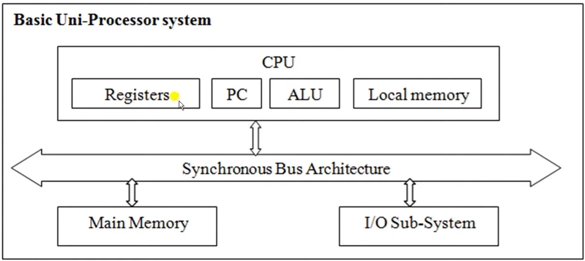
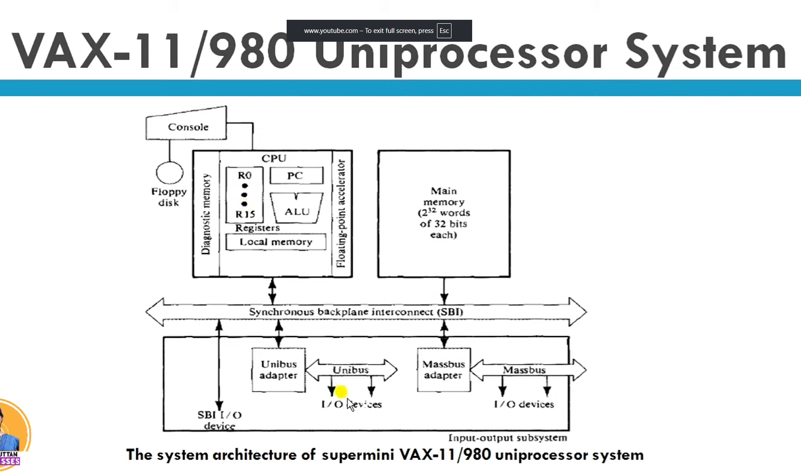
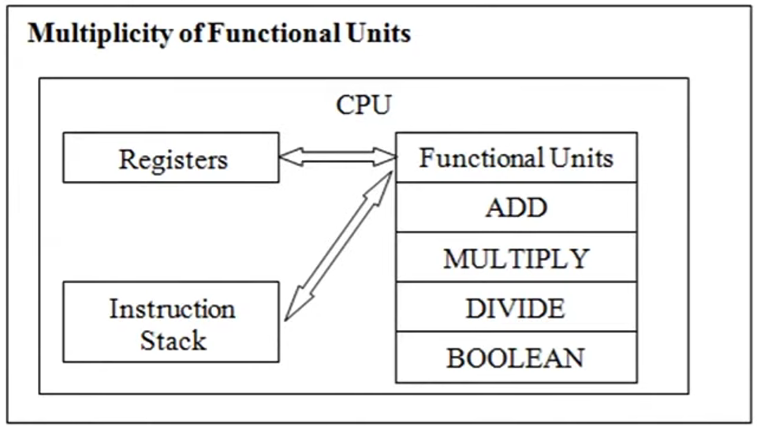
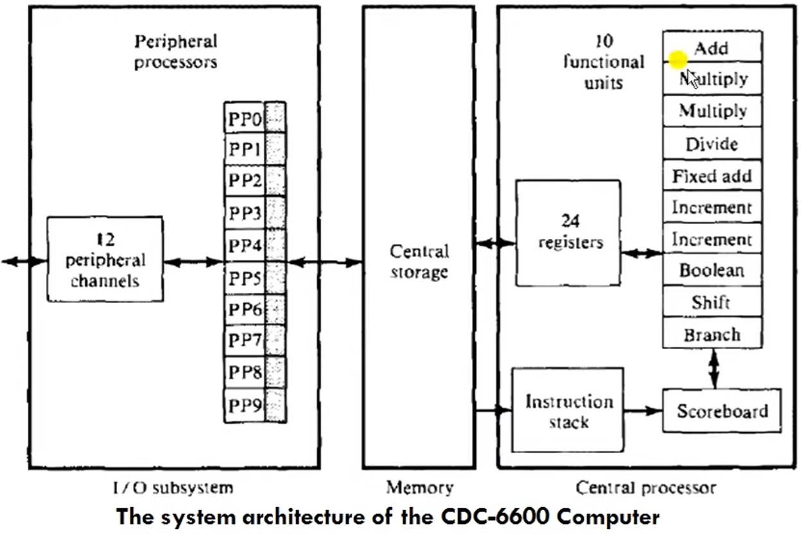
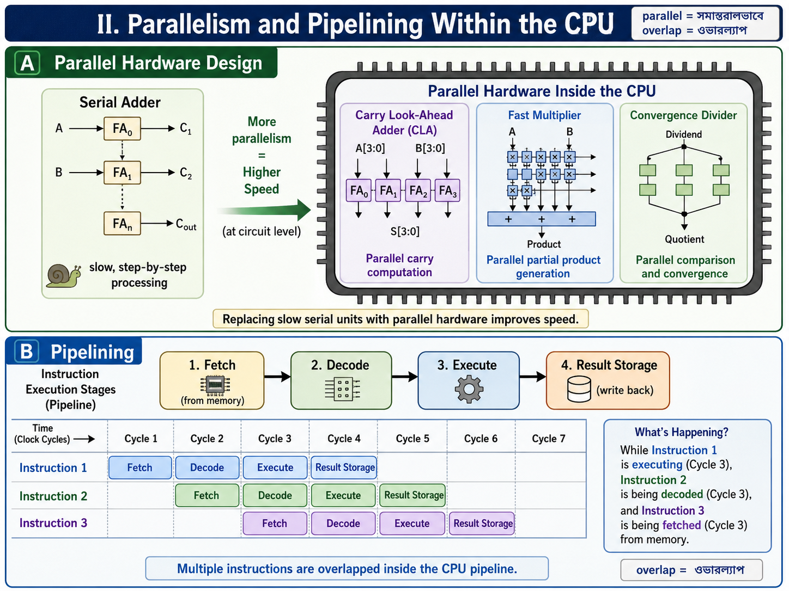
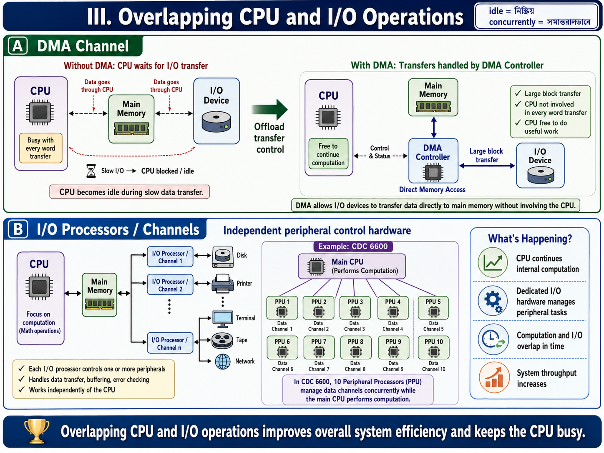

# Uni-Processor Architecture and Parallel Processing Mechanisms

#### 1. Basic Uni-Processor Architecture

A uni-processor computer system (ইউনিপ্রসেসর সিস্টেম) is a classic machine configuration that contains a single central processing unit. Even with only one processor core, it needs to execute computational programs efficiently.

##### Three Core Subsystems

A basic uni-processor system is composed of three main architectural blocks:

* **Central Processing Unit (CPU):** The main processing element that contains a set of General-Purpose Registers ($R_0$ to $R_{15}$), a Program Counter (PC) to track the address of the next instruction, a Processor Status Word (PSW), an Arithmetic Logic Unit (ALU), and a dedicated local cache memory.
* **Main Memory Unit:** The storage matrix where all program instructions and operational data blocks reside.
* **Input/Output (I/O) System:** The system hardware interface that manages communication with external peripheral devices.

##### Communication Structure

All three major subsystems communicate with each other using a shared **Common Synchronous Bus Architecture** (सिंक्रोनस बस). This bus acts as the data highway between the CPU, memory, and the I/O interface.

#### 2. Case Study: VAX 11/980 Uni-Processor Architecture

The VAX 11/980 is a standard real-world implementation of a single-processor computer system configuration. It utilizes a special bus called the **Synchronous Backplane Interconnect (SBI)** to link all hardware subsystems.

##### Detailed Hardware Components of VAX 11/980:

* **CPU (Master Controller):** Controls every unit in the system. It contains exactly 16 General-Purpose Registers (GPRs) where each register is 32-bits wide ($R_0$ to $R_{15}$). It includes an ALU with an optional **Floating-Point Accelerator (FPA)** to speed up complex mathematical tasks, and a local cache memory with an optional diagnostic memory unit. The operator can interact directly with the CPU using a console linked to a floppy disk drive.
* **Memory Subsystem:** Configured as a 32-bit word addressable system. The memory uses 32-bit addresses and 32-bit data words ($2^{32}$ words word length).
* **I/O Subsystem:** High-speed peripheral devices connect directly to the main SBI bus. Slower components connect through dedicated hardware adapters called the **Unibus Adapter (UBA)** and the **Massbus Adapter (MBA)** to prevent the system from slowing down.

#### 3. Parallel Processing Mechanisms in Uni-Processor Systems

Even though a uni-processor has only one physical CPU core, we can introduce parallel processing internally through specific design methods. These methods are divided into **Hardware Methods** and **Software Methods**.

### A. Hardware-Based Mechanisms

#### I. Multiplicity of Functional Units

Instead of having just one general ALU that does all the work, the internal structure of the ALU is broken down into multiple, specialized **Functional Units** that operate concurrently (সমান্তরালভাবে).

* **Working Principle:** A single instruction stream is distributed among different independent blocks like dedicated adders, multipliers, dividers, shifters, and incrementers. A control block called a **Scoreboard** tracks which functional units and registers are free to schedule the next operations without delay.
* **Real-World Example:** The **CDC 6600** computer architecture, which integrates 10 parallel specialized functional units along with 24 internal registers inside a single CPU.

#### II. Parallelism and Pipelining Within the CPU

* **Parallel Hardware Design:** Replacing slow serial adders with high-speed parallel adders like **Carry Look-Ahead Adders (CLA)**, fast multipliers, and convergence dividers to increase processing speed at the circuit level.
* **Pipelining (पाइपलाइनिंग):** Breaking the standard instruction execution cycle into separate stages (Fetch, Decode, Execute, and Result Storage). Multiple instructions are overlapped (ওভারল্যাপ) inside the execution pipeline. While instruction 1 is executing, instruction 2 is being decoded, and instruction 3 is being fetched from memory.

### Detailed Exam Notes: Parallelism in Uni-Processor Systems

#### 1. Overlapped CPU and I/O Operations (Hardware Method)

* **Core Concept:** To stop the main processor from sitting idle, input/output tasks are offloaded to specialized hardware parts like I/O controllers, channels, and separate I/O processors. This design allows the CPU to execute math operations while I/O tasks are happening concurrently (সমান্তরালভাবে).
* **Direct Memory Access (DMA):** The DMA channel provides a direct data transfer pathway between peripheral I/O devices and the main memory. It completely bypasses the CPU, freeing up the processor to handle other computational instructions.
* **I/O Multiprocessing Case Study:** A classic real-world example is the **CDC 6600** supercomputer architecture. It integrates 10 separate peripheral I/O processors that run concurrently to speed up data transfer between the central CPU/memory complex and the outside world.

#### 2. Hierarchical Memory System (Hardware Method)

* **The Speed Gap Problem:** A modern CPU runs thousands of times faster than standard main memory (RAM). This massive speed gap creates a performance bottleneck (সীমাবদ্ধতা).
* **System Hierarchy Structure:** To bridge this speed gap and broaden the overall memory bandwidth (ব্যান্ডউইথ) of the CPU, memory resources are arranged in a multi-level pyramid structure based on capacity and speed:
* **Pyramid Order (From Top to Bottom):** 1. Registers (Highest speed, lowest storage capacity)
2. Cache Memory (Ultra-fast buffer memory)
3. Main Memory (RAM or core storage matrix)
4. Hard Disk / Fixed-head disks (Secondary storage)
5. Magnetic Tapes / Moving head disks (Highest capacity, lowest operational speed)

#### 3. Balancing of Subsystem Bandwidth (Hardware Method)

* **Definition of Bandwidth:** System bandwidth is defined as the total number of hardware operations performed per unit time. For the main memory component, it is measured by the number of data words that can be accessed per second.
* **The Subsystem Balance:** A computer has three primary subsystems: CPU, Main Memory, and I/O devices. The CPU is the fastest unit, while the I/O devices are the slowest. We must balance these speed gaps to keep the system efficient.
* **Bandwidth Balancing Between CPU and Memory:** Closed up by putting a fast **Cache Memory** between the CPU and the slower main memory module.
* **Bandwidth Balancing Between Memory and I/O Devices:** Managed by placing specialized **I/O Channels** with different operating speeds between the slow peripheral units and the main memory to act as data buffers.

#### 4. Software Methods of Parallelism

##### I. Multiprogramming

* **Process Composition:** Every standard computer program consists of either CPU-bound instructions (computation intensive/গণনানির্ভর) or I/O-bound instructions (input-output intensive), or a combination of both.
* **Working Mechanism:** When a computer runs multiple processes together, the CPU might get busy with a CPU-bound task. At that exact instance, a waiting I/O-bound process is automatically allocated to free I/O hardware resources for execution.
* **Parallel Benefit:** Different processes do not have to wait for each other to complete their entire lifecycle. They execute simultaneously in an interleaved fashion, creating software-level parallelism.

##### II. Time Sharing Systems

* **The Monopolization Problem:** In basic systems, if one single process takes a very long time in the CPU or during I/O processing, it reduces the overall system performance because all other programs must wait in a long queue.
* **Time Slice Allocation:** To solve this queue problem, the operating system scheduler assigns a specific, fixed duration called a **Time Slice** (টাইম স্লাইস) to every running process.
* **Pre-emptive Strategy:** The system uses a strict pre-emptive (ফোর্সলি থামানো) strategy. When a program's allocated time span finishes, the scheduler forcefully pauses the process and moves it into a waiting state. The scheduler then hands over the CPU resources to the next waiting program. This cycle continues rapidly until all tasks are finished.