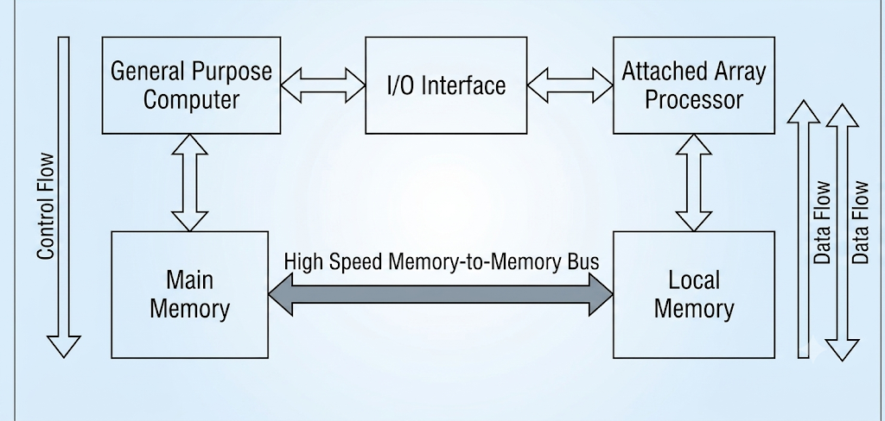
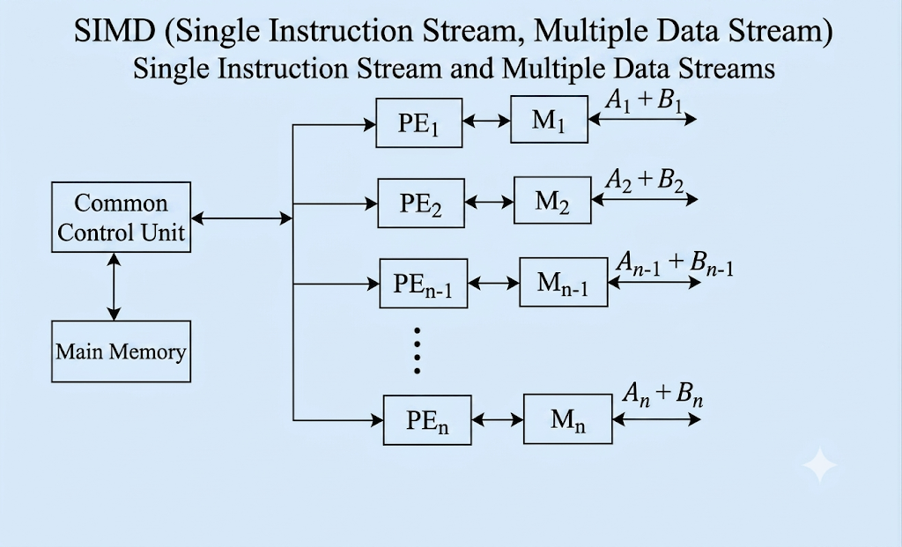

=== "বাংলা"

    ## ভূমিকা: এরে প্রসেসর (Array Processor) কী এবং কেন প্রয়োজন?

    আমাদের দৈনন্দিন কম্পিউটিংয়ে অনেক সময় এমন কিছু গাণিতিক ও বৈজ্ঞানিক সমস্যা আসে, যেখানে অত্যন্ত জটিল এবং বিশাল পরিমাণের ডাটা (Massive and Complex Data) প্রসেস করার প্রয়োজন হয়। উদাহরণস্বরূপ: আবহাওয়া পূর্বাভাস, বৈজ্ঞানিক সিমুলেশন, বা গ্রাফিক্স প্রসেসিং।

    এই ধরণের বিশাল ডাটা আমরা একটি সাধারণ বা সনাতন কম্পিউটার (Conventional Computer) দিয়েও প্রসেস করাতে পারি। কিন্তু সমস্যা হলো, সাধারণ কম্পিউটার এই ডাটাগুলোকে একটির পর একটি (Sequential) প্রসেস করে। ফলে ওই জটিল ডাটা এক্সিকিউট করতে আমাদের অনেক দিন বা এমনকি কয়েক সপ্তাহ সময় লেগে যেতে পারে।

    এই সমস্যার সমাধান এবং কম্পিউটারের কার্যক্ষমতা (Performance) বহুগুণ বাড়িয়ে দ্রুত ফলাফল পাওয়ার জন্য সবথেকে সেরা বিকল্প হলো **এরে প্রসেসর (Array Processor)**।

    * **মূল কাজ:** এরে প্রসেসর মূলত একটি বিশাল ডাটার অ্যারে (Large Array of Data)-র ওপর কম্পিউটেশন বা গণনা করে।
    * **কাজের প্রক্রিয়া:** আমরা যখন এই বিশাল পরিমাণের ডাটা এরে প্রসেসরের ইনপুট হিসেবে দিই, তখন এটি অত্যন্ত দ্রুত ও নিখুঁতভাবে (Fastly & Quickly) ডাটাগুলোকে এক্সিকিউট করে আমাদের জন্য আউটপুট বা রেজাল্ট তৈরি করে দেয়।

    ---

    ## এরে প্রসেসরের প্রকারভেদ (Types of Array Processors)

    অভ্যন্তরীণ গঠন এবং সংযোগের ওপর ভিত্তি করে এরে প্রসেসরকে মূলত দুই ভাগে ভাগ করা যায় বা দুটি উপায়ে তৈরি করা যায়:

    1. **অ্যাটাচড এরে প্রসেসর (Attached Array Processor)**
    2. **এসআইএমডি এরে প্রসেসর (SIMD Array Processor)**

    > **গুরুত্বপূর্ণ নোট:** এই দুটি প্রসেসরেরই মূল লক্ষ্য এক—উভয়ই **ভেক্টর ইনস্ট্রাকশন (Vector Instructions)** এক্সিকিউট এবং ম্যানিপুলেট করে। ডাটা দ্রুত প্রসেস করা এবং সিস্টেমের কার্যক্ষমতা বাড়ানোই এদের কাজ। এদের মধ্যে মূল পার্থক্যটি হলো এদের **অভ্যন্তরীণ সাংগঠনিক কাঠামো (Internal Organization)** বা আর্কিটেকচারে।

    ### ১. অ্যাটাচড এরে প্রসেসর (Attached Array Processor)

    অ্যাটাচড এরে প্রসেসর হলো এমন একটি প্রসেসর যা স্বাধীনভাবে কাজ না করে একটি সহায়ক প্রসেসর (**Auxiliary Processor**) হিসেবে কাজ করে। এটিকে একটি সাধারণ বা সনাতন কম্পিউটারের (General Purpose Computer) সাথে বাহ্যিক ডিভাইস বা পেরিফেরাল ডিভাইস (Peripheral Device) হিসেবে যুক্ত বা অ্যাটাচড করা হয়।

    যখনই মেইন কম্পিউটারের কাছে কোনো বিশাল ও জটিল ডাটার অ্যারে আসে, তখন সে নিজে তা প্রসেস না করে এই অ্যাটাচড এরে প্রসেসরের কাছে পাঠিয়ে দেয়।

    #### **অভ্যন্তরীণ গঠন ও ব্লক ডায়াগ্রামের ব্যাখ্যা:**

    একটি অ্যাটাচড এরে প্রসেসর সিস্টেম মূলত নিচের অংশগুলো নিয়ে গঠিত হয়:

    * **হোস্ট কম্পিউটার (Host / General Purpose Computer):** এটি মূল কম্পিউটার যা সাধারণ কাজগুলো নিয়ন্ত্রণ করে।
    * **ইনপুট-আউটপুট ইন্টারফেস (I/O Interface):** হোস্ট কম্পিউটার এবং অ্যাটাচড প্রসেসরের কাজের গতি এবং অভ্যন্তরীণ কাঠামোর মধ্যে যে পার্থক্য বা অমিল থাকে, তা দূর বা রিজলভ (Resolve) করার কাজ করে এই ইন্টারফেসটি।
    * **মেইন মেমোরি (Main Memory):** এটি হোস্ট কম্পিউটারের নিজস্ব মেমোরি, যেখানে সমস্ত প্রাথমিক ইনস্ট্রাকশন এবং ডাটা জমা থাকে।
    * **লোকাল মেমোরি (Local Memory):** এটি স্বয়ং এরে প্রসেসরের নিজস্ব মেমোরি।
    * **হাই-স্পিড মেমোরি-টু-মেমোরি বাস (High-Speed Memory-to-Memory Bus):** মেইন মেমোরি এবং লোকাল মেমোরিকে সরাসরি যুক্ত করার জন্য এই বিশেষ ও দ্রুতগতির বাসটি ব্যবহার করা হয়।

    #### **কার্যপদ্ধতি ও ডাটা ফ্লো (Working & Data Flow):**

    1. কম্পিউটারের সমস্ত ইনস্ট্রাকশন এবং ম্যাসিভ ডাটা সবার প্রথমে হোস্ট কম্পিউটারের **Main Memory**-তে স্টোর বা জমা হয়।
    2. এরপর, Massive/Complex Data → High-Speed Memory-to-Memory Bus দিয়ে Local Memory-তে transfer হয়
    3. লোকাল মেমোরিতে ডাটা আসার পর, এরে প্রসেসর সেখান থেকে ডাটা ফ্যাচ (Fetch) করে।
    4. এখানে প্রসেসিংয়ের কাজ একা হয় না; বরং জটিল ক্যালকুলেশনগুলোকে **মাল্টিপল ফাংশনাল ইউনিটের (Multiple Functional Units)** মাধ্যমে সমান্তরালভাবে বা প্যারালালি (**Parallelly**) এক্সিকিউট করা হয়। এর ফলে প্রসেসিং স্পিড অনেক হাই (High Performance) হয়।
    5. এক্সিকিউশন শেষ হওয়ার পর এরে প্রসেসর ফলাফলটিকে পুনরায় তার **Local Memory**-তে সেভ করে।
    6. সবশেষে, লোকাল মেমোরি থেকে সেই আউটপুট বা রেজাল্ট আবার হাই-স্পিড বাসের মাধ্যমে মেইন কম্পিউটারের **Main Memory**-তে ফেরত চলে আসে। এভাবেই পুরো কার্যপ্রক্রিয়া সম্পন্ন হয়।
       

    ### ২. এসআইএমডি এরে প্রসেসর (SIMD Array Processor)

    **SIMD**-এর পূর্ণরূপ হলো **Single Instruction Stream, Multiple Data Stream** (একক ইনস্ট্রাকশন স্ট্রিম এবং একাধিক ডাটা স্ট্রিম)। এর নাম থেকেই বোঝা যায় যে, এখানে ইনস্ট্রাকশন বা কমান্ড থাকবে মাত্র একটি, কিন্তু সেই একটি কমান্ড একই সময়ে আলাদা আলাদা অনেকগুলো ডাটার ওপর কাজ করবে।

    এই সিস্টেমে একটি বিশাল ডাটার অ্যারেকে প্যারালালি এক্সিকিউট করার জন্য **ম্যাল্টিপল প্রসেসিং ইউনিট (Multiple Processing Units)** ব্যবহার করা হয়।

    #### **অভ্যন্তরীণ গঠন ও ব্লক ডায়াগ্রামের ব্যাখ্যা:**

    এসআইএমডি এরে প্রসেসরের আর্কিটেকচার বা গঠন নিচে দেওয়া হলো:
    
    * **কমন কন্ট্রোল ইউনিট (Common Control Unit / Master CPU):** এটি পুরো সিস্টেমের মাথা বা মাস্টার প্রসেসর। এর কাজ হলো ইনস্ট্রাকশন মেইন মেমোরি থেকে আনা এবং নিচের প্রসেসিং এলিমেন্টগুলোকে নিয়ন্ত্রণ করা।
    * **মেইন মেমোরি (Main Memory):** মাস্টার সিপিইউ-এর সাথে মেইন মেমোরি যুক্ত থাকে, যেখানে প্রসেস করার মতো সমস্ত ইনস্ট্রাকশন জমা থাকে।
    * **প্রসেসিং এলিমেন্টস (Processing Elements - PE):** এখানে অনেকগুলো প্রসেসর প্যারালালি বসানো থাকে, যাদের $PE_1, PE_2, PE_3 ... PE_n$ বলা হয়।
    * **লোকাল মেমোরি (Local Memory - M):** প্রতিটি প্রসেসিং এলিমেন্টের (PE) নিজস্ব আলাদা লোকাল মেমোরি থাকে, যেগুলোকে $M_1, M_2, M_3 ... M_n$ বলা হয়। এছাড়াও প্রতিটি PE-র নিজস্ব রেজিস্টার এবং I/O ডিভাইস থাকে।
    * **সিঙ্ক্রোনাইজেশন সংযোগ:** মাস্টার সিপিইউ বা কমন কন্ট্রোল ইউনিটটি প্রতিটি প্রসেসিং এলিমেন্টের সাথে সরাসরি যুক্ত থাকে যাতে সবাইকে একসাথে একই তালে (Synchronized ভাবে) চালানো যায়।

    #### **ভিডিওর উদাহরণসহ কার্যপদ্ধতি:**

    ধরা যাক, আমাদের একটি গাণিতিক অপারেশন করতে হবে, যেখানে দুটি অ্যারেকে যোগ করতে হবে:

    $$A_i + B_i$$

    এখানে $A$ এবং $B$ হলো ডাটার দুটি বিশাল অ্যারে, যা মেইন মেমোরিতে আছে। মাস্টার সিপিইউ মেইন মেমোরি থেকে একটি মাত্র ইনস্ট্রাকশন বা নির্দেশ আনবে, তা হলো—**"যোগ (Addition) করো"**। কিন্তু ডাটা আলাদা আলাদা প্রসেসিং এলিমেন্টে ভাগ হয়ে যাবে:

    * **$PE_1$ (প্রসেসিং এলিমেন্ট ১):** তার নিজস্ব মেমোরি $M_1$ ব্যবহার করে একই সময়ে যোগ করবে $A_1 + B_1$
    * **$PE_2$ (প্রসেসিং এলিমেন্ট ২):** তার নিজস্ব মেমোরি $M_2$ ব্যবহার করে একই সময়ে যোগ করবে $A_2 + B_2$
    * **$PE_3$ (প্রসেসিং এলিমেন্ট ৩):** যোগ করবে $A_3 + B_3$
    * **$PE_n$ (প্রসেসিং এলিমেন্ট $n$):** শেষ ডাটাটি যোগ করবে $A_n + B_n$

    **ফলাফল:** যেহেতু সমস্ত প্রসেসিং এলিমেন্ট (PE) একই সময়ে প্যারালালি নিজ নিজ ডাটার ওপর কাজ করছে, তাই সিস্টেমের **থ্রুটপুট (Throughput)** বা আউটপুট দেওয়ার গতি কয়েক গুণ বেড়ে যায় এবং খুব দ্রুত ফলাফল পাওয়া যায়।

    ## সারসংক্ষেপ (Conclusion)

    ভিডিওর পরিশেষে আমরা জানতে পারলাম যে, এরে প্রসেসর হলো লার্জ ডাটা সেটকে দ্রুত প্রসেস করার একটি অত্যন্ত শক্তিশালী মাধ্যম।

    * **অ্যাটাচড এরে প্রসেসরে** আমরা সাধারণ কম্পিউটারের সাথে একটি এক্সটার্নাল অক্সিলারি প্রসেসর যুক্ত করে মেমোরি-টু-মেমোরি বাসের মাধ্যমে প্যারালাল প্রসেসিং করি।
    * অন্যদিকে, **এসআইএমডি এরে প্রসেসরে** একটি সেন্ট্রাল মাস্টার সিপিইউ-এর অধীনে অনেকগুলো প্রসেসিং এলিমেন্ট (PE) ব্যবহার করে একই নির্দেশ দিয়ে ভিন্ন ভিন্ন ডাটার ওপর একসাথে কাজ করিয়ে দ্রুততম সময়ে নিখুঁত আউটপুট লাভ করি।

    ---

    ---

=== "English"

    ## Introduction: What is an Array Processor & Why Do We Need It?

    In modern computing, we often encounter complex scientific or mathematical problems that involve processing a vast amount of data, known as **Massive and Complex Data** (e.g., weather forecasting, graphics rendering, aerodynamic simulations).

    We can technically execute this massive and complex data using a conventional or traditional computer. However, because a conventional computer processes data sequentially (one after another), executing such complex datasets could take days or even several weeks.

    To overcome this limitation, optimize system performance, and obtain rapid outputs, the best alternative is to use an **Array Processor**.

    * **Core Function:** An array processor is specifically designed to perform computations on a large array of data.
    * **Working Process:** When we feed a large array of data into an array processor, it executes the operations extremely fast and generates the final output almost instantly.

    ---

    ## Types of Array Processors

    Based on their internal architecture and how they are integrated into a system, array processors can be structured in two ways:

    1. **Attached Array Processor**
    2. **SIMD Array Processor**

    > **Key Takeaway:** Ultimately, both types of array processors serve the same objective—they execute and manipulate **Vector Instructions**. Their primary goal is to accelerate computation and elevate system performance; they only differ in their **Internal Organization** and architectural design.

    ### 1. Attached Array Processor

    An Attached Array Processor is not an independent system; rather, it acts as an **Auxiliary Processor**. It is connected as a peripheral or external device to a standard, traditional host computer (**General Purpose Computer**).

    Whenever the host computer receives massive array-structured datasets, it offloads the heavy computation tasks to the attached array processor to enhance execution speed.

    #### **Internal Architecture & Block Diagram Explanation:**
    
    An Attached Array Processor system consists of the following fundamental blocks:
    
    

    * **Host Computer (General Purpose Computer):** The main computer that manages standard system operations and controls the workflow.
    * **Input-Output (I/O) Interface:** This interface connects the host computer with the attached processor. Its primary job is to resolve any architectural or speed differences between the two units.
    * **Main Memory:** The host computer's proprietary memory where all primary instructions and incoming data are originally stored.
    * **Local Memory:** The dedicated internal memory belonging strictly to the attached array processor.
    * **High-Speed Memory-to-Memory Bus:** A dedicated, ultra-fast bus used to establish a direct connection between the Main Memory of the host and the Local Memory of the array processor.

    #### **Working Mechanism & Data Flow:**

    1. All instructions and massive datasets are initially stored in the **Main Memory** of the host computer.
    2. The complex and large array of data is then transferred from the Main Memory to the **Local Memory** of the attached array processor via the **High-Speed Memory-to-Memory Bus**.
    3. Once the data lands in the local memory, the attached array processor fetches it for execution.
    4. Instead of executing the data sequentially, the complex tasks are distributed across **Multiple Functional Units** to be processed simultaneously or in parallel (**Parallel Processing**). This architecture ensures exceptionally high performance.
    5. After completing the execution, the array processor stores the computed results back into its **Local Memory**.
    6. Finally, these results/outputs are routed back from the Local Memory to the **Main Memory** of the host computer via the high-speed bus, completing the execution cycle.

    ---

    ### 2. SIMD Array Processor

    **SIMD** stands for **Single Instruction Stream, Multiple Data Stream**. As the name implies, the system receives only a single instruction or command from the control unit, but that identical command is executed simultaneously across multiple distinct pieces of data.

    This system uses **Multiple Processing Units** running synchronously to compute large arrays of data in parallel.

    #### **Internal Architecture & Block Diagram Explanation:**

    The architectural layout of an SIMD Array Processor includes:
    
    * **Common Control Unit (Master CPU):** This is the brain or master controller of the entire architecture. It fetches instructions from the memory and orchestrates the processing elements.
    * **Main Memory:** Directly connected to the Master CPU, this memory holds all the primary instructions waiting to be executed.
    * **Processing Elements (PE):** This consists of an array of multiple parallel processing units designated as $PE_1, PE_2, PE_3 ... PE_n$.
    * **Local Memory (M):** Every individual Processing Element (PE) has its own dedicated local memory unit, labeled as $M_1, M_2, M_3 ... M_n$, along with its own set of registers and I/O handlers.
    * **Synchronization Link:** The Common Control Unit is directly connected to every single Processing Element, ensuring that all PEs perform operations in perfect synchronization.

    #### **Working Mechanism with the Video Example:**

    Let's understand the execution flow using the exact example from the video. Suppose we need to perform an array addition operation:

    $$A_i + B_i$$

    Here, $A$ and $B$ are large data arrays stored in the Main Memory. The Master CPU fetches a single instruction from the memory, which is **"ADD"**. While the instruction remains a single command, the actual data arrays are divided among the multiple Processing Elements (PEs):

    * **$PE_1$ (Processing Element 1):** Utilizes its local memory $M_1$ to simultaneously execute: $A_1 + B_1$
    * **$PE_2$ (Processing Element 2):** Utilizes its local memory $M_2$ to simultaneously execute: $A_2 + B_2$
    * **$PE_3$ (Processing Element 3):** Simultanously executes: $A_3 + B_3$
    * **$PE_n$ (Processing Element $n$):** Executes the final data set in the array: $A_n + B_n$

    **Result:** Because all the Processing Elements (PEs) are executing their designated data chunks at the exact same time (parallelly), the system's **Throughput** (output rate) increases exponentially, producing final results rapidly.

    ---

    ## Summary (Conclusion)

    To conclude based on the video lecture, an array processor is a highly powerful architectural component designed to fast-track large datasets.

    * In an **Attached Array Processor**, we link an external auxiliary processor to a conventional host computer and achieve parallel processing via a high-speed memory-to-memory bus.
    * In an **SIMD Array Processor**, we leverage multiple Processing Elements (PEs) controlled by a central Master CPU to run a single instruction over multiple data streams synchronously, maximizing computational speed and efficiency.