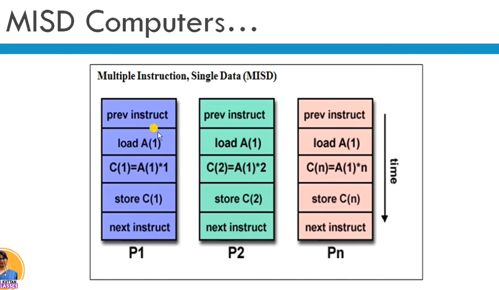
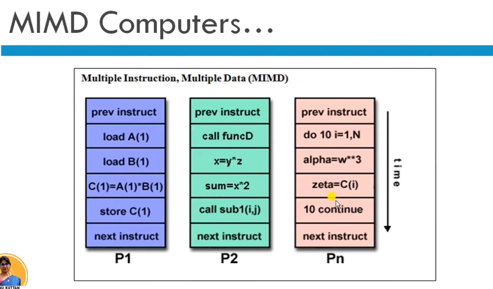
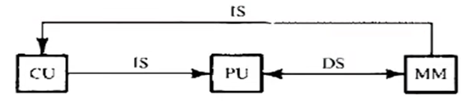
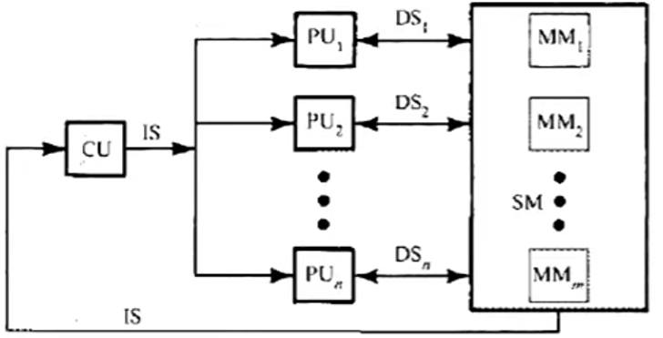
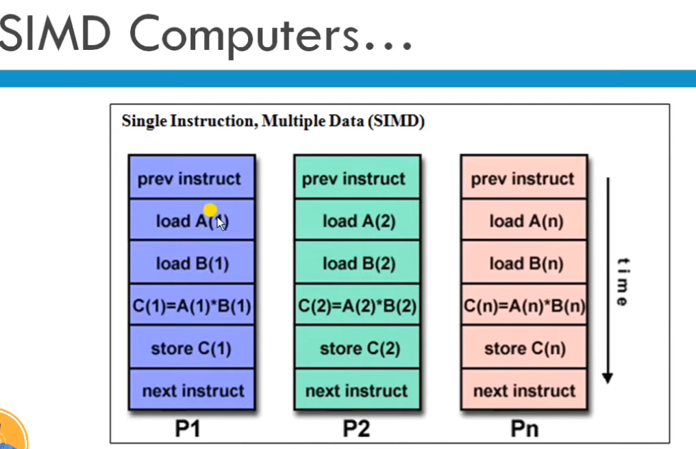
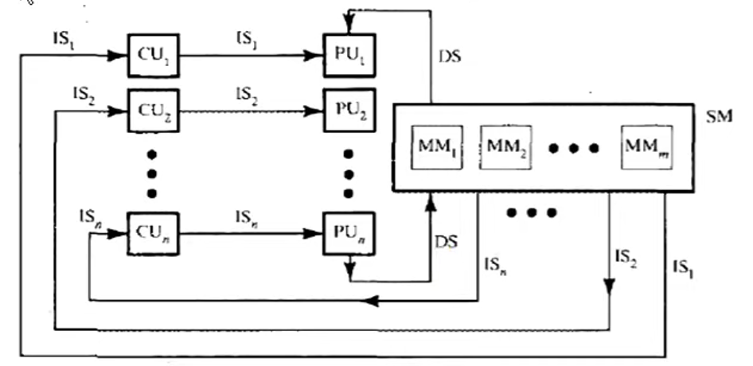
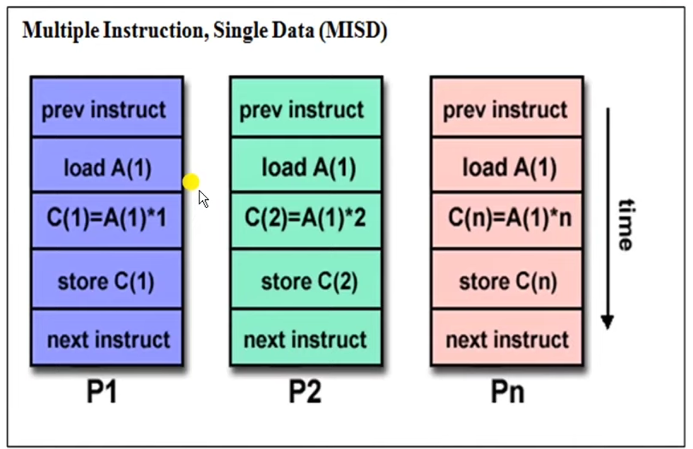
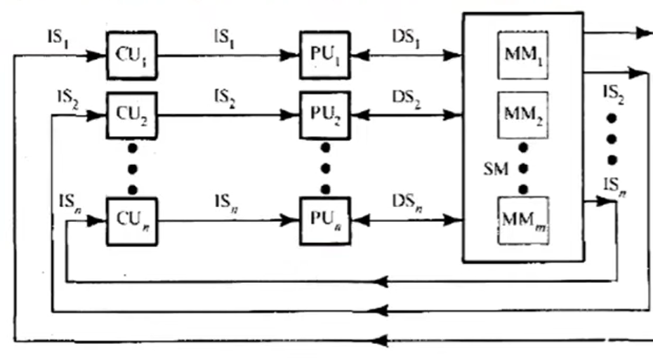

### Detailed Technical Notes on Flynn's Taxonomy Categories

#### 1. Single Instruction, Single Data (SISD) Computers



* **System Characteristics:** An SISD architecture is a standard uni-processor machine (ইউনিপ্রসেসর মেশিন) configured to run a single instruction stream acting on a single data stream.
* **Execution Paradigm:** During any single operational clock cycle, only one specific instruction stream is executed by the Central Processing Unit (CPU) targeting a single input data stream. It defines a classic serial (non-parallel) computer.
* **Instruction Overlapping:** The operations execute sequentially (ধাপ অনুসারে). However, performance speed can be enhanced by overlapping the internal pipeline stages (Pipelining). Most standard SISD uni-processor setups use this pipelined strategy.
* **Control Unit Supervision:** An SISD model can integrate more than one specialized functional unit within its processor block, but every single unit remains strictly under the direct supervision of one unified control unit.
* **Hardware Examples:** Classical personal computers, standard single-core CPU workstations, minicomputers, mainframes, CDC-6600, VAX 11, and the IBM 7001.
* **Trace Execution Visual:** As shown in `image_598d45.jpg`, instructions like `load A`, `load B`, `C = A + B`, and `store C` are executed purely step-by-step along the vertical time axis.

#### 2. Single Instruction, Multiple Data (SIMD) Computers


* **System Characteristics:** An SIMD system configuration is capable of broadcasting the exact same instruction step across all processing cores simultaneously, but each core operates on independent, different data streams.
* **Hardware Architecture:** The setup integrates a single shared control unit (CU) alongside multiple separate Processing Units (PUs) or Arithmetic Logic Units (ALUs). The master control unit issues only one instruction at a given time slice, while the array of processing units carries out calculations across multiple independent datasets simultaneously.
* **Primary Target Domains:** This synchronous model is highly suited for data-parallel scientific computing workflows because these operations involve heavy vector and matrix mathematics (ভেক্টর ও ম্যাট্রিক্স অপারেশন).
* **Hardware Examples:** Array Processors (such as ILLIAC-IV and MPP) and Vector Pipelines (such as IBM 9000, Cray X-MP, Y-MP, and Cray C90).
* **Trace Execution Visual:** As seen in the system layout of `image_599565.jpg`, multiple processing streams ($P_1, P_2, \dots, P_n$) execute the identical instructional command step at the same timeline mark (e.g., $P_1$ loads $A(1)$, $P_2$ loads $A(2)$, and $P_n$ loads $A(n)$ simultaneously).

#### 3. Multiple Instruction, Single Data (MISD) Computers

* **System Characteristics:** In an MISD computer architecture, multiple independent instruction streams operate on a single, shared data stream concurrently.
* **Hardware Architecture:** The system contains multiple distinct Control Units (CUs) and multiple independent Processing Units (PUs). Each individual processing block executes a different instruction stream, yet every unit works on the exact same data element or shared dataset.
* **Commercial Viability:** Computing machines constructed purely around the MISD design layout are practically not useful for most general commercial applications. Only a tiny handful of specialized prototype machines have ever been built, and currently, none of them are available commercially.
* **Structural Example:** Systolic Arrays (সিস্টোলিক অ্যারে).
* **Trace Execution Visual:** As mapped out in `image_59e75d.jpg`, different processing cores ($P_1, P_2, \dots, P_n$) receive a completely uniform data value input (like loading the exact same memory element $A(1)$), but each unit applies a distinct mathematical modification to it at the same chronological instance (e.g., $P_1$ runs $C(1)=A(1) \times 1$, while $P_2$ runs $C(2)=A(1) \times 2$).


### Comprehensive Exam Notes: Flynn's Classification and Architectural Classification Schemes

#### Architectural Classification Schemes

In computer architecture, there are three primary classification schemes (শ্রেণীবিন্যাস পদ্ধতি) used to define and identify different computer system designs:

1. **Flynn's Classification (1966):** Proposed by Michael J. Flynn. It is based on the multiplicity (বহুবিধতা) or number of concurrent instruction streams and data streams in a computer system.
2. **Feng's Classification (1972):** Proposed by Tse-yun Feng. It classifies computers based on serial versus parallel processing levels, focusing on Word-Serial Bit-Serial (WSBS), Word-Parallel Bit-Serial (WPBS), Word-Serial Bit-Parallel (WSBP), and Word-Parallel Bit-Parallel (WPBP) modes.
3. **Handler's Classification (1977):** Proposed by Wolfgang Handler. It is determined by the specific degree of parallelism (সমান্তরালতার মাত্রা) and pipelining structures present at three distinct subsystem levels: Processor Control Unit (PCU), Arithmetic Logic Unit (ALU), and Bit-Level Circuitry (BLC).

---

#### Detailed Analysis of Flynn's Taxonomy

Flynn’s classification is the most popular taxonomy used to categorize computer systems based on how information flows inside the processing matrix.

##### The Concept of Information Stream

A stream simply means a continuous sequence or flow of information (তথ্যের প্রবাহ) into a processor. Flynn divides this information flow into two distinct types:

* **Instruction Stream (IS):** Defined as the exact sequence of instructions fetched from the memory unit to be executed by the processing unit.
* **Data Stream (DS):** Defined as the sequence of raw data, including input variables, partial steps, or temporary results (অস্থায়ী ফলাফল), that are requested and operated upon by the instruction stream.

Based on whether the instruction and data streams are single or multiple, Flynn divides all computer architectures into four standard categories:

```
                  Instruction Stream
               |  Single   |  Multiple
  Data  Single |   SISD    |   MISD
  Stream-------|-----------|----------
      Multiple |   SIMD    |   MIMD

```

---

#### The Four Core Flynn Categories

##### 1. Single Instruction, Single Data (SISD)

* **Operating Principle:** A basic uni-processor machine configuration where a single processing unit executes a single instruction stream acting on a single data stream during any single clock cycle.
* **Execution Behavior:** The machine operates purely sequentially (ধাপ অনুসারে). At any one moment in time, only one instruction can manipulate one data element.
* **Internal Parallelism:** Although it is fundamentally a serial (non-parallel) computer, internal parallel processing can still be achieved by introducing design mechanisms like instruction pipelining (পাইপলাইনিং) or inserting multiple specialized functional units under one control block.
* **Hardware Setup:** Contains a single Control Unit (CU), a single Processing Unit (PU), and a Main Memory (MM) block.
* **Examples:** Most standard personal computers (PCs), single-core workstations, older minicomputers, mainframes, CDC-6600, VAX 11, and IBM 7001.

##### 2. Single Instruction, Multiple Data (SIMD)




* **Operating Principle:** A parallel system configuration capable of executing the exact same instruction step simultaneously across multiple processing cores, but each core operates on a different, unique data element.
* **Execution Behavior:** The system utilizes a single master control unit (CU) that fetches and broadcasts a single instruction stream to an array of multiple Processing Units (PUs) or ALUs. Each processing unit operates on its own separate, distinct data stream.
* **Synchronization:** All processing units are strictly synchronized (সমকালিক), executing the same command at the same time step.
* **Target Applications:** This architecture is exceptionally well suited for scientific computing (বৈজ্ঞানিক গণনা) tasks that require heavy vector and matrix mathematics.

* **Examples:** Array Processors (like ILLIAC-IV and MPP) and Vector Pipelines (like IBM 9000, Cray X-MP, Y-MP, and Cray C90).

##### 3. Multiple Instruction, Single Data (MISD)



* **Operating Principle:** An architecture where multiple independent processing elements receive multiple separate instruction streams, but all of them manipulate the exact same single data stream concurrently.
* **Execution Behavior:** Multiple different operations are carried out on the same piece of data at the same time mark.
* **Commercial Viability:** MISD machines are practically not useful for general commercial software applications. Very few prototypes have ever been successfully built, and none of them exist as commercial general-purpose computers.
* **Primary Use Case:** Specialized real-time backup setups or fault-tolerant structures where multiple processors check the same data stream for safety and errors.

* **Examples:** Systolic Arrays (সিস্টোলিক অ্যারে).


##### 4. Multiple Instruction, Multiple Data (MIMD)



* **Operating Principle:** The most powerful parallel computing architecture where multiple independent processors execute completely different instruction streams on multiple independent data streams simultaneously.
* **Execution Behavior:** Every individual processing unit contains its own control unit and its own data pathway. This configuration offers the highest degree of parallelism, allowing diverse programs to run concurrently without waiting for a shared control block.
* **Sub-Classification Layout:** MIMD systems are divided into two main categories depending on how memory resources are shared:
* **Loosely Coupled Systems:** Every processor core contains its own local, independent memory block. Communication happens via message passing across a cluster network (ডিস্ট্রিবিউটেড মেমোরি).
* **Tightly Coupled Systems:** All available processing units share access to a single, unified main memory space (শেয়ার্ড মেমোরি).


* **Examples:** Modern multi-core laptops, distributed grid computers, high-performance supercomputers, IBM-370, Cray-2, Cray X-MP, C.mmp, and UNIVAC-1100/80.