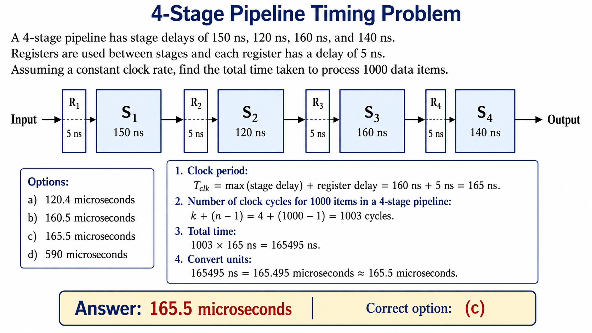

## Problem Statement: Stage Delay in Pipelining

A 4-stage pipeline has stage delays as 150, 120, 160, and 140 ns. Registers are used between stages and have a delay of 5 ns each. Assuming a constant clock rate, the total time taken to process 1,000 data items on this pipeline will be:

* **a)** $120.4\ \mu\text{sec}$
* **b)** $160.5\ \mu\text{sec}$
* **c)** $165.5\ \mu\text{sec}$
* **d)** $590\ \mu\text{sec}$

## 1. Finding the Optimum Clock Cycle Time ($t_p$)

Every stage in a pipeline consists of independent combinational circuits (যৌথ সার্কিট) that take a specific amount of processing time. In a practical architecture, the delays are non-uniform (অসম বা ভিন্ন ভিন্ন):

* $\text{Delay of Stage } 1\ (S_1) = 150\text{ ns}$
* $\text{Delay of Stage } 2\ (S_2) = 120\text{ ns}$
* $\text{Delay of Stage } 3\ (S_3) = 160\text{ ns}$
* $\text{Delay of Stage } 4\ (S_4) = 140\text{ ns}$

Additionally, we use interface registers (ইন্টারফেস রেজিস্টার) or latches between these stages to hold intermediate results (মধ্যবর্তী ফলাফল) and avoid a speed mismatch (গতি অমিল). The register delay or overhead is given as:

* $\text{Delay of Register } (t_r) = 5\text{ ns}$

Since the processor must operate at a constant clock rate (ধ্রুবক ঘড়ির হার), the uniform clock cycle time ($t_p$) must be large enough to safely accommodate the slowest stage plus its register overhead. If we set the clock cycle according to a faster stage, the bottleneck stage will fail to execute completely.

$$\text{Total Stage Delay for } S_i = \text{Stage Delay } (t_i) + \text{Register Delay } (t_r)$$

Calculating for all individual stages:

* $\text{Effective Delay for } S_1 = 150 + 5 = 155\text{ ns}$
* $\text{Effective Delay for } S_2 = 120 + 5 = 125\text{ ns}$
* $\text{Effective Delay for } S_3 = 160 + 5 = 165\text{ ns}$
* $\text{Effective Delay for } S_4 = 140 + 5 = 145\text{ ns}$

Therefore, the worst-case maximum delay determines our system clock cycle duration:

$$t_p = \max(155, 125, 165, 145) = 165\text{ ns}$$

## 2. Deriving the Total Execution Time Formula

Let us understand the behavior of instruction flow inside a pipeline containing $k$ stages to process $n$ distinct instructions or data items:

* **First Instruction/Data Item:** It enters an empty pipeline and must sequentially traverse all $k$ stages to generate the output. It takes exactly $k$ full clock cycles.

$$\text{Time for } 1^{\text{st}} \text{ item} = k \times t_p$$

* **Remaining Instructions/Data Items:** Once the pipeline is completely filled or primed (পাইপলাইন পূর্ণ হওয়া), the architecture achieves an ideal CPI (Cycles Per Instruction) of 1. This means one completed output exits the final stage at every single consecutive clock cycle. The remaining $(n - 1)$ items will require exactly $(n - 1)$ clock cycles to complete.

$$\text{Time for remaining items} = (n - 1) \times t_p$$

Combining both terms gives the standard total execution time formula for a linear pipeline:

$$\text{Total Time } (T) = [k + (n - 1)] \times t_p$$

## 3. Calculation and Unit Conversion

Given variables for our numerical computation:

* Number of stages ($k$) = $4$
* Number of data items ($n$) = $1000$
* Clock cycle time ($t_p$) = $165\text{ ns}$

Substituting the parameters into the execution formula:

$$T = [4 + (1000 - 1)] \times 165\text{ ns}$$

$$T = [4 + 999] \times 165\text{ ns}$$

$$T = 1003 \times 165\text{ ns}$$

$$T = 165,495\text{ ns}$$

To match the multiple-choice options, we must convert this time duration from nanoseconds to microseconds ($\mu\text{sec}$). Since $1\text{ ns} = 10^{-9}\text{ sec}$ and $1\ \mu\text{sec} = 10^{-6}\text{ sec}$, we divide the value by $1000$:

$$T = \frac{165,495}{1000}\ \mu\text{sec} = 165.495\ \mu\text{sec}$$

Rounding off to one decimal place, we obtain approximately **$165.5\ \mu\text{sec}$**.

### Conclusion

The correct option is **c) $165.5\ \mu\text{sec}$**.

## Problem Statement: Speedup Performance Analysis

Consider a non-pipelined processor with a clock rate of 2.5 gigahertz and average cycles per instruction (CPI) of four. The same processor is upgraded to a pipelined processor with five stages, but due to internal pipeline delay, the clock speed is reduced to 2 gigahertz. Assume that there is no stall (পাইপলাইন থমকে যাওয়া বা সাময়িক বিরতি) in the pipeline. The speedup achieved in the pipeline processor is:

* **A)** 3.2
* **B)** 3.0
* **C)** 2.2
* **D)** 2.0

---

## 1. Mathematical Formulation for Speedup ($S$)

The performance gain achieved by transitioning an architecture from a non-pipelined configuration to a pipelined implementation is measured using the Speedup factor ($S$). The general definition for Speedup is the ratio of execution time per instruction without pipelining to the execution time per instruction with pipelining.

$$S = \frac{\text{Execution Time per Instruction without Pipelining } (T_{wp})}{\text{Execution Time per Instruction with Pipelining } (T_p)}$$

The time period of a single clock cycle ($t$) is inversely proportional to its operational clock frequency ($f$):

$$t = \frac{1}{f}$$

---

## 2. Parameter Calculation for Non-Pipelined System

For the non-pipelined version of the hardware processor, the operational metrics provided are:

* Non-pipelined clock frequency ($f_{wp}$) = $2.5\text{ GHz} = 2.5 \times 10^9\text{ Hz}$
* Cycles Per Instruction ($\text{CPI}_{wp}$) = $4$

The single clock cycle duration for this stage is:

$$t_{wp} = \frac{1}{2.5 \times 10^9}\text{ seconds}$$

Therefore, the total sequential processing execution time required to complete one full instruction ($T_{wp}$) is calculated as:

$$T_{wp} = \text{CPI}_{wp} \times t_{wp} = 4 \times \frac{1}{2.5 \times 10^9}\text{ seconds}$$

---

## 3. Parameter Calculation for Pipelined System

When the system is upgraded to a 5-stage pipeline design, the internal propagation delays and latch overheads alter the clock frequency. The operational metrics are:

* Pipelined clock frequency ($f_p$) = $2\text{ GHz} = 2 \times 10^9\text{ Hz}$
* Condition = Ideal pipeline with no structural, data, or control stalls.

Under ideal conditions where no pipeline stalls occur, the steady-state performance achieves a throughput of one completed instruction exiting the execution units per clock cycle. Hence, the effective Cycles Per Instruction ($\text{CPI}_p$) becomes exactly $1$.

The time period for one pipelined clock cycle is:

$$t_p = \frac{1}{2 \times 10^9}\text{ seconds}$$

Therefore, the execution time per instruction in the pipelined processor ($T_p$) is:

$$T_p = \text{CPI}_p \times t_p = 1 \times \frac{1}{2 \times 10^9}\text{ seconds}$$

---

## 4. Evaluation and Speedup Derivation

Substituting the values of $T_{wp}$ and $T_p$ back into the foundational speedup ratio:

$$S = \frac{4 \times \frac{1}{2.5 \times 10^9}}{\frac{1}{2 \times 10^9}}$$

Since the frequency scaling multiplier $10^9$ is present in both the numerator and the denominator, it gets cancelled out synchronously (সুসংগতভাবে বা একই সাথে বাতিল হয়ে যাওয়া):

$$S = \frac{\frac{4}{2.5}}{\frac{1}{2}} = \frac{4}{2.5} \times 2$$

$$S = \frac{8}{2.5}$$

To clear the decimal notation from the fraction, multiply both the numerator and denominator by 10 to turn it into an integer fraction:

$$S = \frac{80}{25} = 3.2$$

### Conclusion

The architecture achieves a performance increase of 3.2 times. The correct option to mark in the copy is **A) 3.2**.