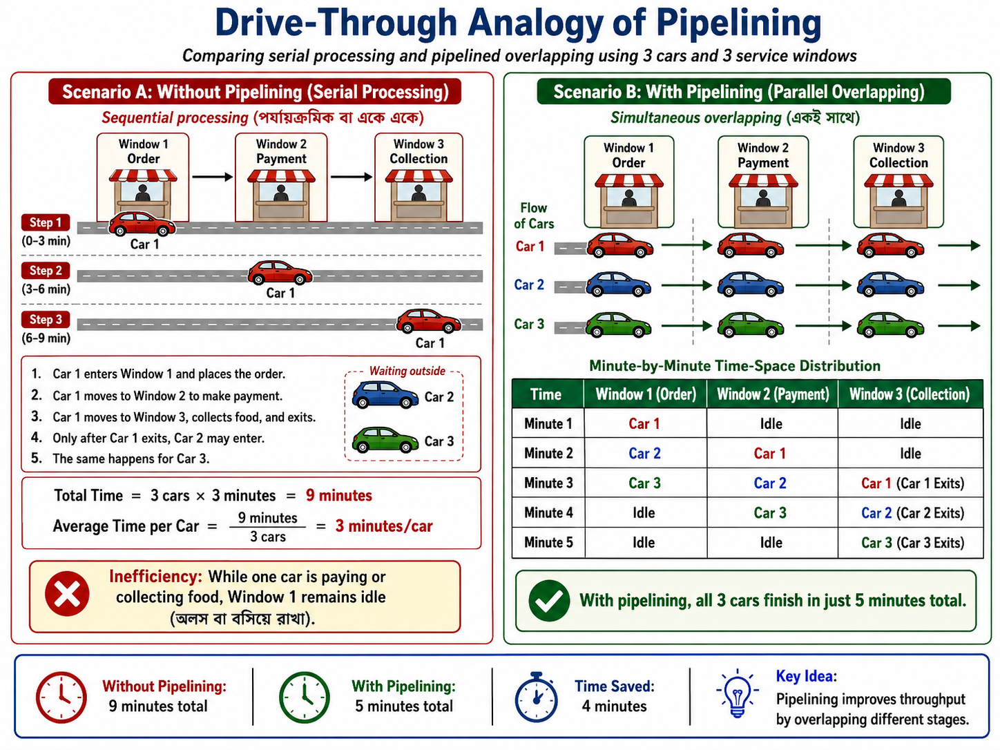
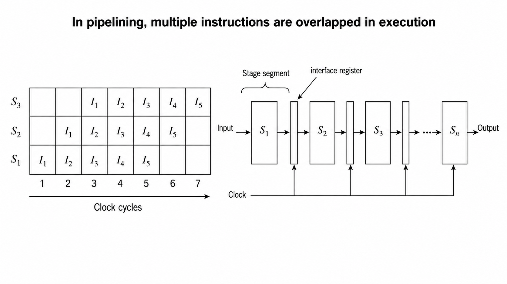
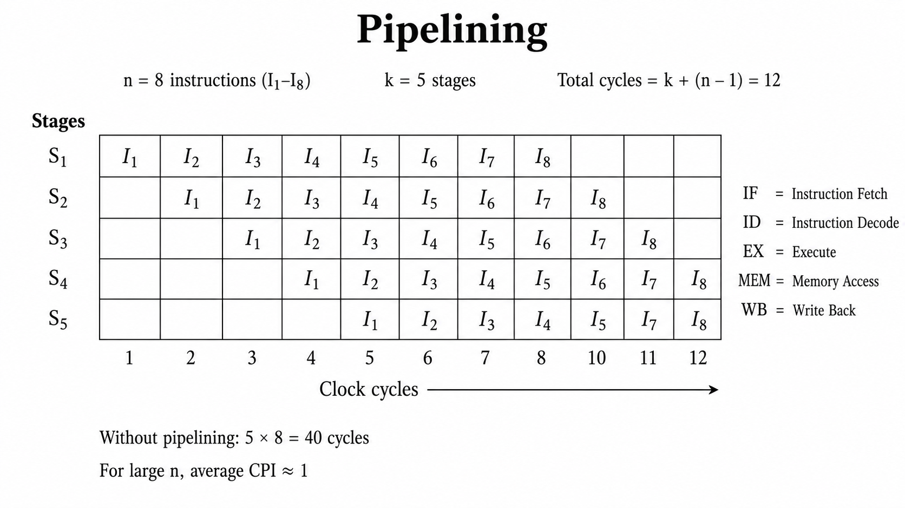

# Parallel Processing

## Understanding Pipelining: Why Do Modern Processors Need It?

Today we are going to look into a very fundamental and important concept in Computer Organization and Architecture (COA) called **Pipelining**.

If you look at any modern processor nowadays, whether it is an Intel Core series or any advanced AMD processor, pipelining is running behind the scenes. But before jumping into the complex mathematical formulas or structural diagrams, we first need to address a very practical question: **What is the actual need for pipelining?**

## The Need for High Performance

In today's computing world, everyone wants their CPU to work faster. High performance and low latency (কম বিলম্বতা বা ধীরগতি হ্রাস করা) are the primary requirements. Now, if we want to increase the CPU performance drastically (ব্যাপকভাবে), how can we achieve it?

Technically, we have two main approaches:

### 1. Implementing Faster Circuits

The first approach is to upgrade the hardware level fabrication (তৈরি বা উৎপাদন প্রক্রিয়া). We can replace the existing slower circuits with much faster circuits. For example, moving from an i3 processor to an i5 or an i7 processor. But as an experienced student or engineer, you know that changing the hardware architecture completely or using high frequency materials is extremely costly. If we keep the budget and manufacturing cost in mind, this approach is not always feasible (সম্ভব বা বাস্তবসম্মত).

### 2. Overlapping Hardware Execution (Pipelining)

The second approach is much smarter. Without changing the actual internal circuitry or buying expensive new components, we can arrange our existing hardware resources in such a sophisticated (উন্নত ও জটিল) architectural design that **multiple instructions can be executed at the same time**. This optimization (দক্ষতা বৃদ্ধি) approach is exactly what we call Pipelining.

Pipelining allows us to increase the overall system throughput (কাজ সম্পাদন করার মোট হার) without increasing the hardware budget. We arrange the execution units like a continuous pipe. The pipe has an input side and an output side, divided into multiple independent stages where each stage depends on the previous one.

## Real-World Analogy: The Drive-Through Concept

To understand this concept clearly, let us look at a very simple real-life analogy (উপমা বা তুলনা) of a fast-food drive-through at McDonald's, KFC, or Burger King.

Imagine a drive-through restaurant building that has 3 dedicated windows representing 3 distinct (পৃথক) stages:

* **Window 1:** Order Placement
* **Window 2:** Payment Processing
* **Window 3:** Food Order Collection

Let us analyze how the processing happens in two different scenarios: Non-Pipelined versus Pipelined.

### Scenario A: Without Pipelining (Serial Processing)

If the drive-through does not use the pipeline concept, it will process sequentially (পর্যায়ক্রমিক বা একে একে):

1. `Car 1` enters, goes to Window 1 and places the order.
2. `Car 1` moves to Window 2 to make the payment.
3. `Car 1` moves to Window 3, receives the food packet, and exits the lane.

Only after `Car 1` completely exits the system, the next car, `Car 2`, is allowed to enter Window 1. If every single stage takes exactly 1 minute, then one car takes 3 minutes to complete the full process.

For 3 cars (`Car 1`, `Car 2`, and `Car 3`), the total execution time will be:

$$\text{Total Time} = 3 \text{ cars} \times 3 \text{ minutes} = 9 \text{ minutes}$$

The average time per car remains:

$$\frac{9 \text{ minutes}}{3 \text{ cars}} = 3 \text{ minutes/car}$$

This is highly inefficient because while `Car 1` is paying or collecting food, Window 1 sits completely idle (অলস বা বসিয়ে রাখা).

### Scenario B: With Pipelining (Parallel Overlapping)

In real life, the drive-through works simultaneously (একই সাথে). As soon as `Car 1` finishes ordering and moves to the payment window (Window 2), `Car 2` immediately enters the empty space at Window 1 to give its order.

Let us track the time-space distribution minute by minute:

| Time | Window 1 (Order) | Window 2 (Payment) | Window 3 (Collection) |
| | | | |
| **Minute 1** | Car 1 | Idle | Idle |
| **Minute 2** | Car 2 | Car 1 | Idle |
| **Minute 3** | Car 3 | Car 2 | Car 1 *(Car 1 Exits)* |
| **Minute 4** | Idle | Car 3 | Car 2 *(Car 2 Exits)* |
| **Minute 5** | Idle | Idle | Car 3 *(Car 3 Exits)* |

Using this overlapped pipeline method, all 3 cars finish their entire process in just **5 minutes** total.

## Performance Evaluation and Comparison

Let us look at the mathematical difference in performance to see how our throughput increases.

### Non-Pipelined Performance:

* Total time taken for 3 cars = $9 \text{ minutes}$
* Average latency (বিলম্বকাল) per car = $\frac{9}{3} = 3 \text{ minutes}$

### Pipelined Performance:

* `Car 1` finishes at Minute 3 (takes normal serial time to fill the pipe).
* `Car 2` finishes at Minute 4.
* `Car 3` finishes at Minute 5.
* Total time taken for 3 cars = $5 \text{ minutes}$
* Average throughput latency (প্রসেসিং সময়কাল) = $\frac{5 \text{ minutes}}{3 \text{ cars}} \approx 1.6 \text{ minutes}$

By comparing $3 \text{ minutes}$ against $1.6 \text{ minutes}$, you can clearly see that by introducing pipelining, our system performance becomes nearly **two times faster** than the non-pipelined system.

This is the exact same architectural concept that our CPU utilizes to execute microinstructions (ক্ষুদ্র নির্দেশাবলী). Instead of processing cars, the processor handles instructions by dividing them into sequential stages like Instruction Fetch (IF - নির্দেশ সংগ্রহ), Instruction Decode (ID - নির্দেশ বিশ্লেষণ), Operand Fetch (OF - ডেটা সংগ্রহ), and Instruction Execute (EX - নির্দেশ সম্পাদন).

Instead of waiting for one instruction to complete its entire lifecycle, the CPU fetches the next instruction as soon as the first one moves to the decoding stage. How this instruction pipelining operates with clock cycles and hardware registers in real computer systems is what we will explore in our next video.

## The Formal Definition of Pipelining

The formal definition of pipelining is that it is a process of arrangement of hardware elements of the CPU such that its overall performance should be increased.

You need to understand very clearly that pipelining is not a process where we are purchasing new hardware modules (হার্ডওয়্যার মডিউল বা অংশ) or implementing extra physical circuits. No, we are simply taking our already existing hardware resources inside the CPU and arranging them in a clever way so that the system performance increases.

But how does this performance increase actually happen? It happens because of the simultaneous execution (একই সাথে সম্পাদন) of more than one instruction inside the pipeline. At any given instance, instead of a single instruction executing alone, multiple instructions occupy the processor in an overlapping (একে অপরের ওপর আপতিত হওয়া বা সমান্তরালভাবে ঘটা) fashion.

## Non-Pipelined vs. Pipelined Execution

### 1. Non-Pipelined Execution

In a non-pipelined system, a process or an instruction starts its execution, and until it completely finishes all its phases, the second process cannot even start. This sequential flow (পর্যায়ক্রমিক প্রবাহ) creates a massive performance bottleneck (পদ্ধতিগত বাধা বা ধীরগতির কারণ) because most of the hardware elements sit completely idle (অলস বা অব্যবহৃত) waiting for the current instruction to clear out.

### 2. Pipelined Execution

In pipelining, we divide the execution path into multiple independent stages, which are also called segments (খণ্ড বা অংশ). Because of these independent stages, when Instruction 1 moves to Stage 2, Instruction 2 can immediately enter Stage 1.

Similarly, at a single clock cycle, Instruction 1 might be in Stage 3, Instruction 2 in Stage 2, and Instruction 3 in Stage 1. This overlapping execution of multiple instructions across different stages is what increases the architectural throughput (কাজের মোট হার).

A classic example of this is the RISC (Reduced Instruction Set Computer) architecture, which generally uses a 5-stage instruction pipeline.

## Hardware Architecture: The Role of Interface Registers (Latches)

To realize (বাস্তবায়ন করা) pipelining at the hardware level, we need a specific structural design. The execution units are split into distinct combinational circuits (যৌথ সার্কিট) representing individual stages, such as Stage 1, Stage 2, and Stage 3.

The most important hardware element here is the Interface Register, also commonly referred to as Latches (এক ধরণের মেমোরি উপাদান বা ফ্লিপ-ফ্লপ).

### Why do we need these intermediate registers?

Every stage takes an input, processes it, and generates an output. The output of Stage 1 acts as the direct input for Stage 2. However, Stage 2 cannot instantly process that data because it might still be finishing its previous task. Therefore, we must store the intermediate results (মধ্যবর্তী ফলাফল) temporarily. These interface registers hold the data securely between the stages.

All these hardware stages and interface registers are connected to a common system clock. As soon as a clock pulse or clock cycle triggers, the data moves from one stage through the register into the next stage in a completely synchronized (সুসংগত বা একই সময়ে ঘটা) manner.

## Visualizing Execution: The Space-Time Diagram

To understand how multiple instructions execute over real-time clock cycles, computer architects use a visualization tool (দৃশ্যমান করার মাধ্যম) called the Space-Time Diagram.

* **X-axis:** Represents the Time in terms of Clock Cycles (যেমন: Cycle 1, Cycle 2, Cycle 3).
* **Y-axis:** Represents the physical Pipeline Stages or Segments.

By plotting instructions inside this matrix, we can clearly see the exact realization model of how overlapping occurs cycle by cycle, and how the overall execution time drops significantly compared to non-pipelined hardware.

## Quantitative Analysis and Performance Metrics of Pipelining

In computer architecture, the execution of a program containing a specific set of instructions depends heavily on the structural layout of the processor. The total volume of instructions to be processed in a given program run is technically defined as the **Load** (কাজের পরিমাণ বা ইনস্ট্রাকশন সংখ্যা).

To carry out a rigorous performance analysis, we analyze the standard instruction cycle (নির্দেশ চক্র) using a 5 stage RISC processor configuration. The execution path is partitioned into five sequential steps:

1. **Instruction Fetch (IF, নির্দেশ সংগ্রহ):** Retrieving the instruction binary from the memory unit.
2. **Instruction Decode (ID, নির্দেশ বিশ্লেষণ):** Interpreting the opcode and reading from the register file.
3. **Execute (EX, নির্দেশ সম্পাদন):** Performing the designated arithmetic or logical operation via the ALU.
4. **Memory Access (MEM, মেমোরি অ্যাক্সেস):** Reading from or writing data into the data memory.
5. **Write Back (WB, রেজিস্টারে সংরক্ষণ):** Writing the final computed result back into the target register.

For mathematical uniformity (সমরূপতা), we establish a uniform clock cycle model where every individual stage requires exactly 1 clock cycle (cc) of time to complete its respective operation.

## Performance Derivation for Non-Pipelined Architecture

A traditional non-pipelined system relies strictly on sequential processing (পর্যায়ক্রমিক প্রক্রিয়া). An instruction is permitted to initiate its execution cycle only after the entirely preceding instruction has successfully completed all its 5 stages and exited the processor pipeline.

### Mathematical Formulation

Let:

* $n$ = Total number of instructions in the program load = 8
* $k$ = Total number of execution stages in the processor architecture = 5

$$\text{Execution Time for a Single Instruction} = k = 5 \text{ clock cycles}$$

$$\text{Total Clock Cycles for } n \text{ Instructions } (T_{np}) = n \times k$$

$$T_{np} = 8 \times 5 = 40 \text{ clock cycles}$$

Consequently, the non-pipelined hardware requires 40 clock cycles to execute the entire program load. This architecture suffers from a massive operational bottleneck (পদ্ধতিগত বাধা) because when a single instruction occupies one stage, the remaining four stages are left completely idle (অলস বা অব্যবহৃত), wasting valuable hardware execution area.

## Performance Derivation for Pipelined Architecture

Pipelined architecture optimizes throughput by introducing overlapping execution (আপতিত বা সমান্তরাল সম্পাদন), allowing distinct hardware segments to process different instructions at the same time.

### Space-Time Matrix Mapping

The overlapping execution sequence is tracked using a Space-Time Diagram (স্থান ও কাল নির্দেশক চিত্র). The horizontal X axis tracks the elapsed time slots in terms of Clock Cycles, while the vertical Y axis maps the physical Pipeline Stages ($S_1$ to $S_5$).

| Stages / Cycles | C1 | C2 | C3 | C4 | C5 | C6 | C7 | C8 | C9 | C10 | C11 | C12 |
| | | | | | | | | | | | | |
| **$S_1$ (IF)** | $I_1$ | $I_2$ | $I_3$ | $I_4$ | $I_5$ | $I_6$ | $I_7$ | $I_8$ |  |  |  |  |
| **$S_2$ (ID)** |  | $I_1$ | $I_2$ | $I_3$ | $I_4$ | $I_5$ | $I_6$ | $I_7$ | $I_8$ |  |  |  |
| **$S_3$ (EX)** |  |  | $I_1$ | $I_2$ | $I_3$ | $I_4$ | $I_5$ | $I_6$ | $I_7$ | $I_8$ |  |  |
| **$S_4$ (MEM)** |  |  |  | $I_1$ | $I_2$ | $I_3$ | $I_4$ | $I_5$ | $I_6$ | $I_7$ | $I_8$ |  |
| **$S_5$ (WB)** |  |  |  |  | $I_1$ | $I_2$ | $I_3$ | $I_4$ | $I_5$ | $I_6$ | $I_7$ | $I_8$ |

### Mathematical Formulation of Pipelined Time

By inspecting the space-time grid, we can deduce the total clock cycles:

* The very first instruction ($I_1$) requires full $k$ clock cycles (5 cycles) to pass through all stages and exit. This time is mandatory to initially fill up (পাইপলাইন পূর্ণ করা) the empty pipeline.
* Once the pipeline reaches a fully loaded state, one completed instruction drops out of the pipeline at the end of every subsequent clock cycle. Thus, the remaining $(n - 1)$ instructions require exactly $(n - 1)$ clock cycles to finish.

$$\text{Total Clock Cycles in Pipelining } (T_p) = k + (n - 1)$$

Substituting the specific experimental values where $k = 5$ and $n = 8$:

$$T_p = 5 + (8 - 1) = 5 + 7 = 12 \text{ clock cycles}$$

If each clock cycle possesses a specific time duration denoted as $t_p$, the absolute execution time ($T$) is defined as:

$$\text{Total Execution Time } (T) = [k + (n - 1)] \times t_p$$

## Architectural Evaluation Parameters

### 1. Optimization Target: CPI $\approx$ 1

The core objective of pipelining is to minimize the CPI, which denotes Cycles Per Instruction (প্রতি ইনস্ট্রাকশনের জন্য প্রয়োজনীয় ক্লক সাইকেল), pulling it down toward a theoretical ideal baseline value of 1.

Consider a massive program load where $n = 1000$ instructions are executed on a $k = 5$ stage pipeline:

$$T_p = 5 + (1000 - 1) = 1004 \text{ clock cycles}$$

$$\text{Effective CPI} = \frac{\text{Total Clock Cycles}}{\text{Total Instructions}} = \frac{1004}{1000} = 1.004 \approx 1$$

This mathematical trend proves that as the total load increases, the effective execution rate approaches the ideal throughput (কার্যক্ষমতার হার) of one instruction per clock cycle.

### 2. Speedup Factor ($S$)

Speedup is a relative metric that quantifies how much faster the pipelined processor operates when measured against the conventional non-pipelined hardware design.

$$S = \frac{\text{Execution Time in Non-Pipelined Hardware } (T_{np})}{\text{Execution Time in Pipelined Hardware } (T_p)}$$

$$S = \frac{n \times k}{k + (n - 1)}$$

Substituting our derived execution values ($T_{np} = 40$ and $T_p = 12$):

$$S = \frac{40}{12} = 3.33$$

This specifies that the pipelined implementation provides a performance acceleration of 3.33 times.

### 3. Hardware Efficiency and Resource Utilization ($\eta$)

Efficiency computes the percentage of space-time resource blocks that were productively occupied by instructions out of the entire available execution grid matrix.

$$\text{Total Allocated Resource Blocks} = \text{Total Cycles } (T_p) \times \text{Total Stages } (k)$$

$$\text{Total Allocated Blocks} = 12 \times 5 = 60 \text{ blocks}$$

$$\text{Total Productive Blocks Used} = n \times k = 8 \times 5 = 40 \text{ blocks}$$

$$\text{Hardware Efficiency } (\eta) = \frac{\text{Productive Blocks Used}}{\text{Total Allocated Blocks}} = \frac{n \times k}{[k + (n - 1)] \times k} = \frac{n}{k + (n - 1)}$$

$$\eta = \frac{40}{60} = \frac{2}{3} \approx 66.67\%$$

This mathematical result indicates that due to the initial filling phase and the final draining phase of the pipeline layout, $66.67\%$ of the available hardware computational space was efficiently utilized (হার্ডওয়্যারের ব্যবহার).