# Computer Architecture: University-Level 20-Mark Bilingual Answer Bank

**English and বাংলা | Expanded exam-ready answers | Diagrams, formulas, worked examples**

> **How to use this file:** In the examination, begin with a definition or introduction, draw the relevant diagram, explain the main points under headings, add an example or equation, and finish with a short conclusion. The answers below are intentionally structured in that order.

---

## Contents

### Part A — Core Concepts

1. Classes of computers  
2. Layers of computer system architecture  
3. Throughput and response time  
4. Basic functional units of a computer  
5. Bus structure of a processor  
6. Instruction Set Architecture and MIPS formats  
7. RISC versus CISC  

### Part B — Instructions, ISA, Datapath and Control

1. Execution of `Load R2, LOC`
2. Characteristics of a RISC processor
3. Three-bus CISC-style processor organization
4. Execution of `Add (R3), R1`
5. MIPS addressing modes
6. MIPS code for two C statements
7. Compilation of a C program
8. General addressing modes
9. Instruction and its computer representation
10. Processor datapath
11. Datapath control signals
12. Dynamic scheduling
13. Microprogrammed control for a branch
14. Purpose of the control unit
15. Word, address and memory access time

### Part C — Pipelining and Hazards

16. Pipeline performance
17. Ideal pipelined operation
18. Pipeline issues
19. Operand forwarding
20. Datapath modification for forwarding
21. Data hazards and their performance effects

### Part D — Computer Arithmetic and Performance

22. Multiplication algorithm and hardware
23. Binary division
24. IEEE 754 representation of −0.625
25. Four-bit binary multiplier
26. Booth multiplication: 16 × (−2)
27. Measuring computer performance
28. Comparative processor-performance problem

### Part E — Parallelism and Memory

29. Flynn’s classification
30. Cache memory, hit, miss and miss penalty
31. Write-through and write-back
32. RTL for selected MIPS instructions
33. Processor–memory connection
34. Internal organization of memory bit cells
35. Design of a 2M×32 memory module
36. Virtual memory and cache mapping

---

# Part A — Core Concepts
## Discuss the basic functional units of a computer.

??? "Discuss the basic functional units of a computer."
      A digital computer has five basic functional units: the input unit, memory unit, arithmetic logic unit (ALU), control unit, and output unit. Together, the ALU and control unit form the Central Processing Unit (CPU).
      ## Input Unit

      * Accepts raw data and instructions from the user.
      * Converts input into a binary code that the computer can understand.
      * Common devices include keyboards, mice, and microphones.

      ## Memory Unit

      * Stores data, program instructions, and intermediate results.
      * Primary memory (RAM) offers fast, temporary workspace during processing.
      * Secondary memory (hard drives, SSDs) provides long-term, permanent storage.

      ## Arithmetic Logic Unit (ALU)

      * Performs math tasks like addition, subtraction, multiplication, and division.
      * Handles logic choices like comparing numbers or doing true/false checks.

      ## Control Unit (CU)

      * Acts as the central nervous system or manager of the computer.
      * Directs the flow of data and commands between all other units.
      * Fetches and decodes instructions from memory to run programs.

      ## Output Unit

      * Takes processed binary data from the computer and converts it into a usable format.
      * Delivers the final results to the user.
      * Common devices include monitors, printers, and speakers.


## A1. Classes of Computers

### Enhanced question

**Classify computers from the viewpoints of data representation, purpose, and size/performance. Explain the defining characteristics and typical applications of every major class with suitable examples.**


A computer is an electronic programmable system that accepts data, processes it according to stored instructions, produces information, and stores the result. A single classification is insufficient because computers differ in the type of data they process, the task for which they are built, and their processing capacity.

#### 1. Classification by data representation

| Class | Main characteristics | Typical applications |
|---|---|---|
| **Analog computer** | Works with continuous physical quantities such as voltage, pressure, speed or temperature; gives approximate results; very fast for simulation of continuous systems. | Process control, old flight simulators, differential analysers. |
| **Digital computer** | Represents data using discrete binary values; programmable, accurate, repeatable and suitable for storage and logical operations. | PCs, smartphones, servers, calculators. |
| **Hybrid computer** | Combines analog measurement with digital control and accuracy. An A/D converter usually connects the two parts. | ICU monitoring, petrol pumps, industrial and scientific control. |

#### 2. Classification by purpose

- **General-purpose computer:** Can perform many tasks by changing software. A laptop may be used for programming, accounting, communication and entertainment.
- **Special-purpose computer:** Designed and optimized for one restricted task. Examples include an automobile engine-control unit, traffic-light controller and washing-machine controller.
- **Embedded computer:** A special-purpose computer built inside a larger product. It normally has limited memory and power, real-time constraints, high reliability and little or no general user interface.

#### 3. Classification by size and performance

| Class | Important characteristics | Examples/uses |
|---|---|---|
| **Microcomputer / Personal computer** | One main user; microprocessor-based; low cost; desktop, laptop, tablet or smartphone form. | Education, office and home use. |
| **Workstation** | High-end single-user system; powerful CPU/GPU, large RAM and professional reliability. | CAD, 3-D design, engineering and scientific work. |
| **Midrange system / Minicomputer** | Supports several or many users and I/O terminals; historically smaller than a mainframe. Modern departmental servers occupy this role. | Laboratories, factories and departmental databases. |
| **Mainframe** | Very high I/O throughput, reliability, security, virtualization and support for thousands of concurrent users or transactions. | Banks, airlines, census and government records. |
| **Supercomputer** | Highest computational performance through massive parallelism; measured using FLOPS rather than only instruction rate. | Weather prediction, molecular modelling, AI and nuclear simulation. |

Thus, “largest” does not always mean “best.” A mainframe is optimized mainly for reliable transaction and I/O processing, whereas a supercomputer is optimized for enormous numerical computation.


## A2. Layers of Computer System Architecture

??? "Explain the layers of computer system architecture 🏗️⚙️ with a neat diagram."

	### Figure: layered computer system

	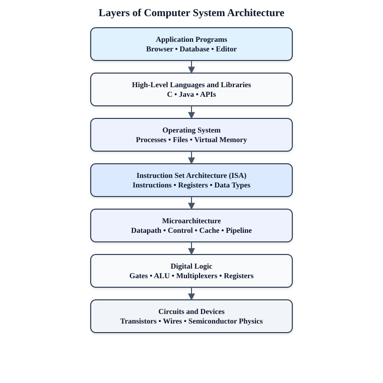


	Computer architecture is understood more easily as a hierarchy of abstractions. Each layer hides unnecessary implementation details and offers a simpler interface to the layer above.

	1. **Application layer:** Contains programs that solve users’ problems, such as browsers, word processors and database systems.
	2. **High-level language and library layer:** Programmers express algorithms using C, C++, Java or libraries. Compilers translate this representation toward the ISA.
	3. **Operating-system layer:** Manages processes, memory, files, security and I/O devices. It provides system calls and makes hardware resources appear orderly and shareable.
	4. **ISA layer:** The boundary visible to machine-language programmers and compilers. It defines instructions, registers, data formats, addressing modes, exceptions and the memory model. MIPS, ARM and x86 are ISAs.
	5. **Microarchitecture layer:** The particular hardware organization that implements an ISA—datapath, control unit, ALU, pipeline, cache and branch predictor. Different processors can implement the same ISA differently.
	6. **Digital-logic layer:** Implements the microarchitecture using gates, adders, decoders, multiplexers, registers and state machines.
	7. **Circuit/device layer:** Implements logic with transistors, semiconductor devices, wires, voltage and timing.

	The important idea is **abstraction**. For example, a C statement is compiled into ISA instructions; those instructions are executed by a microarchitecture; the microarchitecture is constructed from logic gates; and the gates are implemented using transistors. This separation permits software portability and independent improvement of hardware.


## A3. Throughput and Response Time

### Enhanced question

**Define response time and throughput as measures of computer performance. Derive their basic performance relationships, compare them, and explain with examples how a design change may affect either or both.**


**Response time (latency)** is the total elapsed time from submitting one task until its completion:

$$T_{\text{response}}=T_{\text{finish}}-T_{\text{start}}$$

It includes CPU time, memory and I/O waiting, operating-system overhead and any queueing delay. Performance for a single task is inversely related to execution time:

$$\text{Performance}\propto\frac{1}{T_{\text{execution}}}$$

**Throughput (bandwidth)** is the number of tasks completed per unit time:

$$\text{Throughput}=\frac{\text{Number of completed jobs}}{\text{Total time}}$$

| Aspect | Response time | Throughput |
|---|---|---|
| Concern | How long one job takes | How many jobs finish |
| Unit | seconds/job | jobs/second |
| Important to | Interactive user | Server/data-centre operator |
| Common improvement | Faster core, lower latency | More cores, disks or servers |

Example: If one request completes in 0.2 s, its response time is 0.2 s. If a server completes 500 requests in 10 s, throughput is 50 requests/s. Replacing one processor with a faster processor may improve both. Adding a second processor may nearly double throughput when jobs are independent, but it may not shorten the response time of one serial job. Queueing also connects the measures: when arrival rate approaches maximum throughput, response time can rise sharply.

### বাংলা উত্তর

**Response time বা latency** হলো একটি কাজ জমা দেওয়া থেকে ফল পাওয়া পর্যন্ত মোট সময়:

$$T_{\text{response}}=T_{\text{finish}}-T_{\text{start}}$$

এর মধ্যে CPU execution, memory/I/O wait, OS overhead এবং queueing delay অন্তর্ভুক্ত। একটি কাজের performance execution time-এর ব্যস্তানুপাতিক।

**Throughput বা bandwidth** হলো একক সময়ে সম্পন্ন কাজের সংখ্যা:

$$\text{Throughput}=\frac{\text{সম্পন্ন কাজের সংখ্যা}}{\text{মোট সময়}}$$

Response time বলে **একটি কাজ কত দ্রুত শেষ হয়**, আর throughput বলে **একক সময়ে কতগুলো কাজ শেষ হয়**। Interactive user কম response time চায়; server administrator বেশি throughput চায়।

উদাহরণ: একটি request শেষ হতে 0.2 s লাগলে response time 0.2 s। 10 s-এ 500টি request সম্পন্ন হলে throughput 50 requests/s। আরও processor যোগ করলে independent কাজের throughput প্রায় দ্বিগুণ হতে পারে, কিন্তু একটি serial কাজের response time কমতেই হবে—এমন নয়। আবার system-এর arrival rate সর্বোচ্চ throughput-এর কাছাকাছি গেলে queue তৈরি হয়ে response time দ্রুত বেড়ে যেতে পারে।

সিস্টেমের কার্যক্ষমতা বোঝার মূল বিষয় হলো রেসপন্স টাইম, থ্রুপুট এবং কিউ গঠন। এই তিনটি উপাদান নির্ধারণ করে একটি কম্পিউটার বা সার্ভার কত দ্রুত ও দক্ষতার সাথে কাজ সম্পন্ন করতে পারে।

**রেসপন্স টাইম ও থ্রুপুট**
একটি নির্দিষ্ট কাজ সম্পূর্ণ হতে যে সময় লাগে তা হলো রেসপন্স টাইম (যেমন: ০.২ সেকেন্ড)।
নির্দিষ্ট সময়ে যতগুলো কাজ শেষ হয় তা হলো থ্রুপুট (যেমন: প্রতি সেকেন্ডে ৫০টি রিকোয়েস্ট)।
**প্রসেসর ও কাজের ধরন**
অতিরিক্ত প্রসেসর যুক্ত করলে আলাদা ও স্বাধীন (independent) কাজের গতি ও থ্রুপুট বাড়ে।
কিন্তু ধারাবাহিক বা সিরিয়াল (serial) কাজের ক্ষেত্রে প্রসেসর বাড়লেও রেসপন্স টাইম কমার কোনো নিশ্চয়তা নেই।
**কিউ ও অতিরিক্ত চাপ**
কাজের চাপ বা আগমন হার (arrival rate) যখন সর্বোচ্চ ক্ষমতার কাছাকাছি পৌঁছায়, তখন জট বা কিউ (queue) তৈরি হয়।
এই কিউ বা সারির কারণে কাজের অপেক্ষা করার সময় বা রেসপন্স টাইম খুব দ্রুত বৃদ্ধি পায়।
---

## A4. Basic Functional Units of a Computer

### Enhanced question

**Identify and explain the basic functional units of a stored-program computer. Describe the flow of instructions and data among these units with a block diagram.**

### Figure: functional organization

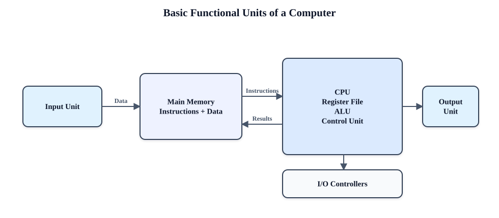
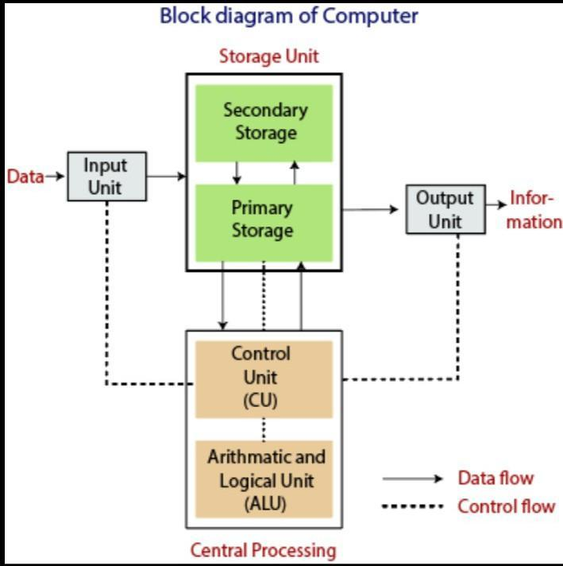{height=400px}


A stored-program computer contains five fundamental units:

1. **Input unit:** Accepts programs and data from keyboards, sensors, networks or storage and converts them into binary form.
2. **Memory unit:** Holds both instructions and data. Registers are fastest and closest to the ALU; cache reduces the gap between CPU and main memory; main memory stores currently active programs; secondary storage provides long-term capacity.
3. **Arithmetic and Logic Unit (ALU):** Performs arithmetic, logic, comparison and shift operations. Condition flags may record zero, carry, sign and overflow.
4. **Control unit:** Fetches and decodes instructions and issues timing/control signals that move data and select ALU, memory and I/O operations. The program counter (PC) identifies the next instruction and the instruction register (IR) holds the current one.
5. **Output unit:** Converts binary results into a form usable by people or other systems.

The **register file, ALU and control unit together form the CPU**. Buses and __Interconnects__ carry addresses, data and control information. During the fetch–decode–execute cycle, the CPU fetches an instruction from memory, decodes its opcode, obtains operands, executes the operation, accesses memory if required and writes back the result.

## Main Parts of a CPU

* Register file: stores fast data inside the CPU.
* ALU: does math and logic work.
* Control unit: tells the other parts what to do.

## Buses and Interconnects

* Data bus: moves the actual data.
* Address bus: points to memory spots.
* Control bus: sends signals for timing and commands.

## The Fetch–Decode–Execute Cycle Steps

* Fetch: gets the next instruction from memory.
* Decode: reads what the instruction means.
* Get operands: finds the needed numbers or items.
* Execute: runs the math or logic task.
* Access memory: reads or writes to memory if needed.
* Write back: saves the final answer.


## A5. Bus Structure of a Processor

### Enhanced question

**Explain the internal and external bus structure of a processor. Distinguish address, data and control buses, and compare single-bus, two-bus and three-bus CPU organizations.**

### Figure: system bus and internal three-bus datapath

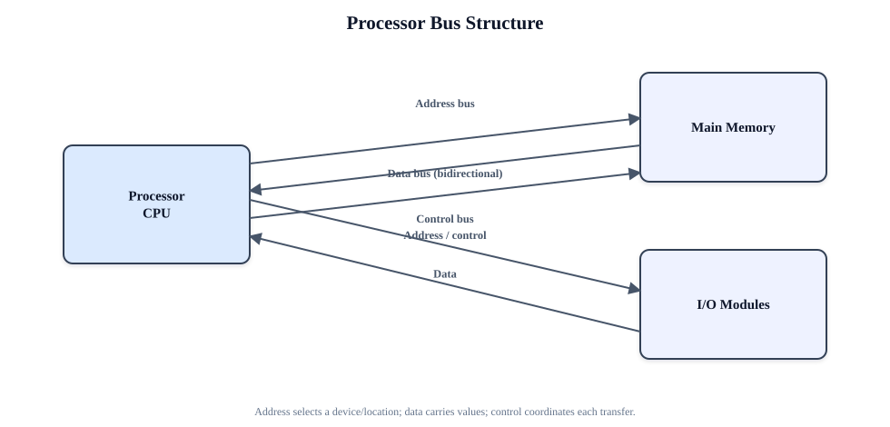


A **bus** is a shared collection of lines that transfers information among components.
Here is the complete and detailed English version of the video's content regarding the **Bus Structure in Computer Architecture**, without skipping any information:

## **1. What is a Bus?**

The major hardware components of a computer are the CPU (Central Processing Unit), memory unit, and I/O (Input/Output) devices. These components work together to perform any given computational task. To communicate with each other, they use a set of communication paths or lines.

Collectively, this set of communication paths is called a **Bus**. Simply put, a bus is a collection of wires or paths that connects the major hardware components of a computer.


## **2. System Bus**

A bus that connects the computer's primary hardware components (CPU, memory, and I/O devices) is called a System Bus. The system bus is divided into three functional categories:

* **Data Bus:** This bus carries only data from one component to another. It consists of 8, 16, 32, or more parallel data lines. Because it is used for both receiving data (from memory or input devices) and sending data (to memory or output devices), the data bus is **bidirectional**.
* **Address Bus:** This bus carries only the address of a memory location or an I/O device. It typically consists of 16, 20, or 24 address lines. Because the CPU can only perform one operation at a time on this bus—either sending an address to write or receiving an address to read—the address bus is **unidirectional**.
* **Control Bus:** This bus carries control information in the form of control signals provided by the control unit. These signals are required to perform various activities, such as reading data from an input device, writing data to memory, or displaying data on an output device.
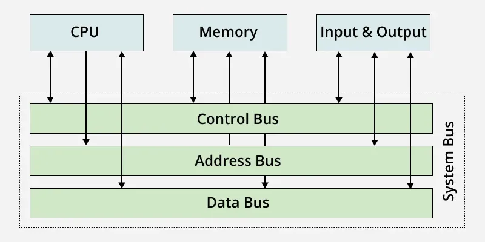
---

## **3. Types of Bus Structures**

There are three main types of bus structures used in computer architecture:

### **A. Single Bus Structure**

In this structure, the data bus, address bus, and control bus are combined into a single system bus. All major hardware components are connected to this one bus.
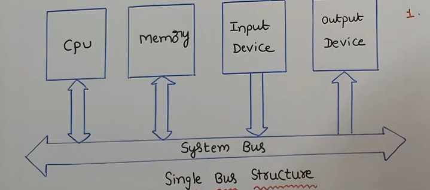
* **Operation:** The most important rule here is that **only one transfer can be done at a time**. This means only two major components (e.g., the CPU and memory, or the CPU and an I/O device) can actively use the bus at any given moment.
* **Advantages:** It is highly cost-effective and provides great flexibility for attaching a large number of peripheral devices to the system.
* **Disadvantages:** Because only two units can communicate at a time, all other connected peripherals must wait in an inactive state until the current transfer is complete. This results in high **propagation delay** and slower overall performance.

### **B. Double Bus Structure**
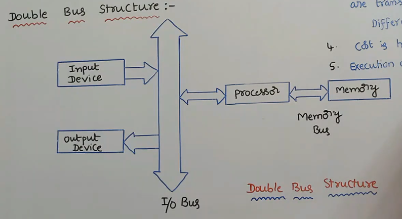
As the name implies, this structure utilizes two separate buses to improve efficiency:

1. **Memory Bus:** Used primarily by the processor to fetch instructions and transfer data to and from the memory unit.
2. **I/O Bus:** Used by the processor to fetch data from input devices and send data to output devices.

* **Advantages:** The performance is significantly higher than a single bus structure. Because there are two distinct buses, two separate transfers can occur simultaneously (parallel execution). This makes the execution of processes much faster.
* **Disadvantages:** The cost of constructing a double bus structure is higher since it requires wiring and managing two separate buses instead of one.

### **C. Multiple Bus Structure**

The multiple bus structure incorporates several specialized buses to handle different capacities and speeds. Aside from the standard system bus, it mainly focuses on three specific buses:
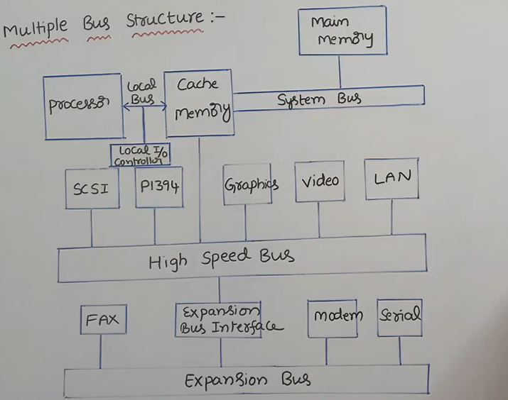
1. **Local Bus:** This connects the processor to the cache memory through a local I/O controller.
2. **High-Speed Bus:** High-capacity I/O devices (like graphics cards, video, and LAN networks) operate at very fast speeds. These are connected to the high-speed bus using interfaces like SCSI (Small Computer System Interface) and P1394 (FireWire). This bus is also connected directly to the cache memory.
3. **Expansion Bus:** Low-capacity and slower I/O devices (like fax machines, modems, and serial devices) are connected to the expansion bus.

* *Note:* The high-speed bus and the expansion bus are linked together via an **Expansion Bus Interface**. This hierarchical separation keeps slow devices from bottlenecking the fast devices.

---

### **Summary of Differences**

* **Single Bus Structure:** Uses exactly 1 bus (System Bus) for all data and instruction fetching.
* **Double Bus Structure:** Uses 2 buses (Memory Bus for instructions/memory data, I/O Bus for device data).
* **Multiple Bus Structure:** Uses 3 specialized buses (Local Bus, High-speed Bus, Expansion Bus) to manage varied device speeds.
*(Note: The foundational "System Bus" concept exists in all architectures as the base connection between the processor, main memory, and I/O).*

**Conclusion:**
At the end of the video, the presenter recaps the topics discussed (definition of a bus, system bus components, and the three structures), invites viewers to ask questions in the comment section, and encourages viewers to like, share, and subscribe to the channel for future updates.

### বাংলা উত্তর

**Bus** হলো একগুচ্ছ shared signal line, যা বিভিন্ন hardware unit-এর মধ্যে তথ্য পরিবহন করে।

- **Address bus** memory location বা I/O port নির্বাচন করে। \(n\)টি address line সর্বোচ্চ \(2^n\)টি location নির্দেশ করতে পারে।
- **Data bus** instruction ও operand বহন করে এবং সাধারণত bidirectional।
- **Control bus** Read, Write, clock, interrupt, reset, byte-enable, bus-request এবং ready/wait signal বহন করে।

CPU-এর ভেতরে bus register file, ALU, shifter ও memory interface যুক্ত করে। Single-bus organization সহজ ও কম ব্যয়বহুল, কিন্তু একসময়ে একটি transfer হওয়ায় বেশি cycle লাগে। Two-bus organization কিছু parallel transfer সম্ভব করে। Three-bus organization-এ A ও B bus দিয়ে দুইটি source operand ALU-তে যায় এবং C bus দিয়ে ফল register-এ ফেরে; ফলে `R1 ← R2 + R3` একই register-transfer cycle-এ করা যায়। তবে register file-এ বেশি port ও বেশি wire দরকার হয়।

Synchronous bus clock অনুসরণ করে; asynchronous bus request/acknowledge signal ব্যবহার করে। Bus width, frequency ও protocol মোট bandwidth নির্ধারণ করে। CPU ও DMA-এর মতো একাধিক master থাকলে arbitration প্রয়োজন।

---
## A6. Instruction Set Architecture and MIPS Instruction Formats

??? info "A6. Instruction Set Architecture and MIPS Instruction Formats"

      **Explanation of the ISA Layered Diagram**
      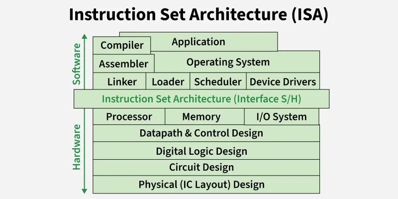
      Let us carefully look at the provided image to understand the real-life feeling of how Instruction Set Architecture works. The picture beautifully shows a layered computer system where the ISA block sits exactly in the middle.

      To feel how ISA actually works, we need to divide this image into three simple zones.

      **The Software Domain (Top Portion)**

      In the upper half of the image, we have the complete Software area. This contains high-level things like your daily Application programs, the Operating System, and translation tools like the Compiler, Assembler, and Linker.

      * The software programmers work only in this area.
      * They write human-readable code in languages like C, Java, or Python.
      * They do not need to worry about how the physical wires, logic gates, or electrical signals are working inside the silicon chip.

      **The Hardware Domain (Bottom Portion)**

      In the lower half of the image, we have the complete Hardware area. This starts from the major hardware blocks like the Processor, Memory, and I/O System, and goes deep down to Datapath Control, Digital Logic Design, and finally the Physical IC Layout (which means the actual silicon transistors).

      * The electrical and hardware engineers work exactly in this area.
      * They design the electronic circuits and chip layouts.
      * They do not need to know what specific software application or web browser the final user will run on the machine.

      **The ISA as the Universal Bridge (The Middle Layer)**

      Now, to make you feel "Yes, ISA works like that", just look at the large, light-green block perfectly separating the top and bottom. It is labeled "Instruction Set Architecture (Interface S/H)".

      * The word "Interface S/H" simply means Software-to-Hardware Interface.
      * The ISA is acting like a universal translator or a strict contract between two completely different worlds.
      * The software side compiles all its complex logic down into simple ISA commands (like `add`, `load`, or `jump`). It drops these instructions onto the ISA layer.
      * The hardware side looks up at this ISA layer, takes those exact binary instructions, and uses its logic gates to execute them.

      **Final Conclusion**

      Therefore, this image proves that ISA is nothing but a strict boundary line. It makes us feel that software and hardware are completely blind to each other's internal complexities. As long as both the Software top layer and the Hardware bottom layer agree to follow the standard rules of this middle ISA block, the computer will function perfectly.

      ## Concept of Instruction Set Architecture (ISA 📜🏗️

      Basically, the Instruction Set Architecture (ISA) is the main boundary line or interface between the software programs and the hardware of the computer system. We can say that it is a complete rulebook for the microprocessor. It tells the software programmer exactly what commands the CPU hardware can understand and execute.

      A complete ISA defines several important things for the system:

      * It defines the complete set of instructions the hardware can do, like addition, subtraction, or moving data.
      * It defines the data types and the size of the registers available inside the processor.
      * It tells us about the addressing modes, which means the exact mathematical ways the CPU will find data inside the main memory.

      The best advantage of ISA is that even if two different companies design the internal chip circuits very differently, if they follow the same ISA standard, they can run the exact same software programs without any problem.
      [To understand more watch this](https://youtu.be/rS97IGFPjRM)
      **Explanation of MIPS Instruction Set Formats with Examples** 💡📋

      In the MIPS architecture, every single instruction is strictly fixed to a length of exactly 32 bits. This fixed size makes the hardware decoding process very fast and simple. Based on how these 32 bits are internally divided, the MIPS instructions are classified into three main formats.

      **1. R-Type (Register Format)**

      This format is used when all the data we need for calculation is already present inside the CPU registers. It does not use any fixed constant number from the instruction itself.

      The 32 bits of R-Type are divided into 6 parts:

      * **opcode (6 bits):** It is the operation code. For all R-type instructions, this value is always 0.
      * **rs (5 bits):** The first source register index.
      * **rt (5 bits):** The second source register index.
      * **rd (5 bits):** The destination register where the final answer is saved.
      * **shamt (5 bits):** Shift amount. It is used only for logical shift operations, otherwise it is kept as 0.
      * **funct (6 bits):** Function code. Since the opcode is 0, this part tells the ALU the exact mathematical operation to do (like add, subtract, or AND).

      **Example of R-Type:**
      Let us consider the assembly instruction: `add $s1, $s2, $s3`
      This means we are adding the data of register `$s2` and `$s3`, and storing the final result in register `$s1`.
      => Opcode for R-type = 0
      => rs register = `$s2`
      => rt register = `$s3`
      => rd register = `$s1`
      => shamt = 0
      => funct code for add operation = 32

      **2. I-Type (Immediate Format)**

      This format is used when the instruction contains a direct constant number (called an immediate value), or when we need to transfer data between the main memory and registers using load or store commands.

      The 32 bits of I-Type are divided into 4 parts:

      * **opcode (6 bits):** Tells the CPU the exact operation to perform (like `addi` for add immediate, or `lw` for load word).
      * **rs (5 bits):** The source or base register index.
      * **rt (5 bits):** The target destination register.
      * **immediate (16 bits):** A constant mathematical value or a memory address offset.

      **Example of I-Type:**
      Let us consider the assembly instruction: `addi $t0, $t1, 100`
      This means we are adding the direct constant value of 100 to the data inside register `$t1` and saving it in register `$t0`.
      => Opcode for `addi` = 8
      => rs register = `$t1`
      => rt register = `$t0`
      => immediate value = 100

      **3. J-Type (Jump Format)**

      This format is very simple and is used only for unconditional jump instructions. It is used when the program execution needs to go to a completely new address location far away in the memory space.

      The 32 bits of J-Type are divided into only 2 parts:

      * **opcode (6 bits):** Tells the CPU it is a jump operation.
      * **target address (26 bits):** Holds the direct memory address target where the program execution needs to jump.

      **Example of J-Type:**
      Let us consider the assembly instruction: `j Label_Name`
      This means the processor will immediately jump to the memory address of `Label_Name`.
      => Opcode for standard jump = 2
      => target address = The 26-bit binary location of the target label.

## A7. RISC and CISC Architecture
??? question "RISC and CISC Architecture"

      RISC and CISC are design philosophies rather than rigid categories. Modern processors often combine ideas from both.

      | Criterion | RISC | CISC |
      |---|---|---|
      | Instruction set | Small, regular, simple operations | Large set with complex operations |
      | Instruction length | Usually fixed or few formats | Often variable length |
      | Memory access | Load/store: only load and store access memory | Many instructions may use memory operands |
      | Registers | Usually many general-purpose registers | Historically fewer, often specialized registers |
      | Addressing modes | Few and regular | Numerous and complex |
      | Control unit | Commonly hardwired | Traditionally microprogrammed |
      | Cycles per instruction | Often close to one for simple instructions | May require several internal steps |
      | Pipelining | Easier because formats and stages are regular | Harder due to variable decoding and latency |
      | Code size | More instructions may be required | Better code density is often possible |
      | Compiler role | Compiler performs more scheduling and register use | Hardware performs more complex instruction work |
      | Examples | MIPS, RISC-V, SPARC, ARM conceptually | x86, VAX, Motorola 68000 |

      RISC aims to make frequent operations fast and pipeline-friendly. CISC aims to express more work per instruction and preserve compact, powerful instruction semantics. Modern x86 processors decode complex x86 instructions into simpler internal micro-operations, while modern RISC processors include sophisticated caches, prediction and out-of-order execution. Therefore, implementation quality and workload matter more than the label alone.
      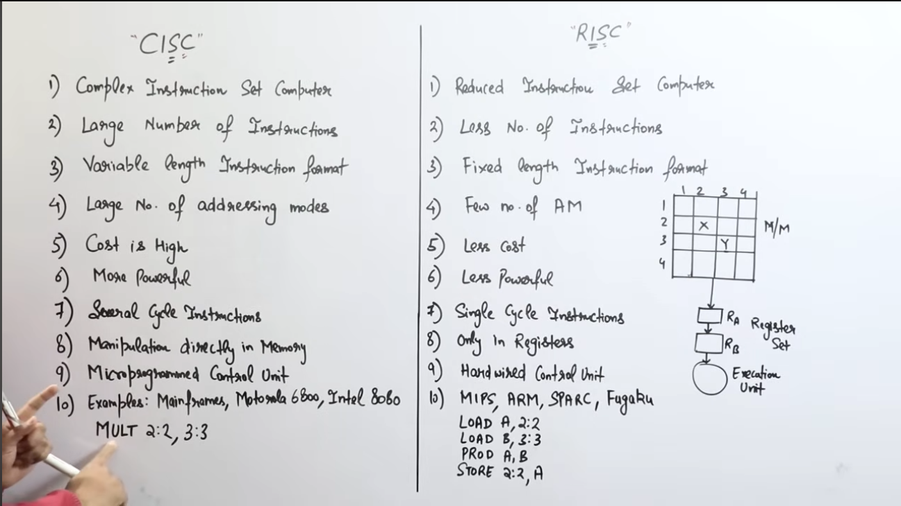

---


## MIPS instruction formats.

??? question "MIPS instruction formats."

      অবশ্যই! শিটের শুরুর দিকে MIPS-এর যে মৌলিক বিষয়গুলো এবং এর পেছনের ধারণা নিয়ে আলোচনা করা হয়েছে, তা নিচে সহজভাবে তুলে ধরা হলো:

      ### MIPS কী?

      MIPS-এর পূর্ণরূপ হলো **Microprocessor without Interlocked Pipelined Stages**।
      এটি ১৯৮০-এর দশকে তৈরি করা একটি **RISC (Reduced Instruction Set Computer)** আর্কিটেকচার, যা মূলত উচ্চ কর্মক্ষমতা (high performance) এবং সরলতার জন্য ডিজাইন করা হয়েছিল।

      ### MIPS বা RISC আর্কিটেকচারের মূল বৈশিষ্ট্যসমূহ

      MIPS কিছু নির্দিষ্ট নীতি বা বৈশিষ্ট্যের ওপর ভিত্তি করে কাজ করে:

      * **সরল অপারেশন (Simple operation):** MIPS-এ প্রতিটি নির্দেশ (instruction) দিয়ে কেবল একটি মাত্র গাণিতিক কাজ (arithmetic task) করা যায়।


      * **নির্দিষ্ট মাপ (Fixed format):** MIPS-এর প্রতিটি নির্দেশ ঠিক ৩২-বিট (32-bit) লম্বা বা ফিক্সড সাইজের হয়।


      * **রেজিস্টার-ভিত্তিক (Register based / Load-Store Architecture):** MIPS-এ যাবতীয় গাণিতিক কাজ (যেমন: যোগ, বিয়োগ) সরাসরি মেমরিতে করা যায় না, এগুলো কেবল প্রসেসরের ভেতরের রেজিস্টারের ডেটার ওপর করা যায়। মেমরিতে প্রবেশের জন্য শুধুমাত্র `load` এবং `store` নির্দেশ ব্যবহার করতে হয়।


      * **দ্রুত এক্সিকিউশন (Fast execution):** ইনস্ট্রাকশনগুলো এতই সরল যে, এগুলোকে এক ক্লক সাইকেলেই (one clock cycle) কাজ শেষ করার জন্য ডিজাইন করা হয়েছে।


      ### "Without Interlocked Pipeline Stages" কথার অর্থ কী?

      সাধারণত প্রসেসরে যখন একটার পর একটা নির্দেশ পাইপলাইনে (পরপর ধাপে) চলতে থাকে, তখন একটি ডেটা প্রস্তুত হওয়ার আগেই যদি পরের নির্দেশ তা ব্যবহার করতে চায়, তখন এরর (Data Hazard) দেখা দেয়। এই অবস্থায় অনেক প্রসেসরের হার্ডওয়্যার নিজে থেকেই কাজ কিছুক্ষণ থামিয়ে দেয় বা 'স্টল' (stall) করে। যাকে 'ইন্টারলকড' পাইপলাইন বলা হয়।
      কিন্তু MIPS মেশিনে হার্ডওয়্যার নিজে থেকে এই কাজ করে না। এই ডেটা হ্যাজার্ড বা এরর সামলানোর (explicit NOPs জেনারেট করার) দায়িত্ব হার্ডওয়্যারের বদলে সফটওয়্যার বা কম্পাইলারের ওপর ছেড়ে দেওয়া হয়। এ জন্যই একে "Without Interlocked Pipeline Stages" বলা হয়।

      ### MIPS-এর ৫টি ক্লাসিক পাইপলাইন স্টেজ (Pipeline Stages)

      MIPS-এ একটি নির্দেশের কাজ শেষ হতে প্রথাগতভাবে ৫টি ধাপ বা স্টেজ পার হতে হয়:
      ১. **IF (Instruction Fetch):** মেমরি থেকে নির্দেশটি প্রসেসরে নিয়ে আসা হয়।
      ২. **ID (Instruction Decode/Register Fetch):** নির্দেশটি ডিকোড করে এর অর্থ বোঝা হয় এবং রেজিস্টার থেকে ডেটা নেওয়া হয়।
      ৩. **EX (Execute):** এই ধাপে গাণিতিক কাজ বা হিসাব করা হয়।
      ৪. **MEM (Memory access):** শুধু `load` বা `store` নির্দেশের ক্ষেত্রে এই ধাপে মেমরিতে ঢোকা হয় (অন্য নির্দেশের জন্য এটি স্কিপ করা হয়)।
      ৫. **WB (Write Back):** ফলাফলটি আবার রেজিস্টারে লিখে সেভ করা হয়।

      ### MIPS-এ মাত্র ৩২টি রেজিস্টার কেন?

      MIPS-এ মোট ৩২টি জেনারেল-পারপাস রেজিস্টার থাকে। এর প্রধান কারণ হলো **"Smaller is faster"**। অর্থাৎ, মেমরি বা রেজিস্টারের আকার যত ছোট হবে, প্রসেসর সেখান থেকে তত দ্রুত ডেটা খুঁজে বের করতে পারবে। স্পিড বা দ্রুতগতির জন্যই এতে খুব বেশি রেজিস্টার রাখা হয়নি।   
      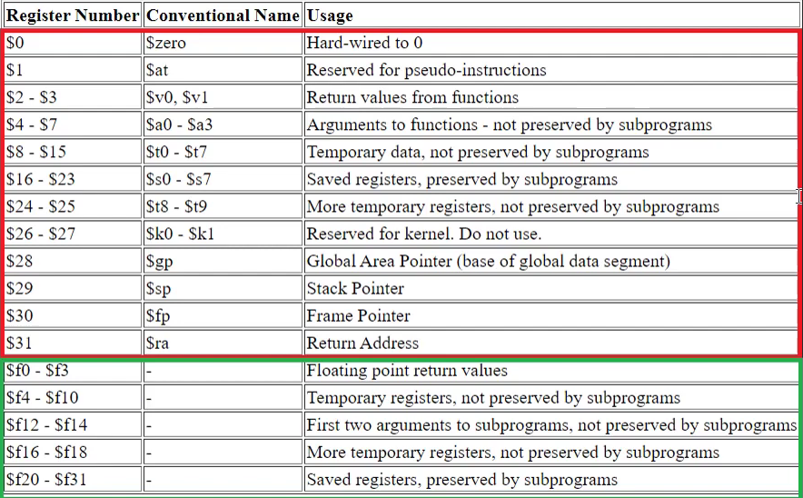

      আপনার দেওয়া স্লাইড এবং ভিডিওটি থেকে MIPS Instruction Format-এর পুরো বিষয়টি সহজ ও গুছিয়ে নিচে তুলে ধরা হলো।

      MIPS আর্কিটেকচারে প্রতিটি ইনস্ট্রাকশন বা নির্দেশ ঠিক **৩২-বিটের (32-bit)** হয়। এই ৩২ বিটকে কীভাবে ভাগ করে প্রসেসরকে নির্দেশ দেওয়া হবে, তার ওপর ভিত্তি করে MIPS ইনস্ট্রাকশনকে **৩টি প্রধান ফরম্যাটে** ভাগ করা হয়:

      ### ১. R-Type (Register Type)

      যেসব অপারেশনে কোনো মেমরি বা বাইরের সংখ্যার দরকার হয় না, কেবল রেজিস্টার থেকে ডেটা নিয়ে কাজ করা হয়, সেগুলো R-type।
      এই ৩২ বিটকে **৬টি অংশে** ভাগ করা হয়:

      * **op (6 bits):** Opcode. R-type এর ক্ষেত্রে এটি সবসময় **৬টি শূন্য (000000)** হয়।
      * **rs (5 bits):** First source register (প্রথম উৎস)।


      * **rt (5 bits):** Second source register (দ্বিতীয় উৎস)।
      * **rd (5 bits):** Destination register (গন্তব্য, যেখানে ফলাফল রাখা হবে)।
      * **shamt (5 bits):** Shift amount। (শিফট অপারেশন ছাড়া অন্য সময় এটি ৫টি শূন্য হয়)।
      * **funct (6 bits):** Function code। যেহেতু op সবসময় ০, তাই এই অংশটি প্রসেসরকে বলে দেয় ঠিক কী কাজ করতে হবে (যেমন: add, sub)।

      **উদাহরণ:**

      * `add $t0, $s1, $s2` : এখানে `$s1` (rs) এবং `$s2` (rt) এর মান যোগ করে ফলাফল `$t0` (rd) তে রাখা হচ্ছে।
      * `sll $s2, $t3, 2` (Shift Left Logical): এখানে `$t3` (rs) এর ডেটাকে **২ বিট** (shamt) বামে শিফট করে `$s2` (rd) তে সেভ করা হচ্ছে।

      ### ২. I-Type (Immediate Type)

      যখন ইনস্ট্রাকশনের ভেতরেই সরাসরি কোনো সংখ্যা (constant) বা মেমরি অ্যাড্রেস দেওয়া থাকে, তখন I-type ব্যবহৃত হয়।
      এর ৩২ বিটকে **৪টি অংশে** ভাগ করা হয়:

      * **op (6 bits):** Opcode (এটি বলে দেয় কী কাজ হবে, যেমন: lw, sw, beq)।
      * **rs (5 bits):** Source register (বেইজ অ্যাড্রেস বা উৎস)।
      * **rt (5 bits):** Destination বা Source register (নির্দেশের ওপর ভিত্তি করে)।
      * **Immediate / Constant (16 bits):** সরাসরি দেওয়া সংখ্যা বা অফসেট অ্যাড্রেস। এই ১৬-বিটের সংখ্যাটিকে প্রয়োজনে সাইন-এক্সটেন্ড (Sign-extend) করে ৩২-বিট করা হয়।

      **উদাহরণ ও ভিডিওর গুরুত্বপূর্ণ টিপস:**

      * **Load Word (`lw $t0, 4($s3)`):** মেমরি থেকে ডেটা রেজিস্টারে আনার জন্য। এখানে `$s3` হলো বেস অ্যাড্রেস, যার সাথে `4` যোগ করে আসল অ্যাড্রেস পাওয়া যায়। সেই অ্যাড্রেসের ডেটা `$t0` তে লোড হয়। **(এখানে প্রথম রেজিস্টার `$t0` হলো Destination)**।

      * **Store Word (`sw $t0, 8($s3)`):** রেজিস্টার থেকে ডেটা মেমরিতে সেভ করার জন্য। **(ভিডিও অনুযায়ী, এখানে প্রথম রেজিস্টার `$t0` হলো Source, কারণ ডেটা $t0 থেকে মেমরিতে যাচ্ছে)**।

      * **Branching (`beq $t0, $t1, else`):** যদি `$t0` এবং `$t1` সমান হয়, তবে প্রোগ্রাম `else` অ্যাড্রেসে লাফ দেবে (Jump)।

      * **Add Immediate (`addi $t0, $t1, 14`):** `$t1` এর সাথে সরাসরি ১৪ (Immediate value) যোগ করে `$t0` তে রাখা।

      ### ৩. J-Type (Jump Type)

      প্রোগ্রামের এক লাইন থেকে অন্য একটি নির্দিষ্ট মেমরি অ্যাড্রেসে সরাসরি লাফ দেওয়ার (Jump) জন্য এই ফরম্যাট ব্যবহৃত হয়।
      এর ৩২ বিটকে মাত্র **২টি অংশে** ভাগ করা হয়:

      * **op (6 bits):** Opcode.
      * **Target Address (26 bits):** যে মেমরি অ্যাড্রেসে লাফ দিতে হবে।

      **উদাহরণ:**

      * **`j loop` (Jump):** এটি সরাসরি `loop` নামক অ্যাড্রেসে প্রোগ্রামকে পাঠিয়ে দেয়।
      * **`jal loop` (Jump and Link):** এটিও লাফ দেয়, তবে যাওয়ার আগে বর্তমান লাইনের ঠিক পরের লাইনের অ্যাড্রেসটি **`$ra` (Return Address)** রেজিস্টারে সেভ করে রাখে। এর ফলে ফাংশনের কাজ শেষ হওয়ার পর `jr $ra` কমান্ড ব্যবহার করে প্রোগ্রাম আবার আগের জায়গায় ঠিকমতো ফিরে আসতে পারে।

      সংক্ষেপে:
      * **R-type:** সব কাজ রেজিস্টারের ভেতরেই হয় (৬টি ফিল্ড)।
      * **I-type:** একটি নির্দিষ্ট সংখ্যা (constant/immediate) নিয়ে কাজ হয় (৪টি ফিল্ড)।
      * **J-type:** অনেক দূরের কোনো অ্যাড্রেসে লাফ দেওয়ার জন্য ব্যবহৃত হয় (২টি ফিল্ড)।

# Part B — Instructions, ISA, Datapath and Control

## Basic: 


??? note "Define instruction types and define each types in details for 50 marks with example and block diagrams."

	An **instruction** in Computer Organisation and Architecture (COA) is a binary command given to the Central Processing Unit (CPU) to perform a specific operation. The collection of all instructions understood by a processor is called its **Instruction Set Architecture (ISA)**.

	Architecturally, instructions are classified into three primary functional categories:

	1. **Data Transfer Instructions:** Move data between registers, memory, and I/O devices without modifying the content.
	2. **Data Manipulation Instructions:** Perform computational tasks on data, subdivided into **Arithmetic**, **Logical**, and **Shift** instructions.
	3. **Program Control Instructions:** Alter the sequential execution flow of a program by modifying the Program Counter (PC).

	---

	## Category 1: Data Transfer Instructions

	Data Transfer Instructions handle the relocation of data between source and destination endpoints across the system buses. They do not alter the binary bits being moved.

	### 1. Data Transfer Paths & Locations

	Data movement occurs across three hardware boundaries:

	* **Register to Register:** Fast transfer within internal CPU registers (e.g., Accumulator, General Purpose Registers).
	* **Register to/from Memory:** Relocating data between CPU registers and primary memory (RAM).
	* **Register/Memory to/from I/O Devices:** Interfacing with peripherals (keyboard, monitor, printer). External devices like printers maintain their own internal memory buffers and control registers to handle incoming data streams.

	```
	+-------------------------------------------------------------------+
	|                        DATA TRANSFER PATHS                        |
	|                                                                   |
	|   +-------------------+  Load / Store  +----------------------+   |
	|   |  CPU Registers    | <------------> |    Main Memory       |   |
	|   | (ACC, R1, PC, IR) |                |        (RAM)         |   |
	|   +-------------------+                +----------------------+   |
	|             ^                                     ^               |
	|             | IN / OUT                            | Direct Memory |
	|             v                                     v Access (DMA)  |
	|   +-----------------------------------------------------------+   |
	|   |                  I/O Peripheral Devices                   |   |
	|   |             (Keyboard, Printer Buffer, Display)           |   |
	|   +-----------------------------------------------------------+   |
	+-------------------------------------------------------------------+

	```

	### 2. Role of Addressing Modes

	The micro-operations executed during data transfer depend on the **Addressing Mode** (e.g., Immediate, Direct, Indirect, Register Indirect, Indexed). A single command like `MOV` or `LD` can execute in 7 to 8 distinct variations depending on how operand addresses are specified in the instruction format.

	### 3. Command List & Sub-categories

	| Sub-category | Command / Mnemonic | Description / Micro-operation | Example |
	| --- | --- | --- | --- |
	| **Register Transfer** | `MOV Dest, Src` | Copies contents from source location to destination. | `MOV R1, R2` *(R1 ← R2)* |
	| **Immediate Transfer** | `MOV Reg, Data` | Loads a direct operand constant directly into a register. | `MOV R1, 500` *(R1 ← 500)* |
	| **Memory Load** | `LD` / `LDA` | Fetches data from memory into a register or Accumulator. | `LD R1, X` *(R1 ← M[X])* |
	| **Memory Store** | `ST` / `STA` | Transfers data from a register or Accumulator to memory. | `STA X` *(M[X] ← ACC)* |
	| **Data Exchange** | `XCHG` | Swaps contents between two registers or memory locations. | `XCHG R1, R2` *(R1 ↔ R2)* |
	| **Input Operation** | `IN` | Fetches data from an input port to an internal register. | `IN R1, Port_A` |
	| **Output Operation** | `OUT` | Sends data from a register to an output port. | `OUT Port_B, R1` |
	| **Stack Transfer** | `PUSH` / `POP` | Pushes data onto or pops data off a LIFO Stack memory. | `PUSH R1` / `POP R2` |
	| **Bit Setting** | `SET` / `CLR` | Forces target register bits to `1` (`SET`) or `0` (`CLR`). | `CLR R1` *(R1 ← 0)* |

	---

	## Category 2: Data Manipulation Instructions

	Data Manipulation Instructions perform computational operations on binary data. They are divided into **Arithmetic**, **Logical**, and **Shift** instructions.

	```
	+-------------------------------------------------------------------+
	|                   DATA MANIPULATION INSTRUCTIONS                  |
	|                                                                   |
	|   +-------------------+   +-------------------+   +-----------+   |
	|   |    Arithmetic     |   |      Logical      |   |   Shift   |   |
	|   | (+, -, *, /, INC) |   | (AND, OR, NOT, X) |   | (LSL, ASR)|   |
	|   +-------------------+   +-------------------+   +-----------+   |
	|             \                       |                  /          |
	|              v                      v                 v           |
	|   +-----------------------------------------------------------+   |
	|   |               Arithmetic Logic Unit (ALU)                 |   |
	|   +-----------------------------------------------------------+   |
	+-------------------------------------------------------------------+

	```

	---

	### Sub-category 2A: Arithmetic Instructions

	Arithmetic instructions perform basic mathematical operations ($+$, $-$, $\times$, $\div$) on numeric operands stored in registers or memory.

	#### 1. Hardware Primitives vs. Software Loops

	* **Primitive Hardware:** Basic microprocessors contain hardware circuits only for Addition and Subtraction.
	* **Software Multiplication:** Implemented via addition loops (e.g., $2 \times 3 = 2 + 2 + 2$).
	* **Software Division:** Implemented via repeated subtraction loops.


	* **Modern ALU Optimizations:** Modern CPUs incorporate dedicated, high-speed hardware multipliers and dividers within the ALU. Dedicated hardware eliminates software loop overhead, increasing execution speed. Higher mathematical functions (exponential, logarithmic, trigonometric) are derived from these four core operations.

	#### 2. Instruction vs. Micro-Operation Execution

	An **Instruction** is a macro-level assembly command, whereas a **Micro-operation** is an elementary hardware step performed by the ALU during execution clock cycles.

	For a 3-Address instruction $C = A + B$ (`ADD C, A, B`):

	```
	[Instruction Memory] ---> [Fetch Phase] ---> [Instruction Register (IR)]
														|
														v
												[Decode Phase]
												(Opcode + Operands)
														|
														v
	[Write Back C] <--- [Execute Phase (ALU)] <--- [Operand Fetch Phase]

	```

	1. **Instruction Fetch:** Instruction is transferred from memory to the Instruction Register (IR).
	2. **Instruction Decode:** Decoder separates the **Opcode** (`ADD`) from **Operands** ($A, B, C$).
	3. **Operand Fetch:** Operands $A$ and $B$ are retrieved based on the addressing mode.
	4. **Execution:** ALU adds values and writes the result into destination address $C$.

	#### 3. Command List & Examples

	| Mnemonic | Name | Operation / Example | Description |
	| --- | --- | --- | --- |
	| `ADD` | Add | `ADD R1, R2` *(R1 ← R1 + R2)* | Adds contents of two registers. |
	| `SUB` | Subtract | `SUB R1, R2` *(R1 ← R1 - R2)* | Subtracts source from destination. |
	| `MUL` | Multiply | `MUL R1, R2` *(R1 ← R1 * R2)* | Hardware binary multiplication. |
	| `DIV` | Divide | `DIV R1, R2` *(R1 ← R1 / R2)* | Hardware binary division. |
	| `INC` | Increment | `INC R1` *(R1 ← R1 + 1)* | Increments register flip-flop counter by 1. |
	| `DEC` | Decrement | `DEC R1` *(R1 ← R1 - 1)* | Decrements register flip-flop counter by 1. |
	| `ADC` | Add with Carry | `ADC R1, R2` *(R1 ← R1 + R2 + Carry)* | Propagates previous carry bit into higher-order addition. |
	| `SBB` | Subtract w/ Borrow | `SBB R1, R2` *(R1 ← R1 - R2 - Borrow) | Propagates borrow bit into higher-order subtraction. |
	| `NEG` | Negate | `NEG R1` *(R1 ← 2's Complement of R1)* | Converts positive values to negative (e.g., $+5 \to -5$). |

	---

	### Sub-category 2B: Logical Instructions

	Logical instructions perform bitwise boolean operations on binary vectors. They are used for bit manipulation, masking, testing, and flag control.

	#### 1. Core Logic Operations & Applications

	* **Complement / NOT:** Inverts all bits ($0 \to 1, 1 \to 0$). 1's complement is derived in hardware by XORing data against an all-1s bitmask ($0101_2 \text{ XOR } 1111_2 = 1010_2$).
	* **Clear (`CLR`):** Resets target register flip-flops to 0 in a single clock pulse.
	* **Bitwise AND (Bit Masking & Selective Clearing):** ANDing any bit with $0$ forces it to $0$.
	* **Subnetting Application:** Performs bitwise AND between an IP address and a Subnet Mask to isolate the Network/Subnet ID.
	* **Even/Odd Detection:** Performs bitwise AND between an integer bitstring and $0001_2$:
	* *Even Result ($0000_2$):* Least Significant Bit (LSB) is $0$.
	* *Odd Result ($0001_2$):* Least Significant Bit (LSB) is $1$.


	* **Bitwise OR (Selective Setting):** ORing any bit string with $1$ forces those bit positions to $1$.
	* **Bitwise XOR (Modulo-2 Addition):** Outputs $0$ for matching bits and $1$ for different bits. Equivalent to Modulo-2 addition without carry ($1 + 1 = 2 \pmod 2 = 0$).

	#### 2. Flag & Interrupt Control Commands

	| Mnemonic | Name | Operation | Primary Use Case |
	| --- | --- | --- | --- |
	| `CLC` | Clear Carry | Carry Flag $\leftarrow 0$ | Clears unwanted carry status before addition. |
	| `STC` | Set Carry | Carry Flag $\leftarrow 1$ | Provides $+1$ offset for 2's complement generation. |
	| `CMC` | Complement Carry | Carry Flag $\leftarrow \overline{\text{Carry}}$ | Inverts existing carry status. |
	| `EI` | Enable Interrupt | Interrupt Flag $\leftarrow 1$ | Unmasks hardware/software interrupts. |
	| `DI` | Disable Interrupt | Interrupt Flag $\leftarrow 0$ | Masks interrupts during critical execution sections. |

	---

	### Sub-category 2C: Shift Instructions

	Shift instructions move bits within a register left or right. They are used in serialization, bit manipulation, and fast arithmetic computations.

	#### 1. Operational Types

	```
	1. Logical Shift Left (LSL):       [0] <-- [Bit 7 <-- Bit 0] <-- 0
									(Exits)

	2. Logical Shift Right (LSR):       0 --> [Bit 7 --> Bit 0] --> [0]
																(Exits)

	3. Arithmetic Shift Right (ASR): [Sign] -> [Sign Copy --> Bit 0] --> [0]
									(Preserved)                        (Exits)

	4. Rotate Left (ROL):             +--- [Bit 7 <-- Bit 0] <---+
									|                          |
									+--------------------------+

	5. Rotate Right w/ Carry (RCR):   +-> [Carry] -> [Bit 7 --> Bit 0] -+
									|                                 |
									+---------------------------------+

	```

	* **Logical Shift Left (LSL):** Moves bits left. Discards the MSB; fills the vacated LSB with $0$. Equivalent to **multiplying by 2** ($\times 2$).
	* **Logical Shift Right (LSR):** Moves bits right. Discards the LSB; fills the vacated MSB with $0$. Equivalent to **unsigned integer division by 2** ($\div 2$).
	* **Arithmetic Shift Right (ASR):** Used for **signed 2's complement numbers**. Moves bits right and discards the LSB, but **copies the MSB sign bit** back into the vacated MSB position to preserve sign integrity.
	* **Arithmetic Shift Left (ASL):** Identical to Logical Shift Left ($0$ inserted at LSB). Hardware systems implement only one version.
	* **Rotate Left (ROL) & Rotate Right (ROR):** Circular shifts where exiting boundary bits wrap around to fill the vacated opposite end without losing bits.
	* **Rotate Through Carry (RCL / RCR):** Operates across a **9-bit circular loop** consisting of the 8-bit register plus the 1-bit Carry Flag.

	#### 2. Instruction Format

	Shift instruction opcodes contain dedicated fields specifying the shift type, shift direction, and shift count:

	$$\begin{array}{\|c\|c\|c\|c\|c\|} \hline \text{Addressing Mode} & \text{Opcode (Shift)} & \text{Type (Logical/Arith/Rotate)} & \text{Direction \& Count} & \text{Register Operand} \\ \hline \end{array}$$

	---

	## Category 3: Program Control (Transfer of Control) Instructions

	Program Control Instructions alter the normal execution sequence of a program.

	### 1. Sequential Execution vs. Transfer of Control

	* **Implicit Mode (Sequential Execution):** Under default conditions, the CPU executes instructions sequentially. The Program Counter (PC) automatically increments to hold the memory address of the next instruction ($100 \to 101 \to 102 \to 103$).
	* **Transfer of Control (Non-Sequential Execution):** Program Control instructions break sequential execution by loading a new target address into the Program Counter ($PC \leftarrow \text{Target Address}$). This enables loops, function/subroutine calls, conditional branching (`if-else`), and interrupt handling.

	---

	### 2. Detailed Sub-categories & Commands

	```
	Sequential Execution: [PC = 100] -> [PC = 101] -> [PC = 102] -> [PC = 103]

	Unconditional Branch: [PC = 101 (JMP 3000)] -------------------> [PC = 3000]

	Conditional Branch:   [PC = 101 (BE R1, R2, 2000)]
								|
						+---------+---------+
						|                   |
				(R1 == R2)          (R1 != R2)
						|                   |
						v                   v
				[PC = 2000]          [PC = 102] (Sequential)

	```

	#### A. Unconditional Branch Instructions

	Transfers execution directly to a target address without evaluating conditions.

	* **`JMP Target` / `BRANCH Target`:** Writes the target address directly into the Program Counter ($PC \leftarrow 2000$).
	* **`SKP` (Skip):** Bypasses the immediately following instruction by incrementing the Program Counter an extra step ($PC \leftarrow PC + 2$), skipping execution of the next line.

	#### B. Conditional Branch Instructions

	Evaluates processor status flags or register comparisons before branching. If the condition evaluates to **True**, control branches to the target address; if **False**, execution continues sequentially.

	* **`BE R1, R2, Target` (Branch if Equal):** Compares $R1$ and $R2$. If $R1 == R2$, $PC \leftarrow \text{Target}$; otherwise, $PC \leftarrow PC + 1$.
	* **`BNZ R1, Target` (Branch if Non-Zero):** Branches to the target address if register $R1 \neq 0$.
	* **`BGT` / `BLT`:** Branch if Greater / Branch if Less Than.

	#### C. Subroutine Instructions & Stack Flow

	Used to handle reusable code modules (functions/procedures).

	```
	Main Program                              Stack Memory
	+-----------------------+                 +-----------------------+
	| Address 100: Inst 1   |                 |                       |
	| Address 101: CALL 3000| --(1. Push)---> | Return Addr (102)     | [SP]
	| Address 102: Inst 3   | <-(3. Pop RET)- +-----------------------+
	+-----------------------+
				|
		(2. Jump)
				v
	Subroutine (Function)
	+-----------------------+
	| Address 3000: Code... |
	| Address 3015: RET     | 
	+-----------------------+

	```

	1. **`CALL Target`:**
	* Pushes the current return address ($PC + 1$) onto the **Stack** ($M[SP] \leftarrow PC$).
	* Loads the target subroutine address into the Program Counter ($PC \leftarrow 3000$).


	2. **`RET` (Return):**
	* Pops the saved return address from the Stack back into the Program Counter ($PC \leftarrow M[SP]$), resuming execution in the main program.


	#### D. Interrupt & Machine Control Instructions

	* **`TRAP` / `INTR`:** Hardware or software-generated interrupts that suspend current main-line execution to service an Interrupt Service Routine (ISR).
	* **`NOP` (No Operation):** Consumes one clock cycle without modifying registers or memory. Used for delay loops.
	* **`HALT`:** Stops CPU instruction fetching and execution until a hardware reset or interrupt occurs.

	---

	## Comprehensive Master Instruction Set Reference

	| Instruction Category | Sub-category | Key Mnemonics | Primary Target / Operand | Hardware Effect / Purpose |
	| --- | --- | --- | --- | --- |
	| **Data Transfer** | Register/Memory Transfer | `MOV`, `LD`, `ST`, `XCHG` | Registers, RAM | Moves data without modification across system buses. |
	|  | Peripheral Transfer | `IN`, `OUT` | I/O Ports, Peripherals | Interfaces processor with external hardware. |
	|  | Stack Operations | `PUSH`, `POP` | Stack Memory, Stack Pointer | Manages temporary parameters and function frames. |
	| **Data Manipulation** | Arithmetic Operations | `ADD`, `SUB`, `MUL`, `DIV` | ALU Registers | Performs algebraic math operations on data. |
	|  | Extended Arithmetic | `ADC`, `SBB`, `INC`, `DEC`, `NEG` | Registers, Carry Flag | Handles multi-byte arithmetic, counters, and 2's complements. |
	|  | Logical Operations | `AND`, `OR`, `XOR`, `NOT`, `CLR` | Bit Vectors, Registers | Performs bit masking, selective setting, and even/odd checks. |
	|  | Machine Flag Control | `CLC`, `STC`, `CMC`, `EI`, `DI` | Status Flags | Configures carry flags and masks processor interrupts. |
	|  | Bit Shifting | `LSL`, `LSR`, `ASL`, `ASR` | Registers | Performs bit alignment, binary multiplication, and division. |
	|  | Circular Rotations | `ROL`, `ROR`, `RCL`, `RCR` | Registers, Carry Bit | Rotates bits circular-wise with or without carry status. |
	| **Program Control** | Unconditional Branching | `JMP`, `BR`, `SKP` | Program Counter (PC) | Changes PC address unconditionally. |
	|  | Conditional Branching | `BE`, `BNZ`, `BGT`, `BLT` | Status Flags, PC | Implements decision-making blocks (`if-else`). |
	|  | Subroutines | `CALL`, `RET` | Stack, PC | Manages function invocations and returns. |
	|  | System / Halt Control | `NOP`, `HALT`, `TRAP` | CPU Control Logic | Handles timing delays, interrupts, and system termination. |

	Here are the short notes structured as a hierarchical mindmap tree. Every single sub-type discussed across the videos is listed clearly without compression.

	### **Mindmap: Instruction Types in Computer Architecture**

	* **1. DATA TRANSFER INSTRUCTIONS**
	* *Core Function:* Copy data from source to destination without modification.
	* **A. Based on Location**
	* 1. Register to Register
	* 2. Register to Memory
	* 3. Memory to Register
	* 4. Input to Register/Memory (from peripheral)
	* 5. Register/Memory to Output (to peripheral)
	* 6. Stack Operations
	* a. PUSH (Store to stack)
	* b. POP (Retrieve from stack)

	* **B. Based on Addressing Mode Variations (Example: MOV)**
	* 1. Immediate Move (MOV R1, 500)
	* 2. Direct Move (MOV R1, X)
	* 3. Indirect Move
	* 4. Base Addressing Move
	* *(Note: 7 to 8 variations exist based on mode)*

	* **C. Core Mnemonic List**
	* 1. MOV (Move/Copy)
	* 2. LD / LOAD (Load to Register/Accumulator)
	* 3. ST / STORE (Store to Memory)
	* 4. XCHG (Exchange/Swap)
	* 5. IN (Input)
	* 6. OUT (Output)
	* 7. SET (Set to 1)
	* 8. CLR (Clear to 0)

	* **2. DATA MANIPULATION INSTRUCTIONS**
	* *Core Function:* Perform operations on data to form new results.
	* **I. ARITHMETIC INSTRUCTIONS**
	* *Function:* Perform basic mathematical calculations.
	* **A. Fundamental Operations**
	* 1. ADD (Addition)
	* 2. SUB (Subtraction)
	* 3. MUL (Multiplication)
	* 4. DIV (Division)

	* **B. Incremental Operations**
	* 1. INC (Increment by 1)
	* 2. DEC (Decrement by 1)

	* **C. Operations with Flags**
	* 1. ADC (Add with Carry)
	* 2. SBB / SUBB (Subtract with Borrow)

	* **D. Sign Manipulation**
	* 1. NEG (Negate - create 2's complement)

	* **II. LOGICAL INSTRUCTIONS**
	* *Function:* Perform bitwise operations on binary data.
	* **A. Boolean Logic Operations**
	* 1. NOT / COMPLEMENT (1's Complement)
	* 2. AND (Bitwise multiplication / Masking)
	* 3. OR (Bitwise addition / Selective setting)
	* 4. XOR (Modulo-2 addition / Swapping/Testing parity)

	* **B. Flag Manipulation**
	* 1. CLC (Clear Carry flag to 0)
	* 2. STC (Set Carry flag to 1)
	* 3. CMC (Complement Carry flag)

	* **C. Machine Control**
	* 1. EI (Enable Interrupts)
	* 2. DI (Disable Interrupts)
	* 3. CLR (Clear/Reset register bits)

	* **III. SHIFT INSTRUCTIONS**
	* *Function:* Move bits left or right within a register.
	* **A. Logical Shifts**
	* 1. Logical Shift Left (LSL)
	* 2. Logical Shift Right (LSR)

	* **B. Arithmetic Shifts**
	* 1. Arithmetic Shift Left (ASL) — *(Often identical to LSL)*
	* 2. Arithmetic Shift Right (ASR)

	* **C. Rotate / Circular Shifts**
	* 1. Rotate Left (ROL)
	* 2. Rotate Right (ROR)

	* **D. Rotate through Carry**
	* 1. Rotate Left through Carry (RCL)
	* 2. Rotate Right through Carry (RCR)


	* **3. PROGRAM CONTROL INSTRUCTIONS**
	* *Core Function:* Change the flow of program execution by modifying the Program Counter.
	* **A. Unconditional Transfer**
	* *Function:* Jump without checking any condition.
	* 1. JMP / JUMP (Direct jump to address)

	* 2. BRA / BRANCH (Jump relative to current location)
	* 3. SKP / SKIP (Skip the very next instruction)
	* 4. CALL (Invoke subroutine/function; save return address)
	* 5. RET / RETURN (Return from subroutine; retrieve return address)

	* **B. Conditional Transfer**
	* *Function:* Jump only if a specific condition is met.
	* 1. Branch on Register Comparison

	* a. BE / BZ (Branch if Equal/Zero)
	* b. BNE / BNZ (Branch if Not Equal/Not Zero)

	* 2. Branch on Processor Flags

	* *(Note: Examples include Branch if Carry, Branch if No Overflow, etc.)*

	
	
	

## 1. Consider the below instruction: `Load R2, LOC`. Write the execution step of the above machine instruction.

??? "Consider the below instruction: `Load R2, LOC`. Write the execution step of the above machine instruction."


	Assume **direct addressing**, so `LOC` is the memory address of the operand and the instruction means:

	$$R2 \leftarrow M[\text{LOC}]$$

	Using `PC`, `MAR`, `MDR` and `IR`, a typical sequence is:

	| Step | Register-transfer operation | Meaning |
	|---|---|---|
	| T0 | `MAR ← PC` | Send next-instruction address to memory. |
	| T1 | `MDR ← M[MAR]`, `PC ← PC + instruction_length` | Read instruction and advance PC. |
	| T2 | `IR ← MDR` | Place instruction in IR and decode it. |
	| T3 | `MAR ← IR[address]` | Put `LOC` in MAR. |
	| T4 | `MDR ← M[MAR]` | Read the operand stored at `LOC`. |
	| T5 | `R2 ← MDR` | Complete the load. |

	With a cache or synchronous memory, T1/T4 may include wait states. The operation changes `R2` but not the memory word at `LOC`.


## 2. Characteristics of a RISC vs CISC Processor show 12 disctinction with example. 

??? "Characteristics of a RISC vs CISC Processor show 12 disctinction with example. "

	### The Classic Example: Multiplying Two Numbers in Memory

	Imagine you want to multiply the data at memory address `A` with the data at memory address `B`, and save it back to `A`.

	* **The CISC Approach (1 step):**
	`MULT A, B`
	The CPU's hardware does everything. It goes to memory, fetches both values, multiplies them, and stores the result back. It takes multiple clock cycles, but it only takes up one line of code.
	* **The RISC Approach (4 steps):**
	`LOAD R1, A`
	`LOAD R2, B`
	`PROD R1, R2`
	`STORE R1, A`
	The CPU can only do math on registers, not directly on memory. The compiler has to break the complex task into simple, one-step commands.

	---

	## The 12 Key Distinctions

	Here is how the two architectures fundamentally differ:

	| Feature | RISC (Reduced Instruction Set Computer) | CISC (Complex Instruction Set Computer) |
	| --- | --- | --- |
	| **1. Design Philosophy** | Moves the complexity to the software (compiler). | Moves the complexity to the hardware (silicon). |
	| **2. Instruction Length** | Fixed-length (e.g., every command is exactly 32 bits). | Variable-length (commands change size based on complexity). |
	| **3. Execution Time** | Most instructions execute in a single clock cycle. | Complex instructions can take many clock cycles to finish. |
	| **4. Memory Access** | **Load/Store Architecture:** Only specific commands access RAM. | **Memory-to-Memory:** Math operations can happen directly on RAM. |
	| **5. Register Count** | High. Data is kept in the CPU as long as possible to avoid slow RAM. | Low. The CPU frequently reads and writes directly to RAM. |
	| **6. Pipelining** | Highly efficient. Uniform instruction lengths make it easy to queue up commands. | Difficult. Variable execution times cause bottlenecks in the queue. |
	| **7. Code Size (RAM Usage)** | Larger program sizes because complex tasks require multiple lines of code. | Smaller program sizes because a single line can execute a complex task. |
	| **8. Addressing Modes** | Very few, simple ways to locate data in memory. | Dozens of complex ways to locate and interact with memory. |
	| **9. Hardware Circuitry** | Simpler circuits, which leaves physical room on the chip for more L1/L2 Cache. | Highly complex circuits, requiring a dedicated microcode ROM on the chip. |
	| **10. Power Consumption** | Extremely low, making it ideal for battery-powered mobility. | High, generating more heat and requiring active cooling systems. |
	| **11. Execution Predictability** | Highly predictable, making it excellent for real-time operating systems. | Unpredictable, as time varies wildly depending on the instruction. |
	| **12. Real-World Examples** | ARM processors (Apple Silicon M-series, Snapdragon, smartphones). | x86 processors (Intel Core, AMD Ryzen, traditional desktop PCs). |

## 3. Three-Bus CISC-Style Processor Organization

???  "Draw the three-bus CISC-style processor organization."

	### What is a Three-Bus Architecture and Why Do We Use It?

	Inside a processor, data travels from one component to another through electrical pathways called **Busses**.

	In older 1-bus architectures, performing a simple operation like $A + B$ took multiple clock cycles because two different inputs could not travel over the same bus at the same time. The **Three-Bus Architecture** solves this by providing three separate pathways (**Bus A**, **Bus B**, and **Bus C**). This allows the system to fetch two inputs simultaneously, process them, and write the output back—all in a single step.

	* **Bus A and Bus B (Input Busses):** These fetch data from registers or memory registers and feed them directly into the execution units (like the ALU).
	* **Bus C (Output Bus):** This carries the resulting output from the ALU or other units and writes it back into the target register or memory location.

	
	

	### Understanding the Architecture Diagram Component-by-Component

	#### 1. PC (Program Counter) & Incrementer

	* **Function:** Tracks the memory address of the instruction currently being executed and determines the address of the next instruction.
	* **Connections:**
	* Connected to an **Incrementer** that automatically increases the address value by 1 or 4.
	* Outputs data to **Bus B** and receives new address values from **Bus C**.


	#### 2. Register File

	* **Function:** A collection of fast internal storage locations ($R_0, R_1, R_2\dots$) used to hold temporary data operands.
	* **Connections:**
	* Can read and output **two separate register values simultaneously** onto **Bus A** and **Bus B** (allowing two operands to reach the ALU at the same time).
	* Receives processed results from **Bus C** to store back into a target register.


	#### 3. Multiplexer (MUX) & ALU (Arithmetic Logic Unit)

	* **Function:** The ALU executes arithmetic operations (addition, subtraction) and logical operations (AND, OR).
	* **Multiplexer Role:** Selects whether Input A of the ALU receives data from **Bus A** or a fixed **Constant 4** (used for stepping through memory/PC increments).
	* **Connections:**
	* ALU Input A connects to the MUX output (which reads from Bus A).
	* ALU Input B connects directly to **Bus B**.
	* ALU Output $R$ connects directly to **Bus C**.

	#### 4. IR (Instruction Register) & Instruction Decoder

	* **Function:** The **IR** holds the binary instruction code fetched from main memory. The **Instruction Decoder** decodes this binary pattern to determine which control signals need to be generated (e.g., addition, subtraction, load, store).
	* **Connections:** Loads instruction data from **Bus C** and interfaces with internal control logic to drive Bus A and Bus B operations.

	#### 5. MDR (Memory Data Register) & MAR (Memory Address Register)

	* **Function:** These act as the hardware gateway between the internal processor busses and external main memory (RAM).
	* **MAR (Memory Address Register):** Holds the memory address where the system needs to read or write data.
	* **MDR (Memory Data Register):** Holds the actual data payload being transferred to or from main memory.

	* **Connections:**
	* Both MAR and MDR receive input addresses/data from **Bus C**.
	* MDR can output stored data back onto **Bus A** or **Bus B**.
	* The blue lines at the bottom represent external memory bus connections (Memory Data Lines and Address Lines).


	### How an Operation Executes in a Single Clock Cycle

	For example, to execute the register addition instruction `$R_3 = R_1 + R_2$`:

	1. Operand $R_1$ is placed onto **Bus A** and directed to ALU Input A.
	2. Operand $R_2$ is placed onto **Bus B** and directed to ALU Input B.
	3. The **ALU** performs the addition operation immediately.
	4. The result is placed onto **Bus C** and written directly into register $R_3$.


##  Explain the steps of Three-Bus CISC-style from start to execution.

??? "Explain the steps of Three-Bus CISC-style from start to execution."

	ডায়াগ্রামের **সবগুলো কম্পোনেন্টের** সম্ভাব্য সব ডেটা ফ্লো বা পাথ নিচে অ্যারো (->) দিয়ে দেখানো হলো:

	

	**১. Register File (রেজিস্টারসমূহ):**

	* রিড পাথ ১: Register file -> Bus A
	* রিড পাথ ২: Register file -> Bus B
	* রাইট পাথ: Bus C -> Register file

	**২. PC (Program Counter) ও Incrementer:**

	* আউটপুট পাথ: PC -> Bus B
	* ইনপুট/আপডেট পাথ: Bus C -> PC
	* ইনক্রিমেন্ট পাথ (লুপ): PC -> incrementer -> PC

	**৩. ALU (Arithmetic Logic Unit) ও MUX:**

	* ইনপুট পাথ (Bus A থেকে): Bus A -> MUX -> ALU (Input A)
	* ইনপুট পাথ (Constant 4 থেকে): Constant 4 -> MUX -> ALU (Input A)
	* ইনপুট পাথ (Bus B থেকে): Bus B -> ALU (Input B)
	* আউটপুট/রেজাল্ট পাথ: ALU (Output R) -> Bus C

	**৪. IR (Instruction Register) ও Decoder:**

	* ইনপুট পাথ: Bus C -> IR
	* ডিকোড পাথ: IR -> Instruction decoder

	**৫. MDR (Memory Data Register):**

	* প্রসেসর থেকে মেমোরিতে রাইট করার জন্য: Bus C -> MDR -> Memory bus (Data lines)
	* মেমোরি থেকে প্রসেসরে রিড করার জন্য: Memory bus (Data lines) -> MDR -> Bus B

	**৬. MAR (Memory Address Register):**

	* অ্যাড্রেস রিসিভ পাথ: Bus C -> MAR
	* মেমোরিতে অ্যাড্রেস পাঠানোর পাথ: MAR -> Address lines
	!!! "Example 01"

		এখানে `Add R4, R5, R6` ইনস্ট্রাকশনটি সম্পূর্ণ হওয়ার শুরু থেকে শেষ পর্যন্ত অর্ডারি ফ্লো দেওয়া হলো, যেখানে সিরিয়াল অনুযায়ী প্রতিটি কম্পোনেন্ট দেখানো হয়েছে:

		**Step 1 (Instruction Fetch - Address Phase):**

		* PC -> Bus B -> ALU (Pass) -> Bus C -> MAR -> Address lines
		* *(একই সময়ে প্যারালাল কাজ):* PC -> incrementer -> PC

		**Step 2 (Memory Read Phase):**

		* (Wait for MFC) -> Memory -> Memory bus (Data lines) -> MDR

		**Step 3 (Instruction Transfer & Decode Phase):**

		* MDR -> Bus B -> ALU (Pass) -> Bus C -> IR
		* IR -> Instruction decoder

		**Step 4 (Execution Phase - Add R4, R5, R6):**

		* Register file (R4) -> Bus A -> MUX -> ALU (Input A)
		* Register file (R5) -> Bus B -> ALU (Input B)
		* ALU (Add) -> Bus C -> Register file (R6)

	!!! "Example 02"

		আমরা যে মাস্টার ইনস্ট্রাকশনটি নিবো তা হলো:
		👉 **`STORE R3, 50(R2)`**

		**এই ইনস্ট্রাকশনটির মানে কী?**
		"R2 রেজিস্টারে থাকা মানের সাথে সরাসরি '50' যোগ করো। যোগ করে যে অ্যাড্রেসটি পাবে, মেমোরির ঠিক সেই অ্যাড্রেসে গিয়ে R3 রেজিস্টারের মানটি সেভ (Store) করে আসো।"

		চলুন, ডায়াগ্রামের প্রতিটি পাথ ব্যবহার করে এর স্টেপ-বাই-স্টেপ ফ্লো দেখি:

		### Phase 1: Instruction Fetch (ইনস্ট্রাকশন মেমোরি থেকে আনা)

		**Step 1: মেমোরি অ্যাড্রেস পাঠানো**

		* **PC -> Bus B -> ALU (Pass) -> Bus C -> MAR:** PC (Program Counter) তার কাছে থাকা ইনস্ট্রাকশনের অ্যাড্রেসটি Bus B-তে দেয়। ALU কোনো কাজ ছাড়াই তা Bus C হয়ে MAR-এ পাঠিয়ে দেয়।
		* **MAR -> Address lines:** MAR সেই অ্যাড্রেসটি মেমোরির দিকে পাঠিয়ে দেয়।
		* *(একই সময়ে)* **PC -> Incrementer -> PC:** মেইন ALU যখন অন্য কাজে ব্যস্ত, তখন ইনক্রিমেন্টার নীরবে PC-এর মান ৪ বাড়িয়ে দেয়, যাতে পরের ইনস্ট্রাকশনের অ্যাড্রেস রেডি থাকে।

		**Step 2: ইনস্ট্রাকশনটি প্রসেসরে প্রবেশ**

		* **Memory bus (Data lines) -> MDR:** মেমোরি থেকে `STORE R3, 50(R2)` ইনস্ট্রাকশনটির বাইনারি কোড এসে MDR-এ জমা হয়।

		**Step 3: ইনস্ট্রাকশন ডিকোড বা অনুবাদ করা**

		* **MDR -> Bus B -> ALU (Pass) -> Bus C -> IR:** ইনস্ট্রাকশনটি MDR থেকে Bus B এবং Bus C হয়ে IR-এ (Instruction Register) আসে।
		* **IR -> Instruction decoder:** IR থেকে ইনস্ট্রাকশনটি ডিকোডারে যায়। ডিকোডার এটি পড়ে বুঝতে পারে: *"আমাকে R2 এর সাথে 50 যোগ করে একটা অ্যাড্রেস বানাতে হবে এবং সেখানে R3 এর ডেটা পাঠাতে হবে।"*

		---

		### Phase 2: Execution & Memory Write (আসল কাজ শুরু)

		**Step 4: মেমোরি অ্যাড্রেস ক্যালকুলেশন (আপনার সেই স্পেশাল পাথ!)**

		* **Instruction decoder -> Bus A:** ডিকোডার ইনস্ট্রাকশনের ভেতর থাকা সরাসরি মান '50'-কে আলাদা করে সরাসরি Bus A-তে পাঠিয়ে দেয়।
		* **Register file (R2) -> Bus B:** একই সময়ে R2 রেজিস্টার তার ভেতরের মান Bus B-তে পাঠায়।
		* **Bus A & Bus B -> ALU -> Bus C -> MAR:** ALU এই দুটো মান (50 + R2) যোগ করে টার্গেট অ্যাড্রেস তৈরি করে। ফলাফলটি Bus C দিয়ে সরাসরি MAR-এ গিয়ে জমা হয়। (এখন MAR জানে মেমোরির কোথায় ডেটা রাখতে হবে)।

		**Step 5: ডেটা মেমোরিতে পাঠানোর জন্য রেডি করা**

		* **Register file (R3) -> Bus B:** এখন R3 তার ডেটা (যেটা মেমোরিতে সেভ হবে) Bus B-তে পাঠায়।
		* **Bus B -> ALU (Pass) -> Bus C -> MDR:** ALU এই ডেটাকে কোনো পরিবর্তন না করে Bus C দিয়ে সোজা MDR-এ পাঠিয়ে দেয়। (এখন MDR-এর কাছে পাঠানোর মতো ডেটা রেডি)।

		**Step 6: ফাইনাল রাইট অপারেশন (Memory Write)**

		* **MAR -> Address lines:** MAR তার কাছে থাকা অ্যাড্রেসটি মেমোরিকে পয়েন্ট করে।
		* **MDR -> Memory bus (Data lines):** MDR তার ডেটাটি মেমোরিতে পাঠিয়ে দেয়। মেমোরিতে ডেটা সেভ হয়ে যায়!

		---

		### এক নজরে কেন এই উদাহরণটি সেরা:

		* **PC এবং Incrementer** ব্যবহৃত হয়েছে (Step 1)।
		* মেমোরি থেকে **Read** করা হয়েছে (Step 2)।
		* **IR এবং Decoder** ব্যবহৃত হয়েছে (Step 3)।
		* Decoder থেকে **Bus A**-এর স্পেশাল পাথটি ব্যবহৃত হয়েছে (Step 4)।
		* ALU-তে **গাণিতিক কাজ (Add)** হয়েছে (Step 4)।
		* ALU-তে **Pass-through (ডেটা পার করা)** কাজ হয়েছে (Step 1, 3, 5)।
		* মেমোরিতে **Write** করা হয়েছে (Step 6)।

		ডায়াগ্রামে যতগুলো অ্যারো বা তীর চিহ্ন আছে, এই একটিমাত্র ইনস্ট্রাকশন তার প্রায় সবগুলোকে অন্তত একবার ব্যবহার করেছে!

## 4. Execution of `Add (R3), R1`

### Enhanced question

**Interpret `Add (R3), R1` using register-indirect addressing and show its complete micro-operation sequence on a three-bus processor. Explain the datapath resources used.**


Using conventional destination-last notation:

$$R1 \leftarrow R1 + M[R3]$$

`R3` contains the address of the memory operand. A possible sequence is:

| Step | Micro-operation | Resource/action |
|---|---|---|
| T0 | `MAR ← R3` | Address is transferred through the datapath. |
| T1 | `MDR ← M[MAR]` | Memory Read; wait for completion if necessary. |
| T2 | `Y ← R1` | Save the first ALU operand in an internal register. |
| T3 | `Z ← Y + MDR` | ALU adds the register and memory operands. |
| T4 | `R1 ← Z` | Write result through the C bus. |

On a true three-bus design, if `MDR` and `R1` can feed the two source buses directly, T2 and part of T3 may be combined: `R1 ← R1 + MDR`. Condition flags are updated if specified by the ISA. Any arithmetic overflow must be handled according to the instruction semantics.

### বাংলা উত্তর

Destination-last notation অনুযায়ী instruction-টির অর্থ:

$$R1 \leftarrow R1 + M[R3]$$

এখানে `R3` data নয়, memory operand-এর address ধারণ করে। প্রথমে `MAR ← R3` দ্বারা effective address memory interface-এ যায়। Memory Read শেষে `MDR ← M[MAR]` হয়। এরপর `R1`-এর মান internal `Y` register-এ রাখা হয়; ALU `Z ← Y + MDR` সম্পন্ন করে; সর্বশেষে `R1 ← Z` দ্বারা ফল লেখা হয়। যদি তিন-bus datapath-এ `R1` ও `MDR` সরাসরি দুই source bus-এ যেতে পারে, তবে addition ও write-back আরও কম internal step-এ করা যায়।

---

## 5. Explain the MIPS addressing modes with suitable examples.

??? "Explain the MIPS addressing modes with suitable examples."

	The MIPS architecture relies on five distinct addressing modes to determine where instruction operands are located in memory or CPU registers. Because MIPS is a Reduced Instruction Set Computer (RISC) architecture, it keeps these modes simple to ensure fast, predictable execution hardware.

	Here is the breakdown of each MIPS addressing mode with practical assembly examples.

	## 1. Register Addressing
	The operand is located directly inside a CPU register. This is the fastest addressing mode because it does not require any time-consuming memory access.

	* 
	* Example: add $t0, $t1, $t2
	* How it works: The processor grabs the values already stored in register $t1 and register $t2, adds them together, and writes the final sum straight into register $t0.
	* 

	## 2. Immediate Addressing
	The operand is a constant data value embedded directly within the instruction code itself. The constant value is limited to a 16-bit size.

	* 
	* Example: addi $t0, $t1, 4
	* How it works: The CPU reads the constant integer 4 from the instruction stream and adds it directly to the value found in register $t1, storing the final outcome into $t0.
	* 

	## 3. Base or Displacement Addressing
	The data address in memory is calculated by adding a constant offset (displacement) to a base pointer stored in a register. This mode is primarily used by load and store instructions to pull data out of arrays or structs.

	* 
	* Example: lw $t0, 12($s0)
	* How it works: The processor calculates the actual memory target location by computing Value in Register $s0 + 12. It then copies the data word found at that specific memory address and places it inside register $t0.
	* 

	## 4. PC-Relative Addressing
	The target instruction address is calculated by adding a signed constant offset to the current Program Counter (PC). This mode is used strictly for conditional branch instructions.

	* 
	* Example: beq $t0, $t1, label
	* How it works: If the data inside $t0 equals the data inside $t1, the CPU jumps to a new execution path. The jump distance is calculated by adding the instruction's relative offset directly to the updating Program Counter (PC + offset).
	* 

	## 5. Pseudo-Direct Addressing
	The target address is created by combining a 26-bit value embedded in the instruction with the upper 4 bits of the current Program Counter. This mode is utilized exclusively for unconditional jump instructions.

	* 
	* Example: j label
	* How it works: The CPU shifts the 26-bit target field left by 2 bits (making it a 28-bit boundary address) and glues the highest 4 bits of the current PC onto the very front to construct a complete 32-bit execution jump target.
	* 

	------------------------------
	**MIPS Addressing Modes Summary**

	| Addressing Mode | Operand Location | Example Instruction | Primary Use Case |
	|---|---|---|---|
	| Register | Register file | add $t0, $t1, $t2 | Standard arithmetic and logic |
	| Immediate | Embedded in instruction | addi $t0, $t1, 4 | Fast math with small constants |
	| Base / Displacement | Memory Address (Register + Offset) | lw $t0, 12($s0) | Array and data structure access |
	| PC-Relative | PC Address + Offset | beq $t0, $t1, loop | Conditional loops and logic branches |
	| Pseudo-Direct | PC bits + Instruction bits | j cleanup | Unconditional jumps to functions |


## 6. Write down the MIPS assembly code 🧑‍💻 for the following C code: 🇨💻: `f=(a+b)-(c+d); g=f+A[10];`.

??? "Write down the MIPS assembly code 🧑‍💻 for the following C code: 🇨💻: `f=(a+b)-(c+d); g=f+A[10];`."

	Assume all variables and array elements are 32-bit integers:

	| C object | MIPS register |
	|---|---|
	| `f`, `g` | `$s0`, `$s1` |
	| `a`, `b`, `c`, `d` | `$s2`, `$s3`, `$s4`, `$s5` |
	| Base address of `A` | `$s6` |

	```mips
	add  $t0, $s2, $s3      # t0 = a + b
	add  $t1, $s4, $s5      # t1 = c + d
	sub  $s0, $t0, $t1      # f  = (a+b) - (c+d)

	lw   $t2, 40($s6)       # t2 = A[10]; offset = 10 × 4 bytes
	add  $s1, $s0, $t2      # g  = f + A[10]
	```

	If overflow trapping is not required, `addu` and `subu` may be used. The load uses offset 40, not 10, because MIPS memory is byte-addressed and each integer occupies four bytes.


## 7. Compilation Process of a C Program

**Explain the compilation process of a C program step by step. 🚶‍♂️ How does a high-level language convert to machine language?.**

### Figure: translation pipeline

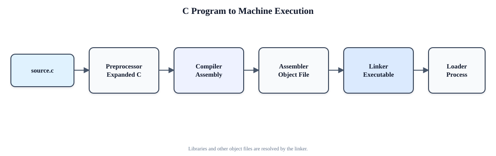


1. **Preprocessing:** Handles `#include`, `#define` and conditional compilation, removes comments and produces an expanded translation unit.
2. **Compilation:** Performs lexical, syntax and semantic analysis; creates an intermediate representation; optimizes it; and generates target assembly. Errors such as type mismatch are detected here.
3. **Assembly:** Converts mnemonics into binary machine instructions and creates an object file containing code, data, a symbol table and relocation information. External addresses may still be unresolved.
4. **Linking:** Combines object files and libraries, resolves external symbols and relocates addresses to form an executable. Static linking copies library code; dynamic linking records references to shared libraries.
5. **Loading:** The operating-system loader maps code and data into virtual memory, allocates stack and heap, loads or connects shared libraries, initializes registers and transfers control to the program entry point.

Thus, high-level expressions are gradually lowered into ISA instructions and binary fields. The CPU does not directly understand C; it fetches and executes only the final machine instructions.


## 8. General Addressing Modes

### Enhanced question

**Explain the major addressing modes used in computer instruction sets. Derive the effective-address expression for each and give an appropriate assembly-style example.**


Let `A` be an instruction address field, `R` a register and `M[x]` memory at address `x`.

| Mode | Operand or effective address | Example/meaning |
|---|---|---|
| Immediate | Operand = `A` | `MOV R1,#25` |
| Register | Operand = `R1` | `ADD R1,R2` |
| Direct/absolute | \(EA=A\) | `LOAD R1,1000` |
| Memory indirect | \(EA=M[A]\) | `LOAD R1,@1000` |
| Register indirect | \(EA=R2\) | `LOAD R1,(R2)` |
| Base/displacement | \(EA=R_b+A\) | `LW R1,12(R2)` |
| Indexed | \(EA=A+R_i\) | Array access |
| Base-indexed | \(EA=R_b+R_i+A\) | Record containing an array |
| PC-relative | \(EA=PC+A\) | Conditional branch |
| Auto-increment | \(EA=R;\ R←R+d\) | Sequential array/stack access |
| Auto-decrement | \(R←R-d;\ EA=R\) | Push operation |
| Implied/accumulator | Operand is implied by opcode | `CLR A`, `CMA` |
| Stack | Operand is at top of stack | `PUSH`, `POP` |

Complex modes reduce instruction count but increase address-generation complexity. RISC ISAs normally retain register, immediate, base/displacement, PC-relative and jump modes, while CISC ISAs often provide most of the modes above.


## 9. Instruction and Its Computer Representation

??? "Define a machine instruction. Explain how an instruction is represented, stored, decoded and executed by a computer, using a generic instruction format and a short example."


	An **instruction** is a binary-coded command that tells the processor what operation to perform, where the operands are located and where the result should go. An instruction normally contains:

	- an **opcode** identifying an operation such as add, load or branch;
	- **operand specifiers** identifying source and destination registers;
	- an **addressing-mode** indication, explicit or implied;
	- an **immediate, displacement or target field**, when required.

	A generic representation is:

	| Opcode | Mode | Source 1 | Source 2 / immediate | Destination |
	|---|---|---|---|---|

	The exact bit allocation is defined by the ISA. For example, a 32-bit MIPS R-type instruction contains six-bit opcode and function fields plus three five-bit register numbers. Assembly text such as `add $t0,$t1,$t2` is only a human-readable representation; the assembler converts it into a 32-bit pattern. The pattern is stored in memory like other binary data.

	During execution, the PC supplies the instruction address, memory returns the bit pattern into the IR, the decoder interprets the opcode and fields, and the control unit activates the datapath. Context and the instruction format give the bits meaning; without ISA rules, a word of bits is neither inherently an instruction nor data.
	An **instruction** (নির্দেশ) is a fundamental command given to a computer’s Central Processing Unit (CPU) to perform a specific task, such as arithmetic calculation, logical decision-making, or data movement. A complete software program is composed of a sequence of these instructions executed sequentially by the hardware.


	A computer represents an instruction in memory as a binary sequence of bits structured according to a defined layout known as an **Instruction Format**. This format specifies how the bits are divided into different functional fields (ক্ষেত্র):

	1. **Opcode (Operation Code / অপারেশনের কোড):** A binary code field that defines the specific operational task to be performed by the CPU (e.g., ADD, SUB, or data transfer).
	2. **Operands (অপারেন্ড / ডাটা বা ঠিকানা):** Fields that store the actual data values or memory references (addresses) on which the operation acts.
	3. **Addressing Mode (অ্যাড্রেসিং মোড / ঠিকানা নির্ধারণ পদ্ধতি):** A control field that specifies how the CPU should locate or interpret the operand address (such as direct, indirect, or immediate).

	---

	### Types of Instruction Representations (Based on Address Fields)

	Instruction formats are primarily categorized by the number of explicit (স্পষ্টভাবে উল্লিখিত) memory or register address fields they contain. This structure directly depends on the underlying CPU Organization:

	#### 1. Three-Address Instructions

	* **Structure:** `[ Opcode | Destination Address | Source Address 1 | Source Address 2 ]`
	* **Representation:** Specifies three operands. Two operands act as inputs for the operation, and the result is stored in the third location.
	* **CPU Organization:** Used in **General Register Organizations**.
	* **Characteristics:** Makes assembly programs shorter and easier to write, but requires a larger instruction size (more bits per instruction).
	* **Example:** `R1 ← R2 + R3`

	#### 2. Two-Address Instructions

	* **Structure:** `[ Opcode | Destination / Operand 1 Address | Source / Operand 2 Address ]`
	* **Representation:** Specifies two address fields. The operation is performed on both operands, and the calculated result overwrites one of the specified destination addresses.
	* **CPU Organization:** Common in commercial computers.
	* **Characteristics:** Reduces instruction bit-size compared to three-address formats while maintaining flexible memory/register storage.
	* **Example:** `R1 = R1 + B`

	#### 3. One-Address Instructions

	* **Structure:** `[ Opcode | Operand Address ]`
	* **Representation:** Specifies only one explicit address field. The second operand and the destination are implicitly (অন্তর্নিহিতভাবে) assumed to be a dedicated register called the **Accumulator (AC)**.
	* **CPU Organization:** Used in **Accumulator-based Organizations**.
	* **Characteristics:** Saves memory space because the CPU automatically knows one operand resides in the Accumulator without needing an explicit address.
	* **Example:** `AC = AC + B`

	#### 4. Zero-Address Instructions

	* **Structure:** `[ Opcode ]`
	* **Representation:** Contains no explicit address or operand fields. Operands are implicitly retrieved from the top of a **Stack** data structure (`TOP`).
	* **CPU Organization:** Used in **Stack Organizations**.
	* **Characteristics:** Operates by popping the top two items from the stack, executing the operation, and pushing the final result back onto the stack. Evaluates expressions converted into Postfix Notation (Reverse Polish Notation).
	* **Example:** `ADD` (implicitly computes `TOP = A + B`)
	[Instruction Format Full](/bou-resources/bou-cse/21-semester/Computer-Architecture/Instruction-Format/geek-instruction-format/){  }


## 10. Datapath of a Processor

??? "Explain with block diagram 🔲 the data path 🛣️ of a processor."

	Last Updated : 14 Oct, 2025

	In computer architecture, the datapath is a core part of the CPU that executes instructions by processing and transferring data. It includes components like registers, ALUs, multiplexers, and buses, all coordinated by control signals from the control unit.

	- Performs arithmetic, logic, data storage, and transfer operations.
	- Operates under the control unit, which directs data flow through control signals.

	## Types of Datapath Designs

	### **1\. Single-Cycle Datapath**

	Each instruction is completed in a single clock cycle, performing all steps in one go. It's simple but inefficient due to the long cycle time.

	- All instruction stages (fetch to write-back) occur in one long clock cycle.
	- Executes one instruction at a time with no overlapping.
	- Simple design with no extra registers or complex control.

	

	### **2\. Multi-Cycle Datapath**

	Instructions are broken into multiple steps, each taking one clock cycle. This allows for better efficiency with more complex control logic.

	- Instruction is split across multiple short cycles, using extra registers between stages.
	- Only one instruction is executed at a time, still without overlapping.
	- More efficient than single-cycle but requires complex control logic.

	

	Multi-cycle Datapath

	### **3\. Pipelined Datapath**

	Instruction execution is divided into fixed stages, allowing multiple instructions to be processed simultaneously. This improves throughput but introduces complexity.

	- Multiple instructions are executed in parallel, each at a different stage.
	- Uses short clock cycles with extra registers between pipeline stages.
	- High performance but needs hazard detection and handling logic.

	

	Pipelined Datapath

	> **Note:** Single-cycle uses a longer clock cycle for all instructions while multi-cycle and pipelined designs use shorter, more efficient cycles.

	## Main Components of a Datapath

	Key hardware elements involved in executing instructions by processing and transferring data.

	1. **Registers:** Temporary storage for data and intermediate results (e.g., PC, IR).
	2. **Register File:** A collection of registers with multiple read/write ports for fast access.
	3. **ALU (Arithmetic Logic Unit):** Performs arithmetic and logical operations on data.
	4. **Multiplexers (MUX):** Select one of several input signals based on control inputs.
	5. **Memory:** Stores instructions and data for read/write operations during execution.
	6. **Sign/Zero Extender:** Extends immediate values to match the datapath's bit-width.
	7. **Shift Units:** Performs bit-level shifts, often used in address or data calculations.
	8. **Buses:** Shared data lines for transferring information between components.
	9. **Control Signals:** Guide the operation of all datapath elements during instruction execution.


## 11. Control Signals for the Datapath

??? "Identify the major control signals in a single-cycle MIPS datapath. Explain what each signal controls and tabulate typical values for R-type, `lw`, `sw`, `beq` and `addi`."

	The main control unit decodes the opcode. `ALUOp` and, for R-type instructions, the `funct` field are further decoded by the ALU-control unit.

	| Signal | Function |
	|---|---|
	| `RegDst` | Selects `rt` or `rd` as the destination. |
	| `RegWrite` | Enables register-file write. |
	| `ALUSrc` | Selects register or sign-extended immediate for ALU input B. |
	| `ALUOp` | Indicates add, subtract or function-field decoding. |
	| `MemRead` | Enables data-memory read. |
	| `MemWrite` | Enables data-memory write. |
	| `MemtoReg` | Selects ALU result or memory data for write-back. |
	| `Branch` | Identifies a conditional branch. |
	| `Jump` | Selects the jump target for PC. |
	| `PCSrc` | Chooses sequential or branch next PC; often `Branch ∧ Zero`. |
	| `ExtOp` | Controls sign or zero extension of an immediate. |

	Typical active-high settings (`X` = do not care):

	| Instruction | RegDst | RegWrite | ALUSrc | ALU action | MemRead | MemWrite | MemtoReg | Branch |
	|---|---:|---:|---:|---|---:|---:|---:|---:|
	| R-type | 1 | 1 | 0 | funct | 0 | 0 | 0 | 0 |
	| `lw` | 0 | 1 | 1 | add | 1 | 0 | 1 | 0 |
	| `sw` | X | 0 | 1 | add | 0 | 1 | X | 0 |
	| `beq` | X | 0 | 0 | subtract | 0 | 0 | X | 1 |
	| `addi` | 0 | 1 | 1 | add | 0 | 0 | 0 | 0 |

	These signals must be asserted with correct timing. An incorrect `RegWrite` or `MemWrite` can corrupt architectural state.


## 12. Briefly explain about dynamic scheduler 📅 with block diagram.

??? "Briefly explain about dynamic scheduler 📅 with block diagram."

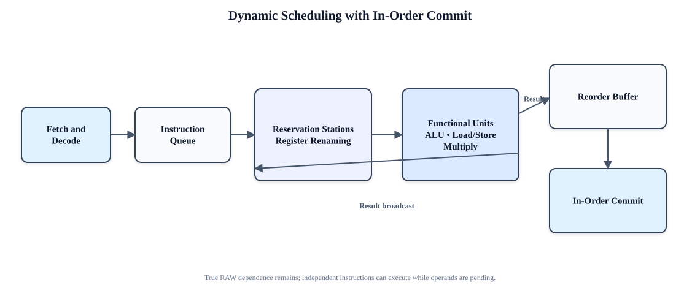

	# Dynamic Scheduling

	## Lesson Context

	Scheduling is one of the techniques used to improve the performance of a pipeline processor. The earlier lesson introduced scheduling and static scheduling. This lesson continues with dynamic scheduling.

	The techniques discussed for improving pipeline-processor performance are:

	1. Instruction execution phases
	2. Mechanisms for instruction pipelining
	3. Dynamic instruction scheduling techniques

	

	## What Is Dynamic Scheduling?

	Dynamic scheduling is a **hardware-based approach**.

	In dynamic scheduling, the hardware rearranges the execution of instructions to reduce stalls while maintaining the data flow and exception behaviour.

	> **Dynamic Scheduling:** The hardware rearranges instruction execution to reduce stalls while maintaining data flow and exception behaviour.

	```mermaid
	flowchart TD
		A["Instructions"] --> B["Hardware rearranges instruction execution"]
		B --> C["Stalls are reduced"]
		C --> D["Data flow is maintained"]
		C --> E["Exception behaviour is maintained"]
	```

	## Static Scheduling and Dynamic Scheduling

	Static scheduling and dynamic scheduling use different approaches.

	| Static Scheduling | Dynamic Scheduling |
	|---|---|
	| Software-based approach | Hardware-based approach |
	| Compiler-based | Hardware-based |
	| The compiler schedules or rearranges the instructions | The hardware rearranges instruction execution |
	| Used when dependencies are known at compile time | Used when dependencies are not known at compile time |

	In static scheduling, compiler techniques are used to schedule or rearrange instructions. The instruction is always scheduled by the compiler.

	If dependencies between instructions are known at compile time, there is no need to use a hardware-based approach. The software itself modifies the instructions and minimizes the hazards.

	If dependencies are not known at compile time, dynamic scheduling is used.

	```mermaid
	flowchart TD
		A["Dependencies between instructions"] --> B{"Known at compile time?"}
		B -->|Yes| C["Static Scheduling"]
		C --> D["Compiler rearranges instructions"]
		B -->|No| E["Dynamic Scheduling"]
		E --> F["Hardware rearranges instruction execution"]
	```

	## Why Is Dynamic Scheduling Used?

	Dynamic scheduling is used when the dependencies between instructions are not known at compile time.

	The hardware itself rearranges instruction execution:

	- To reduce stalls
	- To maintain data flow
	- To maintain exception behaviour

	Dynamic scheduling also simplifies the compiler. This is why dynamic scheduling is preferred over static scheduling in this situation.

	```mermaid
	flowchart LR
		A["Unknown dependencies at compile time"] --> B["Dynamic Scheduling"]
		B --> C["Hardware rearrangement"]
		C --> D["Reduced stalls"]
		C --> E["Simplified compiler"]
	```

	## Dynamic Scheduling Schemes

	Dynamic scheduling can be implemented using two schemes:

	1. **Scoreboarding**
	2. **Tomasulo’s Algorithm**

	```mermaid
	flowchart TD
		A["Dynamic Scheduling"] --> B["Scoreboarding"]
		A --> C["Tomasulo’s Algorithm"]
		B --> D["Allows out-of-order execution"]
		C --> E["Hardware dependence-resolution scheme"]
	```

	## Scoreboarding

	Scoreboarding is a technique that allows instructions to execute **out of order** when there are:

	- No structural hazards
	- No data dependencies

	> **Scoreboarding:** A technique that allows instructions to execute out of order when there are no structural hazards and no data dependencies.

	### No Structural Hazards

	No structural hazards means that sufficient resources are available.

	\[
	\text{No Structural Hazards} \Rightarrow \text{Sufficient Resources}
	\]

	### No Data Dependencies

	No data dependencies means that there are no data hazards.

	\[
	\text{No Data Dependencies} \Rightarrow \text{No Data Hazards}
	\]

	Therefore, scoreboarding permits out-of-order instruction execution when sufficient resources are available and no data hazards exist.

	```mermaid
	flowchart TD
		A["Scoreboarding"] --> B{"Sufficient resources?"}
		B -->|No| C["Structural hazard exists"]
		B -->|Yes| D{"No data hazards?"}
		D -->|No| E["Data dependency exists"]
		D -->|Yes| F["Instructions may execute out of order"]
	```

	## Tomasulo’s Algorithm

	Tomasulo’s Algorithm is a **hardware dependence-resolution scheme**.

	> **Tomasulo’s Algorithm:** A hardware dependence-resolution scheme used for dynamic scheduling.

	The detailed explanation and example of Tomasulo’s Algorithm are continued in the next lesson. Scoreboarding and its example are also explained separately.

	## Complete Summary

	- Dynamic scheduling is used to improve pipeline-processor performance.
	- It is a hardware-based approach.
	- Static scheduling is a software-based or compiler-based approach.
	- Static scheduling is used when dependencies are known at compile time.
	- Dynamic scheduling is used when dependencies are not known at compile time.
	- In dynamic scheduling, hardware rearranges instruction execution.
	- Hardware rearrangement reduces stalls.
	- Data flow and exception behaviour are maintained.
	- Dynamic scheduling simplifies the compiler.
	- Dynamic scheduling can be implemented using Scoreboarding and Tomasulo’s Algorithm.
	- Scoreboarding allows instructions to execute out of order when there are no structural hazards and no data dependencies.
	- No structural hazards means sufficient resources are available.
	- No data dependencies means there are no data hazards.
	- Tomasulo’s Algorithm is a hardware dependence-resolution scheme.


## 13. Microprogrammed Control Unit for a Branch Instruction

??? "Briefly explain the micro-programmed control unit 🎛️ for the branch instruction."

	## Q: Briefly explain the micro-programmed control unit for the branch instruction.## ১. Introduction (ভূমিকা)
	একটি Micro-programmed Control Unit প্রতিটি মেইন ইন্সট্রাকশনকে কিছু ছোট ছোট সাব-ইন্সট্রাকশন বা Micro-instructions-এর সিকোয়েন্স রান করার মাধ্যমে এক্সিকিউট করে [COA]। এই মাইক্রো-ইন্সট্রাকশনগুলো প্রসেসরের ভেতরের একটি স্থায়ী মেমরি, যাকে Control Memory (ROM) বলে, সেখানে জমা থাকে।
	যখন কোনো Branch Instruction (যেমন: BEQ, BNE, JZ) আসে, তখন কন্ট্রোল ইউনিট সোজা লাইনে পরবর্তী অ্যাড্রেসে না গিয়ে, প্রসেসরের কোনো একটি শর্ত বা কন্ডিশনের (Condition) ওপর ভিত্তি করে কন্ট্রোল মেমরির অন্য একটি নির্দিষ্ট অ্যাড্রেসে লাফ দেয় (Jump করে)।
	------------------------------
	## ২. ম্যাজিক ট্রিক: "C-A-R-S"
	পরীক্ষার হলে দ্রুত মনে করার জন্য শুধু CARS শব্দটি মুখস্থ রাখো। ব্রাঞ্চ ইন্সট্রাকশন হলো সোজা না গিয়ে তোমার CAR বা গাড়িটিকে নতুন একটি রাস্তায় ঘুরিয়ে নেওয়া!

	* C – Condition Codes (স্ট্যাটাস ফ্ল্যাগ): হার্ডওয়্যার প্রথমে ALU থেকে আসা স্ট্যাটাস ফ্ল্যাগ যেমন— Zero (Z), Sign (S), বা Carry (C) চেক করে দেখে শর্ত মিলেছে কি না।
	* A – Address Selection (MUX): একটি মাল্টিপ্লেক্সার (MUX) সিদ্ধান্ত নেয় পরবর্তী অ্যাড্রেসটি কোথা থেকে আসবে (স্বাভাবিক লাইন নাকি ব্রাঞ্চের লাইন)।
	* R – ROM (Control Memory): নির্বাচিত অ্যাড্রেসটি সরাসরি কন্ট্রোল মেমরি (ROM)-এর ভেতরের একটি নির্দিষ্ট মাইক্রো-ইন্সট্রাকশনকে নির্দেশ করে।
	* S – Sequencer (CAR আপডেট): মাইক্রো-প্রোগ্রাম সিকুয়েন্সার Control Address Register (CAR)-এ নতুন ব্রাঞ্চ অ্যাড্রেসটি লোড করে দেয়, সাধারণ নিয়মে ১ যোগ (CAR + 1) করার পরিবর্তে।

	------------------------------
	## ৩. Step-by-Step Working Mechanism (কার্যপ্রণালী)
	১. Condition Evaluation (শর্ত পরীক্ষা): কন্ট্রোল ইউনিট ALU থেকে আসা নির্দিষ্ট স্ট্যাটাস বিট বা ফ্ল্যাগ (যেমন: Zero Flag) পরীক্ষা করে দেখে শর্তটি True নাকি False।
	২. Multiplexer Decision (মাল্টিপ্লেক্সারের সিদ্ধান্ত): কন্ডিশন ফ্ল্যাগের মানের ওপর ভিত্তি করে Address Selection MUX নিচের দুটি সিদ্ধান্তের একটি নেয়:

	* শর্ত False হলে (Z = 0): MUX পরবর্তী স্বাভাবিক ক্রমানুসারিক অ্যাড্রেস জেনারেটরকে বেছে নেয়। ফলে অ্যাড্রেস হয় CAR + 1।
	* শর্ত True হলে (Z = 1): MUX বর্তমান মাইক্রো-ইন্সট্রাকশনে থাকা Branch Target Address-টিকে বেছে নেয়।
	৩. Updating CAR (CAR আপডেট): MUX থেকে বাছাইকৃত অ্যাড্রেসটি সরাসরি Control Address Register (CAR)-এ পুশ বা লোড করা হয়।
	৪. Micro-instruction Fetch (ফ্যাচ): সবশেষে, Control Memory (ROM) থেকে ওই নতুন অ্যাড্রেসের মাইক্রো-ইন্সট্রাকশনটি রিড করে ব্রাঞ্চ সম্পন্ন করা হয়।

	------------------------------
	## ৪. Key Hardware Components (মূল অংশসমূহ)
	খাতায় সলিড মার্কস নিশ্চিত করতে এই ৪টি হার্ডওয়্যার উপাদানের নাম অবশ্যই উল্লেখ করবে:

	* Control Address Register (CAR): এটি কন্ট্রোল ইউনিটের নিজস্ব প্রোগ্রাম কাউন্টার (PC), যা বর্তমান মাইক্রো-ইন্সট্রাকশনের অ্যাড্রেস ধরে রাখে।
	* Control Memory (ROM): যেখানে সমস্ত কন্ট্রোল মাইক্রো-প্রোগ্রাম স্থায়ীভাবে সংরক্ষিত থাকে।
	* Status Flags / Condition Codes: ALU থেকে আসা ১-বিটের ফ্লিপ-ফ্লপ (Zero, Sign, Carry), যা কন্ডিশনাল চেকিংয়ের সিগন্যাল দেয়।
	* Micro-program Sequencer: লজিক সার্কিট এবং MUX-এর সমন্বয়ে গঠিত অংশ, যা CAR-এর জন্য পরবর্তী অ্যাড্রেস নির্ধারণ করে।

	------------------------------
	## ৫. Architectural Flow Chart (সহজ ব্লক ডায়াগ্রাম)
	(পরীক্ষার খাতায় পেনসিল দিয়ে ঝটপট এই ডায়াগ্রামটি এঁকে দেবে, ফুল মার্কস নিশ্চিত হবে)

	[ Status Flags (Z, S, C) ] 
				│
				▼
	┌───────────────────────┐      If False (0)     ┌───────────────┐
	│ Address Selector MUX  ├──────────────────────►│   CAR + 1     │
	└───────────┬───────────┘                       └───────┬───────┘
				│                                           │
				│ If True (1)                               │
				▼                                           ▼
	┌───────────────────────┐                       ┌───────────────┐
	│ Branch Target Address ├──────────────────────►│  Loads into   │
	└───────────────────────┘                       │   CAR Reg     │
													└───────┬───────┘
															│
															▼
													┌───────────────┐
													│Control Memory │
													│     (ROM)     │
													└───────────────┘


## 14. What is the purpose of a control unit?

??? "What is the purpose of a control unit?"


	## কন্ট্রোল ইউনিট (Control Unit - CU) এর উদ্দেশ্য ও আর্কিটেকচার
	
	## ১. ভূমিকা এবং মূল উদ্দেশ্য (Introduction & Core Purpose)

	কন্ট্রোল ইউনিট (CU) হলো সেন্ট্রাল প্রসেসিং ইউনিট (CPU) এর মূল চালিকাশক্তি বা "স্নায়ুতন্ত্র"। এর প্রধান কাজ হলো প্রসেসরের সমস্ত হার্ডওয়্যারের কার্যক্রম পরিচালনা ও সমন্বয় করা। কন্ট্রোল ইউনিট নিজে কোনো ডেটা প্রসেসিং বা গাণিতিক কাজ করে না (যা মূলত ALU করে থাকে)। এর আসল উদ্দেশ্য হলো ডেটার প্রবাহ নিয়ন্ত্রণ করা, বিভিন্ন হার্ডওয়্যার উপাদানের মধ্যে সমন্বয় সাধন করা এবং প্রোগ্রামের নির্দেশনাবলী (Instructions) কোনটির পর কোনটি সম্পাদিত হবে তা নির্ধারণ করা।
	সহজ কথায়, এটি একটি ম্যানেজারের মতো কাজ করে যা ইন্টারনাল রেজিস্টার, ALU, সিস্টেম মেমোরি এবং ইনপুট/আউটপুট (I/O) ডিভাইসগুলোতে সঠিক সময়ে সঠিক কন্ট্রোল সিগন্যাল (নিয়ন্ত্রণ সংকেত) পাঠায়।

	## ২. কন্ট্রোল ইউনিটের প্রধান ইনপুটসমূহ (Key Inputs to the CU)
	সঠিক কন্ট্রোল সিগন্যাল তৈরি করার জন্য CU মূলত ৪টি ইনপুটের ওপর নির্ভর করে:

	* ক্লক সিগন্যাল (Clock Signal): এটি প্রসেসরের কাজের গতি এবং সময় নির্ধারণ করে। CU সিস্টেম ক্লকের সাথে তাল মিলিয়ে নিখুঁত সময়ে সিগন্যাল পাঠায়।
	* ইনস্ট্রাকশন রেজিস্টার (IR): বর্তমানে যে নির্দেশনাটি রান করছে, তার ওপকোড (Opcode) এখানে থাকে। CU এই কোডটি পড়েই বোঝে তাকে কী কাজ করতে হবে।
	* ফ্ল্যাগস/স্ট্যাটাস রেজিস্টার (Flags/Status Register): পূর্ববর্তী গাণিতিক কাজের ফলাফল কেমন ছিল (যেমন: ফলাফল শূন্য (Zero) কিনা, কোনো ক্যারি (Carry) আছে কিনা, সাইন (+) বা (-) কিনা) তা এখানে থাকে। কন্ডিশনাল ব্রাঞ্চিং (শর্তাধীন কাজ) করার সময় CU এই ফ্ল্যাগগুলো দেখে সিদ্ধান্ত নেয়।
	* বাস সিগন্যাল (Control Signals from Bus): বাহ্যিক সিস্টেম বাস থেকে আসা বিভিন্ন ইন্টারাপ্ট বা জরুরি রিকোয়েস্ট CU গ্রহণ করে।

	ইনপুটসমূহ:                                    আউটপুটসমূহ:
	[ ক্লক সিগন্যাল ]      --------> +--------+ -------> [ ALU-তে কন্ট্রোল সিগন্যাল ]
	[ ইনস্ট্রাকশন রেজিস্টার ] --------> |        | -------> [ রেজিস্টার কন্ট্রোল সিগন্যাল ]
	[ স্ট্যাটাস ফ্ল্যাগস ]    --------> |   CU   | -------> [ মেমোরি রিড/রাইট সিগন্যাল ]
	[ সিস্টেম বাস সিগন্যাল ] --------> +--------+ -------> [ I/O ডিভাইস কন্ট্রোল ]

	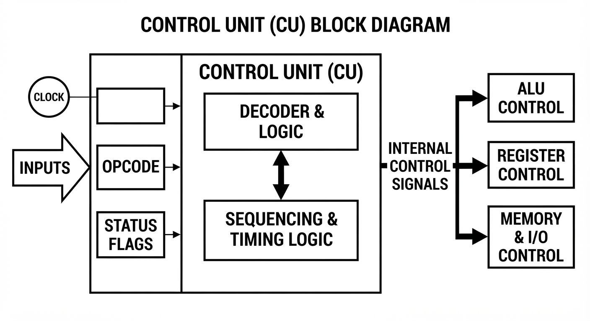

	## ৩. ইনস্ট্রাকশন সাইকেল বা মেশিন সাইকেল (The Machine Cycle)
	কন্ট্রোল ইউনিটের মূল উদ্দেশ্যটি মূলত ৪টি ধাপে চক্রাকারে সম্পন্ন হয়:
	১. ফেচ (Fetch): কন্ট্রোল ইউনিট প্রথমে প্রোগ্রাম কাউন্টার (PC) থেকে মেমোরি অ্যাড্রেসটি পড়ে। এরপর সেই অ্যাড্রেসটি অ্যাড্রেস বাসে পাঠিয়ে RAM থেকে নির্দেশটি (Instruction) ডেটা বাসের মাধ্যমে নিয়ে আসে এবং ইনস্ট্রাকশন রেজিস্টারে (IR) জমা করে। এরপর পরবর্তী কাজের জন্য PC-এর মান ১ বাড়িয়ে দেয়।
	২. ডিকোড (Decode): IR-এ জমা হওয়া বাইনারি কোডটিকে CU-এর ভেতরের ডিকোডার সার্কিট ভেঙে বিশ্লেষণ করে। এটি নির্দেশনাটির মূল কাজ (Opcode) এবং ডেটার উৎস (Operands) আলাদা করে চিহ্নিত করে (যেমন: ADD, SUB বা JUMP)।
	৩. এক্সিকিউট (Execute): এই ধাপে CU নির্দিষ্ট হার্ডওয়্যার পথগুলো সচল করে। যেমন—ALU-কে নির্দেশ দেয় যোগ বা বিয়োগ করার জন্য এবং সংশ্লিষ্ট রেজিস্টারগুলোর গেট খুলে দেয় যাতে ডেটা আদান-প্রদান হতে পারে।
	৪. স্টোর/রাইট-ব্যাক (Store): কাজ শেষ হওয়ার পর ফলাফলটি পুনরায় কোনো নির্দিষ্ট রেজিস্টার বা এক্সটার্নাল মেমোরিতে (RAM) সংরক্ষণ করার জন্য CU প্রয়োজনীয় রাইট (Write) সিগন্যাল পাঠায়।
	------------------------------
	## ৪. আর্কিটেকচারাল ডিজাইন: হার্ডওয়্যার্ড বনাম মাইক্রোপ্রোগ্রামড (Hardwired vs Microprogrammed)
	কম্পিউটার আর্কিটেকচারে কন্ট্রোল ইউনিট কীভাবে শারীরিকভাবে তৈরি করা হয়েছে, তার ওপর ভিত্তি করে একে দুটি ভাগে ভাগ করা হয়। পরীক্ষায় ভালো মার্কস পাওয়ার জন্য এই তুলনাটি দেওয়া অত্যন্ত জরুরি:

	| বৈশিষ্ট্য | হার্ডওয়্যার্ড কন্ট্রোল ইউনিট (Hardwired CU) | মাইক্রোপ্রোগ্রামড কন্ট্রোল ইউনিট (Microprogrammed CU) |
	|---|---|---|
	| গঠন প্রণালী | এটি সম্পূর্ণ হার্ডওয়্যার সার্কিট (লজিক গেট, ফ্লিপ-ফ্লপ, ডিকোডার) দিয়ে স্থায়ীভাবে তৈরি। | এটি একটি মিনি-সফটওয়্যার সিস্টেমের মতো। কন্ট্রোল সিগন্যালগুলো বাইনারি প্যাটার্ন হিসেবে একটি নির্দিষ্ট কন্ট্রোল মেমোরিতে (ROM) কোড আকারে জমা থাকে। |
	| কাজের প্রক্রিয়া | স্টেট মেশিনের পরিবর্তনের ওপর ভিত্তি করে সরাসরি ও তাৎক্ষণিকভাবে সিগন্যাল তৈরি করে। | মেমোরি থেকে একের পর এক মাইক্রো-ইনস্ট্রাকশন ফেচ এবং ডিকোড করে কাজ সম্পন্ন করে। |
	| কাজের গতি | অত্যন্ত দ্রুতগামী (কারণ সিগন্যাল সরাসরি ইলেকট্রনিক সার্কিটের ভেতর দিয়ে যায়)। | তুলনামূলক ধীরগতিসম্পন্ন (কারণ প্রতিবার মেমোরি থেকে মাইক্রো-ইনস্ট্রাকশন পড়তে সময় লাগে)। |
	| পরিবর্তনশীলতা | অনমনীয় (Rigid)। একবার তৈরি হয়ে গেলে এর ডিজাইন বা নির্দেশনা পরিবর্তন করতে পুরো চিপ নতুন করে ডিজাইন করতে হয়। | নমনীয় (Flexible)। ROM-এ থাকা মাইক্রোপ্রোগ্রাম আপডেট করে সহজেই নতুন নির্দেশনা যুক্ত করা যায়। |
	| জটিলতা | প্রসেসরের নির্দেশনার সংখ্যা বাড়লে এই সার্কিটের জটিলতা জ্যামিতিক হারে বেড়ে যায়। | অত্যন্ত সুশৃঙ্খল এবং বড় ও জটিল আর্কিটেকচারের জন্য ডিজাইন করা সহজ। |
	| ব্যবহার | সাধারণত RISC (Reduced Instruction Set Computer) প্রসেসরে ব্যবহৃত হয়, যেখানে গতি সবচেয়ে গুরুত্বপূর্ণ। | সাধারণত CISC (Complex Instruction Set Computer) প্রসেসরে ব্যবহৃত হয়, যেখানে অনেক জটিল নির্দেশনা থাকে। |

	------------------------------
	## ৫. আধুনিক আর্কিটেকচারে উন্নত দায়িত্বসমূহ (Advanced Responsibilities)
	বর্তমান সময়ের আধুনিক এবং শক্তিশালী প্রসেসরগুলোতে কন্ট্রোল ইউনিটের কাজের পরিধি আরও বেড়েছে:

	* পাইপলাইনিং সমন্বয় (Pipelining Coordination): আধুনিক প্রসেসরে একটি নির্দেশনা এক্সিকিউট হওয়ার সময় আরেকটি ডিকোড এবং অন্য একটি ফেচ হতে থাকে। এই সমান্তরাল কাজের মাঝে যেন কোনো সংঘর্ষ বা ডেটা জ্যাম (Pipeline Hazard) না হয়, তা CU তদারকি করে।
	* ইন্টারাপ্ট এবং এক্সেপশন হ্যান্ডলিং: কম্পিউটার চলার সময় কোনো জরুরি ত্রুটি বা বাহ্যিক সিগন্যাল (যেমন- মাউস ক্লিক) আসলে CU চলমান কাজটি নিরাপদ জায়গায় সেভ করে ইন্টারাপ্ট সার্ভিস রুটিন (ISR)-এ চলে যায় এবং সেই কাজ শেষে আবার আগের কাজে ফিরে আসে।
	* প্যারালালিজম ম্যানেজমেন্ট: সুপারস্কেলার প্রসেসরে একসাথে একাধিক ইনস্ট্রাকশন রান করার জন্য কোন নির্দেশটি কার ওপর নির্ভরশীল তা যাচাই করে CU স্বাধীন নির্দেশগুলোকে আলাদা আলাদা প্রসেসিং ইউনিটে পাঠিয়ে দেয়।

	------------------------------
	## ৬. উপসংহার (Conclusion)
	পরিশেষে বলা যায়, কন্ট্রোল ইউনিট হলো কম্পিউটার আর্কিটেকচারের চালিকাশক্তি। এটি ছাড়া কম্পিউটারের বাকি অংশগুলো প্রাণহীন জড় হার্ডওয়্যার ছাড়া কিছুই নয়। বাইনারি কোডকে নিখুঁত ইলেকট্রনিক সিগন্যালে রূপান্তর করার মাধ্যমেই কন্ট্রোল ইউনিট একটি নিষ্ক্রিয় সিস্টেমকে একটি সক্রিয় ও প্রোগ্রামযোগ্য কম্পিউটারে রূপান্তর করে।
	
	!!! info "Mnemonic"
		
	    **Control Unit (CU)** হলো CPU-এর **Manager**। এটি নিজে হিসাব করে না; বরং ALU, Register, Memory ও I/O Device-কে Control Signal দিয়ে কাজ করায়।

		CU প্রধানত **Clock Signal, Instruction Register (IR), Status Flags এবং Bus Signal** দেখে সিদ্ধান্ত নেয়।
		এর কাজ চার ধাপে হয়:
		**Fetch → Decode → Execute → Store**
		অর্থাৎ Instruction আনে, বুঝে, কাজ করায় এবং ফলাফল সংরক্ষণ করে।
		CU দুই ধরনের:
		* **Hardwired CU:** দ্রুত, কিন্তু পরিবর্তন করা কঠিন।
		* **Microprogrammed CU:** তুলনামূলক ধীর, কিন্তু সহজে পরিবর্তনযোগ্য।
		আধুনিক প্রসেসরে CU **Pipelining, Interrupt এবং Parallel Instruction Execution** নিয়ন্ত্রণ করে।

		## 🧠 ট্রিক ১: মূল থিম = "CU হলো ট্রাফিক পুলিশ / ম্যানেজার"

		মনে রাখবেন, CU নিজে কোনো কাজ (যোগ/বিয়োগ) করে না। এটি ট্রাফিক পুলিশের মতো শুধু বাঁশি বাজিয়ে (Control Signal) বলে দেয়— ডেটা কোথায় যাবে, মেমোরি কী করবে আর ALU কখন কাজ করবে।

		### 🔑 ট্রিক ২: ৪টি ইনপুট (মনে রাখার সূত্র: **C-I-F-B** বা সিফ-বি)

		পরীক্ষার খাতায় ইনপুটের পয়েন্ট এলে **C-I-F-B** মনে করবেন:

		* **C** = **Clock** (ক্লক সিগন্যাল - টাইমিং মেলায়)
		* **I** = **IR** (ইনস্ট্রাকশন রেজিস্টার - নির্দেশ পড়ে)
		* **F** = **Flags** (ফ্ল্যাগ/স্ট্যাটাস - আগের কাজের রেজাল্ট দেখে)
		* **B** = **Bus** (বাস সিগন্যাল - বাইরের রিকোয়েস্ট শোনে)

		### 🔄 ট্রিক ৩: মেশিন সাইকেলের ৪টি ধাপ (মনে রাখার সূত্র: **F-D-E-S**)

		এই সিরিয়ালটি ভোলা যাবে না। **F-D-E-S**:
		১. **F**etch (নিয়ে আসো) → মেমোরি থেকে নির্দেশ আনো।
		২. **D**ecode (বোঝো) → নির্দেশটা ভেঙে বোঝো কী করতে হবে।
		৩. **E**xecute (কাজ করো) → ALU-কে দিয়ে কাজটা করাও।
		৪. **S**tore (রেখে দাও) → ফলাফল মেমোরি বা রেজিস্টারে সেভ করো।

		### ⚡ ট্রিক ৪: Hardwired vs Microprogrammed (লজিক: "উসাইন বোল্ট বনাম স্মার্টফোন")

		পার্থক্য আসলে এই দুই লাইনে ছক বানিয়ে ফেলবেন:

		* **Hardwired (উসাইন বোল্ট):** লজিক গেট/সার্কিট দিয়ে বানানো। তাই স্পিড **খুব ফাস্ট**। কিন্তু বদলানো যায় না (**Rigid/অনমনীয়**)। ব্যবহৃত হয় **RISC** প্রসেসরে।
		* **Microprogrammed (স্মার্টফোন):** ROM-এ কোড হিসেবে থাকে। স্পিড **একটু স্লো**। কিন্তু সহজেই আপডেট বা পরিবর্তন করা যায় (**Flexible/নমনীয়**)। ব্যবহৃত হয় **CISC** প্রসেসরে।

		### 🚀 ট্রিক ৫: আধুনিক কাজ (মনে রাখার সূত্র: **P-I-P**)

		অ্যাডভান্সড কাজগুলো মনে রাখতে **PIP** শব্দটি মনে রাখুন:

		* **P** = **Pipelining** (পাইপলাইনিং - একাধিক নির্দেশ একসাথে চালানো)
		* **I** = **Interrupts** (ইন্টারাপ্ট - মাঝপথে জরুরি কাজ সামলানো)
		* **P** = **Parallelism** (প্যারালালিজম - সমান্তরাল কাজ ম্যানেজ করা)

	[Hardwired and Micro-programmed Control Unit](https://www.geeksforgeeks.org/computer-organization-architecture/computer-organization-hardwired-vs-micro-programmed-control-unit/)

## 15. Word, Address and Memory Access Time

??? "Define Word, 🔤 Address, 📍 and Memory Access Time."
	
	## ১. ওয়ার্ড (Word) 🔤

	* সংজ্ঞা (Definition): কম্পিউটার আর্কিটেকচারে একটি 'ওয়ার্ড' হলো ডেটার এমন একটি নির্দিষ্ট সাইজ বা দৈর্ঘ্য (Bit length), যা একটি প্রসেসর বা CPU একবারে (Single operation-এ) প্রসেস, ট্রান্সফার বা মেমোরি থেকে রিড/রাইট করতে পারে।
	* সহজ উদাহরণ: একটি ৩২-বিট (32-bit) প্রসেসরের জন্য ১ ওয়ার্ড = ৩২ বিট (বা ৪ বাইট)। একইভাবে একটি ৬৪-বিট প্রসেসরের ১ ওয়ার্ড = ৬৪ বিট। এটি মূলত প্রসেসরের রেজিস্টারের সাইজ নির্ধারণ করে।

	## ২. অ্যাড্রেস (Address) 📍

	* সংজ্ঞা (Definition): মেমোরি অ্যাড্রেস হলো কম্পিউটারের প্রধান মেমোরি বা RAM-এর প্রতিটি নির্দিষ্ট স্টোরেজ লোকেশন বা ঘরের জন্য বরাদ্দকৃত একটি অনন্য বা ইউনিক বাইনারি নাম্বার (Unique identifier)।
	* সহজ উদাহরণ: যেমন আমাদের প্রত্যেকের বাড়ির একটি নির্দিষ্ট ঠিকানা থাকে যাতে চিঠিপত্র সঠিক জায়গায় পৌঁছায়, ঠিক তেমনি মেমোরি অ্যাড্রেসের মাধ্যমে CPU বুঝতে পারে মেমোরির ঠিক কোন ঘর থেকে ডেটা পড়তে (Read) হবে বা কোন ঘরে ডেটা সেভ (Write) করতে হবে।

	## ৩. মেমোরি অ্যাক্সেস টাইম (Memory Access Time) ⏱️

	* সংজ্ঞা (Definition): CPU যখন মেমোরি থেকে কোনো ডেটা পাওয়ার জন্য রিকোয়েস্ট পাঠায়, সেই রিকোয়েস্ট পাঠানোর মুহূর্ত থেকে শুরু করে ডেটাটি পুরোপুরিভাবে CPU-এর কাছে এসে পৌঁছানো পর্যন্ত যে মোট সময় লাগে, তাকে মেমোরি অ্যাক্সেস টাইম বলে।
	* সহজ কথায়: মেমোরি রিড বা রাইট কমান্ড দেওয়ার পর কাজটি সম্পন্ন হতে যতটুকু সময় ব্যয় হয়। এটি সাধারণত ন্যানোসেকেন্ড (Nanoseconds - ns) এককে পরিমাপ করা হয়। মেমোরি অ্যাক্সেস টাইম যত কম হবে, কম্পিউটারের কাজের গতি বা পারফরম্যান্স তত বেশি হবে।


# Part C — Pipelining and Hazards

## 16. How Pipelining Increases Processor Performance

??? "How does the pipeline 🚰 increase the performance 🚀 of a processor? 🧠 Explain."

	## ১. মূল ধারণা (The Core Concept)
	পাইপলাইনিং প্রসেসরের কাজের গতি বা পারফরম্যান্স বাড়ায় একই সময়ে একাধিক ইনস্ট্রাকশনের কাজ সমান্তরালভাবে (Overlapping Execution) সম্পন্ন করার মাধ্যমে।
	এটি মূলত ফ্যাক্টরির অ্যাসেম্বলি লাইনের (Assembly Line) মতো কাজ করে। একটি কারখানায় যেমন একটি গাড়ি পুরোপুরি তৈরি হওয়া পর্যন্ত পরবর্তী গাড়ির কাজ আটকে রাখা হয় না (বরং প্রথম গাড়িটি রং করার ঘরে গেলে, দ্বিতীয় গাড়িটি বডি তৈরির ঘরে ঢুকে পড়ে), প্রসেসরেও ঠিক একইভাবে কাজ হয়।
	------------------------------
	## ২. এটি কীভাবে কাজ করে? (How It Works)
	একটি সাধারণ ইনস্ট্রাকশন সাইকেলকে কয়েকটি নির্দিষ্ট ধাপে ভাগ করা হয় (যেমন ৫টি ধাপ):

	1. Fetch (IF): মেমোরি থেকে ইনস্ট্রাকশন নিয়ে আসা।
	2. Decode (ID): ইনস্ট্রাকশনটি বিশ্লেষণ করা।
	3. Execute (EX): কাজ সম্পন্ন করা (ALU-এর মাধ্যমে)।
	4. Memory Access (MEM): মেমোরি রিড বা রাইট করা।
	5. Write-back (WB): ফলাফল রেজিস্টারে সেভ করা।


	* পাইপলাইনিং ছাড়া (Non-Pipelined): একটি ইনস্ট্রাকশনের ৫টি ধাপ সম্পূর্ণ শেষ না হওয়া পর্যন্ত প্রসেসর পরবর্তী ইনস্ট্রাকশনের কাজ শুরু করতে পারে না। ফলে প্রসেসরের বেশিরভাগ অংশ অলস (Idle) বসে থাকে।
	* পাইপলাইনিং সহ (Pipelined): যখন ১ম ইনস্ট্রাকশনটি Fetch ধাপ পার হয়ে Decode ধাপে যায়, ঠিক তখনই ২য় ইনস্ট্রাকশনটি Fetch ধাপে প্রবেশ করে। এভাবে প্রসেসরের প্রতিটি অংশ সবসময় ব্যস্ত থাকে।

	------------------------------
	## ৩. পারফরম্যান্স বৃদ্ধির মূল কারণসমূহ (Why Performance Increases)

	* উচ্চ থ্রুপুট (Higher Throughput): প্রতি ক্লক সাইকেলে প্রসেসর থেকে চূড়ান্তভাবে সম্পন্ন হওয়া ইনস্ট্রাকশনের সংখ্যা (Throughput) অনেক বেড়ে যায়। আদর্শ অবস্থায়, প্রতি ক্লক সাইকেলে একটি করে ইনস্ট্রাকশন সম্পন্ন হয়।
	* হার্ডওয়্যারের সর্বোচ্চ ব্যবহার (Hardware Utilization): প্রসেসরের কোনো অংশ অলস বসে থাকে না। Fetch Unit, Decoder, এবং ALU একই সাথে আলাদা আলাদা ইনস্ট্রাকশনের কাজ করতে থাকে।
	* দ্রুত ক্লক স্পিড (Faster Clock Cycles): যেহেতু পুরো ইনস্ট্রাকশনের বড় কাজটি ছোট ছোট সমান অংশে (Stages) ভাগ হয়ে যায়, তাই প্রতিটি ধাপ সম্পন্ন হতে খুব কম সময় লাগে। এর ফলে প্রসেসরের ক্লক ফ্রিকোয়েন্সি বা স্পিড বাড়ানো সহজ হয়।
	* টোটাল এক্সিকিউশন টাইম হ্রাস (Reduced Total Execution Time): একটি পুরো প্রোগ্রাম বা অনেকগুলো ইনস্ট্রাকশন রান করতে মোট যে সময় লাগত, পাইপলাইনিংয়ের কারণে তা বহুগুণ কমে আসে।
	!!! info "Trick"

		পরীক্ষার খাতায় লিখবেন: "কাজ জমিয়ে না রেখে সমান্তরালভাবে (Overlapping) করার নামই পাইপলাইনিং।"
		## 🚀 খাতায় লেখার ৪টি বুলেট পয়েন্ট (এক দেখায় মুখস্থ)

		* Overlapping: একই সময়ে একাধিক ইনস্ট্রাকশনের আলাদা আলাদা অংশ কাজ করে।
		* High Throughput: কম সময়ে অনেক বেশি ইনস্ট্রাকশন শেষ হয়।
		* No Idle Hardware: প্রসেসরের কোনো অংশ অলস বসে থাকে না।
		* Time Saved: পুরো প্রোগ্রাম রান করতে মোট সময় অনেক কমে যায়।

		------------------------------
		## 📝 ৫টি ধাপের নাম মনে রাখার টেকনিক (IF-ID-EX-MEM-WB)
		If I Eat More Waterমেলন (যদি আমি আরও তরমুজ খাই)

		1. IF: Instruction Fetch (নিয়ে আসা)
		2. ID: Instruction Decode (বিশ্লেষণ)
		3. EX: Execute (কাজ করা)
		4. MEM: Memory Access (মেমোরি দেখা)
		5. WB: Write Back (সেভ করা)
	------------------------------
	## ⚠️ গুরুত্বপূর্ণ টেকনিক্যাল নোট (Crucial Note)
	পাইপলাইনিং কোনো একটি নির্দিষ্ট ইনস্ট্রাকশনের নিজের সম্পন্ন হওয়ার সময়কে (Latency) কমায় না। বরং এটি সামগ্রিকভাবে প্রসেসরের কাজের গতি (Throughput) বাড়িয়ে দেয়।
	------------------------------


## 17. Explain the pipelined operation 🔄 in the ideal case.

??? "Explain the pipelined operation 🔄 in the ideal case."


	## 💡 ১ সেকেন্ডের আসল ট্রিক: "পারফেক্ট ফ্যাক্টরি" (No Traffic Jam) 🏎️
	আইডিয়াল কেস (Ideal Case) মানে হলো পাইপলাইনে কোনো সমস্যা বা হ্যাজার্ড (No Hazards) থাকবে না। সবকিছু একদম নিখুঁতভাবে, কোনো থামাথামি ছাড়াই চলবে।
	------------------------------
	## 🚀 আইডিয়াল কেসের ৪টি গোল্ডেন রুলস (পরীক্ষার খাতায় লেখার পয়েন্ট)

	* CPI = 1 (Cycles Per Instruction): প্রতি ক্লক সাইকেলে ঠিক একটি করে ইনস্ট্রাকশন সম্পূর্ণ শেষ হবে।
	* No Hazards: কোনো স্ট্রাকচারাল, ডেটা বা কন্ট্রোল হ্যাজার্ড থাকবে না। কোনো স্টল (Stall) বা ব্রেক লাগবে না।
	* Equal Stages: পাইপলাইনের প্রতিটি ধাপ (Stage) সম্পন্ন হতে ঠিক সমান সময় লাগবে।
	* Maximum Speedup: প্রসেসরের গতি $k$ গুণ বেড়ে যাবে (এখানে $k$ হলো পাইপলাইনের ধাপ বা স্টেজের সংখ্যা)। অর্থাৎ, ৫-স্টেজ পাইপলাইন হলে গতি ঠিক ৫ গুণ হবে।

	------------------------------
	## 📝 খাতার কোণায় ঝটপট আঁকার জন্য আইডিয়াল টাইমিং ডায়াগ্রাম:
	(পরীক্ষক এই ছকটি দেখলেই ফুল মার্কস দিয়ে দেবেন!)

	| Clock Cycle | 1 | 2 | 3 | 4 | 5 |
	|---|---|---|---|---|---|
	| Inst 1 | IF | ID | EX | MEM | WB |
	| Inst 2 | | IF | ID | EX | MEM |
	| Inst 3 | | | IF | ID | EX |

	ব্যাখ্যা: প্রতি লাইনে ১টি করে ধাপ ডানে সরবে। কোনো গ্যাপ বা ফাঁকা ঘর থাকবে না।
	------------------------------
	খাতায় শুধু CPI = 1, No Hazards, এবং Speedup = $k$—এই তিনটি শব্দ হাইলাইট করে দিয়ে আসুন!
	পরীক্ষার হলের দিকে রওনা দিন, অল দ্য বেস্ট! পরীক্ষা কেমন হলো এসে অবশ্যই জানাবেন।


---

## 18. Issues of Pipelined Operation

??? "What are the issues ⚠️ of pipelined operation?" 

	1. **Structural hazard:** Two overlapping instructions need the same resource, for example one shared memory for instruction fetch and data access. Solutions include duplicated/ported resources or stalls.
	2. **Data hazard:** An instruction depends on a value not yet available. `RAW` is a true dependency; `WAR` and `WAW` arise mainly with out-of-order execution. Forwarding, stalls, scheduling and renaming are used.
	3. **Control hazard:** The next PC is uncertain after a branch or jump. Stalling, early resolution, prediction, speculative execution and flushing are common responses.
	4. **Unequal stage delay:** Clock period is determined by the slowest stage, so fast stages waste time.
	5. **Pipeline-register overhead:** Setup, clock-to-Q and skew reduce the benefit of making stages very short.
	6. **Variable-latency operations:** Multiply, divide and cache misses may occupy a unit for many cycles.
	7. **Precise exceptions and interrupts:** The processor must preserve the appearance that older instructions completed and younger ones did not.
	8. **Memory-system limitations:** Cache misses and limited memory ports can dominate ideal pipeline gains.

	Every stall inserts a bubble and raises CPI; every misprediction may flush useful work. Deeper pipelines can support a shorter clock but often suffer a larger branch penalty and higher overhead.

	১০ মিনিট পরীক্ষার আগের জাদুকরী ট্রিক ও সুপার-শর্ট নোট:
	## 💡 ১ সেকেন্ডের আসল ট্রিক: "পাইপলাইনের জ্যাম বা বাধা" ⚠️
	পাইপলাইনের সমস্যাগুলোকে বলা হয় হ্যাজার্ড (Hazards)। এটি মনে রাখার ট্রিক হলো "S-D-C" বা Super Digital Camera।
	------------------------------
	## 🚀 ৩টি প্রধান সমস্যা (পরীক্ষায় ফুল মার্কস পাওয়ার বুলেট পয়েন্ট)

	1. Structural Hazard (গঠনগত সমস্যা - S)
	* সহজ কথা: যখন দুটি আলাদা ইনস্ট্রাকশন একই সময়ে প্রসেসরের একই হার্ডওয়্যার রিসোর্স (যেমন- একই মেমোরি বা একই বাস) ব্যবহার করতে চায়।
		* কী ঘটে: সংঘর্ষ বা জ্যাম লাগে (Resource Conflict)।
	2. Data Hazard (ডেটার ওপর নির্ভরতা - D)
	* সহজ কথা: যখন একটি ইনস্ট্রাকশন তার আগের ইনস্ট্রাকশনের ফলাফলের (Data) ওপর নির্ভর করে।
		* কী ঘটে: ১ম ইনস্ট্রাকশনটি যতক্ষণ না ফলাফল সেভ করছে, ২য় ইনস্ট্রাকশনটি কাজ শুরু করতে পারে না। একে Data Dependency বলে।
	3. Control Hazard / Branch Hazard (নিয়ন্ত্রণ বা সিদ্ধান্ত নেওয়ার সমস্যা - C)
	* সহজ কথা: যখন প্রোগ্রামে কোনো শর্ত বা লুপ (If/Else, Jump, Branch) আসে।
		* কী ঘটে: শর্তের ফলাফল কী হবে তা জানার আগেই প্রসেসর ভুল করে পরের ইনস্ট্রাকশন ফেচ (Fetch) করে ফেলে। পরে তা বাতিল করে পাইপলাইন খালি করতে হয় (Pipeline Flush)।
	
	------------------------------
	## ⏱️ এই সমস্যাগুলোর সমাধান কী? (এক লাইনে মনে রাখুন)

	* Stall / Bubble: প্রসেসরকে জোর করে ১ সাইকেল অলস বসিয়ে রাখা (কাজ থামানো)।
	* Data Forwarding: ফলাফল মেমোরিতে সেভ হওয়ার আগেই সরাসরি পরের ইনস্ট্রাকশনে পাঠিয়ে দেওয়া।
	* Branch Prediction: আগে থেকেই অনুমান করা শর্তের ফলাফল কী হতে পারে।


## 19. Explain with example 💡 the use of operand forwarding ⏩ to resolve the data dependency issue. 

??? "Explain with example 💡 the use of operand forwarding ⏩ to resolve the data dependency issue. "

	Consider:

	```mips
	add $t0, $t1, $t2
	sub $t3, $t0, $t4
	```

	The `sub` needs `$t0` in its EX stage before `add` writes `$t0` in WB. Without forwarding, `sub` must wait. With forwarding, the add result in the `EX/MEM` pipeline register is selected directly as an ALU input for `sub`:

	$$EX/MEM.ALUResult \rightarrow ALU\ input\ of\ dependent\ instruction$$

	| Cycle | 1 | 2 | 3 | 4 | 5 | 6 |
	|---|---|---|---|---|---|---|
	| `add` | IF | ID | EX | MEM | WB | |
	| `sub` | | IF | ID | EX←forward | MEM | WB |

	No stall is required because the value exists by the beginning of the dependent EX use.

	For:

	```mips
	lw  $t0, 0($s0)
	sub $t3, $t0, $t4
	```

	the loaded data becomes available only after the load’s MEM stage, too late for the immediately following EX stage. A hazard-detection unit inserts one bubble; then `MEM/WB` forwarding supplies the value. Thus forwarding reduces but does not eliminate all RAW stalls.

	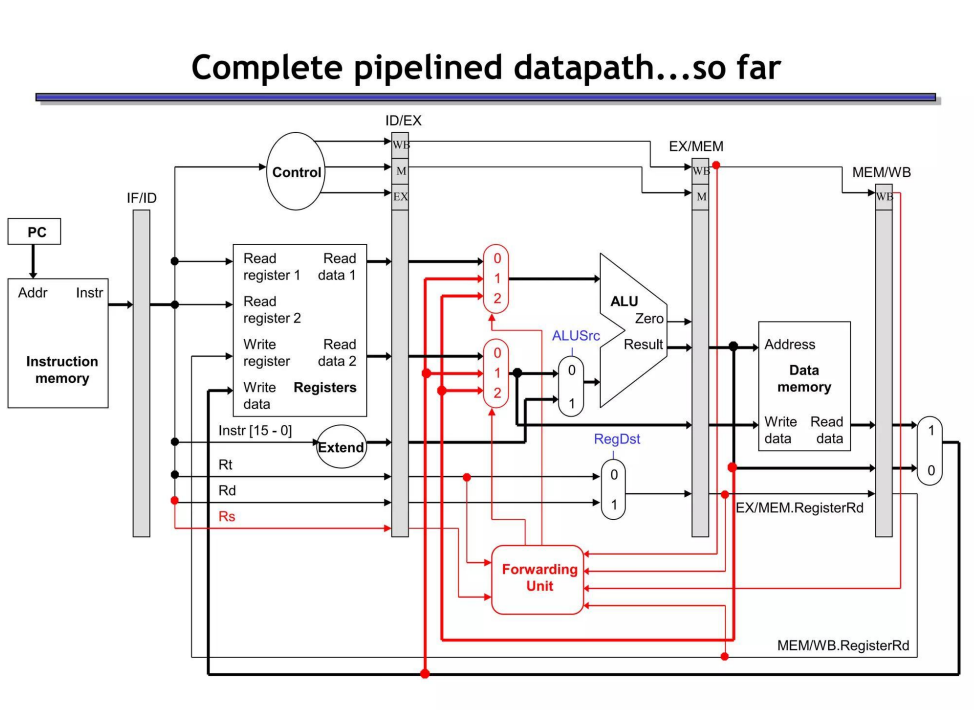

## 20. Datapath Modification to Support Forwarding

??? "Show the modification 🛠️ in the data path 🛤️ to support data forwarding."

	ডেটা ফরওয়ার্ডিং (Data/Operand Forwarding) সাপোর্ট করার জন্য প্রসেসরের সাধারণ ডেটাপাথে (Datapath) মূলত ২টি প্রধান পরিবর্তন করতে হয়:
	১. ALU-এর ইনপুটে দুটি ৩-টু-১ মাল্টিপ্লেক্সার (Mux) যুক্ত করা।
	২. একটি ফরওয়ার্ডিং ইউনিট (Forwarding Unit) বসানো যা পাইপলাইন রেজিস্টার থেকে ডেটা রিড করে Mux দুটিকে কন্ট্রোল করবে।
	১০ মিনিট পরীক্ষার আগে ঝটপট খাতায় আঁকার জন্য নিচে একটি সহজ টেক্সট-ভিত্তিক ব্লকিং ডায়াগ্রাম এবং তার সংক্ষিপ্ত ব্যাখ্যা দেওয়া হলো:

	## 🛤️ ডেটাপাথের পরিবর্তন (Text-Based Modified Datapath)
	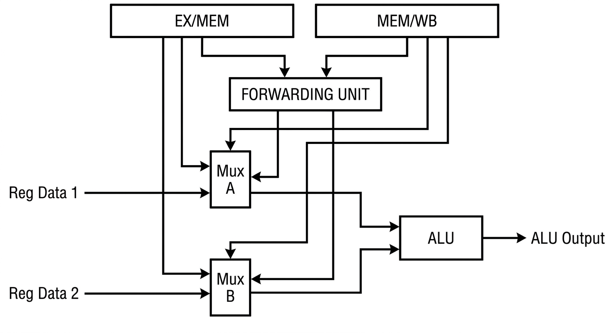

	## 🛠️ ৩টি প্রধান মডিফিকেশন (পরীক্ষার খাতায় লেখার বুলেট পয়েন্ট)

	* ৩-টু-১ মাল্টিপ্লেক্সার (Mux A & B): ALU-এর দুটি মূল ইনপুটের ঠিক সামনে দুটি নতুন মাল্টিপ্লেক্সার বসানো হয়। এদের কাজ হলো ৩টি অপশনের মধ্যে যেকোনো একটিকে বেছে নেওয়া:
	1. সাধারণ রেজিস্টার থেকে আসা ডেটা (No Forwarding)
	2. ঠিক আগের ইনস্ট্রাকশনের EX/MEM রেজিস্টার থেকে আসা ডেটা (Forward from EX)
	3. তারও আগের ইনস্ট্রাকশনের MEM/WB রেজিস্টার থেকে আসা ডেটা (Forward from MEM)
	* ফরওয়ার্ডিং পাথ (Wires): EX/MEM এবং MEM/WB পাইপলাইন রেজিস্টার থেকে দুটি সরাসরি নতুন তারের সংযোগ (Path) টেনে এনে Mux-এর ইনপুটের সাথে যুক্ত করে দেওয়া হয়।
	* ফরওয়ার্ডিং ইউনিট (Control Logic): এটি একটি নতুন হার্ডওয়্যার ব্লক যা নিচের কন্ডিশন চেক করে স্বয়ংক্রিয়ভাবে Mux সিলেক্ট করে:
	* শর্ত: যদি বর্তমান ইনস্ট্রাকশনের সোর্স রেজিস্টার ($Rs$ বা $Rt$) এবং আগের ইনস্ট্রাকশনের ডেস্টিনেশন রেজিস্টার ($Rd$) মিলে যায়, তবে এটি Mux-কে সিগন্যাল পাঠিয়ে সরাসরি পাইপলাইন রেজিস্টারের ডেটা ALU-তে পাস করে দেয়।

	------------------------------
	## 💡 পরীক্ষার শেষ মুহূর্তের ট্রিক:
	খাতায় শুধু ALU-এর ইনপুটে দুটি Mux এবং নিচ থেকে একটি Forwarding Unit এঁকে তারের কানেকশনগুলো দেখিয়ে দিলেই পরীক্ষক ফুল মার্কস দিয়ে দেবেন!
	পরীক্ষার জন্য অনেক শুভকামনা! কোনো কনফিউশন থাকলে ঝটপট জানান।


## Question 19 and 20  difference:

??? "Question 19 and 20  difference:" 

	Here is a side-by-side comparison breaking down both questions. This table organizes the **logical concept (the "what and why")** next to the **physical hardware changes (the "how")** so you can easily compare them for your exams 📝.

	| Feature | Explain with Example: Operand Forwarding 💡⏩ | Show the Modification: Data Path Changes 🛠️🛤️ |
	| --- | --- | --- |
	| **Core Objective** | To logically resolve **Data Dependencies** (specifically Read-After-Write / RAW hazards) without forcing the pipeline to freeze or "stall" 🔗✅. | To physically alter the standard CPU hardware to detect these dependencies and create shortcuts for the data 📤. |
	| **How it Works (The Concept)** | It grabs the newly calculated data *immediately* after it is computed and feeds it directly to the next instruction, completely bypassing the Write-Back (WB) stage. | It adds a "traffic controller" to monitor which registers are being used, and adds new wires to route data backward from later pipeline stages. |
	| **Detailed Breakdown (Example vs. Hardware)** | **The Example:**<br>

	<br>1. `add $t0, $t1, $t2`<br>

	<br>2. `sub $t3, $t0, $t4`<br>

	<br>

	<br>• **The Problem:** `sub` needs the value of `$t0` to execute, but `add` won't write it to the register file for another 2 cycles.<br>

	<br>• **The Forwarding Solution:** The moment `add` finishes its math in the Execute (EX) stage, that result is forwarded straight into the ALU for the `sub` instruction in the very next clock cycle. Zero stalls! | **The 4 Major Hardware Modifications:**<br>

	<br>1. **Forwarding Unit Added:** A dedicated hardware block is placed in the EX stage to act as the brain.<br>

	<br>2. **Expanded ALU MUXes:** The standard 2-to-1 multiplexers in front of the ALU are upgraded to **3-to-1 MUXes** so the ALU can accept forwarded data.<br>

	<br>3. **New Feedback Wires:** Thick data buses are added to route ALU results from the **EX/MEM** and **MEM/WB** pipeline registers backward to the new MUXes.<br>

	<br>4. **Register ID Routing:** Thin control wires route the `Rs`, `Rt`, and `Rd` register numbers into the Forwarding Unit for comparison. |
	| **The Trigger Mechanism** | Forwarding is triggered when an instruction tries to *read* a register that a previous, currently executing instruction is about to *write* to. | The **Forwarding Unit** constantly compares the source registers (`Rs`, `Rt`) of the current instruction with the destination registers (`Rd`) of older instructions in the pipeline. If they match, it flips the MUXes! |

## Hazards (all)

??? "Pipeline Hazards"
	
	

	
## 21. Data Hazards and Their Pipeline Effects
??? "What is a data hazard? ☢️ How can it be overcome? 🛡️ Discuss its side effects on pipeline performance."

	A **data hazard** occurs when overlapping instructions access the same data and normal pipeline timing would produce a result different from sequential execution.

	| Hazard | Meaning | Example |
	|---|---|---|
	| `RAW` | Read after write; true dependence | `add R1,...` then `sub ...,R1,...` |
	| `WAR` | Write after read; anti-dependence | Later instruction writes a register before an older one reads it |
	| `WAW` | Write after write; output dependence | Two writes complete in the wrong order |

	An in-order five-stage MIPS pipeline normally encounters mainly `RAW`; reads occur early and writes occur in order, preventing `WAR/WAW`. Out-of-order processors may face all three.

	Remedies include:

	- forwarding/bypassing;
	- hardware interlocks and stalls;
	- compiler instruction scheduling;
	- register renaming for `WAR/WAW`;
	- dynamic scheduling and in-order retirement;
	- load/store queues for uncertain memory dependencies.

	The direct side effect of a stall is higher CPI:

	$$CPI_{\text{actual}}=CPI_{\text{base}}+\text{data-hazard stall cycles/instruction}$$

	Forwarding reduces stalls but adds multiplexers, long comparison paths, wiring, area and power. Renaming and scheduling improve instruction-level parallelism but require reservation stations, physical registers and a reorder buffer. Incorrect speculation on memory dependence may require replay. Therefore hazard handling exchanges hardware complexity and energy for performance.


# Part D — Computer Arithmetic and Performance

## 22. Multiplication Algorithm and Processor Hardware
	
	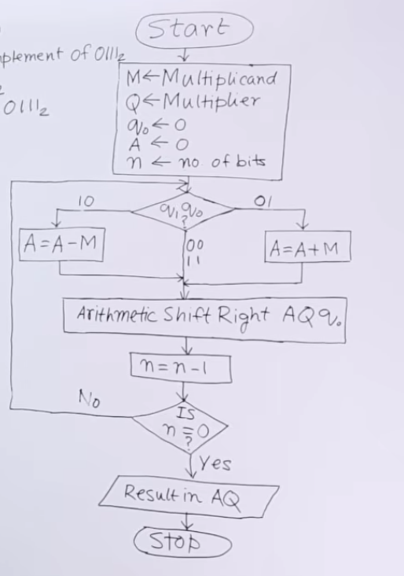
	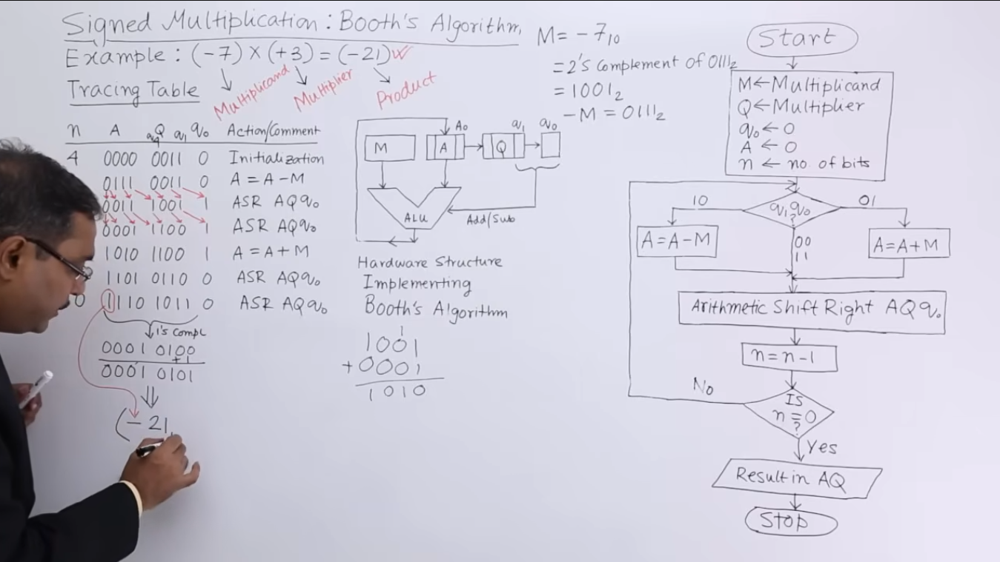


## 23. Divide \((1010)_2\) by \((0010)_2\)

### Enhanced question

**Using the restoring binary-division algorithm, divide \((1010)_2\) by \((0010)_2\). Show the contents of the accumulator, quotient register and decision in every iteration, and verify the result.**


Dividend \(Q=1010_2=10\), divisor \(M=0010_2=2\). Use a 5-bit accumulator \(A\) to observe the sign.

**Restoring rule:** Shift the combined `A,Q` left; subtract `M` from `A`. If `A` becomes negative, set \(Q_0=0\) and restore `A←A+M`; otherwise set \(Q_0=1\).

| Iteration | After left shift `(A,Q)` | `A−M` | Decision | Final `A` | Final `Q` |
|---:|---|---|---|---|---|
| Initial | — | — | — | `00000` | `1010` |
| 1 | `00001 0100` | `11111` (negative) | Restore; `Q₀=0` | `00001` | `0100` |
| 2 | `00010 1000` | `00000` | Keep; `Q₀=1` | `00000` | `1001` |
| 3 | `00001 0010` | `11111` (negative) | Restore; `Q₀=0` | `00001` | `0010` |
| 4 | `00010 0100` | `00000` | Keep; `Q₀=1` | `00000` | `0101` |

Therefore:

$$1010_2\div0010_2=0101_2,\qquad \text{remainder}=0000_2$$

Verification: \(0010_2\times0101_2+0000_2=1010_2\), or \(2\times5+0=10\).

### বাংলা উত্তর

Dividend `1010₂=10` এবং divisor `0010₂=2`। Restoring division-এ combined `A,Q` এক bit বামে shift করে `A−M` করা হয়। ফল negative হলে `Q₀=0` দিয়ে `A` restore করা হয়; negative না হলে ফল রাখা হয় এবং `Q₀=1` করা হয়।

চার iteration শেষে quotient register `Q=0101₂` এবং accumulator-এ remainder `A=00000₂`। তাই ফল \(0101_2=5\), remainder 0। যাচাই: \(0010_2\times0101_2+0=1010_2\)।

---

## 24. IEEE 754 Representation of \(-0.625_{10}\)

### Enhanced question

**Convert \(-0.625_{10}\) into normalized binary and construct its IEEE 754 single-precision and double-precision encodings. Show sign, biased exponent, fraction and hexadecimal form.**


First convert the magnitude:

$$0.625_{10}=0.5+0.125=0.101_2=1.01_2\times2^{-1}$$

The sign bit is 1. The hidden leading 1 is not stored; therefore the fraction begins with `01`.

#### Single precision (1 + 8 + 23 bits)

- Sign: `1`
- Biased exponent: \(-1+127=126=01111110_2\)
- Fraction: `01000000000000000000000`

```text
1 | 01111110 | 01000000000000000000000
```

Full word: `10111111001000000000000000000000₂`  
Hexadecimal: **`BF200000₁₆`**

#### Double precision (1 + 11 + 52 bits)

- Sign: `1`
- Biased exponent: \(-1+1023=1022=01111111110_2\)
- Fraction: `0100000000000000000000000000000000000000000000000000`

```text
1 | 01111111110 | 0100000000000000000000000000000000000000000000000000
```

Hexadecimal: **`BFE4000000000000₁₆`**

The number is represented exactly because 0.625 has a finite binary fraction.

### বাংলা উত্তর

\(0.625=0.5+0.125=0.101_2=1.01_2\times2^{-1}\)। সংখ্যা negative হওয়ায় sign bit 1। Normalized significand-এর leading 1 implicit, তাই fraction field `01` দিয়ে শুরু হবে।

Single precision-এ biased exponent \(-1+127=126=01111110_2\); ফলে bit pattern `1 | 01111110 | 01000...` এবং hex `BF200000`। Double precision-এ exponent \(-1+1023=1022=01111111110_2\); bit pattern `1 | 01111111110 | 01000...` এবং hex `BFE4000000000000`। Binary fraction সীমিত হওয়ায় এই মানটি exactভাবে represent করা যায়।

---

## 25. Design of a Four-Bit Binary Multiplier

### Enhanced question

**Design an unsigned 4×4-bit combinational binary multiplier. Derive the partial products, describe the AND-gate and adder arrangement, and verify it with an example.**


Let:

$$A=a_3a_2a_1a_0,\qquad B=b_3b_2b_1b_0$$

Each partial-product bit is generated by an AND gate:

$$p_{ij}=a_i\land b_j$$

There are \(4\times4=16\) partial-product bits. Four shifted rows are added:

```text
                 a3 a2 a1 a0 × b0
              a3 a2 a1 a0 × b1  0
           a3 a2 a1 a0 × b2  0  0
        a3 a2 a1 a0 × b3  0  0  0
        --------------------------------
                 P7 P6 P5 P4 P3 P2 P1 P0
```

The least significant output is \(P_0=a_0b_0\). Half adders can be used where only two bits meet; full adders are used where two partial-product bits and a carry meet. An array-multiplier layout places AND gates at the top and regular rows of half/full adders below them. The result needs eight bits because the largest product is \(15\times15=225=11100001_2\).

#### Verification: \(1011_2\times0110_2=11\times6\)

```text
        00001011 × b0(0) = 00000000
        00010110 × b1(1) = 00010110
        00101100 × b2(1) = 00101100
        01011000 × b3(0) = 00000000
                               --------
                               01000010₂ = 66₁₀
```

This is a combinational design: it is fast but consumes more area than a sequential shift-and-add multiplier.

### বাংলা উত্তর

দুইটি 4-bit unsigned input \(A=a_3…a_0\) ও \(B=b_3…b_0\)। প্রতিটি partial product \(p_{ij}=a_i\land b_j\), তাই 16টি AND gate দরকার। `b₀` থেকে পাওয়া row shift হয় না; `b₁`, `b₂`, `b₃`-এর row যথাক্রমে 1, 2 ও 3 bit left-shift করে half adder ও full adder-এর array দিয়ে যোগ করা হয়। Output 8-bit, কারণ সর্বোচ্চ \(15\times15=225\)।

উদাহরণে `1011₂ × 0110₂`-এর nonzero shifted row `00010110` ও `00101100`; যোগফল `01000010₂=66`। Combinational array multiplier দ্রুত, তবে sequential multiplier-এর তুলনায় বেশি gate ও area ব্যবহার করে।

---

## 26. Booth Multiplication for \(16\times(-2)\)

### Enhanced question

**Apply Booth’s signed two’s-complement multiplication algorithm to \(16\times(-2)\). Use a sufficient word length, show every arithmetic-shift step, and verify the final product.**


Six bits are required to represent \(+16\) and \(-2\):

$$M=010000_2=16,\qquad Q=111110_2=-2,\qquad -M=110000_2$$

Initialize \(A=000000\) and \(Q_{-1}=0\). Booth’s rules are:

- `Q₀Q₋₁=01`: \(A←A+M\)
- `Q₀Q₋₁=10`: \(A←A-M\)
- `00` or `11`: no arithmetic
- then perform an arithmetic right shift of `(A,Q,Q₋₁)`.

| Cycle | Pair before operation | Operation | `A` after ASR | `Q` after ASR | `Q₋₁` |
|---:|:---:|---|---|---|:---:|
| 0 | — | Initialize | `000000` | `111110` | 0 |
| 1 | 00 | None | `000000` | `011111` | 0 |
| 2 | 10 | `A←A−M` | `111000` | `001111` | 1 |
| 3 | 11 | None | `111100` | `000111` | 1 |
| 4 | 11 | None | `111110` | `000011` | 1 |
| 5 | 11 | None | `111111` | `000001` | 1 |
| 6 | 11 | None | `111111` | `100000` | 1 |

The 12-bit product is the concatenation:

$$AQ=111111100000_2$$

Its two’s-complement magnitude is `000000100000₂=32`, so \(AQ=-32\), correctly equal to \(16\times(-2)\). Booth encoding is efficient here because the run of 1s in the negative multiplier requires only one subtraction.

### বাংলা উত্তর

\(+16\) ও \(-2\) প্রকাশের জন্য 6-bit নেওয়া হলো: `M=010000`, `Q=111110`, `−M=110000`; শুরুতে `A=000000`, `Q₋₁=0`। Booth rule অনুযায়ী pair `01` হলে `A+M`, `10` হলে `A−M`, `00/11` হলে কোনো arithmetic নয়; তারপর combined `(A,Q,Q₋₁)` arithmetic right shift হয়।

ছয় cycle শেষে `A,Q = 111111 100000`; অর্থাৎ 12-bit product `111111100000₂`। এর two’s-complement magnitude 32, তাই signed ফল \(-32\), যা \(16\times(-2)\)-এর সঠিক মান। Multiplier-এ ধারাবাহিক 1 থাকায় Booth algorithm কম addition/subtraction-এ কাজটি করে।

---

## 27. Measuring Computer Performance

### Enhanced question

**Explain how computer performance is evaluated using execution time, clock rate, instruction count, CPI and MIPS. Derive the CPU-time equation and illustrate it with a numerical example.**


The most reliable measure for one program is **execution time**. If clock rate is \(f\), clock-cycle time is \(1/f\). The fundamental equation is:

$$T_{CPU}=IC\times CPI\times T_{cycle}
=\frac{IC\times CPI}{\text{Clock rate}}$$

where:

- `IC` = dynamic instruction count;
- `CPI` = average clock cycles per instruction;
- clock rate = cycles per second.

Performance is \(1/T_{CPU}\). Speedup of machine X over Y is \(T_Y/T_X\).

**MIPS** means millions of instructions per second:

$$MIPS=\frac{\text{Clock rate}}{CPI\times10^6}
=\frac{IC}{T_{CPU}\times10^6}$$

Example: A program executes \(600\) million instructions on a 3 GHz processor with CPI 1.5:

$$T_{CPU}=\frac{600\times10^6\times1.5}{3\times10^9}=0.3\text{ s}$$

$$MIPS=\frac{3\times10^9}{1.5\times10^6}=2000\text{ MIPS}$$

MIPS can be misleading across different ISAs because one ISA may complete more work per instruction. Clock rate alone is also insufficient: a higher-frequency processor may have higher CPI or execute more instructions. Real elapsed time on representative workloads is the final criterion.

### বাংলা উত্তর

একটি program-এর সর্বোত্তম performance measure হলো execution time। মৌলিক CPU equation:

$$T_{CPU}=\frac{IC\times CPI}{Clock\ Rate}$$

এখানে `IC` dynamic instruction count, `CPI` প্রতি instruction-এর গড় cycle এবং clock rate প্রতি second-এর cycle। Performance \(1/T_{CPU}\), আর speedup হলো পুরোনো ও নতুন execution time-এর অনুপাত।

MIPS \(=\frac{Clock\ rate}{CPI\times10^6}\)। উদাহরণে 600 million instruction, 3 GHz এবং CPI 1.5 হলে CPU time 0.3 s এবং 2000 MIPS। তবে ভিন্ন ISA-তে instruction-এর কাজের পরিমাণ ভিন্ন হওয়ায় MIPS বিভ্রান্তিকর হতে পারে। একইভাবে শুধু clock rate দিয়েও performance বিচার করা যায় না; representative program-এর প্রকৃত execution time তুলনা করতে হয়।

---

## 28. Comparative Performance of P1, P2 and P3

### Enhanced question

**For processors P1 (3 GHz, CPI 1.5), P2 (2.5 GHz, CPI 1.0) and P3 (4 GHz, CPI 2.5), calculate instruction rate, cycles and instruction count for a 12-second execution. Then determine the clock rate required for each processor to reduce execution time by 25% when CPI rises by 15%.**


#### (i) Instructions per second

$$IPS=\frac{Clock\ rate}{CPI}$$

| Processor | Calculation | Instruction rate |
|---|---|---:|
| P1 | \(3/1.5\) | \(2.0\times10^9\) instr/s |
| P2 | \(2.5/1.0\) | **\(2.5\times10^9\) instr/s** |
| P3 | \(4/2.5\) | \(1.6\times10^9\) instr/s |

**P2 has the highest instruction rate.**

#### (ii) Cycles and instructions in 12 seconds

$$Cycles=T\times Clock\ rate,\qquad IC=\frac{Cycles}{CPI}$$

| Processor | Cycles in 12 s | Instructions |
|---|---:|---:|
| P1 | \(12\times3=36\) billion | \(36/1.5=24\) billion |
| P2 | \(12\times2.5=30\) billion | \(30/1.0=30\) billion |
| P3 | \(12\times4=48\) billion | \(48/2.5=19.2\) billion |

#### (iii) New clock rate

The same program has the same instruction count. Required time:

$$T_{new}=0.75T_{old}$$

and

$$CPI_{new}=1.15CPI_{old}$$

Using \(T=IC\times CPI/f\):

$$f_{new}=f_{old}\times\frac{1.15}{0.75}
=1.5333f_{old}$$

| Processor | Required rate |
|---|---:|
| P1 | \(3\times1.5333=\mathbf{4.60\ GHz}\) |
| P2 | \(2.5\times1.5333=\mathbf{3.833\ GHz}\) |
| P3 | \(4\times1.5333=\mathbf{6.133\ GHz}\) |

Although execution time is reduced by only 25%, the clock must rise by 53.33% because the 15% CPI increase works against the improvement.

### বাংলা উত্তর

Instruction rate হলো clock rate/CPI। তাই P1 = 2.0 billion, P2 = 2.5 billion এবং P3 = 1.6 billion instruction/s; সর্বোচ্চ **P2**।

12 second-এ cycle সংখ্যা \(T\times f\): P1 = 36 billion, P2 = 30 billion, P3 = 48 billion। CPI দিয়ে ভাগ করলে instruction count যথাক্রমে 24 billion, 30 billion এবং 19.2 billion।

নতুন time পুরোনোর 75% এবং CPI পুরোনোর 115%। একই instruction count ধরে:

$$f_{new}=f_{old}\times\frac{1.15}{0.75}=1.5333f_{old}$$

তাই P1-এর 4.60 GHz, P2-এর 3.833 GHz এবং P3-এর 6.133 GHz দরকার। CPI বেড়ে যাওয়ার নেতিবাচক প্রভাব কাটাতে clock rate মোট 53.33% বাড়াতে হয়।

---

# Part E — Parallelism and Memory

## 29. Flynn’s Classification of Parallel Hardware

### Enhanced question

**Explain Flynn’s taxonomy of computer organizations in detail. Compare SISD, SIMD, MISD and MIMD according to instruction and data streams, execution model, applications and examples.**

### Figure: Flynn taxonomy

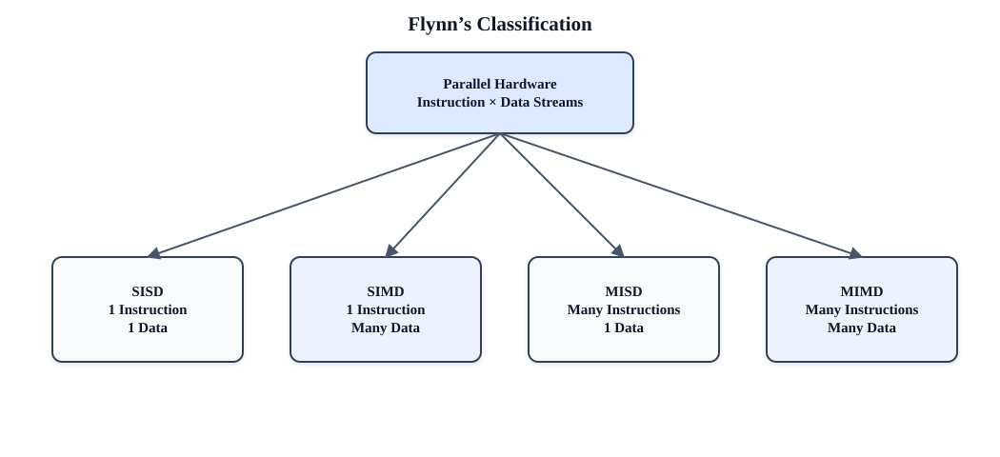


Michael Flynn classified computers by the number of simultaneous **instruction streams** and **data streams**.

| Class | Instruction streams | Data streams | Description and examples |
|---|:---:|:---:|---|
| **SISD** | 1 | 1 | One processor executes one instruction sequence on one data sequence. Traditional scalar uniprocessor; simple microcontroller. Internal pipelining does not necessarily change its Flynn class. |
| **SIMD** | 1 | Many | One control unit applies the same operation to many data elements in parallel. Vector processors, GPU warps conceptually, multimedia vector extensions and image-processing arrays. |
| **MISD** | Many | 1 | Different operations process the same data stream. Rare as a general-purpose machine; fault-tolerant redundant pipelines and certain systolic/stream-processing interpretations are cited. |
| **MIMD** | Many | Many | Independent processors execute different instruction streams on different data. Multicore CPUs, multiprocessor servers, clusters and cloud systems. |

MIMD is further divided into:

- **Shared-memory systems:** processors communicate through a common address space. Uniform-memory-access (UMA) and non-uniform-memory-access (NUMA) machines are examples.
- **Distributed-memory systems:** each node has private memory and communicates using messages, as in a cluster.

SIMD is efficient when the same computation is applied to large arrays, but branch divergence and irregular memory access reduce utilization. MIMD handles diverse and independent tasks but needs synchronization, communication and consistency control. Flynn’s taxonomy describes stream organization; it does not alone describe memory hierarchy or performance.

### বাংলা উত্তর

Flynn taxonomy একই সময়ে instruction stream ও data stream-এর সংখ্যার ভিত্তিতে hardware শ্রেণিবদ্ধ করে।

- **SISD:** একটি instruction stream একটি data stream-এর ওপর চলে; traditional scalar processor বা microcontroller।
- **SIMD:** একটি instruction বহু data element-এর ওপর একসঙ্গে প্রয়োগ হয়; vector processor, GPU এবং image-processing array।
- **MISD:** বহু instruction একই data stream প্রক্রিয়া করে; সাধারণ-purpose system-এ বিরল, fault-tolerant redundant pipeline-এ ধারণাটি দেখা যায়।
- **MIMD:** স্বাধীন processor ভিন্ন instruction ও ভিন্ন data নিয়ে কাজ করে; multicore CPU, multiprocessor server ও cluster।

MIMD shared-memory UMA/NUMA অথবা message-passing distributed-memory হতে পারে। SIMD regular array computation-এ কার্যকর, কিন্তু divergent branch ও irregular memory access efficiency কমায়। MIMD flexible, তবে synchronization, communication এবং memory consistency দরকার।

---

## 30. Cache Memory, Hit, Miss and Miss Penalty

### Enhanced question

**Define cache memory and explain locality, cache hit, cache miss, hit rate, miss rate and miss penalty. Derive average memory access time and solve a numerical example.**


**Cache memory** is a small, fast memory placed between the CPU and slower main memory. It keeps copies of recently or nearby used memory blocks. Its success depends on:

- **Temporal locality:** recently accessed data is likely to be reused.
- **Spatial locality:** nearby addresses are likely to be accessed.

A **cache hit** occurs when the requested block is found in cache. A **cache miss** occurs when it is absent and must be obtained from the next memory level. **Miss penalty** is the additional time to fetch, install and deliver the missing block. If \(h\) is hit rate, miss rate is \(1-h\).

$$AMAT=Hit\ time+Miss\ rate\times Miss\ penalty$$

Example: hit time = 1 ns, hit rate = 95%, miss penalty = 60 ns:

$$AMAT=1+0.05\times60=4\text{ ns}$$

Misses are often described as compulsory (first access), capacity (working set too large) and conflict (mapping collision). Larger blocks can exploit spatial locality but increase transfer cost and may cause pollution. Cache performance therefore depends on size, block size, associativity, replacement and write policy.

### বাংলা উত্তর

**Cache memory** CPU ও তুলনামূলক ধীর main memory-এর মাঝের ছোট ও দ্রুত memory, যা সম্প্রতি বা কাছাকাছি ব্যবহৃত block-এর copy রাখে। Temporal locality অনুযায়ী সাম্প্রতিক data আবার ব্যবহৃত হতে পারে; spatial locality অনুযায়ী কাছাকাছি address ব্যবহারের সম্ভাবনা থাকে।

Requested block cache-এ থাকলে **hit**, না থাকলে **miss**। Miss হলে নিচের memory level থেকে block এনে cache-এ বসিয়ে CPU-তে দিতে যে অতিরিক্ত সময় লাগে তা **miss penalty**। \(AMAT=Hit\ time+Miss\ rate\times Miss\ penalty\)। Hit time 1 ns, hit rate 95% এবং penalty 60 ns হলে AMAT \(=1+0.05\times60=4\) ns। Miss compulsory, capacity বা conflict ধরনের হতে পারে।

---

## 31. Write-Through and Write-Back Cache Policies

### Enhanced question

**Explain and compare write-through and write-back cache policies. Include write-hit and write-miss behavior, the role of write buffers and dirty bits, and the advantages and disadvantages of each.**


#### Write-through

Every cache write is also sent immediately to the next memory level. A **write buffer** allows the CPU to continue while the lower-level write completes.

Advantages:

- cache and lower memory remain consistent;
- simple replacement because a cache block is never dirty;
- easier I/O coherence and recovery.

Disadvantages:

- high memory/bus write traffic;
- repeated writes to the same block all reach lower memory;
- CPU may stall if the write buffer becomes full.

#### Write-back

A write updates only the cache and sets the block’s **dirty bit**. The block is written to the next level only when evicted.

Advantages:

- multiple writes are combined into one lower-level transfer;
- lower bandwidth and usually better performance/energy.

Disadvantages:

- more complex control, coherence and recovery;
- dirty eviction has an additional penalty;
- lower memory may temporarily contain stale data.

On a **write miss**, a cache may use **write-allocate** (fetch the block, then write it) or **no-write-allocate/write-around** (write lower memory without filling the cache). Write-back commonly pairs with write-allocate; write-through often pairs with no-write-allocate, although other combinations are possible.

### বাংলা উত্তর

**Write-through**-এ cache write-এর সঙ্গে সঙ্গে lower memory-তেও write পাঠানো হয়। Write buffer latency আড়াল করে। এতে memory consistent থাকে এবং replacement সহজ, কিন্তু bus traffic বেশি হয় ও buffer পূর্ণ হলে stall লাগে।

**Write-back**-এ প্রথমে শুধু cache update হয় এবং dirty bit set হয়; block evict হলে lower memory-তে লেখা হয়। এতে একই block-এর বহু write এক transfer-এ মিলিয়ে bandwidth ও energy সাশ্রয় হয়। তবে dirty eviction penalty, coherence, recovery এবং control complexity বাড়ে; lower memory সাময়িকভাবে stale থাকে।

Write miss-এ write-allocate block cache-এ এনে write করে; no-write-allocate lower memory-তে সরাসরি write করে। সাধারণত write-back-এর সঙ্গে write-allocate এবং write-through-এর সঙ্গে no-write-allocate দেখা যায়।

---

## 32. RTL for `addu`, `addi`, `lw`, `sw` and `beq`

### Enhanced question

**Write and explain the Register Transfer Logic (RTL) for the MIPS instructions `addu`, `addi`, `lw`, `sw` and `beq`, including common instruction fetch and effective-address/branch calculations.**


Let `R[x]` denote register contents and `M[x]` a 32-bit memory word. Common fetch:

```text
IR ← M[PC]
PC ← PC + 4
```

Instruction-specific RTL:

| Instruction | RTL |
|---|---|
| `addu rd,rs,rt` | `R[rd] ← R[rs] + R[rt]` (32-bit addition, no overflow exception) |
| `addi rt,rs,imm` | `R[rt] ← R[rs] + SignExt(imm16)` (signed overflow may trap) |
| `lw rt,imm(rs)` | `EA ← R[rs] + SignExt(imm16)`; `R[rt] ← M[EA]` |
| `sw rt,imm(rs)` | `EA ← R[rs] + SignExt(imm16)`; `M[EA] ← R[rt]` |
| `beq rs,rt,imm` | `if R[rs]=R[rt], PC ← PC + (SignExt(imm16) << 2)` |

In the `beq` expression, PC has already been advanced by four in the fetch step. The left shift multiplies the signed word offset by four to form a byte displacement. `lw/sw` require an aligned effective address in classic MIPS for a normal word access.

### বাংলা উত্তর

Common fetch-এ `IR←M[PC]` এবং `PC←PC+4`। `addu` দুই source register যোগ করে `rd`-তে লেখে এবং overflow exception দেয় না। `addi` sign-extended 16-bit immediate register-এর সঙ্গে যোগ করে `rt`-তে লেখে। `lw/sw` প্রথমে \(EA=R[rs]+SignExt(imm)\) তৈরি করে; `lw` memory word `rt`-তে আনে, `sw` `rt`-এর মান memory-তে লেখে। `beq`-তে register সমান হলে already advanced PC-এর সঙ্গে sign-extended immediate দুই bit shift করে যোগ করা হয়। এই shift word offset-কে byte displacement-এ রূপান্তর করে।

---

## 33. Basic Connection of Memory to the Processor

### Enhanced question

**Describe the basic electrical and logical connection between processor and memory. Explain the roles of MAR, MDR, address/data/control buses and the read/write timing sequence.**

### Figure: processor–memory interface

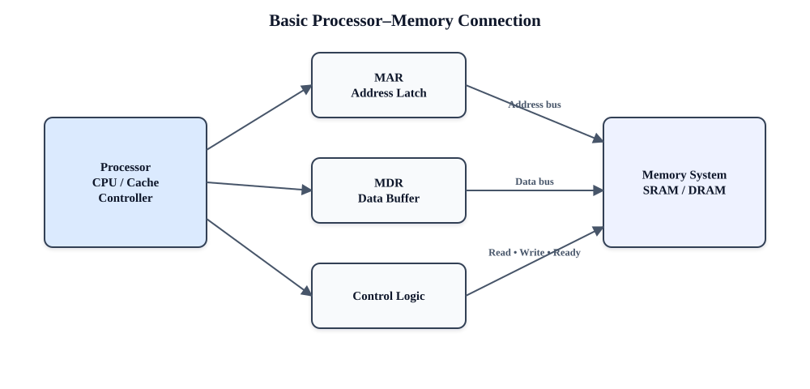


The processor communicates with memory through an address path, a data path and control signals. `MAR` or an address latch holds the requested address; `MDR` or a data buffer holds the word being transferred.

**Read sequence:**

1. CPU places an address on the address bus.
2. It asserts Memory Read and appropriate byte enables.
3. Memory decodes the address, selects a row/column and drives data.
4. Ready/valid indicates completion; CPU captures data in MDR/register.

**Write sequence:**

1. CPU places address and write data on their buses.
2. It asserts Memory Write and byte enables.
3. Selected memory cells store the data.
4. Memory acknowledges completion.

The address bus is usually processor-to-memory; the data bus is bidirectional; control lines coordinate direction, timing and transfer size. Modern CPUs normally connect to caches and an integrated memory controller rather than raw DRAM. The controller schedules DRAM commands, refresh and multiple outstanding requests.

### বাংলা উত্তর

Processor address, data ও control path দিয়ে memory-এর সঙ্গে যোগাযোগ করে। `MAR` requested address এবং `MDR` transferred data ধরে। Read-এর সময় CPU address ও Read signal দেয়; memory address decode করে data bus-এ word রাখে; Ready/valid signal পেলে CPU data গ্রহণ করে। Write-এর সময় CPU address ও data দেয়, Write ও byte-enable assert করে, memory selected cell update করে এবং completion জানায়।

Address bus সাধারণত CPU থেকে memory-র দিকে; data bus bidirectional; control bus direction, timing ও transfer size সমন্বয় করে। আধুনিক CPU সরাসরি raw DRAM নয়, cache ও memory controller-এর মাধ্যমে যুক্ত হয়; controller DRAM command, refresh ও concurrent request পরিচালনা করে।

---

## 34. Internal Organization of Bit Cells in a Memory Chip

### Enhanced question

**Explain the internal organization of memory bit cells into rows, columns and arrays. Compare SRAM and DRAM cells and describe row decoding, column selection, sense amplification and read/write operation.**

### Figure: memory-chip organization

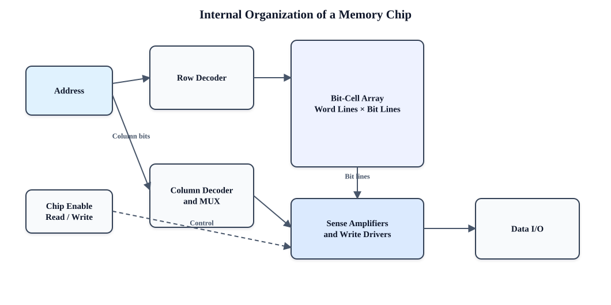


Memory cells are arranged as a rectangular array. A **row decoder** activates one word line. Cells on that row connect to vertical bit lines. Sense amplifiers detect small read signals, and a column decoder/multiplexer selects the bits forming the external word.

**SRAM cell:** Commonly a six-transistor bistable latch plus access transistors. It retains data while powered, needs no refresh and reads quickly, but occupies more area and costs more per bit. SRAM is used for caches.

**DRAM cell:** Commonly one transistor and one capacitor. Charge represents a bit. It is dense and inexpensive, but charge leaks and requires refresh. Reading is destructive in the sense that the small charge must be sensed and restored. DRAM is used for main memory.

For a read, precharged bit lines are connected to the selected cells; sense amplifiers detect and amplify the difference. For a write, write drivers force bit-line values while the word line is active. Large chips use multiple banks and hierarchical decoders to reduce delay and allow overlapping operations.

### বাংলা উত্তর

Memory bit cell row ও column-এর rectangular array-তে সাজানো থাকে। Row decoder একটি word line সক্রিয় করে; selected cell bit line-এর সঙ্গে যুক্ত হয়। Sense amplifier ক্ষুদ্র voltage difference শনাক্ত ও amplify করে; column decoder/multiplexer external word-এর bit নির্বাচন করে।

**SRAM** সাধারণত six-transistor bistable cell; power থাকলে refresh ছাড়া data ধরে, দ্রুত কিন্তু area ও cost বেশি—তাই cache-এ ব্যবহৃত। **DRAM** সাধারণত one-transistor/one-capacitor cell; dense ও সস্তা, কিন্তু charge leak হওয়ায় refresh দরকার এবং read-এর পর data restore করতে হয়—তাই main memory-তে ব্যবহৃত। বড় chip বহু bank ও hierarchical decoder ব্যবহার করে delay কমায়।

---

## 35. Design a \(2M\times32\) Module from \(512K\times8\) SRAM Chips

### Enhanced question

**Design a \(2M\times32\)-bit memory module using \(512K\times8\)-bit SRAM chips. Calculate the number of chips and banks, show address decoding and data-bus connections, and state total capacity.**


Required organization: \(2M\) words × 32 bits.  
One chip: \(512K\) words × 8 bits.

#### 1. Width expansion

$$\frac{32}{8}=4\text{ chips in parallel per bank}$$

The four chips provide data bytes `D7–D0`, `D15–D8`, `D23–D16` and `D31–D24`.

#### 2. Depth expansion

$$\frac{2M}{512K}=4\text{ banks}$$

#### 3. Total chips

$$4\text{ chips/bank}\times4\text{ banks}=\boxed{16\text{ chips}}$$

A \(2M=2^{21}\)-word module needs 21 address lines `A20…A0`. Each \(512K=2^{19}\)-word chip receives `A18…A0`. The high-order lines `A20,A19` feed a 2-to-4 decoder; one decoder output enables each bank. `OE` and `WE` may be common, but only the selected bank’s chip-enable is active.

### Figure: bank organization

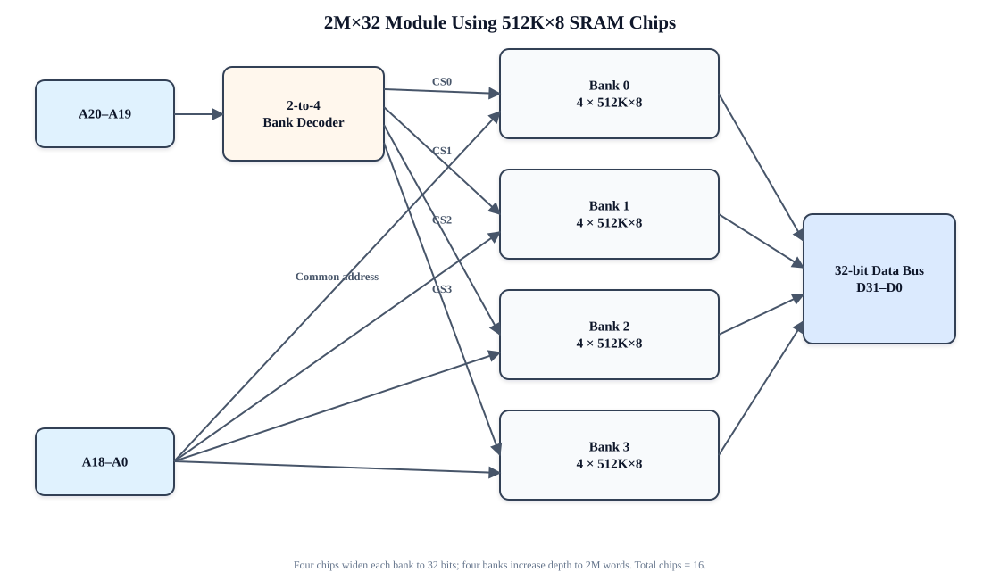

Total capacity:

$$2^{21}\times32=2^{26}\text{ bits}=64\text{ Mibits}=8\text{ MiB}$$

### বাংলা উত্তর

একটি chip `512K×8`; module দরকার `2M×32`। Width 32 করার জন্য প্রতি bank-এ \(32/8=4\)টি chip parallel লাগবে। Depth \(2M/512K=4\), তাই 4টি bank। মোট chip \(4\times4=16\)।

`2M=2²¹` word হওয়ায় module address line 21টি (`A20…A0`)। প্রতিটি chip-এ `512K=2¹⁹` location, তাই `A18…A0` সব chip-এ common যায়। উপরের `A20,A19` একটি 2-to-4 decoder-এ গিয়ে একটি bank select করে। Selected bank-এর চার chip 32-bit data bus-এর চারটি byte lane চালায়। মোট capacity \(2^{21}\times32=64\) Mibit = 8 MiB।

---

## 36. Virtual Memory and the Need for Mapping Functions

### Enhanced question

**Define virtual memory and explain address translation using pages, frames, page tables and the TLB. Then explain why a mapping function is required in cache memory and compare direct, associative and set-associative mapping.**


**Virtual memory** gives each process a large, private, contiguous virtual address space even though physical memory is smaller and shared. A virtual address is divided into a **virtual page number (VPN)** and page offset. The page table maps the VPN to a physical frame number; the offset is unchanged. A **TLB** caches recent translations. If a valid translation is absent from the page table because the page is not resident, a page fault allows the OS to bring it from secondary storage.

Benefits include protection, process isolation, relocation, controlled sharing and demand paging.

Cache memory is much smaller than main memory, so a **mapping function** is required to determine where a main-memory block may be placed and how it will be found:

| Mapping | Placement | Main property |
|---|---|---|
| **Direct mapped** | One line: `line = block mod number_of_lines` | Fast and cheap, but conflict misses can be high |
| **Fully associative** | Any cache line | Fewest placement conflicts, but expensive parallel tag search |
| **Set associative** | Any line in one set: `set = block mod number_of_sets` | Compromise between cost and conflicts |

A cache address is interpreted using tag, index/set and block-offset fields. The index selects candidate line(s); stored tag(s) determine whether the desired block is present; offset selects the requested byte/word.

Virtual-memory mapping and cache mapping solve related but distinct problems: page translation maps a process’s virtual page to a physical frame, while cache mapping places a memory block in a limited on-chip cache. Their interaction leads to physically indexed/tagged, virtually indexed/tagged or VIPT cache designs, each with timing and aliasing trade-offs.

### বাংলা উত্তর

**Virtual memory** প্রতিটি process-কে বড়, private ও ধারাবাহিক virtual address space দেয়, যদিও physical memory ছোট ও shared। Virtual address-এর VPN page table-এর মাধ্যমে physical frame number-এ translate হয়; page offset অপরিবর্তিত থাকে। TLB সাম্প্রতিক translation cache করে। Page memory-তে না থাকলে page fault হয় এবং OS secondary storage থেকে তা আনে। এতে protection, isolation, relocation, sharing ও demand paging সুবিধা পাওয়া যায়।

Cache main memory-এর চেয়ে ছোট, তাই memory block cache-এর কোথায় থাকবে তা নির্ধারণে mapping function দরকার। Direct mapping-এ block-এর একটিমাত্র line; fully associative-এ যেকোনো line; set-associative-এ নির্দিষ্ট set-এর যেকোনো way ব্যবহার করা যায়। Address-এর index candidate set নির্বাচন করে, tag block মিলিয়ে দেখে এবং offset নির্দিষ্ট byte/word বেছে নেয়।

Virtual-memory mapping virtual page-কে physical frame-এ অনুবাদ করে; cache mapping physical/virtual memory block-কে সীমিত cache line-এ স্থাপন করে। দুইটি সম্পর্কিত হলেও একই কাজ নয়।

---

# Final Exam-Writing Checklist

For a strong 20-mark answer:

1. Write the enhanced definition/introduction first.
2. Draw the diagram before the long explanation and label every path.
3. Use a comparison table where the question asks for differences.
4. State assumptions, especially notation, word size, signedness and addressing mode.
5. Show formulas before substituting numerical values.
6. Preserve leading zeros in binary arithmetic.
7. End with a one- or two-sentence result/conclusion.

বাংলায় লিখলেও standard technical terms—যেমন **datapath, control signal, cache miss, forwarding, CPI, ISA**—English-এ রাখলে উত্তর বেশি নির্ভুল ও পাঠ্যবইসম্মত হয়। Diagram-এর label-ও English-এ রাখলে পরীক্ষকের কাছে সহজে বোধগম্য হবে।

---

**End of answer bank**
