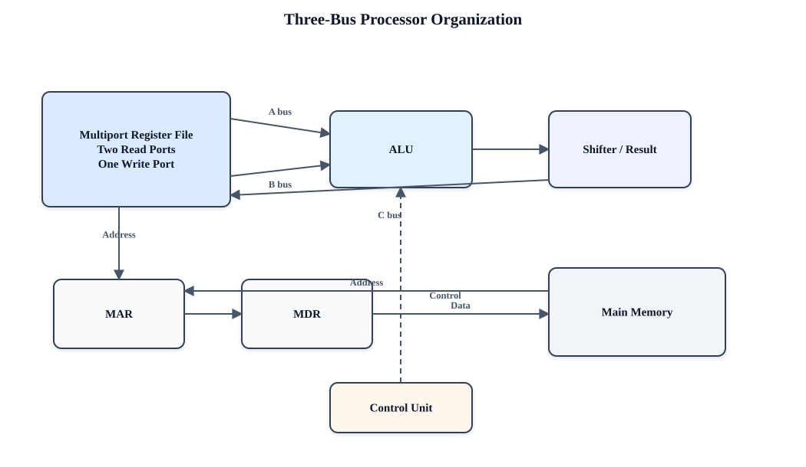
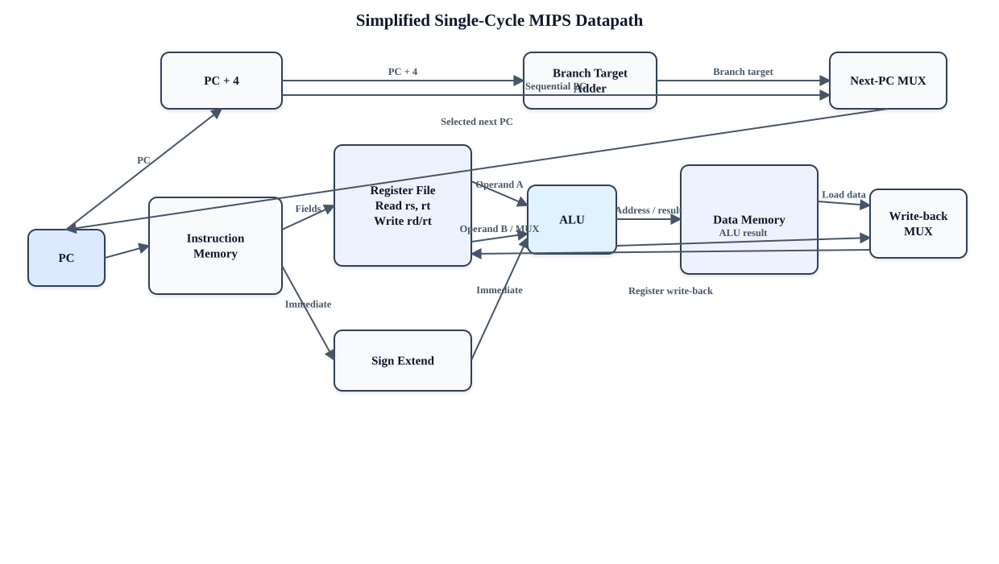
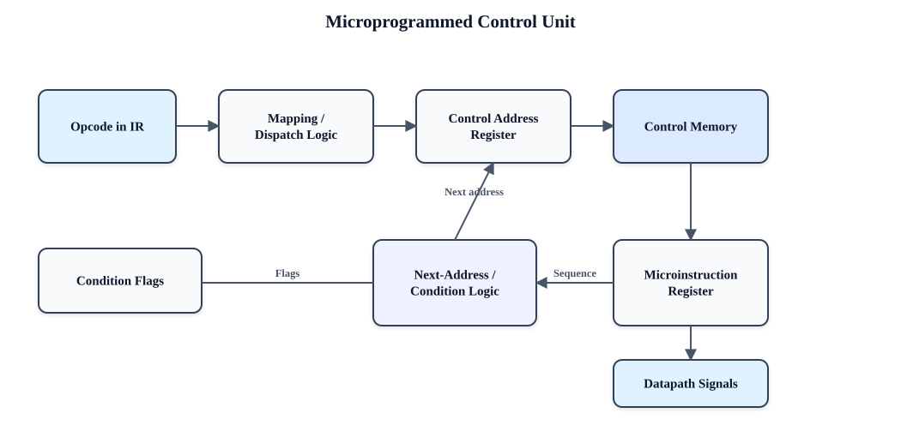
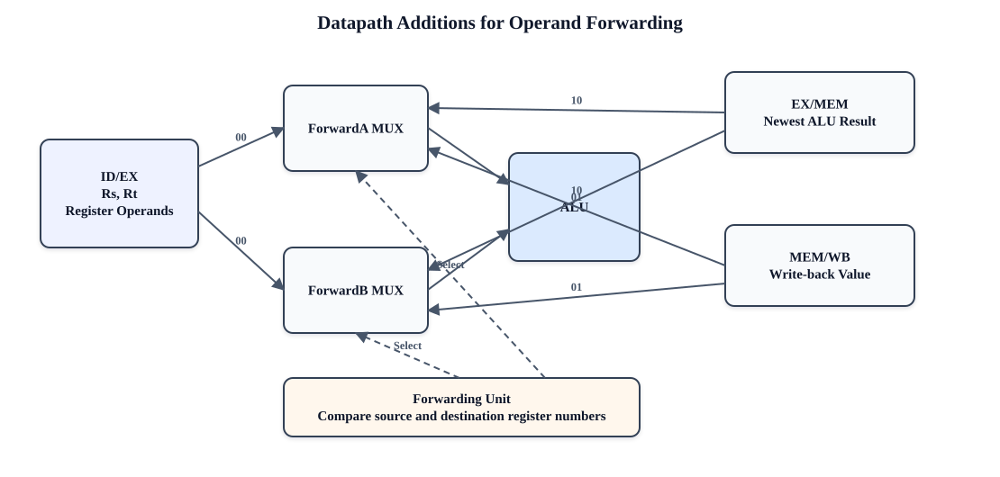
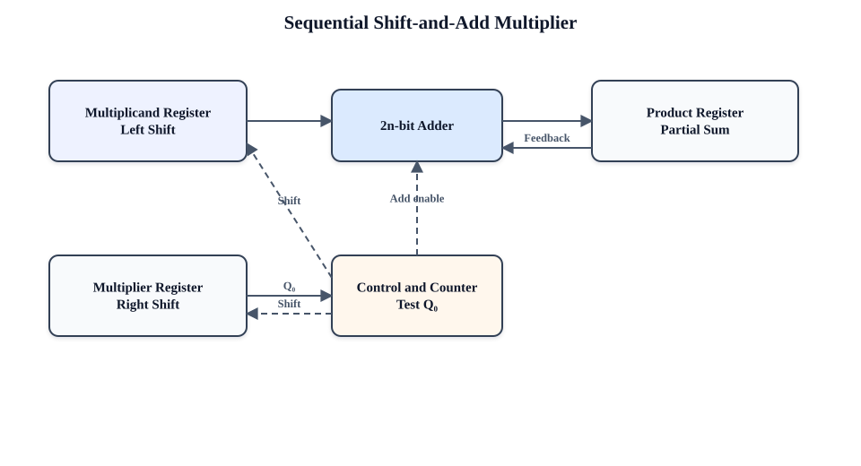

# Computer Architecture: University-Level 20-Mark Bilingual Answer Bank

**English and বাংলা | Expanded exam-ready answers | Diagrams, formulas, worked examples**

> **How to use this file:** In the examination, begin with a definition or introduction, draw the relevant diagram, explain the main points under headings, add an example or equation, and finish with a short conclusion. The answers below are intentionally structured in that order.

---

## Contents

### Part A — Core Concepts

1. Classes of computers  
2. Layers of computer system architecture  
3. Throughput and response time  
4. Basic functional units of a computer  
5. Bus structure of a processor  
6. Instruction Set Architecture and MIPS formats  
7. RISC versus CISC  

### Part B — Instructions, ISA, Datapath and Control

1. Execution of `Load R2, LOC`
2. Characteristics of a RISC processor
3. Three-bus CISC-style processor organization
4. Execution of `Add (R3), R1`
5. MIPS addressing modes
6. MIPS code for two C statements
7. Compilation of a C program
8. General addressing modes
9. Instruction and its computer representation
10. Processor datapath
11. Datapath control signals
12. Dynamic scheduling
13. Microprogrammed control for a branch
14. Purpose of the control unit
15. Word, address and memory access time

### Part C — Pipelining and Hazards

16. Pipeline performance
17. Ideal pipelined operation
18. Pipeline issues
19. Operand forwarding
20. Datapath modification for forwarding
21. Data hazards and their performance effects

### Part D — Computer Arithmetic and Performance

22. Multiplication algorithm and hardware
23. Binary division
24. IEEE 754 representation of −0.625
25. Four-bit binary multiplier
26. Booth multiplication: 16 × (−2)
27. Measuring computer performance
28. Comparative processor-performance problem

### Part E — Parallelism and Memory

29. Flynn’s classification
30. Cache memory, hit, miss and miss penalty
31. Write-through and write-back
32. RTL for selected MIPS instructions
33. Processor–memory connection
34. Internal organization of memory bit cells
35. Design of a 2M×32 memory module
36. Virtual memory and cache mapping

---

# Part A — Core Concepts

## A1. Classes of Computers

### Enhanced question

**Classify computers from the viewpoints of data representation, purpose, and size/performance. Explain the defining characteristics and typical applications of every major class with suitable examples.**

### English answer

A computer is an electronic programmable system that accepts data, processes it according to stored instructions, produces information, and stores the result. A single classification is insufficient because computers differ in the type of data they process, the task for which they are built, and their processing capacity.

#### 1. Classification by data representation

| Class | Main characteristics | Typical applications |
|---|---|---|
| **Analog computer** | Works with continuous physical quantities such as voltage, pressure, speed or temperature; gives approximate results; very fast for simulation of continuous systems. | Process control, old flight simulators, differential analysers. |
| **Digital computer** | Represents data using discrete binary values; programmable, accurate, repeatable and suitable for storage and logical operations. | PCs, smartphones, servers, calculators. |
| **Hybrid computer** | Combines analog measurement with digital control and accuracy. An A/D converter usually connects the two parts. | ICU monitoring, petrol pumps, industrial and scientific control. |

#### 2. Classification by purpose

- **General-purpose computer:** Can perform many tasks by changing software. A laptop may be used for programming, accounting, communication and entertainment.
- **Special-purpose computer:** Designed and optimized for one restricted task. Examples include an automobile engine-control unit, traffic-light controller and washing-machine controller.
- **Embedded computer:** A special-purpose computer built inside a larger product. It normally has limited memory and power, real-time constraints, high reliability and little or no general user interface.

#### 3. Classification by size and performance

| Class | Important characteristics | Examples/uses |
|---|---|---|
| **Microcomputer / Personal computer** | One main user; microprocessor-based; low cost; desktop, laptop, tablet or smartphone form. | Education, office and home use. |
| **Workstation** | High-end single-user system; powerful CPU/GPU, large RAM and professional reliability. | CAD, 3-D design, engineering and scientific work. |
| **Midrange system / Minicomputer** | Supports several or many users and I/O terminals; historically smaller than a mainframe. Modern departmental servers occupy this role. | Laboratories, factories and departmental databases. |
| **Mainframe** | Very high I/O throughput, reliability, security, virtualization and support for thousands of concurrent users or transactions. | Banks, airlines, census and government records. |
| **Supercomputer** | Highest computational performance through massive parallelism; measured using FLOPS rather than only instruction rate. | Weather prediction, molecular modelling, AI and nuclear simulation. |

Thus, “largest” does not always mean “best.” A mainframe is optimized mainly for reliable transaction and I/O processing, whereas a supercomputer is optimized for enormous numerical computation.

### বাংলা উত্তর

কম্পিউটার হলো এমন একটি প্রোগ্রামযোগ্য ইলেকট্রনিক ব্যবস্থা, যা ইনপুট ডেটা গ্রহণ করে, সংরক্ষিত নির্দেশ অনুযায়ী প্রক্রিয়াকরণ করে, ফলাফল প্রদান করে এবং প্রয়োজনে তা সংরক্ষণ করে। ডেটার প্রকৃতি, ব্যবহারের উদ্দেশ্য এবং ক্ষমতার ভিত্তিতে কম্পিউটারকে বিভিন্ন শ্রেণিতে ভাগ করা যায়।

#### ১. ডেটা উপস্থাপনের ভিত্তিতে

| শ্রেণি | প্রধান বৈশিষ্ট্য | ব্যবহার |
|---|---|---|
| **অ্যানালগ কম্পিউটার** | ভোল্টেজ, চাপ, তাপমাত্রা বা গতির মতো ধারাবাহিক রাশি নিয়ে কাজ করে; ফল সাধারণত আনুমানিক; continuous-system simulation-এ দ্রুত। | Process control, পুরোনো flight simulator। |
| **ডিজিটাল কম্পিউটার** | বিচ্ছিন্ন বাইনারি মানে ডেটা প্রকাশ করে; নির্ভুল, প্রোগ্রামযোগ্য ও পুনরাবৃত্ত ফল প্রদান করে। | PC, smartphone, server, calculator। |
| **হাইব্রিড কম্পিউটার** | অ্যানালগ অংশের দ্রুত measurement এবং ডিজিটাল অংশের নিয়ন্ত্রণ ও নির্ভুলতা একত্র করে। | ICU monitor, petrol pump, industrial control। |

#### ২. উদ্দেশ্যের ভিত্তিতে

- **General-purpose computer:** সফটওয়্যার পরিবর্তন করে বিভিন্ন কাজ করা যায়; যেমন laptop।
- **Special-purpose computer:** নির্দিষ্ট একটি কাজের জন্য নকশা করা; যেমন traffic-light controller বা engine-control unit।
- **Embedded computer:** বড় কোনো যন্ত্রের ভেতরে স্থাপিত বিশেষ কম্পিউটার। এতে সাধারণত সীমিত memory/power, real-time response এবং উচ্চ reliability থাকে।

#### ৩. আকার ও কর্মক্ষমতার ভিত্তিতে

- **Microcomputer/PC:** একক ব্যবহারকারীকেন্দ্রিক, microprocessor-ভিত্তিক এবং তুলনামূলক কম ব্যয়বহুল।
- **Workstation:** উচ্চক্ষমতার single-user system; CAD, graphics ও scientific কাজের জন্য শক্তিশালী CPU/GPU এবং বেশি RAM থাকে।
- **Midrange/Minicomputer:** একই সময়ে একাধিক ব্যবহারকারী ও terminal সমর্থন করে; আধুনিক departmental server এই ভূমিকা পালন করে।
- **Mainframe:** বিপুল I/O throughput, security, reliability ও হাজারো concurrent transaction পরিচালনায় দক্ষ; ব্যাংক ও বিমান সংস্থায় ব্যবহৃত হয়।
- **Supercomputer:** massive parallelism ব্যবহার করে সর্বোচ্চ numerical performance দেয়; weather forecasting, AI এবং simulation-এ ব্যবহৃত হয়।

অতএব, mainframe ও supercomputer-এর উদ্দেশ্য এক নয়। Mainframe মূলত নির্ভরযোগ্য transaction processing-এ এবং supercomputer বিশাল বৈজ্ঞানিক গণনায় বিশেষভাবে দক্ষ।

---

## A2. Layers of Computer System Architecture

### Enhanced question

**Explain the layered organization of a computer system from application software down to electronic devices. Show how abstraction allows one layer to use the services of the layer below it, and draw a neat labeled diagram.**

### Figure: layered computer system


### English answer

Computer architecture is understood more easily as a hierarchy of abstractions. Each layer hides unnecessary implementation details and offers a simpler interface to the layer above.

1. **Application layer:** Contains programs that solve users’ problems, such as browsers, word processors and database systems.
2. **High-level language and library layer:** Programmers express algorithms using C, C++, Java or libraries. Compilers translate this representation toward the ISA.
3. **Operating-system layer:** Manages processes, memory, files, security and I/O devices. It provides system calls and makes hardware resources appear orderly and shareable.
4. **ISA layer:** The boundary visible to machine-language programmers and compilers. It defines instructions, registers, data formats, addressing modes, exceptions and the memory model. MIPS, ARM and x86 are ISAs.
5. **Microarchitecture layer:** The particular hardware organization that implements an ISA—datapath, control unit, ALU, pipeline, cache and branch predictor. Different processors can implement the same ISA differently.
6. **Digital-logic layer:** Implements the microarchitecture using gates, adders, decoders, multiplexers, registers and state machines.
7. **Circuit/device layer:** Implements logic with transistors, semiconductor devices, wires, voltage and timing.

The important idea is **abstraction**. For example, a C statement is compiled into ISA instructions; those instructions are executed by a microarchitecture; the microarchitecture is constructed from logic gates; and the gates are implemented using transistors. This separation permits software portability and independent improvement of hardware.

### বাংলা উত্তর

কম্পিউটার সিস্টেমকে abstraction-এর কয়েকটি স্তর হিসেবে ব্যাখ্যা করা যায়। প্রতিটি স্তর নিচের স্তরের জটিল বাস্তবায়ন লুকিয়ে উপরের স্তরকে সহজ service বা interface দেয়।

1. **Application layer:** Browser, word processor ও database-এর মতো ব্যবহারকারীর সমস্যা সমাধানকারী program।
2. **High-level language ও library layer:** C, C++, Java এবং API-এর সাহায্যে algorithm লেখা হয়; compiler এগুলোকে ISA-এর নির্দেশে রূপান্তর করে।
3. **Operating-system layer:** Process, file, virtual memory, security ও I/O device পরিচালনা করে এবং system call দেয়।
4. **ISA layer:** Software ও hardware-এর মধ্যবর্তী দৃশ্যমান চুক্তি। এতে instruction, register, data format, addressing mode, exception ও memory model নির্ধারিত থাকে।
5. **Microarchitecture layer:** নির্দিষ্ট ISA বাস্তবায়নকারী datapath, control unit, ALU, pipeline, cache ও branch predictor-এর সংগঠন।
6. **Digital-logic layer:** Gate, adder, multiplexer, decoder, register ও state machine দিয়ে microarchitecture গঠন করে।
7. **Circuit/device layer:** Transistor, wire, voltage ও semiconductor প্রযুক্তি দিয়ে logic gate বাস্তবায়ন করে।

উদাহরণস্বরূপ, একটি C statement প্রথমে machine instruction-এ অনূদিত হয়; microarchitecture সেই instruction চালায়; logic gate microarchitecture তৈরি করে; আর transistor দিয়ে gate তৈরি হয়। এই স্তরভিত্তিক গঠন software portability এবং hardware-এর স্বাধীন উন্নয়ন সম্ভব করে।

---

## A3. Throughput and Response Time

### Enhanced question

**Define response time and throughput as measures of computer performance. Derive their basic performance relationships, compare them, and explain with examples how a design change may affect either or both.**

### English answer

**Response time (latency)** is the total elapsed time from submitting one task until its completion:

$$T_{\text{response}}=T_{\text{finish}}-T_{\text{start}}$$

It includes CPU time, memory and I/O waiting, operating-system overhead and any queueing delay. Performance for a single task is inversely related to execution time:

$$\text{Performance}\propto\frac{1}{T_{\text{execution}}}$$

**Throughput (bandwidth)** is the number of tasks completed per unit time:

$$\text{Throughput}=\frac{\text{Number of completed jobs}}{\text{Total time}}$$

| Aspect | Response time | Throughput |
|---|---|---|
| Concern | How long one job takes | How many jobs finish |
| Unit | seconds/job | jobs/second |
| Important to | Interactive user | Server/data-centre operator |
| Common improvement | Faster core, lower latency | More cores, disks or servers |

Example: If one request completes in 0.2 s, its response time is 0.2 s. If a server completes 500 requests in 10 s, throughput is 50 requests/s. Replacing one processor with a faster processor may improve both. Adding a second processor may nearly double throughput when jobs are independent, but it may not shorten the response time of one serial job. Queueing also connects the measures: when arrival rate approaches maximum throughput, response time can rise sharply.

### বাংলা উত্তর

**Response time বা latency** হলো একটি কাজ জমা দেওয়া থেকে ফল পাওয়া পর্যন্ত মোট সময়:

$$T_{\text{response}}=T_{\text{finish}}-T_{\text{start}}$$

এর মধ্যে CPU execution, memory/I/O wait, OS overhead এবং queueing delay অন্তর্ভুক্ত। একটি কাজের performance execution time-এর ব্যস্তানুপাতিক।

**Throughput বা bandwidth** হলো একক সময়ে সম্পন্ন কাজের সংখ্যা:

$$\text{Throughput}=\frac{\text{সম্পন্ন কাজের সংখ্যা}}{\text{মোট সময়}}$$

Response time বলে **একটি কাজ কত দ্রুত শেষ হয়**, আর throughput বলে **একক সময়ে কতগুলো কাজ শেষ হয়**। Interactive user কম response time চায়; server administrator বেশি throughput চায়।

উদাহরণ: একটি request শেষ হতে 0.2 s লাগলে response time 0.2 s। 10 s-এ 500টি request সম্পন্ন হলে throughput 50 requests/s। আরও processor যোগ করলে independent কাজের throughput প্রায় দ্বিগুণ হতে পারে, কিন্তু একটি serial কাজের response time কমতেই হবে—এমন নয়। আবার system-এর arrival rate সর্বোচ্চ throughput-এর কাছাকাছি গেলে queue তৈরি হয়ে response time দ্রুত বেড়ে যেতে পারে।

---

## A4. Basic Functional Units of a Computer

### Enhanced question

**Identify and explain the basic functional units of a stored-program computer. Describe the flow of instructions and data among these units with a block diagram.**

### Figure: functional organization


### English answer

A stored-program computer contains five fundamental units:

1. **Input unit:** Accepts programs and data from keyboards, sensors, networks or storage and converts them into binary form.
2. **Memory unit:** Holds both instructions and data. Registers are fastest and closest to the ALU; cache reduces the gap between CPU and main memory; main memory stores currently active programs; secondary storage provides long-term capacity.
3. **Arithmetic and Logic Unit (ALU):** Performs arithmetic, logic, comparison and shift operations. Condition flags may record zero, carry, sign and overflow.
4. **Control unit:** Fetches and decodes instructions and issues timing/control signals that move data and select ALU, memory and I/O operations. The program counter (PC) identifies the next instruction and the instruction register (IR) holds the current one.
5. **Output unit:** Converts binary results into a form usable by people or other systems.

The **register file, ALU and control unit together form the CPU**. Buses and interconnects carry addresses, data and control information. During the fetch–decode–execute cycle, the CPU fetches an instruction from memory, decodes its opcode, obtains operands, executes the operation, accesses memory if required and writes back the result.

### বাংলা উত্তর

Stored-program computer-এর পাঁচটি মৌলিক functional unit হলো:

1. **Input unit:** Keyboard, sensor, network বা storage থেকে data/program গ্রহণ করে binary form-এ রূপান্তর করে।
2. **Memory unit:** Instruction ও data উভয়ই সংরক্ষণ করে। Register সবচেয়ে দ্রুত; cache CPU–memory speed gap কমায়; main memory চলমান program রাখে; secondary storage দীর্ঘমেয়াদি সংরক্ষণ দেয়।
3. **ALU:** Arithmetic, logic, comparison ও shift operation সম্পন্ন করে। Zero, carry, sign এবং overflow flag-ও তৈরি করতে পারে।
4. **Control unit:** Instruction fetch ও decode করে এবং datapath, memory ও I/O-এর জন্য প্রয়োজনীয় timing/control signal দেয়। PC পরবর্তী instruction-এর address এবং IR বর্তমান instruction ধারণ করে।
5. **Output unit:** Binary ফলাফলকে মানুষ বা অন্য system-এর উপযোগী রূপে প্রকাশ করে।

Register file, ALU ও control unit মিলে CPU গঠিত হয়। Address, data এবং control bus ইউনিটগুলোর মধ্যে তথ্য বহন করে। Fetch–decode–execute cycle-এ instruction memory থেকে আনা হয়, decode করা হয়, operand সংগ্রহ করা হয়, operation সম্পন্ন হয় এবং ফল register বা memory-তে লেখা হয়।

---

## A5. Bus Structure of a Processor

### Enhanced question

**Explain the internal and external bus structure of a processor. Distinguish address, data and control buses, and compare single-bus, two-bus and three-bus CPU organizations.**

### Figure: system bus and internal three-bus datapath


### English answer

A **bus** is a shared collection of lines that transfers information among components.

- The **address bus** selects a memory location or I/O port. With \(n\) address lines, up to \(2^n\) locations can be selected.
- The **data bus** carries instructions and operand values. It is normally bidirectional, and its width influences the amount transferred at once.
- The **control bus** carries signals such as Read, Write, clock, interrupt, reset, byte-enable, bus-request and ready/wait.

Inside a processor, buses connect the register file, ALU, shifter and memory interface:

| Organization | Operation in one cycle | Advantage | Limitation |
|---|---|---|---|
| **Single bus** | Only one transfer at a time | Simple and inexpensive | More cycles and bus contention |
| **Two bus** | Usually two reads or one read/one write | Better concurrency | Still restricts some ALU transfers |
| **Three bus** | Two source operands on A and B buses; one result on C bus | `R1 ← R2 + R3` can complete as one register transfer | More ports, wires and hardware cost |

A synchronous bus uses a shared clock, whereas an asynchronous bus coordinates transfers with request/acknowledge signals. Bus width, frequency and protocol determine bandwidth. Arbitration is required when several bus masters, such as CPU and DMA controller, request the bus.

### বাংলা উত্তর

**Bus** হলো একগুচ্ছ shared signal line, যা বিভিন্ন hardware unit-এর মধ্যে তথ্য পরিবহন করে।

- **Address bus** memory location বা I/O port নির্বাচন করে। \(n\)টি address line সর্বোচ্চ \(2^n\)টি location নির্দেশ করতে পারে।
- **Data bus** instruction ও operand বহন করে এবং সাধারণত bidirectional।
- **Control bus** Read, Write, clock, interrupt, reset, byte-enable, bus-request এবং ready/wait signal বহন করে।

CPU-এর ভেতরে bus register file, ALU, shifter ও memory interface যুক্ত করে। Single-bus organization সহজ ও কম ব্যয়বহুল, কিন্তু একসময়ে একটি transfer হওয়ায় বেশি cycle লাগে। Two-bus organization কিছু parallel transfer সম্ভব করে। Three-bus organization-এ A ও B bus দিয়ে দুইটি source operand ALU-তে যায় এবং C bus দিয়ে ফল register-এ ফেরে; ফলে `R1 ← R2 + R3` একই register-transfer cycle-এ করা যায়। তবে register file-এ বেশি port ও বেশি wire দরকার হয়।

Synchronous bus clock অনুসরণ করে; asynchronous bus request/acknowledge signal ব্যবহার করে। Bus width, frequency ও protocol মোট bandwidth নির্ধারণ করে। CPU ও DMA-এর মতো একাধিক master থাকলে arbitration প্রয়োজন।

---

## A6. Instruction Set Architecture and MIPS Instruction Formats

### Enhanced question

**Define Instruction Set Architecture (ISA) and explain why it is called the interface between software and hardware. Describe the 32-bit MIPS R-, I- and J-type instruction formats with field functions, examples and encodings.**

### English answer

An **Instruction Set Architecture (ISA)** is the programmer-visible specification of a computer. It defines machine instructions, registers, operand data types, instruction formats, addressing modes, memory organization, exceptions and I/O behavior. Compilers generate instructions according to the ISA, while processor designers construct a microarchitecture that executes them. Therefore, an ISA is a contract between software and hardware.

Classic MIPS uses fixed 32-bit instructions and 32 general-purpose registers.

#### MIPS formats

| Type | 31–26 | 25–21 | 20–16 | 15–11 | 10–6 | 5–0 |
|---|---:|---:|---:|---:|---:|---:|
| **R-type** | opcode 6 | rs 5 | rt 5 | rd 5 | shamt 5 | funct 6 |
| **I-type** | opcode 6 | rs 5 | rt 5 | immediate/address 16 ||||
| **J-type** | opcode 6 | target address 26 |||||

**R-type:** Used mainly for register-to-register ALU operations. `rs` and `rt` identify source registers, `rd` the destination, `shamt` a shift amount and `funct` the exact ALU operation.

```mips
add $t0, $t1, $t2       # $t0 = $t1 + $t2
```

Here, opcode is normally 0; `rs=$t1`, `rt=$t2`, `rd=$t0`, and `funct=100000₂` for signed `add`.

**I-type:** Used for immediate arithmetic, loads/stores and conditional branches.

```mips
addi $t0, $t1, 12       # $t0 = $t1 + 12
lw   $t0, 20($s0)       # $t0 = Memory[$s0 + 20]
beq  $t0, $t1, Label    # branch using PC-relative offset
```

**J-type:** Used for long-range jumps. The 26-bit target is shifted left by two and combined with the upper four bits of `PC+4`.

```mips
j Target
```

Fixed instruction length simplifies decoding and pipelining, while the three formats provide enough flexibility for arithmetic, memory and control-flow operations.

### বাংলা উত্তর

**Instruction Set Architecture (ISA)** হলো programmer ও compiler-এর কাছে দৃশ্যমান computer specification। এতে machine instruction, register, data type, instruction format, addressing mode, memory organization, exception এবং I/O আচরণ নির্ধারিত থাকে। Compiler ISA অনুযায়ী code তৈরি করে এবং processor-এর microarchitecture সেই instruction execute করে। তাই ISA-কে software ও hardware-এর মধ্যকার চুক্তি বলা হয়।

Classic MIPS-এ instruction-এর দৈর্ঘ্য 32 bit এবং 32টি general-purpose register থাকে।

- **R-type:** Register-to-register arithmetic/logic কাজের জন্য। `rs`, `rt` source; `rd` destination; `shamt` shift amount এবং `funct` নির্দিষ্ট operation নির্দেশ করে। উদাহরণ: `add $t0,$t1,$t2`।
- **I-type:** Immediate arithmetic, load/store ও conditional branch-এর জন্য। এতে 16-bit immediate বা displacement থাকে। উদাহরণ: `addi $t0,$t1,12`, `lw $t0,20($s0)`, `beq $t0,$t1,Label`।
- **J-type:** দূরের unconditional jump-এর জন্য। 26-bit target-কে দুই bit বামে shift করে `PC+4`-এর উপরের চার bit-এর সঙ্গে যুক্ত করা হয়। উদাহরণ: `j Target`।

সব instruction 32-bit হওয়ায় instruction fetch, decoding এবং pipelining সহজ হয়। R, I ও J—এই তিন format arithmetic, memory access ও control transfer সম্পন্ন করে।

---

## A7. RISC and CISC Architecture

### Enhanced question

**Compare RISC and CISC processor architectures critically. Discuss instruction complexity, encoding, memory access, control implementation, pipelining, code density and representative examples.**

### English answer

RISC and CISC are design philosophies rather than rigid categories. Modern processors often combine ideas from both.

| Criterion | RISC | CISC |
|---|---|---|
| Instruction set | Small, regular, simple operations | Large set with complex operations |
| Instruction length | Usually fixed or few formats | Often variable length |
| Memory access | Load/store: only load and store access memory | Many instructions may use memory operands |
| Registers | Usually many general-purpose registers | Historically fewer, often specialized registers |
| Addressing modes | Few and regular | Numerous and complex |
| Control unit | Commonly hardwired | Traditionally microprogrammed |
| Cycles per instruction | Often close to one for simple instructions | May require several internal steps |
| Pipelining | Easier because formats and stages are regular | Harder due to variable decoding and latency |
| Code size | More instructions may be required | Better code density is often possible |
| Compiler role | Compiler performs more scheduling and register use | Hardware performs more complex instruction work |
| Examples | MIPS, RISC-V, SPARC, ARM conceptually | x86, VAX, Motorola 68000 |

RISC aims to make frequent operations fast and pipeline-friendly. CISC aims to express more work per instruction and preserve compact, powerful instruction semantics. Modern x86 processors decode complex x86 instructions into simpler internal micro-operations, while modern RISC processors include sophisticated caches, prediction and out-of-order execution. Therefore, implementation quality and workload matter more than the label alone.

### বাংলা উত্তর

RISC ও CISC মূলত দুইটি design philosophy; আধুনিক processor-এ প্রায়ই উভয়ের বৈশিষ্ট্য দেখা যায়।

- **RISC:** ছোট ও নিয়মিত instruction set, fixed-length format, অল্প addressing mode, বহু general-purpose register এবং load/store নীতি ব্যবহার করে। সাধারণ instruction কম cycle-এ শেষ হয় এবং pipeline করা সহজ। উদাহরণ: MIPS, RISC-V, ARM।
- **CISC:** তুলনামূলক বড় ও জটিল instruction set, variable-length instruction, বহু addressing mode এবং memory operand-সহ জটিল operation সমর্থন করে। ঐতিহ্যগতভাবে microprogrammed control ব্যবহৃত হয়। উদাহরণ: x86, VAX।

RISC-এ একই কাজ করতে instruction সংখ্যা কিছুটা বেশি হতে পারে, কিন্তু decode ও pipeline সহজ। CISC-এ code density ভালো হতে পারে, তবে instruction decoding এবং execution latency জটিল হয়। আধুনিক x86 processor জটিল instruction-কে ভেতরে ছোট micro-operation-এ ভেঙে চালায়; আবার আধুনিক RISC processor-ও out-of-order execution ও branch prediction ব্যবহার করে। তাই শুধু নাম নয়, workload এবং implementation-ই প্রকৃত performance নির্ধারণ করে।

---

# Part B — Instructions, ISA, Datapath and Control

## 1. Execution of `Load R2, LOC`

### Enhanced question

**For a stored-program processor, show the complete fetch, decode and execute register-transfer sequence for `Load R2, LOC`. State the assumed addressing mode and explain each micro-operation.**

### English answer

Assume **direct addressing**, so `LOC` is the memory address of the operand and the instruction means:

$$R2 \leftarrow M[\text{LOC}]$$

Using `PC`, `MAR`, `MDR` and `IR`, a typical sequence is:

| Step | Register-transfer operation | Meaning |
|---|---|---|
| T0 | `MAR ← PC` | Send next-instruction address to memory. |
| T1 | `MDR ← M[MAR]`, `PC ← PC + instruction_length` | Read instruction and advance PC. |
| T2 | `IR ← MDR` | Place instruction in IR and decode it. |
| T3 | `MAR ← IR[address]` | Put `LOC` in MAR. |
| T4 | `MDR ← M[MAR]` | Read the operand stored at `LOC`. |
| T5 | `R2 ← MDR` | Complete the load. |

With a cache or synchronous memory, T1/T4 may include wait states. The operation changes `R2` but not the memory word at `LOC`.

### বাংলা উত্তর

এখানে **direct addressing** ধরা হলে instruction-টির অর্থ:

$$R2 \leftarrow M[\text{LOC}]$$

প্রথমে `PC`-এর address `MAR`-এ যায়; memory থেকে instruction `MDR`-এ আসে এবং `PC` পরবর্তী instruction-এর দিকে এগোয়। এরপর instruction `IR`-এ নিয়ে decode করা হয়। `IR`-এর address field অর্থাৎ `LOC`-কে `MAR`-এ রাখা হয়। Memory read শেষে operand `MDR`-এ আসে এবং সর্বশেষে `R2 ← MDR` দ্বারা load সম্পন্ন হয়। Memory ধীর হলে read ধাপে wait state যোগ হতে পারে। এই instruction `R2` পরিবর্তন করে, কিন্তু `LOC`-এর data পরিবর্তন করে না।

---

## 2. Characteristics of a RISC Processor

### Enhanced question

**Explain the architectural and implementation characteristics of a RISC processor and relate them to efficient pipelining and compiler design.**

### English answer

The principal characteristics are:

1. A relatively small, regular instruction set containing frequently used operations.
2. Fixed-length instructions and few instruction formats, making fetch and decode predictable.
3. **Load/store architecture:** arithmetic operates on registers; only loads and stores access memory.
4. Many general-purpose registers, reducing memory traffic.
5. Few, simple addressing modes.
6. Simple operations that commonly complete with uniform pipeline latency.
7. Hardwired control is common, although this is not an absolute requirement.
8. Strong support for pipelining, instruction scheduling and compiler optimization.
9. Register-to-register operations usually have three explicit operands.
10. Emphasis on high clock rate and high instruction throughput rather than maximum work in one instruction.

These features reduce decoder complexity and make pipeline stages more balanced. The compiler performs register allocation, combines simple instructions and schedules independent operations. RISC may execute more instructions for a task, but each instruction is easier to decode and overlap.

### বাংলা উত্তর

RISC processor-এর বৈশিষ্ট্য হলো ছোট ও নিয়মিত instruction set, fixed-length instruction, অল্প format ও addressing mode, বহু general-purpose register এবং load/store architecture। Arithmetic instruction register operand নিয়ে কাজ করে; memory কেবল load ও store instruction দ্বারা access হয়। অধিকাংশ simple instruction-এর latency নিয়মিত হওয়ায় fetch, decode ও pipeline control সহজ হয়।

সাধারণত hardwired control, তিন-operand register instruction, উচ্চ clock rate এবং compiler-based scheduling-এর ওপর গুরুত্ব দেওয়া হয়। Compiler register allocation এবং independent instruction scheduling করে। একই কাজের জন্য instruction সংখ্যা বাড়তে পারে, কিন্তু প্রতিটি instruction দ্রুত decode হয় এবং overlap করা সহজ হওয়ায় throughput উন্নত হয়।

---

## 3. Three-Bus CISC-Style Processor Organization

### Enhanced question

**Draw and explain a three-bus processor organization capable of supporting CISC-style register and memory operations. Describe the functions of the A, B and C buses and the memory interface.**

### Figure: three-bus organization



### English answer

The register file has two read ports and one write port. Two registers can therefore place operands simultaneously on the **A** and **B** buses. The ALU performs the selected operation; an optional shifter processes the result; and the **C bus** writes the result into one destination register.

For memory operands, `MAR` holds the effective address and `MDR` buffers data read from or written to memory. Multiplexers allow an immediate value, constant, PC or MDR to replace a normal register operand. The control unit selects source and destination registers, ALU function, shift operation, memory read/write and register write-enable.

The organization supports a transfer such as `R1 ← R2 + R3` in one datapath step. A CISC-style memory-register instruction still needs several micro-operations because address calculation and memory access take additional cycles.

### বাংলা উত্তর

Three-bus organization-এর register file-এ দুইটি read port ও একটি write port থাকে। ফলে A ও B bus দিয়ে একই সময়ে দুইটি source operand ALU-তে পাঠানো যায়। ALU নির্বাচিত operation করে; প্রয়োজনে shifter ফল পরিবর্তন করে; C bus ফল destination register-এ লিখে দেয়।

Memory operand-এর জন্য `MAR` effective address ধারণ করে এবং `MDR` memory থেকে পড়া বা memory-তে লেখার data buffer করে। Multiplexer-এর সাহায্যে register-এর পরিবর্তে immediate, constant, PC বা MDR-কে ALU input করা যায়। Control unit source/destination register, ALU function, shift, memory read/write ও write-enable নির্বাচন করে। Register-to-register কাজ এক datapath step-এ হলেও complex memory instruction সম্পন্ন করতে একাধিক micro-operation লাগে।

---

## 4. Execution of `Add (R3), R1`

### Enhanced question

**Interpret `Add (R3), R1` using register-indirect addressing and show its complete micro-operation sequence on a three-bus processor. Explain the datapath resources used.**

### English answer

Using conventional destination-last notation:

$$R1 \leftarrow R1 + M[R3]$$

`R3` contains the address of the memory operand. A possible sequence is:

| Step | Micro-operation | Resource/action |
|---|---|---|
| T0 | `MAR ← R3` | Address is transferred through the datapath. |
| T1 | `MDR ← M[MAR]` | Memory Read; wait for completion if necessary. |
| T2 | `Y ← R1` | Save the first ALU operand in an internal register. |
| T3 | `Z ← Y + MDR` | ALU adds the register and memory operands. |
| T4 | `R1 ← Z` | Write result through the C bus. |

On a true three-bus design, if `MDR` and `R1` can feed the two source buses directly, T2 and part of T3 may be combined: `R1 ← R1 + MDR`. Condition flags are updated if specified by the ISA. Any arithmetic overflow must be handled according to the instruction semantics.

### বাংলা উত্তর

Destination-last notation অনুযায়ী instruction-টির অর্থ:

$$R1 \leftarrow R1 + M[R3]$$

এখানে `R3` data নয়, memory operand-এর address ধারণ করে। প্রথমে `MAR ← R3` দ্বারা effective address memory interface-এ যায়। Memory Read শেষে `MDR ← M[MAR]` হয়। এরপর `R1`-এর মান internal `Y` register-এ রাখা হয়; ALU `Z ← Y + MDR` সম্পন্ন করে; সর্বশেষে `R1 ← Z` দ্বারা ফল লেখা হয়। যদি তিন-bus datapath-এ `R1` ও `MDR` সরাসরি দুই source bus-এ যেতে পারে, তবে addition ও write-back আরও কম internal step-এ করা যায়।

---

## 5. MIPS Addressing Modes

### Enhanced question

**Explain the addressing modes supported by MIPS. For each mode, show how the effective address or operand is obtained and give a suitable assembly example.**

### English answer

MIPS deliberately uses a small set of regular addressing modes:

| Mode | Operand/effective address | Example |
|---|---|---|
| **Register** | Operand is in a register. | `add $t0,$t1,$t2` |
| **Immediate** | Constant is the 16-bit instruction field, usually sign-extended. | `addi $t0,$t1,-5` |
| **Base/displacement** | \(EA=R[base]+\text{SignExt}(offset)\) | `lw $t0,24($s1)` |
| **PC-relative** | \(Target=PC+4+(\text{SignExt}(imm)\ll2)\) | `beq $t0,$t1,Loop` |
| **Pseudo-direct** | \(Target=\{(PC+4)_{31:28},instr_{25:0},00\}\) | `j Function` |

Register addressing is used by R-type instructions. Immediate addressing avoids a separate load for small constants. Base/displacement is appropriate for arrays, records and stack frames. PC-relative addressing makes nearby branches position-friendly. Pseudo-direct addressing provides a jump within the current 256 MB region. Pseudo-instructions such as `la` may be expanded by the assembler into multiple real instructions and are not additional hardware addressing modes.

### বাংলা উত্তর

MIPS অল্প কয়েকটি নিয়মিত addressing mode ব্যবহার করে:

- **Register addressing:** Operand register-এ থাকে; যেমন `add $t0,$t1,$t2`।
- **Immediate addressing:** 16-bit instruction field-এ constant থাকে; যেমন `addi $t0,$t1,-5`।
- **Base/displacement:** \(EA=R[base]+\text{SignExt}(offset)\); যেমন `lw $t0,24($s1)`। Array, structure ও stack frame-এর জন্য উপযোগী।
- **PC-relative:** Branch target হলো \(PC+4+(\text{SignExt}(imm)\ll2)\); যেমন `beq`।
- **Pseudo-direct:** 26-bit jump field দুই bit shift হয়ে `PC+4`-এর উপরের চার bit-এর সঙ্গে যুক্ত হয়; যেমন `j Function`।

`la`-এর মতো pseudo-instruction assembler একাধিক বাস্তব instruction-এ রূপান্তর করে; এগুলো নতুন hardware addressing mode নয়।

---

## 6. MIPS Assembly for the Given C Code

### Enhanced question

**Translate the following C statements into efficient MIPS assembly, clearly state the register allocation and show how the array byte offset is calculated: `f=(a+b)-(c+d); g=f+A[10];`.**

### English answer

Assume all variables and array elements are 32-bit integers:

| C object | MIPS register |
|---|---|
| `f`, `g` | `$s0`, `$s1` |
| `a`, `b`, `c`, `d` | `$s2`, `$s3`, `$s4`, `$s5` |
| Base address of `A` | `$s6` |

```mips
add  $t0, $s2, $s3      # t0 = a + b
add  $t1, $s4, $s5      # t1 = c + d
sub  $s0, $t0, $t1      # f  = (a+b) - (c+d)

lw   $t2, 40($s6)       # t2 = A[10]; offset = 10 × 4 bytes
add  $s1, $s0, $t2      # g  = f + A[10]
```

If overflow trapping is not required, `addu` and `subu` may be used. The load uses offset 40, not 10, because MIPS memory is byte-addressed and each integer occupies four bytes.

### বাংলা উত্তর

ধরা হলো সব variable ও array element 32-bit integer; `f=$s0`, `g=$s1`, `a…d=$s2…$s5` এবং `$s6`-এ `A` array-এর base address আছে। প্রথম দুই `add` instruction যথাক্রমে `a+b` ও `c+d` temporary register-এ রাখে। `sub` ফল `f`-এ লেখে। `A[10]`-এর byte offset হলো \(10\times4=40\), তাই `lw $t2,40($s6)` ব্যবহার করা হয়। সর্বশেষ `add` দ্বারা `g=f+A[10]` সম্পন্ন হয়। Overflow trap দরকার না হলে `addu/subu` ব্যবহার করা যেতে পারে।

---

## 7. Compilation Process of a C Program

### Enhanced question

**Explain step by step how a C source program is transformed into an executable machine-language program. Distinguish preprocessing, compilation, assembly, linking and loading.**

### Figure: translation pipeline


### English answer

1. **Preprocessing:** Handles `#include`, `#define` and conditional compilation, removes comments and produces an expanded translation unit.
2. **Compilation:** Performs lexical, syntax and semantic analysis; creates an intermediate representation; optimizes it; and generates target assembly. Errors such as type mismatch are detected here.
3. **Assembly:** Converts mnemonics into binary machine instructions and creates an object file containing code, data, a symbol table and relocation information. External addresses may still be unresolved.
4. **Linking:** Combines object files and libraries, resolves external symbols and relocates addresses to form an executable. Static linking copies library code; dynamic linking records references to shared libraries.
5. **Loading:** The operating-system loader maps code and data into virtual memory, allocates stack and heap, loads or connects shared libraries, initializes registers and transfers control to the program entry point.

Thus, high-level expressions are gradually lowered into ISA instructions and binary fields. The CPU does not directly understand C; it fetches and executes only the final machine instructions.

### বাংলা উত্তর

প্রথমে **preprocessor** `#include`, `#define` ও conditional directive প্রক্রিয়া করে expanded source তৈরি করে। **Compiler** lexical, syntax ও semantic analysis করে, intermediate representation তৈরি ও optimize করে, তারপর target assembly দেয়। **Assembler** mnemonic-কে binary machine instruction-এ রূপান্তর করে object file তৈরি করে; এতে code, data, symbol table ও relocation information থাকে। **Linker** একাধিক object file ও library যুক্ত করে external symbol resolve করে executable তৈরি করে। সর্বশেষ **loader** executable-এর code/data virtual memory-তে map করে, stack ও heap প্রস্তুত করে, shared library যুক্ত করে এবং entry point-এ control দেয়।

CPU সরাসরি C বোঝে না; compiler toolchain C-এর অর্থ ISA-নির্দিষ্ট binary instruction-এ নামিয়ে আনে এবং CPU সেই machine code execute করে।

---

## 8. General Addressing Modes

### Enhanced question

**Explain the major addressing modes used in computer instruction sets. Derive the effective-address expression for each and give an appropriate assembly-style example.**

### English answer

Let `A` be an instruction address field, `R` a register and `M[x]` memory at address `x`.

| Mode | Operand or effective address | Example/meaning |
|---|---|---|
| Immediate | Operand = `A` | `MOV R1,#25` |
| Register | Operand = `R1` | `ADD R1,R2` |
| Direct/absolute | \(EA=A\) | `LOAD R1,1000` |
| Memory indirect | \(EA=M[A]\) | `LOAD R1,@1000` |
| Register indirect | \(EA=R2\) | `LOAD R1,(R2)` |
| Base/displacement | \(EA=R_b+A\) | `LW R1,12(R2)` |
| Indexed | \(EA=A+R_i\) | Array access |
| Base-indexed | \(EA=R_b+R_i+A\) | Record containing an array |
| PC-relative | \(EA=PC+A\) | Conditional branch |
| Auto-increment | \(EA=R;\ R←R+d\) | Sequential array/stack access |
| Auto-decrement | \(R←R-d;\ EA=R\) | Push operation |
| Implied/accumulator | Operand is implied by opcode | `CLR A`, `CMA` |
| Stack | Operand is at top of stack | `PUSH`, `POP` |

Complex modes reduce instruction count but increase address-generation complexity. RISC ISAs normally retain register, immediate, base/displacement, PC-relative and jump modes, while CISC ISAs often provide most of the modes above.

### বাংলা উত্তর

Addressing mode নির্ধারণ করে instruction-এর operand কোথায় আছে বা effective address কীভাবে বের হবে। Immediate mode-এ constant instruction-এর ভেতরে থাকে; register mode-এ operand register-এ; direct mode-এ instruction field-ই memory address; indirect mode-এ field বা register আরেকটি address নির্দেশ করে। Base/displacement ও indexed mode array, structure এবং stack frame access-এ ব্যবহৃত হয়। PC-relative mode branch target নির্ণয় করে। Auto-increment/decrement ধারাবাহিক data ও stack operation সহজ করে। Implied mode-এ operand opcode থেকেই বোঝা যায়।

Complex addressing mode instruction সংখ্যা কমাতে পারে, কিন্তু address-generation hardware ও execution time বাড়ায়। এজন্য RISC সাধারণত অল্প mode এবং CISC তুলনামূলক বেশি mode সমর্থন করে।

---

## 9. Instruction and Its Computer Representation

### Enhanced question

**Define a machine instruction. Explain how an instruction is represented, stored, decoded and executed by a computer, using a generic instruction format and a short example.**

### English answer

An **instruction** is a binary-coded command that tells the processor what operation to perform, where the operands are located and where the result should go. An instruction normally contains:

- an **opcode** identifying an operation such as add, load or branch;
- **operand specifiers** identifying source and destination registers;
- an **addressing-mode** indication, explicit or implied;
- an **immediate, displacement or target field**, when required.

A generic representation is:

| Opcode | Mode | Source 1 | Source 2 / immediate | Destination |
|---|---|---|---|---|

The exact bit allocation is defined by the ISA. For example, a 32-bit MIPS R-type instruction contains six-bit opcode and function fields plus three five-bit register numbers. Assembly text such as `add $t0,$t1,$t2` is only a human-readable representation; the assembler converts it into a 32-bit pattern. The pattern is stored in memory like other binary data.

During execution, the PC supplies the instruction address, memory returns the bit pattern into the IR, the decoder interprets the opcode and fields, and the control unit activates the datapath. Context and the instruction format give the bits meaning; without ISA rules, a word of bits is neither inherently an instruction nor data.

### বাংলা উত্তর

**Instruction** হলো binary-coded command, যা processor-কে কোন operation করতে হবে, operand কোথায় এবং ফল কোথায় যাবে তা জানায়। সাধারণত instruction-এ opcode, source/destination operand field, addressing-mode information এবং প্রয়োজনে immediate, displacement বা target field থাকে।

`add $t0,$t1,$t2` মানুষের পাঠযোগ্য assembly notation; assembler এটিকে ISA-নির্ধারিত 32-bit pattern-এ রূপান্তর করে। Patternটি memory-তে অন্যান্য data-এর মতোই থাকে। Execution-এর সময় `PC` instruction address দেয়, instruction `IR`-এ আসে, decoder opcode ও field বিশ্লেষণ করে এবং control unit datapath-এর signal সক্রিয় করে। একই bit pattern-এর অর্থ ISA এবং execution context দ্বারা নির্ধারিত হয়।

---

## 10. Datapath of a Processor

### Enhanced question

**With a labeled block diagram, explain the main datapath of a single-cycle MIPS-like processor and show the paths taken by arithmetic, load/store and branch instructions.**

### Figure: simplified MIPS datapath



### English answer

The datapath is the collection of storage elements, functional units and interconnections that move and transform instruction data.

1. **Instruction fetch:** PC addresses instruction memory. An adder generates `PC+4`.
2. **Decode/register read:** Opcode and fields are decoded while the register file supplies `R[rs]` and `R[rt]`.
3. **Execute/address calculation:** The ALU either combines two register operands, uses a sign-extended immediate, computes a load/store address or compares branch operands.
4. **Memory access:** `lw` reads data memory; `sw` writes the second register operand. ALU instructions bypass this read.
5. **Write-back:** A multiplexer selects ALU result or memory data and writes the chosen destination register.
6. **Next-PC selection:** Normally `PC+4` is selected. A taken branch selects the PC-relative target; jump hardware may provide another input.

For R-type instructions, `RegDst` selects `rd`, `ALUSrc=0`, and the ALU result returns to the register file. For `lw`, `ALUSrc=1`, memory is read and `MemtoReg=1`. For `sw`, memory write is enabled and register write is disabled. For `beq`, the ALU compares registers and `Branch AND Zero` selects the branch target.

### বাংলা উত্তর

Datapath হলো register, functional unit, multiplexer এবং interconnection-এর সমষ্টি, যার মাধ্যমে instruction-এর data চলাচল ও পরিবর্তন হয়। `PC` instruction memory address করে এবং adder `PC+4` তৈরি করে। Register file `rs` ও `rt` পড়ে। ALU register operand-এর arithmetic, immediate operation, load/store effective address বা branch comparison করে। `lw/sw` data memory ব্যবহার করে। Write-back multiplexer ALU result অথবা memory data destination register-এ পাঠায়। Next-PC multiplexer সাধারণত `PC+4` এবং branch নেওয়া হলে branch target নির্বাচন করে।

R-type operation-এ দুই register ALU-তে যায়; `lw`-তে sign-extended offset দিয়ে address তৈরি ও memory read হয়; `sw`-তে memory write হয়; `beq`-তে register comparison-এর `Zero` signal branch control-এর সঙ্গে যুক্ত হয়ে নতুন PC বেছে নেয়।

---

## 11. Control Signals for the Datapath

### Enhanced question

**Identify the major control signals in a single-cycle MIPS datapath. Explain what each signal controls and tabulate typical values for R-type, `lw`, `sw`, `beq` and `addi`.**

### English answer

The main control unit decodes the opcode. `ALUOp` and, for R-type instructions, the `funct` field are further decoded by the ALU-control unit.

| Signal | Function |
|---|---|
| `RegDst` | Selects `rt` or `rd` as the destination. |
| `RegWrite` | Enables register-file write. |
| `ALUSrc` | Selects register or sign-extended immediate for ALU input B. |
| `ALUOp` | Indicates add, subtract or function-field decoding. |
| `MemRead` | Enables data-memory read. |
| `MemWrite` | Enables data-memory write. |
| `MemtoReg` | Selects ALU result or memory data for write-back. |
| `Branch` | Identifies a conditional branch. |
| `Jump` | Selects the jump target for PC. |
| `PCSrc` | Chooses sequential or branch next PC; often `Branch ∧ Zero`. |
| `ExtOp` | Controls sign or zero extension of an immediate. |

Typical active-high settings (`X` = do not care):

| Instruction | RegDst | RegWrite | ALUSrc | ALU action | MemRead | MemWrite | MemtoReg | Branch |
|---|---:|---:|---:|---|---:|---:|---:|---:|
| R-type | 1 | 1 | 0 | funct | 0 | 0 | 0 | 0 |
| `lw` | 0 | 1 | 1 | add | 1 | 0 | 1 | 0 |
| `sw` | X | 0 | 1 | add | 0 | 1 | X | 0 |
| `beq` | X | 0 | 0 | subtract | 0 | 0 | X | 1 |
| `addi` | 0 | 1 | 1 | add | 0 | 0 | 0 | 0 |

These signals must be asserted with correct timing. An incorrect `RegWrite` or `MemWrite` can corrupt architectural state.

### বাংলা উত্তর

Main control unit opcode decode করে `RegDst`, `RegWrite`, `ALUSrc`, `ALUOp`, `MemRead`, `MemWrite`, `MemtoReg`, `Branch`, `Jump` এবং immediate extension signal তৈরি করে। `RegDst` destination field, `ALUSrc` ALU-এর দ্বিতীয় input, `MemtoReg` write-back source এবং `PCSrc` পরবর্তী PC নির্বাচন করে। `ALUOp` ও R-type-এর `funct` field মিলে নির্দিষ্ট ALU operation নির্ধারণ করে।

`lw`-তে address যোগ, memory read ও register write সক্রিয়; `sw`-তে address যোগ ও memory write সক্রিয়; R-type-এ register input, `funct`-নির্বাচিত ALU operation ও register write সক্রিয়; `beq`-তে subtraction/comparison এবং `Branch ∧ Zero` দ্বারা next PC নির্বাচন হয়। ভুল `RegWrite` বা `MemWrite` architectural state নষ্ট করতে পারে, তাই signal-এর timing অত্যন্ত গুরুত্বপূর্ণ।

---

## 12. Dynamic Scheduling

### Enhanced question

**Explain dynamic instruction scheduling in an out-of-order processor with a block diagram. Describe issue, operand waiting, execution, result broadcast and in-order retirement, and identify how dependencies are handled.**

### Figure: dynamic scheduler


### English answer

**Dynamic scheduling** allows hardware to execute instructions when their operands and functional units are ready, even if earlier independent instructions are stalled. It improves utilization and hides variable latencies.

A Tomasulo-style scheduler operates as follows:

1. **Issue/rename:** An instruction is placed in a reservation station. Destination registers are renamed to tags, eliminating false `WAR` and `WAW` dependencies.
2. **Operand collection:** Available operands are copied; unavailable operands are represented by producer tags.
3. **Dispatch/execute:** When all true operands are ready and a matching functional unit is free, the instruction begins execution, possibly out of program order.
4. **Write result:** The result and tag are broadcast. Waiting stations capture the value; the reorder buffer records it.
5. **Commit/retire:** Results update architectural state in original program order. This preserves precise exceptions and correct control flow.

Loads and stores also require a load/store queue to check memory-address dependencies. A branch misprediction causes younger speculative work to be discarded. Dynamic scheduling increases performance but costs hardware area, power and design complexity. It also does not remove true `RAW` dependence; it merely executes other independent instructions while waiting.

### বাংলা উত্তর

**Dynamic scheduling**-এ hardware operand ও functional unit প্রস্তুত হওয়া অনুযায়ী instruction চালায়; ফলে আগের কোনো instruction আটকে থাকলেও পরের independent instruction execute হতে পারে।

Tomasulo-style system-এ instruction reservation station-এ issue হয় এবং register renaming দ্বারা `WAR/WAW` false dependency দূর হয়। প্রস্তুত operand সরাসরি রাখা হয়; অনুপস্থিত operand producer tag দিয়ে চিহ্নিত হয়। সব operand প্রস্তুত হলে instruction functional unit-এ dispatch হয়। Result tag-সহ common result bus-এ broadcast হলে অপেক্ষমাণ station ও reorder buffer তা গ্রহণ করে। সর্বশেষ program order অনুযায়ী commit হওয়ায় precise exception বজায় থাকে। Load/store queue memory dependency পরীক্ষা করে এবং branch misprediction হলে speculative instruction বাতিল হয়।

এটি true `RAW` dependency দূর করে না; অপেক্ষার সময় অন্য independent কাজ চালিয়ে latency আড়াল করে। বিনিময়ে area, power ও control complexity বাড়ে।

---

## 13. Microprogrammed Control Unit for a Branch Instruction

### Enhanced question

**Explain how a microprogrammed control unit generates control signals and show a possible microinstruction sequence for a conditional branch such as `BEQ R1,R2,offset`.**

### Figure: microprogrammed control



### English answer

A microprogrammed control unit stores control words in **control memory**. The control-address register (CAR) selects a microinstruction, which enters the microinstruction register (MIR). Its control field activates datapath signals, while its sequencing field selects the next microaddress according to opcode or condition flags.

For `BEQ R1,R2,offset`, a conceptual routine is:

| Microstep | Micro-operation |
|---|---|
| µ0 | `MAR ← PC` |
| µ1 | `IR ← M[MAR]`, `PC ← PC + 4` |
| µ2 | Dispatch to the `BEQ` micro-routine from `IR[opcode]` |
| µ3 | `A ← R1`, `B ← R2`; form `Target ← PC + (SignExt(offset) << 2)` |
| µ4 | `Z ← A − B`; evaluate Zero |
| µ5 | If `Zero=1`, `PC ← Target`; otherwise leave PC unchanged |
| µ6 | Return to fetch micro-routine |

A horizontal microinstruction may contain many direct control bits and allow parallel micro-operations; a vertical one is compact but needs more decoding. Microprogramming makes complex instructions and corrections easier to implement, but control-memory access is generally slower than a highly optimized hardwired controller.

### বাংলা উত্তর

Microprogrammed control unit-এর **control memory**-তে control word সংরক্ষিত থাকে। `CAR` microinstruction address দেয়, control word `MIR`-এ আসে, control field datapath signal সক্রিয় করে এবং sequencing field condition/opcode অনুযায়ী পরবর্তী microaddress নির্বাচন করে।

`BEQ R1,R2,offset`-এর ক্ষেত্রে instruction fetch ও decode শেষে `R1` এবং `R2` পড়া হয়; একই সঙ্গে \(PC+(\text{SignExt}(offset)\ll2)\) branch target তৈরি করা যায়। ALU `R1−R2` করে Zero পরীক্ষা করে। Zero সত্য হলে target `PC`-তে লেখা হয়; মিথ্যা হলে আগেই তৈরি `PC+4` অপরিবর্তিত থাকে। এরপর control fetch micro-routine-এ ফিরে যায়।

Horizontal microcode বেশি parallel control দেয়; vertical microcode compact কিন্তু decoding দরকার। Microprogramming complex instruction বাস্তবায়ন সহজ করে, তবে hardwired control-এর তুলনায় ধীর হতে পারে।

---

## 14. Purpose of a Control Unit

### Enhanced question

**State the purpose of the processor control unit and explain how it coordinates the fetch–decode–execute cycle, datapath, memory, I/O, timing, exceptions and interrupts.**

### English answer

The **control unit (CU)** is the coordinating part of the CPU. It does not normally perform arithmetic; it interprets instructions and causes the datapath to perform the required sequence of operations.

Its major functions are to:

1. control instruction fetch and update the PC;
2. decode opcode, register and function fields;
3. select ALU operations and multiplexer inputs;
4. enable register reads and controlled writes;
5. initiate memory or I/O read/write operations;
6. sequence multi-cycle or pipelined stages with correct timing;
7. detect branch conditions and select the next PC;
8. coordinate stalls, forwarding, flushing and pipeline-valid signals;
9. respond to exceptions, interrupts and reset while preserving correct state.

A control unit may be **hardwired**, using combinational/sequential logic, or **microprogrammed**, using control memory. Hardwired control is typically faster; microprogrammed control is easier to alter for complex instruction behavior. In either case, the CU converts instruction meaning into timed control signals.

### বাংলা উত্তর

**Control unit** CPU-এর সমন্বয়কারী অংশ। এটি সাধারণত arithmetic করে না; instruction decode করে datapath-কে সঠিক সময়ে সঠিক কাজ করায়। এটি instruction fetch ও PC update, opcode decode, ALU operation, multiplexer input, register write, memory/I/O read-write, branch decision এবং multi-cycle sequencing নিয়ন্ত্রণ করে। Pipelined processor-এ stall, forwarding, flush এবং exception/interrupt handling-ও সমন্বয় করে।

Control unit hardwired অথবা microprogrammed হতে পারে। Hardwired control দ্রুত; microprogrammed control complex instruction বাস্তবায়ন ও পরিবর্তনে সুবিধাজনক। উভয়ের মূল উদ্দেশ্য instruction-এর অর্থকে সঠিক timing-সহ control signal-এ রূপান্তর করা।

---

## 15. Word, Address and Memory Access Time

### Enhanced question

**Define word, memory address and memory access time. Relate word size and address width to processing capability and addressable capacity, with numerical examples.**

### English answer

- A **word** is the processor’s natural unit of data, normally matching the width of general-purpose registers and the ALU. A 32-bit processor commonly processes a 32-bit word, although it can access bytes and other sizes.
- An **address** is a unique binary identifier for a storage location. In a byte-addressable machine with \(n\) address bits, the theoretical address space is \(2^n\) bytes. Thus a 32-bit address identifies \(2^{32}=4\) GiB.
- **Memory access time** is the interval from presenting a valid address and read/write request until data is available or the write is accepted. It is a latency, commonly measured in ns or clock cycles.

Access time differs from **memory cycle time**, which is the minimum interval between starting two memory operations, and from **bandwidth**, the amount transferred per second. A memory may have high bandwidth through bursts and parallel banks while its first-word access latency remains relatively large.

### বাংলা উত্তর

**Word** হলো processor-এর স্বাভাবিক data unit; সাধারণত register ও ALU width-এর সমান। **Address** হলো memory location-এর unique binary identifier। Byte-addressable system-এ \(n\)-bit address সর্বোচ্চ \(2^n\) byte নির্দেশ করতে পারে; তাই 32-bit address space \(2^{32}=4\) GiB। **Memory access time** হলো valid address ও request দেওয়া থেকে read data পাওয়া বা write গ্রহণ হওয়া পর্যন্ত latency।

Memory cycle time হলো দুই memory operation শুরু করার মধ্যবর্তী সর্বনিম্ন সময়; bandwidth হলো প্রতি সেকেন্ডে স্থানান্তরিত data-এর পরিমাণ। Burst transfer-এর কারণে bandwidth বেশি হলেও প্রথম data পাওয়ার access latency বেশি থাকতে পারে।

---

# Part C — Pipelining and Hazards

## 16. How Pipelining Increases Processor Performance

### Enhanced question

**Explain how instruction pipelining improves processor performance. Derive ideal pipeline time, speedup, throughput and latency relationships, and discuss practical limitations.**

### English answer

Pipelining divides instruction processing into \(k\) stages separated by pipeline registers. In a classic MIPS pipeline the stages are IF, ID, EX, MEM and WB. Different instructions occupy different stages simultaneously, like products on an assembly line.

If every non-pipelined instruction takes \(k\) stage-times \(t\), \(n\) instructions require:

$$T_{\text{nonpipe}}=nkt$$

The ideal pipeline needs \(k\) cycles to fill and then completes one instruction per cycle:

$$T_{\text{pipe}}=(k+n-1)t$$

Therefore:

$$\text{Speedup}=\frac{nk}{k+n-1}\rightarrow k\quad\text{as }n\rightarrow\infty$$

The ideal throughput approaches \(1/t\) instructions per second, but the latency of one instruction remains about \(kt\), sometimes slightly larger due to pipeline-register overhead. Pipelining improves **throughput**, not the amount of work in an instruction.

Actual speedup is smaller because the clock period is fixed by the slowest stage plus register overhead, stages may be unbalanced, and hazards cause stalls or flushes. A useful model is:

$$T_{CPU}=IC\times CPI_{\text{actual}}\times T_{clock},\qquad
CPI_{\text{actual}}=CPI_{\text{ideal}}+\text{stall cycles/instruction}$$

### বাংলা উত্তর

Pipelining instruction execution-কে \(k\)টি stage-এ ভাগ করে এবং একই সময়ে ভিন্ন instruction-কে ভিন্ন stage-এ চালায়। পাঁচ-stage MIPS pipeline হলো IF, ID, EX, MEM ও WB। Non-pipelined system-এ \(n\)টি instruction-এর সময় \(nkt\), আর ideal pipeline-এ \((k+n-1)t\)। ফলে দীর্ঘ instruction stream-এর speedup প্রায় \(k\)-এর দিকে যায় এবং pipeline পূর্ণ হওয়ার পর প্রতি cycle-এ একটি instruction শেষ হতে পারে।

তবে একটি instruction-এর latency কমে না; মূল লাভ throughput-এ। Slowest stage, pipeline-register delay, unbalanced stage, data/control/structural hazard এবং stall/flush-এর কারণে বাস্তব speedup ideal মানের চেয়ে কম হয়।

---

## 17. Ideal Pipelined Operation

### Enhanced question

**Explain ideal operation of a five-stage instruction pipeline. Draw a timing diagram for five instructions and calculate completion time and ideal CPI.**

### Timing figure

| Cycle | 1 | 2 | 3 | 4 | 5 | 6 | 7 | 8 | 9 |
|---|---|---|---|---|---|---|---|---|---|
| I1 | IF | ID | EX | MEM | WB | | | | |
| I2 | | IF | ID | EX | MEM | WB | | | |
| I3 | | | IF | ID | EX | MEM | WB | | |
| I4 | | | | IF | ID | EX | MEM | WB | |
| I5 | | | | | IF | ID | EX | MEM | WB |

### English answer

In the ideal case:

- all stages take the same clock time;
- instructions are independent;
- resources are duplicated where necessary;
- every instruction uses predictable stages;
- there are no cache misses, exceptions or branch penalties.

Instruction I1 completes after five cycles. Each later instruction completes one cycle after the previous one. Five instructions therefore require \(5+5-1=9\) cycles rather than \(5\times5=25\) stage-times in a strictly serial implementation. After filling, completion rate is one instruction per cycle and the steady-state ideal CPI is 1. The initial fill and final drain prevent a short sequence from reaching the full fivefold speedup.

### বাংলা উত্তর

Ideal pipeline-এ সব stage-এর সময় সমান, instruction স্বাধীন, resource conflict নেই, cache miss বা exception নেই এবং branch penalty নেই। প্রথম instruction পাঁচ cycle পরে শেষ হয়; এরপর প্রতি cycle-এ একটি করে instruction শেষ হয়। পাঁচটি instruction-এর মোট সময় \(5+5-1=9\) cycle, যেখানে সম্পূর্ণ serial execution-এ 25 stage-time লাগত। Pipeline পূর্ণ হওয়ার পর ideal CPI = 1। ছোট program-এ fill ও drain সময়ের কারণে পূর্ণ পাঁচগুণ speedup পাওয়া যায় না।

---

## 18. Issues of Pipelined Operation

### Enhanced question

**Discuss the principal correctness and performance issues in a pipelined processor, including structural, data and control hazards, stage imbalance, exceptions and memory delays.**

### English answer

1. **Structural hazard:** Two overlapping instructions need the same resource, for example one shared memory for instruction fetch and data access. Solutions include duplicated/ported resources or stalls.
2. **Data hazard:** An instruction depends on a value not yet available. `RAW` is a true dependency; `WAR` and `WAW` arise mainly with out-of-order execution. Forwarding, stalls, scheduling and renaming are used.
3. **Control hazard:** The next PC is uncertain after a branch or jump. Stalling, early resolution, prediction, speculative execution and flushing are common responses.
4. **Unequal stage delay:** Clock period is determined by the slowest stage, so fast stages waste time.
5. **Pipeline-register overhead:** Setup, clock-to-Q and skew reduce the benefit of making stages very short.
6. **Variable-latency operations:** Multiply, divide and cache misses may occupy a unit for many cycles.
7. **Precise exceptions and interrupts:** The processor must preserve the appearance that older instructions completed and younger ones did not.
8. **Memory-system limitations:** Cache misses and limited memory ports can dominate ideal pipeline gains.

Every stall inserts a bubble and raises CPI; every misprediction may flush useful work. Deeper pipelines can support a shorter clock but often suffer a larger branch penalty and higher overhead.

### বাংলা উত্তর

Pipeline-এর প্রধান সমস্যা হলো resource conflict-এর **structural hazard**, অসম্পূর্ণ ফলের ওপর নির্ভরশীল **data hazard**, এবং branch-এর পর next PC অনিশ্চিত হওয়ার **control hazard**। এছাড়া unequal stage delay, pipeline-register overhead, multiply/divide ও cache miss-এর variable latency, memory-port সীমাবদ্ধতা এবং precise exception রক্ষা করার জটিলতা থাকে।

Structural hazard resource duplication বা stall দিয়ে; data hazard forwarding, scheduling, stall ও renaming দিয়ে; control hazard prediction, early resolution ও flush দিয়ে সামলানো হয়। প্রতিটি stall bubble তৈরি করে CPI বাড়ায় এবং misprediction pipeline-এর ইতিমধ্যে করা কাজ বাতিল করে। Pipeline বেশি গভীর করলে clock period কমতে পারে, কিন্তু branch penalty ও register overhead বাড়তে পারে।

---

## 19. Operand Forwarding to Resolve Data Dependency

### Enhanced question

**Using a five-stage MIPS pipeline, demonstrate how operand forwarding resolves a RAW dependency. Show the forwarding path and explain why a load-use dependency may still require a stall.**

### English answer

Consider:

```mips
add $t0, $t1, $t2
sub $t3, $t0, $t4
```

The `sub` needs `$t0` in its EX stage before `add` writes `$t0` in WB. Without forwarding, `sub` must wait. With forwarding, the add result in the `EX/MEM` pipeline register is selected directly as an ALU input for `sub`:

$$EX/MEM.ALUResult \rightarrow ALU\ input\ of\ dependent\ instruction$$

| Cycle | 1 | 2 | 3 | 4 | 5 | 6 |
|---|---|---|---|---|---|---|
| `add` | IF | ID | EX | MEM | WB | |
| `sub` | | IF | ID | EX←forward | MEM | WB |

No stall is required because the value exists by the beginning of the dependent EX use.

For:

```mips
lw  $t0, 0($s0)
sub $t3, $t0, $t4
```

the loaded data becomes available only after the load’s MEM stage, too late for the immediately following EX stage. A hazard-detection unit inserts one bubble; then `MEM/WB` forwarding supplies the value. Thus forwarding reduces but does not eliminate all RAW stalls.

### বাংলা উত্তর

`add`-এর ফল `$t0` register-এ WB stage-এ লেখার আগেই পরের `sub` তার EX stage-এ মানটি চায়। Forwarding না থাকলে `sub` অপেক্ষা করবে। Forwarding থাকলে `EX/MEM` pipeline register-এর ALU result সরাসরি পরের instruction-এর ALU input multiplexer-এ দেওয়া হয়; তাই stall লাগে না।

কিন্তু `lw`-এর পরপর dependent instruction থাকলে load data MEM stage-এর শেষে পাওয়া যায়, যা পরের instruction-এর EX stage-এর জন্য দেরি। এজন্য এক cycle bubble/stall ঢোকাতে হয়; তারপর `MEM/WB` থেকে forwarding করা যায়। অর্থাৎ forwarding অধিকাংশ RAW delay কমায়, কিন্তু load-use hazard সম্পূর্ণ দূর করে না।

---

## 20. Datapath Modification to Support Forwarding

### Enhanced question

**Show the modifications required in a five-stage MIPS datapath to support operand forwarding. Explain the forwarding-unit comparisons, multiplexer controls and priority rules.**

### Figure: forwarding additions



### English answer

Two three-input multiplexers are added before the ALU:

- `00`: original `ID/EX` register operand;
- `10`: newest result from `EX/MEM`;
- `01`: write-back value from `MEM/WB`.

The forwarding unit compares the source numbers of the instruction in EX with destination numbers of older instructions:

```text
if EX/MEM.RegWrite and EX/MEM.Rd ≠ 0
   and EX/MEM.Rd = ID/EX.Rs, ForwardA = 10

if EX/MEM.RegWrite and EX/MEM.Rd ≠ 0
   and EX/MEM.Rd = ID/EX.Rt, ForwardB = 10
```

Comparable tests select `01` for `MEM/WB`. If both match, `EX/MEM` has priority because it contains the newer value. The second operand path also needs correct forwarding to store-data input for a dependent `sw`. Register zero is excluded because writes to `$zero` do not change architectural state.

A separate hazard-detection unit still freezes `PC` and `IF/ID`, and inserts a control bubble into `ID/EX`, for an immediate load-use case.

### বাংলা উত্তর

ALU-এর A ও B input-এর আগে তিন-input multiplexer যোগ করা হয়। Multiplexer `ID/EX`-এর পুরোনো operand, `EX/MEM`-এর সর্বশেষ ALU result অথবা `MEM/WB`-এর write-back value নির্বাচন করে। Forwarding unit বর্তমান EX instruction-এর `Rs/Rt`-এর সঙ্গে আগের instruction-এর destination register তুলনা করে।

`RegWrite=1`, destination শূন্য নয় এবং register number মিললে forwarding সক্রিয় হয়। `EX/MEM` ও `MEM/WB` উভয় match করলে `EX/MEM`-কে priority দিতে হয়, কারণ সেটিই নতুন মান। Dependent `sw`-এর store-data path-এও forwarding দরকার। Immediate load-use hazard-এর জন্য আলাদা detection unit PC ও IF/ID freeze করে এক cycle bubble দেয়।

---

## 21. Data Hazards and Their Pipeline Effects

### Enhanced question

**Define data hazard, classify RAW, WAR and WAW dependencies, explain the techniques used to overcome them, and analyze their side effects on pipeline performance.**

### English answer

A **data hazard** occurs when overlapping instructions access the same data and normal pipeline timing would produce a result different from sequential execution.

| Hazard | Meaning | Example |
|---|---|---|
| `RAW` | Read after write; true dependence | `add R1,...` then `sub ...,R1,...` |
| `WAR` | Write after read; anti-dependence | Later instruction writes a register before an older one reads it |
| `WAW` | Write after write; output dependence | Two writes complete in the wrong order |

An in-order five-stage MIPS pipeline normally encounters mainly `RAW`; reads occur early and writes occur in order, preventing `WAR/WAW`. Out-of-order processors may face all three.

Remedies include:

- forwarding/bypassing;
- hardware interlocks and stalls;
- compiler instruction scheduling;
- register renaming for `WAR/WAW`;
- dynamic scheduling and in-order retirement;
- load/store queues for uncertain memory dependencies.

The direct side effect of a stall is higher CPI:

$$CPI_{\text{actual}}=CPI_{\text{base}}+\text{data-hazard stall cycles/instruction}$$

Forwarding reduces stalls but adds multiplexers, long comparison paths, wiring, area and power. Renaming and scheduling improve instruction-level parallelism but require reservation stations, physical registers and a reorder buffer. Incorrect speculation on memory dependence may require replay. Therefore hazard handling exchanges hardware complexity and energy for performance.

### বাংলা উত্তর

Overlapped instruction একই data access করার কারণে sequential execution-এর মতো সঠিক ফল না পাওয়ার আশঙ্কা হলে **data hazard** ঘটে। `RAW` সত্যিকারের dependency—আগের write-এর ফল পরের read চায়। `WAR` হলো anti-dependency এবং `WAW` output dependency; এগুলো প্রধানত out-of-order execution-এ দেখা যায়। In-order পাঁচ-stage MIPS-এ সাধারণত RAW-ই প্রধান।

Forwarding, interlock ও stall, compiler scheduling, register renaming, dynamic scheduling, in-order retirement এবং memory dependency-এর জন্য load/store queue ব্যবহৃত হয়। Stall সরাসরি CPI বাড়ায়। Forwarding stall কমালেও extra multiplexer, comparator, wire, area ও power লাগে। Renaming ও out-of-order scheduling আরও parallelism দেয়, কিন্তু physical register, reservation station ও reorder buffer-এর জটিলতা যোগ করে। তাই performance বৃদ্ধির বিনিময়ে hardware cost ও energy বাড়ে।

---

# Part D — Computer Arithmetic and Performance

## 22. Multiplication Algorithm and Processor Hardware

### Enhanced question

**Develop the unsigned shift-and-add multiplication algorithm, draw its processor hardware organization, and demonstrate it using a complete binary example.**

### Figure: sequential multiplier



### English answer

Binary multiplication forms shifted partial products. For each multiplier bit, the multiplicand is added when that bit is 1.

#### Algorithm

```text
Product ← 0
Multiplicand ← zero-extended M
Multiplier ← Q
repeat n times:
    if Multiplier[0] = 1:
        Product ← Product + Multiplicand
    Multiplicand ← Multiplicand << 1
    Multiplier   ← Multiplier >> 1
```

The hardware needs multiplicand and multiplier registers, a double-width product register, an adder and control/count logic. An optimized implementation may combine the product and multiplier registers and shift the partial product.

#### Example: \(1101_2\times1011_2=13\times11\)

| Iteration | Tested multiplier bit | Shifted multiplicand | Product after possible add |
|---:|:---:|---:|---:|
| Initial | — | `00001101` | `00000000` |
| 1 | 1 | `00001101` | `00001101` |
| 2 | 1 | `00011010` | `00100111` |
| 3 | 0 | `00110100` | `00100111` |
| 4 | 1 | `01101000` | `10001111` |

Thus \(10001111_2=143_{10}\), which equals \(13\times11\). For signed operands, sign correction or a signed algorithm such as Booth’s algorithm is used.

### বাংলা উত্তর

Binary multiplication-এ multiplier-এর প্রতিটি bit পরীক্ষা করে bit 1 হলে উপযুক্তভাবে shifted multiplicand product-এর সঙ্গে যোগ করা হয়। শুরুতে Product=0। প্রতি iteration-এ `Q₀` পরীক্ষা, conditional addition, multiplicand left shift এবং multiplier right shift হয়। \(n\)-bit multiplier-এর জন্য \(n\)টি iteration লাগে।

Hardware-এ multiplicand register, multiplier register, double-width product register, adder এবং iteration control/counter থাকে। উদাহরণে \(1101_2\times1011_2\)-এর partial productগুলো যোগ করে `10001111₂` পাওয়া যায়, যা \(143_{10}\)। Signed multiplication-এর জন্য sign correction অথবা Booth algorithm দরকার।

---

## 23. Divide \((1010)_2\) by \((0010)_2\)

### Enhanced question

**Using the restoring binary-division algorithm, divide \((1010)_2\) by \((0010)_2\). Show the contents of the accumulator, quotient register and decision in every iteration, and verify the result.**

### English answer

Dividend \(Q=1010_2=10\), divisor \(M=0010_2=2\). Use a 5-bit accumulator \(A\) to observe the sign.

**Restoring rule:** Shift the combined `A,Q` left; subtract `M` from `A`. If `A` becomes negative, set \(Q_0=0\) and restore `A←A+M`; otherwise set \(Q_0=1\).

| Iteration | After left shift `(A,Q)` | `A−M` | Decision | Final `A` | Final `Q` |
|---:|---|---|---|---|---|
| Initial | — | — | — | `00000` | `1010` |
| 1 | `00001 0100` | `11111` (negative) | Restore; `Q₀=0` | `00001` | `0100` |
| 2 | `00010 1000` | `00000` | Keep; `Q₀=1` | `00000` | `1001` |
| 3 | `00001 0010` | `11111` (negative) | Restore; `Q₀=0` | `00001` | `0010` |
| 4 | `00010 0100` | `00000` | Keep; `Q₀=1` | `00000` | `0101` |

Therefore:

$$1010_2\div0010_2=0101_2,\qquad \text{remainder}=0000_2$$

Verification: \(0010_2\times0101_2+0000_2=1010_2\), or \(2\times5+0=10\).

### বাংলা উত্তর

Dividend `1010₂=10` এবং divisor `0010₂=2`। Restoring division-এ combined `A,Q` এক bit বামে shift করে `A−M` করা হয়। ফল negative হলে `Q₀=0` দিয়ে `A` restore করা হয়; negative না হলে ফল রাখা হয় এবং `Q₀=1` করা হয়।

চার iteration শেষে quotient register `Q=0101₂` এবং accumulator-এ remainder `A=00000₂`। তাই ফল \(0101_2=5\), remainder 0। যাচাই: \(0010_2\times0101_2+0=1010_2\)।

---

## 24. IEEE 754 Representation of \(-0.625_{10}\)

### Enhanced question

**Convert \(-0.625_{10}\) into normalized binary and construct its IEEE 754 single-precision and double-precision encodings. Show sign, biased exponent, fraction and hexadecimal form.**

### English answer

First convert the magnitude:

$$0.625_{10}=0.5+0.125=0.101_2=1.01_2\times2^{-1}$$

The sign bit is 1. The hidden leading 1 is not stored; therefore the fraction begins with `01`.

#### Single precision (1 + 8 + 23 bits)

- Sign: `1`
- Biased exponent: \(-1+127=126=01111110_2\)
- Fraction: `01000000000000000000000`

```text
1 | 01111110 | 01000000000000000000000
```

Full word: `10111111001000000000000000000000₂`  
Hexadecimal: **`BF200000₁₆`**

#### Double precision (1 + 11 + 52 bits)

- Sign: `1`
- Biased exponent: \(-1+1023=1022=01111111110_2\)
- Fraction: `0100000000000000000000000000000000000000000000000000`

```text
1 | 01111111110 | 0100000000000000000000000000000000000000000000000000
```

Hexadecimal: **`BFE4000000000000₁₆`**

The number is represented exactly because 0.625 has a finite binary fraction.

### বাংলা উত্তর

\(0.625=0.5+0.125=0.101_2=1.01_2\times2^{-1}\)। সংখ্যা negative হওয়ায় sign bit 1। Normalized significand-এর leading 1 implicit, তাই fraction field `01` দিয়ে শুরু হবে।

Single precision-এ biased exponent \(-1+127=126=01111110_2\); ফলে bit pattern `1 | 01111110 | 01000...` এবং hex `BF200000`। Double precision-এ exponent \(-1+1023=1022=01111111110_2\); bit pattern `1 | 01111111110 | 01000...` এবং hex `BFE4000000000000`। Binary fraction সীমিত হওয়ায় এই মানটি exactভাবে represent করা যায়।

---

## 25. Design of a Four-Bit Binary Multiplier

### Enhanced question

**Design an unsigned 4×4-bit combinational binary multiplier. Derive the partial products, describe the AND-gate and adder arrangement, and verify it with an example.**

### English answer

Let:

$$A=a_3a_2a_1a_0,\qquad B=b_3b_2b_1b_0$$

Each partial-product bit is generated by an AND gate:

$$p_{ij}=a_i\land b_j$$

There are \(4\times4=16\) partial-product bits. Four shifted rows are added:

```text
                 a3 a2 a1 a0 × b0
              a3 a2 a1 a0 × b1  0
           a3 a2 a1 a0 × b2  0  0
        a3 a2 a1 a0 × b3  0  0  0
        --------------------------------
                 P7 P6 P5 P4 P3 P2 P1 P0
```

The least significant output is \(P_0=a_0b_0\). Half adders can be used where only two bits meet; full adders are used where two partial-product bits and a carry meet. An array-multiplier layout places AND gates at the top and regular rows of half/full adders below them. The result needs eight bits because the largest product is \(15\times15=225=11100001_2\).

#### Verification: \(1011_2\times0110_2=11\times6\)

```text
        00001011 × b0(0) = 00000000
        00010110 × b1(1) = 00010110
        00101100 × b2(1) = 00101100
        01011000 × b3(0) = 00000000
                               --------
                               01000010₂ = 66₁₀
```

This is a combinational design: it is fast but consumes more area than a sequential shift-and-add multiplier.

### বাংলা উত্তর

দুইটি 4-bit unsigned input \(A=a_3…a_0\) ও \(B=b_3…b_0\)। প্রতিটি partial product \(p_{ij}=a_i\land b_j\), তাই 16টি AND gate দরকার। `b₀` থেকে পাওয়া row shift হয় না; `b₁`, `b₂`, `b₃`-এর row যথাক্রমে 1, 2 ও 3 bit left-shift করে half adder ও full adder-এর array দিয়ে যোগ করা হয়। Output 8-bit, কারণ সর্বোচ্চ \(15\times15=225\)।

উদাহরণে `1011₂ × 0110₂`-এর nonzero shifted row `00010110` ও `00101100`; যোগফল `01000010₂=66`। Combinational array multiplier দ্রুত, তবে sequential multiplier-এর তুলনায় বেশি gate ও area ব্যবহার করে।

---

## 26. Booth Multiplication for \(16\times(-2)\)

### Enhanced question

**Apply Booth’s signed two’s-complement multiplication algorithm to \(16\times(-2)\). Use a sufficient word length, show every arithmetic-shift step, and verify the final product.**

### English answer

Six bits are required to represent \(+16\) and \(-2\):

$$M=010000_2=16,\qquad Q=111110_2=-2,\qquad -M=110000_2$$

Initialize \(A=000000\) and \(Q_{-1}=0\). Booth’s rules are:

- `Q₀Q₋₁=01`: \(A←A+M\)
- `Q₀Q₋₁=10`: \(A←A-M\)
- `00` or `11`: no arithmetic
- then perform an arithmetic right shift of `(A,Q,Q₋₁)`.

| Cycle | Pair before operation | Operation | `A` after ASR | `Q` after ASR | `Q₋₁` |
|---:|:---:|---|---|---|:---:|
| 0 | — | Initialize | `000000` | `111110` | 0 |
| 1 | 00 | None | `000000` | `011111` | 0 |
| 2 | 10 | `A←A−M` | `111000` | `001111` | 1 |
| 3 | 11 | None | `111100` | `000111` | 1 |
| 4 | 11 | None | `111110` | `000011` | 1 |
| 5 | 11 | None | `111111` | `000001` | 1 |
| 6 | 11 | None | `111111` | `100000` | 1 |

The 12-bit product is the concatenation:

$$AQ=111111100000_2$$

Its two’s-complement magnitude is `000000100000₂=32`, so \(AQ=-32\), correctly equal to \(16\times(-2)\). Booth encoding is efficient here because the run of 1s in the negative multiplier requires only one subtraction.

### বাংলা উত্তর

\(+16\) ও \(-2\) প্রকাশের জন্য 6-bit নেওয়া হলো: `M=010000`, `Q=111110`, `−M=110000`; শুরুতে `A=000000`, `Q₋₁=0`। Booth rule অনুযায়ী pair `01` হলে `A+M`, `10` হলে `A−M`, `00/11` হলে কোনো arithmetic নয়; তারপর combined `(A,Q,Q₋₁)` arithmetic right shift হয়।

ছয় cycle শেষে `A,Q = 111111 100000`; অর্থাৎ 12-bit product `111111100000₂`। এর two’s-complement magnitude 32, তাই signed ফল \(-32\), যা \(16\times(-2)\)-এর সঠিক মান। Multiplier-এ ধারাবাহিক 1 থাকায় Booth algorithm কম addition/subtraction-এ কাজটি করে।

---

## 27. Measuring Computer Performance

### Enhanced question

**Explain how computer performance is evaluated using execution time, clock rate, instruction count, CPI and MIPS. Derive the CPU-time equation and illustrate it with a numerical example.**

### English answer

The most reliable measure for one program is **execution time**. If clock rate is \(f\), clock-cycle time is \(1/f\). The fundamental equation is:

$$T_{CPU}=IC\times CPI\times T_{cycle}
=\frac{IC\times CPI}{\text{Clock rate}}$$

where:

- `IC` = dynamic instruction count;
- `CPI` = average clock cycles per instruction;
- clock rate = cycles per second.

Performance is \(1/T_{CPU}\). Speedup of machine X over Y is \(T_Y/T_X\).

**MIPS** means millions of instructions per second:

$$MIPS=\frac{\text{Clock rate}}{CPI\times10^6}
=\frac{IC}{T_{CPU}\times10^6}$$

Example: A program executes \(600\) million instructions on a 3 GHz processor with CPI 1.5:

$$T_{CPU}=\frac{600\times10^6\times1.5}{3\times10^9}=0.3\text{ s}$$

$$MIPS=\frac{3\times10^9}{1.5\times10^6}=2000\text{ MIPS}$$

MIPS can be misleading across different ISAs because one ISA may complete more work per instruction. Clock rate alone is also insufficient: a higher-frequency processor may have higher CPI or execute more instructions. Real elapsed time on representative workloads is the final criterion.

### বাংলা উত্তর

একটি program-এর সর্বোত্তম performance measure হলো execution time। মৌলিক CPU equation:

$$T_{CPU}=\frac{IC\times CPI}{Clock\ Rate}$$

এখানে `IC` dynamic instruction count, `CPI` প্রতি instruction-এর গড় cycle এবং clock rate প্রতি second-এর cycle। Performance \(1/T_{CPU}\), আর speedup হলো পুরোনো ও নতুন execution time-এর অনুপাত।

MIPS \(=\frac{Clock\ rate}{CPI\times10^6}\)। উদাহরণে 600 million instruction, 3 GHz এবং CPI 1.5 হলে CPU time 0.3 s এবং 2000 MIPS। তবে ভিন্ন ISA-তে instruction-এর কাজের পরিমাণ ভিন্ন হওয়ায় MIPS বিভ্রান্তিকর হতে পারে। একইভাবে শুধু clock rate দিয়েও performance বিচার করা যায় না; representative program-এর প্রকৃত execution time তুলনা করতে হয়।

---

## 28. Comparative Performance of P1, P2 and P3

### Enhanced question

**For processors P1 (3 GHz, CPI 1.5), P2 (2.5 GHz, CPI 1.0) and P3 (4 GHz, CPI 2.5), calculate instruction rate, cycles and instruction count for a 12-second execution. Then determine the clock rate required for each processor to reduce execution time by 25% when CPI rises by 15%.**

### English answer

#### (i) Instructions per second

$$IPS=\frac{Clock\ rate}{CPI}$$

| Processor | Calculation | Instruction rate |
|---|---|---:|
| P1 | \(3/1.5\) | \(2.0\times10^9\) instr/s |
| P2 | \(2.5/1.0\) | **\(2.5\times10^9\) instr/s** |
| P3 | \(4/2.5\) | \(1.6\times10^9\) instr/s |

**P2 has the highest instruction rate.**

#### (ii) Cycles and instructions in 12 seconds

$$Cycles=T\times Clock\ rate,\qquad IC=\frac{Cycles}{CPI}$$

| Processor | Cycles in 12 s | Instructions |
|---|---:|---:|
| P1 | \(12\times3=36\) billion | \(36/1.5=24\) billion |
| P2 | \(12\times2.5=30\) billion | \(30/1.0=30\) billion |
| P3 | \(12\times4=48\) billion | \(48/2.5=19.2\) billion |

#### (iii) New clock rate

The same program has the same instruction count. Required time:

$$T_{new}=0.75T_{old}$$

and

$$CPI_{new}=1.15CPI_{old}$$

Using \(T=IC\times CPI/f\):

$$f_{new}=f_{old}\times\frac{1.15}{0.75}
=1.5333f_{old}$$

| Processor | Required rate |
|---|---:|
| P1 | \(3\times1.5333=\mathbf{4.60\ GHz}\) |
| P2 | \(2.5\times1.5333=\mathbf{3.833\ GHz}\) |
| P3 | \(4\times1.5333=\mathbf{6.133\ GHz}\) |

Although execution time is reduced by only 25%, the clock must rise by 53.33% because the 15% CPI increase works against the improvement.

### বাংলা উত্তর

Instruction rate হলো clock rate/CPI। তাই P1 = 2.0 billion, P2 = 2.5 billion এবং P3 = 1.6 billion instruction/s; সর্বোচ্চ **P2**।

12 second-এ cycle সংখ্যা \(T\times f\): P1 = 36 billion, P2 = 30 billion, P3 = 48 billion। CPI দিয়ে ভাগ করলে instruction count যথাক্রমে 24 billion, 30 billion এবং 19.2 billion।

নতুন time পুরোনোর 75% এবং CPI পুরোনোর 115%। একই instruction count ধরে:

$$f_{new}=f_{old}\times\frac{1.15}{0.75}=1.5333f_{old}$$

তাই P1-এর 4.60 GHz, P2-এর 3.833 GHz এবং P3-এর 6.133 GHz দরকার। CPI বেড়ে যাওয়ার নেতিবাচক প্রভাব কাটাতে clock rate মোট 53.33% বাড়াতে হয়।

---

# Part E — Parallelism and Memory

## 29. Flynn’s Classification of Parallel Hardware

### Enhanced question

**Explain Flynn’s taxonomy of computer organizations in detail. Compare SISD, SIMD, MISD and MIMD according to instruction and data streams, execution model, applications and examples.**

### Figure: Flynn taxonomy


### English answer

Michael Flynn classified computers by the number of simultaneous **instruction streams** and **data streams**.

| Class | Instruction streams | Data streams | Description and examples |
|---|:---:|:---:|---|
| **SISD** | 1 | 1 | One processor executes one instruction sequence on one data sequence. Traditional scalar uniprocessor; simple microcontroller. Internal pipelining does not necessarily change its Flynn class. |
| **SIMD** | 1 | Many | One control unit applies the same operation to many data elements in parallel. Vector processors, GPU warps conceptually, multimedia vector extensions and image-processing arrays. |
| **MISD** | Many | 1 | Different operations process the same data stream. Rare as a general-purpose machine; fault-tolerant redundant pipelines and certain systolic/stream-processing interpretations are cited. |
| **MIMD** | Many | Many | Independent processors execute different instruction streams on different data. Multicore CPUs, multiprocessor servers, clusters and cloud systems. |

MIMD is further divided into:

- **Shared-memory systems:** processors communicate through a common address space. Uniform-memory-access (UMA) and non-uniform-memory-access (NUMA) machines are examples.
- **Distributed-memory systems:** each node has private memory and communicates using messages, as in a cluster.

SIMD is efficient when the same computation is applied to large arrays, but branch divergence and irregular memory access reduce utilization. MIMD handles diverse and independent tasks but needs synchronization, communication and consistency control. Flynn’s taxonomy describes stream organization; it does not alone describe memory hierarchy or performance.

### বাংলা উত্তর

Flynn taxonomy একই সময়ে instruction stream ও data stream-এর সংখ্যার ভিত্তিতে hardware শ্রেণিবদ্ধ করে।

- **SISD:** একটি instruction stream একটি data stream-এর ওপর চলে; traditional scalar processor বা microcontroller।
- **SIMD:** একটি instruction বহু data element-এর ওপর একসঙ্গে প্রয়োগ হয়; vector processor, GPU এবং image-processing array।
- **MISD:** বহু instruction একই data stream প্রক্রিয়া করে; সাধারণ-purpose system-এ বিরল, fault-tolerant redundant pipeline-এ ধারণাটি দেখা যায়।
- **MIMD:** স্বাধীন processor ভিন্ন instruction ও ভিন্ন data নিয়ে কাজ করে; multicore CPU, multiprocessor server ও cluster।

MIMD shared-memory UMA/NUMA অথবা message-passing distributed-memory হতে পারে। SIMD regular array computation-এ কার্যকর, কিন্তু divergent branch ও irregular memory access efficiency কমায়। MIMD flexible, তবে synchronization, communication এবং memory consistency দরকার।

---

## 30. Cache Memory, Hit, Miss and Miss Penalty

### Enhanced question

**Define cache memory and explain locality, cache hit, cache miss, hit rate, miss rate and miss penalty. Derive average memory access time and solve a numerical example.**

### English answer

**Cache memory** is a small, fast memory placed between the CPU and slower main memory. It keeps copies of recently or nearby used memory blocks. Its success depends on:

- **Temporal locality:** recently accessed data is likely to be reused.
- **Spatial locality:** nearby addresses are likely to be accessed.

A **cache hit** occurs when the requested block is found in cache. A **cache miss** occurs when it is absent and must be obtained from the next memory level. **Miss penalty** is the additional time to fetch, install and deliver the missing block. If \(h\) is hit rate, miss rate is \(1-h\).

$$AMAT=Hit\ time+Miss\ rate\times Miss\ penalty$$

Example: hit time = 1 ns, hit rate = 95%, miss penalty = 60 ns:

$$AMAT=1+0.05\times60=4\text{ ns}$$

Misses are often described as compulsory (first access), capacity (working set too large) and conflict (mapping collision). Larger blocks can exploit spatial locality but increase transfer cost and may cause pollution. Cache performance therefore depends on size, block size, associativity, replacement and write policy.

### বাংলা উত্তর

**Cache memory** CPU ও তুলনামূলক ধীর main memory-এর মাঝের ছোট ও দ্রুত memory, যা সম্প্রতি বা কাছাকাছি ব্যবহৃত block-এর copy রাখে। Temporal locality অনুযায়ী সাম্প্রতিক data আবার ব্যবহৃত হতে পারে; spatial locality অনুযায়ী কাছাকাছি address ব্যবহারের সম্ভাবনা থাকে।

Requested block cache-এ থাকলে **hit**, না থাকলে **miss**। Miss হলে নিচের memory level থেকে block এনে cache-এ বসিয়ে CPU-তে দিতে যে অতিরিক্ত সময় লাগে তা **miss penalty**। \(AMAT=Hit\ time+Miss\ rate\times Miss\ penalty\)। Hit time 1 ns, hit rate 95% এবং penalty 60 ns হলে AMAT \(=1+0.05\times60=4\) ns। Miss compulsory, capacity বা conflict ধরনের হতে পারে।

---

## 31. Write-Through and Write-Back Cache Policies

### Enhanced question

**Explain and compare write-through and write-back cache policies. Include write-hit and write-miss behavior, the role of write buffers and dirty bits, and the advantages and disadvantages of each.**

### English answer

#### Write-through

Every cache write is also sent immediately to the next memory level. A **write buffer** allows the CPU to continue while the lower-level write completes.

Advantages:

- cache and lower memory remain consistent;
- simple replacement because a cache block is never dirty;
- easier I/O coherence and recovery.

Disadvantages:

- high memory/bus write traffic;
- repeated writes to the same block all reach lower memory;
- CPU may stall if the write buffer becomes full.

#### Write-back

A write updates only the cache and sets the block’s **dirty bit**. The block is written to the next level only when evicted.

Advantages:

- multiple writes are combined into one lower-level transfer;
- lower bandwidth and usually better performance/energy.

Disadvantages:

- more complex control, coherence and recovery;
- dirty eviction has an additional penalty;
- lower memory may temporarily contain stale data.

On a **write miss**, a cache may use **write-allocate** (fetch the block, then write it) or **no-write-allocate/write-around** (write lower memory without filling the cache). Write-back commonly pairs with write-allocate; write-through often pairs with no-write-allocate, although other combinations are possible.

### বাংলা উত্তর

**Write-through**-এ cache write-এর সঙ্গে সঙ্গে lower memory-তেও write পাঠানো হয়। Write buffer latency আড়াল করে। এতে memory consistent থাকে এবং replacement সহজ, কিন্তু bus traffic বেশি হয় ও buffer পূর্ণ হলে stall লাগে।

**Write-back**-এ প্রথমে শুধু cache update হয় এবং dirty bit set হয়; block evict হলে lower memory-তে লেখা হয়। এতে একই block-এর বহু write এক transfer-এ মিলিয়ে bandwidth ও energy সাশ্রয় হয়। তবে dirty eviction penalty, coherence, recovery এবং control complexity বাড়ে; lower memory সাময়িকভাবে stale থাকে।

Write miss-এ write-allocate block cache-এ এনে write করে; no-write-allocate lower memory-তে সরাসরি write করে। সাধারণত write-back-এর সঙ্গে write-allocate এবং write-through-এর সঙ্গে no-write-allocate দেখা যায়।

---

## 32. RTL for `addu`, `addi`, `lw`, `sw` and `beq`

### Enhanced question

**Write and explain the Register Transfer Logic (RTL) for the MIPS instructions `addu`, `addi`, `lw`, `sw` and `beq`, including common instruction fetch and effective-address/branch calculations.**

### English answer

Let `R[x]` denote register contents and `M[x]` a 32-bit memory word. Common fetch:

```text
IR ← M[PC]
PC ← PC + 4
```

Instruction-specific RTL:

| Instruction | RTL |
|---|---|
| `addu rd,rs,rt` | `R[rd] ← R[rs] + R[rt]` (32-bit addition, no overflow exception) |
| `addi rt,rs,imm` | `R[rt] ← R[rs] + SignExt(imm16)` (signed overflow may trap) |
| `lw rt,imm(rs)` | `EA ← R[rs] + SignExt(imm16)`; `R[rt] ← M[EA]` |
| `sw rt,imm(rs)` | `EA ← R[rs] + SignExt(imm16)`; `M[EA] ← R[rt]` |
| `beq rs,rt,imm` | `if R[rs]=R[rt], PC ← PC + (SignExt(imm16) << 2)` |

In the `beq` expression, PC has already been advanced by four in the fetch step. The left shift multiplies the signed word offset by four to form a byte displacement. `lw/sw` require an aligned effective address in classic MIPS for a normal word access.

### বাংলা উত্তর

Common fetch-এ `IR←M[PC]` এবং `PC←PC+4`। `addu` দুই source register যোগ করে `rd`-তে লেখে এবং overflow exception দেয় না। `addi` sign-extended 16-bit immediate register-এর সঙ্গে যোগ করে `rt`-তে লেখে। `lw/sw` প্রথমে \(EA=R[rs]+SignExt(imm)\) তৈরি করে; `lw` memory word `rt`-তে আনে, `sw` `rt`-এর মান memory-তে লেখে। `beq`-তে register সমান হলে already advanced PC-এর সঙ্গে sign-extended immediate দুই bit shift করে যোগ করা হয়। এই shift word offset-কে byte displacement-এ রূপান্তর করে।

---

## 33. Basic Connection of Memory to the Processor

### Enhanced question

**Describe the basic electrical and logical connection between processor and memory. Explain the roles of MAR, MDR, address/data/control buses and the read/write timing sequence.**

### Figure: processor–memory interface


### English answer

The processor communicates with memory through an address path, a data path and control signals. `MAR` or an address latch holds the requested address; `MDR` or a data buffer holds the word being transferred.

**Read sequence:**

1. CPU places an address on the address bus.
2. It asserts Memory Read and appropriate byte enables.
3. Memory decodes the address, selects a row/column and drives data.
4. Ready/valid indicates completion; CPU captures data in MDR/register.

**Write sequence:**

1. CPU places address and write data on their buses.
2. It asserts Memory Write and byte enables.
3. Selected memory cells store the data.
4. Memory acknowledges completion.

The address bus is usually processor-to-memory; the data bus is bidirectional; control lines coordinate direction, timing and transfer size. Modern CPUs normally connect to caches and an integrated memory controller rather than raw DRAM. The controller schedules DRAM commands, refresh and multiple outstanding requests.

### বাংলা উত্তর

Processor address, data ও control path দিয়ে memory-এর সঙ্গে যোগাযোগ করে। `MAR` requested address এবং `MDR` transferred data ধরে। Read-এর সময় CPU address ও Read signal দেয়; memory address decode করে data bus-এ word রাখে; Ready/valid signal পেলে CPU data গ্রহণ করে। Write-এর সময় CPU address ও data দেয়, Write ও byte-enable assert করে, memory selected cell update করে এবং completion জানায়।

Address bus সাধারণত CPU থেকে memory-র দিকে; data bus bidirectional; control bus direction, timing ও transfer size সমন্বয় করে। আধুনিক CPU সরাসরি raw DRAM নয়, cache ও memory controller-এর মাধ্যমে যুক্ত হয়; controller DRAM command, refresh ও concurrent request পরিচালনা করে।

---

## 34. Internal Organization of Bit Cells in a Memory Chip

### Enhanced question

**Explain the internal organization of memory bit cells into rows, columns and arrays. Compare SRAM and DRAM cells and describe row decoding, column selection, sense amplification and read/write operation.**

### Figure: memory-chip organization


### English answer

Memory cells are arranged as a rectangular array. A **row decoder** activates one word line. Cells on that row connect to vertical bit lines. Sense amplifiers detect small read signals, and a column decoder/multiplexer selects the bits forming the external word.

**SRAM cell:** Commonly a six-transistor bistable latch plus access transistors. It retains data while powered, needs no refresh and reads quickly, but occupies more area and costs more per bit. SRAM is used for caches.

**DRAM cell:** Commonly one transistor and one capacitor. Charge represents a bit. It is dense and inexpensive, but charge leaks and requires refresh. Reading is destructive in the sense that the small charge must be sensed and restored. DRAM is used for main memory.

For a read, precharged bit lines are connected to the selected cells; sense amplifiers detect and amplify the difference. For a write, write drivers force bit-line values while the word line is active. Large chips use multiple banks and hierarchical decoders to reduce delay and allow overlapping operations.

### বাংলা উত্তর

Memory bit cell row ও column-এর rectangular array-তে সাজানো থাকে। Row decoder একটি word line সক্রিয় করে; selected cell bit line-এর সঙ্গে যুক্ত হয়। Sense amplifier ক্ষুদ্র voltage difference শনাক্ত ও amplify করে; column decoder/multiplexer external word-এর bit নির্বাচন করে।

**SRAM** সাধারণত six-transistor bistable cell; power থাকলে refresh ছাড়া data ধরে, দ্রুত কিন্তু area ও cost বেশি—তাই cache-এ ব্যবহৃত। **DRAM** সাধারণত one-transistor/one-capacitor cell; dense ও সস্তা, কিন্তু charge leak হওয়ায় refresh দরকার এবং read-এর পর data restore করতে হয়—তাই main memory-তে ব্যবহৃত। বড় chip বহু bank ও hierarchical decoder ব্যবহার করে delay কমায়।

---

## 35. Design a \(2M\times32\) Module from \(512K\times8\) SRAM Chips

### Enhanced question

**Design a \(2M\times32\)-bit memory module using \(512K\times8\)-bit SRAM chips. Calculate the number of chips and banks, show address decoding and data-bus connections, and state total capacity.**

### English answer

Required organization: \(2M\) words × 32 bits.  
One chip: \(512K\) words × 8 bits.

#### 1. Width expansion

$$\frac{32}{8}=4\text{ chips in parallel per bank}$$

The four chips provide data bytes `D7–D0`, `D15–D8`, `D23–D16` and `D31–D24`.

#### 2. Depth expansion

$$\frac{2M}{512K}=4\text{ banks}$$

#### 3. Total chips

$$4\text{ chips/bank}\times4\text{ banks}=\boxed{16\text{ chips}}$$

A \(2M=2^{21}\)-word module needs 21 address lines `A20…A0`. Each \(512K=2^{19}\)-word chip receives `A18…A0`. The high-order lines `A20,A19` feed a 2-to-4 decoder; one decoder output enables each bank. `OE` and `WE` may be common, but only the selected bank’s chip-enable is active.

### Figure: bank organization


Total capacity:

$$2^{21}\times32=2^{26}\text{ bits}=64\text{ Mibits}=8\text{ MiB}$$

### বাংলা উত্তর

একটি chip `512K×8`; module দরকার `2M×32`। Width 32 করার জন্য প্রতি bank-এ \(32/8=4\)টি chip parallel লাগবে। Depth \(2M/512K=4\), তাই 4টি bank। মোট chip \(4\times4=16\)।

`2M=2²¹` word হওয়ায় module address line 21টি (`A20…A0`)। প্রতিটি chip-এ `512K=2¹⁹` location, তাই `A18…A0` সব chip-এ common যায়। উপরের `A20,A19` একটি 2-to-4 decoder-এ গিয়ে একটি bank select করে। Selected bank-এর চার chip 32-bit data bus-এর চারটি byte lane চালায়। মোট capacity \(2^{21}\times32=64\) Mibit = 8 MiB।

---

## 36. Virtual Memory and the Need for Mapping Functions

### Enhanced question

**Define virtual memory and explain address translation using pages, frames, page tables and the TLB. Then explain why a mapping function is required in cache memory and compare direct, associative and set-associative mapping.**

### English answer

**Virtual memory** gives each process a large, private, contiguous virtual address space even though physical memory is smaller and shared. A virtual address is divided into a **virtual page number (VPN)** and page offset. The page table maps the VPN to a physical frame number; the offset is unchanged. A **TLB** caches recent translations. If a valid translation is absent from the page table because the page is not resident, a page fault allows the OS to bring it from secondary storage.

Benefits include protection, process isolation, relocation, controlled sharing and demand paging.

Cache memory is much smaller than main memory, so a **mapping function** is required to determine where a main-memory block may be placed and how it will be found:

| Mapping | Placement | Main property |
|---|---|---|
| **Direct mapped** | One line: `line = block mod number_of_lines` | Fast and cheap, but conflict misses can be high |
| **Fully associative** | Any cache line | Fewest placement conflicts, but expensive parallel tag search |
| **Set associative** | Any line in one set: `set = block mod number_of_sets` | Compromise between cost and conflicts |

A cache address is interpreted using tag, index/set and block-offset fields. The index selects candidate line(s); stored tag(s) determine whether the desired block is present; offset selects the requested byte/word.

Virtual-memory mapping and cache mapping solve related but distinct problems: page translation maps a process’s virtual page to a physical frame, while cache mapping places a memory block in a limited on-chip cache. Their interaction leads to physically indexed/tagged, virtually indexed/tagged or VIPT cache designs, each with timing and aliasing trade-offs.

### বাংলা উত্তর

**Virtual memory** প্রতিটি process-কে বড়, private ও ধারাবাহিক virtual address space দেয়, যদিও physical memory ছোট ও shared। Virtual address-এর VPN page table-এর মাধ্যমে physical frame number-এ translate হয়; page offset অপরিবর্তিত থাকে। TLB সাম্প্রতিক translation cache করে। Page memory-তে না থাকলে page fault হয় এবং OS secondary storage থেকে তা আনে। এতে protection, isolation, relocation, sharing ও demand paging সুবিধা পাওয়া যায়।

Cache main memory-এর চেয়ে ছোট, তাই memory block cache-এর কোথায় থাকবে তা নির্ধারণে mapping function দরকার। Direct mapping-এ block-এর একটিমাত্র line; fully associative-এ যেকোনো line; set-associative-এ নির্দিষ্ট set-এর যেকোনো way ব্যবহার করা যায়। Address-এর index candidate set নির্বাচন করে, tag block মিলিয়ে দেখে এবং offset নির্দিষ্ট byte/word বেছে নেয়।

Virtual-memory mapping virtual page-কে physical frame-এ অনুবাদ করে; cache mapping physical/virtual memory block-কে সীমিত cache line-এ স্থাপন করে। দুইটি সম্পর্কিত হলেও একই কাজ নয়।

---

# Final Exam-Writing Checklist

For a strong 20-mark answer:

1. Write the enhanced definition/introduction first.
2. Draw the diagram before the long explanation and label every path.
3. Use a comparison table where the question asks for differences.
4. State assumptions, especially notation, word size, signedness and addressing mode.
5. Show formulas before substituting numerical values.
6. Preserve leading zeros in binary arithmetic.
7. End with a one- or two-sentence result/conclusion.

বাংলায় লিখলেও standard technical terms—যেমন **datapath, control signal, cache miss, forwarding, CPI, ISA**—English-এ রাখলে উত্তর বেশি নির্ভুল ও পাঠ্যবইসম্মত হয়। Diagram-এর label-ও English-এ রাখলে পরীক্ষকের কাছে সহজে বোধগম্য হবে।

---

**End of answer bank**
