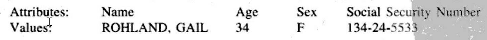
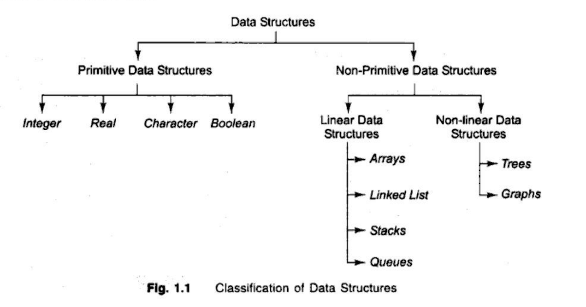

## 1. Core Definitions and Architectural Context

??? "Core Definitions and Architectural Context"

    At the university level, we define these terms based on their hierarchy in the **Data Abstraction Layer**, moving from raw bits to complex logical organized structures.

    ### A. Data (The Atomic Unit)
    **Data** is a raw, unorganized representation of facts, concepts, or instructions in a formalized manner suitable for communication or processing. In C, data is always typed. It represents the smallest unit of information that can be manipulated by a program.
    * **Implementation Note:** In C, this corresponds to **Primitive Data Types** like `int`, `char`, or `float`. A single `int x = 10;` is a data item occupying 4 bytes of memory.

    ### B. Entity (The Conceptual Object)
    An **Entity** is a "thing" in the real world that has an independent existence and about which we collect data. It is a logical concept rather than a physical one.
    * **Example:** A "Student," "Bank Account," or "Sensor Node."
    * **Attributes:** An entity is defined by its attributes (e.g., a Student has a Name, Roll Number, and GPA) or properties which may be assigned values.
    

    ### C. Record (The Logical Grouping)
    A **Record** is a collection of related data items (attributes) that represent a single instance of an entity. It treats multiple data types as a single logical unit.
    * **C Implementation:** This is implemented using the `struct` keyword.
        ```c
        struct Student {
            int roll_no;       // Data item 1
            char name[50];     // Data item 2
            float gpa;         // Data item 3
        }; // This entire structure defines a Record
        ```

    ### D. Data Structure (The Organizational Framework)
    A **Data Structure** is a specialized format for organizing, processing, retrieving, and storing data so that operations (like searching, sorting, or inserting) can be performed efficiently. It defines the **relationship** between data elements and the **operations** allowed on them.
    * **Key Distinction:** While a Record groups data, a Data Structure (like a Linked List or Hash Table) defines how multiple records are stored and accessed in memory.

    ---

    ## 2. The Relationship Hierarchy

    To secure high marks, you must demonstrate how these terms relate to one another in a system.

    | Term | Level | C Implementation Example |
    | :--- | :--- | :--- |
    | **Data** | Atomic | `int age = 20;` |
    | **Entity** | Conceptual | The concept of a "User" |
    | **Record** | Aggregate | `struct User { int id; char name[20]; };` |
    | **Data Structure** | Organizational | `struct User database[100];` (An Array of Records) |

    ---

    ## 3. Classification of Data Structures
    
