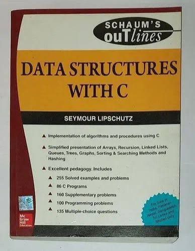
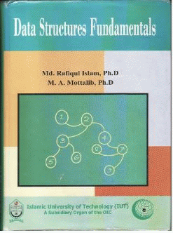

# Data Structure: Class Notes

## Referred Book by  Sir



## Stack
??? "Stack"

    ```c
        #include <stdio.h>

        int arr[5];
        int top = 0;

        /* Function to check if stack is full */
        int isFull() {
            if (top == 5) {
                return 1;   // true
            }
            return 0;       // false
        }

        /* Function to check if stack is empty */
        int isEmpty() {
            if (top == 0) {
                return 1;   // true
            }
            return 0;       // false
        }

        /* Push operation */
        void push(int item) {
            if (isFull()) {
                printf("Stack is full\n");
            } else {
                printf("Now inserting %d\n", item);
                arr[top] = item;
                top++;
            }
        }

        /* Pop operation */
        void pop() {
            if (isEmpty()) {
                printf("No data in stack\n");
            } else {
                top--;
                printf("%d\n", arr[top]);
            }
        }

        int main() {
            push(10);
            push(7);
            push(5);
            push(11);
            push(122);
            push(1);

            pop();
            pop();
            pop();
            pop();
            pop();
            pop();

            return 0;
        }
    ```


## 
## 
## 
## 