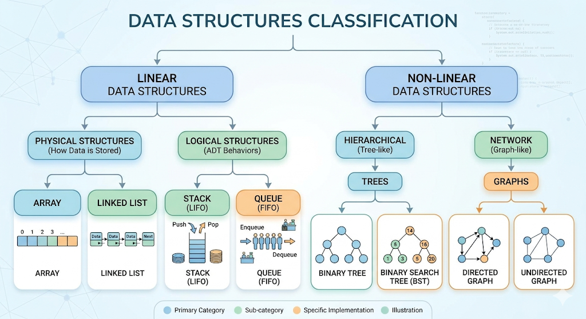

**Omni-Classification** of Data Structures:

---

### Tier 1: The Building Blocks (Primitives)

These are the atomic units provided by the hardware/CPU. They don't "hold" other data; they *are* the data.

* **Integer, Float, Char, Boolean.**
* **Pointers/References:** (The "glue" used to build complex structures).

---

### Tier 2: The Physical Containers (Implementation Layer)

These define how data is physically arranged in your RAM. Every complex structure in Tier 3 and 4 **must** be built using one of these.

| Structure | Memory Layout | Key Characteristic |
| --- | --- | --- |
| **Array** | **Contiguous** | One solid block. Fast access via index, but hard to resize. |
| **Linked List** | **Non-Contiguous** | Scattered nodes connected by pointers. Easy to grow, slow to search. |

---

### Tier 3: The Logical Rules (Linear ADTs)

These are **Linear** because the data follows a single sequence (one-after-another). They are just **rules** applied to Tier 2 containers.

* **Stack (LIFO):** Implementation: `Array-based Stack` or `Linked-List Stack`.
* **Queue (FIFO):** Implementation: `Array-based Queue` or `Linked-List Queue`.
* **List/Vector:** A dynamic version of an array.

---

### Tier 4: The Hierarchical & Relationship Models (Non-Linear ADTs)

These are **Non-Linear** because one element can connect to multiple other elements. They represent complex relationships.

#### A) Trees (Hierarchical)

Data is organized in a parent-child relationship.

* **Binary Tree / BST:** For fast searching.
* **Heaps:** For priority (Priority Queues).
* **Tries:** For dictionary/string searching.
* *Note:* Trees are usually implemented using **Linked Nodes** (Physical Tier 2).

#### B) Graphs (Network/Relational)

Data is organized as nodes (vertices) and connections (edges). No strict hierarchy.

* **Directed/Undirected Graphs:** Representing maps, social networks, or circuits.
* *Implementation:* Graphs are represented using an **Adjacency Matrix** (Physical Tier 2: 2D Array) or an **Adjacency List** (Physical Tier 2: Array of Linked Lists).

---

### Tier 5: The "Abstracted" Collections (Specialized ADTs)

These are high-level concepts that often combine multiple tiers to solve specific problems.

* **Hash Table / Dictionary:** Uses an `Array` + a `Hash Function` to provide $O(1)$ access.
* **Set:** A collection of unique items (can be implemented via `Hash Table` or `Tree`).

---

### The Big Picture Summary

| Category | Type | The "What" (Examples) | The "How" (Realization) |
| --- | --- | --- | --- |
| **Linear** | **Physical** | Array, Linked List | Direct Memory Mapping. |
| **Linear** | **Logical (ADT)** | Stack, Queue | Rules applied to Arrays/LL. |
| **Non-Linear** | **Hierarchical** | Tree, Heap | Parent-Child pointers. |
| **Non-Linear** | **Relational** | Graph | Network of nodes and edges. |

### Why this solves your confusion:

When you see **"Representing a Multi-dimensional Array (Tier 2/3) using a Linked List (Tier 2) as a Stack (Tier 3),"** you are just moving between these tiers.

You are taking a **Physical Container** (Linked List), giving it the **Behavioral Rules** of a Stack, to store data that looks like a **Matrix**. It's like using **Lego Bricks** (Physical) to build a **Garage** (Logical Rule) for your **Toy Cars** (The Data).

Does this birds-eye view make the relationship between Trees, Arrays, and ADTs feel more organized?