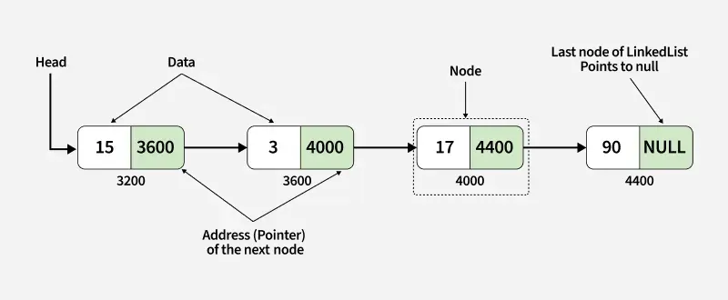
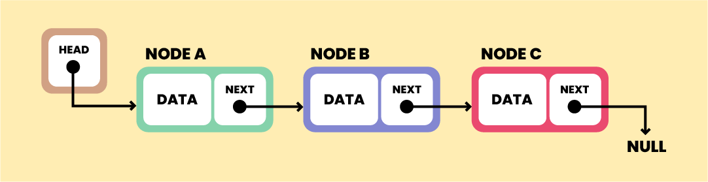

# Linked List

## **Study Notes: Linked Lists (Section 5.2)**

### **1. Definition & Structure**

A **Linked List** (or **One-Way List**) is a linear collection of data elements called **nodes**. Unlike arrays, the linear order is not defined by physical memory location but by **pointers**.

Each node is physically divided into two distinct parts:

- **Information Part:** Stores the actual data or record (e.g., Name, Address, ID).
- **Link Field (Nextpointer Field):** Stores the memory address of the next node in the sequence.

### **2. Key Components**

- **START (or NAME):** A special pointer variable that stores the address of the first node. This is the entry point of the list.
- **Null Pointer:** A special value (often denoted by **X**, **0**, or a negative number) stored in the link field of the last node. It signals the end of the list.
- **Empty List (Null List):** A list with no nodes. In this case, the `START` variable itself contains the null pointer.

### **3. Traversal Mechanism**

To access the data, we follow the pointer in `START` to reach the first node. We then use the `Nextpointer` of that node to find the second, continuing this chain until we encounter the **null pointer**.

---

## **Visual Representation Breakdown**

- **Nodes:** Represented as boxes with two compartments.
- **Arrows:** Represent the address stored in the link field pointing to the next node.
- **Terminal:** The 'X' in the final node represents the end of the data chain.
  
  

---

## **Revision Summary (Exam Quick-View)**

| Term             | Definition                                                     |
| :--------------- | :------------------------------------------------------------- |
| **Node**         | The basic unit of a linked list containing data and a pointer. |
| **Link Field**   | The part of the node that "points" to the next element.        |
| **START**        | The variable that holds the address of the first node.         |
| **Null Pointer** | An invalid address (0 or -1) marking the end of the list.      |
| **Empty List**   | A list where `START = NULL`.                                   |
