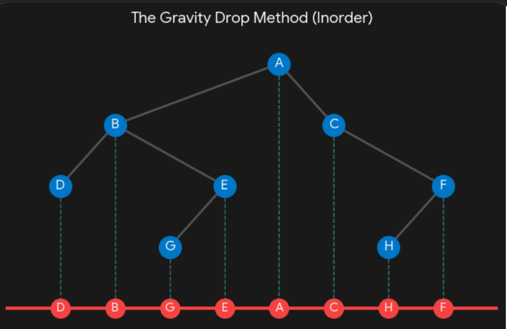
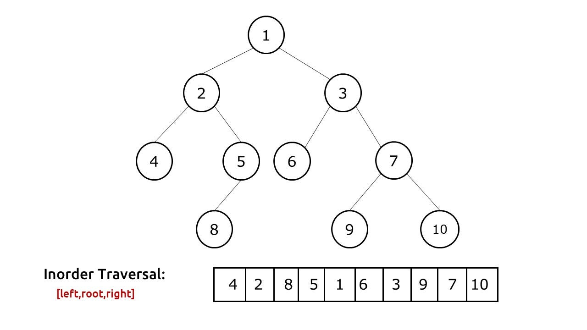

[▶️ Simplest Binary Tree Traversal trick for preorder inorder postorder](https://youtu.be/WLvU5EQVZqY)

So in summary, always go from the root in counterclockwise direction around the tree. 
 - For Pre-Order, print the nodes as you visit them for the first time. 
 - For In-Order, print the nodes only when you visit them for the second time. 
 - For Post-order, print the nodes when you visit them for the last time.

Shortcut formula:

Problem Sets:
