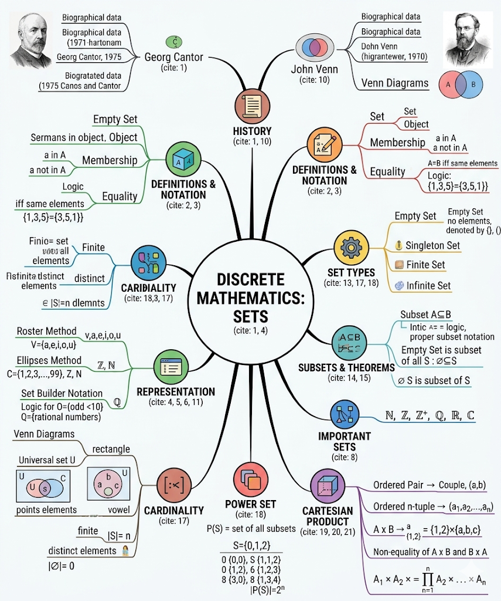
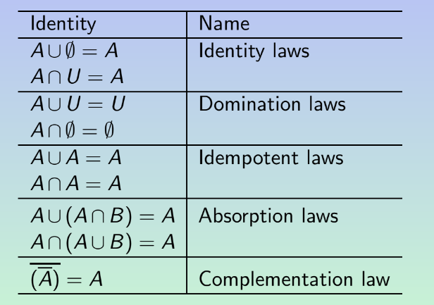
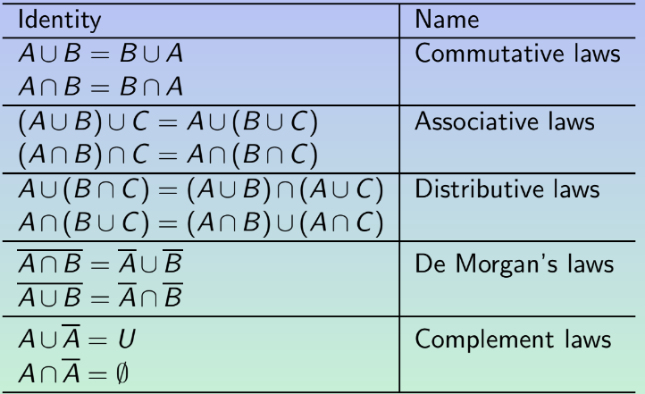
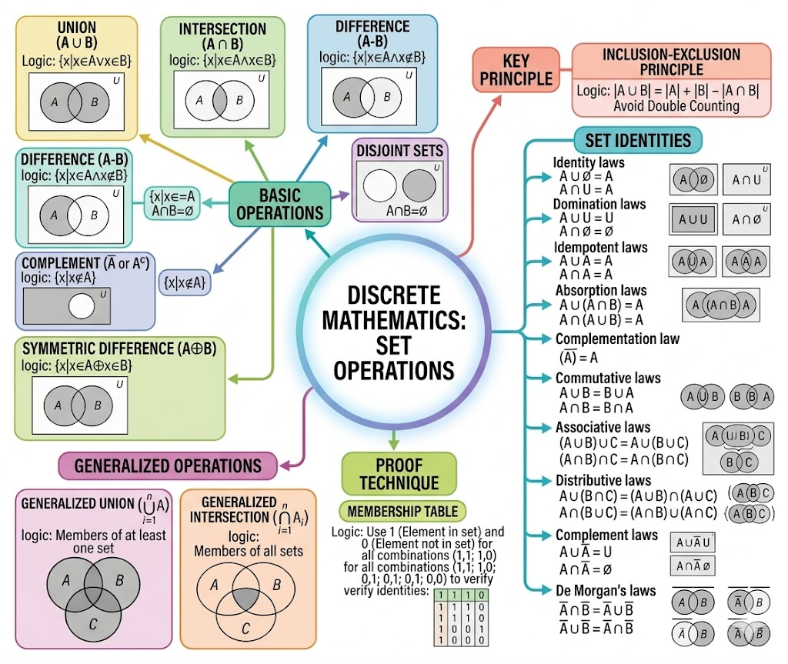

# Discrete Mathematics: Complete Exam Notes with Bangla Meanings

## 1. Historical Notes (ঐতিহাসিক টীকা)

* **Georg Ferdinand Ludwig Philipp Cantor:** Born March 3, 1845; Died January 6, 1918. He is the founder `(প্রতিষ্ঠাতা)` of set theory.

* **John Venn:** Born August 4, 1834; Died April 4, 1923. He introduced `(প্রবর্তন করেন)` Venn diagrams.

## 2. Core Definitions (মূল সংজ্ঞাসমূহ)

* **Set (সেট):** An **unordered** `(ক্রমহীন/যার কোনো নির্দিষ্ট সাজানোর নিয়ম নেই)` collection of objects, finite `(সসীম)` or infinite `(অসীম)`, that all possess `(অধিকারী হওয়া)` the same property: **membership** `(সদস্যপদ)` of the set.

* **Elements / Members (উপাদান/সদস্য):** The objects in a set. The elements are said to **belong to** `(অন্তর্ভুক্ত হওয়া)` that set, and a set is said to **contain** `(ধারণ করা)` its elements.

* **Membership Notation (সদস্যতা প্রকাশের চিহ্ন):**
* $a \in A$ denotes `(নির্দেশ করে)` that $a$ is an element of set $A$.

* $a \notin A$ denotes that $a$ is not an element of set $A$.

## 3. Methods of Describing Sets (সেট প্রকাশের পদ্ধতিসমূহ)

There are three standard ways to describe a set according to the slides:

### A. Braces / Roster Method (দ্বিতীয় বন্ধনী বা তালিকা পদ্ধতি)

Listing all elements explicitly `(স্পষ্টভাবে)` between braces `{}`.

* *Example:* The set $V$ of all vowels `(স্বরবর্ণ)` in the English alphabet: $V = \{a, e, i, o, u\}$.

### B. Ellipses Notation (উপবৃত্ত বা ডট ডট চিহ্ন `...`)

Used to describe a set without listing all members when the general pattern `(সাধারণ ধারা)` of the elements is **obvious** `(স্পষ্ট/সহজেই বোঝা যায়)`.

* *Finite Example:* Positive integers `(ধনাত্মক পূর্ণসংখ্যা)` less than 100: $C = \{1, 2, 3, \dots, 99\}$.

* *Infinite Example 1:* Natural numbers `(স্বাভাবিক সংখ্যা)`: $\mathbb{N} = \{0, 1, 2, 3, \dots\}$.

* *Infinite Example 2:* Integers `(পূর্ণসংখ্যা)`: $\mathbb{Z} = \{\dots, -2, -1, 0, 1, 2, \dots\}$.

### C. Set-Builder Notation (সেট গঠন পদ্ধতি)

We **characterize** `(বৈশিষ্ট্য নির্ধারণ করা)` all those elements in the set by stating the property or properties they must have to be members.

* *Example 1:* The set $O$ of all odd positive integers `(বিজোড় ধনাত্মক পূর্ণসংখ্যা)` less than 10:

$$O = \{x \mid (x \in \mathbb{N}) \land (x < 10) \land (x \text{ is odd})\}$$

 *(Note: $\land$ means 'and')*

* *Example 2:* The set of rational numbers `(মূলদ সংখ্যা)` $\mathbb{Q}$:

$$\mathbb{Q} = \{a/b \mid (a \in \mathbb{Z}) \land (b \in \mathbb{Z}) \land (b \neq 0)\}$$

## 4. Important Standard Sets (গুরুত্বপূর্ণ স্ট্যান্ডার্ড সেটসমূহ)

* $\mathbb{N} = \{0, 1, 2, 3, \dots\}$ : The set of **Natural numbers**. *(Note: 0 is included here)*

* $\mathbb{Z} = \{\dots, -2, -1, 0, 1, 2, \dots\}$ : The set of **Integers**.

* $\mathbb{Z}^+ = \{1, 2, 3, \dots\}$ : The set of **Positive integers**.

* $\mathbb{Q} = \{p/q \mid (p \in \mathbb{Z}) \land (q \in \mathbb{Z}) \land (q \neq 0)\}$ : The set of **Rational numbers**.

* $\mathbb{R}$ : The set of **Real numbers** `(বাস্তব সংখ্যা)`.

* $\mathbb{C}$ : The set of **Complex numbers** `(জটিল সংখ্যা)`.

## 5. Set Equality and Special Sets (সেটের সমতা এবং বিশেষ সেট)

* **Definition of Equality:** Two sets are equal if and only if `(কেবল এবং কেবল যদি)` they have the same elements. Order does not matter.

$$\forall x (x \in A \leftrightarrow x \in B)$$

 *(Note: $\forall$ means 'for all', $\leftrightarrow$ means 'if and only if')*

* *Example:* The sets $\{1, 3, 5\}$ and $\{3, 5, 1\}$ are equal.

* **Empty Set / Null Set (ফাঁকা সেট):** A special set that has **no elements**. It is **denoted by** `(চিহ্ন দ্বারা প্রকাশ করা)` $\emptyset$ or by $\{\}$.

* **Singleton (একপদী সেট):** A set that contains **exactly one** element.

## 6. Subsets (উপসেট)

* **Definition:** Set $A$ is said to be a subset of set $B$, denoted by $A \subseteq B$, if and only if every element of $A$ is also an element of $B[cite: 1]$.

$$\forall x (x \in A \rightarrow x \in B)$$

 *(Note: $\rightarrow$ means 'implies' or 'then')*

* **Proper Subset (প্রকৃত উপসেট):** When we wish to **emphasize** `(জোর দেওয়া/বিশেষভাবে বোঝানো)` that $A$ is a subset of $B$ but $A \neq B$, we write $A \subset B$ or $A \subsetneq B$.

### Two Subsets of a Non-Empty Set (দুটি অবশম্ভাবী উপসেট)

* **Theorem 1:** The empty set is a subset of all the sets ($\emptyset \subseteq S$, for any set $S$).

* **Theorem 2:** Every set is a subset of itself ($S \subseteq S$, for any set $S$).

## 7. Venn Diagrams (ভেন চিত্র)

* **Universal Set (সার্বিক সেট):** The set $U$ which contains all the objects under **consideration** `(বিবেচনাধীন)`. It is represented by a **rectangle** `(আয়তক্ষেত্র)`. It varies `(পরিবর্তন হয়)` depending on which objects are of interest.

* Inside the rectangle, **circles** or other geometrical figures `(জ্যামিতিক চিত্র)` represent sets.

* Sometimes **points** are used to represent particular `(নির্দিষ্ট)` elements.

## 8. Cardinality and Power Set (কার্ডিনালিটি এবং পাওয়ার সেট)

* **Cardinality (সেটের উপাদান সংখ্যা):** Let $S$ be a set. If there are exactly $n$ **distinct** `(স্বতন্ত্র/আলাদা আলাদা)` elements in $S$ where $n$ is a non-negative integer `(অ-ঋণাত্মক পূর্ণসংখ্যা)`, we say $S$ is a **finite set** and $n$ is the cardinality of $S$.

* It is denoted by $|S|$.

* An **infinite set** is a set that is not finite.

* The cardinality of the empty set is 0 ($|\emptyset| = 0$).

* **Power Set (শক্তি সেট):** Given a set $S$, the power set of $S$ is the **set of all the subsets** of $S$. It is denoted by $\mathcal{P}(S)$.

* *Example:* If $S = \{0, 1, 2\}$, then $\mathcal{P}(S) = \{\emptyset, \{0\}, \{1\}, \{2\}, \{0, 1\}, \{0, 2\}, \{1, 2\}, \{0, 1, 2\}\}$.

* **Formula:** If $|S| = n$, then $|\mathcal{P}(S)| = 2^n$.

## 9. Ordered $n$-tuples and Cartesian Product (ক্রমিত n-জোড় এবং কার্তেসীয় গুণজ)

### Ordered $n$-tuple (ক্রমিত n-জোড়)

* The ordered $n$-tuple $(a_1, a_2, \dots, a_n)$ is the **ordered collection** `(ক্রম সাজানো সংগ্রহ)` that has $a_1$ as its first element, $a_2$ as its second element, and $a_n$ as its $n$-th element.

* Two $n$-tuples are equal if and only if each **corresponding pair** `(অনুরূপ জোড়া)` of their elements is equal.

* We call 2-tuples **couples** or **ordered pairs** `(ক্রমজোড়)`.

### Cartesian Product of Two Sets ($A \times B$)

* The Cartesian product of $A$ and $B$, denoted by $A \times B$, is the set of all ordered pairs $(a, b)$, where $a \in A$ and $b \in B$.

$$A \times B = \{(a, b) \mid a \in A \land b \in B\}$$

* *Example:* If $A = \{1, 2\}$ and $B = \{a, b, c\}$, then $A \times B = \{(1, a), (1, b), (1, c), (2, a), (2, b), (2, c)\}$.

* *Crucial Note:* The Cartesian products $A \times B$ and $B \times A$ are, **in general, not equal** `(সাধারণত সমান হয় না)`.

### Cartesian Product of $n$ Sets ($A_1 \times A_2 \times \dots \times A_n$)

* The set of ordered $n$-tuples $(a_1, a_2, \dots, a_n)$, where $a_i$ belongs to $A_i$ for $i = 1, 2, \dots, n$.

$$A_1 \times A_2 \times \dots \times A_n = \{(a_1, a_2, \dots, a_n) \mid a_i \in A_i, \text{ for } i=1,2,\dots,n\}$$

* Some authors use the **notation** `(প্রতীক/চিহ্ন)`: $\prod_{i=1}^{n} A_i$.

Here is your structured, comprehensive exam note for **Set Operations** based exactly on your slides. Uncommon or technical words are translated into Bangla `(বাংলা)` right next to them to maximize your last-minute revision efficiency.

---

# Discrete Mathematics: Lecture Notes on Set Operations

## 1. Fundamental Set Operations (মৌলিক সেট প্রক্রিয়াসমূহ)

### A. Union of Sets (সেটের সংযোগ)

* **Definition:** The union of sets $A$ and $B$, denoted by `(চিহ্ন দ্বারা প্রকাশিত)` $A \cup B$, is the set that contains those elements that are either in $A$ or in $B$, or in both.

* **Logical Form:**

$$A \cup B = \{x \mid (x \in A) \vee (x \in B)\}$$

 *(Note: $\vee$ represents the logical 'OR' operator)*

### B. Intersection of Sets (সেটের ছেদ)

* **Definition:** The intersection of sets $A$ and $B$, denoted by $A \cap B$, is the set containing those elements that are in **both** $A$ and $B$.

* **Logical Form:**

$$A \cap B = \{x \mid (x \in A) \wedge (x \in B)\}$$

 *(Note: $\wedge$ represents the logical 'AND' operator)*

### C. Disjoint Sets (নিশ্ছেদ সেট)

* **Definition:** Two sets are called disjoint if their intersection is the empty set `(ফাঁকা সেট)`.

* **Mathematical Condition:** $A \cap B = \emptyset$.

### D. Difference of Sets (সেটের অন্তর)

* **Definition:** The difference of $A$ and $B$, denoted by $A - B$, is the set containing those elements that are in $A$ but **not** in $B$.

* **Alternative Name:** It is also called the **complement** `(পূরক)` **of $B$ with respect to $A$** `(A এর সাপেক্ষে B এর পূরক)`.

* **Logical Form:**

$$A - B = \{x \mid (x \in A) \wedge (x \notin B)\}$$

### E. Symmetric Difference of Sets (সেটের সুষম অন্তর)

* **Definition:** The symmetric difference of $A$ and $B$, denoted by $A \oplus B$, is the set containing those elements in either $A$ or $B$, **but not in both** $A$ and $B$.

* **Logical Form:**

$$A \oplus B = \{x \mid (x \in A) \oplus (x \in B)\}$$

 *(Note: $\oplus$ represents the logical 'Exclusive OR / XOR' operator)*

### F. Complement of Sets (সেটের পরম পূরক)

* **Definition:** Let $U$ be the universal set `(সার্বিক সেট)`. The complement of set $A$, denoted by $\overline{A}$ or $A^c$, is the set containing those elements that are in $U$ but not in $A$.

* **Key Property:** It is essentially the complement of $A$ with respect to $U$, meaning $U - A$.

* **Logical Form:**

$$\overline{A} = \{x \mid x \notin A\}$$

---

## 2. Principle of Inclusion-Exclusion (অন্তর্ভুক্তি-বর্জনের নীতি)

* **Core Concept:** The number of elements in the union of two sets is equal to the number of elements in the first set plus `(যোগ)` the number of elements in the second one, minus `(বিয়োগ)` the number of elements in their intersection.

* **Reasoning:** The intersection elements must be subtracted because they were **counted twice** `(দুইবার গণনা করা হয়েছিল)` when adding $|A|$ and $|B|$.

* **Theorem Formula:**

$$|A \cup B| = |A| + |B| - |A \cap B|$$

---

## 3. Set Identities (সেটের অভেদসমূহ / সূত্রাবলী)

You must memorize these laws and names perfectly for the exam:

## 4. Membership Table (সদস্যতা সারণী)

* **Purpose:** Used to consider each combination `(সমাবেশ)` of sets that an element can belong to and verify `(প্রমাণ করা)` that the set identity holds true.

* **Rules:**
* Use **1** to indicate `(নির্দেশ করতে)` that an element is **in a set**.

* Use **0** to indicate that an element is **not in a set**.

* **Example from Slides:** Verifying De Morgan's Law $\overline{A \cup B} = \overline{A} \cap \overline{B}$:

| $A$ | $B$ | $A \cup B$ | $\overline{A \cup B}$ | $\overline{A}$ | $\overline{B}$ | $\overline{A} \cap \overline{B}$ |
| --- | --- | --- | --- | --- | --- | --- |
| 1 | 1 | 1 | **0** | 0 | 0 | **0** |
| 1 | 0 | 1 | **0** | 0 | 1 | **0** |
| 0 | 1 | 1 | **0** | 1 | 0 | **0** |
| 0 | 0 | 0 | **1** | 1 | 1 | **1** |

(Since the columns for $\overline{A \cup B}$ and $\overline{A} \cap \overline{B}$ match identically, the law is verified.)

---

## 5. Generalized Operations (সাধারণীকৃত বা বহু-সেট প্রক্রিয়াকরণ)

### A. Generalized Union of Sets (সাধারণীকৃত সংযোগ)

* **Definition:** The union of a collection `(সংগ্রহ)` of sets is the set that contains those elements that are members of **at least one** `(কমপক্ষে একটি)` set in the collection.

* **Notation:**

$$A_1 \cup A_2 \cup \dots \cup A_n = \bigcup_{i=1}^{n} A_i$$

### B. Generalized Intersection of Sets (সাধারণীকৃত ছেদ)

* **Definition:** The intersection of a collection of sets is the set that contains those elements that are members of **all the sets** `(প্রত্যেকটি সেটের)` in the collection.

* **Notation:**

$$A_1 \cap A_2 \cap \dots \cap A_n = \bigcap_{i=1}^{n} A_i$$

