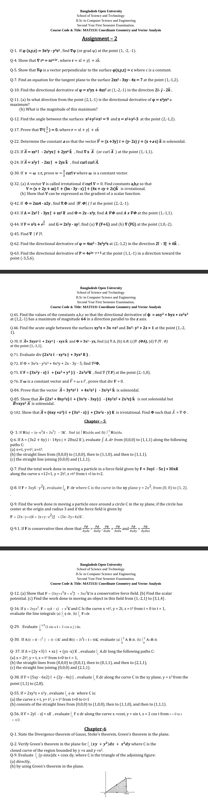

# Assignment 02 Solution:

??? "Assignment 02 Question"
    

---

**Q-1. If $\varphi(x,y,z) = 3x^2y - y^3z^2$, find $\nabla\varphi$ at the point $(1, -2, -1)$.**

**Solution**

$$\nabla\varphi = \frac{\partial\varphi}{\partial x}\hat{i} + \frac{\partial\varphi}{\partial y}\hat{j} + \frac{\partial\varphi}{\partial z}\hat{k}$$

$\dfrac{\partial\varphi}{\partial x} = 6xy, \qquad \dfrac{\partial\varphi}{\partial y} = 3x^2 - 3y^2z^2, \qquad \dfrac{\partial\varphi}{\partial z} = -2y^3z$

At $(1,\ -2,\ -1)$:

$\dfrac{\partial\varphi}{\partial x} = 6(1)(-2) = -12$

$\dfrac{\partial\varphi}{\partial y} = 3(1)^2 - 3(-2)^2(-1)^2 = 3 - 12 = -9$

$\dfrac{\partial\varphi}{\partial z} = -2(-2)^3(-1) = -2(-8)(-1) = -16$

$$\boxed{\nabla\varphi = -12\hat{i} - 9\hat{j} - 16\hat{k}}$$

---

**Q-4. Show that $\nabla r^n = nr^{n-2}\vec{r}$, where $\vec{r} = x\hat{i} + y\hat{j} + z\hat{k}$.**

**Solution**

Here $r = |\vec{r}| = \sqrt{x^2+y^2+z^2}$, so:

$$\frac{\partial r}{\partial x} = \frac{x}{r}, \qquad \frac{\partial r}{\partial y} = \frac{y}{r}, \qquad \frac{\partial r}{\partial z} = \frac{z}{r}$$

$$\nabla r^n = \frac{\partial r^n}{\partial x}\hat{i} + \frac{\partial r^n}{\partial y}\hat{j} + \frac{\partial r^n}{\partial z}\hat{k}$$

$\dfrac{\partial r^n}{\partial x} = nr^{n-1}\cdot\dfrac{\partial r}{\partial x} = nr^{n-1}\cdot\dfrac{x}{r} = nxr^{n-2}$

$\Rightarrow \dfrac{\partial r^n}{\partial y} = nyr^{n-2}, \qquad \dfrac{\partial r^n}{\partial z} = nzr^{n-2}$

$\Rightarrow \nabla r^n = nxr^{n-2}\hat{i} + nyr^{n-2}\hat{j} + nzr^{n-2}\hat{k}$

$\Rightarrow \nabla r^n = nr^{n-2}(x\hat{i}+y\hat{j}+z\hat{k})$

$$\boxed{\nabla r^n = nr^{n-2}\vec{r}} \qquad \blacksquare$$

---

**Q-5. Show that $\nabla\varphi$ is a vector perpendicular to the surface $\varphi(x,y,z) = c$ where $c$ is a constant.**

**Solution**

Let $\vec{r}(t) = x(t)\hat{i} + y(t)\hat{j} + z(t)\hat{k}$ be any arbitrary curve lying on the surface $\varphi(x,y,z) = c$.

Since every point of the curve lies on the surface:

$$\varphi(x(t),\ y(t),\ z(t)) = c$$

Differentiating both sides with respect to $t$:

$$\frac{\partial\varphi}{\partial x}\frac{dx}{dt} + \frac{\partial\varphi}{\partial y}\frac{dy}{dt} + \frac{\partial\varphi}{\partial z}\frac{dz}{dt} = 0$$

$\Rightarrow \nabla\varphi \cdot \dfrac{d\vec{r}}{dt} = 0$

Since $\dfrac{d\vec{r}}{dt}$ is tangent to the curve lying on the surface, and this holds for **any** curve on the surface, $\nabla\varphi$ is perpendicular to every tangent vector on the surface.

$$\boxed{\therefore\ \nabla\varphi \text{ is perpendicular to the surface } \varphi(x,y,z) = c} \qquad \blacksquare$$

---

**Q-7. Find the equation of the tangent plane to the surface $2xz^2 - 3xy - 4x = 7$ at the point $(1,\ -1,\ 2)$.**

**Solution**

Let $F(x,y,z) = 2xz^2 - 3xy - 4x - 7 = 0$

The normal to the surface is $\nabla F$:

$$\nabla F = \frac{\partial F}{\partial x}\hat{i} + \frac{\partial F}{\partial y}\hat{j} + \frac{\partial F}{\partial z}\hat{k}$$

$\dfrac{\partial F}{\partial x} = 2z^2 - 3y - 4, \qquad \dfrac{\partial F}{\partial y} = -3x, \qquad \dfrac{\partial F}{\partial z} = 4xz$

At $(1,\ -1,\ 2)$:

$\dfrac{\partial F}{\partial x} = 2(4) - 3(-1) - 4 = 8+3-4 = 7$

$\dfrac{\partial F}{\partial y} = -3(1) = -3$

$\dfrac{\partial F}{\partial z} = 4(1)(2) = 8$

The tangent plane equation is:

$7(x-1) - 3(y+1) + 8(z-2) = 0$

$\Rightarrow 7x - 7 - 3y - 3 + 8z - 16 = 0$

$$\boxed{7x - 3y + 8z = 26}$$

---

**Q-10. Find the directional derivative of $\varphi = x^2yz + 4xz^2$ at $(1,\ -2,\ -1)$ in the direction $2\hat{i} - \hat{j} - 2\hat{k}$.**

**Solution**

$$\nabla\varphi = \frac{\partial\varphi}{\partial x}\hat{i} + \frac{\partial\varphi}{\partial y}\hat{j} + \frac{\partial\varphi}{\partial z}\hat{k}$$

$\dfrac{\partial\varphi}{\partial x} = 2xyz + 4z^2, \qquad \dfrac{\partial\varphi}{\partial y} = x^2z, \qquad \dfrac{\partial\varphi}{\partial z} = x^2y + 8xz$

At $(1,\ -2,\ -1)$:

$\dfrac{\partial\varphi}{\partial x} = 2(1)(-2)(-1) + 4(1) = 4+4 = 8$

$\dfrac{\partial\varphi}{\partial y} = (1)^2(-1) = -1$

$\dfrac{\partial\varphi}{\partial z} = (1)^2(-2) + 8(1)(-1) = -2-8 = -10$

$\Rightarrow \nabla\varphi = 8\hat{i} - \hat{j} - 10\hat{k}$

Unit vector in the direction $\vec{a} = 2\hat{i} - \hat{j} - 2\hat{k}$:

$|\vec{a}| = \sqrt{4+1+4} = \sqrt{9} = 3$

$\Rightarrow \hat{a} = \dfrac{2\hat{i} - \hat{j} - 2\hat{k}}{3}$

Directional derivative:

$D_{\hat{a}}\varphi = \nabla\varphi \cdot \hat{a} = (8\hat{i} - \hat{j} - 10\hat{k}) \cdot \dfrac{(2\hat{i}-\hat{j}-2\hat{k})}{3}$

$\Rightarrow = \dfrac{(8)(2)+(-1)(-1)+(-10)(-2)}{3}$

$\Rightarrow = \dfrac{16+1+20}{3}$

$$\boxed{D_{\hat{a}}\varphi = \dfrac{37}{3}}$$