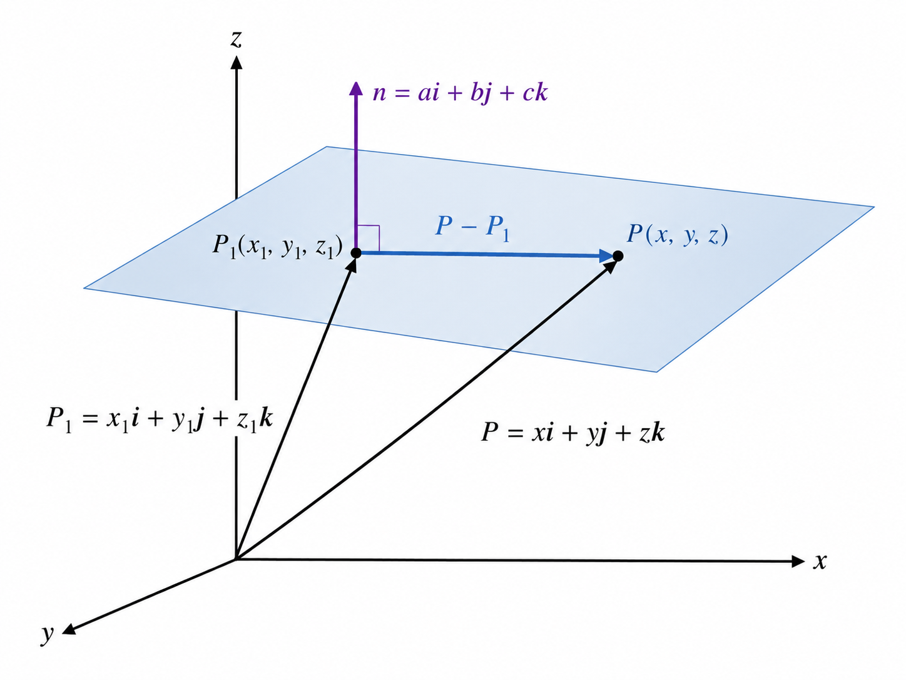

**(i) Relation between Cartesian Coordinates and Polar Coordinates**

Let `P` be any point in a plane. In Cartesian coordinates, the point is written as:

$$
P(x, y)
$$

Here, `x` is the distance along the x-axis and `y` is the distance along the y-axis.

In polar coordinates, the same point is written as:

$$
P(r, \theta)
$$

Here, `r` is the distance of the point from the origin and `\theta` is the angle made with the positive x-axis.

From the right-angled triangle, we get:

$$
x = r\cos\theta
$$

and

$$
y = r\sin\theta
$$

So, the relation from polar coordinates to Cartesian coordinates is:

$$
\boxed{x = r\cos\theta,\quad y = r\sin\theta}
$$

Again, by using Pythagoras theorem:

$$
r^2 = x^2 + y^2
$$

So,

$$
r = \sqrt{x^2 + y^2}
$$

Also,

$$
\tan\theta = \frac{y}{x}
$$

Therefore,

$$
\theta = \tan^{-1}\left(\frac{y}{x}\right)
$$

So, the relation from Cartesian coordinates to polar coordinates is:

$$
\boxed{r = \sqrt{x^2 + y^2},\quad \theta = \tan^{-1}\left(\frac{y}{x}\right)}
$$

Hence, these formulas show the relation between Cartesian coordinates and polar coordinates.


**(ii) Find the area of pentagon whose vertices are (−5, −2),(−2,5),(2,7),(5,1),(2,−4).**

**Solution:**
Let the coordinates of the vertices of the pentagon be defined as follows:

* $A(x_1, y_1) = (-5, -2)$
* $B(x_2, y_2) = (-2, 5)$
* $C(x_3, y_3) = (2, 7)$
* $D(x_4, y_4) = (5, 1)$
* $E(x_5, y_5) = (2, -4)$

By Gauss's Area Formula (The Shoelace Formula) for a 5-sided polygon:

$$\text{Area} = \frac{1}{2} \Big| (x_1y_2 + x_2y_3 + x_3y_4 + x_4y_5 + x_5y_1) - (y_1x_2 + y_2x_3 + y_3x_4 + y_4x_5 + y_5x_1) \Big|$$

Substituting the respective coordinate values into the formula:

$$\text{Area} = \frac{1}{2} \Big| \big[(-5)(5) + (-2)(7) + (2)(1) + (5)(-4) + (2)(-2)\big] - \big[(-2)(-2) + (5)(2) + (7)(5) + (1)(2) + (-4)(-5)\big] \Big|$$

Evaluating the products within the first group:

$$\text{Sum}_1 = -25 - 14 + 2 - 20 - 4$$

$$\text{Sum}_1 = -61$$

Evaluating the products within the second group:

$$\text{Sum}_2 = 4 + 10 + 35 + 2 + 20$$

$$\text{Sum}_2 = 71$$

Substituting $\text{Sum}_1$ and $\text{Sum}_2$ back into the absolute value expression:

$$\text{Area} = \frac{1}{2} \Big| -61 - 71 \Big|$$

$$\text{Area} = \frac{1}{2} \Big| -132 \Big|$$

$$\text{Area} = \frac{1}{2} \times 132$$

$$\text{Area} = 66$$

The calculated area of the given pentagon is **$66\text{ units}^2$**.


**1(iii) For what value of k the points (2, 3), (−4,−6) and (𝑘,12) are collinear.**

**Solution:**

For three points $A(x_1, y_1)$, $B(x_2, y_2)$, and $C(x_3, y_3)$ to be collinear, the slope of the line segment $AB$ must be equal to the slope of the line segment $BC$.

Let the given coordinates be assigned as:

* $A(x_1, y_1) = (2, 3)$
* $B(x_2, y_2) = (-4, -6)$
* $C(x_3, y_3) = (k, 12)$


The gradient formula between two points is defined as:


$$m = \frac{y_2 - y_1}{x_2 - x_1}$$

Substituting the coordinates of points $A$ and $B$:


$$m_{AB} = \frac{-6 - 3}{-4 - 2}$$

$$m_{AB} = \frac{-9}{-6}$$

$$m_{AB} = \frac{3}{2}$$

Substituting the coordinates of points $B$ and $C$:


$$m_{BC} = \frac{12 - (-6)}{k - (-4)}$$

$$m_{BC} = \frac{12 + 6}{k + 4}$$

$$m_{BC} = \frac{18}{k + 4}$$

Under the condition of collinearity:


$$m_{AB} = m_{BC}$$

$$\frac{3}{2} = \frac{18}{k + 4}$$

Applying cross-multiplication:


$$3(k + 4) = 18 \times 2$$

Expanding the left side of the equation:


$$3k + 12 = 36$$

Isolating the variable term by subtracting $12$ from both sides:


$$3k = 36 - 12$$

$$3k = 24$$

Solving for $k$ by dividing both sides by $3$:


$$k = \frac{24}{3}$$

$$k = 8$$


The value of $k$ that satisfies the condition for the points to be collinear is **$8$**.


**(iv) Find the equation of two lines passing through (−5,6) (a) parallel and (b)perpendicular to 7𝑥 −8𝑦 =9**


Given line is:

$$
7x-8y=9
$$

First, write it in slope-intercept form.

$$
7x-8y=9
$$

$$
-8y=9-7x
$$

$$
8y=7x-9
$$

$$
y=\frac{7}{8}x-\frac{9}{8}
$$

So, the slope of the given line is:

$$
m=\frac{7}{8}
$$


 (a) Equation of the parallel line

Parallel lines have the same slope.

So,

$$
m=\frac{7}{8}
$$

The line passes through:

$$
(-5,6)
$$

Using point-slope form:

$$
y-y_1=m(x-x_1)
$$

$$
y-6=\frac{7}{8}(x-(-5))
$$

$$
y-6=\frac{7}{8}(x+5)
$$

Now multiply both sides by (8):

$$
8(y-6)=7(x+5)
$$

$$
8y-48=7x+35
$$

$$
8y=7x+83
$$

$$
7x-8y+83=0
$$

Therefore, the equation of the parallel line is:

$$
\boxed{7x-8y+83=0}
$$


(b) Equation of the perpendicular line

The slope of the given line is:

$$
m=\frac{7}{8}
$$

So, the slope of the perpendicular line is the negative reciprocal:

$$
m=-\frac{8}{7}
$$

The line passes through:

$$
(-5,6)
$$

Using point-slope form:

$$
y-y_1=m(x-x_1)
$$

$$
y-6=-\frac{8}{7}(x-(-5))
$$

$$
y-6=-\frac{8}{7}(x+5)
$$

Now multiply both sides by (7):

$$
7(y-6)=-8(x+5)
$$

$$
7y-42=-8x-40
$$

$$
7y=-8x+2
$$

$$
8x+7y-2=0
$$

Therefore, the equation of the perpendicular line is:

$$
\boxed{8x+7y-2=0}
$$


**(v) Determine the equation of the bisector of the angle between the lines  3𝑥 − 4𝑦 + 12 = 0 and 12𝑥 +5𝑦−3=0.**

**Solution:**

The equations of the angle bisectors between two intersecting lines $A_1x + B_1y + C_1 = 0$ and $A_2x + B_2y + C_2 = 0$ are given by the formula:


$$\frac{A_1x + B_1y + C_1}{\sqrt{A_1^2 + B_1^2}} = \pm \frac{A_2x + B_2y + C_2}{\sqrt{A_2^2 + B_2^2}}$$

Given the line equations:

* Line 1: $3x - 4y + 12 = 0$ (where $A_1 = 3$, $B_1 = -4$, $C_1 = 12$)
* Line 2: $12x + 5y - 3 = 0$ (where $A_2 = 12$, $B_2 = 5$, $C_2 = -3$)

Substituting these values into the formula:


$$\frac{3x - 4y + 12}{\sqrt{3^2 + (-4)^2}} = \pm \frac{12x + 5y - 3}{\sqrt{12^2 + 5^2}}$$

$\implies \frac{3x - 4y + 12}{\sqrt{9 + 16}} = \pm \frac{12x + 5y - 3}{\sqrt{144 + 25}}$

$\implies \frac{3x - 4y + 12}{\sqrt{25}} = \pm \frac{12x + 5y - 3}{\sqrt{169}}$

$\implies \frac{3x - 4y + 12}{5} = \pm \frac{12x + 5y - 3}{13}$

Applying cross-multiplication:
$\implies 13(3x - 4y + 12) = \pm 5(12x + 5y - 3)$

$\implies 39x - 52y + 156 = \pm (60x + 25y - 15)$

To find both bisectors, we separate this into two cases using the positive and negative signs.

**Case 1: Taking the positive sign (+)**


$$39x - 52y + 156 = 60x + 25y - 15$$

$\implies 0 = (60x - 39x) + (25y + 52y) - 15 - 156$

$\implies 21x + 77y - 171 = 0$

**Case 2: Taking the negative sign (-)**


$$39x - 52y + 156 = -(60x + 25y - 15)$$

$\implies 39x - 52y + 156 = -60x - 25y + 15$

$\implies (39x + 60x) - (52y - 25y) + 156 - 15 = 0$

$\implies 99x - 27y + 141 = 0$

Dividing the entire equation by $3$ to simplify:
$\implies 33x - 9y + 47 = 0$

The equations of the angle bisectors between the given lines are **$21x + 77y - 171 = 0$** and **$33x - 9y + 47 = 0$**. (Ans:)


**1(vi)Find the area of the triangle formed by the lines $2x + y - 3 = 0$, $3x + 2y - 1 = 0$, and $2x + 3y + 4 = 0$.**

 **Solution:**

To find the area of the triangle, we must first determine the coordinates of its vertices by finding the intersection points of the three lines taken in pairs.

Let the given lines be defined as:

* Line 1: $2x + y = 3$
* Line 2: $3x + 2y = 1$
* Line 3: $2x + 3y = -4$

From Line 1, express $y$ in terms of $x$:


$$y = 3 - 2x$$

Substitute this expression into Line 2:


$$3x + 2(3 - 2x) = 1$$

$\implies 3x + 6 - 4x = 1$

$\implies -x + 6 = 1$

$\implies -x = -5$

$\implies x = 5$

Substitute $x = 5$ back to find $y$:


$$y = 3 - 2(5) = -7$$

Thus, Vertex $A = (5, -7)$.

Multiply Line 2 by $3$ and Line 3 by $2$ to align the $y$-coefficients:


$$\text{Line 2} \times 3 \implies 9x + 6y = 3$$

$$\text{Line 3} \times 2 \implies 4x + 6y = -8$$

Subtracting the two equations:


$$(9x - 4x) + (6y - 6y) = 3 - (-8)$$

$\implies 5x = 11$

$\implies x = \frac{11}{5}$

Substitute $x = \frac{11}{5}$ into Line 2:


$$3\left(\frac{11}{5}\right) + 2y = 1$$

$\implies \frac{33}{5} + 2y = 1$

$\implies 2y = 1 - \frac{33}{5}$

$\implies 2y = -\frac{28}{5}$

$\implies y = -\frac{14}{5}$

Thus, Vertex $B = \left(\frac{11}{5}, -\frac{14}{5}\right)$.

Subtract Line 3 from Line 1:


$$(2x + y) - (2x + 3y) = 3 - (-4)$$

$\implies -2y = 7$

$\implies y = -\frac{7}{2}$

Substitute $y = -\frac{7}{2}$ into Line 1:


$$2x + \left(-\frac{7}{2}\right) = 3$$

$\implies 2x = 3 + \frac{7}{2}$

$\implies 2x = \frac{13}{2}$

$\implies x = \frac{13}{4}$

Thus, Vertex $C = \left(\frac{13}{4}, -\frac{7}{2}\right)$.

Using the vertex coordinates $A(5, -7)$, $B\left(\frac{11}{5}, -\frac{14}{5}\right)$, and $C\left(\frac{13}{4}, -\frac{7}{2}\right)$, the area is calculated using the determinant formula:

$$\text{Area} = \pm \frac{1}{2} \begin{vmatrix} x_1 & y_1 & 1 \\ x_2 & y_2 & 1 \\ x_3 & y_3 & 1 \end{vmatrix}$$

Substituting our coordinate values:

$$\text{Area} = \pm \frac{1}{2} \begin{vmatrix} 5 & -7 & 1 \\ \frac{11}{5} & -\frac{14}{5} & 1 \\ \frac{13}{4} & -\frac{7}{2} & 1 \end{vmatrix}$$

Expanding the determinant along the first row:

$$\implies \text{Area} = \pm \frac{1}{2} \left[ 5 \begin{vmatrix} -\frac{14}{5} & 1 \\ -\frac{7}{2} & 1 \end{vmatrix} - (-7) \begin{vmatrix} \frac{11}{5} & 1 \\ \frac{13}{4} & 1 \end{vmatrix} + 1 \begin{vmatrix} \frac{11}{5} & -\frac{14}{5} \\ \frac{13}{4} & -\frac{7}{2} \end{vmatrix} \right]$$

Evaluating the $2 \times 2$ matrix blocks:

$$\implies \text{Area} = \pm \frac{1}{2} \left[ 5 \left( -\frac{14}{5} - \left(-\frac{7}{2}\right) \right) + 7 \left( \frac{11}{5} - \frac{13}{4} \right) + 1 \left( \left(\frac{11}{5}\right)\left(-\frac{7}{2}\right) - \left(-\frac{14}{5}\right)\left(\frac{13}{4}\right) \right) \right]$$

$$\implies \text{Area} = \pm \frac{1}{2} \left[ 5 \left( -\frac{28}{10} + \frac{35}{10} \right) + 7 \left( \frac{44 - 65}{20} \right) + 1 \left( -\frac{77}{10} + \frac{182}{20} \right) \right]$$

$$\implies \text{Area} = \pm \frac{1}{2} \left[ 5 \left( \frac{7}{10} \right) + 7 \left( -\frac{21}{20} \right) + 1 \left( -\frac{154}{20} + \frac{182}{20} \right) \right]$$

$$\implies \text{Area} = \pm \frac{1}{2} \left[ \frac{35}{10} - \frac{147}{20} + \frac{28}{20} \right]$$

Converting fractions to a common denominator of 20:

$$\implies \text{Area} = \pm \frac{1}{2} \left[ \frac{70}{20} - \frac{147}{20} + \frac{28}{20} \right]$$

$$\implies \text{Area} = \pm \frac{1}{2} \left[ \frac{70 - 147 + 28}{20} \right]$$

$$\implies \text{Area} = \pm \frac{1}{2} \left[ -\frac{49}{20} \right]$$

Choosing the negative sign to yield a positive area magnitude:

$$\implies \text{Area} = \frac{49}{40}$$

**Conclusion:**
The area of the triangle formed by the given lines is **$\frac{49}{40}\text{ units}^2$** (or **$1.225\text{ units}^2$**).

**1(vii) Show that the area of the triangle formed by the straight lines $y - 2x = 0$, $y - 3x = 0$, and $y = 5x + 4$ is $\frac{4}{3}$.**


 **Solution:**

To find the area of the triangle, we determine the intersection coordinates of the three boundary lines taken in pairs.

Let the given lines be defined as:

* Line 1: $y = 2x$
* Line 2: $y = 3x$
* Line 3: $y = 5x + 4$

 **Intersection of Line 1 and Line 2 (Vertex A)**

Equating Line 1 and Line 2:


$$2x = 3x$$

$\implies 3x - 2x = 0$

$\implies x = 0$

Substituting $x = 0$ into Line 1:


$$y = 2(0) = 0$$

Thus, Vertex $A = (0, 0)$.

 **Intersection of Line 2 and Line 3 (Vertex B)**

Equating Line 2 and Line 3:


$$3x = 5x + 4$$

$\implies 3x - 5x = 4$

$\implies -2x = 4$

$\implies x = -2$

Substituting $x = -2$ into Line 2:


$$y = 3(-2) = -6$$

Thus, Vertex $B = (-2, -6)$.

**Intersection of Line 3 and Line 1 (Vertex C)**

Equating Line 3 and Line 1:


$$5x + 4 = 2x$$

$\implies 5x - 2x = -4$

$\implies 3x = -4$

$\implies x = -\frac{4}{3}$

Substituting $x = -\frac{4}{3}$ into Line 1:


$$y = 2\left(-\frac{4}{3}\right) = -\frac{8}{3}$$

Thus, Vertex $C = \left(-\frac{4}{3}, -\frac{8}{3}\right)$.

**Calculation of Area using Determinant Formula**

Using the coordinates $A(0, 0)$, $B(-2, -6)$, and $C\left(-\frac{4}{3}, -\frac{8}{3}\right)$, the area is given by:

$$\text{Area} = \pm \frac{1}{2} \begin{vmatrix} x_1 & y_1 & 1 \\ x_2 & y_2 & 1 \\ x_3 & y_3 & 1 \end{vmatrix}$$

Substituting the vertex coordinates:

$$\text{Area} = \pm \frac{1}{2} \begin{vmatrix} 0 & 0 & 1 \\ -2 & -6 & 1 \\ -\frac{4}{3} & -\frac{8}{3} & 1 \end{vmatrix}$$

Expanding the determinant along the first row:

$$\implies \text{Area} = \pm \frac{1}{2} \left[ 0 - 0 + 1 \begin{vmatrix} -2 & -6 \\ -\frac{4}{3} & -\frac{8}{3} \end{vmatrix} \right]$$

Evaluating the remaining $2 \times 2$ determinant:

$$\implies \text{Area} = \pm \frac{1}{2} \left[ 1 \left( (-2)\left(-\frac{8}{3}\right) - (-6)\left(-\frac{4}{3}\right) \right) \right]$$

$$\implies \text{Area} = \pm \frac{1}{2} \left[ \frac{16}{3} - \frac{24}{3} \right]$$

$$\implies \text{Area} = \pm \frac{1}{2} \left[ -\frac{8}{3} \right]$$

Choosing the negative sign to yield a positive area value:

$$\implies \text{Area} = \frac{1}{2} \times \frac{8}{3}$$

$$\implies \text{Area} = \frac{4}{3}$$

**Conclusion:**
The area of the triangle formed by the given straight lines is **$\frac{4}{3}\text{ units}^2$**, as required.


**1(viii) Discuss about change of origin (Transformation of axes).**


 **Solution:**

Transformation of axes by changing the origin (also known as translation of axes) is a method used in coordinate geometry to shift the origin $(0,0)$ to a new point $(h, k)$ while keeping the direction of the coordinate axes unchanged (parallel to the original axes).

Let the old coordinate axes be $OX$ and $OY$ with the original origin at $O(0,0)$.
Let the new origin be shifted to a point $O'(h, k)$. The new parallel coordinate axes are designated as $O'X'$ and $O'Y'$.

  

Consider an arbitrary point $P$ in the plane. Let its coordinates be:

* $(x, y)$ with respect to the old reference frame $(OX, OY)$.
* $(X', Y')$ with respect to the new reference frame $(O'X', O'Y')$.

The relationship between the old coordinates and the new coordinates can be derived geometrically from the spatial shift along the respective coordinate directions:

$$x = X' + h$$

$$y = Y' + k$$

Conversely, to express the new coordinate system parameters in terms of the original coordinate data:

$$X' = x - h$$

$$Y' = y - k$$

**Application in Simplifying Equations:**

This transformation is primarily used to eliminate the linear first-degree terms ($x$ and $y$) from a second-degree polynomial expression. For instance, consider a general second-degree conic expression:

$$ax^2 + 2hxy + by^2 + 2gx + 2fy + c = 0$$

By translating the origin to the center of the conic $(h, k)$, the linear terms $2gx$ and $2fy$ vanish, reducing the complexity of the equation to its standard central geometric form.


**1(ix) Remove the first-degree terms from the equation $3x^2 + 4y^2 - 12x + 4y + 13 = 0$.**

 **Solution:**

To eliminate the first-degree terms ($x$ and $y$ terms), we shift the origin to a new point $(h, k)$ using the transformation equations:


$$x = X + h$$

$$y = Y + k$$

Substituting these transformations into the given equation:


$$3(X + h)^2 + 4(Y + k)^2 - 12(X + h) + 4(Y + k) + 13 = 0$$

Expanding each squared term:
$\implies 3(X^2 + 2hX + h^2) + 4(Y^2 + 2kY + k^2) - 12X - 12h + 4Y + 4k + 13 = 0$

$\implies 3X^2 + 6hX + 3h^2 + 4Y^2 + 8kY + 4k^2 - 12X - 12h + 4Y + 4k + 13 = 0$

Grouping the terms by the powers of $X$ and $Y$:
$\implies 3X^2 + 4Y^2 + (6h - 12)X + (8k + 4)Y + (3h^2 + 4k^2 - 12h + 4k + 13) = 0$

To remove the first-degree terms, the coefficients of $X$ and $Y$ must be set to zero:


$$6h - 12 = 0$$

$\implies 6h = 12$

$\implies h = 2$$

And for the $Y$ coefficient:


$$8k + 4 = 0$$

$\implies 8k = -4$

$\implies k = -\frac{1}{2}$$

Now, we substitute $h = 2$ and $k = -\frac{1}{2}$ into the constant term expression to find its transformed value:


$$\text{Constant} = 3(2)^2 + 4\left(-\frac{1}{2}\right)^2 - 12(2) + 4\left(-\frac{1}{2}\right) + 13$$

$\implies \text{Constant} = 3(4) + 4\left(\frac{1}{4}\right) - 24 - 2 + 13$

$\implies \text{Constant} = 12 + 1 - 24 - 2 + 13$

$\implies \text{Constant} = 26 - 26$

$\implies \text{Constant} = 0$

Substituting the values of the coefficients back into the grouped equation:


$$3X^2 + 4Y^2 + 0X + 0Y + 0 = 0$$

$\implies 3X^2 + 4Y^2 = 0$

The transformed equation with the first-degree terms removed is **$3X^2 + 4Y^2 = 0$**.


**1(x) By transforming to parallel axes through a properly chosen point $(h, k)$, prove that the equation $12x^2 - 10xy + 2y^2 + 11x - 5y + 2 = 0$ can be reduced to one containing only the terms of the second degree.**


**Solution:**

To remove the first-degree terms and the constant term, we apply a translation of axes to a new origin $(h, k)$ using the transformations:


$$x = X + h$$

$$y = Y + k$$

Substituting these into the given equation:


$$12(X + h)^2 - 10(X + h)(Y + k) + 2(Y + k)^2 + 11(X + h) - 5(Y + k) + 2 = 0$$

Expanding each term individually:
$\implies 12(X^2 + 2hX + h^2) - 10(XY + kX + hY + hk) + 2(Y^2 + 2kY + k^2) + 11X + 11h - 5Y - 5k + 2 = 0$

$\implies 12X^2 + 24hX + 12h^2 - 10XY - 10kX - 10hY - 10hk + 2Y^2 + 4kY + 2k^2 + 11X + 11h - 5Y - 5k + 2 = 0$

Grouping the expression by matching degrees of $X$ and $Y$:


$$\implies 12X^2 - 10XY + 2Y^2 + (24h - 10k + 11)X + (-10h + 4k - 5)Y + (12h^2 - 10hk + 2k^2 + 11h - 5k + 2) = 0$$

To eliminate the first-degree terms, we set the coefficients of $X$ and $Y$ to zero, establishing a system of linear equations:


$$24h - 10k + 11 = 0 \quad \text{  (Equation 1)}$$

$$-10h + 4k - 5 = 0 \quad \text{  (Equation 2)}$$

From Equation 2, we can isolate $4k$:


$$\implies 4k = 10h + 5$$

$$\implies k = \frac{10h + 5}{4}$$

Substituting this expression for $k$ into Equation 1:


$$\implies 24h - 10\left(\frac{10h + 5}{4}\right) + 11 = 0$$

$$\implies 24h - \frac{5(10h + 5)}{2} + 11 = 0$$

Multiplying the entire line by $2$ to clear the fraction:


$$\implies 48h - 50h - 25 + 22 = 0$$

$$\implies -2h - 3 = 0$$

$$\implies -2h = 3$$

$$\implies h = -\frac{3}{2}$$

Substituting $h = -\frac{3}{2}$ back into the expression for $k$:


$$\implies k = \frac{10\left(-\frac{3}{2}\right) + 5}{4}$$

$$\implies k = \frac{-15 + 5}{4}$$

$$\implies k = \frac{-10}{4}$$

$$\implies k = -\frac{5}{2}$$

Thus, the properly chosen point for shifting the origin is $(h, k) = \left(-\frac{3}{2}, -\frac{5}{2}\right)$.

Next, we evaluate the transformed constant term using these values:


$$\text{Constant} = 12\left(-\frac{3}{2}\right)^2 - 10\left(-\frac{3}{2}\right)\left(-\frac{5}{2}\right) + 2\left(-\frac{5}{2}\right)^2 + 11\left(-\frac{3}{2}\right) - 5\left(-\frac{5}{2}\right) + 2$$

$$\implies \text{Constant} = 12\left(\frac{9}{4}\right) - 10\left(\frac{15}{4}\right) + 2\left(\frac{25}{4}\right) - \frac{33}{2} + \frac{25}{2} + 2$$

$$\implies \text{Constant} = \frac{108}{4} - \frac{150}{4} + \frac{50}{4} - \frac{66}{4} + \frac{50}{4} + \frac{8}{4}$$

$$\implies \text{Constant} = \frac{108 - 150 + 50 - 66 + 50 + 8}{4}$$

$$\implies \text{Constant} = \frac{266 - 216}{4}$$

$$\implies \text{Constant} = \frac{0}{4} = 0$$

Substituting the zero values for the linear coefficients and the constant term back into our grouped equation leaves:


$$12X^2 - 10XY + 2Y^2 = 0$$

Since all first-degree terms and the constant term have been eliminated, the equation reduces down exclusively to second-degree terms, as required.


**1(xi) By transforming to parallel axes through a properly chosen point $(h, k)$, prove that the equation $2x^2 + y^2 - xy - 5x - 4y + 11 = 0$ can be reduced to one containing only the terms of the second degree.**

 **Solution:**

To eliminate the first-degree terms and the constant term, we apply a translation of axes to a new origin $(h, k)$ using the transformations:


$$x = X + h$$

$$y = Y + k$$

Substituting these expressions into the given equation:


$$2(X + h)^2 + (Y + k)^2 - (X + h)(Y + k) - 5(X + h) - 4(Y + k) + 11 = 0$$

Expanding each term individually:
$\implies 2(X^2 + 2hX + h^2) + (Y^2 + 2kY + k^2) - (XY + kX + hY + hk) - 5X - 5h - 4Y - 4k + 11 = 0$

$\implies 2X^2 + 4hX + 2h^2 + Y^2 + 2kY + k^2 - XY - kX - hY - hk - 5X - 5h - 4Y - 4k + 11 = 0$

Grouping the terms by matching powers of $X$ and $Y$:


$$\implies 2X^2 - XY + Y^2 + (4h - k - 5)X + (2k - h - 4)Y + (2h^2 + k^2 - hk - 5h - 4k + 11) = 0$$

To eliminate the first-degree linear terms, we set the coefficients of $X$ and $Y$ to zero:


$$4h - k - 5 = 0 \quad \text{  (Equation 1)}$$

$$-h + 2k - 4 = 0 \quad \text{  (Equation 2)}$$

From Equation 1, express $k$ in terms of $h$:


$$\implies k = 4h - 5$$

Substituting this into Equation 2:


$$\implies -h + 2(4h - 5) - 4 = 0$$

$$\implies -h + 8h - 10 - 4 = 0$$

$$\implies 7h - 14 = 0$$

$$\implies 7h = 14$$

$$\implies h = 2$$

Substituting $h = 2$ back to find $k$:


$$\implies k = 4(2) - 5$$

$$\implies k = 3$$

Thus, the properly chosen point for translating the origin is $(h, k) = (2, 3)$.

Next, we evaluate the transformed constant term using $h = 2$ and $k = 3$:


$$\text{Constant} = 2(2)^2 + (3)^2 - (2)(3) - 5(2) - 4(3) + 11$$

$$\implies \text{Constant} = 2(4) + 9 - 6 - 10 - 12 + 11$$

$$\implies \text{Constant} = 8 + 9 - 6 - 10 - 12 + 11$$

$$\implies \text{Constant} = 28 - 28$$

$$\implies \text{Constant} = 0$$

Substituting the calculated coefficient and constant parameters back into the grouped equation leaves:


$$2X^2 - XY + Y^2 = 0$$

Since all first-degree terms and the constant parameter drop to zero, the equation simplifies exclusively to terms of the second degree, as required.


**2(i) Prove that a homogeneous equation of second degree $ax^2 + 2hxy + by^2 = 0$ always represents a pair of straight lines (real or imaginary) passing through the origin.**

**Proof:**
Let the given homogeneous second-degree equation be:


$$ax^2 + 2hxy + by^2 = 0$$

To analyze this equation, we consider two distinct cases based on the coefficient $b$.

**Case 1: When $b \neq 0$**

Dividing the entire equation by $x^2$ (assuming $x \neq 0$):


$$a + 2h\left(\frac{y}{x}\right) + b\left(\frac{y}{x}\right)^2 = 0$$

Let $m = \frac{y}{x}$, which represents the slope of a straight line passing through the origin ($y = mx$). Substituting $m$ into the expression yields a quadratic equation in terms of $m$:


$$bm^2 + 2hm + a = 0$$

Applying the quadratic formula to solve for the roots $m_1$ and $m_2$:


$$m = \frac{-2h \pm \sqrt{(2h)^2 - 4(b)(a)}}{2b}$$

$\implies m = \frac{-2h \pm \sqrt{4h^2 - 4ab}}{2b}$

$\implies m = \frac{-2h \pm 2\sqrt{h^2 - ab}}{2b}$

$\implies m = \frac{-h \pm \sqrt{h^2 - ab}}{b}$

Thus, the two distinct gradients are:


$$m_1 = \frac{-h + \sqrt{h^2 - ab}}{b} \quad \text{and} \quad m_2 = \frac{-h - \sqrt{h^2 - ab}}{b}$$

Since the quadratic in $m$ has exactly two roots, the original equation can be factored in terms of these gradients as:


$$b(m - m_1)(m - m_2) = 0$$

Substituting $m = \frac{y}{x}$ back into this factored form:


$$b\left(\frac{y}{x} - m_1\right)\left(\frac{y}{x} - m_2\right) = 0$$

Multiplying both factors by $x$:


$$b(y - m_1x)(y - m_2x) = 0$$

This represents two individual straight lines:

1. $y - m_1x = 0$
2. $y - m_2x = 0$

Both of these equations lack a constant term, confirming they pass through the origin $(0,0)$.

The nature of these lines depends on the discriminant value $h^2 - ab$:

* If $h^2 - ab > 0$, the lines are **real and distinct**.
* If $h^2 - ab = 0$, the lines are **real and coincident** (overlapping).
* If $h^2 - ab < 0$, the lines are **imaginary** with a real intersection point at the origin.

**Case 2: When $b = 0$**

If $b = 0$, the original equation simplifies to:


$$ax^2 + 2hxy = 0$$

Factoring out $x$ from both terms:


$$x(ax + 2hy) = 0$$

This splits into two linear components:

1. $x = 0$ (the y-axis)
2. $ax + 2hy = 0$

Both equations contain no constant intercept parameters, which shows they represent a pair of straight lines that intersect at the origin $(0,0)$.


In all cases, the second-degree homogeneous equation $ax^2 + 2hxy + by^2 = 0$ represents two straight lines passing through the origin.


**2(ii) Show that the necessary condition of bisectors of the angles between the lines represented by $ax^2 + 2hxy + by^2 = 0$ is $\frac{x^2 - y^2}{a - b} = \frac{xy}{h}$.**

**Proof:**

Let the homogeneous second-degree equation represent two straight lines passing through the origin:


$$ax^2 + 2hxy + by^2 = 0$$

Let these individual lines be:

1. $y = m_1x \implies m_1x - y = 0$
2. $y = m_2x \implies m_2x - y = 0$

Thus, the combined pair equation is given by:


$$(m_1x - y)(m_2x - y) = 0$$

$\implies m_1m_2x^2 - (m_1 + m_2)xy + y^2 = 0$

Dividing our original given equation $ax^2 + 2hxy + by^2 = 0$ by $b$:


$$\implies \frac{a}{b}x^2 + \frac{2h}{b}xy + y^2 = 0$$

Comparing the coefficients of the two equations yields the sum and product of the slopes:


$$m_1 + m_2 = -\frac{2h}{b}$$

$$m_1m_2 = \frac{a}{b}$$

The equations of the angle bisectors between two lines $A_1x + B_1y = 0$ and $A_2x + B_2y = 0$ are given by:


$$\frac{m_1x - y}{\sqrt{m_1^2 + (-1)^2}} = \pm \frac{m_2x - y}{\sqrt{m_2^2 + (-1)^2}}$$

Squaring both sides to eliminate the radical sign and combine them into a joint equation:


$$\frac{(m_1x - y)^2}{m_1^2 + 1} = \frac{(m_2x - y)^2}{m_2^2 + 1}$$

$\implies (m_1^2x^2 - 2m_1xy + y^2)(m_2^2 + 1) = (m_2^2x^2 - 2m_2xy + y^2)(m_1^2 + 1)$

Expanding both sides completely:
$\implies m_1^2m_2^2x^2 + m_1^2x^2 - 2m_1m_2^2xy - 2m_1xy + m_2^2y^2 + y^2 = m_1^2m_2^2x^2 + m_2^2x^2 - 2m_1^2m_2xy - 2m_2xy + m_1^2y^2 + y^2$

Canceling out identical terms ($m_1^2m_2^2x^2$ and $y^2$) from both sides:
$\implies m_1^2x^2 - 2m_1m_2^2xy - 2m_1xy + m_2^2y^2 = m_2^2x^2 - 2m_1^2m_2xy - 2m_2xy + m_1^2y^2$

Rearranging all remaining terms to the left-hand side:
$\implies (m_1^2 - m_2^2)x^2 + (2m_1^2m_2 - 2m_1m_2^2)xy + (2m_2 - 2m_1)xy + (m_2^2 - m_1^2)y^2 = 0$

$\implies (m_1^2 - m_2^2)x^2 + 2m_1m_2(m_1 - m_2)xy - 2(m_1 - m_2)xy - (m_1^2 - m_2^2)y^2 = 0$

Factoring out $(m_1 - m_2)$ from the entire equation, noting that $m_1^2 - m_2^2 = (m_1 - m_2)(m_1 + m_2)$:
$\implies (m_1 - m_2) \Big[ (m_1 + m_2)x^2 + 2m_1m_2xy - 2xy - (m_1 + m_2)y^2 \Big] = 0$

Since $m_1 \neq m_2$ for two distinct non-coincident lines, we can divide by $(m_1 - m_2)$:
$\implies (m_1 + m_2)x^2 + 2(m_1m_2 - 1)xy - (m_1 + m_2)y^2 = 0$

Grouping the $x^2$ and $y^2$ terms together:
$\implies (m_1 + m_2)(x^2 - y^2) + 2(m_1m_2 - 1)xy = 0$

Now, substituting our relationships for the sum and product of slopes ($m_1 + m_2 = -\frac{2h}{b}$ and $m_1m_2 = \frac{a}{b}$):


$$\implies \left(-\frac{2h}{b}\right)(x^2 - y^2) + 2\left(\frac{a}{b} - 1\right)xy = 0$$

$$\implies -\frac{2h}{b}(x^2 - y^2) + 2\left(\frac{a - b}{b}\right)xy = 0$$

Multiplying through by $-\frac{b}{2}$ to simplify the denominators and signs:


$$\implies h(x^2 - y^2) - (a - b)xy = 0$$

$$\implies h(x^2 - y^2) = (a - b)xy$$

Rearranging terms to separate variables into fractional ratios:


$$\implies \frac{x^2 - y^2}{a - b} = \frac{xy}{h}$$


The joint equation representing the pair of angle bisectors matches the required necessary condition.

**Show that the necessary condition of bisectors of the angles between the lines represented by $ax^2 + 2hxy + by^2 = 0$ is $\frac{x^2 - y^2}{a - b} = \frac{xy}{h}$.**


**Solution:**

Let the homogeneous second-degree equation represent two straight lines passing through the origin:


$$ax^2 + 2hxy + by^2 = 0$$

Let these individual lines be:

1. $y = m_1x \implies m_1x - y = 0$
2. $y = m_2x \implies m_2x - y = 0$

Thus, the combined pair equation is given by:


$$(m_1x - y)(m_2x - y) = 0$$

$\implies m_1m_2x^2 - (m_1 + m_2)xy + y^2 = 0$

Dividing our original given equation $ax^2 + 2hxy + by^2 = 0$ by $b$:


$$\implies \frac{a}{b}x^2 + \frac{2h}{b}xy + y^2 = 0$$

Comparing the coefficients of the two equations yields the sum and product of the slopes:


$$m_1 + m_2 = -\frac{2h}{b}$$

$$m_1m_2 = \frac{a}{b}$$

The equations of the angle bisectors between two lines $A_1x + B_1y = 0$ and $A_2x + B_2y = 0$ are given by:


$$\frac{m_1x - y}{\sqrt{m_1^2 + (-1)^2}} = \pm \frac{m_2x - y}{\sqrt{m_2^2 + (-1)^2}}$$

Squaring both sides to eliminate the radical sign and combine them into a joint equation:


$$\frac{(m_1x - y)^2}{m_1^2 + 1} = \frac{(m_2x - y)^2}{m_2^2 + 1}$$

$\implies (m_1^2x^2 - 2m_1xy + y^2)(m_2^2 + 1) = (m_2^2x^2 - 2m_2xy + y^2)(m_1^2 + 1)$

Expanding both sides completely:
$\implies m_1^2m_2^2x^2 + m_1^2x^2 - 2m_1m_2^2xy - 2m_1xy + m_2^2y^2 + y^2 = m_1^2m_2^2x^2 + m_2^2x^2 - 2m_1^2m_2xy - 2m_2xy + m_1^2y^2 + y^2$

Canceling out identical terms ($m_1^2m_2^2x^2$ and $y^2$) from both sides:
$\implies m_1^2x^2 - 2m_1m_2^2xy - 2m_1xy + m_2^2y^2 = m_2^2x^2 - 2m_1^2m_2xy - 2m_2xy + m_1^2y^2$

Rearranging all remaining terms to the left-hand side:
$\implies (m_1^2 - m_2^2)x^2 + (2m_1^2m_2 - 2m_1m_2^2)xy + (2m_2 - 2m_1)xy + (m_2^2 - m_1^2)y^2 = 0$

$\implies (m_1^2 - m_2^2)x^2 + 2m_1m_2(m_1 - m_2)xy - 2(m_1 - m_2)xy - (m_1^2 - m_2^2)y^2 = 0$

Factoring out $(m_1 - m_2)$ from the entire equation, noting that $m_1^2 - m_2^2 = (m_1 - m_2)(m_1 + m_2)$:
$\implies (m_1 - m_2) \Big[ (m_1 + m_2)x^2 + 2m_1m_2xy - 2xy - (m_1 + m_2)y^2 \Big] = 0$

Since $m_1 \neq m_2$ for two distinct non-coincident lines, we can divide by $(m_1 - m_2)$:
$\implies (m_1 + m_2)x^2 + 2(m_1m_2 - 1)xy - (m_1 + m_2)y^2 = 0$

Grouping the $x^2$ and $y^2$ terms together:
$\implies (m_1 + m_2)(x^2 - y^2) + 2(m_1m_2 - 1)xy = 0$

Now, substituting our relationships for the sum and product of slopes ($m_1 + m_2 = -\frac{2h}{b}$ and $m_1m_2 = \frac{a}{b}$):


$$\implies \left(-\frac{2h}{b}\right)(x^2 - y^2) + 2\left(\frac{a}{b} - 1\right)xy = 0$$

$$\implies -\frac{2h}{b}(x^2 - y^2) + 2\left(\frac{a - b}{b}\right)xy = 0$$

Multiplying through by $-\frac{b}{2}$ to simplify the denominators and signs:


$$\implies h(x^2 - y^2) - (a - b)xy = 0$$

$$\implies h(x^2 - y^2) = (a - b)xy$$

Rearranging terms to separate variables into fractional ratios:


$$\implies \frac{x^2 - y^2}{a - b} = \frac{xy}{h}$$

The joint equation representing the pair of angle bisectors matches the required necessary condition.


**2(iii) Find the condition that the general equation of the second degree $ax^2 + 2hxy + by^2 + 2gx + 2fy + c = 0$ may represent a pair of straight lines.**

**Proof:**

Let the general second-degree equation representing a pair of straight lines be:


$$S(x, y) = ax^2 + 2hxy + by^2 + 2gx + 2fy + c = 0$$

If this equation represents two intersecting straight lines, they must intersect at a unique point, which we will define as $P(x_0, y_0)$.

At this specific intersection point, the partial derivatives of the function $S(x, y)$ with respect to both variables $x$ and $y$ must simultaneously vanish.

Differentiating $S(x, y)$ partially with respect to $x$:


$$\frac{\partial S}{\partial x} = 2ax + 2hy + 2g = 0$$

Evaluating at the intersection point $P(x_0, y_0)$ and dividing by $2$:


$$ax_0 + hy_0 + g = 0 \quad \text{  (Equation 1)}$$

Differentiating $S(x, y)$ partially with respect to $y$:


$$\frac{\partial S}{\partial y} = 2hx + 2by + 2f = 0$$

Evaluating at the intersection point $P(x_0, y_0)$ and dividing by $2$:


$$hx_0 + by_0 + f = 0 \quad \text{  (Equation 2)}$$

Now, the original equation $S(x, y) = 0$ must also hold true at the point $(x_0, y_0)$:


$$ax_0^2 + 2hx_0y_0 + by_0^2 + 2gx_0 + 2fy_0 + c = 0$$

We can strategically split and rearrange the terms of this equation:


$$\implies (ax_0^2 + hx_0y_0 + gx_0) + (hx_0y_0 + by_0^2 + fy_0) + (gx_0 + fy_0 + c) = 0$$

Factoring out $x_0$ from the first group and $y_0$ from the second group:


$$\implies x_0(ax_0 + hy_0 + g) + y_0(hx_0 + by_0 + f) + (gx_0 + fy_0 + c) = 0$$

From **Equation 1** and **Equation 2**, we know that $(ax_0 + hy_0 + g) = 0$ and $(hx_0 + by_0 + f) = 0$. Substituting these zeroes into the equation collapses it to:


$$x_0(0) + y_0(0) + (gx_0 + fy_0 + c) = 0$$

$$\implies gx_0 + fy_0 + c = 0 \quad \text{  (Equation 3)}$$

We now possess a system of three linear equations in terms of $x_0$ and $y_0$:

1. $ax_0 + hy_0 + g = 0$
2. $hx_0 + by_0 + f = 0$
3. $gx_0 + fy_0 + c = 0$

For this system to yield a consistent, non-trivial solution for the coordinates, the determinant of the matrix formed by their coefficients must equal zero:

$$\begin{vmatrix} a & h & g \\ h & b & f \\ g & f & c \end{vmatrix} = 0$$

Expanding this $3 \times 3$ determinant along the first row:

$$\implies a \begin{vmatrix} b & f \\ f & c \end{vmatrix} - h \begin{vmatrix} h & f \\ g & c \end{vmatrix} + g \begin{vmatrix} h & b \\ g & f \end{vmatrix} = 0$$

Evaluating the $2 \times 2$ determinants:


$$\implies a(bc - f^2) - h(hc - fg) + g(hf - bg) = 0$$

Expanding the brackets:


$$\implies abc - af^2 - ch^2 + fgh + fgh - bg^2 = 0$$

Combining the identical $fgh$ terms and rearranging:


$$\implies abc + 2fgh - af^2 - bg^2 - ch^2 = 0$$


The required condition for the general second-degree equation to represent a pair of straight lines is **$abc + 2fgh - af^2 - bg^2 - ch^2 = 0$**.


**2(iv) Prove that the equation $x^2 + 6xy + 9y^2 + 4x + 12y - 5 = 0$ represents a pair of straight lines.**

**Solution:**

The general equation of the second degree is defined as:


$$ax^2 + 2hxy + by^2 + 2gx + 2fy + c = 0$$

Comparing the given equation $x^2 + 6xy + 9y^2 + 4x + 12y - 5 = 0$ with the general form, we identify the following coefficient parameters:

* $a = 1$
* $2h = 6 \implies h = 3$
* $b = 9$
* $2g = 4 \implies g = 2$
* $2f = 12 \implies f = 6$
* $c = -5$

For a general second-degree equation to represent a pair of straight lines, the determinant of its coefficients must equal zero:

$$\Delta = \begin{vmatrix} a & h & g \\ h & b & f \\ g & f & c \end{vmatrix} = 0$$

Substituting our coefficient values into the matrix:

$$\Delta = \begin{vmatrix} 1 & 3 & 2 \\ 3 & 9 & 6 \\ 2 & 6 & -5 \end{vmatrix}$$

Expanding this $3 \times 3$ determinant along the first row:

$$\implies \Delta = 1 \begin{vmatrix} 9 & 6 \\ 6 & -5 \end{vmatrix} - 3 \begin{vmatrix} 3 & 6 \\ 2 & -5 \end{vmatrix} + 2 \begin{vmatrix} 3 & 9 \\ 2 & 6 \end{vmatrix}$$

Evaluating the individual $2 \times 2$ determinants:

$$\implies \Delta = 1 \big((9)(-5) - (6)(6)\big) - 3 \big((3)(-5) - (6)(2)\big) + 2 \big((3)(6) - (9)(2)\big)$$

$$\implies \Delta = 1 (-45 - 36) - 3 (-15 - 12) + 2 (18 - 18)$$

$$\implies \Delta = 1 (-81) - 3 (-27) + 2 (0)$$

$$\implies \Delta = -81 + 81 + 0$$

$$\implies \Delta = 0$$


Since the determinant value $\Delta = 0$, the condition for a pair of straight lines is satisfied. Therefore, the given equation represents a pair of straight lines.


**2(v) Find the angle between the lines represented by the equation $ax^2 + 2hxy + by^2 = 0$.**

**Solution:**

Let the homogeneous second-degree equation represent two straight lines passing through the origin:


$$ax^2 + 2hxy + by^2 = 0$$

Let these two straight lines be $y = m_1x$ and $y = m_2x$, where $m_1$ and $m_2$ represent their gradients. The combined equation of these lines is:


$$(m_1x - y)(m_2x - y) = 0$$

$\implies m_1m_2x^2 - (m_1 + m_2)xy + y^2 = 0$

Dividing the original given equation by $b$:


$$\implies \frac{a}{b}x^2 + \frac{2h}{b}xy + y^2 = 0$$

Comparing the coefficients of like terms between the two equations, we establish the standard relations for the sum and product of the slopes:


$$m_1 + m_2 = -\frac{2h}{b}$$

$$m_1m_2 = \frac{a}{b}$$

Let $\theta$ be the angle between the two intersecting straight lines. The standard tangent formula for the angle between two lines with gradients $m_1$ and $m_2$ is:


$$\tan \theta = \pm \frac{m_1 - m_2}{1 + m_1m_2}$$

Using the algebraic identity $(m_1 - m_2)^2 = (m_1 + m_2)^2 - 4m_1m_2$, we take the square root to express the numerator as:


$$m_1 - m_2 = \sqrt{(m_1 + m_2)^2 - 4m_1m_2}$$

Substituting our sum and product relationships into this identity:


$$\implies m_1 - m_2 = \sqrt{\left(-\frac{2h}{b}\right)^2 - 4\left(\frac{a}{b}\right)}$$

$$\implies m_1 - m_2 = \sqrt{\frac{4h^2}{b^2} - \frac{4a}{b}}$$

$$\implies m_1 - m_2 = \sqrt{\frac{4h^2 - 4ab}{b^2}}$$

$$\implies m_1 - m_2 = \frac{2\sqrt{h^2 - ab}}{b}$$

Now, substitute the expressions for $(m_1 - m_2)$ and $(m_1m_2)$ back into the tangent formula:


$$\tan \theta = \pm \frac{\frac{2\sqrt{h^2 - ab}}{b}}{1 + \frac{a}{b}}$$

Simplifying the fraction in the denominator:


$$\implies \tan \theta = \pm \frac{\frac{2\sqrt{h^2 - ab}}{b}}{\frac{a + b}{b}}$$

Canceling the common denominator $b$:


$$\implies \tan \theta = \pm \frac{2\sqrt{h^2 - ab}}{a + b}$$

Taking the absolute value to find the acute angle $\theta$ between the pair of lines:


$$\theta = \tan^{-1} \left( \left| \frac{2\sqrt{h^2 - ab}}{a + b} \right| \right)$$


The expression for the angle $\theta$ between the lines is **$\tan \theta = \left| \frac{2\sqrt{h^2 - ab}}{a + b} \right|$**.


**2(vi) If the pair of straight lines $x^2 - 2axy - y^2 = 0$ and $x^2 - 2bxy - y^2 = 0$ be such that each pair bisects the angles between the other pair, prove that $ab = -1$.**

**Solution:**

Let the first pair of straight lines be:


$$x^2 - 2axy - y^2 = 0 \quad \text{  (Equation 1)}$$

Comparing Equation 1 with the standard homogeneous second-degree equation $Ax^2 + 2Hxy + By^2 = 0$, its coefficients are:

* $A = 1$
* $2H = -2a \implies H = -a$
* $B = -1$

The standard joint equation for the angle bisectors of a pair of lines is given by the formula:


$$\frac{x^2 - y^2}{A - B} = \frac{xy}{H}$$

Substituting the coefficients of Equation 1 into the bisector formula:


$$\frac{x^2 - y^2}{1 - (-1)} = \frac{xy}{-a}$$

$\implies \frac{x^2 - y^2}{2} = \frac{xy}{-a}$

Applying cross-multiplication:
$\implies -a(x^2 - y^2) = 2xy$

$\implies -ax^2 + ay^2 = 2xy$

Rearranging all terms to one side to construct the standard homogeneous form:


$$\implies ax^2 + 2xy - ay^2 = 0 \quad \text{  (Equation 2)}$$

According to the problem statement, this angle bisector pair must be identical to the second given pair of straight lines:


$$x^2 - 2bxy - y^2 = 0 \quad \text{  (Equation 3)}$$

Since Equation 2 and Equation 3 represent the exact same pair of lines, the ratios of their corresponding coefficients must be equal:


$$\frac{a}{1} = \frac{2}{-2b} = \frac{-a}{-1}$$

Equating the first two ratios:


$$a = \frac{2}{-2b}$$

$\implies a = -\frac{1}{b}$

Multiplying both sides by $b$:
$\implies ab = -1$

The necessary condition is proven to be **$ab = -1$**.

**2 (vii) Prove that two of the lines represented by the equation $ax^4 + bx^3y + cx^2y^2 + dxy^3 + ay^4 = 0$ will bisect the angle between the other two, if $c + 6a = 0$ and $b + d = 0$.** 

**Proof:**

Let the given homogeneous fourth-degree equation represent four straight lines passing through the origin:


$$ax^4 + bx^3y + cx^2y^2 + dxy^3 + ay^4 = 0 \quad \text{  (Equation 1)}$$

According to the problem statement, two of these lines form a pair that bisects the angles between the remaining two lines.

Let the pair of lines being bisected be:


$$A_1x^2 + 2H_1xy + B_1y^2 = 0 \quad \text{  (Equation 2)}$$

The joint equation for the angle bisectors of Equation 2 is given by the standard formula:


$$\frac{x^2 - y^2}{A_1 - B_1} = \frac{xy}{H_1}$$

$$\implies H_1(x^2 - y^2) = (A_1 - B_1)xy$$

$$\implies H_1x^2 - (A_1 - B_1)xy - H_1y^2 = 0 \quad \text{  (Equation 3)}$$

Equation 3 represents the pair of lines that act as the angle bisectors. Since all four lines are combined into the single fourth-degree product expression in Equation 1, Equation 1 must be equal to the product of Equation 2 (the bisected lines) and Equation 3 (the bisector lines):

$$ax^4 + bx^3y + cx^2y^2 + dxy^3 + ay^4 \equiv (A_1x^2 + 2H_1xy + B_1y^2) \cdot \big(H_1x^2 - (A_1 - B_1)xy - H_1y^2\big)$$

To make the algebra much cleaner, let us divide both Equation 2 and Equation 3 by their respective leading coefficients so they are written in terms of standard parameters.

* Let the bisected pair be: $x^2 + 2hxy + by^2 = 0$
* Its corresponding angle bisector equation becomes: $\frac{x^2 - y^2}{1 - b} = \frac{xy}{h} \implies hx^2 - (1 - b)xy - hy^2 = 0$

Now, multiplying these two simplified second-degree pairs together:


$$\text{Product} = (x^2 + 2hxy + by^2) \cdot \big(hx^2 - (1 - b)xy - hy^2\big)$$

Expanding the right side completely by distributing the terms:


$$= x^2\big(hx^2 - (1-b)xy - hy^2\big) + 2hxy\big(hx^2 - (1-b)xy - hy^2\big) + by^2\big(hx^2 - (1-b)xy - hy^2\big)$$

$$= hx^4 - (1-b)x^3y - hx^2y^2 + 2h^2x^3y - 2h(1-b)x^2y^2 - 2h^2xy^3 + bhx^2y^2 - b(1-b)xy^3 - bhy^4$$

Grouping the matching powers of $x$ and $y$:


$$= hx^4 + \big(2h^2 - 1 + b\big)x^3y + \big(-h - 2h + 2hb + bh\big)x^2y^2 + \big(-2h^2 - b + b^2\big)xy^3 - bhy^4$$

$$= hx^4 + \big(2h^2 + b - 1\big)x^3y + \big(3hb - 3h\big)x^2y^2 + \big(-2h^2 + b^2 - b\big)xy^3 - bhy^4$$

Now, compare the coefficients of this expanded product to the original given equation divided by a constant factor so that the first and last coefficients match ($ax^4 + \dots + ay^4 = 0$ implies $h = -bh \implies b = -1$).

Substituting $b = -1$ directly into our expanded expression:


$$\text{Product} = hx^4 + \big(2h^2 - 1 - 1\big)x^3y + \big(3h(-1) - 3h\big)x^2y^2 + \big(-2h^2 + (-1)^2 - (-1)\big)xy^3 - bh( -1 )y^4$$

$$\text{Product} = hx^4 + \big(2h^2 - 2\big)x^3y - 6hx^2y^2 + \big(-2h^2 + 2\big)xy^3 + hy^4$$

Comparing this directly to $ax^4 + bx^3y + cx^2y^2 + dxy^3 + ay^4 = 0$:

* $a = h$
* $b = 2h^2 - 2$
* $c = -6h$
* $d = -2h^2 + 2$

Let us test the problem's conditions using these derived parameter structures:

1. **Check $b + d = 0$:**

$$b + d = (2h^2 - 2) + (-2h^2 + 2) = 0$$


This condition is satisfied.
2. **Check $c + 6a = 0$:**

$$c + 6a = (-6h) + 6(h) = 0$$

This condition is also satisfied. (Proved)


**2(viii): Prove that the straight lines represented by the equation $ax^2 + 2hxy + by^2 + 2gx + 2fy + c = 0$ will be equidistant from the origin, if $f^4 - g^4 = c(bf^2 - ag^2)$.**

**Proof:**

Let the given general equation of the second degree represent two distinct straight lines:

$$ax^2 + 2hxy + by^2 + 2gx + 2fy + c = 0$$

Let these two individual straight lines be defined as:

1. $l_1x + m_1y + n_1 = 0 \quad \text{  (Line 1)}$
2. $l_2x + m_2y + n_2 = 0 \quad \text{  (Line 2)}$

Therefore, their combined equation is the product:


$$(l_1x + m_1y + n_1)(l_2x + m_2y + n_2) = 0$$

Expanding and comparing coefficients with the given general form yields the standard relationships:

* $l_1l_2 = a$
* $m_1m_2 = b$
* $n_1n_2 = c$
* $l_1m_2 + l_2m_1 = 2h$
* $l_1n_2 + l_2n_1 = 2g$
* $m_1n_2 + m_2n_1 = 2f$

The perpendicular distance $d$ of any straight line $Ax + By + C = 0$ from the origin $(0,0)$ is given by the formula $d = \frac{|C|}{\sqrt{A^2 + B^2}}$.

According to the problem statement, both lines are equidistant from the origin. Therefore, their perpendicular distances must be equal:


$$\frac{|n_1|}{\sqrt{l_1^2 + m_1^2}} = \frac{|n_2|}{\sqrt{l_2^2 + m_2^2}}$$

Squaring both sides to eliminate the absolute values and radicals:


$$\frac{n_1^2}{l_1^2 + m_1^2} = \frac{n_2^2}{l_2^2 + m_2^2}$$

Applying cross-multiplication:


$$n_1^2(l_2^2 + m_2^2) = n_2^2(l_1^2 + m_1^2)$$

$$\implies n_1^2l_2^2 + n_1^2m_2^2 = n_2^2l_1^2 + n_2^2m_1^2$$

Rearranging the terms to group like parameters together:


$$\implies n_1^2l_2^2 - n_2^2l_1^2 = n_2^2m_1^2 - n_1^2m_2^2$$

Factoring both sides using the difference of squares identity ($A^2 - B^2 = (A-B)(A+B)$):


$$\implies (n_1l_2 - n_2l_1)(n_1l_2 + n_2l_1) = (n_2m_1 - n_1m_2)(n_2m_1 + n_1m_2)$$

Since $l_1n_2 + l_2n_1 = 2g$ and $m_1n_2 + m_2n_1 = 2f$, we substitute these values in:


$$\implies (n_1l_2 - n_2l_1)(2g) = (n_2m_1 - n_1m_2)(2f)$$

Dividing both sides by $2$ and squaring the entire equation again to handle the difference terms:


$$\implies g^2(n_1l_2 - n_2l_1)^2 = f^2(n_2m_1 - n_1m_2)^2$$

Using the algebraic transformation $(A-B)^2 = (A+B)^2 - 4AB$:


$$\implies g^2 \Big[ (l_1n_2 + l_2n_1)^2 - 4(l_1l_2)(n_1n_2) \Big] = f^2 \Big[ (m_1n_2 + m_2n_1)^2 - 4(m_1m_2)(n_1n_2) \Big]$$

Now substitute our structural coefficient relationships ($l_1l_2 = a$, $m_1m_2 = b$, $n_1n_2 = c$, $l_1n_2 + l_2n_1 = 2g$, and $m_1n_2 + m_2n_1 = 2f$):


$$\implies g^2 \Big[ (2g)^2 - 4ac \Big] = f^2 \Big[ (2f)^2 - 4bc \Big]$$

$$\implies g^2 (4g^2 - 4ac) = f^2 (4f^2 - 4bc)$$

Dividing through by $4$:


$$\implies g^2(g^2 - ac) = f^2(f^2 - bc)$$

$$\implies g^4 - acg^2 = f^4 - bcf^2$$

Rearranging the terms to group the fourth-degree components on the left-hand side:


$$\implies f^4 - g^4 = bcf^2 - acg^2$$

Factoring out the common constant parameter $c$ on the right side:


$$\implies f^4 - g^4 = c(bf^2 - ag^2)$$

Hence Proved.


**2(ix) The axes being rectangular, find the equation to the pair of straight lines meeting at the origin which are perpendicular to the pair given by the equation $ax^2 + 2hxy + by^2 = 0$.**


**Solution:**

Let the given pair of straight lines passing through the origin be:


$$ax^2 + 2hxy + by^2 = 0 \quad \text{  (Equation 1)}$$

Let the individual lines represented by Equation 1 be:

1. $y = m_1x \implies m_1x - y = 0$
2. $y = m_2x \implies m_2x - y = 0$

Thus, their combined equation is $(m_1x - y)(m_2x - y) = 0 \implies m_1m_2x^2 - (m_1 + m_2)xy + y^2 = 0$. Comparing this with Equation 1 divided by $b$, we get the standard slope relationships:


$$m_1 + m_2 = -\frac{2h}{b}$$

$$m_1m_2 = \frac{a}{b}$$

Now, we need to find the equation of a new pair of lines passing through the origin that are perpendicular to these two original lines.

* The line perpendicular to $y = m_1x$ has a slope of $m_1' = -\frac{1}{m_1}$, so its equation is $y = -\frac{1}{m_1}x \implies x + m_1y = 0$.
* The line perpendicular to $y = m_2x$ has a slope of $m_2' = -\frac{1}{m_2}$, so its equation is $y = -\frac{1}{m_2}x \implies x + m_2y = 0$.

The joint equation of this new pair of perpendicular straight lines is found by multiplying their linear equations:


$$\text{Joint Equation: } (x + m_1y)(x + m_2y) = 0$$

Expanding the product:


$$\implies x^2 + m_2xy + m_1xy + m_1m_2y^2 = 0$$

$$\implies x^2 + (m_1 + m_2)xy + m_1m_2y^2 = 0$$

Substituting our slope relationships ($m_1 + m_2 = -\frac{2h}{b}$ and $m_1m_2 = \frac{a}{b}$) into this combined expression:


$$\implies x^2 + \left(-\frac{2h}{b}\right)xy + \left(\frac{a}{b}\right)y^2 = 0$$

Multiplying the entire equation by $b$ to eliminate the denominators:


$$\implies bx^2 - 2hxy + ay^2 = 0$$

**Conclusion:**
The equation to the pair of straight lines perpendicular to the given pair is **$bx^2 - 2hxy + ay^2 = 0$**.

*(Rule of thumb: To find a perpendicular pair of lines through the origin, simply swap the coefficients of $x^2$ and $y^2$ and flip the sign of the $xy$ term!)*


**3(i) Show that the lines joining the origin to the intersection of $7x^2 + 8xy - 7y^2 + 6x - 12y = 0$ and $2x + y - 1 = 0$ are at right angles.** 

**Solution:**

To find the joint equation of the lines connecting the origin to the intersection points of a curve and a straight line, we use the method of **homogenization**. We use the linear equation to make the second-degree curve equation entirely homogeneous (degree 2 in every term).

Given the straight line equation:


$$2x + y - 1 = 0 \implies 2x + y = 1 \quad \text{  (Equation 1)}$$

Given the conic curve equation:


$$7x^2 + 8xy - 7y^2 + 6x - 12y = 0 \quad \text{  (Equation 2)}$$

We rewrite Equation 2 by multiplying its first-degree terms ($6x - 12y$) by $1$ in the form of $(2x + y)$:


$$7x^2 + 8xy - 7y^2 + (6x - 12y)(1) = 0$$

Substituting $1 = 2x + y$ from Equation 1:


$$\implies 7x^2 + 8xy - 7y^2 + (6x - 12y)(2x + y) = 0$$

Expanding the product term:


$$(6x - 12y)(2x + y) = 12x^2 + 6xy - 24xy - 12y^2 = 12x^2 - 18xy - 12y^2$$

Substituting this expansion back into our main equation:


$$\implies 7x^2 + 8xy - 7y^2 + (12x^2 - 18xy - 12y^2) = 0$$

Grouping and combining like terms:


$$\implies (7 + 12)x^2 + (8 - 18)xy + (-7 - 12)y^2 = 0$$

$$\implies 19x^2 - 10xy - 19y^2 = 0 \quad \text{  (Equation 3)}$$

Equation 3 is a homogeneous second-degree equation of the form $ax^2 + 2hxy + by^2 = 0$, which represents a pair of straight lines passing through the origin. Here:

* $a = 19$
* $2h = -10 \implies h = -5$
* $b = -19$

For any pair of straight lines represented by a homogeneous second-degree equation to be at right angles (perpendicular), the condition is that the sum of the coefficients of $x^2$ and $y^2$ must equal zero:


$$\text{Condition: } a + b = 0$$

Let's test this with our parameters:


$$a + b = 19 + (-19) = 0$$

Since $a + b = 0$, the condition for perpendicularity is satisfied.


The lines joining the origin to the intersection points are at right angles, as required.


**3(ii) For what value of $k$ do the following equations represent pairs of straight lines: (a) $kx^2 + 4xy + y^2 - 4x - 2y - 3 = 0$ (b) $6x^2 - 7xy + 16x - 3y^2 - 2y + k = 0$**


**Solution for Part (a):**

Given the equation:


$$kx^2 + 4xy + y^2 - 4x - 2y - 3 = 0$$

Comparing this with the general second-degree equation $ax^2 + 2hxy + by^2 + 2gx + 2fy + c = 0$, we extract the following coefficients:

* $a = k$
* $2h = 4 \implies h = 2$
* $b = 1$
* $2g = -4 \implies g = -2$
* $2f = -2 \implies f = -1$
* $c = -3$

For the equation to represent a pair of straight lines, its discriminant matrix determinant must equal zero:


$$\begin{vmatrix} a & h & g \\ h & b & f \\ g & f & c \end{vmatrix} = 0$$

Substituting our coefficient values:


$$\begin{vmatrix} k & 2 & -2 \\ 2 & 1 & -1 \\ -2 & -1 & -3 \end{vmatrix} = 0$$

Expanding the determinant along the first row:


$$\implies k \begin{vmatrix} 1 & -1 \\ -1 & -3 \end{vmatrix} - 2 \begin{vmatrix} 2 & -1 \\ -2 & -3 \end{vmatrix} + (-2) \begin{vmatrix} 2 & 1 \\ -2 & -1 \end{vmatrix} = 0$$

Evaluating the $2 \times 2$ matrix blocks:


$$\implies k \big((1)(-3) - (-1)(-1)\big) - 2 \big((2)(-3) - (-1)(-2)\big) - 2 \big((2)(-1) - (1)(-2)\big) = 0$$

$$\implies k (-3 - 1) - 2 (-6 - 2) - 2 (-2 + 2) = 0$$

$$\implies -4k - 2(-8) - 2(0) = 0$$

$$\implies -4k + 16 = 0$$

$$\implies 4k = 16 \implies k = 4$$

 

**Solution for Part (b):**

First, let's rearrange the equation into standard descending degree form:


$$6x^2 - 7xy - 3y^2 + 16x - 2y + k = 0$$

Extracting the coefficients by matching with the general form:

* $a = 6$
* $2h = -7 \implies h = -\frac{7}{2}$
* $b = -3$
* $2g = 16 \implies g = 8$
* $2f = -2 \implies f = -1$
* $c = k$

Setting up the determinant condition:


$$\begin{vmatrix} 6 & -\frac{7}{2} & 8 \\ -\frac{7}{2} & -3 & -1 \\ 8 & -1 & k \end{vmatrix} = 0$$

Expanding along the first row:


$$\implies 6 \begin{vmatrix} -3 & -1 \\ -1 & k \end{vmatrix} - \left(-\frac{7}{2}\right) \begin{vmatrix} -\frac{7}{2} & -1 \\ 8 & k \end{vmatrix} + 8 \begin{vmatrix} -\frac{7}{2} & -3 \\ 8 & -1 \end{vmatrix} = 0$$

Evaluating the cross-multiplications step-by-step:


$$\implies 6(-3k - 1) + \frac{7}{2}\left(-\frac{7}{2}k - (-8)\right) + 8\left(\frac{7}{2} - (-24)\right) = 0$$

$$\implies -18k - 6 + \frac{7}{2}\left(-\frac{7}{2}k + 8\right) + 8\left(\frac{7}{2} + 24\right) = 0$$

$$\implies -18k - 6 - \frac{49}{4}k + 28 + 28 + 192 = 0$$

Grouping like terms together:


$$\implies \left(-18 - \frac{49}{4}\right)k + (-6 + 28 + 28 + 192) = 0$$

$$\implies \left(-\frac{72}{4} - \frac{49}{4}\right)k + 242 = 0$$

$$\implies -\frac{121}{4}k + 242 = 0$$

$$\implies \frac{121}{4}k = 242$$

$$\implies k = \frac{242 \times 4}{121} = 2 \times 4 \implies k = 8$$

 

* For part (a), **$k = 4$**
* For part (b), **$k = 8$**


**3(iii) Reduce the general second-degree equation $8x^2 + 4xy + 5y^2 - 24x - 24y = 0$ its standard form and identify the Conic.**


**Solution**

To reduce the given equation to its canonical standard form, we must eliminate both the linear first-degree terms and the cross-product term involving $xy$. We achieve this through sequential transformation of coordinates via translation and rotation.

Let the original equation be represented as:


$$8x^2 + 4xy + 5y^2 - 24x - 24y = 0$$

First, we locate the center $(h, k)$ of the conic section where the linear terms vanish. This is done by taking the partial derivatives of the curve function with respect to $x$ and $y$ and setting them equal to zero:

$$\frac{\partial}{\partial x} = 16x + 4y - 24 = 0$$


$\implies 4x + y = 6$

$$\frac{\partial}{\partial y} = 4x + 10y - 24 = 0$$


$\implies 2x + 5y = 12$

We now solve this simultaneous linear system to find the coordinates of the center:
From the first line equation, we can express $y$ as:
$\implies y = 6 - 4x$

Substituting this expression for $y$ into the second line equation:
$\implies 2x + 5(6 - 4x) = 12$
$\implies 2x + 30 - 20x = 12$
$\implies -18x = 12 - 30$
$\implies -18x = -18$
$\implies x = 1$

Now substituting $x = 1$ back to find the value of $y$:
$\implies y = 6 - 4(1)$
$\implies y = 2$

Thus, the geometric center of the conic section is situated at $(h, k) = (1, 2)$.

We apply a translation of the origin to this center using the transformation mappings $x = X' + 1$ and $y = Y' + 2$. Under this translation, the second-degree coefficients remain invariant, and the new constant term $c'$ is calculated by substituting the center values into the original expression:
$\implies c' = 8(1)^2 + 4(1)(2) + 5(2)^2 - 24(1) - 24(2)$
$\implies c' = 8 + 8 + 20 - 24 - 48$
$\implies c' = -36$

The transformed equation with respect to the translated axes $(X', Y')$ becomes:
$\implies 8X'^2 + 4X'Y' + 5Y'^2 - 36 = 0$
$\implies 8X'^2 + 4X'Y' + 5Y'^2 = 36$

Next, we eliminate the cross-product $X'Y'$ term by executing a rotation of the axes. Comparing our quadratic terms with the standard form $aX'^2 + 2hX'Y' + bY'^2 = c'$, we establish the following coefficients:

* $a = 8$
* $h = 2$
* $b = 5$

To compute the rotated canonical coefficients $\lambda_1$ and $\lambda_2$, we set up and solve the characteristic determinant equation of the conic matrix:


$$\begin{vmatrix} a - \lambda & h \\ h & b - \lambda \end{vmatrix} = 0$$

Substituting our known values into the matrix structure:


$$\implies \begin{vmatrix} 8 - \lambda & 2 \\ 2 & 5 - \lambda \end{vmatrix} = 0$$

Expanding this $2 \times 2$ determinant:
$\implies (8 - \lambda)(5 - \lambda) - (2)(2) = 0$
$\implies \lambda^2 - 5\lambda - 8\lambda + 40 - 4 = 0$
$\implies \lambda^2 - 13\lambda + 36 = 0$

Solving this quadratic equation by splitting the middle term:
$\implies \lambda^2 - 9\lambda - 4\lambda + 36 = 0$
$\implies \lambda(\lambda - 9) - 4(\lambda - 9) = 0$
$\implies (\lambda - 9)(\lambda - 4) = 0$
$\implies \lambda_1 = 9$

$\implies \lambda_2 = 4$

Substituting these derived eigenvalues into the standard principal axis form $\lambda_1 X^2 + \lambda_2 Y^2 = c'$:
$\implies 9X^2 + 4Y^2 = 36$

To convert this into standard canonical form, we divide every term across the equation by $36$:


$$\implies \frac{9X^2}{36} + \frac{4Y^2}{36} = \frac{36}{36}$$

$$\implies \frac{X^2}{4} + \frac{Y^2}{9} = 1$$

$$\implies \frac{X^2}{2^2} + \frac{Y^2}{3^2} = 1$$

**Conclusion**

The reduced standard canonical form of the given equation is:


$$\frac{X^2}{2^2} + \frac{Y^2}{3^2} = 1$$

Since both denominators under the variable squares are positive and unequal, the given equation represents an **Ellipse**.


**Course:** Coordinate Geometry

**Assignment Topic:** Classification and Nature of Conic Sections

**Theoretical Background**

The general second-degree equation is given by:


$$ax^2 + 2hxy + by^2 + 2gx + 2fy + c = 0$$

To determine the nature of the conic section, we evaluate two key invariants:

1. The discriminant determinant ($\Delta$):

$$\Delta = \begin{vmatrix} a & h & g \\ h & b & f \\ g & f & c \end{vmatrix} = abc + 2fgh - af^2 - bg^2 - ch^2$$


2. The value of $h^2 - ab$:

* If $\Delta = 0$, the equation breaks down into a pair of straight lines.
* If $\Delta \neq 0$, the equation represents a non-degenerate conic section classified as follows:
* $h^2 - ab = 0 \implies$ Parabola
* $h^2 - ab < 0 \implies$ Ellipse (or Circle if $a = b$ and $h = 0$)
* $h^2 - ab > 0 \implies$ Hyperbola (Rectangular Hyperbola if $a + b = 0$)


**3(iv) Test the nature of the conic given by the following equation:**

**(a) $3x^2 - 8xy - 3y^2 + 10x - 13y + 8 = 0$**

**Solution:** Extracting the coefficients from the equation:

* $a = 3$
* $2h = -8 \implies h = -4$
* $b = -3$
* $2g = 10 \implies g = 5$
* $2f = -13 \implies f = -\frac{13}{2}$
* $c = 8$

Calculating the discriminant $\Delta$:


$$\Delta = \begin{vmatrix} 3 & -4 & 5 \\ -4 & -3 & -\frac{13}{2} \\ 5 & -\frac{13}{2} & 8 \end{vmatrix}$$


$\implies \Delta = 3\left((-3)(8) - \left(-\frac{13}{2}\right)^2\right) - (-4)\left((-4)(8) - \left(-\frac{13}{2}\right)(5)\right) + 5\left((-4)\left(-\frac{13}{2}\right) - (-3)(5)\right)$
$\implies \Delta = 3\left(-24 - \frac{169}{4}\right) + 4\left(-32 + \frac{65}{2}\right) + 5(26 + 15)$
$\implies \Delta = 3\left(-\frac{265}{4}\right) + 4\left(\frac{1}{2}\right) + 5(41)$
$\implies \Delta = -\frac{795}{4} + 2 + 205$
$\implies \Delta = -198.75 + 207 = 8.25$
$\implies \Delta \neq 0 \quad (\text{Non-degenerate conic})$

Evaluating the nature via $h^2 - ab$:
$\implies h^2 - ab = (-4)^2 - (3)(-3)$
$\implies h^2 - ab = 16 + 9$
$\implies h^2 - ab = 25 > 0$

Checking for a rectangular hyperbola condition ($a + b = 0$):
$\implies a + b = 3 + (-3) = 0$

Therefore, the given equation represents a **Rectangular Hyperbola**.


**(b) $x^2 + 2xy + y^2 + 2x - 1 = 0$**

**Solution:** Extracting the coefficients from the equation:

* $a = 1$
* $2h = 2 \implies h = 1$
* $b = 1$
* $2g = 2 \implies g = 1$
* $2f = 0 \implies f = 0$
* $c = -1$

Calculating the discriminant $\Delta$:


$$\Delta = \begin{vmatrix} 1 & 1 & 1 \\ 1 & 1 & 0 \\ 1 & 0 & -1 \end{vmatrix}$$


$\implies \Delta = 1\big((1)(-1) - (0)(0)\big) - 1\big((1)(-1) - (0)(1)\big) + 1\big((1)(0) - (1)(1)\big)$
$\implies \Delta = 1(-1) - 1(-1) + 1(-1)$
$\implies \Delta = -1 + 1 - 1 = -1$
$\implies \Delta \neq 0 \quad (\text{Non-degenerate conic})$

Evaluating the nature via $h^2 - ab$:
$\implies h^2 - ab = (1)^2 - (1)(1)$
$\implies h^2 - ab = 1 - 1 = 0$

Therefore, the given equation represents a **Parabola**.


**(c) $9x^2 - 24xy - 16y^2 - 18x - 101y + 19 = 0$**

**Solution:** Extracting the coefficients from the equation:

* $a = 9$
* $2h = -24 \implies h = -12$
* $b = -16$
* $2g = -18 \implies g = -9$
* $2f = -101 \implies f = -\frac{101}{2}$
* $c = 19$

Calculating the discriminant $\Delta$:


$$\Delta = abc + 2fgh - af^2 - bg^2 - ch^2$$


$\implies \Delta = (9)(-16)(19) + 2\left(-\frac{101}{2}\right)(-9)(-12) - 9\left(-\frac{101}{2}\right)^2 - (-16)(-9)^2 - 19(-12)^2$
$\implies \Delta = -2736 - 10908 - \frac{91809}{4} + 1296 - 2736$
$\implies \Delta = -15084 - 22952.25 = -38036.25$
$\implies \Delta \neq 0 \quad (\text{Non-degenerate conic})$

Evaluating the nature via $h^2 - ab$:
$\implies h^2 - ab = (-12)^2 - (9)(-16)$
$\implies h^2 - ab = 144 + 144$
$\implies h^2 - ab = 288 > 0$

Therefore, the given equation represents a **Hyperbola**.


**(d) $4x^2 + 9y^2 - 8x + 36y - 31 = 0$**

**Solution:** Extracting the coefficients from the equation:

* $a = 4$
* $h = 0$
* $b = 9$
* $2g = -8 \implies g = -4$
* $2f = 36 \implies f = 18$
* $c = -31$

Calculating the discriminant $\Delta$:


$$\Delta = \begin{vmatrix} 4 & 0 & -4 \\ 0 & 9 & 18 \\ -4 & 18 & -31 \end{vmatrix}$$


$\implies \Delta = 4\big((9)(-31) - (18)^2\big) - 0 + (-4)\big((0)(18) - (9)(-4)\big)$
$\implies \Delta = 4(-279 - 324) - 4(0 + 36)$
$\implies \Delta = 4(-603) - 144$
$\implies \Delta = -2412 - 144 = -2556$
$\implies \Delta \neq 0 \quad (\text{Non-degenerate conic})$

Evaluating the nature via $h^2 - ab$:
$\implies h^2 - ab = (0)^2 - (4)(9)$
$\implies h^2 - ab = -36 < 0$

Therefore, the given equation represents an **Ellipse**.


**3(v) Find the equation of sphere through the points $(0,0,0)$, $(0,1,-1)$, $(-1,2,0)$ and $(1,2,3)$.**

**Solution:** Let the general equation of the sphere be represented as:


$$x^2 + y^2 + z^2 + 2ux + 2vy + 2wz + d = 0$$

Since the sphere passes through the origin $(0,0,0)$:
$\implies 0^2 + 0^2 + 0^2 + 2u(0) + 2v(0) + 2w(0) + d = 0$
$\implies d = 0$

Substituting $d = 0$, the equation of the sphere reduces to:


$$x^2 + y^2 + z^2 + 2ux + 2vy + 2wz = 0$$

Since the sphere passes through the second point $(0,1,-1)$:
$\implies 0^2 + 1^2 + (-1)^2 + 2u(0) + 2v(1) + 2w(-1) = 0$
$\implies 1 + 1 + 2v - 2w = 0$
$\implies 2 + 2v - 2w = 0$
$\implies v - w = -1 \quad \text{  (Eq. 1)}$

Since the sphere passes through the third point $(-1,2,0)$:
$\implies (-1)^2 + 2^2 + 0^2 + 2u(-1) + 2v(2) + 2w(0) = 0$
$\implies 1 + 4 - 2u + 4v = 0$
$\implies 5 - 2u + 4v = 0$
$\implies -2u + 4v = -5 \quad \text{  (Eq. 2)}$

Since the sphere passes through the fourth point $(1,2,3)$:
$\implies 1^2 + 2^2 + 3^2 + 2u(1) + 2v(2) + 2w(3) = 0$
$\implies 1 + 4 + 9 + 2u + 4v + 6w = 0$
$\implies 14 + 2u + 4v + 6w = 0$
$\implies 2u + 4v + 6w = -14$
$\implies u + 2v + 3w = -7 \quad \text{  (Eq. 3)}$

We now solve the system of linear equations to determine the parameters $u$, $v$, and $w$.

From Equation 1, we can express $w$ in terms of $v$:
$\implies w = v + 1$

From Equation 2, we can express $u$ in terms of $v$:
$\implies 2u = 4v + 5$
$\implies u = 2v + \frac{5}{2}$

Substituting these expressions for $u$ and $w$ into Equation 3:
$\implies \left(2v + \frac{5}{2}\right) + 2v + 3(v + 1) = -7$
$\implies 2v + \frac{5}{2} + 2v + 3v + 3 = -7$
$\implies 7v + 3 + \frac{5}{2} = -7$
$\implies 7v + \frac{11}{2} = -7$
$\implies 7v = -7 - \frac{11}{2}$
$\implies 7v = -\frac{25}{2}$
$\implies v = -\frac{25}{14}$

Substituting the value of $v$ back to find $w$:
$\implies w = -\frac{25}{14} + 1$
$\implies w = -\frac{11}{14}$

Substituting the value of $v$ back to find $u$:
$\implies u = 2\left(-\frac{25}{14}\right) + \frac{5}{2}$
$\implies u = -\frac{25}{7} + \frac{5}{2}$
$\implies u = \frac{-50 + 35}{14}$
$\implies u = -\frac{15}{14}$

Now, we substitute the values of $u$, $v$, and $w$ back into the reduced general equation of the sphere:
$\implies x^2 + y^2 + z^2 + 2\left(-\frac{15}{14}\right)x + 2\left(-\frac{25}{14}\right)y + 2\left(-\frac{11}{14}\right)z = 0$
$\implies x^2 + y^2 + z^2 - \frac{15}{7}x - \frac{25}{7}y - \frac{11}{7}z = 0$

Multiplying the entire equation by $7$ to clear fractions:
$\implies 7(x^2 + y^2 + z^2) - 15x - 25y - 11z = 0$

Therefore, the required equation of the sphere is:


$$7(x^2 + y^2 + z^2) - 15x - 25y - 11z = 0$$


```python
# Let's solve the linear equations for the sphere equation
# General sphere: x^2 + y^2 + z^2 + 2ux + 2vy + 2wz + d = 0
# Passes through (0,0,0) => d = 0
# Point 2: (1, -1, 0) => 1^2 + (-1)^2 + 0^2 + 2u(1) + 2v(-1) + 2w(0) = 0 => 2 + 2u - 2v = 0 => u - v = -1
# Point 3: (2, 0, 2) => 2^2 + 0^2 + 2^2 + 2u(2) + 2v(0) + 2w(2) = 0 => 8 + 4u + 4w = 0 => u + w = -2
# Point 4: (0, 1, 2) => 0^2 + 1^2 + 2^2 + 2u(0) + 2v(1) + 2w(2) = 0 => 5 + 2v + 4w = 0 => 2v + 4w = -5

import sympy as sp
u, v, w = sp.symbols('u v w')
eq1 = u - v + 1
eq2 = u + w + 2
eq3 = 2*v + 4*w + 5

sol = sp.solve([eq1, eq2, eq3], (u, v, w))
print(sol)


```

```text
{u: -1/2, v: 1/2, w: -3/2}


```

**Course:** Analytical Solid Geometry

**Assignment Topic:** Equation of a Sphere Through Four Given Points

**(vi) Find the equation of sphere through the points $(0,0,0)$, $(1,-1,0)$, $(2,0,2)$ and $(0,1,2)$.**

**Solution:** Let the general equation of the sphere be represented as:


$$x^2 + y^2 + z^2 + 2ux + 2vy + 2wz + d = 0$$

Since the sphere passes through the origin $(0,0,0)$:
$\implies 0^2 + 0^2 + 0^2 + 2u(0) + 2v(0) + 2w(0) + d = 0$
$\implies d = 0$

Substituting $d = 0$, the equation of the sphere reduces to:


$$x^2 + y^2 + z^2 + 2ux + 2vy + 2wz = 0$$

Since the sphere passes through the second point $(1,-1,0)$:
$\implies 1^2 + (-1)^2 + 0^2 + 2u(1) + 2v(-1) + 2w(0) = 0$
$\implies 1 + 1 + 2u - 2v = 0$
$\implies 2 + 2u - 2v = 0$
$\implies u - v = -1 \quad \text{  (Eq. 1)}$

Since the sphere passes through the third point $(2,0,2)$:
$\implies 2^2 + 0^2 + 2^2 + 2u(2) + 2v(0) + 2w(2) = 0$
$\implies 4 + 0 + 4 + 4u + 4w = 0$
$\implies 8 + 4u + 4w = 0$
$\implies u + w = -2 \quad \text{  (Eq. 2)}$

Since the sphere passes through the fourth point $(0,1,2)$:
$\implies 0^2 + 1^2 + 2^2 + 2u(0) + 2v(1) + 2w(2) = 0$
$\implies 0 + 1 + 4 + 2v + 4w = 0$
$\implies 5 + 2v + 4w = 0$
$\implies 2v + 4w = -5 \quad \text{  (Eq. 3)}$

We now solve the system of linear equations to determine the parameters $u$, $v$, and $w$.

From Equation 1, we can express $u$ in terms of $v$:
$\implies u = v - 1$

Substituting this expression for $u$ into Equation 2:
$\implies (v - 1) + w = -2$
$\implies v + w = -1$
$\implies v = -1 - w$

Substituting this expression for $v$ into Equation 3:
$\implies 2(-1 - w) + 4w = -5$
$\implies -2 - 2w + 4w = -5$
$\implies -2 + 2w = -5$
$\implies 2w = -5 + 2$
$\implies 2w = -3$
$\implies w = -\frac{3}{2}$

Substituting the value of $w$ back to find $v$:
$\implies v = -1 - \left(-\frac{3}{2}\right)$
$\implies v = -1 + \frac{3}{2}$
$\implies v = \frac{1}{2}$

Substituting the value of $v$ back to find $u$:
$\implies u = \frac{1}{2} - 1$
$\implies u = -\frac{1}{2}$

Now, we substitute the values of $u = -\frac{1}{2}$, $v = \frac{1}{2}$, and $w = -\frac{3}{2}$ back into the reduced general equation of the sphere:
$\implies x^2 + y^2 + z^2 + 2\left(-\frac{1}{2}\right)x + 2\left(\frac{1}{2}\right)y + 2\left(-\frac{3}{2}\right)z = 0$
$\implies x^2 + y^2 + z^2 - x + y - 3z = 0$

Therefore, the required equation of the sphere is:

$$x^2 + y^2 + z^2 - x + y - 3z = 0$$


**4. (i) Discuss about the plane, standard forms of the equation of a plane (Intercept and Normal form)**

**Solution:** A plane is a perfectly flat, two-dimensional surface that extends infinitely far in all directions. Geometrically, any linear first-degree equation involving $x, y, z$ always defines such a surface in 3D space.

The two primary standard forms used to define a plane are the **Intercept Form** and the **Normal Form**.


**1. Intercept Form of a Plane**

The Intercept form is used when the plane cuts the coordinate axes at known non-zero points. Let the plane intersect the $X$-axis at $(a, 0, 0)$, the $Y$-axis at $(0, b, 0)$, and the $Z$-axis at $(0, 0, c)$. The scalar values $a, b,$ and $c$ are defined as the $x, y,$ and $z$ intercepts respectively.

The basic relationship that defines how a coordinate moves along an intercept axis is $\text{Coordinate Value} = \text{Intercept} \times \text{Parameter}$. Since this must be true for all three axes simultaneously for any point $(x,y,z)$ on the plane, we can equate these parameters. If we scale them so that the total sum equals 1 (a complete normalized step), we get:

$$x = a \times \text{fraction of x-direction}$$

$$y = b \times \text{fraction of y-direction}$$

$$z = c \times \text{fraction of z-direction}$$

Summing these fractional steps from the origin:


$$\implies \frac{x}{a} + \frac{y}{b} + \frac{z}{c} = 1$$

Therefore, the standard Intercept form of a plane is:


$$\frac{x}{a} + \frac{y}{b} + \frac{z}{c} = 1$$


**2. Normal Form of a Plane (Vector & Scalar Derivation)**

The Normal form is derived from the geometric principle that the direction coefficients $(a,b,c)$ are, in fact, the exact components of a vector perpendicular to the surface. We can easily derive this connection using basic vector multiplication (dot product).

We define our setup in three dimensions:

1. Let $\vec{n} = a\hat{i} + b\hat{j} + c\hat{k}$ be a **Normal Vector** which is perpendicular to every possible vector that lies flat on our plane.
2. Let $P_1(x_p, y_p, z_p)$ be a **Fixed Point** sitting on the plane. Its position vector is $\vec{p_1} = x_p\hat{i} + y_p\hat{j} + z_p\hat{k}$.
3. Let $P(x, y, z)$ be a **General Variable Point** that is also on the plane. Its position vector is $\vec{p} = x\hat{i} + y\hat{j} + z\hat{k}$.

{width=200px height=200px}

We can construct a new displacement vector $\vec{P_1P}$ running from our fixed point to our variable point. By vector subtraction laws, this vector must lie perfectly flat inside the plane surface:


$$\vec{P_1P} = \vec{p} - \vec{p_1}$$


$\implies \vec{P_1P} = (x - x_p)\hat{i} + (y - y_p)\hat{j} + (z - z_p)\hat{k}$

Because our normal vector $\vec{n}$ is, by definition, perpendicular to any vector flat on the plane, the dot product of $\vec{n}$ and our displacement vector $\vec{P_1P}$ must equal zero:


$$\vec{n} \cdot (\vec{p} - \vec{p_1}) = 0$$

Expanding this dot product relation using coordinate components:
$\implies (a\hat{i} + b\hat{j} + c\hat{k}) \cdot \big((x - x_p)\hat{i} + (y - y_p)\hat{j} + (z - z_p)\hat{k}\big) = 0$
$\implies a(x - x_p) + b(y - y_p) + c(z - z_p) = 0$

Multiplying the constants through each grouping:
$\implies ax - ax_p + by - by_p + cz - cz_p = 0$

Rearranging terms to group the constant numerical values on the right-hand side of the equality:
$\implies ax + by + cz = ax_p + by_p + cz_p$

Since $a, b, c, x_p, y_p,$ and $z_p$ are all fixed numbers for a specific plane, the entire right-hand expression evaluates down to a single scalar constant value, which we define as $d$:
$\implies d = ax_p + by_p + cz_p$

Substituting $d$ back yields the standard scalar Normal form of a plane:


$$ax + by + cz = d$$


**Geometric Interpretation of the Normal Form**

When written in the standard form $ax + by + cz = d$:

1. The coefficients **$(a, b, c)$** are the components of the normal vector ($\vec{n}_{normal} = a\hat{i} + b\hat{j} + c\hat{k}$) perpendicular to the plane surface. This defines the plane's tilt.
2. The constant numerical term **$d$** defines how far the plane is shifted from the coordinate origin along that normal vector direction.

Planes that share identical $(a, b, c)$ values will possess the same spatial orientation (they are parallel) and will differ only by their $d$ translation constant.


**4(ii) A plane meets the co-ordinate axes in A, B, C such that the centroid of the triangle ABC is the point $(a,b,c)$; show that the equation of the plane is $\frac{x}{a} + \frac{y}{b} + \frac{z}{c} = 3$.**

**Solution:** Let the standard equation of the plane in intercept form be represented as:


$$\frac{x}{\alpha} + \frac{y}{\beta} + \frac{z}{\gamma} = 1$$

Where $\alpha$, $\beta$, and $\gamma$ represent the non-zero intercepts made by the plane on the $X$, $Y$, and $Z$ axes respectively.

Therefore, the coordinates of the points where the plane intersects the coordinate axes are:

* Point $A$ on the $X$-axis: $(\alpha, 0, 0)$
* Point $B$ on the $Y$-axis: $(0, \beta, 0)$
* Point $C$ on the $Z$-axis: $(0, 0, \gamma)$

The formula for the coordinates of the centroid of a triangle with vertices $(x_1, y_1, z_1)$, $(x_2, y_2, z_2)$, and $(x_3, y_3, z_3)$ is given by:


$$\text{Centroid} = \left( \frac{x_1 + x_2 + x_3}{3}, \frac{y_1 + y_2 + y_3}{3}, \frac{z_1 + z_2 + z_3}{3} \right)$$

Substituting the coordinates of vertices $A$, $B$, and $C$:


$$\implies \text{Centroid} = \left( \frac{\alpha + 0 + 0}{3}, \frac{0 + \beta + 0}{3}, \frac{0 + 0 + \gamma}{3} \right)$$

$$\implies \text{Centroid} = \left( \frac{\alpha}{3}, \frac{\beta}{3}, \frac{\gamma}{3} \right)$$

According to the given problem statement, the centroid of $\triangle ABC$ is explicitly the point $(a, b, c)$. By equating the corresponding components:
$\implies \frac{\alpha}{3} = a \implies \alpha = 3a$
$\implies \frac{\beta}{3} = b \implies \beta = 3b$
$\implies \frac{\gamma}{3} = c \implies \gamma = 3c$

Now, we substitute these derived expressions for the axis intercepts ($\alpha = 3a$, $\beta = 3b$, and $\gamma = 3c$) back into our initial standard intercept form equation of the plane:


$$\implies \frac{x}{3a} + \frac{y}{3b} + \frac{z}{3c} = 1$$

Factoring out the common denominator scalar constant $\frac{1}{3}$:


$$\implies \frac{1}{3} \left( \frac{x}{a} + \frac{y}{b} + \frac{z}{c} \right) = 1$$

Multiplying both sides of the equation by $3$:


$$\implies \frac{x}{a} + \frac{y}{b} + \frac{z}{c} = 3$$

**Hence Proved.**

**4.(iii)  Find the equation of the plane which is parallel to the plane $4x - 4y + 7z - 3 = 0$,and distance 4 units from the point $(3,\ 1,\ -2)$.**

**Given:** Plane $4x - 4y + 7z - 3 = 0$, distance $= 4$ units from point 


Any plane parallel to $4x - 4y + 7z - 3 = 0$ has the same normal direction, so it takes the form:

$$4x - 4y + 7z + k = 0 \quad \cdots (1)$$

The perpendicular distance from a point $(x_1, y_1, z_1)$ to a plane $ax + by + cz + d = 0$ is:

$$D = \frac{|ax_1 + by_1 + cz_1 + d|}{\sqrt{a^2 + b^2 + c^2}}$$

Applying this for point $(3,\ 1,\ -2)$ and plane $(1)$:

$$4 = \frac{|4(3) - 4(1) + 7(-2) + k|}{\sqrt{4^2 + (-4)^2 + 7^2}}$$

$\Rightarrow 4 = \dfrac{|12 - 4 - 14 + k|}{\sqrt{16 + 16 + 49}}$

$\Rightarrow 4 = \dfrac{|k - 6|}{\sqrt{81}}$

$\Rightarrow 4 = \dfrac{|k - 6|}{9}$

$\Rightarrow |k - 6| = 36$

**Case 1:**

$k - 6 = 36$

$\Rightarrow k = 42$

**Case 2:**

$k - 6 = -36$

$\Rightarrow k = -30$

Substituting both values of $k$ into equation $(1)$:

$$\boxed{4x - 4y + 7z + 42 = 0 \quad \text{or} \quad 4x - 4y + 7z - 30 = 0}$$

These are the two planes parallel to the given plane and at a distance of **4 units** from the point $(3,\ 1,\ -2)$.


**4(iv) Find the equation of the plane which is parallel to the plane 2x —3y — 6z —14 distance 5 units from the origin.**

**Given:** Plane $2x - 3y - 6z - 14 = 0$, distance $= 5$ units from the origin $(0,\ 0,\ 0)$


Any plane parallel to $2x - 3y - 6z - 14 = 0$ takes the form:

$$2x - 3y - 6z + k = 0 \quad \cdots (1)$$

The perpendicular distance from the origin $(0,\ 0,\ 0)$ to plane $(1)$ is:

$$D = \frac{|2(0) - 3(0) - 6(0) + k|}{\sqrt{2^2 + (-3)^2 + (-6)^2}}$$

$\Rightarrow 5 = \dfrac{|k|}{\sqrt{4 + 9 + 36}}$

$\Rightarrow 5 = \dfrac{|k|}{\sqrt{49}}$

$\Rightarrow 5 = \dfrac{|k|}{7}$

$\Rightarrow |k| = 35$

**Case 1:**

$k = 35$

**Case 2:**

$k = -35$

Substituting both values of $k$ into equation $(1)$:

$$\boxed{2x - 3y - 6z + 35 = 0 \quad \text{or} \quad 2x - 3y - 6z - 35 = 0}$$

These are the two planes parallel to the given plane and at a distance of **5 units** from the origin.


**4(v) Find the equation of the plane through the points (1, —2, 2) and (—3, 1, 2) and perpendicular to plane 2x + y- z + 6.**

**Solution:**
The plane through $P_1(1,\ -2,\ 2)$, passing through $P_2(-3,\ 1,\ 2)$, and perpendicular to $2x + y - z + 6 = 0$ is given directly by:

$$\begin{vmatrix} x-1 & y+2 & z-2 \\ -3-1 & 1-(-2) & 2-2 \\ 2 & 1 & -1 \end{vmatrix} = 0$$

$\Rightarrow \begin{vmatrix} x-1 & y+2 & z-2 \\ -4 & 3 & 0 \\ 2 & 1 & -1 \end{vmatrix} = 0$

Expanding along Row 1:

$(x-1)\begin{vmatrix} 3 & 0 \\ 1 & -1 \end{vmatrix} - (y+2)\begin{vmatrix} -4 & 0 \\ 2 & -1 \end{vmatrix} + (z-2)\begin{vmatrix} -4 & 3 \\ 2 & 1 \end{vmatrix} = 0$

$\Rightarrow (x-1)[(3)(-1) - (0)(1)] - (y+2)[(-4)(-1) - (0)(2)] + (z-2)[(-4)(1) - (3)(2)] = 0$

$\Rightarrow (x-1)[-3 - 0] - (y+2)[4 - 0] + (z-2)[-4 - 6] = 0$

$\Rightarrow -3(x-1) - 4(y+2) - 10(z-2) = 0$

$\Rightarrow -3x + 3 - 4y - 8 - 10z + 20 = 0$

$\Rightarrow -3x - 4y - 10z + 15 = 0$

Multiplying throughout by $-1$:

$$\boxed{3x + 4y + 10z - 15 = 0}$$

**4.(vi) Find the equation of the plane through the point (2,2,1) and (9,3,6) and perpendicular to plane 2𝑥 + 6𝑦 +6𝑧  = 9.**

**Solution**
$$\begin{vmatrix} x-2 & y-2 & z-1 \\ 9-2 & 3-2 & 6-1 \\ 2 & 6 & 6 \end{vmatrix} = 0$$

$\Rightarrow \begin{vmatrix} x-2 & y-2 & z-1 \\ 7 & 1 & 5 \\ 2 & 6 & 6 \end{vmatrix} = 0$

Expanding along Row 1:

$(x-2)\begin{vmatrix} 1 & 5 \\ 6 & 6 \end{vmatrix} - (y-2)\begin{vmatrix} 7 & 5 \\ 2 & 6 \end{vmatrix} + (z-1)\begin{vmatrix} 7 & 1 \\ 2 & 6 \end{vmatrix} = 0$

$\Rightarrow (x-2)[(1)(6) - (5)(6)] - (y-2)[(7)(6) - (5)(2)] + (z-1)[(7)(6) - (1)(2)] = 0$

$\Rightarrow (x-2)[6 - 30] - (y-2)[42 - 10] + (z-1)[42 - 2] = 0$

$\Rightarrow -24(x-2) - 32(y-2) + 40(z-1) = 0$

$\Rightarrow -24x + 48 - 32y + 64 + 40z - 40 = 0$

$\Rightarrow -24x - 32y + 40z + 72 = 0$

Dividing throughout by $-8$:

$$\boxed{3x + 4y - 5z - 9 = 0}$$


Got it! Let me redo 4(vii) in the correct format:

**4. (vii) Find the distance of the point (2,0,1) and (3,−3,2) from the plane $x − 2y + z = 0$ and find whether the two points lie on the same side or opposite sides of the plane.**

**Solution**

The perpendicular distance from a point $(x_1, y_1, z_1)$ to plane $ax + by + cz + d = 0$ is:

$$d = \frac{|ax_1 + by_1 + cz_1 + d|}{\sqrt{a^2 + b^2 + c^2}}$$

Here $a=1,\ b=-2,\ c=1,\ d=0$, so:

$$\sqrt{a^2+b^2+c^2} = \sqrt{(1)^2+(-2)^2+(1)^2} = \sqrt{1+4+1} = \sqrt{6}$$

For point $P_1(2,\ 0,\ 1)$:

$$d_1 = \frac{|ax_1 + by_1 + cz_1 + d|}{\sqrt{a^2+b^2+c^2}}$$

$\Rightarrow d_1 = \dfrac{|1(2)+(-2)(0)+1(1)+0|}{\sqrt{6}}$

$\Rightarrow d_1 = \dfrac{|2+0+1|}{\sqrt{6}} = \dfrac{3}{\sqrt{6}} \times \dfrac{\sqrt{6}}{\sqrt{6}}$

$$\boxed{d_1 = \dfrac{3\sqrt{6}}{6} = \dfrac{\sqrt{6}}{2} \text{ units}}$$

For point $P_2(3,\ -3,\ 2)$:

$$d_2 = \frac{|ax_1 + by_1 + cz_1 + d|}{\sqrt{a^2+b^2+c^2}}$$

$\Rightarrow d_2 = \dfrac{|1(3)+(-2)(-3)+1(2)+0|}{\sqrt{6}}$

$\Rightarrow d_2 = \dfrac{|3+6+2|}{\sqrt{6}} = \dfrac{11}{\sqrt{6}} \times \dfrac{\sqrt{6}}{\sqrt{6}}$

$$\boxed{d_2 = \dfrac{11\sqrt{6}}{6} \text{ units}}$$

Substituting each point into $f(x,y,z) = x - 2y + z$ without the absolute value:

$f(P_1) = 2 - 2(0) + 1 = +3 \quad (\text{positive})$

$f(P_2) = 3 - 2(-3) + 2 = 3 + 6 + 2 = +11 \quad (\text{positive})$

Since both values carry the **same sign** $(+)$, the two points lie on the **same side** of the plane.


Got it! Let me redo 4(vii) in the correct format:

**4. (vii) Find the distance of the point (2,0,1) and (3,−3,2) from the plane $x − 2y + z = 0$ and find whether the two points lie on the same side or opposite sides of the plane.**

**Solution**

The perpendicular distance from a point $(x_1, y_1, z_1)$ to plane $ax + by + cz + d = 0$ is:

$$d = \frac{|ax_1 + by_1 + cz_1 + d|}{\sqrt{a^2 + b^2 + c^2}}$$

Here $a=1,\ b=-2,\ c=1,\ d=0$, so:

$$\sqrt{a^2+b^2+c^2} = \sqrt{(1)^2+(-2)^2+(1)^2} = \sqrt{1+4+1} = \sqrt{6}$$

For point $P_1(2,\ 0,\ 1)$:

$$d_1 = \frac{|ax_1 + by_1 + cz_1 + d|}{\sqrt{a^2+b^2+c^2}}$$

$\Rightarrow d_1 = \dfrac{|1(2)+(-2)(0)+1(1)+0|}{\sqrt{6}}$

$\Rightarrow d_1 = \dfrac{|2+0+1|}{\sqrt{6}} = \dfrac{3}{\sqrt{6}} \times \dfrac{\sqrt{6}}{\sqrt{6}}$

$$\boxed{d_1 = \dfrac{3\sqrt{6}}{6} = \dfrac{\sqrt{6}}{2} \text{ units}}$$

For point $P_2(3,\ -3,\ 2)$:

$$d_2 = \frac{|ax_1 + by_1 + cz_1 + d|}{\sqrt{a^2+b^2+c^2}}$$

$\Rightarrow d_2 = \dfrac{|1(3)+(-2)(-3)+1(2)+0|}{\sqrt{6}}$

$\Rightarrow d_2 = \dfrac{|3+6+2|}{\sqrt{6}} = \dfrac{11}{\sqrt{6}} \times \dfrac{\sqrt{6}}{\sqrt{6}}$

$$\boxed{d_2 = \dfrac{11\sqrt{6}}{6} \text{ units}}$$

Substituting each point into $f(x,y,z) = x - 2y + z$ without the absolute value:

$f(P_1) = 2 - 2(0) + 1 = +3 \quad (\text{positive})$

$f(P_2) = 3 - 2(-3) + 2 = 3 + 6 + 2 = +11 \quad (\text{positive})$

Since both values carry the **same sign** $(+)$, the two points lie on the **same side** of the plane.


**4. (viii) Find the length of the shortest distance between the lines $\dfrac{x-1}{2} = \dfrac{y-2}{3} = \dfrac{z-3}{4}$ and $\dfrac{x-2}{3} = \dfrac{y-3}{4} = \dfrac{z-4}{5}$. State whether the lines are coplanar or not.**

**Solution**

The shortest distance between two lines $\dfrac{x-x_1}{l_1} = \dfrac{y-y_1}{m_1} = \dfrac{z-z_1}{n_1}$ and $\dfrac{x-x_2}{l_2} = \dfrac{y-y_2}{m_2} = \dfrac{z-z_2}{n_2}$ is:

$$sd = \frac{\begin{vmatrix} x_2-x_1 & y_2-y_1 & z_2-z_1 \\ l_1 & m_1 & n_1 \\ l_2 & m_2 & n_2 \end{vmatrix}}{\sqrt{(m_1n_2-m_2n_1)^2+(n_1l_2-n_2l_1)^2+(l_1m_2-l_2m_1)^2}}$$

From the given lines:

$(x_1, y_1, z_1) = (1,\ 2,\ 3), \quad (l_1, m_1, n_1) = (2,\ 3,\ 4)$

$(x_2, y_2, z_2) = (2,\ 3,\ 4), \quad (l_2, m_2, n_2) = (3,\ 4,\ 5)$

So:

$x_2 - x_1 = 2-1 = 1, \quad y_2 - y_1 = 3-2 = 1, \quad z_2 - z_1 = 4-3 = 1$

Evaluating the numerator determinant:

$$\begin{vmatrix} 1 & 1 & 1 \\ 2 & 3 & 4 \\ 3 & 4 & 5 \end{vmatrix}$$

$\Rightarrow 1[(3)(5)-(4)(4)] - 1[(2)(5)-(4)(3)] + 1[(2)(4)-(3)(3)]$

$\Rightarrow 1[15-16] - 1[10-12] + 1[8-9]$

$\Rightarrow 1(-1) - 1(-2) + 1(-1)$

$\Rightarrow -1 + 2 - 1$

$\Rightarrow 0$

Evaluating the denominator:

$m_1n_2 - m_2n_1 = (3)(5)-(4)(4) = 15-16 = -1$

$n_1l_2 - n_2l_1 = (4)(3)-(5)(2) = 12-10 = 2$

$l_1m_2 - l_2m_1 = (2)(4)-(3)(3) = 8-9 = -1$

$\Rightarrow \sqrt{(-1)^2+(2)^2+(-1)^2} = \sqrt{1+4+1} = \sqrt{6}$

Therefore:

$$sd = \frac{0}{\sqrt{6}} = \boxed{0}$$

Since the shortest distance $= 0$, the two lines are **coplanar** (they intersect or are parallel).

**4. (ix) Find the length of the shortest distance between the lines $\dfrac{x-1}{4} = \dfrac{y-2}{3} = \dfrac{z-1}{-5}$ and $\dfrac{x+1}{2} = \dfrac{y-3}{3} = \dfrac{z-4}{-4}$.**

**Solution**

Writing the lines in vector form $\vec{r} = \vec{a_1} + \lambda \vec{b_1}$ and $\vec{r} = \vec{a_2} + \mu \vec{b_2}$:

$$\vec{a_1} = \hat{i} + 2\hat{j} + \hat{k}, \qquad \vec{b_1} = 4\hat{i} + 3\hat{j} - 5\hat{k}$$

$$\vec{a_2} = -\hat{i} + 3\hat{j} + 4\hat{k}, \qquad \vec{b_2} = 2\hat{i} + 3\hat{j} - 4\hat{k}$$

The shortest distance formula:

$$sd = \frac{\left|(\vec{a_2} - \vec{a_1}) \cdot (\vec{b_1} \times \vec{b_2})\right|}{\left|\vec{b_1} \times \vec{b_2}\right|}$$

First, find $\vec{a_2} - \vec{a_1}$:

$\vec{a_2} - \vec{a_1} = (-1-1)\hat{i} + (3-2)\hat{j} + (4-1)\hat{k}$

$\Rightarrow \vec{a_2} - \vec{a_1} = -2\hat{i} + \hat{j} + 3\hat{k}$

Next, find $\vec{b_1} \times \vec{b_2}$:

$$\vec{b_1} \times \vec{b_2} = \begin{vmatrix} \hat{i} & \hat{j} & \hat{k} \\ 4 & 3 & -5 \\ 2 & 3 & -4 \end{vmatrix}$$

$\Rightarrow \vec{b_1} \times \vec{b_2} = \hat{i}[(3)(-4)-(-5)(3)] - \hat{j}[(4)(-4)-(-5)(2)] + \hat{k}[(4)(3)-(3)(2)]$

$\Rightarrow \vec{b_1} \times \vec{b_2} = \hat{i}[-12+15] - \hat{j}[-16+10] + \hat{k}[12-6]$

$\Rightarrow \vec{b_1} \times \vec{b_2} = 3\hat{i} + 6\hat{j} + 6\hat{k}$

Now find $|\vec{b_1} \times \vec{b_2}|$:

$|\vec{b_1} \times \vec{b_2}| = \sqrt{(3)^2+(6)^2+(6)^2}$

$\Rightarrow = \sqrt{9+36+36}$

$\Rightarrow = \sqrt{81} = 9$

Now find $(\vec{a_2}-\vec{a_1}) \cdot (\vec{b_1}\times\vec{b_2})$:

$(-2\hat{i}+\hat{j}+3\hat{k}) \cdot (3\hat{i}+6\hat{j}+6\hat{k}) = (-2)(3)+(1)(6)+(3)(6)$

$\Rightarrow = -6+6+18$

$\Rightarrow = 18$

Substituting into the shortest distance formula:

$$sd = \frac{|18|}{9}$$

$$\boxed{sd = 2 \text{ units}}$$

Since $sd \neq 0$, the two lines are **skew lines** (neither intersecting nor parallel).


**4. (x) Find the length and equation of shortest distance (SD) between the lines $\dfrac{x-3}{3} = \dfrac{y-8}{-1} = \dfrac{z-3}{1}$ and $\dfrac{x+3}{-3} = \dfrac{y+7}{2} = \dfrac{z-6}{4}$.**

**Solution**

Let $L$ be a point on the first line and $M$ be a point on the second line:

$$L = (3\lambda+3,\ -\lambda+8,\ \lambda+3)$$

$$M = (-3\mu-3,\ 2\mu-7,\ 4\mu+6)$$

The direction ratios of $LM$ are $M - L$:

$LM = (-3\mu-3-3\lambda-3,\ \ 2\mu-7+\lambda-8,\ \ 4\mu+6-\lambda-3)$

$\Rightarrow LM = (-3\mu-3\lambda-6,\ \ 2\mu+\lambda-15,\ \ 4\mu-\lambda+3)$

Since $LM$ is the shortest distance line, it is perpendicular to **both** given lines.

**Perpendicular to Line 1** (direction ratios $3,\ -1,\ 1$):

$3(-3\mu-3\lambda-6) + (-1)(2\mu+\lambda-15) + 1(4\mu-\lambda+3) = 0$

$\Rightarrow -9\mu-9\lambda-18 -2\mu-\lambda+15 +4\mu-\lambda+3 = 0$

$\Rightarrow -7\mu - 11\lambda + 0 = 0$

$\Rightarrow -7\mu - 11\lambda = 0 \quad \cdots (i)$

**Perpendicular to Line 2** (direction ratios $-3,\ 2,\ 4$):

$-3(-3\mu-3\lambda-6) + 2(2\mu+\lambda-15) + 4(4\mu-\lambda+3) = 0$

$\Rightarrow 9\mu+9\lambda+18 +4\mu+2\lambda-30 +16\mu-4\lambda+12 = 0$

$\Rightarrow 29\mu + 7\lambda + 0 = 0$

$\Rightarrow 29\mu + 7\lambda = 0 \quad \cdots (ii)$

**Solving (i) and (ii):**

From $(i)$: $\mu = -\dfrac{11\lambda}{7}$

Substituting into $(ii)$:

$29\left(-\dfrac{11\lambda}{7}\right) + 7\lambda = 0$

$\Rightarrow -\dfrac{319\lambda}{7} + \dfrac{49\lambda}{7} = 0$

$\Rightarrow \dfrac{-270\lambda}{7} = 0$

$\Rightarrow \lambda = 0$

Substituting $\lambda = 0$ into $(i)$:

$\Rightarrow \mu = 0$

**Coordinates of $L$** (putting $\lambda = 0$):

$$L = (3,\ 8,\ 3)$$

**Coordinates of $M$** (putting $\mu = 0$):

$$M = (-3,\ -7,\ 6)$$

**Length of Shortest Distance** $= |LM|$:

$$|LM| = \sqrt{(-3-3)^2 + (-7-8)^2 + (6-3)^2}$$

$\Rightarrow |LM| = \sqrt{(-6)^2 + (-15)^2 + (3)^2}$

$\Rightarrow |LM| = \sqrt{36+225+9}$

$\Rightarrow |LM| = \sqrt{270}$

$$\boxed{SD = 3\sqrt{30} \text{ units}}$$

**Equation of the Shortest Distance Line**

The SD line passes through $L(3,\ 8,\ 3)$ and $M(-3,\ -7,\ 6)$, with direction ratios:

$M - L = (-6,\ -15,\ 3)$

Dividing throughout by $-3$:

$\Rightarrow$ direction ratios $= (2,\ 5,\ -1)$

So the equation of the SD line is:

$$\boxed{\dfrac{x-3}{2} = \dfrac{y-8}{5} = \dfrac{z-3}{-1}}$$


**Alternative method:**
**4. (x) Find the length and equation of shortest distance (SD) between the lines $\dfrac{x-3}{3} = \dfrac{y-8}{-1} = \dfrac{z-3}{1}$ and $\dfrac{x+3}{-3} = \dfrac{y+7}{2} = \dfrac{z-6}{4}$.**

**Solution**

Let the first line have point $\vec{a_1} = (3,\ 8,\ 3)$ and direction $\vec{b_1} = (3,\ -1,\ 1)$.

Let the second line have point $\vec{a_2} = (-3,\ -7,\ 6)$ and direction $\vec{b_2} = (-3,\ 2,\ 4)$.

**Step 1: Find $\vec{n} = \vec{b_1} \times \vec{b_2}$** (the direction of the SD line)

$$\vec{n} = \vec{b_1} \times \vec{b_2} = \begin{vmatrix} \hat{i} & \hat{j} & \hat{k} \\ 3 & -1 & 1 \\ -3 & 2 & 4 \end{vmatrix}$$

$\Rightarrow \vec{n} = \hat{i}[(-1)(4)-(1)(2)] - \hat{j}[(3)(4)-(1)(-3)] + \hat{k}[(3)(2)-(-1)(-3)]$

$\Rightarrow \vec{n} = \hat{i}[-4-2] - \hat{j}[12+3] + \hat{k}[6-3]$

$\Rightarrow \vec{n} = -6\hat{i} - 15\hat{j} + 3\hat{k}$

Dividing throughout by $-3$ to simplify:

$$\vec{n} = (2,\ 5,\ -1)$$

**Step 2: Find $\vec{a_2} - \vec{a_1}$**

$\vec{a_2} - \vec{a_1} = (-3-3,\ -7-8,\ 6-3)$

$\Rightarrow \vec{a_2} - \vec{a_1} = (-6,\ -15,\ 3)$

**Step 3: Length of Shortest Distance**

$$d = \frac{|(\vec{a_2}-\vec{a_1}) \cdot \vec{n}|}{|\vec{n}|}$$

$\Rightarrow d = \dfrac{|(-6)(2)+(-15)(5)+(3)(-1)|}{\sqrt{2^2+5^2+(-1)^2}}$

$\Rightarrow d = \dfrac{|-12-75-3|}{\sqrt{4+25+1}}$

$\Rightarrow d = \dfrac{90}{\sqrt{30}} \times \dfrac{\sqrt{30}}{\sqrt{30}}$

$$\boxed{d = 3\sqrt{30} \text{ units}}$$

**Step 4: Equation of the Shortest Distance Line — Two-Plane Method**

The SD line is the line of intersection of **Plane 1** (through Line 1, containing directions $\vec{b_1}$ and $\vec{n}$) and **Plane 2** (through Line 2, containing directions $\vec{b_2}$ and $\vec{n}$).

**Plane 1** through $(3,\ 8,\ 3)$ with directions $(3,-1,1)$ and $(2,5,-1)$:

$$\begin{vmatrix} x-3 & y-8 & z-3 \\ 3 & -1 & 1 \\ 2 & 5 & -1 \end{vmatrix} = 0$$

Expanding along Row 1:

$(x-3)\begin{vmatrix} -1 & 1 \\ 5 & -1 \end{vmatrix} - (y-8)\begin{vmatrix} 3 & 1 \\ 2 & -1 \end{vmatrix} + (z-3)\begin{vmatrix} 3 & -1 \\ 2 & 5 \end{vmatrix} = 0$

$\Rightarrow (x-3)[(-1)(-1)-(1)(5)] - (y-8)[(3)(-1)-(1)(2)] + (z-3)[(3)(5)-(-1)(2)] = 0$

$\Rightarrow (x-3)[1-5] - (y-8)[-3-2] + (z-3)[15+2] = 0$

$\Rightarrow -4(x-3) + 5(y-8) + 17(z-3) = 0$

$\Rightarrow -4x+12 + 5y-40 + 17z-51 = 0$

$$\Rightarrow -4x + 5y + 17z - 79 = 0 \quad \cdots (i)$$

**Plane 2** through $(-3,\ -7,\ 6)$ with directions $(-3,2,4)$ and $(2,5,-1)$:

$$\begin{vmatrix} x+3 & y+7 & z-6 \\ -3 & 2 & 4 \\ 2 & 5 & -1 \end{vmatrix} = 0$$

Expanding along Row 1:

$(x+3)\begin{vmatrix} 2 & 4 \\ 5 & -1 \end{vmatrix} - (y+7)\begin{vmatrix} -3 & 4 \\ 2 & -1 \end{vmatrix} + (z-6)\begin{vmatrix} -3 & 2 \\ 2 & 5 \end{vmatrix} = 0$

$\Rightarrow (x+3)[(2)(-1)-(4)(5)] - (y+7)[(-3)(-1)-(4)(2)] + (z-6)[(-3)(5)-(2)(2)] = 0$

$\Rightarrow (x+3)[-2-20] - (y+7)[3-8] + (z-6)[-15-4] = 0$

$\Rightarrow -22(x+3) + 5(y+7) - 19(z-6) = 0$

$\Rightarrow -22x-66 + 5y+35 - 19z+114 = 0$

$$\Rightarrow -22x + 5y - 19z + 83 = 0 \quad \cdots (ii)$$

**Step 5: The SD line is the intersection of $(i)$ and $(ii)$, with direction $\vec{n} = (2,\ 5,\ -1)$**

To write it in symmetric (ratio) form, we need one point common to both planes. Since the SD line passes through $L(3,\ 8,\ 3)$ on Line 1 (verified earlier to also satisfy Plane 2), we use this point.

**Check $(3,\ 8,\ 3)$ in equation $(ii)$:**

$-22(3) + 5(8) - 19(3) + 83$

$\Rightarrow -66 + 40 - 57 + 83$

$\Rightarrow 0\ \checkmark$

So $(3,\ 8,\ 3)$ lies on both planes, confirming it is a point on the SD line.

**Equation of the Shortest Distance Line:**

$$\boxed{\dfrac{x-3}{2} = \dfrac{y-8}{5} = \dfrac{z-3}{-1}}$$

This matches the result obtained by the traditional method, confirming both approaches are consistent.


**4. (xi) Find the shortest distance between the lines through the points P(6, 2, 2) and Q(−4, 0, −1) in the direction (1, −2, 2) and (3, −2, −2) respectively.**

**Solution**

The first line passes through $P(6,\ 2,\ 2)$ with direction $\vec{b_1} = (1,\ -2,\ 2)$.

The second line passes through $Q(-4,\ 0,\ -1)$ with direction $\vec{b_2} = (3,\ -2,\ -2)$.

The shortest distance between the lines is given by:

$$d = \frac{|(\vec{a_2}-\vec{a_1}) \cdot (\vec{b_1}\times\vec{b_2})|}{|\vec{b_1}\times\vec{b_2}|}$$

Find $\vec{a_2} - \vec{a_1}$, i.e. $Q - P$:

$\vec{a_2}-\vec{a_1} = (-4-6,\ 0-2,\ -1-2)$

$\Rightarrow \vec{a_2}-\vec{a_1} = (-10,\ -2,\ -3)$

Find $\vec{b_1} \times \vec{b_2}$:

$$\vec{b_1} \times \vec{b_2} = \begin{vmatrix} \hat{i} & \hat{j} & \hat{k} \\ 1 & -2 & 2 \\ 3 & -2 & -2 \end{vmatrix}$$

$\Rightarrow \vec{b_1}\times\vec{b_2} = \hat{i}[(-2)(-2)-(2)(-2)] - \hat{j}[(1)(-2)-(2)(3)] + \hat{k}[(1)(-2)-(-2)(3)]$

$\Rightarrow \vec{b_1}\times\vec{b_2} = \hat{i}[4+4] - \hat{j}[-2-6] + \hat{k}[-2+6]$

$\Rightarrow \vec{b_1}\times\vec{b_2} = 8\hat{i} + 8\hat{j} + 4\hat{k}$

Find $(\vec{a_2}-\vec{a_1}) \cdot (\vec{b_1}\times\vec{b_2})$:

$(-10,\ -2,\ -3) \cdot (8,\ 8,\ 4) = (-10)(8)+(-2)(8)+(-3)(4)$

$\Rightarrow = -80-16-12$

$\Rightarrow = -108$

Find $|\vec{b_1}\times\vec{b_2}|$:

$|\vec{b_1}\times\vec{b_2}| = \sqrt{8^2+8^2+4^2}$

$\Rightarrow = \sqrt{64+64+16}$

$\Rightarrow = \sqrt{144} = 12$

Substituting into the formula:

$$d = \frac{|-108|}{12}$$

$$\boxed{d = 9 \text{ units}}$$


**Additional Maths:**

**1. Find the equation of the straight line which passes through the point of intersection of $y-4x-1=0$ and $2x+5y-6=0$ and is perpendicular to $4x+3y=0$.**

**Solution**

Any line through the intersection of the two given lines can be written as:

$(y-4x-1) + \lambda(2x+5y-6) = 0$

$\Rightarrow x(2\lambda-4) + y(1+5\lambda) - (1+6\lambda) = 0$

Slope of this line $= -\dfrac{2\lambda-4}{1+5\lambda}$

Slope of $4x+3y=0$ is $-\dfrac{4}{3}$, so the perpendicular slope required is $\dfrac{3}{4}$

$-\dfrac{2\lambda-4}{1+5\lambda} = \dfrac{3}{4}$

$\Rightarrow -4(2\lambda-4) = 3(1+5\lambda)$

$\Rightarrow -8\lambda+16 = 3+15\lambda$

$\Rightarrow 13 = 23\lambda$

$\Rightarrow \lambda = \dfrac{13}{23}$

Substituting back:

$2\lambda-4 = \dfrac{26}{23}-\dfrac{92}{23} = -\dfrac{66}{23}$

$1+5\lambda = \dfrac{23+65}{23} = \dfrac{88}{23}$

$1+6\lambda = \dfrac{23+78}{23} = \dfrac{101}{23}$

So: $-\dfrac{66}{23}x + \dfrac{88}{23}y - \dfrac{101}{23} = 0$

Multiplying by $-23$:

$$\boxed{66x - 88y + 101 = 0}$$

 

**2. Determine the equation of the curve $2x^2+3y^2-8x+6y-7=0$ when the origin is transformed to the point $(2,-1)$. Also, show that the first-degree terms are omitted.**

**Solution**

Let $x = X+2,\ y = Y-1$:

$2(X+2)^2+3(Y-1)^2-8(X+2)+6(Y-1)-7=0$

$\Rightarrow 2(X^2+4X+4)+3(Y^2-2Y+1)-8X-16+6Y-6-7=0$

$\Rightarrow 2X^2+8X+8+3Y^2-6Y+3-8X-16+6Y-6-7=0$

$X$ terms: $8X-8X=0$

$Y$ terms: $-6Y+6Y=0$

Constants: $8+3-16-6-7=-18$

$$\boxed{2X^2+3Y^2=18}$$

The first-degree terms vanish, as required.

 

**3. Determine the equation of the curve $2x^2+y^2-4x+4y=0$ when the origin is transformed to the point $(1,-2)$. Also, show that the first-degree terms are omitted.**

**Solution**

Let $x=X+1,\ y=Y-2$:

$2(X+1)^2+(Y-2)^2-4(X+1)+4(Y-2)=0$

$\Rightarrow 2(X^2+2X+1)+(Y^2-4Y+4)-4X-4+4Y-8=0$

$\Rightarrow 2X^2+4X+2+Y^2-4Y+4-4X-4+4Y-8=0$

$X$ terms: $4X-4X=0$

$Y$ terms: $-4Y+4Y=0$

Constants: $2+4-4-8=-6$

$$\boxed{2X^2+Y^2=6}$$

 

**4. Determine the equation of the parabola $x^2-2xy+y^2+2x-4y+3=0$ after rotating the axes through $45°$.**

**Solution**

Rotation formulas through $45°$:

$x = \dfrac{X-Y}{\sqrt2}, \qquad y = \dfrac{X+Y}{\sqrt2}$

$x-y = \dfrac{X-Y}{\sqrt2}-\dfrac{X+Y}{\sqrt2} = \dfrac{-2Y}{\sqrt2} = -\sqrt2\,Y$

$\Rightarrow (x-y)^2 = 2Y^2$

$2x = \sqrt2(X-Y) = \sqrt2X-\sqrt2Y$

$4y = 2\sqrt2(X+Y) = 2\sqrt2X+2\sqrt2Y$

$2x-4y = \sqrt2X-\sqrt2Y-2\sqrt2X-2\sqrt2Y = -\sqrt2X-3\sqrt2Y$

Substituting into the equation:

$$\boxed{2Y^2 - \sqrt2X - 3\sqrt2Y + 3 = 0}$$

 

**5. Prove that the three straight lines $2x-7y+10=0$, $3x-2y-1=0$, and $x-12y+21=0$ concur at a point, and find the value of $m=-y/x$.**

**Solution**

Solving the first two equations:

$2x-7y+10=0 \quad \cdots(1)$

$3x-2y-1=0 \quad \cdots(2)$

From $(2)$: $y = \dfrac{3x-1}{2}$

Substituting into $(1)$:

$2x - 7\left(\dfrac{3x-1}{2}\right)+10=0$

$\Rightarrow 4x - 7(3x-1) + 20 = 0$

$\Rightarrow 4x-21x+7+20=0$

$\Rightarrow -17x+27=0$

$\Rightarrow x = \dfrac{27}{17}$

$y = \dfrac{3(27/17)-1}{2} = \dfrac{81/17-17/17}{2} = \dfrac{64/17}{2} = \dfrac{32}{17}$

**Check on the third line:**

$x-12y+21 = \dfrac{27}{17}-12\left(\dfrac{32}{17}\right)+21 = \dfrac{27-384}{17}+21 = -21+21 = 0\ \checkmark$

Since the point satisfies all three equations, the lines are **concurrent** at $\left(\dfrac{27}{17},\ \dfrac{32}{17}\right)$.

$$m = -\frac{y}{x} = -\frac{32/17}{27/17}$$

$$\boxed{m = -\dfrac{32}{27}}$$

 

**6. For what value of $\lambda$ does the equation $\lambda x^2+4xy+y^2-4x-2y-3=0$ represent a pair of straight lines?**

**Solution**

Comparing with $ax^2+2hxy+by^2+2gx+2fy+c=0$:

$a=\lambda,\ h=2,\ b=1,\ g=-2,\ f=-1,\ c=-3$

The condition for a pair of straight lines is:

$$abc+2fgh-af^2-bg^2-ch^2=0$$

$\Rightarrow \lambda(1)(-3)+2(-1)(-2)(2)-\lambda(1)^2-(1)(-2)^2-(-3)(2)^2=0$

$\Rightarrow -3\lambda+8-\lambda-4+12=0$

$\Rightarrow -4\lambda+16=0$

$$\boxed{\lambda = 4}$$

 

**7. For what value of $k$ does the equation $6x^2-7xy-3y^2+16x-2y+k=0$ represent a pair of straight lines?**

**Solution**

Comparing with $ax^2+2hxy+by^2+2gx+2fy+c=0$:

$a=6,\ h=-3.5,\ b=-3,\ g=8,\ f=-1,\ c=k$

Condition: $abc+2fgh-af^2-bg^2-ch^2=0$

$\Rightarrow 6(-3)(k)+2(-1)(8)(-3.5)-6(-1)^2-(-3)(8)^2-k(-3.5)^2=0$

$\Rightarrow -18k+56-6+192-12.25k=0$

$\Rightarrow -30.25k+242=0$

$$\boxed{k = 8}$$

 

**8. Test the nature of the conic $2x^2-3xy+y^2-5x+4y+6=0$ and find its center.**

**Solution**

Comparing with $ax^2+2hxy+by^2+2gx+2fy+c=0$:

$a=2,\ h=-1.5,\ b=1,\ g=-2.5,\ f=2,\ c=6$

**Nature check:** $h^2-ab = (-1.5)^2-(2)(1) = 2.25-2 = 0.25 > 0$

Since $h^2>ab$, the conic represents a **hyperbola** (provided it isn't degenerate).

**Degeneracy check** $\Delta=abc+2fgh-af^2-bg^2-ch^2$:

$\Delta = 2(1)(6)+2(2)(-2.5)(-1.5)-2(2)^2-1(-2.5)^2-6(-1.5)^2$

$\Rightarrow \Delta = 12+15-8-6.25-13.5 = -0.75 \neq 0$

Since $\Delta \neq 0$, this is a **proper (non-degenerate) hyperbola**.

**Center:** solve $ax+hy+g=0$ and $hx+by+f=0$:

$2x-1.5y-2.5=0 \quad \cdots(i)$

$-1.5x+y+2=0 \quad \cdots(ii)$

From $(ii)$: $y=1.5x-2$

Substituting into $(i)$: $2x-1.5(1.5x-2)-2.5=0$

$\Rightarrow 2x-2.25x+3-2.5=0$

$\Rightarrow -0.25x+0.5=0$

$\Rightarrow x=2$

$y=1.5(2)-2=1$

$$\boxed{\text{Center} = (2,\ 1)}$$

 

**9. Find the equation of the plane passing through the points $(2,2,1)$ and $(9,3,6)$ and perpendicular to the plane $2x+6y+6z=9$.**

This is identical to question **4(vi)**, already solved above:

$$\boxed{3x+4y-5z-9=0}$$

 

**10. Find the distance of the point $(-1,-5,-10)$ from the point of intersection of the line $\dfrac{x-2}{3}=\dfrac{y+1}{4}=\dfrac{z-2}{-12}$ and the plane $x-y+z=5$.**

**Solution**

Parametrize the line: $x=2+3t,\ y=-1+4t,\ z=2-12t$

Substituting into the plane $x-y+z=5$:

$(2+3t)-(-1+4t)+(2-12t)=5$

$\Rightarrow 5-13t=5$

$\Rightarrow t=0$

So the point of intersection is $(2,\ -1,\ 2)$.

**Distance** from $(-1,-5,-10)$ to $(2,-1,2)$:

$d = \sqrt{(2-(-1))^2+(-1-(-5))^2+(2-(-10))^2}$

$\Rightarrow d = \sqrt{3^2+4^2+12^2}$

$\Rightarrow d = \sqrt{9+16+144} = \sqrt{169}$

$$\boxed{d = 13 \text{ units}}$$


**11. Find the equation of the plane passing through the intersection of the planes $x+2y+3z+4=0$ and $4x+3y+2z+1=0$ and the point $(1,2,3)$.**

**Solution**

The family of planes through the intersection:

$(x+2y+3z+4)+\lambda(4x+3y+2z+1)=0$

$\Rightarrow (1+4\lambda)x+(2+3\lambda)y+(3+2\lambda)z+(4+\lambda)=0$

Substituting point $(1,2,3)$:

$(1+4\lambda)(1)+(2+3\lambda)(2)+(3+2\lambda)(3)+(4+\lambda)=0$

$\Rightarrow 1+4\lambda+4+6\lambda+9+6\lambda+4+\lambda=0$

$\Rightarrow 18+17\lambda=0$

$\Rightarrow \lambda = -\dfrac{18}{17}$

Substituting back:

$1+4\lambda = 1-\dfrac{72}{17} = -\dfrac{55}{17}$

$2+3\lambda = 2-\dfrac{54}{17} = -\dfrac{20}{17}$

$3+2\lambda = 3-\dfrac{36}{17} = \dfrac{15}{17}$

$4+\lambda = 4-\dfrac{18}{17} = \dfrac{50}{17}$

So: $-\dfrac{55}{17}x-\dfrac{20}{17}y+\dfrac{15}{17}z+\dfrac{50}{17}=0$

Multiplying by $-17$ then dividing by $5$:

$$\boxed{11x+4y-3z-10=0}$$

**Check** at $(1,2,3)$: $11(1)+4(2)-3(3)-10=11+8-9-10=0\ \checkmark$


**12. Find the distance of the point $(1,-2,3)$ from the plane $x-y+z=5$ and the intersection point of the line $\dfrac{x}{2}=\dfrac{y}{3}=\dfrac{z}{-6}$.**

**Solution**

**Distance of point from plane:**

$d = \dfrac{|ax_1+by_1+cz_1+d|}{\sqrt{a^2+b^2+c^2}}$

For plane $x-y+z-5=0$: $a=1,\ b=-1,\ c=1,\ d=-5$

$d = \dfrac{|1(1)+(-1)(-2)+1(3)-5|}{\sqrt{1+1+1}}$

$\Rightarrow d = \dfrac{|1+2+3-5|}{\sqrt3} = \dfrac{1}{\sqrt3}$

$$\boxed{d = \dfrac{\sqrt3}{3} \text{ units}}$$

**Intersection point of the line with the plane:**

$x=2t,\ y=3t,\ z=-6t$

$2t-3t+(-6t)=5$

$\Rightarrow -7t=5$

$\Rightarrow t=-\dfrac{5}{7}$

$$\boxed{\text{Point} = \left(-\dfrac{10}{7},\ -\dfrac{15}{7},\ \dfrac{30}{7}\right)}$$


**13. A plane meets the coordinate axes in A, B, C such that the centroid of the triangle ABC is the point $(p,q,r)$, show that the equation of the plane is $\dfrac{x}{p}+\dfrac{y}{q}+\dfrac{z}{r}=3$.**

This is identical to question **4(ii)**, already proven above:

$$\boxed{\dfrac{x}{p}+\dfrac{y}{q}+\dfrac{z}{r}=3}$$


**Solution**
**Solution**
****
