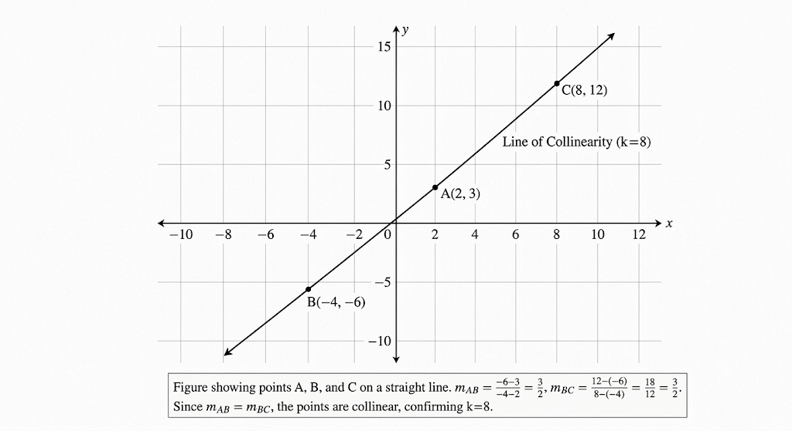
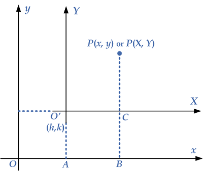

**(i) Relation between Cartesian Coordinates and Polar Coordinates**

Let `P` be any point in a plane. In Cartesian coordinates, the point is written as:

$$
P(x, y)
$$

Here, `x` is the distance along the x-axis and `y` is the distance along the y-axis.

In polar coordinates, the same point is written as:

$$
P(r, \theta)
$$

Here, `r` is the distance of the point from the origin and `\theta` is the angle made with the positive x-axis.

From the right-angled triangle, we get:

$$
x = r\cos\theta
$$

and

$$
y = r\sin\theta
$$

So, the relation from polar coordinates to Cartesian coordinates is:

$$
\boxed{x = r\cos\theta,\quad y = r\sin\theta}
$$

Again, by using Pythagoras theorem:

$$
r^2 = x^2 + y^2
$$

So,

$$
r = \sqrt{x^2 + y^2}
$$

Also,

$$
\tan\theta = \frac{y}{x}
$$

Therefore,

$$
\theta = \tan^{-1}\left(\frac{y}{x}\right)
$$

So, the relation from Cartesian coordinates to polar coordinates is:

$$
\boxed{r = \sqrt{x^2 + y^2},\quad \theta = \tan^{-1}\left(\frac{y}{x}\right)}
$$

Hence, these formulas show the relation between Cartesian coordinates and polar coordinates.

**(ii) Find the area of pentagon whose vertices are (−5, −2),(−2,5),(2,7),(5,1),(2,−4).**

**Solution:**
Let the coordinates of the vertices of the pentagon be defined as follows:

* $A(x_1, y_1) = (-5, -2)$
* $B(x_2, y_2) = (-2, 5)$
* $C(x_3, y_3) = (2, 7)$
* $D(x_4, y_4) = (5, 1)$
* $E(x_5, y_5) = (2, -4)$

By Gauss's Area Formula (The Shoelace Formula) for a 5-sided polygon:

$$\text{Area} = \frac{1}{2} \Big| (x_1y_2 + x_2y_3 + x_3y_4 + x_4y_5 + x_5y_1) - (y_1x_2 + y_2x_3 + y_3x_4 + y_4x_5 + y_5x_1) \Big|$$

Substituting the respective coordinate values into the formula:

$$\text{Area} = \frac{1}{2} \Big| \big[(-5)(5) + (-2)(7) + (2)(1) + (5)(-4) + (2)(-2)\big] - \big[(-2)(-2) + (5)(2) + (7)(5) + (1)(2) + (-4)(-5)\big] \Big|$$

Evaluating the products within the first group:

$$\text{Sum}_1 = -25 - 14 + 2 - 20 - 4$$

$$\text{Sum}_1 = -61$$

Evaluating the products within the second group:

$$\text{Sum}_2 = 4 + 10 + 35 + 2 + 20$$

$$\text{Sum}_2 = 71$$

Substituting $\text{Sum}_1$ and $\text{Sum}_2$ back into the absolute value expression:

$$\text{Area} = \frac{1}{2} \Big| -61 - 71 \Big|$$

$$\text{Area} = \frac{1}{2} \Big| -132 \Big|$$

$$\text{Area} = \frac{1}{2} \times 132$$

$$\text{Area} = 66$$

The calculated area of the given pentagon is **$66\text{ units}^2$**.

**1(iii) For what value of k the points (2, 3), (−4,−6) and (𝑘,12) are collinear.**

**Solution:**

For three points $A(x_1, y_1)$, $B(x_2, y_2)$, and $C(x_3, y_3)$ to be collinear, the slope of the line segment $AB$ must be equal to the slope of the line segment $BC$.

Let the given coordinates be assigned as:

* $A(x_1, y_1) = (2, 3)$
* $B(x_2, y_2) = (-4, -6)$
* $C(x_3, y_3) = (k, 12)$

The gradient formula between two points is defined as:

$$m = \frac{y_2 - y_1}{x_2 - x_1}$$

Substituting the coordinates of points $A$ and $B$:

$$m_{AB} = \frac{-6 - 3}{-4 - 2}$$

$$m_{AB} = \frac{-9}{-6}$$

$$m_{AB} = \frac{3}{2}$$

Substituting the coordinates of points $B$ and $C$:

$$m_{BC} = \frac{12 - (-6)}{k - (-4)}$$

$$m_{BC} = \frac{12 + 6}{k + 4}$$

$$m_{BC} = \frac{18}{k + 4}$$

Under the condition of collinearity:

$$m_{AB} = m_{BC}$$

$$\frac{3}{2} = \frac{18}{k + 4}$$

Applying cross-multiplication:

$$3(k + 4) = 18 \times 2$$

Expanding the left side of the equation:

$$3k + 12 = 36$$

Isolating the variable term by subtracting $12$ from both sides:

$$3k = 36 - 12$$

$$3k = 24$$

Solving for $k$ by dividing both sides by $3$:

$$k = \frac{24}{3}$$

$$k = 8$$

The value of $k$ that satisfies the condition for the points to be collinear is **$8$**.

**(iv) Find the equation of two lines passing through (−5,6) (a) parallel and (b)perpendicular to 7𝑥 −8𝑦 =9**

Given line is:

$$
7x-8y=9
$$

First, write it in slope-intercept form.

$$
7x-8y=9
$$

$$
-8y=9-7x
$$

$$
8y=7x-9
$$

$$
y=\frac{7}{8}x-\frac{9}{8}
$$

So, the slope of the given line is:

$$
m=\frac{7}{8}
$$

 (a) Equation of the parallel line

Parallel lines have the same slope.

So,

$$
m=\frac{7}{8}
$$

The line passes through:

$$
(-5,6)
$$

Using point-slope form:

$$
y-y_1=m(x-x_1)
$$

$$
y-6=\frac{7}{8}(x-(-5))
$$

$$
y-6=\frac{7}{8}(x+5)
$$

Now multiply both sides by (8):

$$
8(y-6)=7(x+5)
$$

$$
8y-48=7x+35
$$

$$
8y=7x+83
$$

$$
7x-8y+83=0
$$

Therefore, the equation of the parallel line is:

$$
\boxed{7x-8y+83=0}
$$

(b) Equation of the perpendicular line

The slope of the given line is:

$$
m=\frac{7}{8}
$$

So, the slope of the perpendicular line is the negative reciprocal:

$$
m=-\frac{8}{7}
$$

The line passes through:

$$
(-5,6)
$$

Using point-slope form:

$$
y-y_1=m(x-x_1)
$$

$$
y-6=-\frac{8}{7}(x-(-5))
$$

$$
y-6=-\frac{8}{7}(x+5)
$$

Now multiply both sides by (7):

$$
7(y-6)=-8(x+5)
$$

$$
7y-42=-8x-40
$$

$$
7y=-8x+2
$$

$$
8x+7y-2=0
$$

Therefore, the equation of the perpendicular line is:

$$
\boxed{8x+7y-2=0}
$$

**Coursework Assignment: Coordinate Geometry**

**(v) Determine the equation of the bisector of the angle between the lines  3𝑥 − 4𝑦 + 12 = 0 and 12𝑥 +5𝑦−3=0.**

**Solution:**

The equations of the angle bisectors between two intersecting lines $A_1x + B_1y + C_1 = 0$ and $A_2x + B_2y + C_2 = 0$ are given by the formula:

$$\frac{A_1x + B_1y + C_1}{\sqrt{A_1^2 + B_1^2}} = \pm \frac{A_2x + B_2y + C_2}{\sqrt{A_2^2 + B_2^2}}$$

Given the line equations:

* Line 1: $3x - 4y + 12 = 0$ (where $A_1 = 3$, $B_1 = -4$, $C_1 = 12$)
* Line 2: $12x + 5y - 3 = 0$ (where $A_2 = 12$, $B_2 = 5$, $C_2 = -3$)

Substituting these values into the formula:

$$\frac{3x - 4y + 12}{\sqrt{3^2 + (-4)^2}} = \pm \frac{12x + 5y - 3}{\sqrt{12^2 + 5^2}}$$

$\implies \frac{3x - 4y + 12}{\sqrt{9 + 16}} = \pm \frac{12x + 5y - 3}{\sqrt{144 + 25}}$

$\implies \frac{3x - 4y + 12}{\sqrt{25}} = \pm \frac{12x + 5y - 3}{\sqrt{169}}$

$\implies \frac{3x - 4y + 12}{5} = \pm \frac{12x + 5y - 3}{13}$

Applying cross-multiplication:
$\implies 13(3x - 4y + 12) = \pm 5(12x + 5y - 3)$

$\implies 39x - 52y + 156 = \pm (60x + 25y - 15)$

To find both bisectors, we separate this into two cases using the positive and negative signs.

**Case 1: Taking the positive sign (+)**

$$39x - 52y + 156 = 60x + 25y - 15$$

$\implies 0 = (60x - 39x) + (25y + 52y) - 15 - 156$

$\implies 21x + 77y - 171 = 0$

**Case 2: Taking the negative sign (-)**

$$39x - 52y + 156 = -(60x + 25y - 15)$$

$\implies 39x - 52y + 156 = -60x - 25y + 15$

$\implies (39x + 60x) - (52y - 25y) + 156 - 15 = 0$

$\implies 99x - 27y + 141 = 0$

Dividing the entire equation by $3$ to simplify:
$\implies 33x - 9y + 47 = 0$

The equations of the angle bisectors between the given lines are **$21x + 77y - 171 = 0$** and **$33x - 9y + 47 = 0$**. (Ans:)

**1(vi)Find the area of the triangle formed by the lines $2x + y - 3 = 0$, $3x + 2y - 1 = 0$, and $2x + 3y + 4 = 0$.**

 **Solution:**

To find the area of the triangle, we must first determine the coordinates of its vertices by finding the intersection points of the three lines taken in pairs.

Let the given lines be defined as:

* Line 1: $2x + y = 3$
* Line 2: $3x + 2y = 1$
* Line 3: $2x + 3y = -4$

From Line 1, express $y$ in terms of $x$:

$$y = 3 - 2x$$

Substitute this expression into Line 2:

$$3x + 2(3 - 2x) = 1$$

$\implies 3x + 6 - 4x = 1$

$\implies -x + 6 = 1$

$\implies -x = -5$

$\implies x = 5$

Substitute $x = 5$ back to find $y$:

$$y = 3 - 2(5) = -7$$

Thus, Vertex $A = (5, -7)$.

Multiply Line 2 by $3$ and Line 3 by $2$ to align the $y$-coefficients:

$$\text{Line 2} \times 3 \implies 9x + 6y = 3$$

$$\text{Line 3} \times 2 \implies 4x + 6y = -8$$

Subtracting the two equations:

$$(9x - 4x) + (6y - 6y) = 3 - (-8)$$

$\implies 5x = 11$

$\implies x = \frac{11}{5}$

Substitute $x = \frac{11}{5}$ into Line 2:

$$3\left(\frac{11}{5}\right) + 2y = 1$$

$\implies \frac{33}{5} + 2y = 1$

$\implies 2y = 1 - \frac{33}{5}$

$\implies 2y = -\frac{28}{5}$

$\implies y = -\frac{14}{5}$

Thus, Vertex $B = \left(\frac{11}{5}, -\frac{14}{5}\right)$.

Subtract Line 3 from Line 1:

$$(2x + y) - (2x + 3y) = 3 - (-4)$$

$\implies -2y = 7$

$\implies y = -\frac{7}{2}$

Substitute $y = -\frac{7}{2}$ into Line 1:

$$2x + \left(-\frac{7}{2}\right) = 3$$

$\implies 2x = 3 + \frac{7}{2}$

$\implies 2x = \frac{13}{2}$

$\implies x = \frac{13}{4}$

Thus, Vertex $C = \left(\frac{13}{4}, -\frac{7}{2}\right)$.

Using the vertex coordinates $A(5, -7)$, $B\left(\frac{11}{5}, -\frac{14}{5}\right)$, and $C\left(\frac{13}{4}, -\frac{7}{2}\right)$, the area is calculated using the determinant formula:

$$\text{Area} = \pm \frac{1}{2} \begin{vmatrix} x_1 & y_1 & 1 \\ x_2 & y_2 & 1 \\ x_3 & y_3 & 1 \end{vmatrix}$$

Substituting our coordinate values:

$$\text{Area} = \pm \frac{1}{2} \begin{vmatrix} 5 & -7 & 1 \\ \frac{11}{5} & -\frac{14}{5} & 1 \\ \frac{13}{4} & -\frac{7}{2} & 1 \end{vmatrix}$$

Expanding the determinant along the first row:

$$\implies \text{Area} = \pm \frac{1}{2} \left[ 5 \begin{vmatrix} -\frac{14}{5} & 1 \\ -\frac{7}{2} & 1 \end{vmatrix} - (-7) \begin{vmatrix} \frac{11}{5} & 1 \\ \frac{13}{4} & 1 \end{vmatrix} + 1 \begin{vmatrix} \frac{11}{5} & -\frac{14}{5} \\ \frac{13}{4} & -\frac{7}{2} \end{vmatrix} \right]$$

Evaluating the $2 \times 2$ matrix blocks:

$$\implies \text{Area} = \pm \frac{1}{2} \left[ 5 \left( -\frac{14}{5} - \left(-\frac{7}{2}\right) \right) + 7 \left( \frac{11}{5} - \frac{13}{4} \right) + 1 \left( \left(\frac{11}{5}\right)\left(-\frac{7}{2}\right) - \left(-\frac{14}{5}\right)\left(\frac{13}{4}\right) \right) \right]$$

$$\implies \text{Area} = \pm \frac{1}{2} \left[ 5 \left( -\frac{28}{10} + \frac{35}{10} \right) + 7 \left( \frac{44 - 65}{20} \right) + 1 \left( -\frac{77}{10} + \frac{182}{20} \right) \right]$$

$$\implies \text{Area} = \pm \frac{1}{2} \left[ 5 \left( \frac{7}{10} \right) + 7 \left( -\frac{21}{20} \right) + 1 \left( -\frac{154}{20} + \frac{182}{20} \right) \right]$$

$$\implies \text{Area} = \pm \frac{1}{2} \left[ \frac{35}{10} - \frac{147}{20} + \frac{28}{20} \right]$$

Converting fractions to a common denominator of 20:

$$\implies \text{Area} = \pm \frac{1}{2} \left[ \frac{70}{20} - \frac{147}{20} + \frac{28}{20} \right]$$

$$\implies \text{Area} = \pm \frac{1}{2} \left[ \frac{70 - 147 + 28}{20} \right]$$

$$\implies \text{Area} = \pm \frac{1}{2} \left[ -\frac{49}{20} \right]$$

Choosing the negative sign to yield a positive area magnitude:

$$\implies \text{Area} = \frac{49}{40}$$

**Conclusion:**
The area of the triangle formed by the given lines is **$\frac{49}{40}\text{ units}^2$** (or **$1.225\text{ units}^2$**).

**1(vii) Show that the area of the triangle formed by the straight lines $y - 2x = 0$, $y - 3x = 0$, and $y = 5x + 4$ is $\frac{4}{3}$.**

 **Solution:**

To find the area of the triangle, we determine the intersection coordinates of the three boundary lines taken in pairs.

Let the given lines be defined as:

* Line 1: $y = 2x$
* Line 2: $y = 3x$
* Line 3: $y = 5x + 4$

 **Intersection of Line 1 and Line 2 (Vertex A)**

Equating Line 1 and Line 2:

$$2x = 3x$$

$\implies 3x - 2x = 0$

$\implies x = 0$

Substituting $x = 0$ into Line 1:

$$y = 2(0) = 0$$

Thus, Vertex $A = (0, 0)$.

 **Intersection of Line 2 and Line 3 (Vertex B)**

Equating Line 2 and Line 3:

$$3x = 5x + 4$$

$\implies 3x - 5x = 4$

$\implies -2x = 4$

$\implies x = -2$

Substituting $x = -2$ into Line 2:

$$y = 3(-2) = -6$$

Thus, Vertex $B = (-2, -6)$.

**Intersection of Line 3 and Line 1 (Vertex C)**

Equating Line 3 and Line 1:

$$5x + 4 = 2x$$

$\implies 5x - 2x = -4$

$\implies 3x = -4$

$\implies x = -\frac{4}{3}$

Substituting $x = -\frac{4}{3}$ into Line 1:

$$y = 2\left(-\frac{4}{3}\right) = -\frac{8}{3}$$

Thus, Vertex $C = \left(-\frac{4}{3}, -\frac{8}{3}\right)$.

**Calculation of Area using Determinant Formula**

Using the coordinates $A(0, 0)$, $B(-2, -6)$, and $C\left(-\frac{4}{3}, -\frac{8}{3}\right)$, the area is given by:

$$\text{Area} = \pm \frac{1}{2} \begin{vmatrix} x_1 & y_1 & 1 \\ x_2 & y_2 & 1 \\ x_3 & y_3 & 1 \end{vmatrix}$$

Substituting the vertex coordinates:

$$\text{Area} = \pm \frac{1}{2} \begin{vmatrix} 0 & 0 & 1 \\ -2 & -6 & 1 \\ -\frac{4}{3} & -\frac{8}{3} & 1 \end{vmatrix}$$

Expanding the determinant along the first row:

$$\implies \text{Area} = \pm \frac{1}{2} \left[ 0 - 0 + 1 \begin{vmatrix} -2 & -6 \\ -\frac{4}{3} & -\frac{8}{3} \end{vmatrix} \right]$$

Evaluating the remaining $2 \times 2$ determinant:

$$\implies \text{Area} = \pm \frac{1}{2} \left[ 1 \left( (-2)\left(-\frac{8}{3}\right) - (-6)\left(-\frac{4}{3}\right) \right) \right]$$

$$\implies \text{Area} = \pm \frac{1}{2} \left[ \frac{16}{3} - \frac{24}{3} \right]$$

$$\implies \text{Area} = \pm \frac{1}{2} \left[ -\frac{8}{3} \right]$$

Choosing the negative sign to yield a positive area value:

$$\implies \text{Area} = \frac{1}{2} \times \frac{8}{3}$$

$$\implies \text{Area} = \frac{4}{3}$$

**Conclusion:**
The area of the triangle formed by the given straight lines is **$\frac{4}{3}\text{ units}^2$**, as required.

**1(viii) Discuss about change of origin (Transformation of axes).**

 **Solution:**

Transformation of axes by changing the origin (also known as translation of axes) is a method used in coordinate geometry to shift the origin $(0,0)$ to a new point $(h, k)$ while keeping the direction of the coordinate axes unchanged (parallel to the original axes).

Let the old coordinate axes be $OX$ and $OY$ with the original origin at $O(0,0)$.
Let the new origin be shifted to a point $O'(h, k)$. The new parallel coordinate axes are designated as $O'X'$ and $O'Y'$.

  

Consider an arbitrary point $P$ in the plane. Let its coordinates be:

* $(x, y)$ with respect to the old reference frame $(OX, OY)$.
* $(X', Y')$ with respect to the new reference frame $(O'X', O'Y')$.

The relationship between the old coordinates and the new coordinates can be derived geometrically from the spatial shift along the respective coordinate directions:

$$x = X' + h$$

$$y = Y' + k$$

Conversely, to express the new coordinate system parameters in terms of the original coordinate data:

$$X' = x - h$$

$$Y' = y - k$$

**Application in Simplifying Equations:**

This transformation is primarily used to eliminate the linear first-degree terms ($x$ and $y$) from a second-degree polynomial expression. For instance, consider a general second-degree conic expression:

$$ax^2 + 2hxy + by^2 + 2gx + 2fy + c = 0$$

By translating the origin to the center of the conic $(h, k)$, the linear terms $2gx$ and $2fy$ vanish, reducing the complexity of the equation to its standard central geometric form.

**(ix) Remove the first-degree terms from the equation $3x^2 + 4y^2 - 12x + 4y + 13 = 0$.**

 **Solution:**

To eliminate the first-degree terms ($x$ and $y$ terms), we shift the origin to a new point $(h, k)$ using the transformation equations:

$$x = X + h$$

$$y = Y + k$$

Substituting these transformations into the given equation:

$$3(X + h)^2 + 4(Y + k)^2 - 12(X + h) + 4(Y + k) + 13 = 0$$

Expanding each squared term:
$\implies 3(X^2 + 2hX + h^2) + 4(Y^2 + 2kY + k^2) - 12X - 12h + 4Y + 4k + 13 = 0$

$\implies 3X^2 + 6hX + 3h^2 + 4Y^2 + 8kY + 4k^2 - 12X - 12h + 4Y + 4k + 13 = 0$

Grouping the terms by the powers of $X$ and $Y$:
$\implies 3X^2 + 4Y^2 + (6h - 12)X + (8k + 4)Y + (3h^2 + 4k^2 - 12h + 4k + 13) = 0$

To remove the first-degree terms, the coefficients of $X$ and $Y$ must be set to zero:

$$6h - 12 = 0$$

$\implies 6h = 12$

$\implies h = 2$$

And for the $Y$ coefficient:

$$8k + 4 = 0$$

$\implies 8k = -4$

$\implies k = -\frac{1}{2}$$

Now, we substitute $h = 2$ and $k = -\frac{1}{2}$ into the constant term expression to find its transformed value:

$$\text{Constant} = 3(2)^2 + 4\left(-\frac{1}{2}\right)^2 - 12(2) + 4\left(-\frac{1}{2}\right) + 13$$

$\implies \text{Constant} = 3(4) + 4\left(\frac{1}{4}\right) - 24 - 2 + 13$

$\implies \text{Constant} = 12 + 1 - 24 - 2 + 13$

$\implies \text{Constant} = 26 - 26$

$\implies \text{Constant} = 0$

Substituting the values of the coefficients back into the grouped equation:

$$3X^2 + 4Y^2 + 0X + 0Y + 0 = 0$$

$\implies 3X^2 + 4Y^2 = 0$

The transformed equation with the first-degree terms removed is **$3X^2 + 4Y^2 = 0$**.

**1(x) By transforming to parallel axes through a properly chosen point $(h, k)$, prove that the equation $12x^2 - 10xy + 2y^2 + 11x - 5y + 2 = 0$ can be reduced to one containing only the terms of the second degree.**

**Solution:**

To remove the first-degree terms and the constant term, we apply a translation of axes to a new origin $(h, k)$ using the transformations:

$$x = X + h$$

$$y = Y + k$$

Substituting these into the given equation:

$$12(X + h)^2 - 10(X + h)(Y + k) + 2(Y + k)^2 + 11(X + h) - 5(Y + k) + 2 = 0$$

Expanding each term individually:
$\implies 12(X^2 + 2hX + h^2) - 10(XY + kX + hY + hk) + 2(Y^2 + 2kY + k^2) + 11X + 11h - 5Y - 5k + 2 = 0$

$\implies 12X^2 + 24hX + 12h^2 - 10XY - 10kX - 10hY - 10hk + 2Y^2 + 4kY + 2k^2 + 11X + 11h - 5Y - 5k + 2 = 0$

Grouping the expression by matching degrees of $X$ and $Y$:

$$\implies 12X^2 - 10XY + 2Y^2 + (24h - 10k + 11)X + (-10h + 4k - 5)Y + (12h^2 - 10hk + 2k^2 + 11h - 5k + 2) = 0$$

To eliminate the first-degree terms, we set the coefficients of $X$ and $Y$ to zero, establishing a system of linear equations:

$$24h - 10k + 11 = 0 \quad \text{--- (Equation 1)}$$

$$-10h + 4k - 5 = 0 \quad \text{--- (Equation 2)}$$

From Equation 2, we can isolate $4k$:

$$\implies 4k = 10h + 5$$

$$\implies k = \frac{10h + 5}{4}$$

Substituting this expression for $k$ into Equation 1:

$$\implies 24h - 10\left(\frac{10h + 5}{4}\right) + 11 = 0$$

$$\implies 24h - \frac{5(10h + 5)}{2} + 11 = 0$$

Multiplying the entire line by $2$ to clear the fraction:

$$\implies 48h - 50h - 25 + 22 = 0$$

$$\implies -2h - 3 = 0$$

$$\implies -2h = 3$$

$$\implies h = -\frac{3}{2}$$

Substituting $h = -\frac{3}{2}$ back into the expression for $k$:

$$\implies k = \frac{10\left(-\frac{3}{2}\right) + 5}{4}$$

$$\implies k = \frac{-15 + 5}{4}$$

$$\implies k = \frac{-10}{4}$$

$$\implies k = -\frac{5}{2}$$

Thus, the properly chosen point for shifting the origin is $(h, k) = \left(-\frac{3}{2}, -\frac{5}{2}\right)$.

Next, we evaluate the transformed constant term using these values:

$$\text{Constant} = 12\left(-\frac{3}{2}\right)^2 - 10\left(-\frac{3}{2}\right)\left(-\frac{5}{2}\right) + 2\left(-\frac{5}{2}\right)^2 + 11\left(-\frac{3}{2}\right) - 5\left(-\frac{5}{2}\right) + 2$$

$$\implies \text{Constant} = 12\left(\frac{9}{4}\right) - 10\left(\frac{15}{4}\right) + 2\left(\frac{25}{4}\right) - \frac{33}{2} + \frac{25}{2} + 2$$

$$\implies \text{Constant} = \frac{108}{4} - \frac{150}{4} + \frac{50}{4} - \frac{66}{4} + \frac{50}{4} + \frac{8}{4}$$

$$\implies \text{Constant} = \frac{108 - 150 + 50 - 66 + 50 + 8}{4}$$

$$\implies \text{Constant} = \frac{266 - 216}{4}$$

$$\implies \text{Constant} = \frac{0}{4} = 0$$

Substituting the zero values for the linear coefficients and the constant term back into our grouped equation leaves:

$$12X^2 - 10XY + 2Y^2 = 0$$

Since all first-degree terms and the constant term have been eliminated, the equation reduces down exclusively to second-degree terms, as required.

**1(xi) By transforming to parallel axes through a properly chosen point $(h, k)$, prove that the equation $2x^2 + y^2 - xy - 5x - 4y + 11 = 0$ can be reduced to one containing only the terms of the second degree.**

 **Solution:**

To eliminate the first-degree terms and the constant term, we apply a translation of axes to a new origin $(h, k)$ using the transformations:

$$x = X + h$$

$$y = Y + k$$

Substituting these expressions into the given equation:

$$2(X + h)^2 + (Y + k)^2 - (X + h)(Y + k) - 5(X + h) - 4(Y + k) + 11 = 0$$

Expanding each term individually:
$\implies 2(X^2 + 2hX + h^2) + (Y^2 + 2kY + k^2) - (XY + kX + hY + hk) - 5X - 5h - 4Y - 4k + 11 = 0$

$\implies 2X^2 + 4hX + 2h^2 + Y^2 + 2kY + k^2 - XY - kX - hY - hk - 5X - 5h - 4Y - 4k + 11 = 0$

Grouping the terms by matching powers of $X$ and $Y$:

$$\implies 2X^2 - XY + Y^2 + (4h - k - 5)X + (2k - h - 4)Y + (2h^2 + k^2 - hk - 5h - 4k + 11) = 0$$

To eliminate the first-degree linear terms, we set the coefficients of $X$ and $Y$ to zero:

$$4h - k - 5 = 0 \quad \text{--- (Equation 1)}$$

$$-h + 2k - 4 = 0 \quad \text{--- (Equation 2)}$$

From Equation 1, express $k$ in terms of $h$:

$$\implies k = 4h - 5$$

Substituting this into Equation 2:

$$\implies -h + 2(4h - 5) - 4 = 0$$

$$\implies -h + 8h - 10 - 4 = 0$$

$$\implies 7h - 14 = 0$$

$$\implies 7h = 14$$

$$\implies h = 2$$

Substituting $h = 2$ back to find $k$:

$$\implies k = 4(2) - 5$$

$$\implies k = 3$$

Thus, the properly chosen point for translating the origin is $(h, k) = (2, 3)$.

Next, we evaluate the transformed constant term using $h = 2$ and $k = 3$:

$$\text{Constant} = 2(2)^2 + (3)^2 - (2)(3) - 5(2) - 4(3) + 11$$

$$\implies \text{Constant} = 2(4) + 9 - 6 - 10 - 12 + 11$$

$$\implies \text{Constant} = 8 + 9 - 6 - 10 - 12 + 11$$

$$\implies \text{Constant} = 28 - 28$$

$$\implies \text{Constant} = 0$$

Substituting the calculated coefficient and constant parameters back into the grouped equation leaves:

$$2X^2 - XY + Y^2 = 0$$

Since all first-degree terms and the constant parameter drop to zero, the equation simplifies exclusively to terms of the second degree, as required.

**2(i) Prove that a homogeneous equation of second degree $ax^2 + 2hxy + by^2 = 0$ always represents a pair of straight lines (real or imaginary) passing through the origin.**

**Proof:**
Let the given homogeneous second-degree equation be:

$$ax^2 + 2hxy + by^2 = 0$$

To analyze this equation, we consider two distinct cases based on the coefficient $b$.

**Case 1: When $b \neq 0$**

Dividing the entire equation by $x^2$ (assuming $x \neq 0$):

$$a + 2h\left(\frac{y}{x}\right) + b\left(\frac{y}{x}\right)^2 = 0$$

Let $m = \frac{y}{x}$, which represents the slope of a straight line passing through the origin ($y = mx$). Substituting $m$ into the expression yields a quadratic equation in terms of $m$:

$$bm^2 + 2hm + a = 0$$

Applying the quadratic formula to solve for the roots $m_1$ and $m_2$:

$$m = \frac{-2h \pm \sqrt{(2h)^2 - 4(b)(a)}}{2b}$$

$\implies m = \frac{-2h \pm \sqrt{4h^2 - 4ab}}{2b}$

$\implies m = \frac{-2h \pm 2\sqrt{h^2 - ab}}{2b}$

$\implies m = \frac{-h \pm \sqrt{h^2 - ab}}{b}$

Thus, the two distinct gradients are:

$$m_1 = \frac{-h + \sqrt{h^2 - ab}}{b} \quad \text{and} \quad m_2 = \frac{-h - \sqrt{h^2 - ab}}{b}$$

Since the quadratic in $m$ has exactly two roots, the original equation can be factored in terms of these gradients as:

$$b(m - m_1)(m - m_2) = 0$$

Substituting $m = \frac{y}{x}$ back into this factored form:

$$b\left(\frac{y}{x} - m_1\right)\left(\frac{y}{x} - m_2\right) = 0$$

Multiplying both factors by $x$:

$$b(y - m_1x)(y - m_2x) = 0$$

This represents two individual straight lines:

1. $y - m_1x = 0$
2. $y - m_2x = 0$

Both of these equations lack a constant term, confirming they pass through the origin $(0,0)$.

The nature of these lines depends on the discriminant value $h^2 - ab$:

* If $h^2 - ab > 0$, the lines are **real and distinct**.
* If $h^2 - ab = 0$, the lines are **real and coincident** (overlapping).
* If $h^2 - ab < 0$, the lines are **imaginary** with a real intersection point at the origin.

**Case 2: When $b = 0$**

If $b = 0$, the original equation simplifies to:

$$ax^2 + 2hxy = 0$$

Factoring out $x$ from both terms:

$$x(ax + 2hy) = 0$$

This splits into two linear components:

1. $x = 0$ (the y-axis)
2. $ax + 2hy = 0$

Both equations contain no constant intercept parameters, which shows they represent a pair of straight lines that intersect at the origin $(0,0)$.

In all cases, the second-degree homogeneous equation $ax^2 + 2hxy + by^2 = 0$ represents two straight lines passing through the origin.

**2(ii) Show that the necessary condition of bisectors of the angles between the lines represented by $ax^2 + 2hxy + by^2 = 0$ is $\frac{x^2 - y^2}{a - b} = \frac{xy}{h}$.**

**Proof:**

Let the homogeneous second-degree equation represent two straight lines passing through the origin:

$$ax^2 + 2hxy + by^2 = 0$$

Let these individual lines be:

1. $y = m_1x \implies m_1x - y = 0$
2. $y = m_2x \implies m_2x - y = 0$

Thus, the combined pair equation is given by:

$$(m_1x - y)(m_2x - y) = 0$$

$\implies m_1m_2x^2 - (m_1 + m_2)xy + y^2 = 0$

Dividing our original given equation $ax^2 + 2hxy + by^2 = 0$ by $b$:

$$\implies \frac{a}{b}x^2 + \frac{2h}{b}xy + y^2 = 0$$

Comparing the coefficients of the two equations yields the sum and product of the slopes:

$$m_1 + m_2 = -\frac{2h}{b}$$

$$m_1m_2 = \frac{a}{b}$$

The equations of the angle bisectors between two lines $A_1x + B_1y = 0$ and $A_2x + B_2y = 0$ are given by:

$$\frac{m_1x - y}{\sqrt{m_1^2 + (-1)^2}} = \pm \frac{m_2x - y}{\sqrt{m_2^2 + (-1)^2}}$$

Squaring both sides to eliminate the radical sign and combine them into a joint equation:

$$\frac{(m_1x - y)^2}{m_1^2 + 1} = \frac{(m_2x - y)^2}{m_2^2 + 1}$$

$\implies (m_1^2x^2 - 2m_1xy + y^2)(m_2^2 + 1) = (m_2^2x^2 - 2m_2xy + y^2)(m_1^2 + 1)$

Expanding both sides completely:
$\implies m_1^2m_2^2x^2 + m_1^2x^2 - 2m_1m_2^2xy - 2m_1xy + m_2^2y^2 + y^2 = m_1^2m_2^2x^2 + m_2^2x^2 - 2m_1^2m_2xy - 2m_2xy + m_1^2y^2 + y^2$

Canceling out identical terms ($m_1^2m_2^2x^2$ and $y^2$) from both sides:
$\implies m_1^2x^2 - 2m_1m_2^2xy - 2m_1xy + m_2^2y^2 = m_2^2x^2 - 2m_1^2m_2xy - 2m_2xy + m_1^2y^2$

Rearranging all remaining terms to the left-hand side:
$\implies (m_1^2 - m_2^2)x^2 + (2m_1^2m_2 - 2m_1m_2^2)xy + (2m_2 - 2m_1)xy + (m_2^2 - m_1^2)y^2 = 0$

$\implies (m_1^2 - m_2^2)x^2 + 2m_1m_2(m_1 - m_2)xy - 2(m_1 - m_2)xy - (m_1^2 - m_2^2)y^2 = 0$

Factoring out $(m_1 - m_2)$ from the entire equation, noting that $m_1^2 - m_2^2 = (m_1 - m_2)(m_1 + m_2)$:
$\implies (m_1 - m_2) \Big[ (m_1 + m_2)x^2 + 2m_1m_2xy - 2xy - (m_1 + m_2)y^2 \Big] = 0$

Since $m_1 \neq m_2$ for two distinct non-coincident lines, we can divide by $(m_1 - m_2)$:
$\implies (m_1 + m_2)x^2 + 2(m_1m_2 - 1)xy - (m_1 + m_2)y^2 = 0$

Grouping the $x^2$ and $y^2$ terms together:
$\implies (m_1 + m_2)(x^2 - y^2) + 2(m_1m_2 - 1)xy = 0$

Now, substituting our relationships for the sum and product of slopes ($m_1 + m_2 = -\frac{2h}{b}$ and $m_1m_2 = \frac{a}{b}$):

$$\implies \left(-\frac{2h}{b}\right)(x^2 - y^2) + 2\left(\frac{a}{b} - 1\right)xy = 0$$

$$\implies -\frac{2h}{b}(x^2 - y^2) + 2\left(\frac{a - b}{b}\right)xy = 0$$

Multiplying through by $-\frac{b}{2}$ to simplify the denominators and signs:

$$\implies h(x^2 - y^2) - (a - b)xy = 0$$

$$\implies h(x^2 - y^2) = (a - b)xy$$

Rearranging terms to separate variables into fractional ratios:

$$\implies \frac{x^2 - y^2}{a - b} = \frac{xy}{h}$$

The joint equation representing the pair of angle bisectors matches the required necessary condition.

**Show that the necessary condition of bisectors of the angles between the lines represented by $ax^2 + 2hxy + by^2 = 0$ is $\frac{x^2 - y^2}{a - b} = \frac{xy}{h}$.**

**Solution:**

Let the homogeneous second-degree equation represent two straight lines passing through the origin:

$$ax^2 + 2hxy + by^2 = 0$$

Let these individual lines be:

1. $y = m_1x \implies m_1x - y = 0$
2. $y = m_2x \implies m_2x - y = 0$

Thus, the combined pair equation is given by:

$$(m_1x - y)(m_2x - y) = 0$$

$\implies m_1m_2x^2 - (m_1 + m_2)xy + y^2 = 0$

Dividing our original given equation $ax^2 + 2hxy + by^2 = 0$ by $b$:

$$\implies \frac{a}{b}x^2 + \frac{2h}{b}xy + y^2 = 0$$

Comparing the coefficients of the two equations yields the sum and product of the slopes:

$$m_1 + m_2 = -\frac{2h}{b}$$

$$m_1m_2 = \frac{a}{b}$$

The equations of the angle bisectors between two lines $A_1x + B_1y = 0$ and $A_2x + B_2y = 0$ are given by:

$$\frac{m_1x - y}{\sqrt{m_1^2 + (-1)^2}} = \pm \frac{m_2x - y}{\sqrt{m_2^2 + (-1)^2}}$$

Squaring both sides to eliminate the radical sign and combine them into a joint equation:

$$\frac{(m_1x - y)^2}{m_1^2 + 1} = \frac{(m_2x - y)^2}{m_2^2 + 1}$$

$\implies (m_1^2x^2 - 2m_1xy + y^2)(m_2^2 + 1) = (m_2^2x^2 - 2m_2xy + y^2)(m_1^2 + 1)$

Expanding both sides completely:
$\implies m_1^2m_2^2x^2 + m_1^2x^2 - 2m_1m_2^2xy - 2m_1xy + m_2^2y^2 + y^2 = m_1^2m_2^2x^2 + m_2^2x^2 - 2m_1^2m_2xy - 2m_2xy + m_1^2y^2 + y^2$

Canceling out identical terms ($m_1^2m_2^2x^2$ and $y^2$) from both sides:
$\implies m_1^2x^2 - 2m_1m_2^2xy - 2m_1xy + m_2^2y^2 = m_2^2x^2 - 2m_1^2m_2xy - 2m_2xy + m_1^2y^2$

Rearranging all remaining terms to the left-hand side:
$\implies (m_1^2 - m_2^2)x^2 + (2m_1^2m_2 - 2m_1m_2^2)xy + (2m_2 - 2m_1)xy + (m_2^2 - m_1^2)y^2 = 0$

$\implies (m_1^2 - m_2^2)x^2 + 2m_1m_2(m_1 - m_2)xy - 2(m_1 - m_2)xy - (m_1^2 - m_2^2)y^2 = 0$

Factoring out $(m_1 - m_2)$ from the entire equation, noting that $m_1^2 - m_2^2 = (m_1 - m_2)(m_1 + m_2)$:
$\implies (m_1 - m_2) \Big[ (m_1 + m_2)x^2 + 2m_1m_2xy - 2xy - (m_1 + m_2)y^2 \Big] = 0$

Since $m_1 \neq m_2$ for two distinct non-coincident lines, we can divide by $(m_1 - m_2)$:
$\implies (m_1 + m_2)x^2 + 2(m_1m_2 - 1)xy - (m_1 + m_2)y^2 = 0$

Grouping the $x^2$ and $y^2$ terms together:
$\implies (m_1 + m_2)(x^2 - y^2) + 2(m_1m_2 - 1)xy = 0$

Now, substituting our relationships for the sum and product of slopes ($m_1 + m_2 = -\frac{2h}{b}$ and $m_1m_2 = \frac{a}{b}$):

$$\implies \left(-\frac{2h}{b}\right)(x^2 - y^2) + 2\left(\frac{a}{b} - 1\right)xy = 0$$

$$\implies -\frac{2h}{b}(x^2 - y^2) + 2\left(\frac{a - b}{b}\right)xy = 0$$

Multiplying through by $-\frac{b}{2}$ to simplify the denominators and signs:

$$\implies h(x^2 - y^2) - (a - b)xy = 0$$

$$\implies h(x^2 - y^2) = (a - b)xy$$

Rearranging terms to separate variables into fractional ratios:

$$\implies \frac{x^2 - y^2}{a - b} = \frac{xy}{h}$$

The joint equation representing the pair of angle bisectors matches the required necessary condition.

**2(iii) Find the condition that the general equation of the second degree $ax^2 + 2hxy + by^2 + 2gx + 2fy + c = 0$ may represent a pair of straight lines.**

**Proof:**

Let the general second-degree equation representing a pair of straight lines be:

$$S(x, y) = ax^2 + 2hxy + by^2 + 2gx + 2fy + c = 0$$

If this equation represents two intersecting straight lines, they must intersect at a unique point, which we will define as $P(x_0, y_0)$.

At this specific intersection point, the partial derivatives of the function $S(x, y)$ with respect to both variables $x$ and $y$ must simultaneously vanish.

Differentiating $S(x, y)$ partially with respect to $x$:

$$\frac{\partial S}{\partial x} = 2ax + 2hy + 2g = 0$$

Evaluating at the intersection point $P(x_0, y_0)$ and dividing by $2$:

$$ax_0 + hy_0 + g = 0 \quad \text{--- (Equation 1)}$$

Differentiating $S(x, y)$ partially with respect to $y$:

$$\frac{\partial S}{\partial y} = 2hx + 2by + 2f = 0$$

Evaluating at the intersection point $P(x_0, y_0)$ and dividing by $2$:

$$hx_0 + by_0 + f = 0 \quad \text{--- (Equation 2)}$$

Now, the original equation $S(x, y) = 0$ must also hold true at the point $(x_0, y_0)$:

$$ax_0^2 + 2hx_0y_0 + by_0^2 + 2gx_0 + 2fy_0 + c = 0$$

We can strategically split and rearrange the terms of this equation:

$$\implies (ax_0^2 + hx_0y_0 + gx_0) + (hx_0y_0 + by_0^2 + fy_0) + (gx_0 + fy_0 + c) = 0$$

Factoring out $x_0$ from the first group and $y_0$ from the second group:

$$\implies x_0(ax_0 + hy_0 + g) + y_0(hx_0 + by_0 + f) + (gx_0 + fy_0 + c) = 0$$

From **Equation 1** and **Equation 2**, we know that $(ax_0 + hy_0 + g) = 0$ and $(hx_0 + by_0 + f) = 0$. Substituting these zeroes into the equation collapses it to:

$$x_0(0) + y_0(0) + (gx_0 + fy_0 + c) = 0$$

$$\implies gx_0 + fy_0 + c = 0 \quad \text{--- (Equation 3)}$$

We now possess a system of three linear equations in terms of $x_0$ and $y_0$:

1. $ax_0 + hy_0 + g = 0$
2. $hx_0 + by_0 + f = 0$
3. $gx_0 + fy_0 + c = 0$

For this system to yield a consistent, non-trivial solution for the coordinates, the determinant of the matrix formed by their coefficients must equal zero:

$$\begin{vmatrix} a & h & g \\ h & b & f \\ g & f & c \end{vmatrix} = 0$$

Expanding this $3 \times 3$ determinant along the first row:

$$\implies a \begin{vmatrix} b & f \\ f & c \end{vmatrix} - h \begin{vmatrix} h & f \\ g & c \end{vmatrix} + g \begin{vmatrix} h & b \\ g & f \end{vmatrix} = 0$$

Evaluating the $2 \times 2$ determinants:

$$\implies a(bc - f^2) - h(hc - fg) + g(hf - bg) = 0$$

Expanding the brackets:

$$\implies abc - af^2 - ch^2 + fgh + fgh - bg^2 = 0$$

Combining the identical $fgh$ terms and rearranging:

$$\implies abc + 2fgh - af^2 - bg^2 - ch^2 = 0$$

The required condition for the general second-degree equation to represent a pair of straight lines is **$abc + 2fgh - af^2 - bg^2 - ch^2 = 0$**.

**2(iv) Prove that the equation $x^2 + 6xy + 9y^2 + 4x + 12y - 5 = 0$ represents a pair of straight lines.**

**Solution:**

The general equation of the second degree is defined as:

$$ax^2 + 2hxy + by^2 + 2gx + 2fy + c = 0$$

Comparing the given equation $x^2 + 6xy + 9y^2 + 4x + 12y - 5 = 0$ with the general form, we identify the following coefficient parameters:

* $a = 1$
* $2h = 6 \implies h = 3$
* $b = 9$
* $2g = 4 \implies g = 2$
* $2f = 12 \implies f = 6$
* $c = -5$

For a general second-degree equation to represent a pair of straight lines, the determinant of its coefficients must equal zero:

$$\Delta = \begin{vmatrix} a & h & g \\ h & b & f \\ g & f & c \end{vmatrix} = 0$$

Substituting our coefficient values into the matrix:

$$\Delta = \begin{vmatrix} 1 & 3 & 2 \\ 3 & 9 & 6 \\ 2 & 6 & -5 \end{vmatrix}$$

Expanding this $3 \times 3$ determinant along the first row:

$$\implies \Delta = 1 \begin{vmatrix} 9 & 6 \\ 6 & -5 \end{vmatrix} - 3 \begin{vmatrix} 3 & 6 \\ 2 & -5 \end{vmatrix} + 2 \begin{vmatrix} 3 & 9 \\ 2 & 6 \end{vmatrix}$$

Evaluating the individual $2 \times 2$ determinants:

$$\implies \Delta = 1 \big((9)(-5) - (6)(6)\big) - 3 \big((3)(-5) - (6)(2)\big) + 2 \big((3)(6) - (9)(2)\big)$$

$$\implies \Delta = 1 (-45 - 36) - 3 (-15 - 12) + 2 (18 - 18)$$

$$\implies \Delta = 1 (-81) - 3 (-27) + 2 (0)$$

$$\implies \Delta = -81 + 81 + 0$$

$$\implies \Delta = 0$$

Since the determinant value $\Delta = 0$, the condition for a pair of straight lines is satisfied. Therefore, the given equation represents a pair of straight lines.

**2(v) Find the angle between the lines represented by the equation $ax^2 + 2hxy + by^2 = 0$.**

**Solution:**

Let the homogeneous second-degree equation represent two straight lines passing through the origin:

$$ax^2 + 2hxy + by^2 = 0$$

Let these two straight lines be $y = m_1x$ and $y = m_2x$, where $m_1$ and $m_2$ represent their gradients. The combined equation of these lines is:

$$(m_1x - y)(m_2x - y) = 0$$

$\implies m_1m_2x^2 - (m_1 + m_2)xy + y^2 = 0$

Dividing the original given equation by $b$:

$$\implies \frac{a}{b}x^2 + \frac{2h}{b}xy + y^2 = 0$$

Comparing the coefficients of like terms between the two equations, we establish the standard relations for the sum and product of the slopes:

$$m_1 + m_2 = -\frac{2h}{b}$$

$$m_1m_2 = \frac{a}{b}$$

Let $\theta$ be the angle between the two intersecting straight lines. The standard tangent formula for the angle between two lines with gradients $m_1$ and $m_2$ is:

$$\tan \theta = \pm \frac{m_1 - m_2}{1 + m_1m_2}$$

Using the algebraic identity $(m_1 - m_2)^2 = (m_1 + m_2)^2 - 4m_1m_2$, we take the square root to express the numerator as:

$$m_1 - m_2 = \sqrt{(m_1 + m_2)^2 - 4m_1m_2}$$

Substituting our sum and product relationships into this identity:

$$\implies m_1 - m_2 = \sqrt{\left(-\frac{2h}{b}\right)^2 - 4\left(\frac{a}{b}\right)}$$

$$\implies m_1 - m_2 = \sqrt{\frac{4h^2}{b^2} - \frac{4a}{b}}$$

$$\implies m_1 - m_2 = \sqrt{\frac{4h^2 - 4ab}{b^2}}$$

$$\implies m_1 - m_2 = \frac{2\sqrt{h^2 - ab}}{b}$$

Now, substitute the expressions for $(m_1 - m_2)$ and $(m_1m_2)$ back into the tangent formula:

$$\tan \theta = \pm \frac{\frac{2\sqrt{h^2 - ab}}{b}}{1 + \frac{a}{b}}$$

Simplifying the fraction in the denominator:

$$\implies \tan \theta = \pm \frac{\frac{2\sqrt{h^2 - ab}}{b}}{\frac{a + b}{b}}$$

Canceling the common denominator $b$:

$$\implies \tan \theta = \pm \frac{2\sqrt{h^2 - ab}}{a + b}$$

Taking the absolute value to find the acute angle $\theta$ between the pair of lines:

$$\theta = \tan^{-1} \left( \left| \frac{2\sqrt{h^2 - ab}}{a + b} \right| \right)$$

The expression for the angle $\theta$ between the lines is **$\tan \theta = \left| \frac{2\sqrt{h^2 - ab}}{a + b} \right|$**.

**2(vi) If the pair of straight lines $x^2 - 2axy - y^2 = 0$ and $x^2 - 2bxy - y^2 = 0$ be such that each pair bisects the angles between the other pair, prove that $ab = -1$.**

**Solution:**

Let the first pair of straight lines be:

$$x^2 - 2axy - y^2 = 0 \quad \text{--- (Equation 1)}$$

Comparing Equation 1 with the standard homogeneous second-degree equation $Ax^2 + 2Hxy + By^2 = 0$, its coefficients are:

* $A = 1$
* $2H = -2a \implies H = -a$
* $B = -1$

The standard joint equation for the angle bisectors of a pair of lines is given by the formula:

$$\frac{x^2 - y^2}{A - B} = \frac{xy}{H}$$

Substituting the coefficients of Equation 1 into the bisector formula:

$$\frac{x^2 - y^2}{1 - (-1)} = \frac{xy}{-a}$$

$\implies \frac{x^2 - y^2}{2} = \frac{xy}{-a}$

Applying cross-multiplication:
$\implies -a(x^2 - y^2) = 2xy$

$\implies -ax^2 + ay^2 = 2xy$

Rearranging all terms to one side to construct the standard homogeneous form:

$$\implies ax^2 + 2xy - ay^2 = 0 \quad \text{--- (Equation 2)}$$

According to the problem statement, this angle bisector pair must be identical to the second given pair of straight lines:

$$x^2 - 2bxy - y^2 = 0 \quad \text{--- (Equation 3)}$$

Since Equation 2 and Equation 3 represent the exact same pair of lines, the ratios of their corresponding coefficients must be equal:

$$\frac{a}{1} = \frac{2}{-2b} = \frac{-a}{-1}$$

Equating the first two ratios:

$$a = \frac{2}{-2b}$$

$\implies a = -\frac{1}{b}$

Multiplying both sides by $b$:
$\implies ab = -1$

The necessary condition is proven to be **$ab = -1$**.

****
****
****