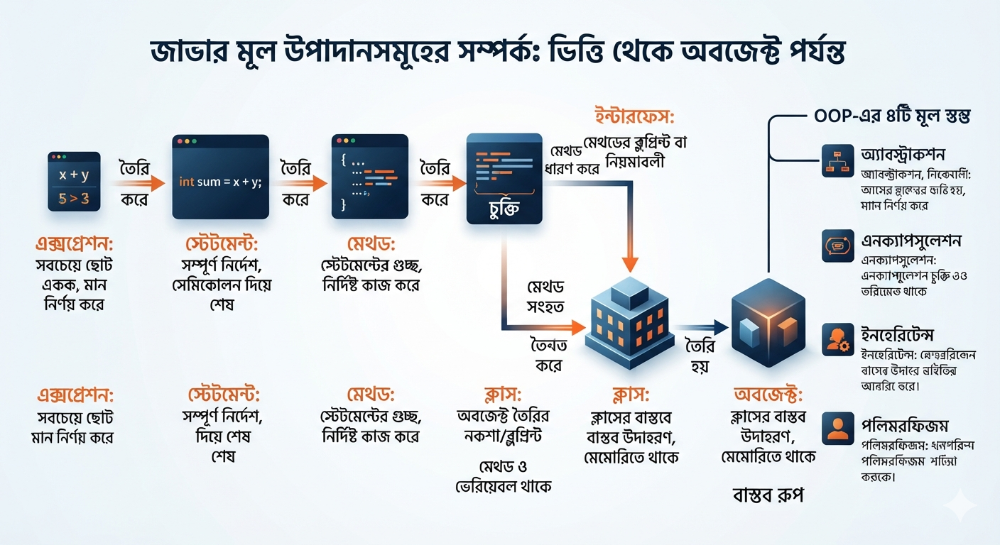
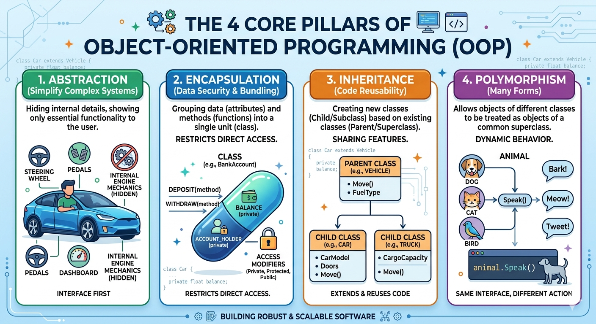

# Relations in Java at a glance

জাভার মূল কনসেপ্টগুলোকে (Core Concepts) একটি সহজ শিকল বা সম্পর্কের (Relationship) মাধ্যমে নিচে ব্যাখ্যা করা হলো:

## জাভার মূল উপাদানগুলোর সম্পর্ক (The Core Relationship)

Expression → তৈরি করে → Statement → তৈরি করে → Method → তৈরি করে → Interface / Class → তৈরি করে → Object

------------------------------
## ১. Expression (এক্সপ্রেশন)

* সহজ কথা: জাভার সবচেয়ে ছোট একক যা একটি নির্দিষ্ট মান (Value) হিসাব করে বের করে।
* উদাহরণ: x + y বা 5 > 3।

## ২. Statement (স্টেটমেন্ট)

* সহজ কথা: এটি জাভার একটি সম্পূর্ণ নির্দেশ বা বাক্য (Command), যা সেমিকোলন (;) দিয়ে শেষ হয়। অনেকগুলো এক্সপ্রেশন মিলে একটি স্টেটমেন্ট হতে পারে।
* উদাহরণ: int sum = x + y; (এটি একটি সম্পূর্ণ কাজ)।

## ৩. Method / Function (মেথড)

* সহজ কথা: এটি একগুচ্ছ স্টেটমেন্ট-এর ব্লক, যা নির্দিষ্ট একটি কাজ সম্পন্ন করে।
* উদাহরণ: void calculateSum() { ... } (এর ভেতরে অনেকগুলো স্টেটমেন্ট থাকে)।

## ৪. Interface (ইন্টারফেস)

* সহজ কথা: এটি মেথডগুলোর নামের তালিকা বা ব্লুপ্রিন্ট। এখানে কোনো কাজ কীভাবে হবে তা বলা থাকে না, শুধু কী কী মেথড থাকবে তা বলা থাকে।
* সম্পর্ক: এটি ক্লাসের জন্য একটি নিয়ম বা চুক্তি তৈরি করে।

## ৫. Class (ক্লাস)

* সহজ কথা: এটি ইন্টারফেসের নিয়মগুলো মেনে মেথডগুলোর বাস্তব রূপ দেয়। এটি হলো অবজেক্ট তৈরি করার মূল নকশা বা ব্লুপ্রিন্ট।
* সম্পর্ক: মেথডগুলো ক্লাসের ভেতরে থাকে। আবার ক্লাস চাইলে ইন্টারফেসকে ইমপ্লিমেন্ট (Implement) করতে পারে।

## ৬. Object (অবজেক্ট)

* সহজ কথা: ক্লাসের নকশা দেখে তৈরি করা বাস্তব উপাদান, যা মেমোরিতে জায়গা নেয় এবং সত্যি সত্যি কাজ করে।
* সম্পর্ক: ক্লাস না থাকলে অবজেক্ট তৈরি করা অসম্ভব।

------------------------------
## অবজেক্ট অরিয়েন্টেড (OOP) ৪টি স্তম্ভের সহজ সম্পর্ক:
জাভার এই অবজেক্টগুলোকে নিয়ন্ত্রণ করার জন্য ৪টি মূল নীতি কাজ করে:

* Abstraction (অ্যাবস্ট্রাকশন): ইন্টারফেসের মতো শুধু প্রয়োজনীয় জিনিস বাইরে দেখানো, ভেতরের জটিল কোড লুকিয়ে রাখা।
* Encapsulation (এনক্যাপসুলেশন): মেথড এবং ভেরিয়েবলগুলোকে ক্লাসের একটি নিরাপদ বাক্সে (Capsule) বন্দি করা।
* Inheritance (ইনহেরিটেন্স): এক ক্লাসের বৈশিষ্ট্য (কোড) অন্য ক্লাসে পুনরায় ব্যবহার করা।
* Polymorphism (পলিমরফিজম): একই মেথড বা অবজেক্টের পরিস্থিতি অনুযায়ী ভিন্ন ভিন্ন রূপ ধারণ করা। 

