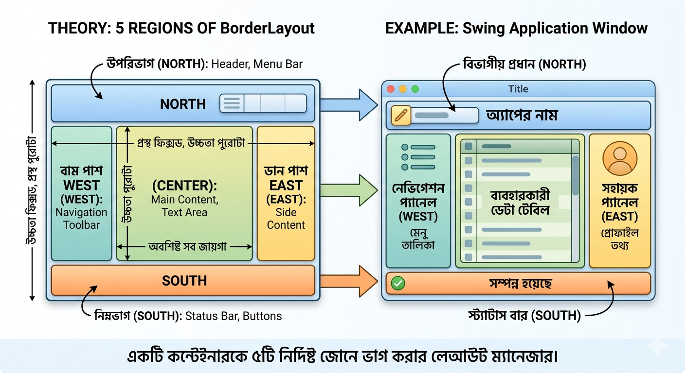

# BorderLayouts

BorderLayout হলো জাভা সুইং (Java Swing)-এর একটি লেআউট ম্যানেজার, যা একটি উইন্ডো বা কন্টেইনারকে ৫টি নির্দিষ্ট এলাকায় বা জোনে ভাগ করে দেয়।
সহজে বোঝার জন্য এটিকে একটি মানচিত্র বা কম্পাসের দিকনির্দেশের সাথে তুলনা করতে পারেন।

## ৫টি প্রধান এলাকা (Zones):
১. NORTH (উত্তর): উইন্ডোর একেবারে উপরে থাকে। সাধারণত এখানে মেনুবার, টাইটেল বা হেডার রাখা হয়।
২. SOUTH (দক্ষিণ): উইন্ডোর একেবারে নিচে থাকে। সাধারণত এখানে স্ট্যাটাস বার, ফুটনোট বা সাবমিট বোতাম রাখা হয়।
৩. EAST (পূর্ব): উইন্ডোর ডানপাশে থাকে। সাইডবার বা নেভিগেশন লিঙ্কের জন্য এটি ব্যবহার করা হয়।
৪. WEST (পশ্চিম): উইন্ডোর বামপাশে থাকে। এখানেও টুলবার বা সাইড মেনু রাখা যায়।
৫. CENTER (কেন্দ্র): উইন্ডোর একদম মাঝখানের বড় এলাকাটি। অ্যাপ্লিকেশনের মূল কনটেন্ট (যেমন: টেক্সট এরিয়া, মেইন ইমেজ বা টেবিল) এখানে বসে।
------------------------------
## প্রধান বৈশিষ্ট্যসমূহ:

* যেকোনো একটি উপাদান: প্রতিটা এলাকায় আপনি কেবল একটি মাত্র কম্পোনেন্ট (যেমন: একটি JButton বা একটি JLabel) বসাতে পারবেন।
* সেন্টার (Center) হলো রাজা: মাঝখানের CENTER এলাকাটি সবচেয়ে বেশি জায়গা নেয়। বাকি চারপাশের (North, South, East, West) এলাকাগুলো শুধু তাদের ভেতরের উপাদানের সাইজ অনুযায়ী জায়গা নেয়, আর বাকি সব খালি জায়গা CENTER নিজে দখল করে নেয়।
* অটো-রিসাইজ: ব্যবহারকারী যখন উইন্ডোটি টেনে বড় বা ছোট করবে, তখন ভেতরের উপাদানগুলো নিজে থেকেই নতুন সাইজের সাথে খাপ খাইয়ে নেয়।

------------------------------
## কোডের একটি সহজ উদাহরণ:

```java
import javax.swing.*;import java.awt.*;
public class BorderLayoutExample {
    public static void main(String[] args) {
        JFrame frame = new JFrame("BorderLayout সহজে বুঝুন");
        frame.setDefaultCloseOperation(JFrame.EXIT_ON_CLOSE);
        frame.setSize(400, 300);

        // ফ্রেমের লেআউট সেট করা (ডিফল্টভাবেই JFrame-এ BorderLayout থাকে)
        frame.setLayout(new BorderLayout());

        // ৫টি এলাকায় ৫টি বোতাম যোগ করা
        frame.add(new JButton("উপর (NORTH)"), BorderLayout.NORTH);
        frame.add(new JButton("নিচে (SOUTH)"), BorderLayout.SOUTH);
        frame.add(new JButton("বাম (WEST)"), BorderLayout.WEST);
        frame.add(new JButton("ডান (EAST)"), BorderLayout.EAST);
        frame.add(new JButton("মাঝখানে (CENTER)"), BorderLayout.CENTER);

        frame.setVisible(true);
    }
}
```
------------------------------
## একটি গুরুত্বপূর্ণ ট্রিক:
আপনি যদি কোনো একটি এলাকায় একাধিক কম্পোনেন্ট (যেমন একসাথে ৩টি বাটন) বসাতে চান, তবে সরাসরি তা করা যাবে না। এর সমাধান হলো—প্রথমে একটি JPanel তৈরি করে তার ভেতর বাটনগুলো রাখুন, তারপর সেই পুরো প্যানেলটিকে BorderLayout-এর যেকোনো একটি এলাকায় (যেমন SOUTH) বসিয়ে দিন।
আপনি কি দেখতে চান কীভাবে BorderLayout এবং JPanel একসাথে ব্যবহার করে একটি সুন্দর প্রফেশনাল ইউজার ইন্টারফেস (UI) তৈরি করা যায়?


## চিত্র থেকে যা বুঝবেন:



* NORTH (উত্তর): এটি সবসময় উইন্ডোর ঠিক ওপরের পুরো অংশ জুড়ে থাকে।
* SOUTH (দক্ষিণ): এটি উইন্ডোর একেবারে নিচের পুরো অংশটি নিয়ে থাকে।
* WEST ও EAST (পশ্চিম ও পূর্ব): এরা যথাক্রমে বাম ও ডান দিকে থাকে। তবে লক্ষ্য করুন, এরা কিন্তু ওপর-নিচ জুড়ে পুরোটা থাকে না, উত্তর আর দক্ষিণের মাঝখানের বাকি অংশটুকু দখল করে।
* CENTER (কেন্দ্র): এটি একেবারে মাঝখানে অবস্থান করে এবং চারপাশের সব জায়গা বাদ দেওয়ার পর বাকি থাকা সবচেয়ে বড় অংশটি নিজে একাই ব্যবহার করে।
* 

আপনি চাইলে কোনো এলাকা খালিও রাখতে পারেন। যেমন আপনি যদি EAST বা WEST-এ কিছু না রাখেন, তবে CENTER স্বয়ংক্রিয়ভাবে বড় হয়ে সেই খালি জায়গাগুলোও পূরণ করে নেবে।
আপনি কি BorderLayout-এর সাথে JPanel যুক্ত করে একাধিক বোতাম বা ইনপুট বক্স সাজানোর একটি বাস্তব কোড প্রজেক্ট দেখতে চান?

