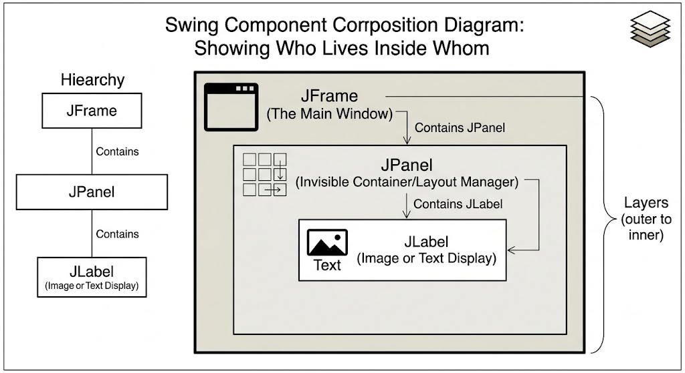

```java

import javax.swing.*;
import javax.swing.border.Border;
import java.awt.*;

public class Main {
    public static void main(String[] args) {

        JFrame frame = new JFrame(); // creates a frame

        frame.setSize(420, 420); // sets the x-dimension, and y-dimension of frame;
        frame.setVisible(true); // make the frame visible
        frame.setTitle("JFRAME Tutorial"); // title of the frame
        frame.setDefaultCloseOperation(JFrame.EXIT_ON_CLOSE);


        // JLabel
        JLabel label = new JLabel();
        label.setText("A button for happiness");
        frame.add(label);

        ImageIcon img = new ImageIcon("icon.png");
        Border border = BorderFactory.createLineBorder(Color.cyan, 10, true); // border around the frame

        label.setIcon(img);
        label.setHorizontalTextPosition(JLabel.CENTER); // set text LEFT, CENTER, RIGHT of the imageIcon
        label.setVerticalTextPosition(JLabel.BOTTOM); // vertically set TOP, CENTER, BOTTOM
        label.setForeground(Color.magenta); // set font color
        label.setFont(new Font("MV Boli", Font.PLAIN, 20)); // set font and size and format
        label.setIconTextGap(20); // set gap between text and imageIcon
        label.setBackground(new Color(255, 100, 50));
        label.setOpaque(true);
        label.setBorder(border);


//        label.setBounds(100, 100, 150,150); // set x, y position within frame as well as  dimension

        // set  horizontal and vertical alignment
        label.setVerticalAlignment(JLabel.CENTER);
        label.setHorizontalAlignment(JLabel.CENTER);

//        frame.setLayout(null);

        // add this  pack method at the bottom of another method
        frame.pack();

//        MyFrame myFrame = new MyFrame();
        // new MyFrame();  / this will also work. if no need future changes.


    }
}

```


