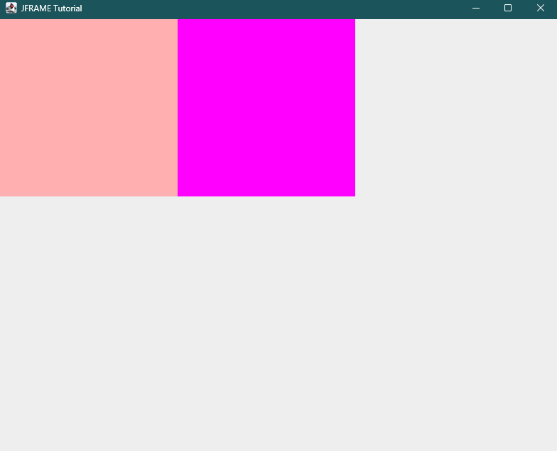

```java
import javax.swing.*;
import java.awt.*;

public class Main {
    public static void main(String[] args) {

        ImageIcon icon = new ImageIcon("thumbs.png");

        JLabel label = new JLabel();
        label.setText("This is a label");
        label.setVerticalAlignment(JLabel.TOP);
        label.setHorizontalAlignment(JLabel.RIGHT);


        // 2. Extract, scale, and repackage into a new ImageIcon
        ImageIcon resizedIcon = new ImageIcon(icon.getImage().getScaledInstance(50, 50, Image.SCALE_SMOOTH));
        // 3. Apply to a component
        label.setIcon(resizedIcon);


        // JPanel = a GUI component that functions as a container to hold other components

        JPanel redPanel = new JPanel();
        redPanel.setBackground(Color.pink);
        redPanel.setBounds(0, 0, 250, 250);

        JPanel magentaPanel = new JPanel();
        magentaPanel.setBackground(Color.MAGENTA);
        magentaPanel.setBounds(250, 0, 250, 250);

        JFrame frame = new JFrame(); // creates a frame

        frame.setSize(800, 800); // sets the x-dimension, and y-dimension of frame;
        frame.setVisible(true); // make the frame visible
        frame.setTitle("JFRAME Tutorial"); // title of the frame
        frame.setDefaultCloseOperation(JFrame.EXIT_ON_CLOSE);
        frame.setLayout(null);
        frame.add(redPanel);
        frame.add(magentaPanel);


        JOptionPane.showMessageDialog(null, "Hello");


        // JPanel BorderLayouts
        magentaPanel.setLayout(new BorderLayout()); // make any child component to left


        // adding icon / image in panel:
        magentaPanel.add(label);

    }
}
```