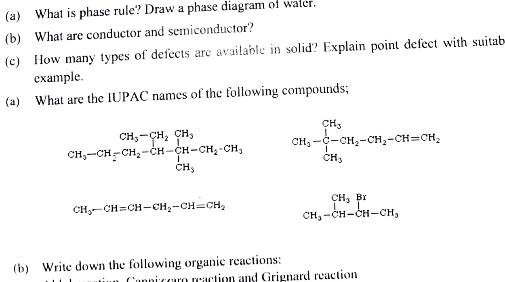

# CHE2122 - Chemistry

## Atomic Structure and Periodicity

### Term 161

- **Q1(a) [4]:** Describe the postulates of Bohr's theory of atom.
- **Q1(b) [4]:** What is ionization energies and electronegativity.
- **Q1(c) [6]:** Explain the periodicity of atomic volume and valency.

### Term 171

- **Q1(a) [3+5]:** Define orbit and orbital. Are 2P, 3f and 4S² orbital possible? Explain your answer.
- **Q1(b) [6]:** What is the maximum number of electrons that can be present in the principal level for which n = 4?
- **Q5(c) [5]:** Show the hydrogen bonding in acetic acid molecules and find Isotope, Isobar, Isotone from the following atoms: ${}^{12}_{6}C$, ${}^{14}_{6}C$, ${}^{28}_{14}Si$, ${}^{27}_{13}Al$ and ${}^{13}_{6}C$.
- **Q7(a) [8]:** Write short notes on the followings: (i) Noble gasses; (ii) Hydrogen bonding; (iii) Normality and pH of solutions; (iv) Diamagnetism and paramagnetism.

### Term 181

- **Q1(a) [3]:** What is an orbital?
- **Q1(b) [3]:** Write down the rules of ground state electron configuration of elements.
- **Q1(c) [3]:** Write the name of the orbital for which the quantum numbers are $n=2$ and $l=1$.
- **Q1(d) [5]:** Write the ground state electron configuration of element Na.
- **Q3(a) [2+4]:** What is ionization energy? Explain "ionization energy increases across a period".
- **Q3(b) [2+2]:** What are Nobel gases? What are their properties?
- **Q5(a) [2+3]:** What are isotopes and isobars? Choose isotopes and isobars from the following list.
- **Q7(c) [4]:** Why does the electron affinity decrease down a group except fluorine?

### Term 201

- **Q1(a) [4]:** Describe Rutherford's atomic model and mention its weakness.
- **Q1(b) [4]:** Write down postulates of Bohr's theory.
- **Q1(c) [6]:** Find out the number of orbitals for which the following sets of quantum numbers is possible $n=3$, $l=2$ and $m=(+2)$.
- **Q2(a) [5]:** Write down the ground state electron configuration of following elements: (i) C(6); (ii) S(16); (iii) Mo(42); (iv) Ni(28); (v) Na(11).
- **Q2(b) [6]:** Explain "electron affinity of an element decreases down a group". Why is the value of electron affinity for fluorine out of line?
- **Q2(c) [3]:** Why does the ionization energy of Na is lower than Li?

### Term 211

- **Q1(a) [5]:** Define isotope and isobar with example.
- **Q1(b) [2+2]:** What is an orbital? Define Hund's rule.
- **Q1(c) [5]:** Mention the significance of quantum numbers.
- **Q2(a) [5]:** Write down the ground state electron configuration of the following elements: (i) C(6); (ii) S(16); (iii) Mo(42); (iv) Ni(28); (v) Na(11).
- **Q2(b) [2+4]:** What is ionization energy? Why does the ionization energy decrease down a group in the periodic table?
- **Q2(c) [3]:** Why is the electron affinity of Be negative?

## Chemical Bonding and Molecular Structure

### Term 161

- **Q3(a) [9]:** What is co-ordinate bond? Write the electronic formulae of the following compounds: (i) CO; (ii) H₂O₂; (iii) BF₃; (iv) C₂H₂.
- **Q3(b) [5]:** Explain the following: (i) Ice floats on water; (ii) Water exists as a liquid under the ordinary conditions while H₂S exists as gas under the same conditions.

### Term 171

- **Q5(c) [5]:** Show the hydrogen bonding in acetic acid molecules.
- **Q7(a) [8]:** Write short notes on Noble gasses, Hydrogen bonding, Normality and pH of solutions, Diamagnetism and paramagnetism.

### Term 181

- **Q3(c) [6]:** Write the electronic formulae of the following compounds: (i) C₂H₆; (ii) BF₃; (iii) PCl₅; (iv) H₂O₂.
- **Q4(a) [4]:** Define valance band, conduction band and forbidden band?
- **Q4(b) [4]:** How many types of overlapping of covalent bond are seen?
- **Q4(c) [6]:** Draw and explain the molecular orbitals of N₂ and O₂ according to MOT.

### Term 201

- **Q3(b) [5]:** Draw and explain the molecular orbitals of O₂ according to MOT.
- **Q3(c) [6]:** Write the Lewis structure of the following molecules: (i) H₂O; (ii) NH₃; (iii) C₂H₂; (iv) BeCl₂; (v) CO₂; (vi) HF.
- **Q4(a) [4]:** Compare the properties of ionic and covalent compounds.
- **Q4(b) [3x2]:** Explain the following terms: (i) Hydrogen bonding; (ii) Metallic bonding; (iii) Water has maximum density at 4°C.

### Term 211

- **Q3(a) [4]:** How many types of overlapping of covalent bonds are seen?
- **Q3(b) [2+3]:** Define co-ordination covalent bond. Show every type of bond available in NH₄Cl.
- **Q3(c) [5]:** Draw and explain the molecular orbitals of O₂ according to MOT.

## Defects in Solids and Semiconductors

### Term 161

- **Q2(a) [4]:** What are the conductors, insulators and semiconductors?
- **Q2(b) [10]:** Explain n-type and p-type semiconductors.

### Term 171

- **Q2(a) [2+6]:** What are semiconductors? How does semiconductivity arise?
- **Q2(b) [6]:** What do you mean by valance band, conduction band and forbidden band?
- **Q5(a) [2+2]:** What are defects in solid/crystal? Write some importance of crystal defects.
- **Q5(b) [3+3]:** How many types of imperfections in crystalline solids? Give their names and explain point defects with suitable example.

### Term 201

- **Q3(a) [4]:** What are semiconductors? What types of defects are present in stoichiometric compounds?

### Term 211

- **Q6(b) [2+2]:** What are conductor and semiconductor?
- **Q6(c) [2+3]:** How many types of defects are available in solid? Explain point defect with suitable example.

## Selective Organic Reactions

### Term 161

- **Q5(a) [6]:** Define carbonyl compound. How does acetaldehyde react with the following reagents? (i) CH₃MgI; (ii) C₆H₅NHNH₂.
- **Q5(b) [8]:** Write a note on (i) Aldol condensation; (ii) Cannizzaro reaction; (iii) Nitration reaction; (iv) Friedel-Craft Alkylation.

### Term 171

- **Q6(a) [2+4]:** Define carbonyl compounds. How can you chemically distinguish between aldehyde and ketones?
- **Q6(b) [8]:** Explain the following terms: (i) Markovnikov rule; (ii) Aldol condensation reaction; (iii) Halogenations reaction.

### Term 181

- **Q7(a) [4]:** What are alcohol and aldehyde compounds?
- **Q7(b) [6]:** Write down the following organic reaction: (i) aldol reaction; (ii) cannizzaro reaction; (iii) haloform reaction; (iv) Nitration reaction.

### Term 201

- **Q7(a) [3]:** What are alcohol and aldehyde compounds?
- **Q7(b) [6]:** Write down the following organic reactions: Aldol reaction, Cannizzaro reaction and Grignard reaction.
- **Q7(c) [3]:** How can you convert primary amide to primary amine?

### Term 211

- **Q7(a) [4]:** What are the IUPAC names of the following compounds:

  

- **Q7(b) [6]:** Write down the following organic reactions: Aldol reaction, Cannizzaro reaction and Grignard reaction.

## Solutions and Phase Rule

### Term 161

- **Q6(b) [6]:** Explain the following terms: (i) Normality; (ii) Molarity; (iii) pH of Solutions.
- **Q6(c) [4]:** Calculate the molality of a sulfuric acid solution containing 24.4g of sulfuric acid in 198g of water. The molar mass of sulfuric acid is 98.08.

### Term 171

- **Q7(a) [8]:** Write short notes on Normality and pH of solutions.
- **Q7(b) [6]:** Show how the pH scale was established from ionic product of water.

### Term 181

- **Q6(a) [4]:** Explain the terms: (i) Normality; (ii) Molarity and (iii) Molality of a solution.
- **Q6(b) [6]:** Calculate the normality and molarity of a solution containing 20.7g of K₂CO₃ dissolved in 500ml of the given solution.
- **Q6(c) [1+3]:** What is meant by pH? Calculate the pH of 0.001N HCl assuming complete ionization of HCl.

### Term 201

- **Q4(c) [4]:** Draw the phase diagram of the water system and find the degrees of freedom in every region of this diagram.
- **Q6(b) [4]:** State and derive the Raoult's law for dilute solution.
- **Q6(c) [4]:** 5.3 g of Na₂CO₃ is dissolved in 1 Kg of water. If the density of the solution is 0.997gmL⁻¹, calculate the molarity and normality of the solution.
- **Q7(d) [2]:** If a solution has a pH of 5.50 at 25°C, calculate its $[OH^-]$.

### Term 211

- **Q4(b) [2+2]:** What are colligative properties? Why are they called colligative properties?
- **Q4(c) [1+5]:** What is the pH? Show that $pK_w=pH+pOH$.
- **Q6(a) [2+3]:** What is phase rule? Draw a phase diagram of water.

## Thermochemistry and Chemical Kinetics

### Term 161

- **Q4(a) [6]:** Define order of a reaction, molecularity of a reaction and half life period.
- **Q4(b) [5]:** Show that for first order reactions the half life period is independent of the initial concentration.
- **Q4(c) [3]:** The half-life of a substance in a first order reaction is 20 minutes. Calculate the rate constant.
- **Q6(a) [4]:** What are exothermic and endothermic reactions?

### Term 171

- **Q3(a) [4]:** Define order and molecularity of a reaction.
- **Q3(b) [6]:** Derive the rate equation for first order reaction.
- **Q3(c) [4]:** The rate constant for a first order reaction is $1.54\times10^{-3}\,s^{-1}$. Calculate its half-life period.
- **Q4(c) [4]:** State the laws of thermochemistry.

### Term 181

- **Q2(a) [3]:** What is the rate of reaction?
- **Q2(b) [4+3]:** Describe the equation to calculate the rate constant of a 1st order reaction and show the half-life of a 1st order reaction is independent of initial concentration of reactants.
- **Q2(c) [4]:** Compound A decomposes to form B and C, the reaction is 1st order. At 25°C the rate constant for the reaction is $0.45s^{-1}$. What is the half-life of A at 25°C?

### Term 201

- **Q6(a) [6]:** Derive mathematical expression for the rate constant of a reaction (A -> Products) of the first order.

### Term 211

- **Q7(c) [4]:** Write the laws of thermochemistry.

## Chemical Equilibria, pH, and Electrical Properties

### Term 161

- **Q7(a) [5]:** What is reversible reactions and equilibrium constant?
- **Q7(b) [5]:** Establish a relationship between $K_p$ and $K_c$.
- **Q7(c) [4]:** Write a short note on "Le Chatelier's Principle".

### Term 171

- **Q4(a) [5]:** Why chemical equilibrium is called a dynamic equilibrium?
- **Q4(b) [5]:** Derive the equilibrium constant ($K_c$) expression for the Schematic reaction $mM+nN=xX+yY$.

### Term 181

- **Q5(b) [2+3]:** What is equilibrium law? Establish the relation between $K_p$ and $K_c$.
- **Q5(c) [4]:** The value of $K_p$ at 20°C for the reaction $2NO(g)+Cl_2(g)\rightleftharpoons2NOCl(g)$ is $1.9\times10^{-3}\,atm^{-1}$. Calculate the value of $K_c$ at the same temperature.

### Term 201

- **Q5(a) [5]:** What is equilibrium constant? Write down the characteristics of chemical equilibrium.
- **Q5(b) [4]:** Show the relation between $K_c$ and $K_p$.
- **Q5(c) [5]:** Calculate the concentration of $OH^-$ ions from water at 298K in 0.02M HCl solution.

### Term 211

- **Q4(a) [4]:** State the law of mass action.
- **Q5(a) [1+4]:** What is an equilibrium constant? Write down the characteristics of chemical equilibrium.
- **Q5(b) [4]:** Show the relation between $K_p$ and $K_c$.
- **Q5(c) [5]:** Calculate the concentration of $OH^-$ ions from water at 298K in 0.02M HCl solution.

