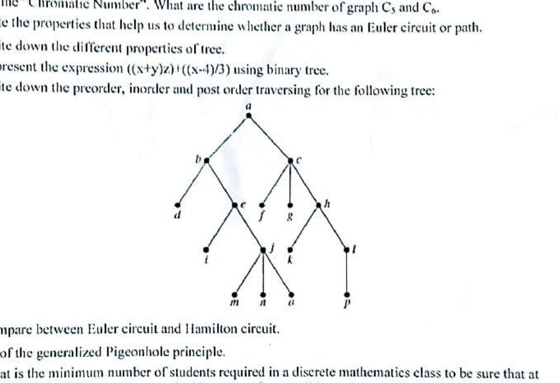
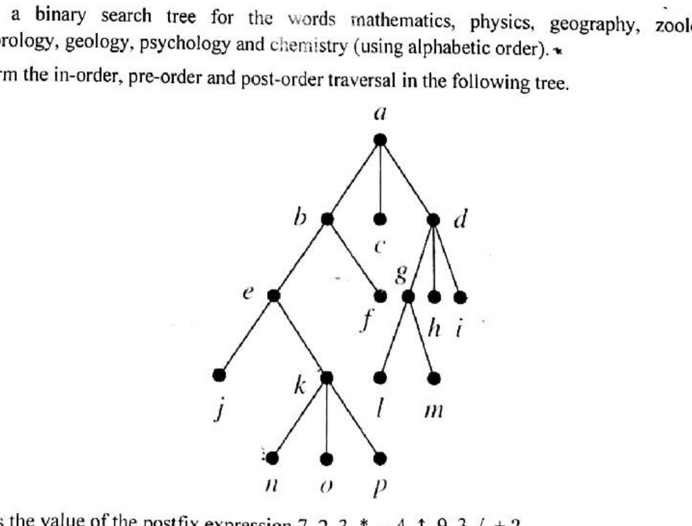
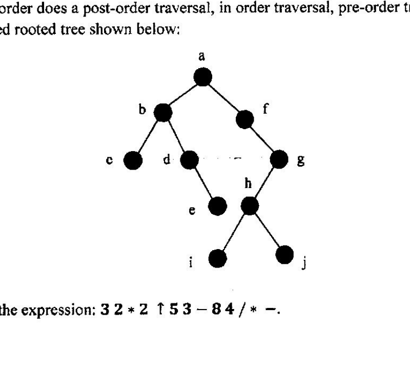
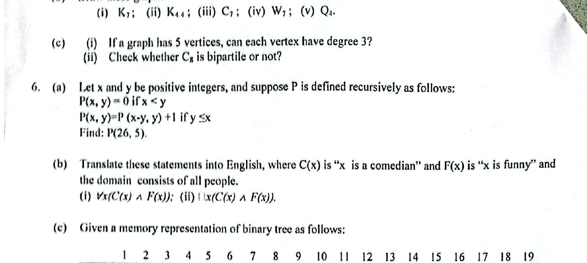
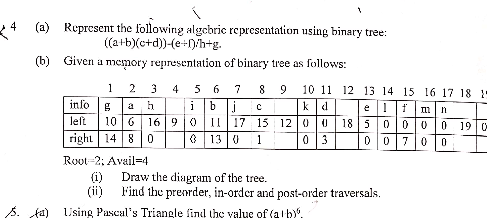
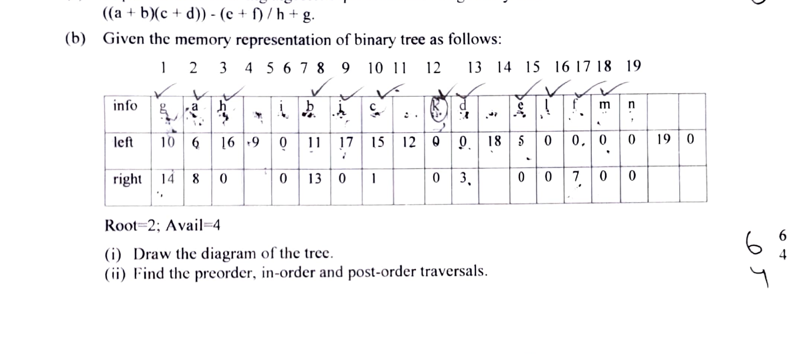

# CSE2133 - Discrete Mathematics

## Logic and Proofs

### Term 151

- **Q1(a):** Let p, q, and r be the propositions: p: You get an A on the final exam. q: You do every exercise in this book. r: You get an A in this class. Write these propositions using p, q, and r and logical connectives:
  1. To get an A in this class, it is necessary for you to get an A on the final.
  2. You get an A on the final, but you don't do every exercise in this book; nevertheless, you get an A in this class.
  3. Getting an A on the final and doing every exercise in this book is sufficient for getting an A in this class.
- **Q1(b):** Let p and q be the propositions: p: The election is decided. q: The votes have been counted. Express each of these compound propositions as an English sentence: (i) $p\to q$; (ii) $p\leftrightarrow q$; (iii) $p\oplus q$.
- **Q1(c):** Show that each of these conditional statements is a tautology by using truth tables: (i) $p\to(p\lor q)$; (ii) $\neg p\to(p\to q)$; (iii) $(p\land q)\to(p\to q)$.
- **Q1(d):** Define the terms with appropriate examples - "Tautology" and "Contradiction".
- **Q1(e):** Show that $(p\to q)$ and $\neg p\lor q$ are logically equivalent.
- **Q3(a):** Define and distinguish between universal quantifier and existential quantifier. Briefly discuss about the negation of the quantifiers using example.
- **Q3(b):** Explain predicates and quantifiers with necessary examples.
- **Q3(c):** Convert the following statement into logical expression: (i) Everyone has exactly one best friend. (ii) Every student of your university has a computer or has a friend who has a computer. (iii) If somebody is female and is a parent, then this person is someone's mother.

### Term 161

- **Q1(a) [3]:** Consider the following propositions: p: You can send an email. q: Your inbox is full. r: New emails are stored in your inbox. Translate the following sentences into logical expressions: (i) You cannot send an email if and only if your inbox is full. (ii) New emails are stored in your inbox unless your inbox is full.
- **Q1(b) [3]:** Consider the following propositions: p: It is raining. q: It is windy. r: The courts are open for play. s: We study today. Translate the following logical expressions into English sentences: (i) $\neg p\land\neg q\to r$; (ii) $\neg s\leftrightarrow r$.
- **Q1(c) [4]:** Show that $p\to(q\to r)\equiv(p\land q)\to r$: (i) using the truth table; (ii) developing a series of logical equivalences.
- **Q1(d) [4]:** Translate each of these statements into logical expressions using predicates, quantifiers and logical connectives: (i) No one is perfect. (ii) Everyone is your friend and is perfect. (iii) One of your friends is perfect. (iv) All of your friends are perfect.
- **Q3(a) [1+4]:** Name the basic methods to prove theorem. Define vacuous proof and trivial proof with example.
- **Q3(b) [3]:** Prove the following statements: (i) If $3n+2$ is odd, then n is odd. (ii) If n is odd, then $n^2$ is odd.

### Term 171

- **Q1(a) [1+3]:** Define logical equivalence. Show that the propositions $p\lor(q\land r)$ and $(p\lor q)\land(p\lor r)$ are logically equivalent.
- **Q1(b) [4]:** Show that $(p\land q)\to(p\lor q)$ is a tautology.
- **Q1(c) [4]:** Let $A=\{1,2,3,4,5\}$. Determine the truth value of each of the following statement with explanation: (i) $(\exists x\in A)(x+3=10)$; (ii) $(\forall x\in A)(x+3<10)$; (iii) $(\exists x\in A)(x+3<5)$; (iv) $(\forall x\in A)(x+3<7)$.
- **Q1(d) [2]:** Prove that $\neg(p\land q)\equiv\neg p\lor\neg q$.

### Term 181

- **Q1(a):** Define and distinguish between universal quantifier and existential quantifier. Briefly discuss about the negation of the quantifiers using example.
- **Q1(b):** Explain predicates and quantifiers with necessary examples.
- **Q1(c):** Convert the following statement into logical expression: (i) Everyone has exactly one best friend. (ii) Every student of your university has a computer or has a friend who has a computer. (iii) If somebody is female and is a parent, then this person is someone's mother.
- **Q4(b):** State the converse, contrapositive, and inverse of each of the following implications: (i) If it snows tonight, then I will stay at home. (ii) I go out today if it is a sunny summer day.

### Term 191

- **Q1(a) [2+2]:** Define Discrete mathematics. List out the problems that can be solved using Discrete Mathematics.
- **Q1(b) [5]:** What is proposition? Let p be the statement "Maria learns discrete mathematics." and q the statement "Maria will find a good job." (i) Express $p\to q$ as a statement in English. (ii) Express $p\leftrightarrow q$ as a statement in English. (iii) Show the truth table of $p\to q$ and $p\leftrightarrow q$.
- **Q1(c) [3+2]:** Define tautology, contradiction and contingency. Show that $\neg p\lor q$ and $p\to q$ are logically equivalent.
- **Q2(b) [3]:** Define basic logic operations with example.
- **Q2(c) [5]:** Translate the following English statements into Logical Expressions using predicates and quantifiers: (i) "Some students in the class has visited Cairo". (ii) "Every student in the class has visited either Aswan or Cairo".
- **Q3(a) [6]:** Prove that the argument (in context of tautology) $p\to q, q\to r\vdash p\to r$ is valid.
- **Q3(b) [8]:** Let $A=\{1,2,3,4,5\}$. Determine the truth value of each of the following statement with explanation: (i) $(\exists x\in A)(x+3=10)$; (ii) $(\forall x\in A)(x+3<10)$; (iii) $(\exists x\in A)(x+3<5)$; (iv) $(\forall x\in A)(x+3\le7)$.
- **Q6(b) [4]:** Translate these statements into English, where C(x) is "x is a comedian" and F(x) is "x is funny" and the domain consists of all people: (i) $\forall x(C(x)\land F(x))$; (ii) $\exists x(C(x)\land F(x))$.

### Term 201

- **Q1(a) [5]:** Define Proposition and propositional logic. Using truth table show that the propositions $\neg(p\land q)$ and $\neg p\lor\neg q$ are logically equivalent.
- **Q1(c) [4]:** Find the converse, contrapositive and inverse of the implication: "If it is holiday, then there are crowd in the shopping mall".
- **Q3(b) [4]:** Let $A=\{1,2,3,4,5\}$. Determine the truth value of each of the following statement with explanation: (i) $(\exists x\in A)(x+3=10)$; (ii) $(\forall x\in A)(x+3<10)$; (iii) $(\exists x\in A)(x+3<5)$; (iv) $(\forall x\in A)(x+3<7)$.

### Term 211

- **Q1(a) [1+2]:** Define discrete mathematics. List out the problems that can be solved using discrete mathematics.
- **Q1(b) [5]:** Let p be "It is cold" and let q be "It is raining". Give a simple verbal sentence which describes each of the following propositions: (i) $\neg p$, (ii) $p\land q$, (iii) $p\lor q$, (iv) $p\to q$, (v) $p\leftrightarrow q$.
- **Q1(c) [4+6]:** Let p be "Ram reads the Newsweek", let q be "Ram reads the Times", and let r be "Ram reads the Sun". Write each of the following in symbolic form: (i) Ram reads Newsweek or the Sun, but not Times. (ii) Ram reads Newsweek and the Times, or he does not read Newsweek and the Sun. (iii) It is not true that Ram reads Newsweek but not Times.
- **Q2(a) [1+4]:** Define tautology. Verify that the proposition $p\lor\neg(p\land q)$ is tautology.
- **Q2(b) [6]:** Determine the converse, inverse and contrapositive of the following statement: "If Ram is a poet, then he is poor."
- **Q2(c) [3]:** Write the negation of the statement as simple as possible: If she works, she will earn money.
- **Q4(a) [6]:** Let $A=\{1,2,3,4,5\}$. Determine the truth value of each of the following statement and explain why: (i) $(\exists x\in A)(x+3=10)$; (ii) $(\forall x\in A)(x+3<10)$; (iii) $(\exists x\in A)(x+3<5)$.

## Sets and Functions

### Term 151

- **Q2(a):** Show that if A, B and C are sets, then $\overline{A\cap B\cap C}=\bar A\cup\bar B\cup\bar C$: (i) by showing each side is a subset of the other side; (ii) using a membership table.
- **Q2(d):** Find the domain and range of these functions: (i) the function that assigns to each bit string the number of ones in the string minus the number of zeros; (ii) the function that assigns to each bit string twice the number of zeros; (iii) the function that assigns the number of bits left over when a bit string is split into bytes (which are blocks of 8 bits); (iv) the function that assigns to each positive integer the largest perfect square not exceeding this integer.
- **Q2(e):** Suppose that Hilbert's Grand Hotel is fully occupied on the day the hotel expands to a second building which also contains a countably infinite number of rooms. Show that the current guests can be spread out to fill every room of the two buildings of the hotel.

### Term 161

- **Q2(a):** Show that if A, B and C are sets, then $\overline{A\cap B\cap C}=\bar A\cup\bar B\cup\bar C$: (i) by showing each side is a subset of the other side; (ii) using a membership table.
- **Q2(d) [4]:** Find the domain and range of these functions: (i) the function that assigns to each bit string the number of ones in the string minus the number of zeros; (ii) the function that assigns to each bit string twice the number of zeros; (iii) the function that assigns the number of bits left over when a bit string is split into bytes; (iv) the function that assigns to each positive integer the largest perfect square not exceeding this integer.
- **Q2(e) [2]:** Suppose that Hilbert's Grand Hotel is fully occupied on the day the hotel expands to a second building which also contains a countably infinite number of rooms. Show that the current guests can be spread out to fill every room of the two buildings of the hotel.

### Term 171

- **Q2(a) [6]:** Let $A=\{a,b,c\}$, $B=\{1,2,3\}$, $C=\{w,x,y,z\}$, $D=\{4,5,6\}$ and the functions $f:A\to B$, $g:B\to C$, and $h:C\to D$ be determined as $f=\{(a,2),(b,1),(c,2)\}$, $g=\{(1,y),(2,x),(3,w)\}$ and $h=\{(x,4),(y,6),(z,4),(w,5)\}$. (i) Determine if each function is onto, one-to-one. Explain. (ii) Find the composition function $h\circ g\circ f$.
- **Q2(b) [4]:** Prove that (i) $(A\cup B)\cap(A\cup B')=A$; (ii) $(A\cup B)\setminus(A\cap B)=(A\setminus B)\cup(B\setminus A)$.

### Term 181

- **Q2(a):** Define Set, Power Set and Proper Set. Using membership table show that $\overline{A\cup(B\cap C)}=(\bar C\cup\bar B)\cap\bar A$. Assume that A, B and C are sets.
- **Q2(b):** Suppose that $A=\{2,4,6\}$, $B=\{2,6\}$, $C=\{4,6\}$ and $D=\{4,6,8\}$. Determine which of these sets are subsets of other three sets.
- **Q2(c):** Determine whether each of the following pairs of sets is equal: (i) $\{1,3,3,3,5,5,5,5,5\}$ and $\{5,3,1\}$; (ii) $\{\{1\}\}$ and $\{1,\{1\}\}$.
- **Q3(b):** Let f and g be the functions from the set of integers to the set of integers defined by $f(x)=2x+3$ and $g(x)=3x+2$. What is the composition of f and g? What is the composition of g and f?

### Term 191

- **Q2(a) [6]:** Let $A=\{a,b,c\}$, $B=\{1,2,3\}$, $C=\{w,x,y,z\}$, $D=\{4,5,6\}$ and the functions $f:A\to B$, $g:B\to C$, and $h:C\to D$ are determined as $f=\{(a,2),(b,1),(c,2)\}$, $g=\{(1,y),(2,x),(3,w)\}$ and $h=\{(x,4),(y,6),(z,4),(w,5)\}$. Find the composition function $h\circ g\circ f$.

### Term 201

- **Q3(a) [5]:** Define Set, Power Set and Proper Set. Using membership table show that $\overline{A\cup(B\cap C)}=(\bar C\cup\bar B)\cap\bar A$. Assume that A, B, C are sets.
- **Q5(a) [6]:** Let $A=\{a,b,c\}$, $B=\{1,2,3\}$, $C=\{w,x,y,z\}$, $D=\{4,5,6\}$ and the functions $f:A\to B$, $g:B\to C$, and $h:C\to D$ be determined as $f=\{(a,2),(b,1),(c,2)\}$, $g=\{(1,y),(2,x),(3,w)\}$ and $h=\{(x,4),(y,6),(z,4),(w,5)\}$. (i) Determine if each function is onto, one-to-one. Explain. (ii) Find the composition function $h\circ g\circ f$.
- **Q5(b) [4]:** Let $A=\{1,2,3\}$, $B=\{a,b,c\}$, $C=\{x,y,z\}$. Consider the relation R from A to B and S from B to C: $R=\{(1,b),(2,a),(2,c),(3,b)\}$; $S=\{(a,y),(c,z),(c,y),(b,x)\}$. Find (i) the composition relation $R\circ S$; (ii) the matrices $M_R$, $M_S$, $M_{R\circ S}$.

### Term 211

- **Q3(a) [2+4]:** Define Set, Power Set and Proper Set. Suppose that $U=\{0,1,2,3,4,5,6,7,8,9,10\}$, $A=\{1,2,3,4,5\}$ and $B=\{4,5,6,7,8\}$. Find (i) $A\cup B$; (ii) $A\cap B$; (iii) Complement of B; (iv) $A-B$.
- **Q3(b) [4]:** What is the Cartesian product $A\times B\times C$, where $A=\{2,4\}$, $B=\{3,5\}$, and $C=\{x,y,z\}$?
- **Q3(c) [4]:** Let f and g be the functions from the set of integers to the set of integers defined by $f(x)=2x+3$ and $g(x)=3x+2$. What is composition of f and g and what is the composition of g and f?

## Algorithms, Number Theory, Cryptography, Induction, and Recursion

### Term 151

- **Q2(b):** Let a, b and c be integers. Show that: (i) if $a\mid b$, then $a\mid bc$ for all integers c; (ii) if $a\mid b$ and $b\mid c$, then $a\mid c$.
- **Q2(c):** What are the quotient and remainder when (i) -111 is divided by 11; (ii) 3 is divided by 5?
- **Q4(a):** Prove the generalized Pigeonhole principle.

### Term 161

- **Q2(b) [3]:** Let a, b and c be integers, then show that (i) if $a\mid b$, then $a\mid bc$ for all integers c; (ii) if $a\mid b$ and $b\mid c$, then $a\mid c$.
- **Q2(c) [2]:** What are the quotient and remainder when (i) -111 is divided by 11; (ii) 3 is divided by 5?
- **Q3(c) [3]:** Find GCD of 414 and 662 using the Euclidean algorithm.
- **Q3(d) [2]:** Let m be a positive integer. Show that $a\equiv b\pmod m$ if $a\bmod m=b\bmod m$.
- **Q7(e) [3]:** Find the sequence of pseudorandom numbers generated by the linear congruential method with modulus $m=9$, multiplier $a=7$, increment $c=4$, and seed $x_0=3$.

### Term 171

- **Q2(c) [4]:** Show the prime factorization of $10^n$, 641, 999 and 1024.
- **Q4(a):** What is the least common multiple of $2^3 3^5 7^2$ and $2^4 3^3$?
- **Q4(b) [4]:** What is the secret message produced from the message "MEET YOU IN THE PARK" using the Caesar cipher.

### Term 181

- **Q3(a):** Suppose m and n denote positive integers. Suppose a function A is defined recursively as follows: If $m=0$, then $A(m,n)=n+1$; if $m\ne0$ but $n=0$, then $A(m,n)=A(m-1,1)$; if $m\ne0$ and $n\ne0$, then $A(m,n)=A(m-1,A(m,n-1))$. Find $A(2,3)$.

### Term 191

- **Q4(a) [6]:** Generate 10 pseudorandom number using the linear congruential method with modulus $m=9$, multiplier $a=7$, increment $c=4$, and seed $x_0=3$.
- **Q4(b) [4+4]:** Decrypt these messages encrypted using the shift cipher $f(p)=(p+10)\bmod26$: (i) `CEBBOXNOB XYG`; (ii) `LO WI PBSOXN`.
- **Q6(a) [4]:** Let x and y be positive integers, and suppose P is defined recursively as follows: $P(x,y)=0$ if $x<y$; $P(x,y)=P(x-y,y)+1$ if $y\le x$. Find $P(26,5)$.

### Term 201

- **Q6(a) [4]:** Using Mathematical Induction prove that $n^3-n$ is divisible by 3, whenever n is a positive integer.

### Term 211

- **Q4(d) [4]:** Encrypt the plaintext message "STOP GLOBAL WARMING" using the shift cipher with shift $k=11$.

## Counting

### Term 161

- **Q7(a):** Prove the generalized Pigeonhole principle.
- **Q7(b):** What is the minimum number of students required in a discrete mathematics class to be sure that at least six will receive the same grade, if there are five possible grades, A, B, C, D, and F?
- **Q7(c):** Suppose that either a member of the mathematics faculty or a student who is mathematics major is chosen as a representative to a university committee. How many different choices are there for this representative, if there are 37 members of the mathematics faculty and 83 mathematics majors and no one is both a faculty member and a student?
- **Q7(d):** Let X denote a digit that can take any of the values 0 through 9, let N denote a digit that can take any of the values 2 through 7, and let Y denote a digit that must be 0 to 2. The formats of the area code, office code, and station code are NYX, NNX, and XXXX. How many different North American telephone numbers are possible under the plan?

### Term 171

- **Q3(a) [5]:** Using Pascal's Triangle find the value of $(a-b)^6$.
- **Q3(b) [5]:** A bag contains six white marbles and five red marbles. Find the number of ways four marbles can be drawn from the bag if two must be white and two red.
- **Q3(c) [4]:** Using the Pigeon hole principle solve the following problem: Find the minimum number of students needed to guarantee that five of them belong to the same class (Freshman, Sophomore, Junior, Senior).
- **Q4(c) [5]:** Each user on a computer system has a password, which is six to eight characters long, where each character is an uppercase letter or digit. Each password must contain at least one digit. How many possible passwords are there?
- **Q4(d) [3]:** A sequence of 10 bits is randomly generated. What is the probability that at least one of these bit is 0?

### Term 181

- **Q4(a):** A class contains 10 students with 6 men and 4 women. Find the number of ways to: (i) Select a 4-member committee from the students. (ii) Select a 4-member committee with 2 men and 2 women. (iii) Elect a president, vice president, and treasurer.

### Term 201

- **Q3(c) [7]:** Suppose A and B are playing a tennis tournament such that the first person to win two games consecutively or who wins a total of three games wins the tournament. Find the number of ways the tournament can proceed (use rooted tree).
- **Q4(a) [5]:** Using Pascal's Triangle find the value of $(a+b)^6$.
- **Q4(b) [5]:** A bag contains six white marbles and five red marbles. Find the number of ways four marbles can be drawn from the bag if two must be white and two red.
- **Q7(b) [6]:** Using the Pigeon hole principle solve the following problem: Find the minimum number of students needed to guarantee that five of them belong to the same class (Freshman, Sophomore, Junior, Senior).

### Term 211

- **Q4(b):** Using the Pigeon hole principle solve the following problem: (i) Find the minimum number of students in a class to be sure that three of them are born in the same month. (ii) Find the minimum number of students needed to guarantee that five of them belong to the same class (Freshman, Sophomore, Junior, Senior).
- **Q4(c):** A bag contains six white marbles and five red marbles. Find the number of ways four marbles can be drawn from the bag, if two must be white and two red.

## Graphs

### Term 161

- **Q4(a) [4]:** Define a simple graph. What are the degrees of the vertices in the graph displayed in Fig. 5(a)?

  
- **Q4(b):** State the handshaking theorem for directed and undirected graph.
- **Q4(c):** Draw the following graphs: (i) $K_4$; (ii) $K_{2,3}$; (iii) $C_6$; (iv) $W_6$; (v) $Q_3$.
- **Q5(a):** Are the graphs shown in Fig. 6(a) bipartite? Justify your answer.

  
- **Q5(b):** Distinguish between strongly connected and weakly connected directed graphs.
- **Q5(c):** Define Chromatic Number. What are the chromatic number of graph $C_5$ and $C_6$?
- **Q5(d):** State the properties that help us to determine whether a graph has an Euler circuit or path.
- **Q6(d):** Compare between Euler circuit and Hamilton circuit.

### Term 171

- **Q5(a):** Consider the graph G in Fig. 1. (i) Find the set of vertices V(G) and the set of edges E(G); (ii) Find the degree of each vertex and verify the theorem "The sum of the degrees of the vertices of the graph is equal to twice the number of edges in G".

  
- **Q5(b) [5]:** Explain traversable, Eulerian and Hamiltonian graphs using necessary diagram.
- **Q5(c):** Define complete and regular graphs with example.
- **Q6(a) [10]:** Suppose a weighted graph G in Fig. 2. Represent the graph in memory using sequential and linked list representation.
- **Q6(b) [4]:** Find the minimum spanning tree from the graph G in Fig. 2.

  

### Term 181

- **Q5:** Consider the graph G in the given figure. (i) Find the set of vertices V(G) and the set of edges E(G); (ii) Find the degree of each vertex and (iii) verify the theorem "The sum of the degrees of the vertices of the graph is equal to twice the number of edges in G."

  
- **Q6(a):** Determine whether the given graph has Hamiltonian circuit. If it does, find such a circuit.

  
- **Q6(b):** Differentiate between Eulerian graph and Hamiltonian graph with example.
- **Q6(c):** Prove that an undirected graph has an even number of vertices of odd degree.
- **Q7(a):** Show that the given graphs are isomorphic.

  

### Term 191

- **Q5(a) [5]:** Consider the graph G in Figure 5(a). (i) Find the number of vertices. (ii) Find the number of edges. (iii) Find the in-degree and out-degree of each vertex. (iv) Verify the theorem $|E|=\sum_{v\in V}\deg^-(v)=\sum_{v\in V}\deg^+(v)$.

  

- **Q5(b):** Draw these graphs: (i) $K_7$; (ii) $K_{4,4}$; (iii) $C_7$; (iv) $W_7$; (v) $Q_4$.
- **Q5(c):** (i) If a graph has 5 vertices, can each vertex have degree 3? (ii) Check whether $C_8$ is bipartite or not?
- **Q7(a) [3+2]:** Define planar graph and chromatic number with example. Explain why $K_5$ and $K_{3,3}$ are non-planar?
- **Q7(b) [5]:** Check whether the following two graphs are isomorphic or not?

  

- **Q7(c) [4]:** Write down the necessary Conditions for Hamilton Circuits.

### Term 201

- **Q1(b) [5]:** Consider the graph G in the following figure. (i) Find the set of vertices V(G) and the set of edges E(G); (ii) Find the degree of each vertex and (iii) verify the theorem "The sum of the degrees of the vertices of the graph is equal to twice the number of edges in G."

  

- **Q2(a) [5]:** Suppose a weighted graph G in Fig. 2b. Represent the graph in memory using sequential and linked list representation.
- **Q2(b) [4]:** Find the minimum spanning tree from the graph G in Fig. 2b.

  

- **Q7(a) [4]:** Show that the given graphs are isomorphic.

  

### Term 211

- **Q5(a) [8]:** Find all eight spanning trees of the graph in Fig. 5(a).

  

- **Q6(a) [4]:** Represent the graph shown in Figure 6(a) with adjacency and incidence matrix.
- **Q6(b) [4]:** Define minimum spanning tree (MST). Find the MST from Figure 6(a) using Prim's algorithm.

  

- **Q6(c) [5]:** Define planar graph and chromatic number with example. Explain why $K_5$ and $K_{3,3}$ are non-planar?

## Trees

### Term 161

- **Q6(a):** Write down the different properties of tree.
- **Q6(b):** Represent the expression $((x+y)^2)*((x-4)/3)$ using binary tree.
- **Q6(c):** Write down the preorder, inorder and post order traversal for the given tree.

  

### Term 171

- **Q7(a) [5]:** Form a binary search tree for the words mathematics, physics, geography, zoology, meteorology, geology, psychology and chemistry (using alphabetic order).
- **Q7(b) [5]:** Perform the in-order, pre-order and post-order traversal in the given tree.

  

- **Q7(c) [4]:** What is the value of the postfix expression `7 2 3 * - 4 ↑ 9 3 / +`?

### Term 181

- **Q7(b):** In which order does a post-order traversal, in-order traversal, pre-order traversal list the vertices in the ordered rooted tree shown?

  

- **Q7(c):** Evaluate the expression: `3 2 * 2 ↑ 5 3 - 8 4 / * -`.

### Term 191

- **Q6(c) [6]:** Given a memory representation of binary tree as follows. Root=2; Avail=4. (i) Draw the diagram of the tree. (ii) Find the preorder, in-order and post-order traversals.

  

### Term 201

- **Q4(a) [4]:** Represent the following algebraic representation using binary tree: $((a+b)(c+d))-(e+f)/h+g$.
- **Q4(b) [4+9]:** Given a memory representation of binary tree as shown. Root=2; Avail=4. (i) Draw the diagram of the tree. (ii) Find the preorder, in-order and post-order traversals.

  

- **Q7(c) [4]:** Evaluate the expressions: (i) `+ - * 2 3 5 / % 2 3 4`; (ii) `7 2 3 * - 4 ↑ 9 3 / +`.

### Term 211

- **Q5(b) [6]:** Using tree diagram find the four-bit binary numbers without consecutive 0's.
- **Q7(a) [4]:** Represent the following algebraic representation using binary tree: $((a+b)c+d)-(e+f)/h+g$.
- **Q7(b) [6]:** Given the memory representation of binary tree as shown. Root=2; Avail=4. (i) Draw the diagram of the tree. (ii) Find the preorder, in-order and post-order traversals.

  
