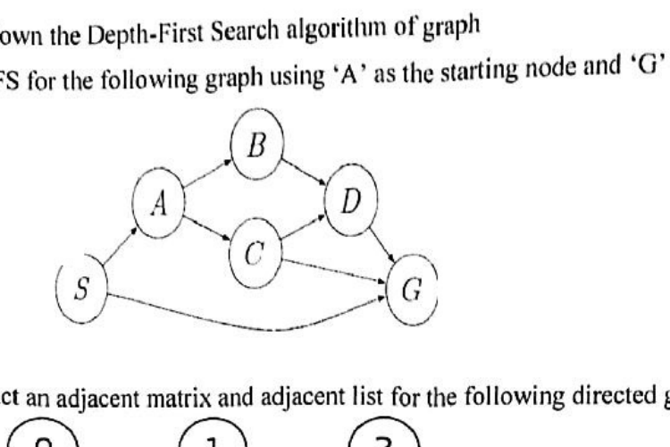
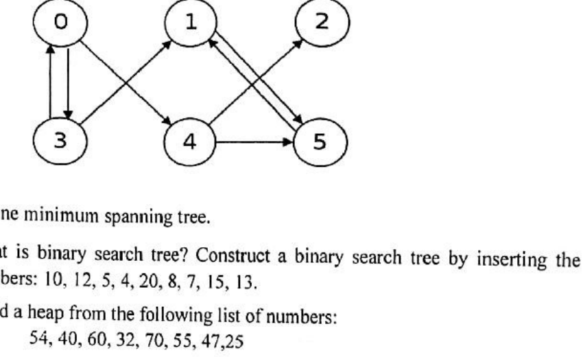
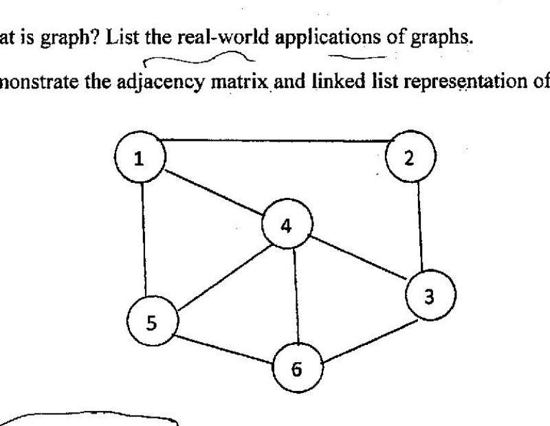
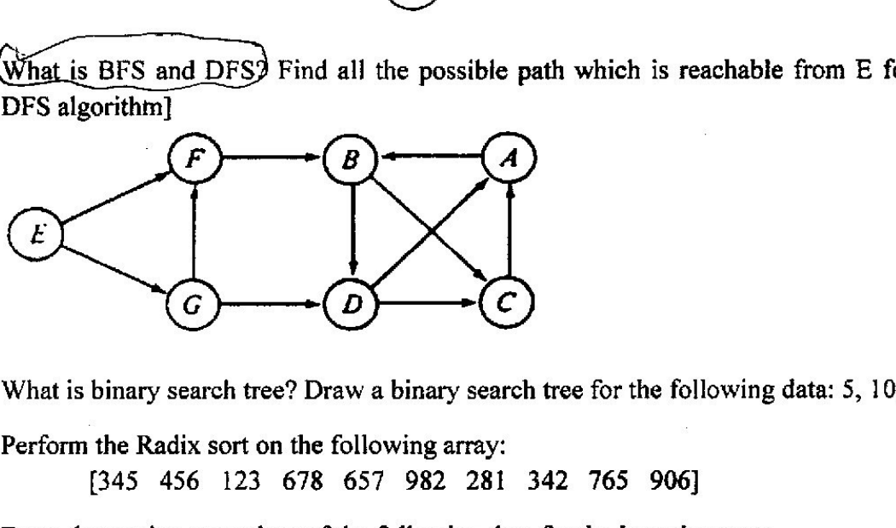
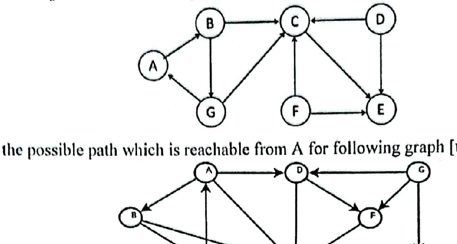
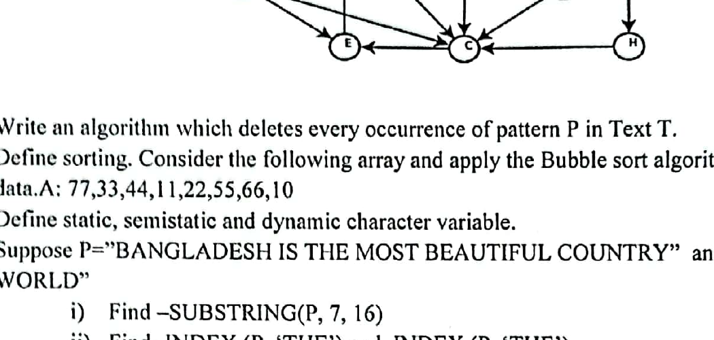
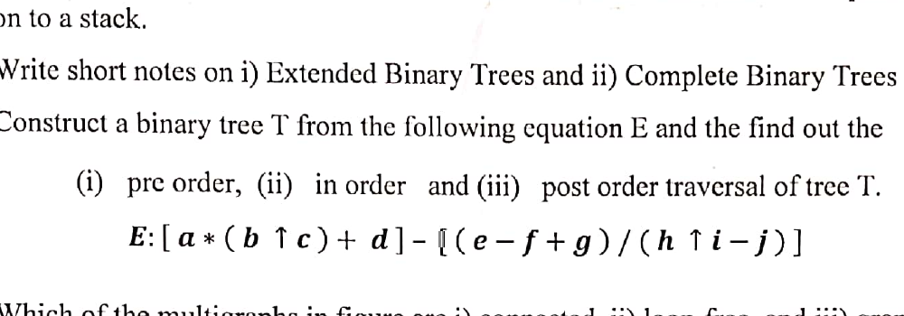
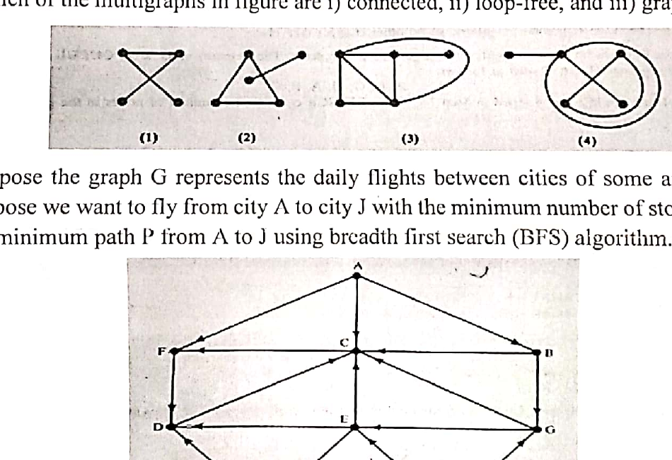

# CSE2135 - Data Structure

## Introduction and Preliminaries

### Term 161

- **Q1(a) [5]:** Define data structure. Shortly explain data structure operations.
- **Q1(b) [7]:** Define algorithms time-space tradeoff. Explain first pattern matching algorithm with example.
- **Q1(c) [2]:** Define floor and ceiling function with example.

### Term 171

- **Q1(a) [1+2]:** Define data structure. Explain data structure operations.
- **Q1(b) [3]:** Define algorithms complexity and time-space tradeoff.

### Term 181

- **Q1(a) [1+2]:** Define data structure? Distinguish between static and dynamic data structure.
- **Q1(b) [1+3]:** What do you understand by time complexity? Define $\Omega$ notation, $\Theta$ notation and $O$ notation.
- **Q1(c) [3]:** What do you understand by time space trade-off?

### Term 191

- **Q1(a) [4]:** Define data structure. Briefly explain data structure operations.
- **Q1(b) [4]:** Explain algorithm complexity and Time-space tradeoff.
- **Q1(c) [2]:** What is asymptotic notation?

### Term 201

- **Q1(a) [1+2]:** Define data structure. Describe in brief the basic operation of data structure.
- **Q1(d) [2+3]:** What are the linear and nonlinear data structures? Show the transformation of the following infix expression into postfix expression by applying stack: `5 * (6 + 2) - 12 / 4`.

### Term 211

- **Q1(a) [1+3]:** Define data structures. List and explain the different operations that can be carried on arrays.
- **Q1(c) [1x4]:** Define the following term in brief: (i) Time complexity; (ii) Space complexity; (iii) Big O notation; (iv) Asymptotic notation.
- **Q1(d) [1+2]:** Define recursive function. What are the essential conditions to be satisfied by a recursive function?

## String Processing

### Term 161

- **Q2(a) [3]:** Find (i) `DELETE('AAABBB', 2, 2)` and `DELETE('JOHN PAUL JONES', 6, 5)` (ii) `REPLACE('AAABBB', 'AA', 'BB')` and `REPLACE('JOHN PAUL JONES', 'PAUL', 'DAVID')`.

### Term 171

- **Q1(c) [3]:** Find the following: (i) `INSERT('AAAAA', 3, BBB)`; (ii) `DELETE('AAABBB', 2, 2)`; (iii) `REPLACE('AAABBB', 'AA', BB)`.
- **Q3(b) [4]:** Write an algorithm which replaces every occurrence of pattern P in Text T by a new pattern Q.
- **Q3(c) [3]:** Suppose $S=$ "BANGLADESH IS THE MOST BEAUTIFUL COUNTRY" and $T=$ "IN THE WORLD".
  1. Find the length of S and T.
  2. Find `SUBSTRING(S, 9, 20)`.
  3. Find `INDEX(S, 'THE')` and `INDEX(T, 'THE')`.
- **Q3(d) [3]:** Define static, semistatic and dynamic character variable.

### Term 181

- **Q2(a) [4]:** Write an algorithm which replaces every occurrence of pattern P in Text T by a new pattern Q.
- **Q2(b) [3]:** Describe the three types of structures used for storing strings.
- **Q2(c) [3]:** Find the following:
  1. `INSERT('PQRSPQRS', 4, AAA)`;
  2. `DELETE('DATA.STRUCTURE', 5, 4)`;
  3. `REPLACE('XYZXYZXXZZYY', 'ZXY', 'YXZ')`.

### Term 191

- **Q7(a) [4]:** Write an algorithm which deletes every occurrence of pattern P in Text T.
- **Q7(c) [3]:** Define static, semistatic and dynamic character variable.
- **Q7(d) [2]:** Suppose P = "BANGLADESH IS THE MOST BEAUTIFUL COUNTRY" and Q = "IN THE WORLD".
  1. Find `SUBSTRING(P, 7, 16)`.
  2. Find `INDEX(P, 'THE')` and `INDEX(P, 'THE')`.

### Term 201

- **Q1(c) [2]:** For the pattern $P=aaa$ and text $T=(aabb)^3$ find the number of comparisons to find the INDEX of P in T using the 'slow' algorithm.
- **Q2(a) [4]:** Find the table and corresponding graph for the second pattern matching algorithm where the pattern is $P=a^2b^2(ab)^2$.
- **Q2(b) [5]:** Suppose T contains the text "INFORMATION AND COMMUNICATION TECHNOLOGY". Find:
  1. `SUBSTRING(T, 17, 24)`
  2. `INDEX(T, 'CATION')`
  3. `INSERT(T, 31, 'ENGINEERING')`
  4. `DELETE(T, 13, 18)`
  5. `REPLACE(T, 'TECHNOLOGY', 'SCIENCE')`
- **Q2(c) [3]:** Describe briefly the meaning of static, semi static and dynamic variables.

## Arrays, Records, and Pointers

### Term 161

- **Q2(b) [5]:** Consider the linear arrays $X(-10:10)$, $Y(1935:1985)$, $Z(35)$.
  1. Find the number of elements in each array.
  2. Suppose Base (Y) = 400 and $w=4$ words per memory cell for Y. Find the address of Y[1942], Y[1977] and Y[1988].
- **Q2(c) [6]:** Define Sparse matrix. Write down the Matrix Multiplication algorithm.

### Term 171

- **Q3(d) [1+3]:** Define static, semistatic and dynamic variable.

### Term 201

- **Q1(b) [4]:** Suppose DATA is an array of numerical values in memory. Write down the algorithm and the flow chart to find the location LOC and the value MAX of the largest element in DATA.
- **Q2(d) [1+1]:** Define linear array. Which operations are normally performed on any linear structure?

### Term 211

- **Q1(b) [3]:** Write an algorithm/pseudocode to delete a given element k from an array A of n elements? Assume that the element k is always present in A.

## Linked List

### Term 161

- **Q3(a) [10]:** Define linear list. Explain the process of inserting an element in a linear linked list.
- **Q3(b) [4]:** Define doubly linked list. Mention the application of linked list.

### Term 171

- **Q2(a) [1+3]:** Define linear linked list. Write down the steps of inserting an element into a linked list with example.
- **Q2(b) [1+4]:** Define doubly linked list. Write down the steps of deleting an element from a linear linked list with example.
- **Q2(c) [2]:** Write the definition of header linked list with example.
- **Q2(d) [3]:** What are garbage collection, overflow and underflow?

### Term 181

- **Q3(b) [2+2]:** How do you insert and delete an item in a linked list? Explain it with proper example.
- **Q3(c) [2+2]:** Write the definition of header linked list and two-way link list with example.
- **Q3(d) [2]:** Define Garbage Collection.

### Term 191

- **Q3(a) [1+3]:** Define linear linked list. Write down the steps of inserting an element into a linked list with example.
- **Q3(b) [1+3]:** Define doubly linked list. Write down the steps of deleting an element from a linear linked list with example.
- **Q3(c) [3]:** Write down the applications of linked list.
- **Q3(d) [3]:** What are garbage collection, overflow and underflow?

### Term 201

- **Q3(a) [2+4]:** What is the advantage of using the linked list implementation of queues, as opposed to the array implementation? Suppose, you have a doubly linked list with the following elements: `10 <-> 20 <-> 30 <-> 50 <-> NULL`. Now, write a procedure to insert an element after a value x. Also, show the steps of your procedure to insert an element with value 40 after 30. After inserting 40 the list should be changed to: `10 <-> 20 <-> 30 <-> 40 <-> 50 <-> NULL`.
- **Q3(b) [3]:** Write down an algorithm if we want to insert ITEM as the first node in a linked list.

### Term 211

- **Q4(a) [4]:** A queue can be implemented using linked list in two ways. Which implementations among two is efficient and why?
- **Q4(b) [2+2]:** What is linear linked list? Why we need pointers in linked list?
- **Q4(c) [3x2]:** Write functions to implement the following operations of linear linked list:
  1. To insert an element at the beginning of the list.
  2. To delete an element at the end of the list.
  3. To traverse the list.

## Stacks, Queues, and Recursion

### Term 161

- **Q4(a) [4]:** Define stack. Mention the basic operation in stack with example.
- **Q4(b) [8]:** Consider the following arithmetic infix expression Q as `A + (B * C - (D / E ^ F) * G) * H`. Translate this expression into Prefix and Postfix notation.
- **Q4(c) [2]:** What are the basic distinction between stack and queue?
- **Q5(a) [5]:** Define Queue. Explain Enqueue operation with example.
- **Q5(b) [5]:** Define priority queue. Explain Dequeue operation with example.
- **Q5(c) [4]:** Explain the linked list implementation of queue.

### Term 171

- **Q4(a) [1+3]:** Define stack. Write down the algorithm for PUSH.
- **Q4(b) [3]:** Convert the following infix expression Z to its equivalent postfix expression: `P + (Q * R - (S / T ^ U) * V) * W`.
- **Q4(d) [2]:** Show the tree diagram of recursive solution to Tower of Hanoi problem for $n=3$.

### Term 181

- **Q4(a) [3+1]:** Define Stack and Queue. What is the main difference between them?
- **Q4(b) [3]:** Convert the following infix expression to its equivalent postfix expression: `A * (B + D) / E - F * (G + H / K)`.
- **Q4(d) [2]:** Write a recursive algorithm for the Tower of Hanoi problem.

### Term 191

- **Q2(d) [3]:** Write the algorithm for Tower of Hanoi problem.
- **Q4(a) [1+3]:** Define stack. Explain PUSH and POP algorithm with an example.
- **Q4(b) [3]:** Consider the following arithmetic infix expression: `Q: A + (B * C - (D / E ^ F) * G) * H`. Transform Q into its equivalent postfix expression using stack.
- **Q4(c) [3]:** Explain Enqueue and Dequeue operations with example.

### Term 201

- **Q3(c) [2]:** Suppose STACK is allocated N=6 memory cells and initially STACK is empty, or, in other words TOP=0. Find the output of the following module.

  ```text
  1. Set AAA := 2 and BBB := 5
  2. call PUSH(STACK, AAA)
     call PUSH(STACK, 4)
     call PUSH(STACK, BBB + 2)
     call PUSH(STACK, 9)
     call PUSH(STACK, AAA + BBB)
  3. Repeat while TOP != 0
         call POP(STACK, ITEM)
         write : ITEM
     [End of loop]
  4. Return.
  ```
- **Q3(d) [3]:** Let a and b denote positive integers. Suppose Q is defined recursively as follows:

  $$
  Q(a,b)=\begin{cases}
  0,&a<b\\
  Q(a-b,b)+1,&b\le a
  \end{cases}
  $$

  Find the value of (i) $Q(2,3)$ (ii) $Q(14,3)$.
- **Q5(a) [1+3]:** What do you mean by stack and queue? Write down an algorithm which pushes an item on to a stack.

### Term 211

- **Q2(a) [1+4]:** Define Stack? Write down the algorithm for PUSH and POP operation.
- **Q2(b) [2+4]:** Write an algorithm to convert a parenthesized infix expression to postfix. Apply the algorithm and show the contents of stack during conversion for the expression: `((H * ((((A + ((B + C) * D)) * F) * G) * E)) + J)`.
- **Q3(a) [4]:** Write pseudo code to implement queue using stack i.e., implement insert and delete operation of queue using push and pop.
- **Q3(b) [2]:** Suggest an application of queue. Explain how queue is a better choice than array for that application.
- **Q3(c) [1x4]:** Consider the following queue of characters where QUEUE is a circular array which is allocated six memory cells: `FRONT=2 REAR=4, QUEUE: ---, A, C, D, ---, ---` (`---` denotes empty memory cell). Describe the queue as the following operations takes place:
  1. F is added to queue.
  2. Two letters are deleted.
  3. K, L, M are added to queue.
  4. Two letters are deleted.

## Trees

### Term 161

- **Q6(b) [6]:** Develop a Huffman tree using the following node weights: 20, 2, 8, 7, 4, 10, and 14.
- **Q6(c) [3+5]:** Define maxheap and minheap? Built a heap from the following list of numbers: 44, 30, 50, 22, 60, 55, 77.
- **Q7(a) [2]:** How many ways a binary tree can be represented in memory?
- **Q7(b) [6]:** Consider the following binary tree. Find the sequence of nodes when traversing in (i) Pre-order, (ii) In-order, and (iii) Post-order.

  

- **Q7(c) [6]:** Draw the binary tree using the following algebra expression: `[a + (b - c) * [(d - c) / (f + g - h)]]`. Then traverse it in (i) pre-order and (ii) Post order.

### Term 171

- **Q7(a) [2+3]:** What is binary search tree? Construct a binary search tree by inserting the following sequence of numbers: 10, 12, 5, 4, 20, 8, 7, 15, 13.
- **Q7(b) [3]:** Build a heap from the following list of numbers: 54, 40, 60, 32, 70, 55, 47, 25.
- **Q7(c) [3]:** Consider the following binary tree. Find the sequence of nodes when traversing in (i) Pre-order, (ii) In-order, and Post-order.

  

- **Q7(d) [3]:** Develop a Huffman tree and find Huffman code using the following node weights:

  | A | B | C | D | E | F |
  |---:|---:|---:|---:|---:|---:|
  | 1 | 24 | 05 | 32 | 43 | 16 |

### Term 181

- **Q5(a) [3]:** Consider the following binary tree. Find the sequence of nodes when traversing in (i) Pre-order, (ii) In-order, and (iii) Post-order.

  

- **Q5(b) [3]:** Write the definition of Complete Binary-tree and 2-Tree.
- **Q5(c) [4]:** Built a Max-heap from the following list of numbers: 22, 62, 32, 52, 42, 72, 92, 82, 12.
- **Q5(d) [4]:** Develop a Huffman tree and find Huffman code using the following node weights.
- **Q7(a) [1+2]:** What is binary search tree? Draw a binary search tree for the following data: 5, 10, 20, 3, 2, 7, 11, 18, 17.

### Term 191

- **Q5(a) [3]:** Consider the following binary tree. Find the sequence of nodes when traversing in (i) Pre-order, (ii) In-order, and (iii) Post-order.

  

- **Q5(b) [3]:** Define binary search tree. Draw a binary search tree from the following data: 50, 33, 44, 22, 77, 35, 60, 15, 85, 20, 100.
- **Q5(c) [3]:** Build a max heap from the following list of numbers: 15, 35, 45, 25, 75, 55, 65, 05, 95, 85.
- **Q5(d) [5]:** Develop a Huffman tree and find Huffman code using the following node weights:

  | P | Q | R | S | T | U | V | W |
  |---:|---:|---:|---:|---:|---:|---:|---:|
  | 23 | 10 | 06 | 12 | 32 | 16 | 42 | 37 |

### Term 201

- **Q5(b) [4]:** Write short notes on (i) Extended Binary Trees and (ii) Complete Binary Trees.
- **Q5(c) [6]:** Construct a binary tree T from the following equation E and then find out the (i) pre order, (ii) in order and (iii) post order traversal of tree T: $E:[a*(b\uparrow c)+d]-[(e-f+g)/(h\uparrow i-j)]$.

### Term 211

- **Q3(d) [2+2]:** Build a Huffman Tree from the following table and assign code value for each character.

  | Character | Frequency | Character | Frequency |
  |---|---:|---|---:|
  | a | 5 | b | 25 |
  | c | 1 | d | 18 |
  | e | 12 | f | 35 |

- **Q5(a) [2+1]:** Define Binary tree with an example. How is it different from an ordinary tree?
- **Q5(b) [4]:** Given the following traversal, draw a binary tree:
  1. Inorder: `4 2 5 1 6 7 3 8`; Postorder: `4 5 2 6 7 8 3 1`
  2. Preorder: `A B C E I F J D G H K L`; Inorder: `E J C F J B G D K H L A`
- **Q5(c) [1+4]:** What is balance factor in AVL tree? Construct an AVL tree for data 8, 10, 3, 2, 1, 5, 4, 7 into binary search tree using AVL rotation.
- **Q5(d) [2]:** Write an algorithm for heap-sort (using max-heap).
- **Q6(a) [3]:** The following graph represents a m-way search tree (with m=3). How to delete element 100 from the tree? [Show the steps of deletion]

  

- **Q6(b) [3]:** Suppose, you are given a Red-Black tree. Show how to insert element "I" into the tree?

  

## Graphs and Their Applications

### Term 161

- **Q6(a) [4]:** Define the following term with necessary example: (i) Graph, (ii) Multigraph and (iii) Directed Graph.

### Term 171

- **Q6(a) [4]:** Write down the Depth-First Search algorithm of graph.
- **Q6(b) [4]:** Find BFS for the following graph using 'A' as the starting node and 'G' is the destination.

  

- **Q6(c) [4]:** Construct an adjacent matrix and adjacent list for the following directed graph.

  

- **Q6(d) [2]:** Define minimum spanning tree.

### Term 181

- **Q6(a) [1+2]:** What is graph? List the real-world applications of graphs.
- **Q6(b) [4]:** Demonstrate the adjacency matrix and linked list representation of the following graph:

  

- **Q6(c) [3+4]:** What is BFS and DFS? Find all the possible path which is reachable from E for following graph [use DFS algorithm].

  

### Term 191

- **Q6(a) [3]:** Explain Depth First Search and Breadth First Search algorithm with example.
- **Q6(b) [3]:** Construct an adjacent matrix and adjacent list for the following directed graph.

  

- **Q6(c) [5]:** Find all the possible path which is reachable from A for following graph [use DFS algorithm].

  

### Term 201

- **Q6(a) [2]:** Which of the multigraphs in figure are (i) connected, (ii) loop-free, and (iii) graphs.

  

- **Q6(b) [7]:** Suppose the graph G represents the daily flights between cities of some airlines, and, suppose we want to fly from city A to city J with the minimum number of stops. Find out the minimum path P from A to J using breadth first search (BFS) algorithm.

  

### Term 211

- **Q6(c) [2+2]:** How are graphs represented in memory of a computer? Give relative merits and demerits of these representation schemes.
- **Q6(d) [1x4]:** Define the following terminologies with example: (i) Digraph; (ii) Weighted Graph; (iii) Self loop; (iv) Parallel edges.
- **Q7(a) [3+2]:** Write an algorithm to perform breadth first search (BFS). Compare the BFS and DFS search technique.
- **Q7(c) [2+3]:** What is graph traversal? Write an appropriate algorithm for graph traversal.

## Sorting, Searching, and Hashing

### Term 171

- **Q1(d) [1+3]:** Write linear search algorithm.
- **Q3(a) [4]:** What are the correct intermediate steps of the following data set when it is being sorted with the bubble sort? Data set: 15, 55, 35, 05, 45.
- **Q4(c) [5]:** Write the Quick Sort algorithm.
- **Q5(a) [5]:** Perform the Radix sort on the following array: `[1256 5897 4523 1536 3246 6742 5566]`.
- **Q5(b) [3]:** Suppose an array is: `[6 8 1 4 5 3 7 2]` and your goal is to put it into ascending order using Selection sort.
- **Q5(c) [6]:** Let DATA be the following elements: `30, 33, 11, 22, 60, 55, 40, 44, 99, 88, 80, 77, 66`. Apply the binary search algorithm to search DATA ITEM = 40 and ITEM = 85.

### Term 181

- **Q1(d) [4]:** Write Linear Search algorithm and find out the complexity of it.
- **Q2(d) [4]:** What are the correct intermediate steps of the following data set when it is being sorted with the bubble sort? Data set: 20, 60, 50, 10, 40, 70, 30.
- **Q3(a) [1+3]:** Write the Binary Search algorithm. What is the limitation of Binary Search algorithm?
- **Q4(c) [5]:** Write the Quick Sort algorithm.
- **Q7(b) [3]:** Perform the Radix sort on the following array: `[345 456 123 678 657 982 281 342 765 906]`.
- **Q7(c) [4]:** Draw the sorting procedure of the following data for the insertion sort: 4, 3, 2, 10, 12, 1, 5, 6.
- **Q7(d) [1+3]:** What is merge sort? Draw the diagram that shows the complete merge sort process for the following unsorted data: 38, 27, 43, 3, 9, 82, 10.

### Term 191

- **Q1(d) [3+1]:** Write the Binary Search algorithm. What is the limitation of Binary Search algorithm?
- **Q2(a) [3]:** Consider the following array and apply the Bucket sort algorithm to sort the data. A: 3216, 1953, 7269, 6517, 5432, 2806, 4920.
- **Q2(b) [4]:** Write an algorithm for Selection sort.
- **Q2(c) [4]:** Suppose an array is: `[6 8 1 4 5 3 7 2]` and your goal is to put it into ascending order using Insertion sort algorithm.
- **Q4(d) [4]:** Write the Quick sort algorithm.
- **Q7(b) [1+4]:** Define sorting. Consider the following array and apply the Bubble sort algorithm to sort the data. A: 77, 33, 44, 11, 22, 55, 66, 10.

### Term 201

- **Q4(a) [3]:** Write down binary search algorithm.
- **Q4(b) [4]:** Using the bubble sort algorithm, find the number C of comparisons and the number D of interchanges which alphabetize the n=6 letters in PEOPLE.
- **Q4(c) [2+5]:** Why Quick sort is preferred over Merge sort for sorting arrays? Perform a partitioning of the array `[E, V, E, R, Y, E, Q, U, A, L, K, E, Y, S, T, O, P, S, I, T]` with standard quick sort partitioning (taking the E at the left as the partitioning item and listen every swapping performed in this partitioning).
- **Q6(c) [5]:** Consider a company each of whose 68 employees is assigned a unique 4 digit employee number as follows: 9614, 5882, 6713, 4409, 1825. Find a 2 digit hash address of each number using (i) The division method. (ii) The mid square method. (iii) The folding method without reversing and with reversing.
- **Q7(a) [1+6]:** What is meant by perfect hash function? Suppose you are given the following set of case to insert into a hash table that holds exactly seven values 113, 117, 97, 100, 114, 99. Systematically show the contents of the hash table after all the keys have been inserted sequentially using "plus 3" probing. Also determine the load factor of the resultant hash table.
- **Q7(b) [2+5]:** What does it mean that a shorting algorithm is stable? "Radix sort can be slower and more memory hungry than some other algorithms" - Do you agree or not justify your answer.

### Term 211

- **Q2(c) [3]:** Explain hashing and linear probing with suitable example.
- **Q7(b) [2x2]:** Explain the following sorting methods: (i) Selection sort; (ii) Merge sort.

