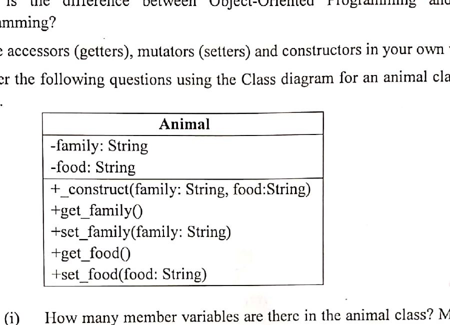

# CSE2137 - Object Oriented Programming

## Introduction

### Term 151

- **Q1(a) [4]:** Compare Object Oriented Programming (OOP) with sequential programming.
- **Q1(b) [3]:** Briefly explain various features of Java.
- **Q1(c) [3]:** What is Java Runtime Environment (JRE)?
- **Q1(d) [4]:** What do you understand by JVM? Briefly explain the function of JVM.
- **Q3(a) [3]:** Java programming is to be compiled first and then to be interpreted for execution. Choose true or false in respect to the said statement and justify your answer.
- **Q3(b) [4]:** What are the data types supported by Java. What is Autoboxing and Unboxing?

### Term 161

- **Q1(a) [3]:** Compare Object oriented programming with sequential programming.
- **Q1(c) [5]:** Discuss the following program line-by-line and understand the unique features that constitute the program.

  ```java
  public class Welcome {
      public static void main(String args[]) {
          System.out.println("Welcome");
      }
  }
  ```
- **Q1(d) [3]:** What do you understand by JVM? Explain the function of JVM.
- **Q4(a) [4]:** Java program is to be compiled first and then to be interpreted for execution. True or false? Justify your answer.
- **Q4(b) [4]:** Write any four names of Java system packages with their classes/contents.

### Term 171

- **Q1(a) [2+3]:** What is Object Oriented Programming (OOP)? Explain the following two features of Java: Platform independent and Multithread.
- **Q1(c) [2]:** What is Typecasting? What will be the output of the following code segment?

  ```java
  class Simple {
      public static void main(String args[]) {
          float f = 10.5f;
          int a = (int) f;
          System.out.println(f);
          System.out.println(a);
      }
  }
  ```

### Term 181

- **Q1(a) [4]:** Compare and contrast object oriented programming with procedural programming.
- **Q2(a) [2+3]:** What makes java platform independent is its compilation and execution process. Explain how these processes make java platform independent.

### Term 201

- **Q1(a) [2]:** What is the difference between Object-Oriented Programming and Structural Programming?
- **Q4(a) [4]:** "Java programming is to be compiled first and then to be interpreted for execution." Is this statement true or false? Justify your answer with proper description.

### Term 211

- **Q2(a) [4]:** What is the difference between JDK, JRE, and JVM?
- **Q4(a) [4]:** "Java programming is to be compiled first and then to be interpreted for execution". Is this statement true or false? Justify your answer with proper description.

## Classes

### Term 151

- **Q2(a) [4]:** Define class and object with example.
- **Q2(b) [4]:** Distinguish between static and non-static nested classes. What are the properties of static method, static block and final variable?
- **Q2(c) [4]:** Explain function overriding and overloading in Java with examples.

### Term 161

- **Q1(b) [3]:** What do you mean by classes and objects?
- **Q2(a) [3]:** What is constructor? What are its special properties?
- **Q2(b) [3]:** Distinguish between method overloading and method overriding.
- **Q2(c) [6]:** Declare a class called Coordinate to have 3 dimensional Cartesian coordinates. Define following methods: (i) Constructor(s), (ii) `add_coordinates` to add two Coordinate objects and to produce resultant object. Generate and handle exception, if all three coordinates of the resultant Coordinate object are zero. Define method main to show use of above methods.
- **Q2(d) [2]:** Explain array implementation in Java with example.
- **Q4(d) [2]:** What are final class, final function and final variable in java?

### Term 171

- **Q2(a) [4]:** Constructors are special methods used for object creation. What are the characteristics that make them different than other regular methods?
- **Q2(b) [6]:** Classes and objects are fundamental building blocks of OOP. What do you know about these? Use examples to elaborate.
- **Q2(c) [4]:** Explain function overriding and overloading in Java with example.
- **Q3(b) [2+2+3]:** In a program written in an OOP, several objects may communicate/interact with each other using messages and methods. Methods may have arguments. Explain methods and arguments with an example from Java.
- **Q4(a) [6]:** You have a java class named Student with four attributes/variables - name, CGPA, department, and number_of_siblings. It also has the default constructor or method with no parameter, and methods to set name and get name from the objects of this class. Show the class declaration along with the variables and the methods mentioned above.
- **Q4(b) [4]:** You have a class named StudentHandler which uses the Student class in question 5.a. This class creates new students if needed and keeps track of them. Show the code that this class will use to create a new student whose name is Nazmul. Please remember that the Student class only has a default constructor that does not take any parameter.

### Term 181

- **Q1(b) [2+2]:** What are classes and objects? Explain it with an example.
- **Q2(b) [3+2]:** Define accessors (getters), mutators (setters) and constructors in your own words. How is constructor different than other methods?
- **Q2(c) [4]:** What are method overloading and method overriding? Explain with example.
- **Q3(c) [4]:** ClassA has the following static char variable called direction: `static char direction = 'E';` There are two objects, a1 and b1 created from this class. b1 issues the following statement - `direction = 'S';` Now, if both a1 and b1 print the value of direction, what will be shown in each of the print statements in both objects and why?
- **Q4(b) [4]:** In your class called "BankAccount" you have the following variables - currentBalance, name, numberOfChildren. You also have a constant to keep fixed interest rate. Show the class declaration along with these variables and the constant.
- **Q6(b) [6]:** You are developing an application for your university for student registration of courses each semester. Identify the objects involved in this application. Identify each object's properties and some of the possible methods they may have. You do not have to write any java code; simply show the objects/entities, their attributes/properties and method signatures they may have.
- **Q6(c) [5]:** Consider the following code:

  ```java
  import java.io.*;
  public class Employee {
      String name;
      String designation = "MANAGER";
      // This is the constructor of the class Employee
      public void setDesignation(String designation) {
          System.out.println("Designation is : " + designation);
      }
  }
  ```

  In another class we have the following code:

  ```java
  Employee emp = new Employee();
  emp.setDesignation("Accountant");
  ```

  What would be the output of this code and why? Also identify what crucial part of the code may be missing.

### Term 201

- **Q1(b) [4]:** Define accessors (getters), mutators (setters) and constructors in your own word.
- **Q1(c) [2+2+2]:** Answer the following questions using the Class diagram for an animal class shown below.

  

  1. How many member variables are there in the animal class? Mention their names and types.
  2. Identify the mutators and accessors.
  3. Write Java codes to implement the constructor.
- **Q1(d) [2]:** Explain why the constructor is considered as a special type of method in OOP.
- **Q3(c) [4]:** To compare two strings, will you use `==` or `equals()` methods? Briefly explain the reason. Explain with example about the following String methods used in Java: (i) `indexOf()`, (ii) `charAt()`, (iii) `endsWith()`, (iv) `contains()`.
- **Q3(d) [4]:** Create a class named Employee that includes three instance variables - a first name (type String), a last name (type String) and a monthly salary (double). Provide a constructor that initializes the three instance variables. Provide a set and get method for each instance variable. If the monthly salary is not positive, do not set its value. Write a test app named EmployeeTest that demonstrates class Employee's capabilities. Create two Employee objects and display each object's yearly salary. Then give each Employee a 10% raise and display each Employee's yearly salary again.

### Term 211

- **Q1(a) [2+2]:** Classes and objects are fundamental building blocks of OOP. What do you know about these? Use examples to elaborate.
- **Q1(c) [2]:** What is the purpose of Static Methods and Variables?
- **Q2(b) [4]:** Constructors is a special methods used for object creation. What are the characteristics that make them different than other regular methods?
- **Q2(c) [6]:** Explain methods overriding and overloading in Java with example.
- **Q5(a) [4]:** How can Constructor chaining be done by using the Super keyword?
- **Q6(b) [2+6]:** To compare two strings, will you use `==` or `equals()` methods? Briefly explain the reason. Explain the example about the following String methods used in Java: (i) `indexOf()`, (ii) `charAt()`, (iii) `endsWith()`, (iv) `contain()`.

## Inheritance, Interfaces, and OOP Design

### Term 151

- **Q2(d) [2]:** What is encapsulation?
- **Q3(c) [3]:** Does Java support multiple inheritances where each class is able to extend multiple classes?
- **Q3(d) [2]:** Distinguish between an interface and an abstract class with necessary example.
- **Q3(e) [2]:** What do you mean by garbage collection?
- **Q5(b) [6]:** Describe abstract class called "shape" which has three subclasses as "Triangle", "Rectangle" and "Circle". Define one method `area()` in the abstract class and override this `area()` in these three subclasses to calculate for specific object i.e. `area()` of Triangle subclass should calculate area of triangle etc. Same for Rectangle and Circle.
- **Q5(c) [4]:** Discuss public, private, protected and default access modifier with example.

### Term 161

- **Q3(c) [3]:** What are abstract methods? Describe the circumstances in which an abstract method would be appropriate.
- **Q4(c) [4]:** Write a Java program for the following hierarchical inheritance block diagram.

  
- **Q6(c) [4]:** Discuss public, private, protected and default access modifier with example.

### Term 171

- **Q1(b) [6]:** Inheritance, Encapsulation and Polymorphism are three key attributes of Object Oriented Programming (OOP). Discuss these attributes in your own words. Include benefits of these attributes in your answer.
- **Q3(a) [5]:** Abstract classes and interfaces are two very important items we use in developing programs in OOP. What are they and what benefits do they provide us?
- **Q3(c) [1+3]:** What is aggregation in Java? Why and when should we use aggregation?
- **Q5(b) [1+3]:** What are the advantages of Java package? Explain the following four different types of java access modifier: (i) private, (ii) default, (iii) protected, (iv) public.
- **Q6(c) [3]:** What is the purpose of garbage collection in Java and when is it used?

### Term 181

- **Q1(c) [6]:** Explain inheritance, encapsulation and polymorphism with examples.
- **Q3(a) [4]:** Explain what is meant by an 'abstract' class and what circumstance necessitates a class being abstract.
- **Q3(b) [6]:** Write the codes for implementations of the Employee and Person classes.
- **Q5(a) [3+2+1]:** What are Abstract classes and Interfaces? What benefits do they provide? Show how to declare abstract classes and interfaces in java.

### Term 201

- **Q2(a) [4]:** Abstract classes and interfaces are two very important items we use in developing programs in OOP. What are they and what benefits do they provide?
- **Q2(b) [2+2]:** Can we achieve multiple inheritance by using interface? Explain with example. What is the difference between multiple and multilevel inheritance?
- **Q3(a) [1+1]:** What is inheritance in OOP? Does Java support multiple inheritances?
- **Q3(b) [2+2]:** What are the main features of OOPs? Write a Java program for the following hierarchical inheritance block diagram.

  
- **Q4(b) [4]:** Why do you use Upcasting and Downcasting in Java? Explain with examples.

### Term 211

- **Q1(b) [6]:** Inheritance, encapsulation and polymorphism are three attributes of Object Oriented Programming (OOP). Discuss these attributes in your own words.
- **Q3(a) [2+3]:** How to declare a Package in Java? What are the advantages of Packages in Java?
- **Q4(b) [2+3]:** Why is Multiple Inheritance not supported in Java? How Interface is helpful to resolve this matter?
- **Q4(c) [4]:** Why do use upcasting and downcasting in Java? Explain with examples.

## Exception Handling

### Term 151

- **Q4(a) [4]:** Explain exception handling in Java. Write a program that generated custom exception if any integer value given from its command line arguments is negative.
- **Q4(b) [6]:** Explain the importance of exception handling in Java? Which keywords are used to handle exceptions? Write a program to explain the use of these keywords.

### Term 161

- **Q3(a) [4]:** Explain exception handling in JAVA. Write a program that generates custom exception if any integer value given from its command line arguments is negative.
- **Q3(b) [3]:** Write a Java program to check the divide-by-zero error of the modulo of two integers using exception handling mechanism.
- **Q3(d) [4]:** Which key words are used to handle exceptions? Write a program to explain the use of these keywords.
- **Q7(d) [4]:** What is error? Explain any three types of errors. How can we handle run time errors in java?

### Term 171

- **Q4(c) [4]:** Exceptions are problems that may happen in a code. In java, exceptions are categorized as Runtime Exceptions and Checked Exceptions. Explain these two types.
- **Q5(a) [2+3]:** What are differences between Exception and Error in Java? Describe the purpose of the following exception handling keywords: throw, throws, try-catch and finally.

### Term 181

- **Q4(a) [4]:** When you write programs in java, you must be concerned about exceptions. What are exceptions? When answering this question, mention some scenarios where exceptions may happen.
- **Q4(c) [6]:** In your java code, you have the following line to open a file to read the content: `BufferedReader reader = new BufferedReader(new FileReader(filename));` You know very well that exceptions may be thrown here. Mention reasons you think exceptions may be thrown when trying to read a file. Show in code how you would handle the exception/s in this case.

### Term 201

- **Q4(c) [1+5]:** What does exception mean in Java? Write a java program to enter two numbers and calculate the quotient. Use exception handling mechanism to take care of the divide by zero situation.
- **Q5(d) [2]:** What will be the Output of the below code?

  ```java
  public class A {
      public static void main(String[] args) {
          if (true)
              break;
      }
  }
  ```
- **Q6(a) [2]:** What is the difference between Exception and Error in Java?
- **Q6(d) [4]:** What is the difference between checked and unchecked exceptions in Java? Give ONE (1) example of each of these types of exceptions.

### Term 211

- **Q3(b) [2+1+3]:** Differentiate between Exception and Error in Java. Write a Java Program to check the divide-by-zero error of the modulo of two integers using exception handling mechanism.
- **Q3(c) [2+3]:** Which keywords are used to handle exceptions? Write a program to explain the use of these keywords.
- **Q5(d) [5]:** How many types of Exceptions can occur in a Java program? Describe with examples.

## I/O Programming

### Term 151

- **Q4(c) [4]:** Write a program that counts the number of words in a text file? Consider the file name is passed as a command line argument. The program should check the file exists or not. The words in the file are separated by white space character?

### Term 161

- **Q5(a) [3]:** What is Stream? Distinguish between InputStream class and Reader Class.
- **Q5(b) [3]:** What is random access file? How is it different from a sequential file?
- **Q5(c) [5]:** Write a program to read the integer values of file and save them another file after sorting.
- **Q5(d) [3]:** Why do you require files to store data?

### Term 171

- **Q7(d) [2+2]:** Distinguish between Java InputStream and OutputStream classes? Also explain their underlying useful methods.

### Term 201

- **Q5(b) [1+3]:** What is a stream? Briefly explain the three streams are automatically created in Java.
- **Q5(c) [4]:** Assume that you have a file name as 'outFile.txt' in your C drive. Write a program using the `java.io.FileOutputStream` class to write the following sentence in that file: "Java programming is awesome".

## Event-Based and GUI Programming

### Term 151

- **Q5(a) [4]:** What is the relationship between an event-listener interface and an event-adapter class? How can a GUI component handle its own events?
- **Q6(b) [5]:** Write a program to have a GUI based simple calculator in a frame supporting addition and subtraction. There are buttons for 0 to 9 digits and for arithmetic operations. Select layout of your choice.
- **Q6(c) [5]:** Write code segment of a simple JFrame with one JLabel and JButton.

### Term 161

- **Q6(a) [5]:** Draw the block diagram of applet class inherited properties from a long chain of classes. Explain briefly the life cycle of an applet.
- **Q6(b) [5]:** Write an applet program that draws a rectangle, an oval, a string and a line on the applet.
- **Q7(a) [4]:** Describe the purpose of any six Swing components.
- **Q7(b) [2]:** What are AWT and GUI?
- **Q7(c) [4]:** Write a complete program to have 3 Buttons in a frame having exit capabilities. Buttons are to be added in the frame as per the layout of your choice. Count and display number of times each Button being clicked.

### Term 171

- **Q7(a) [1+2]:** What is SWING library used for in Java? What is the base package that you have to import for SWING classes?
- **Q7(b) [2+1]:** What are layout managers? Name three of the Layout managers SWING has.

### Term 181

- **Q5(b) [2+3]:** What is an event in event-based programming? Discuss the types of events.
- **Q5(c) [3]:** Discuss the benefits of delegation event model in programming.
- **Q6(a) [1+2]:** What does GUI stand for? Why is it important?
- **Q7(a) [1+2]:** What are layout managers? Mention the name of three layout manager available in java swing package.

### Term 201

- **Q6(c) [5]:** Containers and components are two types of Java GUI elements. Using a suitable diagram explain those elements.
- **Q7(a) [1+2]:** What are layout managers? Mention the name of three layout managers available in Java swing package.
- **Q7(b) [4]:** What are the three components in the delegation event model? Explain.
- **Q7(c) [2+2]:** What is the relationship between an event-listener interface and an event-adapter class? How can a GUI component handle its own events?

### Term 211

- **Q5(b) [5]:** Containers and components are two types of Java GUI elements. Using a suitable diagram explain those elements.
- **Q5(c) [1+4]:** What are layout managers? Mention the name of three layout managers available in Java with proper diagram.
- **Q7(b) [4]:** Write a Java Program that draw a rectangle, an oval, a string and a line.
- **Q7(c) [2+3]:** What is an event in event-based programming? Discuss the types of events.

## Network Programming and Multithreading

### Term 151

- **Q6(a) [4]:** What are the advantages of multithreading over process based multitasking?
- **Q7(a) [5]:** Distinguish between TCP and UDP. Explain the two types of TCP sockets.
- **Q7(b) [5]:** What is Remote Method Invocation (RMI)? What is difference between an Applet and a Servlet? Explain the life cycle of an Applet.
- **Q7(c) [4]:** What is the difference between session and cookie? How are the JSP requests handle?

### Term 171

- **Q6(a) [4]:** What are advantages of multithreading over processed based multitasking?
- **Q7(c) [2+2]:** What are the advantages and disadvantages using cookies in Servlet? How are the JSP request handled?

### Term 181

- **Q7(b) [3+2]:** What is the difference between session and cookies in JSP? How is a JSP request handled?
- **Q7(c) [2+4]:** What is multithreading in Java? Discuss the advantages of multithreading over process based multitasking.

### Term 201

- **Q6(b) [3]:** What are the advantages of multithreading over processed based multitasking?
- **Q7(d) [4]:** Write short notes on the following terminologies associated with the Java networking: (i) Protocol; (ii) Socket; (iii) Inet Address; (iv) Datagram packet.

### Term 211

- **Q7(a) [4]:** Write a short note on Java Socket Programming.

