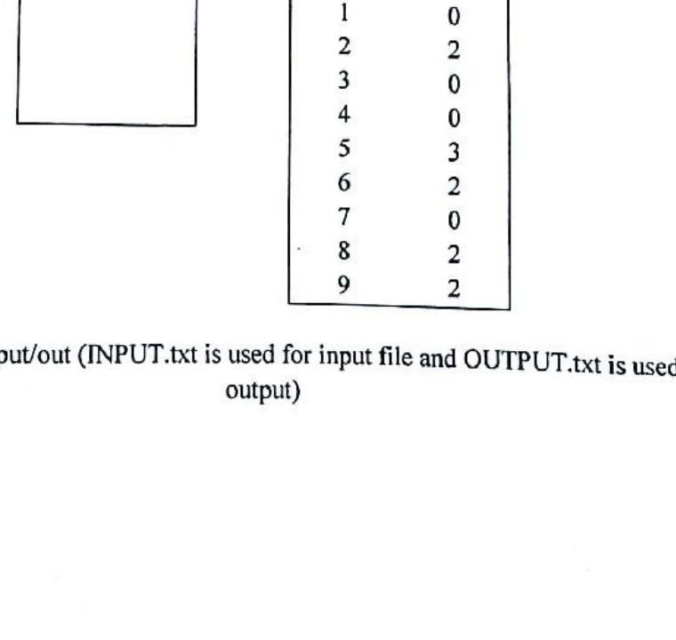

# CSE21P8 - Object Oriented Programming - I Lab

Questions are grouped by handbook experiment/topic. The original term and experiment number are retained.

## Java Classes, Objects, Constructors, and Methods

### Term 161

**Exp 1.** Create a Class named as "GradeBook" that contains a private instance variable named as "CourseName" and three public methods such as (i) `setCourseName()`, that is used to set the course (ii) `getCourseName()`, that is used to get course name and returns its value and (iii) `displayMessage()` that is used to display course name which is called from main class. The course name information read from keyboard in main class. Now write a Java class object based Program to display the entered information.

**Exp 2.** Write a Java class object based Program to find out the area of a circle and triangle using method overloading concept.

**Exp 7.** Create a class called Employee that includes three instance variables - a first name (type String), a last name (type String) and a monthly salary (double). Provide a constructor that initializes the three instance variables. Provide a set and a get method for each instance variable. If the monthly salary is not positive, do not set its value. Write a test app named Employee Test that demonstrates class Employee's capabilities. Create two Employee objects and display each object's yearly salary. Then give each Employee a 10% raise and display each Employee's yearly salary again.

**Exp 10.** Create a class called Date that includes three instance variables - a month (type int), a day (type int) and a year (type int). Provide a constructor that initializes the three instance variables and assumes that the values provided are correct. Provide a set and a get method for each instance variable. Provide a method `displayDate` that displays the month, day and year separated by forward slashes (/). Write a test app named Date Test that demonstrates class Date's capabilities.

### Term 171

**Exp 1.** Create a class named as "GradeBook" that contains a private instance variable named as "CourseName" and three public methods such as

1. `setCourseName()`, that is used to set the course
2. `getCourseName()`, that is used to get course name and returns its value and
3. `displayMessage()` that is used to display course name which is called from main class.

The course name information read from keyboard in main class. Now write a Java class object based program to display the entered information.

**Exp 4.** Create a class called Employee that includes three instance variables - a first name (type String), a last name (type String) and a monthly salary (double). Provide a constructor that initializes the three instance variables. Provide a set and a get method for each instance variable. If the monthly salary is not positive, do not set its value. Write a test app named Employee Test that demonstrates class Employee's capabilities. Create two Employee objects and display each object's yearly salary. Then give each Employee a 10% raise and display each Employee's yearly salary again.

**Exp 5.** Create a class called Date that includes three instance variables - a month (type int), a day (type int) and a year (type int). Provide a constructor that initializes the three instance variables and assumes that the values provided are correct. Provide a set and a get method for each instance variable. Provide a method `displayDate` that displays the month, day and year separated by forward slashes (/). Write a test app named Date Test that demonstrates class Date's capabilities.

**Exp 10.** Write a Java class object based program to find out the area of a circle and triangle using method overloading concept.

### Term 191

**Exp 3.** Create a class called Date that includes three instance variables - a month (type int), a day (type int) and a year (type int). Provide a constructor that initializes the three instance variables and assumes that the values provided are correct. Provide a set and a get method for each instance variable. Provide a method `displayDate` that displays the month, day and year separated by forward slashes (/). Write a test app named Date Test that demonstrates class Date's capabilities.

**Exp 7.** Drivers are concerned with the mileage their automobiles get. One driver has kept track of several trips by recording the miles driven and gallons used for each tankful. Develop a Java application that will input the miles driven and gallons used (both as integers) for each trip. The program should calculate and display the miles per gallon obtained for each trip and print the combined miles per gallon obtained for all trips up to this point. All averaging calculations should produce floating-point results. Use class Scanner and sentinel-controlled repetition to obtain the data from the user.

**Exp 8.** Create a class called Invoice that a hardware store might use to represent an invoice for an item sold at the store. An Invoice should include four pieces of information as instance variables - a part number (type String), a part description (type String), a quantity of the item being purchased (type int) and a price per item (double). Your class should have a constructor that initializes the four instance variables. Provide a set and a get method for each instance variable. In addition, provide a method named `getInvoiceAmount` that calculates the invoice amount (i.e., multiplies the quantity by the price per item), then returns the amount as a double value. If the quantity is not positive, it should be set to 0. If the price per item is not positive, it should be set to 0.0. Write a test app named InvoiceTest that demonstrates class Invoice's capabilities.

**Exp 9.** Create a class named as "GradeBook" that contains a private instance variable named as "CourseName" and three public methods such as

1. `setCourseName()`, that is used to set the course
2. `getCourseName()`, that is used to get course name and returns its value and
3. `displayMessage()` that is used to display course name which is called from main class.

The course name information read from keyboard in main class. Now write a Java class object based program to display the entered information.

**Exp 11.** Write a Java class object based program to find out the area of a circle and triangle using method overloading concept.

### Term 211

**Exp 07.** Create a class called Complex for performing arithmetic with complex numbers. Complex numbers have the form

$$
\text{realPart} + \text{imaginaryPart} \times i, \quad \text{where } i \text{ is } \sqrt{-1}
$$

Write a program to test your class. Use floating-point variables to represent the private data of the class. Provide a constructor that enables an object of this class to be initialized when it's declared. Provide a no-argument constructor with default values in case no initializers are provided. Provide public methods that perform the following operations:

- Add two Complex numbers: The real parts are added together and the imaginary parts are added together.
- Subtract two Complex numbers: The real part of the right operand is subtracted from the real part of the left operand, and the imaginary part of the right operand is subtracted from the imaginary part of the left operand.
- Print Complex numbers in the form `(realPart, imaginaryPart)`.

**Exp 10.** Write a program in Java Program to demonstrate the method and constructor overloading.

## Inheritance, Abstraction, Interfaces, and Polymorphism

### Term 161

**Exp 3.** Create a super Class "Box" and subclass "BoxWeight". The subclass "BoxWeight" inherits the superclass. Superclass "Box" consist of three public parameters such as width, height and depth respectively and one method volume to find out volume of boxes. Subclass "BoxWeight" consist of one public parameter weight and one constructor which receives four parameters such as box width, height, depth and weight respectively from user. Create two objects of "BoxWeight" class to find out box volume and Box weight. Now write a Java program using inheritance to solve this problem.

### Term 171

**Exp 2.** Create a super Class "Box" and subclass "Box Weight". The subclass "Box Weight" inherits the superclass. Superclass "Box" consist of three public parameters such as width, height and depth respectively and one method volume to find out volume of boxes. Subclass "BoxWeight" consist of one public parameter weight and one constructor which receives four parameters such as box width, height, depth and weight respectively from user. Create two objects of "BoxWeight" class to find out box volume and Box weight. Now write a Java program using inheritance to solve this problem.

### Term 191

**Exp 1.** Create a super Class "Box" and subclass "BoxWeight". The subclass "BoxWeight" inherits the superclass. Superclass "Box" consist of three public parameters such as width, height and depth respectively and one method volume to find out volume of boxes. Subclass "BoxWeight" consist of one public parameter weight and one constructor which receives four parameters such as box width, height, depth and weight respectively from user. Create two objects of "BoxWeight" class to find out box volume and Box weight. Now write a Java program using inheritance to solve this problem.

### Term 211

**Exp 01.** Write a Java program to create an abstract class named Shape that contains two integers and an empty method named `printArea()`. Provide three classes named Rectangle, Triangle and Circle such that each one of the classes extends the class Shape. Each one of the classes contain only the method `printArea()` that prints the area of the given shape.

**Exp 06.** Create a class named Octagon that extends GeometricObject and implements the Comparable and Cloneable interfaces. Assume that all eight sides of the octagon are of equal length. The area can be computed using the following formula:

$$
\text{area} = (2 + 4/\sqrt{2}) \times \text{side} \times \text{side}
$$

Draw the UML diagram that involves Octagon, GeometricObject, Comparable, and Cloneable. Write a Java program that creates an Octagon object with side value 5 and displays its area and perimeter. Create a new object using the clone method and compare the two objects using the `compareTo` method.

## File Handling, Hash Tables, and Exceptions

### Term 161

**Exp 4.** Suppose an input file named as "INPUT.txt" contains numeric values (0 to 9) in a single line as shown in below sample input/output. Now write a Java program to count the single number from the "INPUT.txt" file and write it to the file name as "OUTPUT.txt" as shown in below. If any number (0 to 9) is disappearing, then count 0 and if the number appears more than one then count total number. The sample input/out is shown below:

### Term 211

**Exp 03.** Write a java program that loads names and phone numbers from a text file where the data is organized as one line per record and each field in a record are separated by a tab (`\t`). It takes a name or phone number as input and prints the corresponding other value from the hash table (hint: use hash tables).

**Exp 08.** Write a Java program that creates a user interface to perform integer divisions. The user enters two numbers in the text fields, Num1 and Num2. The division of Num1 and Num2 is displayed in the Result field when the Divide button is clicked. If Num1 or Num2 were not an integer, the program would throw a NumberFormatException. If Num2 were Zero, the program would throw an Arithmetic Exception. Display the exception in a message dialog box.

## Event-Based, GUI, Applet, and Graphics Programming

### Term 161

**Exp 5.** Write a Java program to make a simple calculator using Java swing/Applet concept. The calculator perform the following arithmetic Operations of two numbers and display the result on the textbox:

1. Addition (+)
2. Subtraction (-)
3. Multiplication (*)
4. Division (/)
5. Modulus (%)

**Exp 6.** Write a Java Applet program that displays the following window with displayed message. The background color should be set black:

### Term 171

**Exp 3.** Write a Java program to make a simple calculator using Java swing/Applet concept. The calculator perform the following arithmetic Operations of two numbers and display the result on the textbox:

1. Addition (+)
2. Subtraction (-)
3. Multiplication (*)
4. Division (/)

**Exp 6.** Write a Java program to create a Simple administrative Login System as follows, where if you put username as "CSE" and Password as "BOUCSE" in their Textfields and then if you click "OK" button the simple message "Login Successful" is displayed in another label and if you click on "Clear" button the Text fields' data will be cleared.

### Term 191

**Exp 2.** Write a Java program to make a simple calculator using Java swing/Applet concept. The calculator perform the following arithmetic Operations of two numbers and display the result on the textbox:

1. Addition (+)
2. Subtraction (-)
3. Multiplication (*)
4. Division (/)

**Exp 10.** Write a Java Graphics to draw a text, line, rectangle, and circle/oval as follows.

### Term 211

**Exp 02.** Design the GUI given below using Java Swing.

**Exp 09.** Write a Java program using Applets that simulates a traffic light. The program lets the user select one of three lights: red, yellow, or green with radio buttons. On selecting a button, an appropriate message with "stop" or "ready" or "go" should appear above the buttons in a selected color. Initially there is no message shown.

## Multithreading

### Term 171

**Exp 7.** Suppose you have three tasks or threads such as Task1, Task2 and Task3 respectively. Every task pick a random sleep time between 0 and 20 seconds and go to sleep for that time and display for that time. In the mean time another task are trying to complete their task. After completed sleep time of every task, the output gives the message that "Tasks are done sleeping". This is multitasking/multithreading problem. Now write a Java multithreading program to solve this problem.

### Term 211

**Exp 04.** Write a Java program that implements a multi-thread application that has three threads. First thread generates a random integer every 1 second and if the value is even, second thread computes the square of the number and prints. If the value is odd, the third thread will print the value of the cube of the number.

## Basic Java Logic and Number/String Problems

### Term 161

**Exp 8.** A palindrome is a sequence of characters that reads the same backward as forward. For example, each of the following five-digit integers is a palindrome: 12321, 55555, 45554 and 11611. Write an application that reads in a five digit integer and determines whether it's a palindrome. If the number is not five digits long, display an error message and allow the user to enter a new value.

**Exp 9.** A positive integer is prime, if it's divisible by only 1 and itself. For example, 2, 3, 5 and 7 are prime, but 4, 6, 8 and 9 are not. The number 1, by definition, is not prime.

1. Write a method that determines whether a number is prime.
2. Use this method in an application that determines and displays all the prime numbers less than 10,000. How many numbers up to 10,000 do you have to test to ensure that you've found all the primes?

### Term 171

**Exp 8.** A positive integer is prime, if it's divisible by only 1 and itself. For example, 2, 3, 5 and 7 are prime, but 4, 6, 8 and 9 are not. The number 1, by definition, is not prime.

1. Write a method that determines whether a number is prime.
2. Use this method in an application that determines and displays all the prime numbers less than 10,000. How many numbers up to 10,000 do you have to test to ensure that you've found all the primes?

**Exp 9.** Write a program in java that reads one line of text as input in lower case letter and convert each letter into upper case.

### Term 191

**Exp 4.** A palindrome is a sequence of characters that reads the same backward as forward. For example, each of the following five-digit integers is a palindrome: 12321, 55555, 45554 and 11611. Write an application that reads in a five digit integer and determines whether it's a palindrome. If the number is not five digits long, display an error message and allow the user to enter a new value.

**Exp 5.** Write a Java program to remove the duplicate elements of a given array and return the new length of the array.

**Exp 6.** A positive integer is prime, if it's divisible by only 1 and itself. For example, 2, 3, 5 and 7 are prime, but 4, 6, 8 and 9 are not. The number 1, by definition, is not prime.

1. Write a method that determines whether a number is prime.
2. Use this method in an application that determines and displays all the prime numbers less than 10,000. How many numbers up to 10,000 do you have to test to ensure that you've found all the primes?

**Exp 12.**

1. Write a program in Java to print all prime numbers between 1 to 100.
2. Write a program to determine the sum of the following series for a given value of $n$.

$$
1 + 2^2 + 3^2 + 4^2 + \cdots + 10^2 + \cdots + N^2
$$

### Term 211

**Exp 05.** Some websites impose certain rules for passwords. Write a method in Java that checks whether a string is a valid password. Suppose the password rules are as follows:

- A password must have at least eight characters.
- A password consists of only letters and digits.
- A password must contain at least two digits.

Write a Java program that prompts the user to enter a password and displays Valid Password if the rules are followed or Invalid Password otherwise.

## Common Assessment Components

Every supplied paper includes:

- **A.** Choose and perform one experiment by lottery from out of the listed experiments. **1 x 40 = 40**
- **B.** Notebook on experiments. **10**
- **C.** Viva-voce. **10**

