# CSE2133 - Discrete Mathematics

## Graphs

### Term 161

- **Q4(a) [4]:** Define a simple graph. What are the degrees of the vertices in the graph displayed in Fig. 5(a)?

  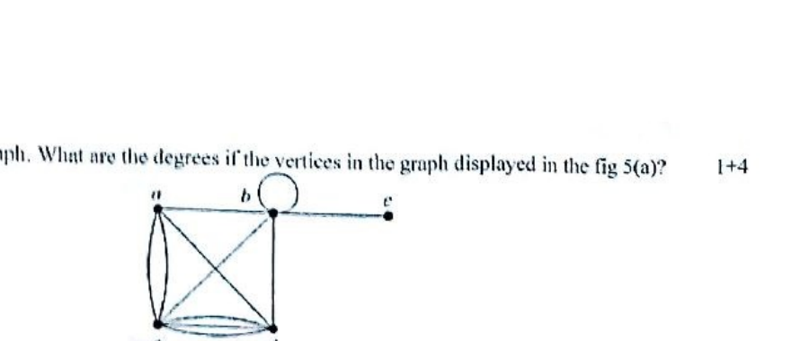
- **Q4(b):** State the handshaking theorem for directed and undirected graph.
- **Q4(c):** Draw the following graphs: (i) $K_4$; (ii) $K_{2,3}$; (iii) $C_6$; (iv) $W_6$; (v) $Q_3$.
- **Q5(a):** Are the graphs shown in Fig. 6(a) bipartite? Justify your answer.

  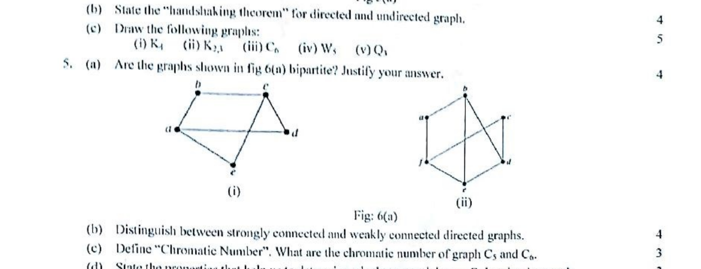
- **Q5(b):** Distinguish between strongly connected and weakly connected directed graphs.
- **Q5(c):** Define Chromatic Number. What are the chromatic number of graph $C_5$ and $C_6$?
- **Q5(d):** State the properties that help us to determine whether a graph has an Euler circuit or path.
- **Q6(d):** Compare between Euler circuit and Hamilton circuit.

### Term 171

- **Q5(a):** Consider the graph G in Fig. 1. (i) Find the set of vertices V(G) and the set of edges E(G); (ii) Find the degree of each vertex and verify the theorem "The sum of the degrees of the vertices of the graph is equal to twice the number of edges in G".

  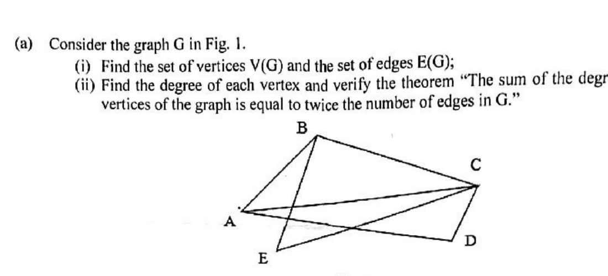
- **Q5(b) [5]:** Explain traversable, Eulerian and Hamiltonian graphs using necessary diagram.
- **Q5(c):** Define complete and regular graphs with example.
- **Q6(a) [10]:** Suppose a weighted graph G in Fig. 2. Represent the graph in memory using sequential and linked list representation.
- **Q6(b) [4]:** Find the minimum spanning tree from the graph G in Fig. 2.

  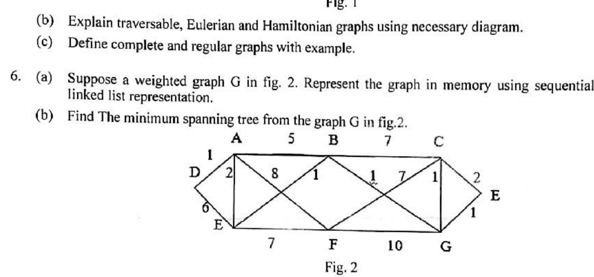

### Term 181

- **Q5:** Consider the graph G in the given figure. (i) Find the set of vertices V(G) and the set of edges E(G); (ii) Find the degree of each vertex and (iii) verify the theorem "The sum of the degrees of the vertices of the graph is equal to twice the number of edges in G."

  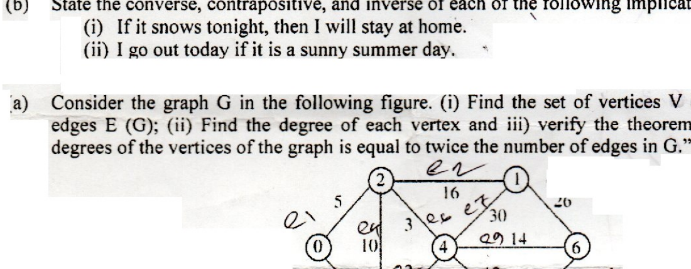
- **Q6(a):** Determine whether the given graph has Hamiltonian circuit. If it does, find such a circuit.

  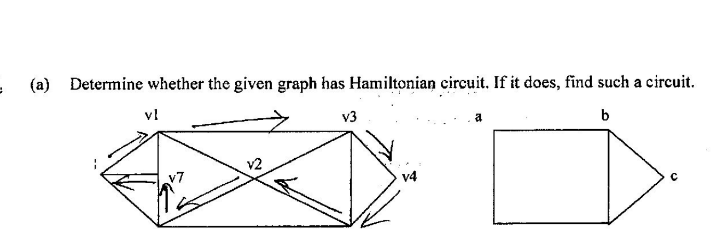
- **Q6(b):** Differentiate between Eulerian graph and Hamiltonian graph with example.
- **Q6(c):** Prove that an undirected graph has an even number of vertices of odd degree.
- **Q7(a):** Show that the given graphs are isomorphic.

  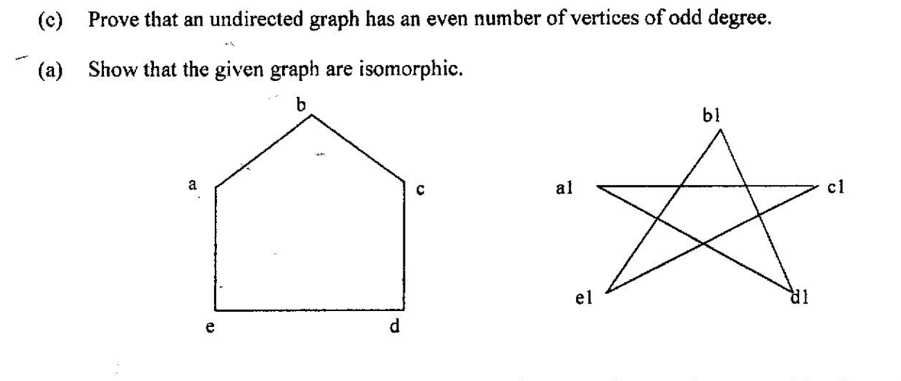

### Term 191

- **Q5(a) [5]:** Consider the graph G in Figure 5(a). (i) Find the number of vertices. (ii) Find the number of edges. (iii) Find the in-degree and out-degree of each vertex. (iv) Verify the theorem $|E|=\sum_{v\in V}\deg^-(v)=\sum_{v\in V}\deg^+(v)$.

  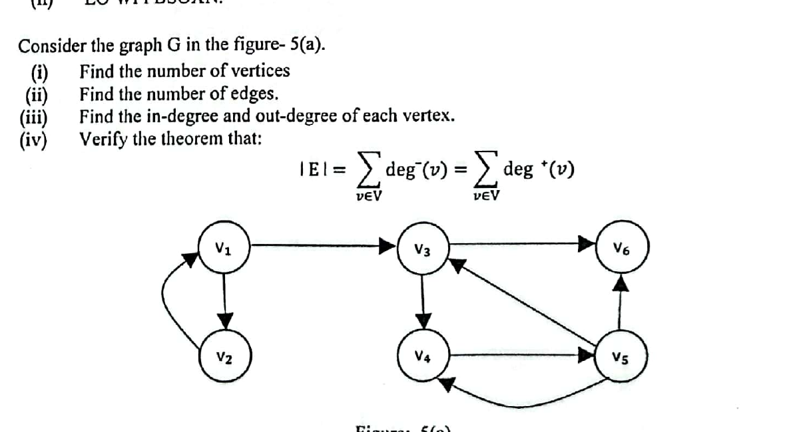

- **Q5(b):** Draw these graphs: (i) $K_7$; (ii) $K_{4,4}$; (iii) $C_7$; (iv) $W_7$; (v) $Q_4$.
- **Q5(c):** (i) If a graph has 5 vertices, can each vertex have degree 3? (ii) Check whether $C_8$ is bipartite or not?
- **Q7(a) [3+2]:** Define planar graph and chromatic number with example. Explain why $K_5$ and $K_{3,3}$ are non-planar?
- **Q7(b) [5]:** Check whether the following two graphs are isomorphic or not?

  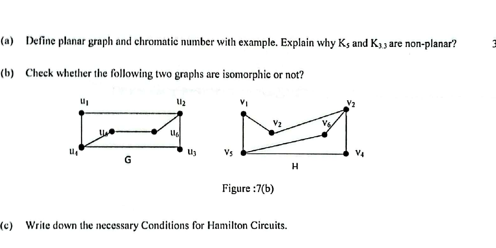

- **Q7(c) [4]:** Write down the necessary Conditions for Hamilton Circuits.

### Term 201

- **Q1(b) [5]:** Consider the graph G in the following figure. (i) Find the set of vertices V(G) and the set of edges E(G); (ii) Find the degree of each vertex and (iii) verify the theorem "The sum of the degrees of the vertices of the graph is equal to twice the number of edges in G."

  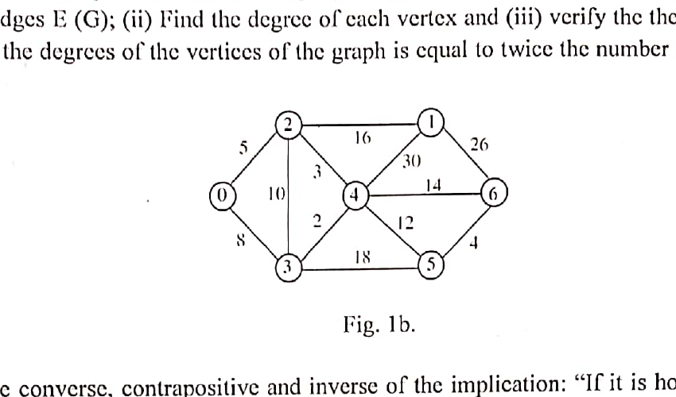

- **Q2(a) [5]:** Suppose a weighted graph G in Fig. 2b. Represent the graph in memory using sequential and linked list representation.
- **Q2(b) [4]:** Find the minimum spanning tree from the graph G in Fig. 2b.

  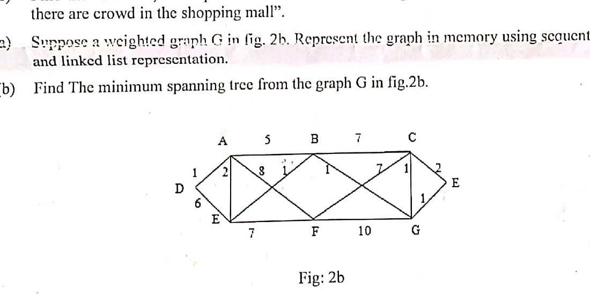

- **Q7(a) [4]:** Show that the given graphs are isomorphic.

  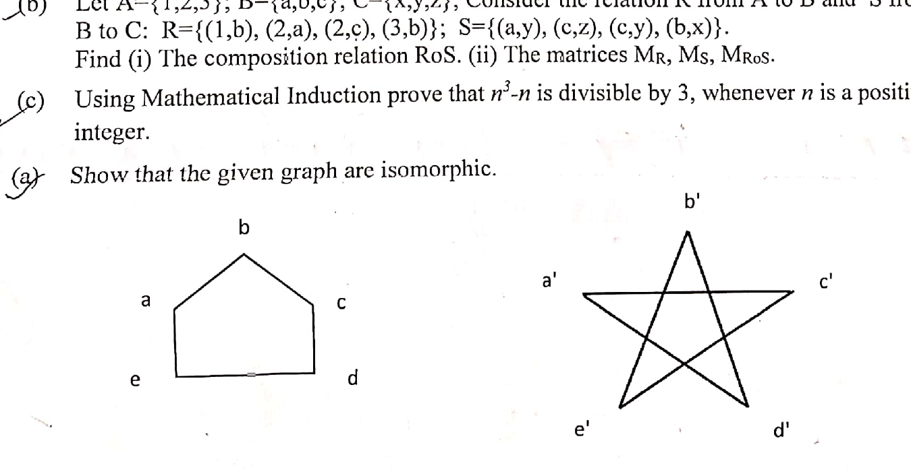

### Term 211

- **Q5(a) [8]:** Find all eight spanning trees of the graph in Fig. 5(a).

  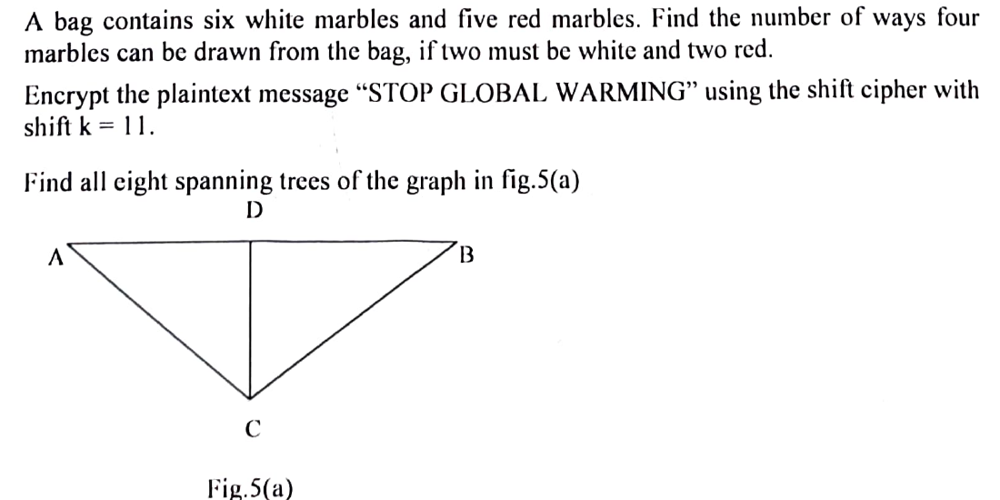

- **Q6(a) [4]:** Represent the graph shown in Figure 6(a) with adjacency and incidence matrix.
- **Q6(b) [4]:** Define minimum spanning tree (MST). Find the MST from Figure 6(a) using Prim's algorithm.

  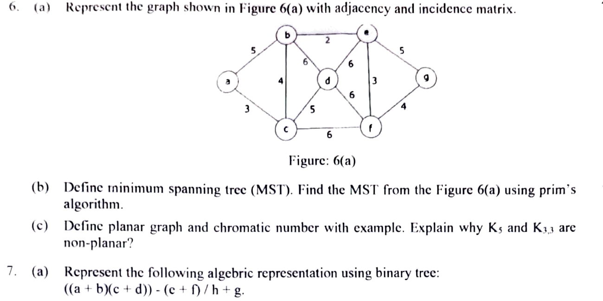

- **Q6(c) [5]:** Define planar graph and chromatic number with example. Explain why $K_5$ and $K_{3,3}$ are non-planar?
