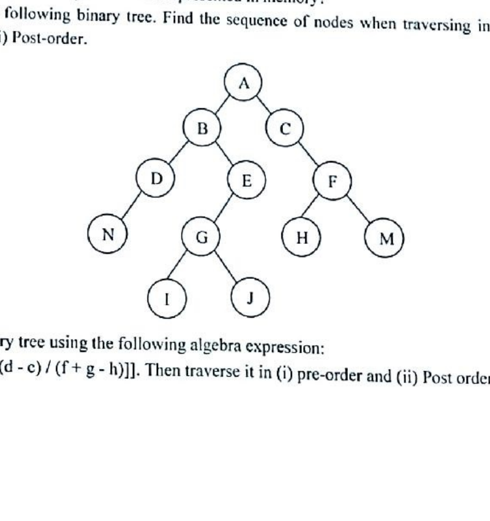
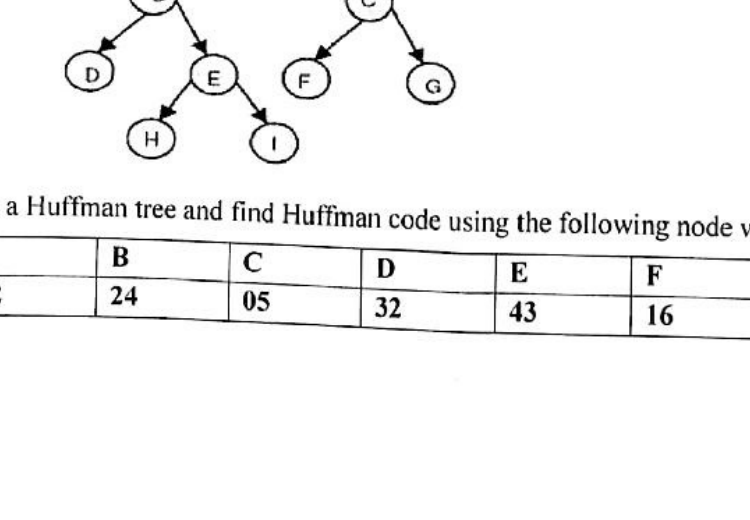
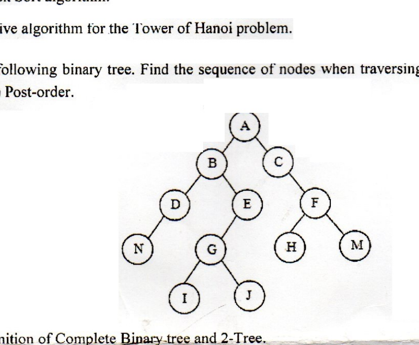
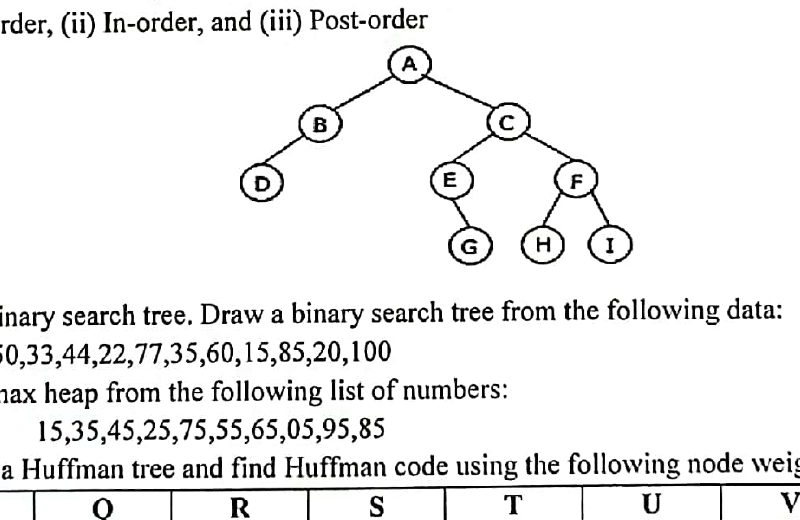
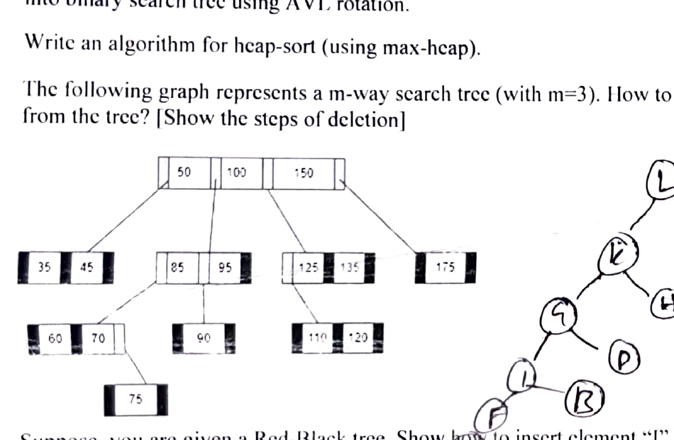
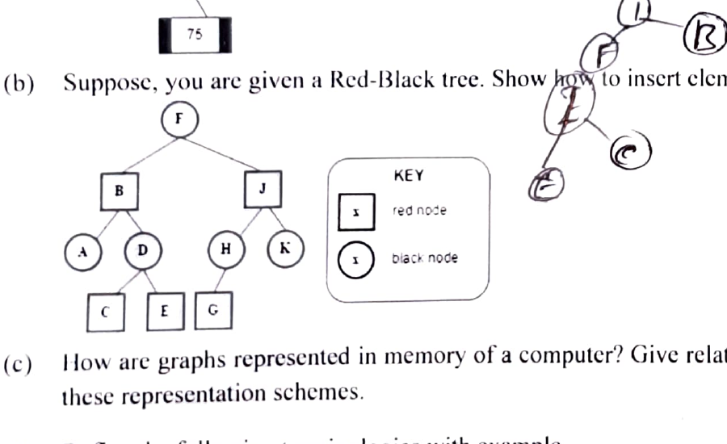

# CSE2135 - Data Structure

## Trees

### Term 161

- **Q6(b) [6]:** Develop a Huffman tree using the following node weights: 20, 2, 8, 7, 4, 10, and 14.
- **Q6(c) [3+5]:** Define maxheap and minheap? Built a heap from the following list of numbers: 44, 30, 50, 22, 60, 55, 77.
- **Q7(a) [2]:** How many ways a binary tree can be represented in memory?
- **Q7(b) [6]:** Consider the following binary tree. Find the sequence of nodes when traversing in (i) Pre-order, (ii) In-order, and (iii) Post-order.

  

- **Q7(c) [6]:** Draw the binary tree using the following algebra expression: `[a + (b - c) * [(d - c) / (f + g - h)]]`. Then traverse it in (i) pre-order and (ii) Post order.

### Term 171

- **Q7(a) [2+3]:** What is binary search tree? Construct a binary search tree by inserting the following sequence of numbers: 10, 12, 5, 4, 20, 8, 7, 15, 13.
- **Q7(b) [3]:** Build a heap from the following list of numbers: 54, 40, 60, 32, 70, 55, 47, 25.
- **Q7(c) [3]:** Consider the following binary tree. Find the sequence of nodes when traversing in (i) Pre-order, (ii) In-order, and Post-order.

  

- **Q7(d) [3]:** Develop a Huffman tree and find Huffman code using the following node weights:

  | A | B | C | D | E | F |
  |---:|---:|---:|---:|---:|---:|
  | 1 | 24 | 05 | 32 | 43 | 16 |

### Term 181

- **Q5(a) [3]:** Consider the following binary tree. Find the sequence of nodes when traversing in (i) Pre-order, (ii) In-order, and (iii) Post-order.

  

- **Q5(b) [3]:** Write the definition of Complete Binary-tree and 2-Tree.
- **Q5(c) [4]:** Built a Max-heap from the following list of numbers: 22, 62, 32, 52, 42, 72, 92, 82, 12.
- **Q5(d) [4]:** Develop a Huffman tree and find Huffman code using the following node weights.
- **Q7(a) [1+2]:** What is binary search tree? Draw a binary search tree for the following data: 5, 10, 20, 3, 2, 7, 11, 18, 17.

### Term 191

- **Q5(a) [3]:** Consider the following binary tree. Find the sequence of nodes when traversing in (i) Pre-order, (ii) In-order, and (iii) Post-order.

  

- **Q5(b) [3]:** Define binary search tree. Draw a binary search tree from the following data: 50, 33, 44, 22, 77, 35, 60, 15, 85, 20, 100.
- **Q5(c) [3]:** Build a max heap from the following list of numbers: 15, 35, 45, 25, 75, 55, 65, 05, 95, 85.
- **Q5(d) [5]:** Develop a Huffman tree and find Huffman code using the following node weights:

  | P | Q | R | S | T | U | V | W |
  |---:|---:|---:|---:|---:|---:|---:|---:|
  | 23 | 10 | 06 | 12 | 32 | 16 | 42 | 37 |

### Term 201

- **Q5(b) [4]:** Write short notes on (i) Extended Binary Trees and (ii) Complete Binary Trees.
- **Q5(c) [6]:** Construct a binary tree T from the following equation E and then find out the (i) pre order, (ii) in order and (iii) post order traversal of tree T: $E:[a*(b\uparrow c)+d]-[(e-f+g)/(h\uparrow i-j)]$.

### Term 211

- **Q3(d) [2+2]:** Build a Huffman Tree from the following table and assign code value for each character.

  | Character | Frequency | Character | Frequency |
  |---|---:|---|---:|
  | a | 5 | b | 25 |
  | c | 1 | d | 18 |
  | e | 12 | f | 35 |

- **Q5(a) [2+1]:** Define Binary tree with an example. How is it different from an ordinary tree?
- **Q5(b) [4]:** Given the following traversal, draw a binary tree:
  1. Inorder: `4 2 5 1 6 7 3 8`; Postorder: `4 5 2 6 7 8 3 1`
  2. Preorder: `A B C E I F J D G H K L`; Inorder: `E J C F J B G D K H L A`
- **Q5(c) [1+4]:** What is balance factor in AVL tree? Construct an AVL tree for data 8, 10, 3, 2, 1, 5, 4, 7 into binary search tree using AVL rotation.
- **Q5(d) [2]:** Write an algorithm for heap-sort (using max-heap).
- **Q6(a) [3]:** The following graph represents a m-way search tree (with m=3). How to delete element 100 from the tree? [Show the steps of deletion]

  

- **Q6(b) [3]:** Suppose, you are given a Red-Black tree. Show how to insert element "I" into the tree?

  
