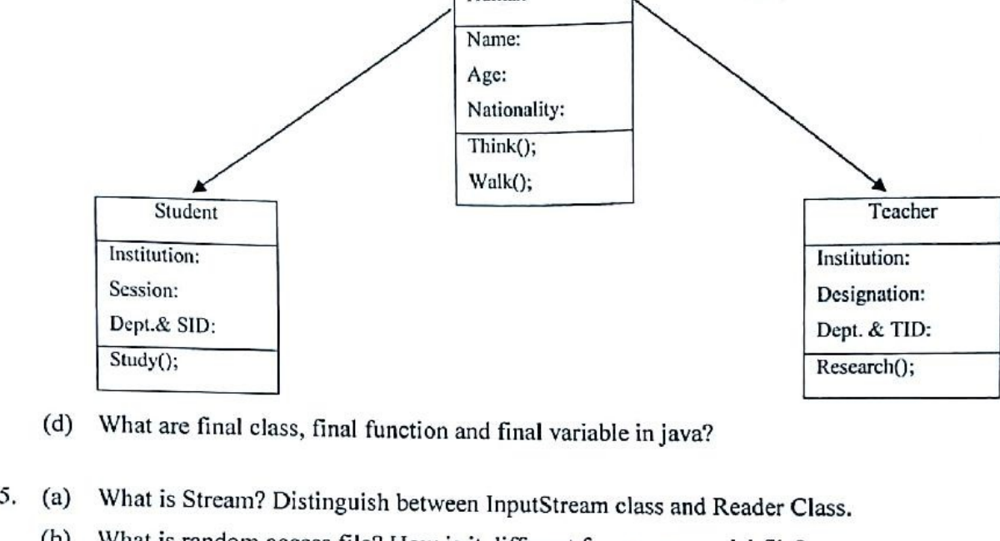
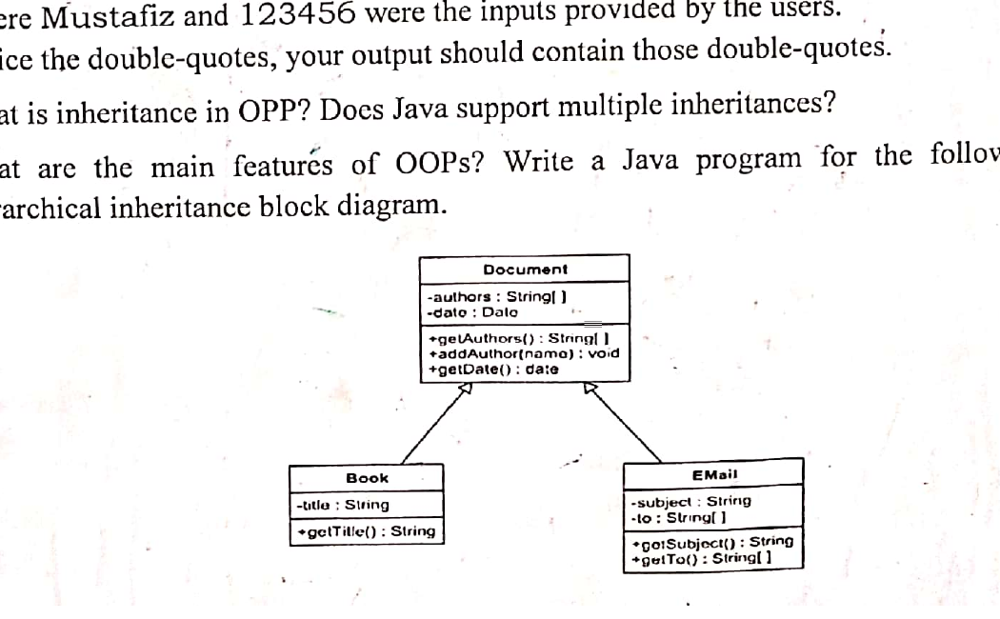

# CSE2137 - Object Oriented Programming

## Inheritance, Interfaces, and OOP Design

### Term 151

- **Q2(d) [2]:** What is encapsulation?
- **Q3(c) [3]:** Does Java support multiple inheritances where each class is able to extend multiple classes?
- **Q3(d) [2]:** Distinguish between an interface and an abstract class with necessary example.
- **Q3(e) [2]:** What do you mean by garbage collection?
- **Q5(b) [6]:** Describe abstract class called "shape" which has three subclasses as "Triangle", "Rectangle" and "Circle". Define one method `area()` in the abstract class and override this `area()` in these three subclasses to calculate for specific object i.e. `area()` of Triangle subclass should calculate area of triangle etc. Same for Rectangle and Circle.
- **Q5(c) [4]:** Discuss public, private, protected and default access modifier with example.

### Term 161

- **Q3(c) [3]:** What are abstract methods? Describe the circumstances in which an abstract method would be appropriate.
- **Q4(c) [4]:** Write a Java program for the following hierarchical inheritance block diagram.

  
- **Q6(c) [4]:** Discuss public, private, protected and default access modifier with example.

### Term 171

- **Q1(b) [6]:** Inheritance, Encapsulation and Polymorphism are three key attributes of Object Oriented Programming (OOP). Discuss these attributes in your own words. Include benefits of these attributes in your answer.
- **Q3(a) [5]:** Abstract classes and interfaces are two very important items we use in developing programs in OOP. What are they and what benefits do they provide us?
- **Q3(c) [1+3]:** What is aggregation in Java? Why and when should we use aggregation?
- **Q5(b) [1+3]:** What are the advantages of Java package? Explain the following four different types of java access modifier: (i) private, (ii) default, (iii) protected, (iv) public.
- **Q6(c) [3]:** What is the purpose of garbage collection in Java and when is it used?

### Term 181

- **Q1(c) [6]:** Explain inheritance, encapsulation and polymorphism with examples.
- **Q3(a) [4]:** Explain what is meant by an 'abstract' class and what circumstance necessitates a class being abstract.
- **Q3(b) [6]:** Write the codes for implementations of the Employee and Person classes.
- **Q5(a) [3+2+1]:** What are Abstract classes and Interfaces? What benefits do they provide? Show how to declare abstract classes and interfaces in java.

### Term 201

- **Q2(a) [4]:** Abstract classes and interfaces are two very important items we use in developing programs in OOP. What are they and what benefits do they provide?
- **Q2(b) [2+2]:** Can we achieve multiple inheritance by using interface? Explain with example. What is the difference between multiple and multilevel inheritance?
- **Q3(a) [1+1]:** What is inheritance in OOP? Does Java support multiple inheritances?
- **Q3(b) [2+2]:** What are the main features of OOPs? Write a Java program for the following hierarchical inheritance block diagram.

  
- **Q4(b) [4]:** Why do you use Upcasting and Downcasting in Java? Explain with examples.

### Term 211

- **Q1(b) [6]:** Inheritance, encapsulation and polymorphism are three attributes of Object Oriented Programming (OOP). Discuss these attributes in your own words.
- **Q3(a) [2+3]:** How to declare a Package in Java? What are the advantages of Packages in Java?
- **Q4(b) [2+3]:** Why is Multiple Inheritance not supported in Java? How Interface is helpful to resolve this matter?
- **Q4(c) [4]:** Why do use upcasting and downcasting in Java? Explain with examples.
