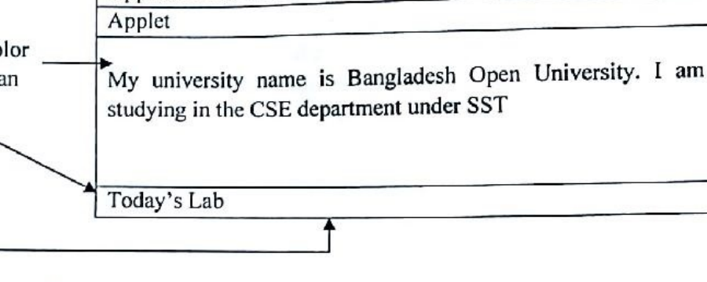
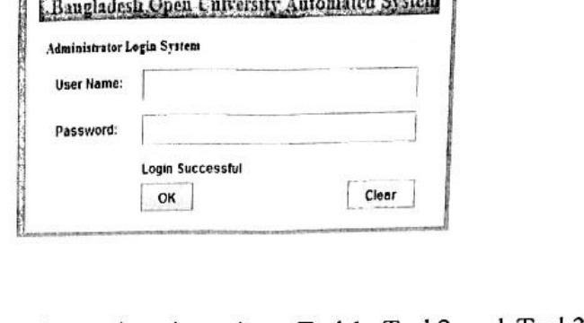
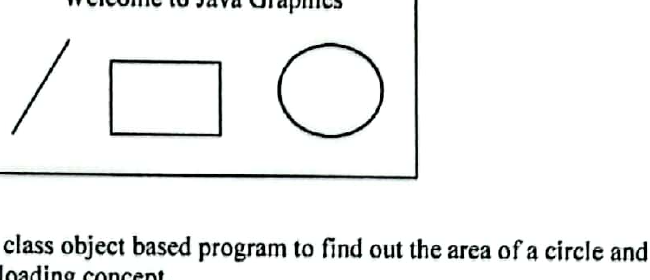
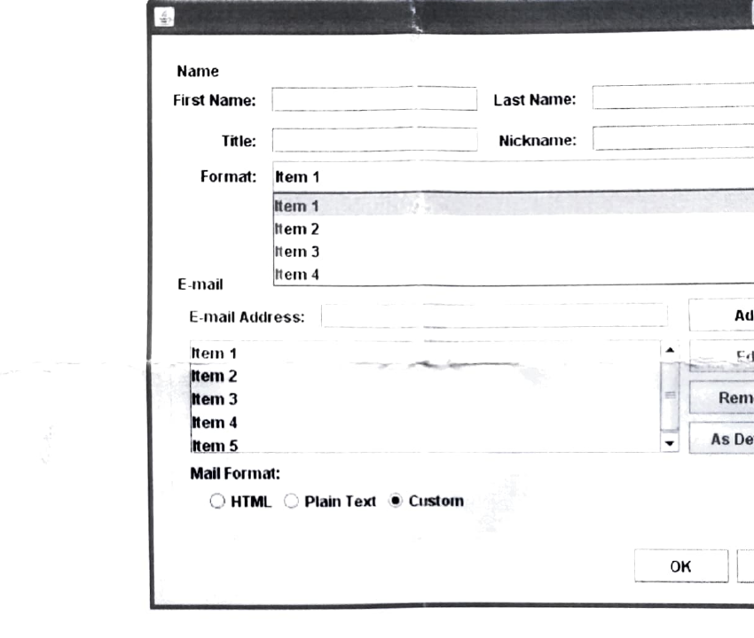

# CSE21P8 - Object Oriented Programming - I Lab

## Event-Based, GUI, Applet, and Graphics Programming

### Term 161

**Exp 5.** Write a Java program to make a simple calculator using Java swing/Applet concept. The calculator perform the following arithmetic Operations of two numbers and display the result on the textbox:

1. Addition (+)
2. Subtraction (-)
3. Multiplication (*)
4. Division (/)
5. Modulus (%)

**Exp 6.** Write a Java Applet program that displays the following window with displayed message. The background color should be set black:

### Term 171

**Exp 3.** Write a Java program to make a simple calculator using Java swing/Applet concept. The calculator perform the following arithmetic Operations of two numbers and display the result on the textbox:

1. Addition (+)
2. Subtraction (-)
3. Multiplication (*)
4. Division (/)

**Exp 6.** Write a Java program to create a Simple administrative Login System as follows, where if you put username as "CSE" and Password as "BOUCSE" in their Textfields and then if you click "OK" button the simple message "Login Successful" is displayed in another label and if you click on "Clear" button the Text fields' data will be cleared.

### Term 191

**Exp 2.** Write a Java program to make a simple calculator using Java swing/Applet concept. The calculator perform the following arithmetic Operations of two numbers and display the result on the textbox:

1. Addition (+)
2. Subtraction (-)
3. Multiplication (*)
4. Division (/)

**Exp 10.** Write a Java Graphics to draw a text, line, rectangle, and circle/oval as follows.

### Term 211

**Exp 02.** Design the GUI given below using Java Swing.

**Exp 09.** Write a Java program using Applets that simulates a traffic light. The program lets the user select one of three lights: red, yellow, or green with radio buttons. On selecting a button, an appropriate message with "stop" or "ready" or "go" should appear above the buttons in a selected color. Initially there is no message shown.
