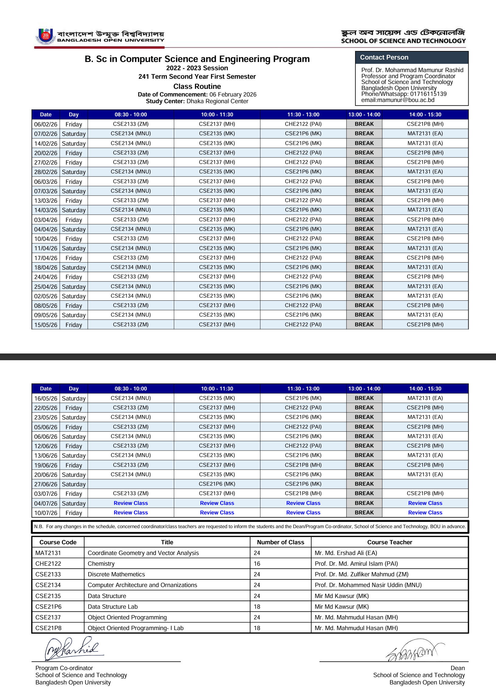
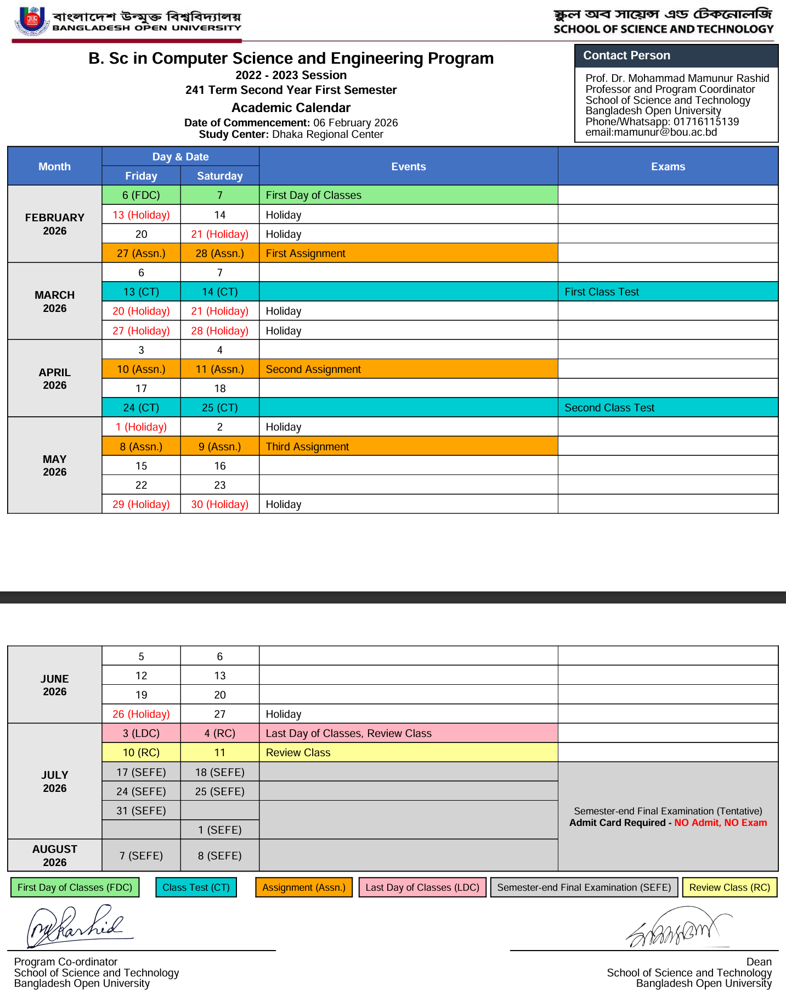
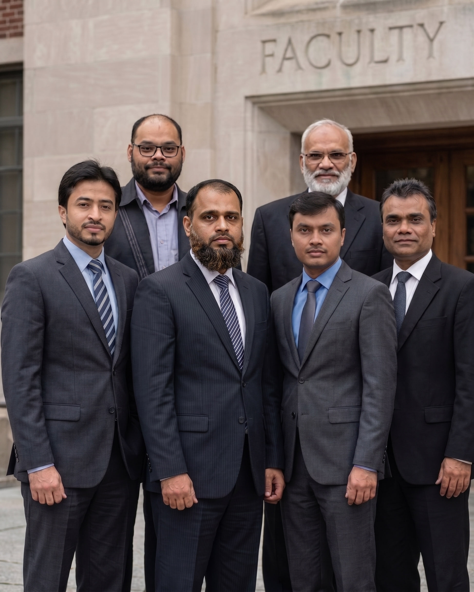
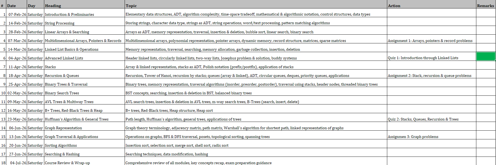
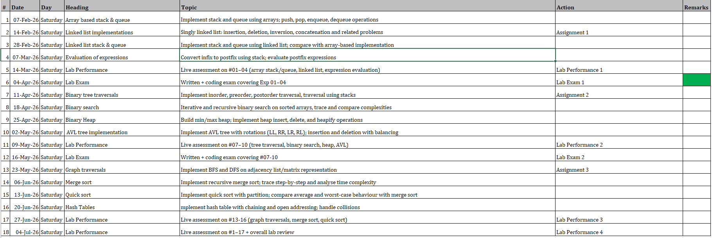
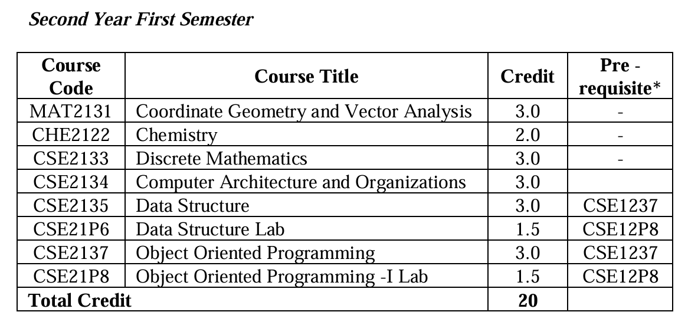

# 21 Semester - 241 Term (2022-23 Session)

??? "Class routine and academic calendar"

    
    

??? "Faculty Members and Subject-wise Resources"

    {width=400px height=400px}
    ### 📐 Coordinate Geometry and Vector Analysis

    * 🔢 **Code**: MAT2131
    * 👨‍🏫 **Teacher**: Mr. Md. Ershad Ali (EA)
    {width=200px height=200px}
    * 🔗 **Resources**: [View](https://www.google.com/search?q=/bou-resources/bou-cse/21-semester/coordinate-geometry-and-vector-analysis/)
    * 📱 **WhatsApp Group**: [21 MATH (MAT2131)](https://www.google.com/search?q=https://chat.whatsapp.com/example)

    -----

    ### 🧪 Chemistry

    * 🔢 **Code**: CHE2122
    * 👨‍🏫 **Teacher**: Prof. Dr. Md. Amirul Islam (PAI)
    {width=200px height=200px}
    * 🔗 **Resources**: [View](https://www.google.com/search?q=/bou-resources/bou-cse/21-semester/chemistry/)
    * 📱 **WhatsApp Group**: [Chemistry (CHE2122)](https://www.google.com/search?q=https://chat.whatsapp.com/example)

    -----

    ### 🧩 Discrete Mathematics

    * 🔢 **Code**: CSE2133
    * 👨‍🏫 **Teacher**: Prof. Dr. Md. Zulfiker Mahmud (ZM)
    {width=200px height=200px}
    * 🔗 **Resources**: [View](https://www.google.com/search?q=/bou-resources/bou-cse/21-semester/discrete-mathematics/)
    * 📱 **WhatsApp Group**: [Discrete Math (CSE2133)](https://www.google.com/search?q=https://chat.whatsapp.com/example)

    -----

    ### 🏗️ Computer Architecture and Organizations

    * 🔢 **Code**: CSE2134
    {width=200px height=200px}
    * 👨‍🏫 **Teacher**: Prof. Dr. Mohammed Nasir Uddin (MNU)
    * 🔗 **Resources**: [View](https://www.google.com/search?q=/bou-resources/bou-cse/21-semester/computer-architecture/)
    * 📱 **WhatsApp Group**: [Computer Architecture (CSE2134)](https://www.google.com/search?q=https://chat.whatsapp.com/example)

    -----

    ### 📊 Data Structure

    * 🔢 **Code**: CSE2135
    * 👨‍🏫 **Teacher**: Mir Md Kawsur (MK)
    {width=200px height=200px}
    * 🔗 **Resources**:
    * ??? info "Data Structure Routine"
        

    * 📱 **WhatsApp Group**: [BOU-DS](https://chat.whatsapp.com/FrulEnMBw6G3PWtVcQmfgA)

    -----

    ### 🧪 Data Structure Lab

    * 🔢 **Code**: CSE21P6
    * 👨‍🏫 **Teacher**: Mir Md Kawsur (MK)
    {width=200px height=200px}
    * 🔗 **Resources**: [View](https://www.google.com/search?q=/bou-resources/bou-cse/21-semester/data-structure-lab/)

    * ??? info "Data Structure Lab Routine"
        

    * 📱 **WhatsApp Group**: [BOU-DS](https://chat.whatsapp.com/FrulEnMBw6G3PWtVcQmfgA)

    -----

    ### 💻 Object Oriented Programming

    * 🔢 **Code**: CSE2137
    * 👨‍🏫 **Teacher**: Mr. Md. Mahmudul Hasan (MH)
    {width=200px height=200px}
    * 🔗 **Resources**: [View](https://www.google.com/search?q=/bou-resources/bou-cse/21-semester/oop/)
    * 📱 **WhatsApp Group**: [OOP Theory (CSE2137)](https://www.google.com/search?q=https://chat.whatsapp.com/example)

    -----

    ### ⌨️ Object Oriented Programming- I Lab

    * 🔢 **Code**: CSE21P8
    * 👨‍🏫 **Teacher**: Mr. Md. Mahmudul Hasan (MH)
    {width=200px height=200px}
    * 🔗 **Resources**: [View](https://www.google.com/search?q=/bou-resources/bou-cse/21-semester/oop-lab/)
    * 📱 **WhatsApp Group**: [OOP Lab (CSE21P8)](https://www.google.com/search?q=https://chat.whatsapp.com/example)

??? "Subjects"

    

## Assignments and CTs

??? "First CT and Assignments"

    📢 Upcoming CT & Assignments Schedule
    ━━━━━━━━━━━━━━━━━━━━

    🗓 10/04/26
    #DM CT-01
    Topics: Lec - 2, 3, 4
    Drive: [drive](https://drive.google.com/drive/folders/1T2F-M5eXwr2TJ-2NTW7L_iHcip9uvNuN)

    #DM Assignment-01 (হাতে লিখতে হবে ✍️)
    Discrete Mathematics Assignment - 01:
    Page: 23 -> Problem number: 17, 23, 41, 43
    Page: 35 -> 33, 61

    #Chemistry CT-01
    Topics: Atomic Structure, Periodic Table

    #Chemistry Assignment-01 & 02 (Type করতে হবে 💻)
    Assignment 01 -> Molecular Orbital Theory
    Assignment 02 -> Valance bond theory
    (Next class: 10/04/26)

    ━━━━━━━━━━━━━━━━━━━━

    🗓 11/04/26
    #DS Theory CT-01
    #DS Lab CT-01
    (DS BOU) CT-1 Syllabus:
    1. Definition of Data, Record, Entity, Data Structures
    2. Classification of Data Structures
    3. Abstract Data Types (ADT)
    4. Time & Space Complexity
    5. 1-D Array
    6. Stack & Queue

    #Assignment-1:
    Design and implement a custom C library named after yourself for efficient string handling using structures. (Length, Concatenate, Substring, Copy, Compare, Reverse, Trim).

    ━━━━━━━━━━━━━━━━━━━━

    🗓 18/04/26
    #Math CT-01
    Top.: 04/04/2026 পর্যন্ত যা যা পড়ানো হয়েছে Vector থেকে।

    #Math Assignment-01 (হাতে লিখতে হবে ✍️)
    ক্লাসে দাগিয়ে দেয়া হয়েছে এবং পরবর্তীতে জানানো হবে।

    ━━━━━━━━━━━━━━━━━━━━

    🗓 24/04/26
    #OOP Theory CT-01
    Syllabus: চিত্রের inheritance পর্যন্ত যা পড়ানো হয়েছে।
    বইঃ https://drive.google.com/file/d/16wS4nI_pxdigSlP3MkLCHwfwZJxGDKUk/view?usp=drive_link
    ━━━━━━━━━━━━━━━━━━━━

    🗓 01/05/26
    #OOP Lab CT-01
    Syllabus: যা পড়ানো হবে CT এর আগে পর্যন্ত।

    ━━━━━━━━━━━━━━━━━━━━
    📌 নোট: Discrete Math এবং Math এসাইনমেন্ট হাতে লিখে এবং Chemistry টাইপ করে জমা দিতে হবে।
