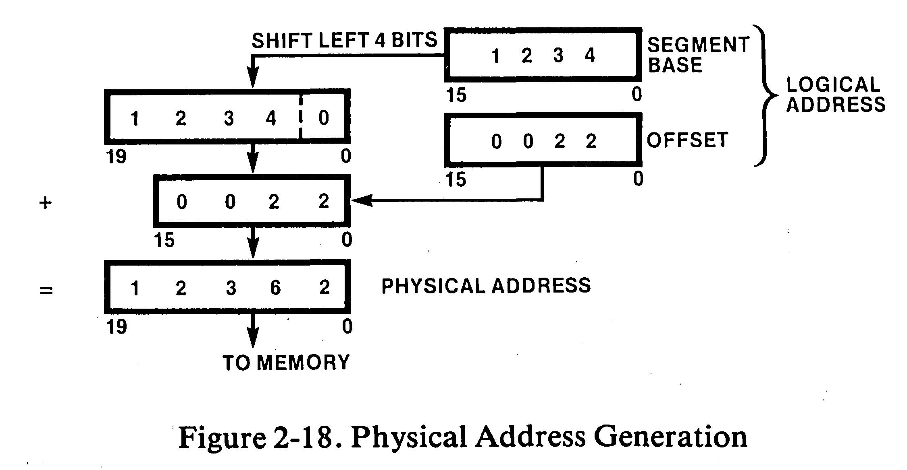

Intel 8086-কে **16-bit মাইক্রোপ্রসেসর** বলা এবং এর **ডেটা বাস 16-bit** হওয়ার পেছনের অর্থ মূলত প্রসেসরের অভ্যন্তরীণ প্রসেসিং ক্ষমতা এবং বাইরের সাথে ডেটা স্থানান্তরের সক্ষমতার পরিমাপ:

### ১. "16-bit মাইক্রোপ্রসেসর" এর অর্থ (Internal Architecture)

একটি প্রসেসর কত বিটের, তা নির্ভর করে তার ভেতরের কাঠামোর উপর:

* **ALU (Arithmetic Logic Unit):** 8086-এর অভ্যন্তরীণ ALU 16-bit এর। অর্থাৎ, এটি একটি একক অপারেশন বা সাইকেলে সর্বোচ্চ 16-bit বাইনারি ডেটার যোগ, বিয়োগ বা লজিক্যাল অপারেশন সম্পন্ন করতে পারে।
* **রেজিস্টার সাইজ:** এর ভেতরের জেনারেল পারপাস রেজিস্টারগুলো (যেমন: AX, BX, CX, DX) এবং পয়েন্টার/ইনডেক্স রেজিস্টারগুলো 16-bit ডেটা ধারণ করতে পারে।
* **সহজ কথায়:** প্রসেসরটি ভেতরে একসাথে 16-bit বা 2 বাইট ডেটা নিয়ে প্রসেসিং বা কাজ করতে সক্ষম।

---

### ২. "Data Bus 16-bit" এর অর্থ (External Data Transfer)

ডেটা বাস হলো প্রসেসর এবং মেমোরি বা ইনপুট/আউটপুট (I/O) ডিভাইসের মধ্যে ডেটা আদান-প্রদানের ফিজিক্যাল তার বা সংযোগ লাইন:

* **ফিজিক্যাল লাইন (D0 – D15):** 8086-এ ডেটা চলাচলের জন্য ১৬টি আলাদা তার বা পিন রয়েছে (যা অ্যাড্রেস বাসের সাথে মাল্টিপ্লেক্সড অবস্থায় থাকে)।
* **একবারে স্থানান্তর:** মেমোরি থেকে প্রসেসরে ডেটা আনা (Read) বা মেমোরিতে পাঠানো (Write)-র সময় এটি এক ক্লক অপারেশনে একসাথে পুরো 16-bit (2 বাইট) ডেটা পরিবহন করতে পারে।
* **সহজ কথায়:** মেমোরির সাথে প্রসেসরের ডেটা আদান-প্রদানের হাইওয়ে-টি ১৬ লেনের।

---

### এদের মধ্যকার মূল পার্থক্য

| বিষয় | 16-bit মাইক্রোপ্রসেসর | 16-bit ডেটা বাস |
| --- | --- | --- |
| **ক্ষেত্র** | প্রসেসরের অভ্যন্তরীণ (Internal) ক্ষমতা | প্রসেসরের বাহ্যিক (External) সংযোগ |
| **কাজ** | ডেটা ক্যালকুলেশন ও ম্যানিপুলেশন করা | মেমোরি/পেরিফেরাল থেকে ডেটা পরিবহন করা |
| **গুরুত্ব** | প্রসেসিং গতি ও নির্ভুলতা বাড়ায় | ডেটা ট্রান্সফার রেট বা ব্যান্ডউইথ বাড়ায় |

> **বাস্তব উদাহরণ:** Intel 8088 প্রসেসর ভেতরে 16-bit ছিল (অর্থাৎ internal ALU 16-bit), কিন্তু বাইরে খরচ কমানোর জন্য তার ডেটা বাস ছিল 8-bit। ফলে একটি 16-bit ডেটা আনতে 8088-এর মেমোরিতে দুইবার যেতে হতো। কিন্তু **8086**-এর অভ্যন্তরীণ ক্ষমতা এবং ডেটা বাস দুটোই 16-bit হওয়ায় এটি এক সাইকেলেই পুরো 16-bit ডেটা নিয়ে এসে সরাসরি প্রসেস করতে পারে।

!!! "**Intel 8086 আগে বাজারে এসেছে**, আর **8088 এসেছে তার ১ বছর পর**।"

    * **Intel 8086:** মুক্তি পায় **১৯৭৮ সালের জুন** মাসে।
    * **Intel 8088:** মুক্তি পায় **১৯৭৯ সালের জুন** মাসে।

    ---

    ### তাহলে 8088 আগে আসার বিভ্রান্তি কেন তৈরি হয়?

    এই ভুল ধারণার মূল কারণ **IBM Personal Computer (IBM PC 5150)**।

    ১৯৮১ সালে আইবিএম যখন তাদের প্রথম যুগান্তকারী পার্সোনাল কম্পিউটার তৈরি করে, তখন তারা 8086 ব্যবহার না করে **8088 প্রসেসর বেছে নিয়েছিল**। এই কম্পিউটারটি বিশ্বজুড়ে অবিশ্বাস্য জনপ্রিয়তা পায় এবং সাধারণ মানুষের কাছে পিসির যুগ শুরু হয়। ফলে ইতিহাসের পাতায় 8088-এর নাম বেশি দৃশ্যমান থাকায় অনেকে ভাবেন এটিই হয়তো আগে এসেছিল।

    ---

    ### 8086 থাকার পরেও ইন্টেল কেন পরে 8088 বানালো?

    8086 একটি শক্তিশালী প্রসেসর হলেও ১৯৭৮ সালে বাজারে আসার পর কোম্পানিগুলো এটি কিনতে দ্বিধা করছিল। এর পেছনে প্রধান কারণগুলো ছিল:

    * **কম্পোনেন্টের অতিরিক্ত খরচ:** ১৯৭৮-৭৯ সালের দিকে বাজারে থাকা বেশিরভাগ র‍্যাম, রম এবং সাপোর্ট চিপ (যেমন 8255, 8259) ছিল 8-bit আর্কিটেকচারের। একটি সম্পূর্ণ 16-bit সিস্টেমের জন্য মাদারবোর্ডে ১৬টি ডেটা ট্র্যাক এবং ব্যয়বহুল 16-bit সাপোর্ট চিপ লাগত, যা পুরো সিস্টেমের দাম অনেক বাড়িয়ে দিত।
    * **সার্কিট বোর্ডের জটিলতা:** মাদারবোর্ডে ১৬টি ডেটা লাইন লে-আউট করা তখনকার প্রযুক্তি অনুযায়ী জটিল ও খরুচে ছিল। ৮-লাইনের বোর্ড তৈরি করা অনেক সস্তা ও সহজ ছিল।
    * **ইন্টেলের বাণিজ্যিক কৌশল:** প্রস্তুতকারকদের 16-bit প্রসেসরে রূপান্তর সহজ করতে ইন্টেল 8086-এর অভ্যন্তরীণ ক্ষমতা হুবহু এক রেখে কেবল বাইরের ডেটা বাসটি অর্ধেক (8-bit) করে দেয়। এর নাম দেওয়া হয় **8088**।

    এর ফলে নির্মাতারা সস্তা 8-bit সার্কিট বোর্ড ও কম্পোনেন্ট ব্যবহার করেই 16-bit প্রসেসিং ক্ষমতার সুবিধা পেতে শুরু করে, যার কারণেই পরবর্তীতে আইবিএম-ও এটি বেছে নেয়।

পুরো বিষয়টি কোনো জটিল সমীকরণ ছাড়াই একদম বাস্তব যন্ত্রপাতি ও দৃশ্যের মতো করে কল্পনা করা যাক:

### ১. কেন দুটি মান লাগে? (বাস্তব উপমা)

ধরুন, একটি বিশাল লাইব্রেরিতে মোট **১০ লাখ বই** আছে।
আপনার কাছে একটি চিরকুট আছে যাতে আপনি সর্বোচ্চ **৪ সংখ্যার** বেশি কিছু লিখতে পারেন না (অর্থাৎ ০ থেকে ৯৯৯৯ পর্যন্ত)।

তাহলে আপনি কীভাবে এই চিরকুট দিয়ে **৭,৫০,২৫০** নম্বর বইটি খুঁজে বের করবেন?

* **সমাধান:** আপনি পুরো লাইব্রেরিকে কয়েকটি **আলমারিতে (Segment)** ভাগ করলেন।
* চিরকুটে আপনি দুটি সংখ্যা লিখলেন:
1. **আলমারি নম্বর:** কোন আলমারিতে যাব? (Segment)
2. **তাকের দূরত্ব:** ঐ আলমারির শুরু থেকে ঠিক কতগুলো বই পরে যাব? (Offset)

* এই দুই তথ্য মিলেই কিন্তু পুরো লাইব্রেরির সুনির্দিষ্ট একটি বই (Physical Address) চিহ্নিত হয়ে যায়।

8086-এর অভ্যন্তরীণ রেজিস্টারগুলো ছিল ১৬-বিটের (যা দিয়ে সর্বোচ্চ ৬৪ হাজারের বেশি গোনা যেত না), কিন্তু ইন্টেল চেয়েছিল প্রসেসরটি যাতে পুরো ১০ লাখ বাইট (1 MB) মেমরি অ্যাক্সেস করতে পারে। তাই তারা এই "আলমারি + তাক"-এর মতো **Segment + Offset** পদ্ধতি বানায়।

---

### ২. হার্ডওয়্যারে কোথায় কী আছে?

কল্পনা করুন একটি কম্পিউটার মাদারবোর্ড:

* **CPU চিপের ভেতরে:**
* ছোট ছোট মেমরি ড্রয়ার আছে, যাদের নাম **Segment Register** (যেমন CS, DS) এবং **Offset Register** (যেমন IP, BX)। এগুলোর সাইজ ১৬-বিট।
* প্রসেসরের ভেতরে একটি বিশেষ যোগ করার হার্ডওয়্যার সার্কিট আছে, যার নাম **20-bit Adder** (এটি Bus Interface Unit বা BIU-তে থাকে)।

* **CPU এবং র‍্যামের মাঝে:**
* প্রসেসর চিপ থেকে **২০টি তামার সরু তার বা পিন ($A_0 - A_{19}$)** বের হয়ে মাদারবোর্ডের ওপর দিয়ে সরাসরি র‍্যাম (RAM) চিপের সাথে যুক্ত।

* **র‍্যামের (RAM) ভেতরে:**
* র‍্যাম হলো ১ থেকে ১০,৪৮,৫৭৬ পর্যন্ত নম্বর দেওয়া দশ লাখের বেশি ছোট ছোট খোপ (Memory Cells), যার প্রতিটিতে ১ বাইট ডেটা রাখা যায়।

---

### ৩. কীভাবে ২০-বিট তৈরি হয়ে র‍্যামে যায়?

নিচের চিত্রে ইন্টেলের মূল আর্কিটেকচার অনুযায়ী পুরো প্রক্রিয়াটি লক্ষ্য করুন:

প্রসেসর যখন র‍্যাম থেকে কোনো ডেটা পড়তে চায়, ভেতরে ঠিক এই কাজগুলো ঘটে:

1. **বেস ঠিকানা নির্বাচন (Segment Base):** প্রসেসর সেগমেন্ট রেজিস্টার থেকে ১৬-বিট মান নেয় (চিত্রে যেমন: `1234` হেক্সাডেসিমেল)।
2. **৪-বিট শিফট (হার্ডওয়্যার ট্রিক):** প্রসেসর কোনো বড় গুণ করে না। সার্কিটের ভেতর তারগুলোকে এমনভাবে জুড়ে দেওয়া হয়েছে যাতে মূল ১৬টি লাইনের ডানে ৪টি শূন্যের তার (0000 বাইনারি) স্বয়ংক্রিয়ভাবে জুড়ে যায়। হেক্সাডেসিমেলে এটি দেখতে ডানে একটি `0` বসে যাওয়ার মতো: `1234` হয়ে যায় ২০-বিটের `12340`।
3. **দূরত্ব যোগ (Offset):** অফসেট রেজিস্টার থেকে ১৬-বিট দূরত্ব নেয় (চিত্রে: `0022`)।
4. **অ্যাডার সার্কিটে যোগ:** ভেতরের ২০-বিট অ্যাডার সার্কিট এই দুটি যোগ করে চূড়ান্ত ২০-বিট ফিজিক্যাল ঠিকানা তৈরি করে:

$$\text{12340} + \text{0022} = \mathbf{12362}\text{ (Hex)}$$

5. **তারের ভেতর দিয়ে সংকেত পাঠানো:** এই ২০-বিট মানটিকে বাইনারি ভোল্টেজে (High = 5V, Low = 0V) রূপান্তর করে প্রসেসরের ২০টি ফিজিক্যাল তারে ($A_0 - A_{19}$) ছেড়ে দেওয়া হয়। এই ২০টি তার গিয়ে সরাসরি র‍্যামের `12362` নম্বর সুনির্দিষ্ট খোপটির সুইচ চালু করে দেয় এবং ডেটা প্রসেসরে চলে আসে।

??? "১৬ বিট বলা হচ্ছে কিন্তু লিখতেছে চারটা সংখ্যা - এমন কেন?" 

    কারণ এই সংখ্যাগুলো সাধারণ দশমিক বা বাইনারিতে নয়, লেখা হয়েছে **হেক্সাডেসিমেল (Hexadecimal বা Hex)** সংখ্যা পদ্ধতিতে।

    কম্পিউটার আর্কিটেকচারে প্রতি **১টি হেক্সাডেসিমেল ডিজিট সমান ৪টি বাইনারি বিট** ($2^4 = 16$ মান, অর্থাৎ 0 থেকে F পর্যন্ত)।

    তাই **৪টি হেক্সাডেসিমেল ডিজিট = $4 \times 4 = \mathbf{16\text{ bits}}$**।

    ---

    ### ভেঙে দেখলে বিষয়টি কেমন দেখায়?

    ধরা যাক, রেজিস্টারে লেখা মানটি হলো `1234` (Hex)। কম্পিউটার হার্ডওয়্যার কিন্তু এটিকে এভাবে ১৬টি তার বা বিটে রূপান্তর করে দেখে:

    | Hex ডিজিট | বাইনারি মান (৪ বিট) |
    | --- | --- |
    | **1** | `0001` |
    | **2** | `0010` |
    | **3** | `0011` |
    | **4** | `0100` |
    | **মোট ৪ ডিজিট** | **`0001 0010 0011 0100` (১৬ বিট)** |

    ---

    ### আগের ২০-বিট অ্যাড্রেসে তাহলে ৫টি ডিজিট কেন হয়েছিল?

    ঠিক একই নিয়মে:

    * **১টি ডিজিট** = ৪ বিট
    * **৫টি ডিজিট** = $5 \times 4 = \mathbf{20\text{ bits}}$

    এ কারণেই ২০-বিট ফিজিক্যাল অ্যাড্রেসটি লেখার সময় ৫ ডিজিটের হয়ে যায়:

    * যেমন: `12362` = `0001 0010 0011 0110 0010` (মোট ২০টি বিট বা তারের ভোল্টেজ)।

    ### ইঞ্জিনিয়াররা ১৬টি শূন্য/এক (0/1) না লিখে ৪ ডিজিট লেখেন কেন?

    কম্পিউটার মেমরির ভেতরে ১৬টি তারে বিদ্যুতের উপস্থিতি বোঝাতে যদি প্রতিবার `0001001000110100`-এর মতো দীর্ঘ বাইনারি লিখতে হতো, তবে মানুষের চোখে পড়া এবং ভুল ধরা অসম্ভব হয়ে যেত। তাই প্রতি ৪টি বিটকে গুচ্ছ করে সংক্ষেপে মাত্র ১টি হেক্স ডিজিট দিয়ে লেখা হয়।