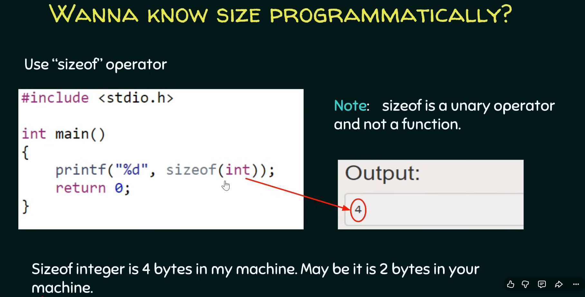

# Integer

=== "Bangla"

    ### ইন্টিজার ডেটা টাইপের মেমোরি সাইজ (Memory Size of Integer Data Type)
    * সি ল্যাঙ্গুয়েজের একটি মৌলিক বা ফান্ডামেন্টাল ডেটা টাইপ (Fundamental Data Type) হলো ইন্টিজার (Integer)। 
    * মেমরিতে এটি ২ বাইট (2 bytes) অথবা ৪ বাইট (4 bytes) জায়গা দখল করে, যা মূলত ব্যবহৃত মেশিনের আর্কিটেকচারের ওপর ডিপেন্ড করে। 
    * আমরা জানি ১ বাইট সমান ৮ বিট, সেই হিসাবে ২ বাইট মানে ১৬ বিট এবং ৪ বাইট মানে ৩২ বিট। মেমরির সাইজ যত বেশি হবে, ভ্যারিয়েবলের ডেটা বা কন্টেন্ট হোল্ড করার ক্ষমতাও তত বাড়বে।

    ### sizeof অপারেটরের ব্যবহার (Use of sizeof Operator)
    * কোডের মাধ্যমে প্রোগ্রামাটিক্যালি ইন্টিজারের একচুয়াল সাইজ জানতে সি ল্যাঙ্গুয়েজে `sizeof` অপারেটর ব্যবহার করা হয়।
    * একটি গুরুত্বপূর্ণ টেকনিক্যাল বিষয় হলো, `sizeof` কোনো ফাংশন নয়, এটি একটি ইউনারি অপারেটর (Unary Operator)। 
    * মেশিনে যদি ইন্টিজার ৪ বাইট জায়গা নেয়, তবে `printf` ফাংশনের মাধ্যমে এই অপারেটরটি আউটপুট হিসেবে ৪ প্রদর্শন করবে।

    ### ডেটা সেটের রেঞ্জ (Definition of Range)
    * রেঞ্জ (Range) বলতে মূলত কোনো নির্দিষ্ট ডেটা সেটের সর্বোচ্চ এবং সর্বনিম্ন সীমাকে (Upper and lower limit) বোঝায়।
    * উদাহরণস্বরূপ, একটি ডেটা সেট যদি {0, 1, 2, 3, 4} হয়, তবে এর সর্বনিম্ন মান ০ এবং সর্বোচ্চ মান ৪; অর্থাৎ এর রেঞ্জ হলো ০ থেকে ৪ পর্যন্ত। এই সেটের ভেতর ০ এর চেয়ে ছোট বা ৪ এর চেয়ে বড় কোনো মান থাকতে পারবে না।

    ### ডেসিমাল নাম্বার সিস্টেম (Decimal Number System)
    * ইন্টিজারের রেঞ্জ ক্যালকুলেশন ভালোভাবে বোঝার ফাস্ট প্রি-রিকুইজিট (Prerequisite) হলো ডেসিমাল নাম্বার সিস্টেম বা দশমিকে সংখ্যার গঠন জানা।
    * এটি মানুষের বোধগম্য একটি পদ্ধতি এবং একে বেস ১০ (Base 10) নাম্বার সিস্টেম বলা হয়, যার মানে এখানে ০ থেকে ৯ পর্যন্ত মোট ১০টি ডিজিট ব্যবহার করা যায়।
    * যেমন ৫৬৮ (568) সংখ্যাটিকে আমরা সরাসরি 'পাঁচশত আটষট্টি' বলি কারণ এর ভেতরের প্রতিটি ডিজিটকে তার ডানদিকের শেষ প্রান্ত থেকে নিজস্ব প্লেস ভ্যালু বা স্থানীয় মান (Place values) দিয়ে গুণ করা হয় ($8 \times 10^0 = 8$, $6 \times 10^1 = 60$, $5 \times 10^2 = 500$) এবং সবশেষে গুণফলগুলো যোগ করে চূড়ান্ত মান ৫৬৮ পাওয়া যায়।

    ### বাইনারি নাম্বার সিস্টেম (Binary Number System)
    * কম্পিউটার ডেসিমাল বোঝে না, এর ভেতরের মূল খেল চলে বাইনারি নাম্বার সিস্টেম (Binary Number System) বা বেস ২ (Base 2) পদ্ধতি দিয়ে, যেখানে কেবল ০ এবং ১ এই দুটি ডিজিট থাকে।
    * ৪-বিটের একটি বাইনারি ডেটা `1100` এর ডেসিমাল মান বের করতে হলে ডানদিকের শেষ প্রান্ত থেকে ২ এর পাওয়ারের প্লেস ভ্যালুগুলো ($2^0, 2^1, 2^2, 2^3$) দিয়ে ডিজিটগুলোকে গুণ করতে হবে। হিসাবটি হলো: $(0 \times 2^0) + (0 \times 2^1) + (1 \times 2^2) + (1 \times 2^3) = 0 + 0 + 4 + 8 = 12$।

    ### ৪-বিট ডেটার রেঞ্জ নির্ণয় (Calculating Range of 4-bit Data)
    * ৪-বিট ডেটার ক্ষেত্রে সর্বনিম্ন মান হতে পারে ০ (যখন সব বিট ০) এবং সর্বোচ্চ মান হতে পারে ১৫ (যখন সব বিট ১)।
    * যেকোনো বড় বা ৩২-বিট ডেটার সর্বোচ্চ আনসাইন্ড মান বের করার জন্য একটি জোস ও হ্যান্ডি (Handy) ফর্মুলা হলো $2^n - 1$। এখানে বিট সংখ্যা $n = 4$ বসালে আমরা পাই $2^4 - 1 = 16 - 1 = 15$, অর্থাৎ ৪-বিট ডেটার রেঞ্জ হলো ০ থেকে ১৫।

    ### ইন্টিজারের রেঞ্জ ক্যালকুলেশন (Integer Range Calculation)
    * **২-বাইট ইন্টিজার (16 bits):** যদি মেশিন ২-বাইট সাপোর্ট করে, তবে এর আনসাইন্ড রেঞ্জ (Unsigned range) হবে ০ থেকে ৬৫,৫৩৫ পর্যন্ত (ফর্মুলা: $2^{16} - 1 = 65535$)।
    * **সাইনড রিপ্রেজেন্টেশন (Signed Representation):** বাস্তব কোডিংয়ে নেগেটিভ বা ঋণাত্মক মানও রিপ্রেজেন্ট করতে হয়। নেগেটিভ সংখ্যা প্রকাশের ৩টি পদ্ধতি হলো: সাইনড ম্যাগনিচিউড (Signed magnitude), ১'স কমপ্লিমেন্ট (1's complement), এবং ২'স কমপ্লিমেন্ট (2's complement)।
    * **২'স কমপ্লিমেন্ট রেঞ্জ:** আধুনিক কম্পিউটার সাধারণত ২'স কমপ্লিমেন্ট মেথড ব্যবহার করে, যার রেঞ্জ নির্ধারণের ফর্মুলা হলো $-2^{n-1}$ থেকে $+2^{n-1} - 1$ পর্যন্ত। ২-বাইট ইন্টিজারের ($n=16$) ক্ষেত্রে হিসাব করলে সাইনড রেঞ্জ দাঁড়ায় $-32,768$ থেকে $+32,767$ পর্যন্ত।
    * **৪-বাইট ইন্টিজার (32 bits):** যদি মেশিন ৪-বাইট সাপোর্ট করে, তবে এর আনসাইন্ড রেঞ্জ হবে ০ থেকে ৪,২৯৪,৯৬৭,২৯৫ এবং সাইনড রেঞ্জটিও একইভাবে ২'স কমপ্লিমেন্ট ফর্মুলা প্রয়োগ করে বের করা যায়।

=== "English"

    ### Memory Allocation of Integer Data Type
    * The integer is a fundamental (মৌলিক) data type in C programming language.
    * An integer variable can occupy either 2 bytes or 4 bytes of memory space, depending entirely on the underlying architecture of the machine.
    * Since 1 byte is equal to 8 bits, a 2-byte integer corresponds to 16 bits, whereas a 4-byte integer corresponds to 32 bits. A larger allocation size inherently implies that the variable can hold more substantial data content.

    ### The sizeof Operator
    * To programmatically (প্রোগ্রামগতভাবে) determine the exact memory size of a data type during execution, C provides the `sizeof` operator.
    * It is crucial to note that `sizeof` is a unary operator (একক অপারেটর) and not a function, despite its functional looking syntax.
    * If the system architecture allocates 4 bytes for an integer, evaluating `sizeof(int)` within a `printf` function will output the value 4.

    ### Concept of Range
    * The term range refers to the defined upper and lower limits (সীমা) of a specific set of data.
    * For instance, in a data set containing {0, 1, 2, 3, 4}, the minimum value is 0 and the maximum value is 4, which establishes a definitive range from 0 to 4. No elements smaller than 0 or larger than 4 can exist within this boundaries.

    ### Decimal Number System
    * Evaluating integer ranges requires a prerequisite (পূর্বশর্ত) comprehension of the Decimal number system.
    * This system is human-understandable and is formally called a base 10 number system, meaning it possesses a digit range strictly from 0 to 9.
    * For example, the number 568 is parsed by multiplying each constituent digit by its respective place values (স্থানীয় মান) starting from the rightmost end ($8 \times 10^0 = 8$, $6 \times 10^1 = 60$, $5 \times 10^2 = 500$), and adding them up to compute the final result of 568.

    ### Binary Number System
    * Computers cannot interpret the decimal configuration; instead, they operate on the Binary number system, which is a base 2 number system containing only two digits: 0 and 1.
    * To convert a 4-bit binary sequence like `1100` into its decimal equivalent, each digit is multiplied by its base-2 place values ($2^0, 2^1, 2^2, 2^3$) from right to left. The summation process is: $(0 \times 1) + (0 \times 2) + (1 \times 4) + (1 \times 8) = 12$.

    ### Range of a 4-bit Data Representation
    * For any standard 4-bit allocation, the minimum value is 0 (when all positions are 0) and the maximum value is 15 (when all positions are 1).
    * To efficiently calculate the maximum unsigned value for larger bit widths without manual expansion, the mathematical formula $2^n - 1$ is highly handy (উপযোগী). Substituting $n = 4$ bit positions yields $2^4 - 1 = 15$, defining the range from 0 to 15.

    ### Comprehensive Integer Range Specifications
    * **2-Byte Integers (16 bits):** On systems supporting 2-byte allocations, the total Unsigned range spans from 0 to 65,535 based on the formula $2^{16} - 1$.
    * **Signed Representations:** To represent negative values alongside positive values, systems use signed magnitude, 1's complement, or 2's complement representations.
    * **2's Complement Range:** Most modern computer systems exclusively utilize the 2's complement representation, which defines its boundaries using the formula: $-2^{n-1}$ to $+2^{n-1} - 1$. For a 16-bit space ($n=16$), the mathematical evaluation establishes a signed range from $-32,768$ to $+32,767$.
    * **4-Byte Integers (32 bits):** On modern machines supporting 4-byte allocations, the Unsigned range expands significantly from 0 to 4,294,967,295, and the corresponding signed limit is obtained symmetrically by applying the same 2's complement limits.

---
Ref: [Fundamental Data Types − Integer (Part 1)](https://youtu.be/_9bAlgRzlkc?list=PLBlnK6fEyqRggZZgYpPMUxdY1CYkZtARR)