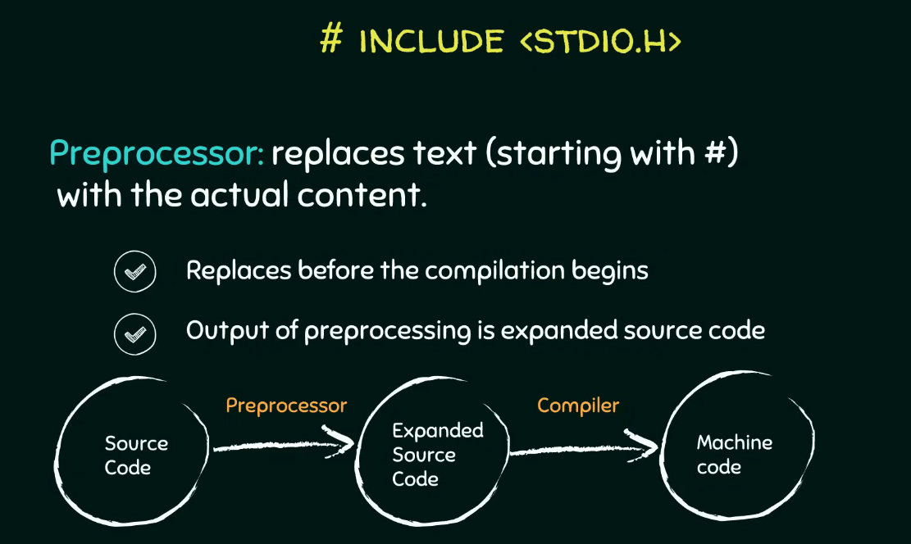
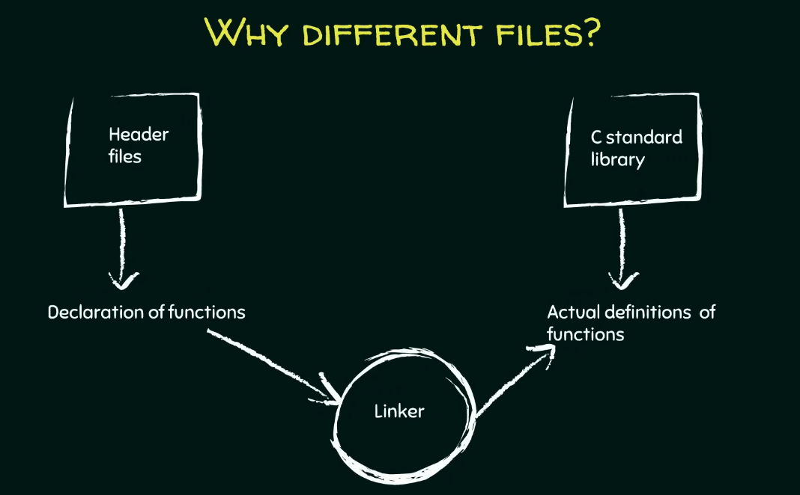
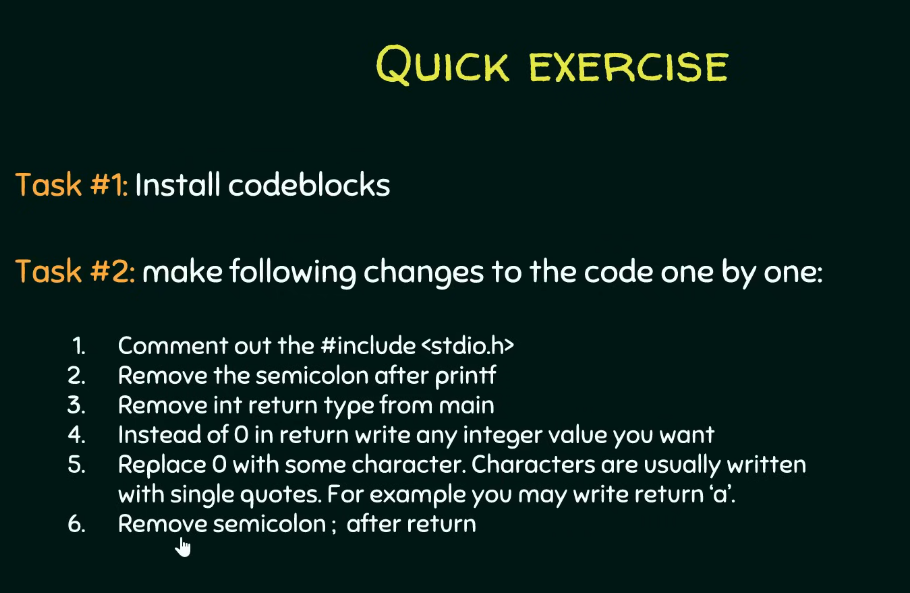
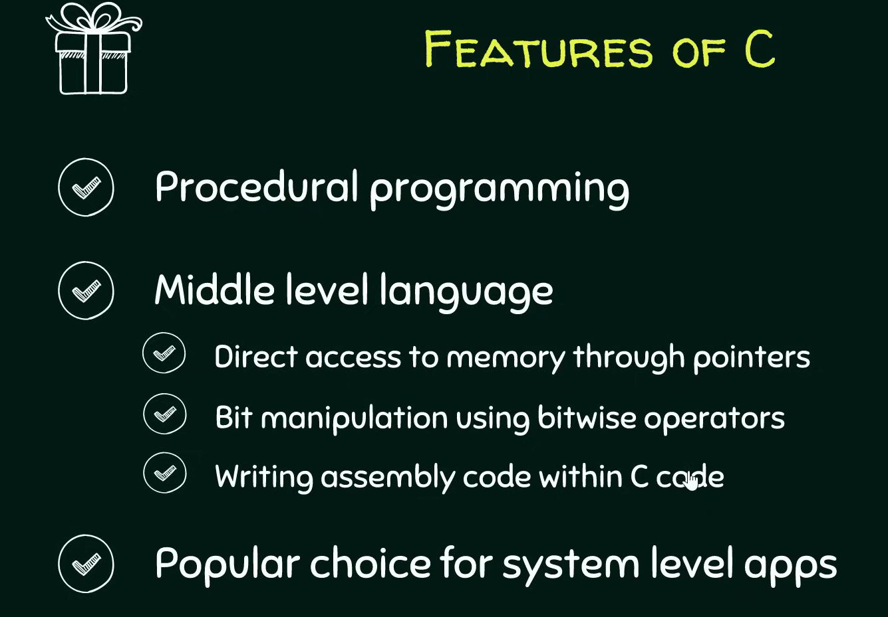
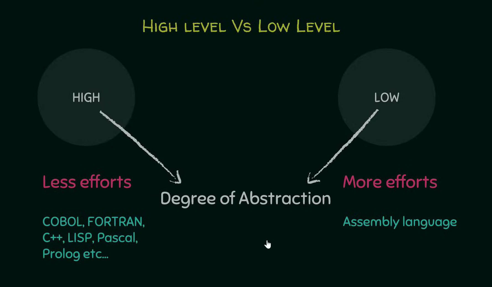
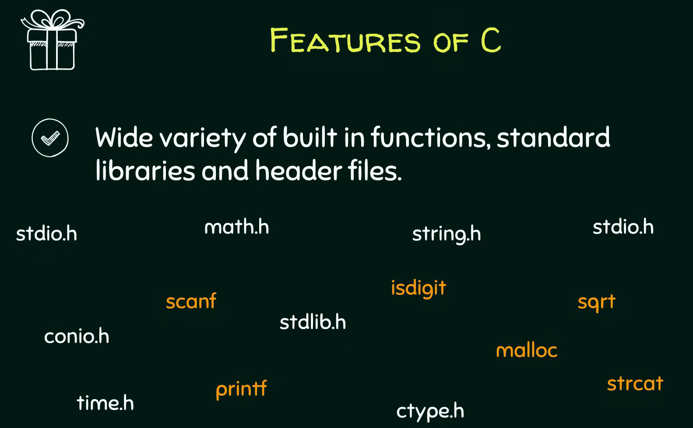

# C Programming – Features & The First C Program

Ref: [C Programming – Features & The First C Program](https://youtu.be/rLf3jnHxSmU?list=PLBlnK6fEyqRggZZgYpPMUxdY1CYkZtARR)

=== "Bangla"

    ### সি প্রোগ্রামিংয়ের মূল ফিচারসমূহ (Core Features of C Programming)

    সি ল্যাঙ্গুয়েজের এমন কিছু জোস ক্যারেক্টারিস্টিকস আছে যা একে কোডিংয়ের জন্য একদম নেক্সট লেভেলে নিয়ে যায়। একদম শুরুতে যে দুইটা মেইন ফিচার মাথায় আসে তা হলো পোর্টেবিলিটি (Portability) আর কম লাইনের কোড (Less lines of code)। চলো সি ল্যাঙ্গুয়েজের ভেতরের আরও কিছু জোস ফিচার এক্সপ্লোর করা যাক:

    1. **প্রসিডিউরাল ল্যাঙ্গুয়েজ (Procedural Language):** সি কে বলা হয় একটা প্রসিডিউরাল ল্যাঙ্গুয়েজ (Procedural Language)। এটার মেইন কনসেপ্ট হলো আপনার একটা বিশাল বড় দানব সাইজের প্রোগ্রামকে (Gigantic program) ছোট ছোট টুকরা প্রোগ্রামে ভাগ করে ফেলা, যেগুলোকে প্রসিডিউর বা ফাংশন (Procedures or Functions) বলে। সব পড়ালেখা বা কাজ যেমন এক রাতে ক্র্যাম (Cram) বা মুখস্থ করা যায় না, ঠিক তেমনি সি ল্যাঙ্গুয়েজও আপনাকে একটা বড় কাজকে ছোট ছোট টাস্কে ডিভাইড করে আলাদাভাবে কাজ করার কমফোর্ট দেয়। সি-তে যা আছে তার সবই আসলে ফাংশনের খেলা (Set of procedures or functions), আর এটাই এই ল্যাঙ্গুয়েজের মেইন ইউএসপি বা ফিচার।
    2. **অ্যাবস্ট্রাকশনের লেভেল (Degree of Abstraction):** হাই লেভেল ল্যাঙ্গুয়েজ (High level language) আর লো লেভেল ল্যাঙ্গুয়েজের (Low level language) মেইন ডিফারেন্সটা আসে এই অ্যাবস্ট্রাকশনের লেভেল (Degree of Abstraction) থেকে। অ্যাবস্ট্রাকশন মানে হলো সিস্টেমের ভেতরের হাবিজাবি ইন্টারনাল ডিটেইলস হাইড করে রাখা (Hiding system level details)। যত বেশি অ্যাবস্ট্রাকশন থাকবে, ইউজারের প্যারা তত কম আর জিনিসটা তত বেশি ইউজার ফ্রেন্ডলি (User friendliness) হবে, কারণ ভেতরে আন্ডার-দ্য-হুড কী হচ্ছে তা নিয়ে আমাদের একদমই ভাবতে হয় না। যেমন ধরো একটা সিম্পল টেক্সট এডিটর (Text editor), আপনি জাস্ট টাইপ করো আর সেভ বাটন (Save button) চাপো, এটি হার্ডডিস্কের ঠিক কোথায় আর কেমনে স্টোর হচ্ছে তা নিয়ে আপনার বিন্দুমাত্র টেনশন করতে হয় না। হাই লেভেল ল্যাঙ্গুয়েজের এক্সাম্পল হলো COBOL, FORTRAN, C++, LIPS, Pascal আর Prolog। অন্য দিকে লো লেভেল অ্যাবস্ট্রাকশন মানে ইউজারের জান শেষ, কম্পিউটারের একদম প্রতিটা ইন্টারনাল ডিটেইলস আপনার মুখস্থ থাকা লাগবে। যেমন অ্যাসেম্বলি ল্যাঙ্গুয়েজ (Assembly language)।
    3. **মিডল লেভেল ল্যাঙ্গুয়েজের সিন (Middle Level Language Classification):** সি ল্যাঙ্গুয়েজকে বলা হয় একটা মিডল লেভেল ল্যাঙ্গুয়েজ (Middle level language)। কারণ এটা একদিকে যেমন মানুষের জন্য কোডিং করা পানির মতো সোজা বানায়, আবার অন্যদিকে সিস্টেম লেভেলের ফিচারে (System level features) ডিরেক্ট অ্যাক্সেস দেয়। এই ইউনিক ফিচারগুলোর মধ্যে আছে:

    * পয়েন্টারস (Pointers) দিয়ে মেমরিতে একদম ডিরেক্ট অ্যাক্সেস পাওয়া (Direct access to memory)।
    * বিটওয়াইজ অপারেটর (Bitwise operators) ব্যবহার করে বিট ম্যানিপুলেশন (Bit manipulation) করা।
    * সি কোডের ভেতরেই সরাসরি অ্যাসেম্বলি কোড (Assembly code) ঢুকিয়ে দেওয়া।

    এইসব জোস ফিচারের কারণেই সি ল্যাঙ্গুয়েজ ওএস বা operating system (Operating systems), কার্নেল (Kernels), আর ডিভাইস ড্রাইভার (Device drivers) বানানোর জন্য সবার ফাস্ট চয়েস। শুধু তা-ই না, গেম (Games), এডিটর (Editors) আর হেভি গ্রাফিক্সের অ্যাপস বানাতেও এটার জুড়ি নেই। সি-তে একগাদা বিল্ট-ইন ফাংশন (Built in functions), স্ট্যান্ডার্ড লাইব্রেরি (Standard libraries) আর হেডার ফাইল (Header files) থাকে, যা কোডারদের লাইফ একদম চিল বা কেক ওয়াক (Cake walk) বানিয়ে দেয়।

    ### প্রথম সি প্রোগ্রামের ব্যবচ্ছেদ (Detailed Structure of the First C Program)

    কোড এফিশিয়েন্টলি লেখার আর রান করার জন্য কোড ব্লকস আইডিই (Code Blocks IDE) এর মতো একটা এনভায়রনমেন্ট বা সমন্বিত উন্নয়ন পরিবেশ (Integrated Development Environment) লাগে। কোডিংয়ের আসল মজা তখনই আসে যখন আপনি নিজে কোড টাইপ করে হাত নোংরা করবে (Get your hands little dirty)। চলো একটা বেসিক সি প্রোগ্রামের প্রতিটা লাইনের পোস্টমর্টেম (Depict) করা যাক:

    1. **কমেন্টস বা কমেন্ট আউট করা (Comments):**
    ডাবল স্ল্যাশ `//` দিয়ে যে ফাস্ট লাইনটা লেখা হয় সেটা হলো কমেন্ট (Comment)। কম্পাইলার (Compiler) একে পাত্তাই দেয় না বা ইগনোর করে। এটা জাস্ট ডেভেলপারদের নিজেদের বোঝার জন্য যে এই কোডটা কনসোল উইন্ডো (Console window) বা ব্ল্যাক স্ক্রিনে ঠিক কী আউটপুট দেখাবে।
    2. **প্রি-প্রসেসর ডিরেক্টিভ (Pre-processor Directive):**
    `#include <stdio.h>` এই জিনিসটা চরম ইম্পর্ট্যান্ট। হ্যাশ `#` সাইনটা মানেই হলো প্রি-প্রসেসর ডিরেক্টিভ (Pre-processor directive)। এটার কাজ হলো আসল কম্পাইলেশন (Actual compilation process) শুরু হওয়ার ঠিক আগে (Prior) ব্যাকগ্রাউন্ডে কিছু প্রসেসিং করা। এর মেইন ডিউটি হলো হ্যাশ সাইনের পরের টেক্সটটুকুকে সরিয়ে সেই ফাইলের আসল কন্টেন্ট এনে বসিয়ে দেওয়া। মানে এই লাইনটাকে সরিয়ে সে stdio.h ফাইলের রিয়েল কোড বসায় আর সোর্স কোডকে (Source code) একটা এক্সপ্যান্ডেড বা বর্ধিত সোর্স কোডে (Expanded source code) রূপান্তর করে। এতে ফাইলের সাইজ অবভিয়াসলি একটু বেড়ে যায়, তারপর এটা কম্পাইলারের কাছে যায় আর কম্পাইলার সোর্স কোডকে মেশিন কোডে (Machine code) কনভার্ট করে।
    3. **হেডার ফাইলসের কাহিনী (Header Files):**
    এই যে `stdio.h` দেখছ, এটার ফুল ফর্ম হলো স্ট্যান্ডার্ড ইনপুট আউটপুট ফাইল (Standard input output file)। আর ফাইলে যে ডট এইচ `.h` আছে, ওটা দিয়ে বোঝায় এটা একটা হেডার ফাইল (Header file)। এই হেডার ফাইলগুলোতে আমরা যেসব ফাংশন ইউজ করব সেগুলোর জাস্ট একটা প্রোটোটাইপ বা ঘোষণা (Prototypes or Declaration) দেওয়া থাকে। যেমন ধরো `stdio.h` ফাইলে `printf` আর `scanf` ফাংশনের ডিক্লেয়ারেশন থাকে। `printf` এর কাজ হলো ব্র্যাকেট বা প্যারেন্থেসিসের (Parenthesis) ভেতরের কন্টেন্ট স্ক্রিনে প্রিন্ট করা, আর `scanf` কাজ করে রান টাইমে (Run time) ইউজারের থেকে ইনপুট নেওয়ার জন্য। আপনি কোডে কী কী ফাংশন ইউজ করতেছ তা কম্পাইলারকে আগেভাগে জানানোর জন্য হেডার ফাইল ইনক্লুড করা মাস্ট।
    4. **ফাংশন আর ভ্যারিয়েবলসের চিল মোড (Functions and Variables):**
    সি-তে আপনি যা-ই লেখো না কেন, ঘুরিফিরি দুইটা মেইন এলিমেন্ট থাকবেই:

    * **সি ফাংশন (C Function):** একগুচ্ছ স্টেটমেন্টের কালেকশন (Group of statements) যা একটা স্পেসিফিক প্রবলেম সলভ করে।
    * ভ্যারিয়েবলস (Variables):Computations বা হিসাব-নিকাশের (Computation) সময় ডেটা বা মান স্টোর করে রাখার পাত্র বা সত্তা (Entities)।

    5. **`main()` ফাংশনের বসগিরি (The main Function Block):**
    `int main()` হলো পুরো কোডের এন্ট্রি পয়েন্ট (Entry point) যেখান থেকে আসল খেলা বা কম্পিউটেশন শুরু হয়। আপনার কোডে হাজারটা ফাংশন থাকতে পারে, কিন্তু স্টার্টিং পয়েন্ট অলওয়েজ এই মেইন ফাংশনই হবে, কম্পাইলার সবার আগে একেই খোঁজে। একটা ফাংশন লেখার বেসিক সিনট্যাক্স (Syntax) হলো ফাস্টে একটা রিটার্ন টাইপ (Return type) থাকবে, তারপর ফাংশনের নাম (Name of the function), এরপর ফার্স্ট ব্র্যাকেটের ভেতর প্যারামিটার লিস্ট (Parameters list) আর সেকেন্ড ব্র্যাকেটের `{}` ভেতর মেইন স্টেটমেন্টস।

    * **রিটার্ন টাইপ (Return type):** মেইন ফাংশনের রিটার্ন টাইপ হলো `int`, যা ইন্টিজার বা পূর্ণসংখ্যার (Integer) শর্ট ফর্ম। এর মানে হলো ফাংশনটা সব কাজ শেষ করে একটা ইন্টিজার ভ্যালু ফেরত দেবে। একদম লাস্টে যে `return 0;` লেখা হয়, ওটার মানে হলো কোডটা যদি সাকসেসফুলি আর ঠিকঠাক এক্সিকিউট করে, তবে ০ রিটার্ন করে ফাংশন থেকে কুইট করো। আর যদি কোনো ঝামেলা হয়, তবে ০ বাদে অন্য কোনো ইন্টিজার রিটার্ন করবে।
    * **ফাংশনের নাম (Function Name):** কোডের রিডাবিলিটি বা পঠনযোগ্যতা (Readability) জোস রাখার জন্য যেকোনো মানানসই নাম দেওয়া যায় যেমন যোগের জন্য `add` নামটা বেস্ট, কিন্তু এই `main` ফাংশনটা আগে থেকেই ফিক্সড বা প্রি-সংজ্ঞায়িত (Pre defined), এটার নাম আপনি কোনোদিনও চেঞ্জ করতে পারবে না।
    * **প্যারামিটার লিস্ট (Parameters List):** ফাংশনের যত ইনপুট আছে সব ফার্স্ট ব্র্যাকেটের ভেতর থাকে। আমাদের এই বেসিক কোডে মেইন ফাংশনের ভেতরে কোনো প্যারামিটার নাই। তবে চাইলে রান টাইমে কমান্ড লাইন আর্গুমেন্টস (Command line arguments) ইউজ করে `arcc` আর `arcv` এর মতো প্যারামিটার পাস করা যায়।

    6. **ফাংশন কল করার টেকনিক (Function Calling):**
    `printf("Neso Academy");` এই লাইনটা দিয়ে মূলত প্রিন্টিং ফাংশনটাকে কল করা হচ্ছে। খেয়াল করো, এটার পর কিন্তু কোনো সেকেন্ড ব্র্যাকেট নাই, জাস্ট একটা সেমিকোলন `;` বসানো আছে। কারণ এই ফাংশনের আসল ডেফিনেশন সি স্ট্যান্ডার্ড লাইব্রেরির (C standard library) ভেতরে কোথাও অলরেডি করা আছে। লাইব্রেরির সুবিধা এটাই যে আমাদের একই কোড বারবার স্ক্র্যাচ থেকে লিখতে হয় না, জাস্ট যখন দরকার ধুম করে কল করে দিলেই হয়। ফাংশন কল করার সময় ক্লোজিং ব্র্যাকেটের পর সেমিকোলন দেওয়া আবশ্যিক, কার্লি ব্রেস নয়।

    ### কম্পাইলেশন আর লিঙ্কিংয়ের মেকানিজম (The Compilation and Linking Mechanism)

    এখন একটা ক্রুশিয়াল কোশ্চেন মাথায় আসতে পারে যে, ফাংশনের প্রোটোটাইপ আর মেইন কোড কেন আলাদা আলাদা ফাইলে রাখা হয়?

    1. **ডিক্লেয়ারেশন আর ডেফিনেশনের সেপারেশন (Separation of Declarations and Definitions):** হেডার ফাইল `stdio.h` এ জাস্ট ফাংশনের ঘোষণা (Declarations) থাকে যা কম্পাইলারকে অ্যালার্ট করে যে আমরা এই ফাংশনগুলো ইউজ করতেছি। আর সি স্ট্যান্ডার্ড লাইব্রেরিতে (C standard library) থাকে `printf` এর মতো ফাংশনের আসল কাজের ডেফিনেশন বা মূল কার্যকরী কোড (Actual definitions)।
    

    2. **লিঙ্কার প্রোগ্রামের ভেলকি (The Linker Program):** প্রি-প্রসেসর যখন প্রোটোটাইপগুলোকে সোর্স কোডের সাথে মিক্স করে একটা এক্সপ্যান্ডেড সোর্স কোড (Expanded source code) বানায়, তখন লিঙ্কার (Linker) নামের একটা প্রোগ্রাম এই প্রোটোটাইপগুলোকে স্ট্যান্ডার্ড লাইব্রেরির আসল কোডের সাথে ম্যাপ (Map) করিয়ে দেয়। লিঙ্কার জাস্ট ডিরেকশন দেখায় বা ম্যাপ করে, প্রি-প্রসেসরের মতো ফাইল কপি-পেস্ট মারে না।
    

    3. **কম্পাইলেশন স্পিড সুপারফাস্ট করা (Compilation Speed Efficiency):** লিঙ্কিংয়ের এই আলাদা প্রসেসের কারণে প্রোগ্রামের কম্পিউটেশন অনেক ফাস্ট হয়। একটু ভাবো, প্রি-প্রসেসর যদি লাইব্রেরির সব ঢাউস ঢাউস কোড টেনে এনে আপনার মেইন কোডে পেস্ট করা শুরু করত, তবে কোডের সাইজ জ্যামিতিক হারে (Exponentially) বেড়ে যেত। তখন কম্পাইলারের ওপর মারাত্মক লোড পড়ত আর কম্পাইলেশনের স্পিড একদম ড্রাস্টিকালি (Drastically) কমে যেত। তাই হেডার ফাইল আর স্ট্যান্ডার্ড লাইব্রেরি আলাদা রাখা একদম ম্যান্ডেটরি।

    ### কোড এক্সিকিউশনের লাইভ ওয়ার্কফ্লো (Program Execution Workflow)

    আইডিই-তে প্রথমবার কোড রান করার সময় **বিল্ড অ্যান্ড রান (Build and Run)** বাটন চাপতে হয়:

    * **বিল্ড (Build):** কম্পাইলারকে সিগন্যাল দেয় আমাদের লেখা সোর্স কোডকে মেশিন কোডে (Machine code) কনভার্ট বা বিল্ড করার জন্য।
    * **运行 (Run):** বিল্ড হওয়া মেশিন কোডটাকে একচুয়ালি এক্সিকিউট করে স্ক্রিনে আউটপুট শো করে।

    যদি কোডে কোনো চেঞ্জ না করে সেকেন্ড টাইম রান করতে চাও, তবে জাস্ট **রান (Run)** বাটন চাপলেই চলে। কিন্তু কোডে একটুও এডিট করলে আবার নতুন করে বিল্ড অ্যান্ড রান করতে হবে। কোডে কোনো ভুল বা বাগ থাকলে তা নিচের **বিল্ড মেসেজেস (Build Messages)** ট্যাবে ক্রিস্টাল ক্লিয়ার দেখা যায়।

    

=== "English"

    ### Core Features of C Programming

    

    C programming language holds several fundamental characteristics that make it highly efficient for software development. The most important initial features are portability (বহনযোগ্যতা) and less lines of code (কম লাইনের কোড)। Let us explore the advanced core features details inside C language:

    1. **Procedural Language (পদ্ধতিগত ভাষা):** C is defined as a procedural language. The primary concept here is dividing your gigantic (বিশাল) program into much smaller programs called procedures or functions (ফাংশন)। Instead of attempting to cram all execution steps into one session, the language allows developers to divide a task into smaller tasks and work on them separately. Everything in C is nothing but a set of procedures or functions, which serves as the main feature of the language.

    2. **Degree of Abstraction (বিমূর্ততার মাত্রা):** The distinction (পার্থক্য) between high level language and low level language points directly to the degree of abstraction. Abstraction means hiding system level details (সিস্টেম স্তরের জটিল বিবরণ লুকিয়ে রাখা)। A high degree of abstraction means less efforts to the user or more user friendliness (ব্যবহারকারী বান্ধব) because we do not have to worry about what is happening inside. For example, in a simple text editor, you are just typing out the text and hitting the save button without worrying about how it is getting stored or where it is getting stored. Examples of high level languages are COBOL, FORTRAN, C++, LIPS, Pascal, and Prolog. Conversely, a lower degree of abstraction means more efforts to the user, where you have to know each and every internal detail about the computer. The example of a low level language is Assembly language.

    

    3. **Middle Level Language Classification (মধ্যম স্তরের ভাষা):** C language is called a middle level language because it does make programming simpler for human beings, but on the other hand, it also allows us to access system level features. These unique system level features include:

    * Direct access to memory through pointers (পয়েন্টার).
    * Bit manipulation (বিট স্তরে পরিবর্তন) using bitwise operators.
    * Writing assembly code within C code.

    Because of these unique features, C became a popular choice for developing both system level applications like kernels (কার্নেল), device drivers (ডিভাইস ড্রাইভার), operating systems (অপারেটিং সিস্টেম) and various software applications like games, editors, and other graphic rich applications. C offers a wide variety of built in functions, standard libraries, and header files, which makes programming a cake walk (অত্যন্ত সহজসাধ্য বিষয়) for programmers.

    

    ### Detailed Structure of the First C Program

    To create and execute C programs efficiently, an Integrated Development Environment (সমন্বিত উন্নয়ন পরিবেশ) like Code Blocks IDE is utilized. Programming becomes more interesting when you get your hands little dirty (ব্যবহারিক কাজে যুক্ত হওয়া) by executing code. Let us analyze what each line depicts (চিত্রায়িত করে/বর্ণনা করে) in a basic C program:

    1. **Comments (মন্তব্য):**
    The top line written using a double slash `//` is a comment. The compiler (কম্পাইলার) usually ignores the comments. They are meant solely for the users or developers for their better understanding, such as explaining what the program will print onto the console window (কন্ট্রোল স্ক্রিন বা ব্ল্যাক স্ক্রিন).
    2. **Pre Processor Directive (প্রি প্রসেসর নির্দেশিকা):**
    The command `#include <stdio.h>` is a vital element. The hash symbol `#` denotes a pre processor directive. The pre processor job is processing done prior (পূর্বে) to the actual compilation process. Its job is to replace the textual content which is followed by the hash symbol with the actual content of the file. It replaces the line `#include <stdio.h>` with the actual file content, converting the source code (উৎস কোড) into an expanded source code (বর্ধিত উৎস কোড)। This process obviously increases the size of the actual content before sending it to the compiler, which subsequently converts source code to machine code.
    3. **Header Files (হেডার ফাইল):**
    The component `stdio.h` stands for standard input output file, and the `.h` extension indicates it is a header file. Header files usually consist of prototypes (আদিরূপ) or declaration (ঘোষণা) of the functions that we need. For example, `stdio.h` consists of declarations of functions like `printf` and `scanf`. The `printf` function is used to print the contents present inside its parenthesis (বন্ধনী), and `scanf` is used to take user input at run time (প্রোগ্রাম চলার সময়). Including the header file is important to tell the compiler which functions you are going to use.
    4. **Functions and Variables (ফাংশন এবং চলক):**
    Whatever code you write in C always consists of two important elements:

    * **C Function:** Consists of a group of statements that are intended to solve a particular problem.
    * **Variables:** The entities (সত্তা সমূহ) used to store values which are used during computation (হিসাব নিকাশ).

    5. **The `main()` Function Block:**
    The `int main()` expression is the entry point (প্রবেশ বিন্দু) from where the actual computation begins. You may have several functions inside your program, but the starting point is always the main function, and the compiler looks forward to this function. The basic syntax of defining a function requires a return type, a name of the function, a parameters list enclosed within round brackets, and statements enclosed within curly braces `{}`.

    * **Return Type:** The return type of the main function is `int`, which is the short name of integer (পূর্ণসংখ্যা)। This means the function, after completing all its statements, will return an integer value. The last statement `return 0;` indicates that if your statements complete execution successfully, then return integer 0 and exit from the function. Else if something else goes wrong, it will return some other integer other than 0.
    * **Function Name:** You can choose any name of your choice for custom functions to improve readability (যেমন যোগ করার জন্য `add` নাম রাখা যুক্তিযুক্ত), but the `main` function is pre defined (পূর্ব সংজ্ঞায়িত) and you cannot change that name.
    * **Parameters List:** The inputs to your function are enclosed within round brackets. In this basic example, the main function does not have any parameters. However, you can optionally add parameters like `arcc` and `arcv` whose values are provided at run time using command line arguments.

    6. **Function Calling:**
    The statement `printf("Neso Academy");` calls the printing function. There are no curly braces after this; instead, it is followed by a semicolon `;`. This is because the function is pre defined somewhere in the C standard library. The advantage of such a library is that we do not have to write down the codes of functions again and again; instead, we simply call them whenever needed. When calling a function, you must put a semicolon at the end of the closing bracket instead of curly braces.

    ### The Compilation and Linking Mechanism

    An important structural question is why C requires different files, one for storing the prototypes of the functions and another for storing the actual code:

    1. **Separation of Declarations and Definitions:** The header file `stdio.h` consists of only the declarations of the functions to tell the compiler which functions are going to be used. On the other hand, the C standard library consists of the actual definitions (মূল কার্যকরী কোড) of the functions like `printf`.
    2. **The Linker Program (লিঙ্কার):** The pre processor combines function declarations with the source code to produce the expanded source code. After that, a program called the linker actually maps down the prototypes mentioned by the pre processor to the actual codes written in the standard library. The linker simply maps and does not copy paste the content like the pre processor.
    3. **Compilation Speed Efficiency:** This separate process of linking makes the computation of the program faster. Imagine if the pre processor did the job of copying all the actual definitions of the library functions into the source code. It would increase the size of the code exponentially (জ্যামিতিক হারে)। The compiler would have to do a massive amount of work to compile the program, causing the speed of compilation to fall drastically (মারাত্মকভাবে)। Therefore, maintaining header files and standard libraries separately is essential.

    ### Program Execution Workflow

    When executing the code for the first time in an IDE, the **Build and Run** operation is required:

    * **Build:** Requests the compiler to build the machine code for the written source code.
    * **Run:** Runs the generated machine code and produces the output on the console window.
    If you are executing the code for the second time without making any changes, clicking only the **Run** button is sensible. If you make any changes to the code, you must build it again and run. If there are any compilation errors, they are shown in the window below under the **Build Messages** tab.
