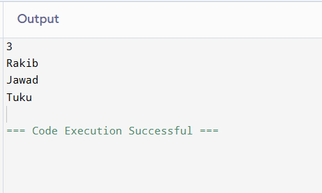
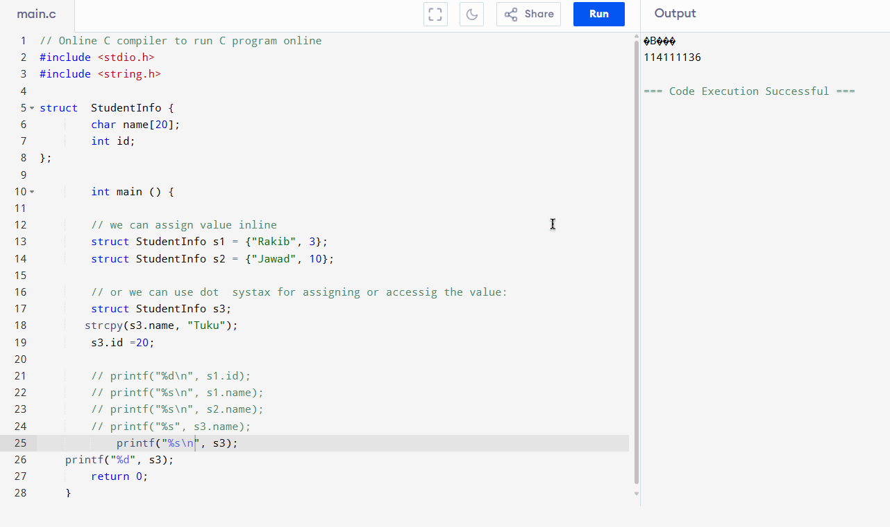

# `struct` in C

Structure also called `struct` is a data type in C are a way to group several related variables into one place.

Each variable in the structure is known as a **member** of the structure.
Unlike an array, a structure can contain many different data types (`int`, `float`, `char`, etc.).

### Create a Structure

```c
    struct  StudentInfo {        // Structure declaration
        char[] name;      // Member (char variable)
        int id;             // Member (int variable)
    }
```

To access the structure, you must create a variable of it.

```c
struct  StudentInfo {
    char name[20];
    int id;
};

int main () {
    struct StudentInfo s1 = {"Rakib", 003};
    struct StudentInfo s2 = {"Jawad", 010};

    return 0;
}
```

!!! warning "মনে রাখতে হবেঃ"

    `struct` decalaration এর পরে কিন্তু অবশ্যই এটার শেষে semi-colon  `;` দিতে হবে। কারণ এটা অনেকটা একটা variable এর মতোই। তাই close করতে হবে।

### Access Structure Members

To access structure members we use dot (`.`) syntax.

### What About Strings in Structures?

Remember that strings in C are actually an array of characters, and unfortunately, you can't assign a value to an array like this:

However, there is a solution for this! You can use the `strcpy()` function and assign the value to `s3.StudentInfo`, like this:

=== "Code"

    ```c

    // Online C compiler to run C program online
    #include <stdio.h>
    #include <string.h>

    struct StudentInfo {
    char name[20];
    int id;
    };

        int main () {

        // we can assign value inline
        struct StudentInfo s1 = {"Rakib", 3};
        struct StudentInfo s2 = {"Jawad", 10};

        // or we can use dot  systax for assigning or accessig the value:
        struct StudentInfo s3;
        strcpy(s3.name, "Tuku");
        s3.id =20;

        printf("%d\n", s1.id);
        printf("%s\n", s1.name);
        printf("%s\n", s2.name);
        printf("%s", s3.name);
        return 0;
    }
    ```

=== "Results"

    

### Simpler Syntax

You can also assign values to members of a structure variable at declaration time, in a single line.

Just insert the values in a comma-separated list inside curly braces {}. Note that you don't have to use the strcpy() function for string values with this technique:

### Copy Structures

You can also assign one structure to another. In the following example, the values of s1 are copied to s2:

```c
struct StudentInfo {
char name[20];
int id;
};

    int main () {

    // we can assign value inline
    struct StudentInfo s1 = {"Rakib", 3};
    struct StudentInfo s2 = {"Jawad", 10};

    s1=s2;

    return 0;
}
```

### Garbage value printing:

If we want to directly print a structure variable directly, the first problem we face is that we don't have any format specifier for that like: `%d`, `%f`, `%s` etc. Even though, if we try prining the structure with one of these format specifiers, then we see garbage values.

=== "Code"
    ```c

    #include <stdio.h>
    #include <string.h>

    struct StudentInfo {
    char name[20];
    int id;
    };

        int main () {

        // we can assign value inline
        struct StudentInfo s1 = {"Rakib", 3};
        struct StudentInfo s2 = {"Jawad", 10};
        
        struct StudentInfo s3;
        strcpy(s3.name, "Tuku");
        s3.id =20;

        printf("%s", s3);
        printf("%d", s3);

        printf()
        return 0;
    }
    ```
=== "Result"
    
    

