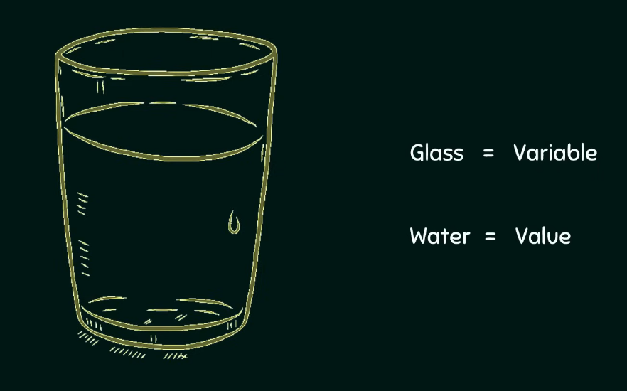
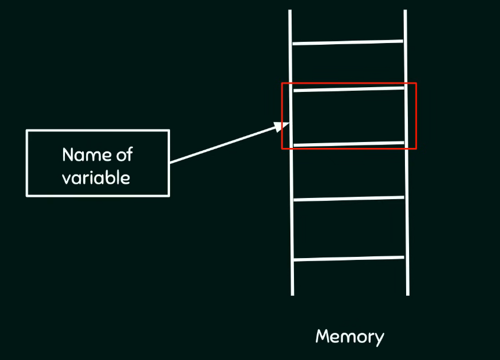
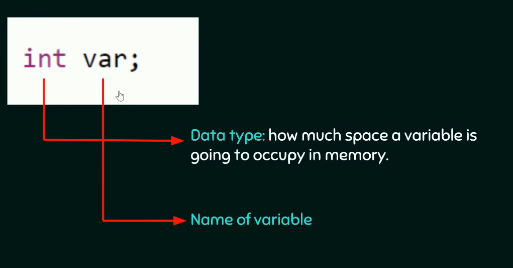
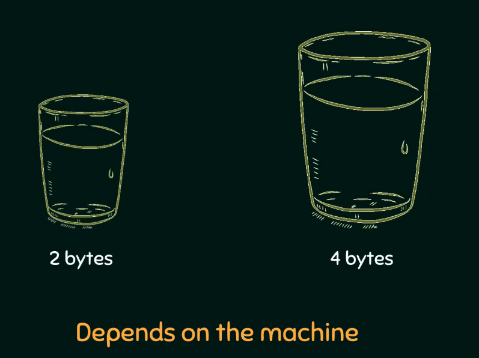
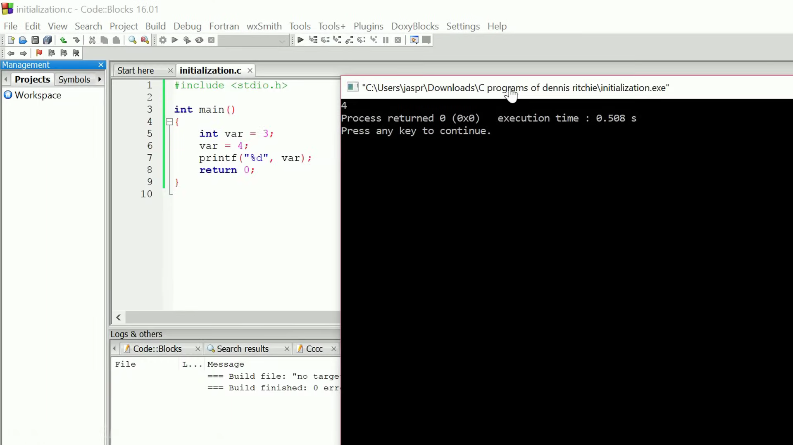
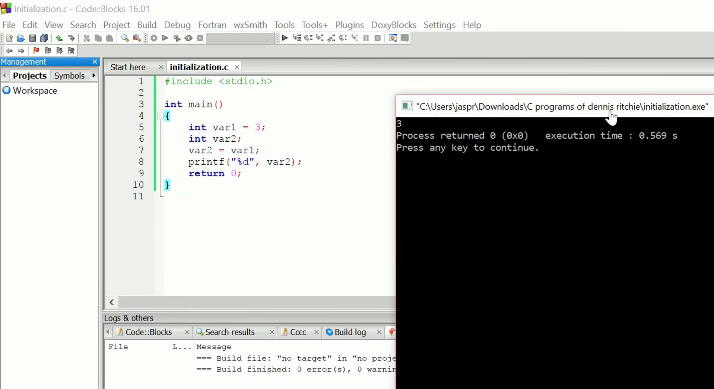
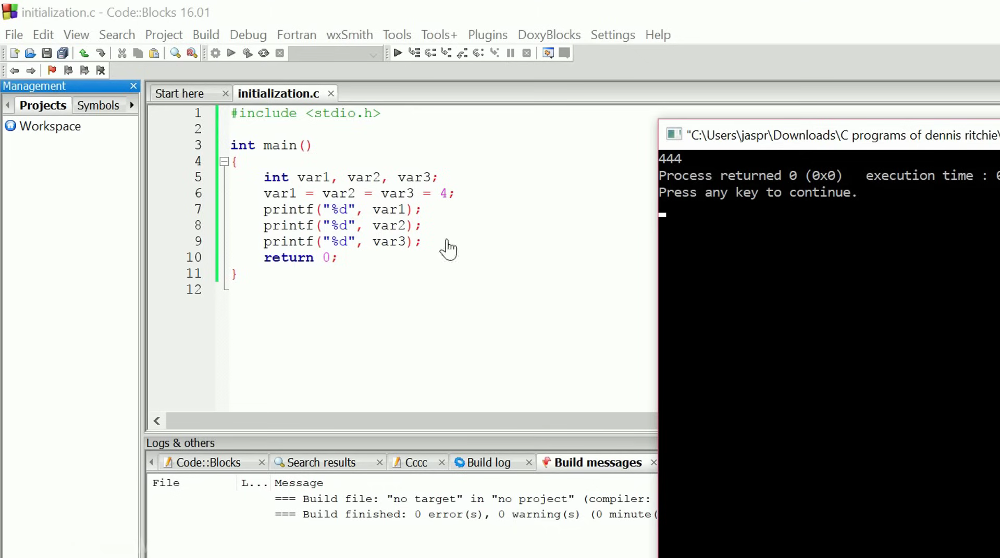

# Introduction to Variables


=== "Bangla"


    ### ভ্যারিয়েবলের বেসিক ফান্ডা (Concept of Variables)

    একটা ভ্যারিয়েবল (Variable)-কে তুমি খুব সহজেই এক গ্লাস পানির অ্যানালজি (Analogy) দিয়ে বুঝতে পারো। আমরা যেমন পানি খাওয়ার জন্য গ্লাসের ভেতর পানি রাখি, ঠিক তেমনি একটা ভ্যারিয়েবল (Variable) প্রোগ্রামের ভেতর কোনো ডেটা বা মান (Value) স্টোর করে রাখার জন্য কাজ করে। ভ্যারিয়েবলে একবার মান স্টোর করার পর তুমি তোমার পুরো প্রোগ্রামে ওই মান যেখানে ইচ্ছা ফ্রিলি ইউজ করতে পারবে।
    

    
    বাস্তবে ভ্যারিয়েবল হলো সিম্পল কিছু নাম (Names) যা মেমরির কোনো একটা নির্দিষ্ট লোকেশন বা মেমোরি লোকেশন (Memory location)-কে পয়েন্ট করে। সি ল্যাঙ্গুয়েজের ইনভেন্টর বা আবিষ্কারককে একটা থ্যাংকস দেওয়াই লাগবে, কারণ উনি আমাদের জন্য মেমরিতে মান সেভ করার কাজটা জাস্ট নিজেদের পছন্দের নাম ইউজ করেই পানির মতো সোজা বানিয়ে দিয়েছেন। তোমার ভ্যালু মেমরির ঠিক কোন ঠিকানায় বা এড্রেসে স্টোর হচ্ছে তা নিয়ে তোমার বিন্দুমাত্র প্যারা নেওয়ার দরকার নাই। তোমার কাজ হলো জাস্ট একটা সুন্দর নাম দেওয়া, আর ব্যাকগ্রাউন্ডে sistema নিজে থেকেই একে মেমোরি লোকেশনের সাথে লিংক করে নেবে।
    
    ### ভ্যারিয়েবল ডিক্লেয়ারেশন বনাম ডেফিনিশন (Variable Declaration versus Definition)

    পরীক্ষার জন্য ভ্যারিয়েবলের দুইটা ক্রুশিয়াল টার্ম একদম ক্রিস্টাল ক্লিয়ার রাখা লাগবে:

    1. **ভ্যারিয়েবল ডিক্লেয়ারেশন (Declaration of a Variable):** প্রোগ্রামে কোনো ভ্যারিয়েবল ইউজ করার আগে তাকে অবশ্যই ডিক্লেয়ার (Declare) করতে হবে। ডিক্লেয়ারেশন মানে হলো কম্পাইলার (Compiler)-এর কাছে ওই ভ্যারিয়েবলের সব প্রপার্টিজ বা বৈশিষ্ট্য অ্যানাউন্স (Announce) করা বা ঘোষণা দেওয়া। প্রপার্টিজ বলতে এখানে ভ্যারিয়েবলের নাম (Name) কী হবে আর সে মেমরিতে কতটুকু সাইজ (Size) নেবে তা বোঝায়।
    2. **ভ্যারিয়েবল ডেফিনিশন (Definition of a Variable):** ডেফিনিশন মানে হলো ভ্যারিয়েবলের জন্য মেমরিতে একচুয়াল জায়গা বা মেমোরি স্পেস অ্যালোকেট (Allocating memory) করা।

    বেশিরভাগ সময় সি ল্যাঙ্গুয়েজে ডিক্লেয়ারেশন আর ডেফিনিশন একই সাথে করা হয়ে যায়। তবে সব ক্ষেত্রে কিন্তু এমনটা হয় না। ভ্যারিয়েবলের সাথে তুমি কী ধরনের মডিফায়ার (Modifiers) ইউজ করতেছ তার ওপর এটা ডিপেন্ড করে।
    

    ### সিনট্যাক্স এবং মেমোরি অ্যালোকেশন (Syntax and Memory Allocation)

    একটা ভ্যারিয়েবল ডিক্লেয়ার করার বেসিক সিনট্যাক্স (Syntax) হলো প্রথমে ডেটা টাইপ (Data type) লিখতে হবে এবং তারপর ভ্যারিয়েবলের নাম দিতে হবে। যেমন:

    ```c
    int var;
    ```

    ভ্যারিয়েবলের নাম হলো `var` আর এটার ডেটা টাইপ হলো `int` বা ইন্টিজার (Integer)। ডেটা টাইপের মেইন কাজই হলো কম্পাইলারকে বলে দেওয়া যে এই ভ্যারিয়েবলটা মেমরিতে ঠিক কতটা জায়গা দখল করতে যাচ্ছে।

    কোডে `int var;` লেখার মানেই হলো তুমি ভ্যারিয়েবলটা ডিক্লেয়ার করার পাশাপাশি কম্পাইলারকে রিকোয়েস্ট করতেছ এর জন্য মেমোরি অ্যালোকেট (Allocate memory) করতে। এই স্টেটমেন্টের শেষে একটা সেমিকোলন `;` বসানো একদম ম্যান্ডেটরি বা বাধ্যতামুলক। কারণ কম্পাইলার এই সেমিকোলন দেখেই একটা স্টেটমেন্ট থেকে আরেকটা স্টেটমেন্ট আলাদা করে। তাই সেমিকোলন দিতে ভুলে গেলে কোডে এরর (Compilation error) খাবে।

    
    ভ্যারিয়েবল মেমরিতে ২ বাইট (2 bytes) জায়গা নেবে নাকি ৪ বাইট (4 bytes) জায়গা নেবে তা পুরোপুরি ডিপেন্ড করে তুমি কোন সিস্টেম বা ওএস (System architecture)-এ কাজ করতেছ তার ওপর। কোডার হিসেবে তোমার জাস্ট ডিক্লেয়ারেশন আর ডেফিনিশনে ফোকাস করলেই চলবে, মেমরির ভেতরে কতটুকু স্পেস অ্যালোকেশন হচ্ছে তা নিয়ে মাথা ঘামানোর কোনো দরকার নাই।

    ### ভ্যারিয়েবল ইনিশিয়ালাইজেশন এবং রি-অ্যাসাইনমেন্ট (Variable Initialization and Re-assignment)

    ভ্যারিয়েবল ডিক্লেয়ার করার সময়ই যদি তুমি তাতে কোনো মান বা ভ্যালু অ্যাসাইন (Assign) করে দাও, তবে সেই প্রসেসকে ইনিশিয়ালাইজেশন (Initialization) বলে। যেমন:

    ```c
    int var = 3;
    ```

    ইনিশিয়ালাইজেশন করার মানে এই না যে এই ভ্যালু সারা জীবনের জন্য ফিক্সড হয়ে গেল। তুমি চাইলে কোডের যেকোনো জায়গায় এই মান যখন খুশি চেঞ্জ করতে পারো। এই কারণেই এই জিনিসের নাম দেওয়া হয়েছে ভ্যারিয়েবল, যা এসেছে "Vary" শব্দ থেকে, যার মানে হলো যা সময়ের সাথে সাথে পরিবর্তিত বা চেইঞ্জ হতে পারে। এটা হলো কনস্ট্যান্ট (Constant)-এর একদম অপজিট বা উল্টো জিনিস, যা একবার ডিফাইন করলে আর সকলেই চেইঞ্জ করা যায় না।

    নিচের কোডের ওয়ার্কফ্লোটা খেয়াল করো:

    ```c
    #include <stdio.h>
    int main() {
        int var = 3; // ইনিশিয়ালাইজেশন (Initialization)
        var = 4;     // রি-অ্যাসাইনমেন্ট (Re-assignment)
        printf("%d", var);
        return 0;
    }
    ```
    
    এই কোডটা যখন আমরা বিল্ড অ্যান্ড রান (Build and Run) করব, তখন আমাদের ব্ল্যাক কনসোল উইন্ডো (Console window)-তে আউটপুট আসবে 4। অর্থাৎ আগের ৩ মানটা সাকসেসফুলি আপডেট হয়ে ৪ হয়ে গেছে।

    ### কিছু ক্রিটিক্যাল রুলস এবং রেস্ট্রিকশন (Critical Rules and Constraints)

    1. **ইললিগাল রি-ডেফিনিশন (Illegal Redefinition):** কোডে যখন মান আপডেট করার জন্য `var = 4;` লেখা হয়েছে, তখন কিন্তু সামনে আবার নতুন করে `int` ডেটা টাইপ লেখা হয় নাই। মেমোরি অ্যালোকেশন ভ্যারিয়েবলের জন্য জাস্ট একবারই হয়। একই ব্লকের ভেতর যদি তুমি আবার `int var = 4;` লেখো, তার মানে তুমি একই নামের জন্য ওয়ান মোর টাইম মেমোরি স্পেস চাচ্ছ, যা সি ল্যাঙ্গুয়েজে একদম ইললিগাল বা অবৈধ (Illegal)।
    2. **একক ডেফিনিশন রুল (Single Definition Rule):** প্রতিটা ভ্যারিয়েবল তার নির্দিষ্ট স্কোপ বা ব্লকের ভেতর জাস্ট একবারই ডিফাইন করা যাবে, তবে তাকে ডিফরেন্ট অ্যাসাইনমেন্ট (Different assignment) দিয়ে মাল্টিপল টাইমস ইউজ করা যাবে। এই `main()` ফাংশন ব্লকের ভেতর তুমি কখনোই সেম নামে একাধিক ভ্যারিয়েবল ডিফাইন করতে পারবে না।
    3. **ফরম্যাট স্পেসিফায়ার (Format Specifier):** কোডের `printf("%d", var);` অংশে থাকা `%d` হলো একটা ফরম্যাট স্পেসিফায়ার (Format specifier)। এটা ইন্টিজারের জন্য ইউজ করা হয় এবং কম্পাইলারকে নির্দেশ দেয় ভ্যারিয়েবলের ভেতরের কারেন্ট কন্টেন্ট বা মান স্ক্রিনে প্রিন্ট করতে।

    ### অ্যাডভান্সড অ্যাসাইনমেন্ট অপারেশনস (Advanced Assignment Operations)

    1. **ভ্যারিয়েবল টু ভ্যারিয়েবল অ্যাসাইনমেন্ট (Assigning a Variable to another Variable):** কোনো ডিরেক্ট কনস্ট্যান্ট ভ্যালু অ্যাসাইন না করে তুমি চাইলে একটা ভ্যারিয়েবলের মান আরেকটা ভ্যারিয়েবলের ভেতর অ্যাসাইন করতে পারো। যেমন:

    ```c
    int var1 = 3;
    int var2 = var1;
    ```
    

    এখানে ডান পাশে ভ্যারিয়েবলের নাম `var1` লেখার মানেই হলো তুমি তার ভেতরের কনস্ট্যান্ট মান (যা হলো ৩) টেনে এনে `var2` এর ভেতর অ্যাসাইন করতেছ। এখন `var2` প্রিন্ট করলে আউটপুট ৩ ই আসবে।

    2. **এক লাইনে মাল্টিপল ভ্যারিয়েবল অপারেশন (Single Line Multi Variable Operations):** আলাদা আলাদা লাইনে ভ্যারিয়েবল ডিক্লেয়ার আর ডিফাইন না করে কোডের ক্লিননেস বা রিডাবিলিটি বাড়ানোর জন্য সেম ডেটা টাইপের একাধিক ভ্যারিয়েবল জাস্ট এক লাইনেই হ্যান্ডেল করা যায়। যেমন:

    ```c
    int var1 = 4, var2 = 4, var3 = 4;
    ```
    
    
    এখানে একই লাইনে সব ভ্যারিয়েবলকে সেম ভ্যালু দিয়ে অ্যাসাইন করা হয়েছে। এখন এদেরকে যদি `printf` দিয়ে তিনবার প্রিন্ট করা হয়, তবে আউটপুট উইন্ডোতে `4 4 4` দেখতে পাবে, কারণ তিনটা আলাদা ভ্যারিয়েবলই এখন একই মান হোল্ড করতেছে।


=== "English"


    ### Concept of Variables

    A variable can be understood through the simple analogy (সাদৃশ্য) of a glass of water. Just as a glass is used to store water for drinking, a variable is used to store some specific value inside a program. Once the value is stored inside the variable, you are fully free to use this value anywhere throughout your program execution.

    In reality, variables are simply user defined names that point to some specific memory location. The inventor of the C language made it highly convenient (সুবিধাজনক) for programmers by allowing us to store values in the memory by using any name of our choice. You do not need to worry about the exact location or the memory address where your value is being stored. Your only task is to provide a valid name, and the system internally points it to a memory location.

    ### Variable Declaration versus Definition

    There are two distinct concepts regarding variables that you must understand carefully for your examinations:

    1. **Declaration of a Variable:** You must always declare a variable before using it in your program. Declaration simply means announcing the properties (বৈশিষ্ট্যসমূহ) of the variable to the compiler. By properties, we mean specifying what will be the name of the variable and what will be the size of the variable.
    2. **Definition of a Variable:** Definition means the actual allocation (বরাদ্দকরণ) of memory space to that specific variable. 

    Most of the time, declaration and definition are done at the exact same time in C. However, this is not always the case because it depends heavily on the modifiers (পরিবর্তনকারী) you mention with the variables.

    ### Syntax and Memory Allocation

    To declare a variable, the syntax requires specifying the data type followed by the variable name. For example:

    ```c
    int var;
    ```

    Here, the name of the variable is `var` and its data type is `int` (integer). Data type simply tells the compiler how much space a variable is going to occupy in the memory.

    By writing `int var;`, you are declaring the variable and simultaneously requesting the compiler to allocate memory for it. It is absolutely mandatory (বাধ্যতামূলক) to put a semicolon `;` at the end of this statement. The compiler uses the semicolon to separate one statement from another, so missing it will cause a compilation error.

    The exact memory size allocated depends entirely on the data type and the underlying system architecture (সিস্টেমের গঠন) you are working on. For instance, an integer data type may take either 2 bytes of memory or 4 bytes of memory, depending purely on the system. As a programmer, you only need to concentrate on the declaration and definition rather than worrying about the exact space allocation details.

    ### Variable Initialization and Re-assignment

    When you assign a value to a variable at the very time of its declaration itself, the process is called initialization (প্রারম্ভিকীকরণ). For example:

    ```c
    int var = 3;
    ```

    Initialization does not mean that the value of the variable becomes permanent or fixed. You can easily change this value later anywhere in your code. This is where the word variable gets its actual meaning, as it comes from the word "vary", meaning something that can change or vary over time. This is completely opposite to a constant (ধ্রুবক), which never changes once defined.

    Consider the following program workflow:

    ```c
    #include <stdio.h>
    int main() {
        int var = 3; // Initialization
        var = 4;     // Re-assignment
        printf("%d", var);
        return 0;
    }
    ```

    When we execute this code using the Build and Run process, the output displayed on the black console window will be 4. The initial value 3 is successfully updated to 4. 

    ### Critical Rules and Constraints

    1. **Illegal Redefinition:** Notice that during the re-assignment statement `var = 4;`, the data type `int` is not written again. Memory is allocated to a variable only once. Writing `int var = 4;` again in the same block means you are trying to allocate memory again for an already existing name, which is completely illegal (অবৈধ) in C. 
    2. **Single Definition Rule:** Each variable must be defined only once within its scope (আওতা), but it can be used multiple times with different assignments throughout the program. Within the same `main()` function block, you cannot define multiple variables having the exact same name.
    3. **Format Specifier:** In the statement `printf("%d", var);`, the `%d` is a format specifier (ফরম্যাট স্পেসিফায়ার) used specifically for integers. It tells the compiler to print the current textual or numerical content stored inside the integer variable onto the screen.

    ### Advanced Assignment Operations

    1. **Assigning a Variable to another Variable:** Instead of assigning a direct constant value like 3 or 4, you can assign the value of one variable to another variable. For example:

    ```c
    int var1 = 3;
    int var2 = var1;
    ```

    Writing the name of a variable on the right side means you are fetching its current constant value (which is 3) and assigning it to `var2`. Printing `var2` will correctly yield 3 as the output.

    2. **Single Line Multi Variable Operations:** Instead of defining and declaring variables in separate individual lines, you can declare and define multiple variables of the same data type in a single line to improve code cleanliness. For example:

    ```c
    int var1 = 4, var2 = 4, var3 = 4;
    ```

    If you assign them the same value and print them three times using `printf`, the console window will output `4 4 4` as expected, because all three separate variables hold the identical value.

